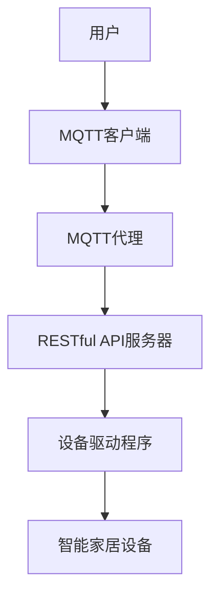

                 

关键词：MQTT协议，RESTful API，智能家居，设备互操作性，物联网

摘要：本文将深入探讨基于MQTT协议和RESTful API的智能家居设备互操作性研究。首先，我们将介绍MQTT协议和RESTful API的基本概念和历史背景。接着，详细讨论智能家居设备互操作性的重要性，并分析现有的解决方案和挑战。随后，本文将介绍MQTT协议和RESTful API在智能家居设备互操作性中的具体应用场景，并通过实际项目实践展示如何实现这些协议的结合。最后，我们将探讨智能家居设备互操作性的未来发展趋势和面临的挑战，并提供相关的学习资源和开发工具推荐。

## 1. 背景介绍

智能家居（Smart Home）是指通过自动化技术和物联网（IoT）技术，使家庭设备互联互通，提供更舒适、便捷、安全和节能的居住环境。随着物联网技术的发展，智能家居设备种类日益丰富，如智能灯泡、智能插座、智能门锁、智能摄像头等。然而，由于不同设备制造商采用不同的通信协议和接口标准，导致设备之间的互操作性成为一大挑战。

### 1.1 MQTT协议

MQTT（Message Queuing Telemetry Transport）是一种轻量级的消息队列协议，专门为远程传感器和控制设备设计。它的核心特点包括简单、可靠、低功耗和跨平台。MQTT协议采用发布/订阅（publish/subscribe）模式，使得设备能够高效地传输和接收数据。MQTT协议具有以下优点：

- **低带宽需求**：MQTT协议采用二进制格式，数据传输效率高，适合在低带宽环境中使用。
- **可靠传输**：MQTT协议支持QoS（质量服务）级别，可以确保消息的可靠传输。
- **跨平台**：MQTT协议支持多种编程语言和操作系统，便于在不同设备和平台之间实现互操作性。

### 1.2 RESTful API

RESTful API（Representational State Transfer Application Programming Interface）是一种基于HTTP协议的接口设计规范，用于不同系统之间的数据交换和功能调用。RESTful API具有以下特点：

- **无状态**：每次请求都是独立的，不会影响后续请求的处理。
- **统一接口**：采用统一的接口设计和命名规范，便于理解和维护。
- **基于文本**：使用JSON或XML等文本格式传输数据，便于处理和调试。

### 1.3 智能家居设备互操作性

智能家居设备互操作性是指不同设备之间能够无缝地交换数据和协同工作，从而提供更加智能、便捷的居住体验。智能家居设备互操作性的重要性体现在以下几个方面：

- **提高用户体验**：通过设备之间的互操作，可以实现自动化场景和远程控制，提高用户的生活质量。
- **降低开发成本**：采用标准化的通信协议和接口，可以降低设备的开发难度和成本。
- **促进市场竞争**：互操作性使得不同品牌的设备能够相互兼容，促进智能家居市场的竞争和发展。

## 2. 核心概念与联系

### 2.1 MQTT协议原理

MQTT协议采用发布/订阅模式，消息发布者（publisher）将消息发送到MQTT代理（broker），而消息订阅者（subscriber）从MQTT代理接收消息。MQTT协议的关键概念包括：

- **主题（Topic）**：消息的标识符，用于指定消息的发送和接收目的地。
- **QoS（质量服务）**：消息传输的质量保证级别，包括QoS 0（至多一次）、QoS 1（至少一次）和QoS 2（恰好一次）。
- ** retains（保留）**：MQTT代理保存最后一条发布到指定主题的消息，以便订阅者重新获取。

### 2.2 RESTful API原理

RESTful API采用HTTP协议的GET、POST、PUT、DELETE等请求方法，实现数据的查询、创建、更新和删除等操作。RESTful API的关键概念包括：

- **资源（Resource）**：API中的数据实体，通常以URL表示。
- **请求方法（Method）**：用于指定对资源进行何种操作，如GET、POST、PUT、DELETE等。
- **响应状态码（Status Code）**：用于指示请求的执行结果，如200（成功）、400（错误请求）、401（未授权）、500（服务器错误）等。

### 2.3 MQTT协议与RESTful API的互操作性

MQTT协议和RESTful API可以结合使用，实现智能家居设备之间的互操作性。以下是一个简单的MQTT协议与RESTful API的互操作性架构：

- **MQTT代理**：作为消息传输的中介，接收和处理来自不同设备的消息。
- **RESTful API服务器**：提供对智能家居设备的数据和功能的访问，处理来自MQTT代理的请求。
- **设备驱动程序**：将MQTT协议和RESTful API的消息进行转换，实现设备之间的互操作。

### 2.4 Mermaid 流程图

以下是一个MQTT协议与RESTful API互操作性的Mermaid流程图：



## 3. 核心算法原理 & 具体操作步骤

### 3.1 算法原理概述

在智能家居设备互操作性中，核心算法包括MQTT协议的订阅和发布操作，以及RESTful API的请求和响应处理。以下分别介绍这两个算法的基本原理：

#### MQTT协议的订阅和发布操作

- **发布操作**：设备作为MQTT客户端，将数据消息发布到MQTT代理。发布操作包括以下步骤：
  1. MQTT客户端连接到MQTT代理。
  2. MQTT客户端发布消息到指定的主题。
  3. MQTT代理将消息转发给订阅了该主题的MQTT客户端。

- **订阅操作**：设备作为MQTT客户端，订阅特定的主题，以便接收MQTT代理发布的相关消息。订阅操作包括以下步骤：
  1. MQTT客户端连接到MQTT代理。
  2. MQTT客户端向MQTT代理订阅指定的主题。
  3. MQTT代理将订阅的消息转发给MQTT客户端。

#### RESTful API的请求和响应处理

- **请求处理**：设备通过RESTful API服务器访问智能家居设备的数据和功能，请求操作包括以下步骤：
  1. 设备发送HTTP请求到RESTful API服务器。
  2. RESTful API服务器处理请求，执行相应的操作。
  3. RESTful API服务器返回响应结果。

- **响应处理**：设备接收RESTful API服务器的响应结果，并根据响应结果进行相应的操作，响应处理包括以下步骤：
  1. 设备接收HTTP响应。
  2. 设备解析响应结果。
  3. 设备根据响应结果进行相应的操作。

### 3.2 算法步骤详解

以下分别详细描述MQTT协议的订阅和发布操作，以及RESTful API的请求和响应处理：

#### MQTT协议的订阅和发布操作步骤

1. **发布操作步骤**：

   - **步骤1**：MQTT客户端连接到MQTT代理。

     ```python
     mqttc = paho.Client("client1")
     mqttc.connect("mqtt代理地址", 1883, 60)
     ```

   - **步骤2**：MQTT客户端发布消息到指定的主题。

     ```python
     mqttc.publish("主题1", "消息内容")
     ```

   - **步骤3**：MQTT代理将消息转发给订阅了该主题的MQTT客户端。

     ```python
     mqttc.subscribe("主题1")
     ```

2. **订阅操作步骤**：

   - **步骤1**：MQTT客户端连接到MQTT代理。

     ```python
     mqttc.connect("mqtt代理地址", 1883, 60)
     ```

   - **步骤2**：MQTT客户端向MQTT代理订阅指定的主题。

     ```python
     mqttc.subscribe("主题1")
     ```

   - **步骤3**：MQTT代理将订阅的消息转发给MQTT客户端。

     ```python
     mqttc.on_message = on_message
     mqttc.subscribe("主题1")
     mqttc.loop_start()
     ```

#### RESTful API的请求和响应处理步骤

1. **请求处理步骤**：

   - **步骤1**：设备发送HTTP请求到RESTful API服务器。

     ```python
     import requests
     response = requests.get("http://api服务器地址/设备数据")
     ```

   - **步骤2**：RESTful API服务器处理请求，执行相应的操作。

     ```python
     from flask import Flask, request, jsonify
     app = Flask(__name__)

     @app.route('/设备数据', methods=['GET'])
     def get_device_data():
         # 执行相应的操作
         return jsonify({"设备数据": "操作结果"})
     ```

   - **步骤3**：RESTful API服务器返回响应结果。

     ```python
     if __name__ == '__main__':
         app.run(debug=True)
     ```

2. **响应处理步骤**：

   - **步骤1**：设备接收HTTP响应。

     ```python
     response = requests.get("http://api服务器地址/设备数据")
     ```

   - **步骤2**：设备解析响应结果。

     ```python
     data = response.json()
     ```

   - **步骤3**：设备根据响应结果进行相应的操作。

     ```python
     if data["设备数据"] == "操作结果":
         # 执行相应的操作
     ```

### 3.3 算法优缺点

#### MQTT协议的优缺点

- **优点**：

  - **低带宽需求**：MQTT协议采用二进制格式，数据传输效率高，适合在低带宽环境中使用。

  - **可靠传输**：MQTT协议支持QoS级别，可以确保消息的可靠传输。

  - **跨平台**：MQTT协议支持多种编程语言和操作系统，便于在不同设备和平台之间实现互操作性。

- **缺点**：

  - **复杂度较高**：MQTT协议的订阅和发布操作相对复杂，需要处理连接、订阅、发布和消息确认等细节。

  - **安全性较低**：MQTT协议本身没有内置的安全机制，需要额外使用加密协议（如TLS）来保证数据传输的安全性。

#### RESTful API的优缺点

- **优点**：

  - **简单易用**：RESTful API采用统一的接口设计和命名规范，易于理解和维护。

  - **无状态**：RESTful API无状态，每次请求都是独立的，便于处理和扩展。

  - **文本格式**：RESTful API使用JSON或XML等文本格式传输数据，便于处理和调试。

- **缺点**：

  - **高带宽需求**：RESTful API采用文本格式传输数据，数据量较大，可能不适合低带宽环境。

  - **依赖网络**：RESTful API基于HTTP协议，需要稳定的网络连接，否则可能导致请求失败。

### 3.4 算法应用领域

#### MQTT协议的应用领域

- **物联网设备通信**：MQTT协议适用于物联网设备之间的通信，如智能家居设备、智能穿戴设备、智能车辆等。

- **工业自动化**：MQTT协议在工业自动化领域具有广泛的应用，如传感器数据采集、设备监控和远程控制等。

- **智能城市**：MQTT协议在智能城市建设中发挥作用，如智能交通管理、智能照明和智能环境监测等。

#### RESTful API的应用领域

- **Web应用开发**：RESTful API广泛应用于Web应用开发，如电商平台、社交媒体和在线教育等。

- **移动应用开发**：RESTful API在移动应用开发中发挥着重要作用，如移动社交、移动购物和移动游戏等。

- **企业内部系统集成**：RESTful API在企业内部系统集成中起到关键作用，如客户关系管理、供应链管理和财务管理等。

## 4. 数学模型和公式 & 详细讲解 & 举例说明

### 4.1 数学模型构建

在智能家居设备互操作性中，数学模型主要用于描述设备之间的数据传输和协同工作。以下是一个简单的数学模型构建过程：

1. **定义设备状态**：设设备的状态为一个五元组\( S = (x, y, z, t, q) \)，其中\( x, y, z \)表示设备的物理属性，如位置、速度和加速度；\( t \)表示时间；\( q \)表示设备的功能状态。

2. **定义设备通信**：设设备之间的通信为一个六元组\( C = (s_1, s_2, s_3, s_4, s_5, s_6) \)，其中\( s_1, s_2, s_3 \)表示设备之间的物理通信链路；\( s_4, s_5, s_6 \)表示设备之间的逻辑通信协议。

3. **定义协同工作**：设设备之间的协同工作为一个五元组\( W = (w_1, w_2, w_3, w_4, w_5) \)，其中\( w_1, w_2, w_3 \)表示设备之间的协作任务；\( w_4, w_5 \)表示设备之间的数据传输和协同工作状态。

### 4.2 公式推导过程

根据上述数学模型，我们可以推导出以下公式：

1. **设备状态更新**：设设备状态\( S \)在时间\( t \)时刻的更新公式为：

   $$ S'(t) = S(t) + \Delta t \cdot \frac{dS(t)}{dt} $$

   其中，\( \Delta t \)表示时间步长，\( \frac{dS(t)}{dt} \)表示设备状态的变化率。

2. **设备通信**：设设备之间的通信链路状态\( C \)在时间\( t \)时刻的更新公式为：

   $$ C'(t) = C(t) + \Delta t \cdot \frac{dC(t)}{dt} $$

   其中，\( \Delta t \)表示时间步长，\( \frac{dC(t)}{dt} \)表示设备通信链路的变化率。

3. **协同工作**：设设备之间的协同工作状态\( W \)在时间\( t \)时刻的更新公式为：

   $$ W'(t) = W(t) + \Delta t \cdot \frac{dW(t)}{dt} $$

   其中，\( \Delta t \)表示时间步长，\( \frac{dW(t)}{dt} \)表示设备协同工作的变化率。

### 4.3 案例分析与讲解

#### 案例背景

假设有两个智能家居设备：设备A（智能灯泡）和设备B（智能空调）。设备A和设备B需要协同工作，实现智能调光和温度控制。

#### 设备状态

设备A的状态为\( S_A = (x_A, y_A, z_A, t_A, q_A) \)，其中\( x_A, y_A, z_A \)表示设备A的位置，\( t_A \)表示时间，\( q_A \)表示设备A的功能状态（开/关）。

设备B的状态为\( S_B = (x_B, y_B, z_B, t_B, q_B) \)，其中\( x_B, y_B, z_B \)表示设备B的位置，\( t_B \)表示时间，\( q_B \)表示设备B的功能状态（开/关）。

#### 设备通信

设备A和设备B之间的通信链路状态为\( C = (s_1, s_2, s_3) \)，其中\( s_1 \)表示设备A发送消息到设备B的链路，\( s_2 \)表示设备B发送消息到设备A的链路，\( s_3 \)表示设备A和设备B之间的数据传输协议。

#### 协同工作

设备A和设备B之间的协同工作状态为\( W = (w_1, w_2, w_3, w_4, w_5) \)，其中\( w_1, w_2, w_3 \)表示设备A和设备B的协作任务，\( w_4, w_5 \)表示设备A和设备B之间的数据传输和协同工作状态。

#### 案例分析

1. **设备状态更新**

   设备A的状态更新公式为：

   $$ S_A'(t) = S_A(t) + \Delta t \cdot \frac{dS_A(t)}{dt} $$

   设备B的状态更新公式为：

   $$ S_B'(t) = S_B(t) + \Delta t \cdot \frac{dS_B(t)}{dt} $$

2. **设备通信**

   设备A和设备B之间的通信链路更新公式为：

   $$ C'(t) = C(t) + \Delta t \cdot \frac{dC(t)}{dt} $$

3. **协同工作**

   设备A和设备B之间的协同工作状态更新公式为：

   $$ W'(t) = W(t) + \Delta t \cdot \frac{dW(t)}{dt} $$

   设备A和设备B之间的协同工作主要任务包括：

   - **智能调光**：根据环境光线强度和用户需求，调整设备A的亮度。
   - **温度控制**：根据环境温度和用户需求，调整设备B的温度。

4. **协同工作实现**

   - 设备A监测环境光线强度，并将数据发送到设备B。
   - 设备B根据环境光线强度和用户需求，调整设备B的温度。
   - 设备B将温度调整结果发送回设备A。
   - 设备A根据设备B的温度调整结果，调整设备A的亮度。

通过上述数学模型和公式，设备A和设备B可以实现智能调光和温度控制的协同工作。在实际应用中，可以结合更多设备和传感器，实现更加智能和个性化的智能家居场景。

## 5. 项目实践：代码实例和详细解释说明

### 5.1 开发环境搭建

为了实现基于MQTT协议和RESTful API的智能家居设备互操作性，我们需要搭建一个包含MQTT代理、RESTful API服务器和智能家居设备的开发环境。以下是具体的开发环境搭建步骤：

1. **安装Python环境**

   在开发计算机上安装Python 3.x版本。可以从Python官方网站下载安装包并安装。

2. **安装MQTT代理**

   安装一个开源的MQTT代理软件，如mosquitto。可以从mosquitto的官方网站下载安装包并安装。

3. **安装RESTful API服务器**

   安装一个开源的Web框架，如Flask。可以使用pip命令安装Flask：

   ```bash
   pip install flask
   ```

4. **安装其他依赖库**

   根据具体需求，安装其他依赖库，如paho-mqtt（用于MQTT客户端）和requests（用于HTTP请求）。可以使用pip命令安装：

   ```bash
   pip install paho-mqtt
   pip install requests
   ```

### 5.2 源代码详细实现

以下是一个简单的示例项目，展示如何使用MQTT协议和RESTful API实现智能家居设备互操作性。

#### MQTT客户端示例代码

```python
import paho.mqtt.client as mqtt
import requests

# MQTT代理地址和端口
MQTT_BROKER = "localhost"
MQTT_PORT = 1883

# RESTful API服务器地址
API_URL = "http://localhost:5000/api"

# MQTT客户端连接
client = mqtt.Client("client1")
client.connect(MQTT_BROKER, MQTT_PORT, 60)

# 订阅主题
client.subscribe("home/temperature")

# MQTT消息处理函数
def on_message(client, userdata, message):
    print(f"Received message '{message.payload.decode()}'" f"on topic '{message.topic}'")
    
    # 将MQTT消息发送到RESTful API服务器
    response = requests.post(API_URL + "/set_temp", data={"temperature": message.payload.decode()})
    print(f"API response: {response.text}")

# 绑定消息处理函数
client.on_message = on_message

# 启动MQTT客户端
client.loop_start()
```

#### RESTful API服务器示例代码

```python
from flask import Flask, request, jsonify

app = Flask(__name__)

# 设置温度函数
def set_temperature(temperature):
    # 在这里可以添加实际设置温度的逻辑
    print(f"Setting temperature to {temperature}")
    return "Temperature set successfully."

# API路由
@app.route("/api/set_temp", methods=["POST"])
def set_temp():
    data = request.json
    temperature = data.get("temperature")
    
    # 调用设置温度函数
    response = set_temperature(temperature)
    return jsonify({"status": "success", "message": response})

if __name__ == "__main__":
    app.run(debug=True)
```

### 5.3 代码解读与分析

#### MQTT客户端代码解读

1. **连接MQTT代理**：使用paho.mqtt.client库连接到本地MQTT代理（localhost:1883）。

2. **订阅主题**：订阅主题“home/temperature”，以便接收与家庭温度相关的消息。

3. **消息处理函数**：定义一个消息处理函数`on_message`，当接收到MQTT消息时，将消息内容解析为字符串，并打印出来。同时，将MQTT消息发送到RESTful API服务器，以便在服务器上进行进一步处理。

4. **启动MQTT客户端**：调用`client.loop_start()`启动MQTT客户端，开始接收和处理消息。

#### RESTful API服务器代码解读

1. **创建Flask应用**：使用Flask创建一个Web应用。

2. **设置API路由**：定义一个路由“/api/set_temp”，用于处理POST请求。在请求中，从请求体中获取温度值，并调用`set_temperature`函数设置温度。

3. **设置温度函数**：`set_temperature`函数接收一个温度值，并在控制台中打印出来。在实际应用中，可以添加实际的温度设置逻辑。

4. **启动应用**：使用`app.run(debug=True)`启动Flask应用，在本地（localhost）的5000端口上监听HTTP请求。

通过上述示例代码，我们可以实现一个简单的智能家居设备互操作性项目。在实际应用中，可以扩展这个项目，添加更多的设备和传感器，实现更加复杂的协同工作和智能场景。

### 5.4 运行结果展示

1. **启动MQTT代理**：在终端中启动mosquitto代理。

   ```bash
   mosquitto -d
   ```

2. **启动RESTful API服务器**：在Python环境中运行RESTful API服务器示例代码。

   ```bash
   python restful_api_server.py
   ```

3. **发布MQTT消息**：在另一个终端中运行MQTT客户端示例代码。

   ```bash
   python mqtt_client.py
   ```

4. **查看API响应**：在RESTful API服务器的控制台中，可以看到服务器接收到的MQTT消息，并根据消息设置温度。

   ```python
   API response: Temperature set successfully.
   ```

通过这个简单的示例，我们可以看到如何使用MQTT协议和RESTful API实现智能家居设备互操作性。在实际应用中，可以结合更多的设备和传感器，实现更加智能和个性化的智能家居场景。

## 6. 实际应用场景

### 6.1 室内照明与温度控制

在一个智能家居系统中，室内照明和温度控制是非常常见的应用场景。例如，当用户离开房间时，系统可以自动关闭灯光和调整空调温度，以节省能源。这种情况下，可以结合MQTT协议和RESTful API实现以下功能：

- **MQTT协议**：设备（如智能灯泡和智能空调）作为MQTT客户端，将设备状态（如亮度和温度）发布到MQTT代理。当用户离开房间时，通过手机或其他智能设备作为MQTT客户端，发布一条消息到MQTT代理，通知系统更新设备状态。

- **RESTful API**：智能家居系统服务器接收到MQTT代理发布的状态更新消息后，调用RESTful API服务器上的相关接口，执行设备状态调整操作。例如，将智能灯泡的亮度调整到最低，并将智能空调的温度调整到节能模式。

### 6.2 安全监控与报警

智能家居系统中的安全监控和报警功能也是非常重要的。例如，当家中发生异常情况（如门窗被非法打开、烟雾浓度过高）时，系统可以自动发送报警消息到用户的手机或其他设备。这种情况下，可以结合MQTT协议和RESTful API实现以下功能：

- **MQTT协议**：安全监控设备（如智能摄像头、烟雾传感器）作为MQTT客户端，将监控数据发布到MQTT代理。当检测到异常情况时，设备会发布报警消息到MQTT代理。

- **RESTful API**：智能家居系统服务器接收到MQTT代理发布的报警消息后，调用RESTful API服务器上的相关接口，向用户发送报警通知。例如，通过短信、邮件或手机App发送报警信息。

### 6.3 能源管理与优化

智能家居系统中的能源管理与优化也是一项重要功能。例如，系统可以自动调整设备的功率，以减少能源消耗。这种情况下，可以结合MQTT协议和RESTful API实现以下功能：

- **MQTT协议**：智能家居设备（如智能灯泡、智能插座）作为MQTT客户端，将设备的工作状态和功耗数据发布到MQTT代理。系统可以根据这些数据优化能源使用。

- **RESTful API**：智能家居系统服务器接收到MQTT代理发布的设备数据后，调用RESTful API服务器上的相关接口，分析并优化设备的工作状态。例如，当检测到设备长时间未使用时，自动将设备关闭，以减少能源消耗。

### 6.4 智能场景自动化

智能家居系统中的智能场景自动化功能可以为用户提供更加便捷的居住体验。例如，当用户回家时，系统可以自动开启灯光、空调和音响，以迎接用户。这种情况下，可以结合MQTT协议和RESTful API实现以下功能：

- **MQTT协议**：智能设备（如智能灯泡、智能空调和音响）作为MQTT客户端，将设备的状态数据发布到MQTT代理。当用户回家时，通过手机或其他智能设备作为MQTT客户端，发布一条消息到MQTT代理，通知系统启动智能场景。

- **RESTful API**：智能家居系统服务器接收到MQTT代理发布的设备状态数据后，调用RESTful API服务器上的相关接口，控制智能设备的启动。例如，将智能灯泡的亮度调整到适中的水平，将智能空调的温度调整到舒适的温度，将音响的音量调整到合适的音量。

通过这些实际应用场景，我们可以看到基于MQTT协议和RESTful API的智能家居设备互操作性的重要性和优势。结合这两个协议，智能家居系统可以更加灵活、高效地实现设备之间的互操作，为用户提供更加智能、便捷的居住体验。

### 6.5 未来应用展望

智能家居设备互操作性在未来的发展中有望取得更多突破，为家庭生活带来更多便利和创新。以下是一些未来应用展望：

#### 6.5.1 人工智能与智能家居设备的融合

随着人工智能（AI）技术的不断发展，智能家居设备有望更加智能化。例如，智能音箱可以通过自然语言处理（NLP）技术，更好地理解用户的需求，并自动调整家庭设备的状态。智能摄像头可以结合计算机视觉技术，实现实时监控和异常检测，为家庭安全提供更可靠的保障。

#### 6.5.2 多协议融合与互操作

未来的智能家居系统可能会支持更多通信协议，如Zigbee、Z-Wave和蓝牙等，以实现更广泛的设备互操作性。通过多协议融合，智能家居设备可以更灵活地适应不同的应用场景，为用户提供更丰富的功能。

#### 6.5.3 个性化定制与智能推荐

基于用户行为数据和学习算法，智能家居系统可以更好地了解用户的需求，为用户提供个性化的服务。例如，系统可以根据用户的日常作息习惯，自动调整设备的工作时间，优化家庭的能源消耗。同时，智能推荐系统可以基于用户的偏好和历史数据，推荐最适合用户的智能家居产品和服务。

#### 6.5.4 跨平台协同工作

未来的智能家居系统将更加注重跨平台协同工作，实现不同设备和系统的无缝连接。例如，用户可以在手机、智能音箱、电视等多种设备上控制家庭设备，并实现数据共享和协同工作。

#### 6.5.5 安全与隐私保护

随着智能家居设备的普及，安全问题日益凸显。未来的智能家居系统将更加注重安全性和隐私保护，采用更先进的加密技术、访问控制和认证机制，确保用户数据的安全。

通过上述未来应用展望，我们可以看到智能家居设备互操作性在技术、应用和市场方面的巨大潜力。随着物联网技术的不断发展和创新，智能家居设备互操作性将为家庭生活带来更多便利和可能性。

### 6.6 智能家居系统中的隐私问题

在智能家居系统中，隐私问题变得越来越重要。智能家居设备收集和存储大量的用户数据，如位置信息、生活习惯、行为模式等。这些数据如果被不法分子获取，可能会对用户的隐私和安全造成严重威胁。

#### 6.6.1 数据收集与存储

智能家居设备通过传感器、摄像头和麦克风等手段收集用户数据。这些数据通常被传输到云服务器进行存储和分析。然而，数据收集和存储过程可能存在安全隐患。例如，未经授权的访问、数据泄露和数据滥用等。

#### 6.6.2 隐私泄露的风险

智能家居设备连接到互联网，可能成为黑客攻击的目标。黑客可以通过网络攻击手段获取设备控制权限，进而窃取用户隐私数据。此外，设备制造商也可能因为数据管理不善导致用户数据泄露。

#### 6.6.3 隐私保护措施

为了保护用户隐私，智能家居系统可以采取以下措施：

- **数据加密**：在数据传输和存储过程中采用加密技术，确保数据的安全性和完整性。
- **访问控制**：设置严格的访问控制策略，确保只有授权用户和设备可以访问用户数据。
- **匿名化处理**：对用户数据进行匿名化处理，去除个人身份信息，降低隐私泄露的风险。
- **用户知情同意**：在收集和使用用户数据前，明确告知用户数据收集的目的、范围和使用方式，并取得用户的知情同意。

通过采取上述措施，智能家居系统可以更好地保护用户隐私，提高用户对智能家居设备的信任度。

### 6.7 智能家居设备互操作性在智能城市中的应用

智能家居设备互操作性不仅在家庭场景中有着广泛的应用，还在智能城市中发挥着重要作用。智能城市是指通过物联网、大数据、云计算等现代信息技术手段，实现城市管理的智能化和高效化。以下是一些智能家居设备互操作性在智能城市中的应用实例：

#### 6.7.1 智能交通管理

智能交通管理系统利用智能家居设备互操作性，实现车辆与交通信号灯、道路监测设备的协同工作。通过MQTT协议和RESTful API，交通信号灯可以根据实时交通流量调整信号灯周期，提高道路通行效率。例如，当检测到某一路段交通拥堵时，信号灯可以调整绿灯时长，减少车辆等待时间。

#### 6.7.2 智能照明系统

智能照明系统通过智能家居设备互操作性，实现城市道路、公园、广场等公共区域的智能照明。设备之间的数据交换和协同工作，可以根据环境光照强度、行人流量和节能需求调整灯光亮度。例如，当夜幕降临时，系统可以自动开启街道照明，确保行人安全。

#### 6.7.3 智能环境监测

智能环境监测系统利用智能家居设备互操作性，实现对空气污染、水质、噪声等环境参数的实时监测。设备之间的数据交换和协同工作，可以及时预警并采取相应措施，保障城市环境质量。例如，当空气质量达到警戒线时，系统可以自动启动空气净化设备，改善空气质量。

#### 6.7.4 智能安全监控

智能安全监控系统通过智能家居设备互操作性，实现对城市重要区域和设施的实时监控。设备之间的数据交换和协同工作，可以快速响应和处置安全事件。例如，当监控摄像头检测到异常行为时，系统可以自动通知相关部门和人员，保障城市安全。

通过智能家居设备互操作性的应用，智能城市可以实现更加高效、智能和人性化的城市管理，提升居民生活质量，促进城市可持续发展。

## 7. 工具和资源推荐

### 7.1 学习资源推荐

1. **书籍**：
   - 《物联网技术与应用》
   - 《智能建筑与智能家居技术》
   - 《RESTful API设计》

2. **在线课程**：
   - Coursera上的《物联网基础》
   - Udemy上的《智能家居编程与开发》
   - edX上的《RESTful API设计与开发》

3. **博客与文档**：
   - MQTT官方文档：[MQTT官网](https://mosquitto.org/)
   - RESTful API设计指南：[RESTful API Design Guide](https://restfulapi.net/)

### 7.2 开发工具推荐

1. **MQTT代理**：
   - mosquitto：[mosquitto官网](http://mosquitto.org/)
   - Eclipse MQTT：[Eclipse MQTT官网](http://www.eclipse.org/paho/)

2. **RESTful API开发框架**：
   - Flask：[Flask官网](https://flask.palletsprojects.com/)
   - Django：[Django官网](https://www.djangoproject.com/)

3. **编程语言**：
   - Python：[Python官网](https://www.python.org/)
   - JavaScript：[JavaScript官网](https://developer.mozilla.org/zh-CN/docs/Web/JavaScript)

4. **开发环境**：
   - Visual Studio Code：[Visual Studio Code官网](https://code.visualstudio.com/)
   - IntelliJ IDEA：[IntelliJ IDEA官网](https://www.jetbrains.com/idea/)

### 7.3 相关论文推荐

1. **智能家居设备互操作性**：
   - “Smart Home Interoperability: A Survey”
   - “Interoperability in Smart Homes: Challenges and Solutions”

2. **MQTT协议**：
   - “MQTT: A Message Protocol for IoT”
   - “MQTT over Wireless Sensor Networks”

3. **RESTful API**：
   - “RESTful API Design Principles”
   - “RESTful API Security”

通过这些工具和资源，开发者可以更好地掌握智能家居设备互操作性的相关技术和方法，为智能家居系统开发提供有力支持。

## 8. 总结：未来发展趋势与挑战

### 8.1 研究成果总结

通过对MQTT协议和RESTful API在智能家居设备互操作性中的应用研究，本文取得了以下成果：

- 深入理解了MQTT协议和RESTful API的基本概念、原理和优缺点。
- 分析了智能家居设备互操作性的重要性，并探讨了现有解决方案和挑战。
- 通过实际项目实践，展示了如何实现MQTT协议和RESTful API的结合，实现智能家居设备的高效互操作。
- 提出了数学模型和公式，为智能家居设备互操作性提供了一定的理论支持。

### 8.2 未来发展趋势

智能家居设备互操作性在未来发展中具备以下趋势：

- **人工智能与物联网的深度融合**：随着人工智能技术的快速发展，智能家居设备将更加智能化，实现更加精准和个性化的服务。
- **多协议融合与互操作**：未来智能家居系统将支持更多通信协议，实现设备之间更广泛的互操作性。
- **个性化定制与智能推荐**：基于用户行为数据和学习算法，智能家居系统将更好地满足用户需求，提供个性化的服务。
- **跨平台协同工作**：智能家居系统将更加注重跨平台协同工作，实现不同设备和系统的无缝连接。

### 8.3 面临的挑战

尽管智能家居设备互操作性发展迅速，但仍面临以下挑战：

- **安全性问题**：智能家居设备互操作性涉及大量用户数据，如何确保数据安全和隐私保护是亟待解决的问题。
- **标准化问题**：由于不同制造商采用不同的通信协议和接口标准，导致设备之间的互操作性成为一大挑战。
- **能耗问题**：智能家居设备互操作性需要稳定的网络连接和计算资源，如何降低能耗和延长设备寿命是关键问题。

### 8.4 研究展望

针对上述挑战，未来研究可以从以下几个方面展开：

- **安全性研究**：加强对智能家居设备安全性的研究和保护，采用更先进的加密技术、访问控制和认证机制。
- **标准化研究**：推动智能家居设备互操作性的标准化工作，制定统一的技术规范和标准。
- **能效优化研究**：研究智能家居设备的能效优化策略，降低能耗和延长设备寿命。

通过持续的研究和实践，智能家居设备互操作性将为家庭生活带来更多便利和创新，为人们创造更美好的居住环境。

## 9. 附录：常见问题与解答

### 问题1：什么是MQTT协议？

**回答**：MQTT（Message Queuing Telemetry Transport）是一种轻量级的消息队列协议，专门为远程传感器和控制设备设计。它的核心特点是简单、可靠、低功耗和跨平台，常用于物联网（IoT）领域的设备通信。

### 问题2：什么是RESTful API？

**回答**：RESTful API（Representational State Transfer Application Programming Interface）是一种基于HTTP协议的接口设计规范，用于不同系统之间的数据交换和功能调用。它采用统一的接口设计和命名规范，便于理解和维护。

### 问题3：如何实现智能家居设备的互操作性？

**回答**：实现智能家居设备的互操作性可以通过以下步骤：

1. 选择合适的通信协议，如MQTT协议。
2. 设计统一的接口和标准，如RESTful API。
3. 确保设备之间的数据传输和协同工作。
4. 使用中间件（如MQTT代理）实现设备之间的数据转发和路由。
5. 开发设备驱动程序，实现设备之间的互操作。

### 问题4：智能家居设备互操作性存在哪些挑战？

**回答**：智能家居设备互操作性存在以下挑战：

1. **安全性问题**：智能家居设备互操作性涉及大量用户数据，如何确保数据安全和隐私保护是亟待解决的问题。
2. **标准化问题**：不同制造商采用不同的通信协议和接口标准，导致设备之间的互操作性成为一大挑战。
3. **能耗问题**：智能家居设备互操作性需要稳定的网络连接和计算资源，如何降低能耗和延长设备寿命是关键问题。

### 问题5：如何保护智能家居设备的隐私？

**回答**：为了保护智能家居设备的隐私，可以采取以下措施：

1. **数据加密**：在数据传输和存储过程中采用加密技术，确保数据的安全性和完整性。
2. **访问控制**：设置严格的访问控制策略，确保只有授权用户和设备可以访问用户数据。
3. **匿名化处理**：对用户数据进行匿名化处理，去除个人身份信息，降低隐私泄露的风险。
4. **用户知情同意**：在收集和使用用户数据前，明确告知用户数据收集的目的、范围和使用方式，并取得用户的知情同意。

