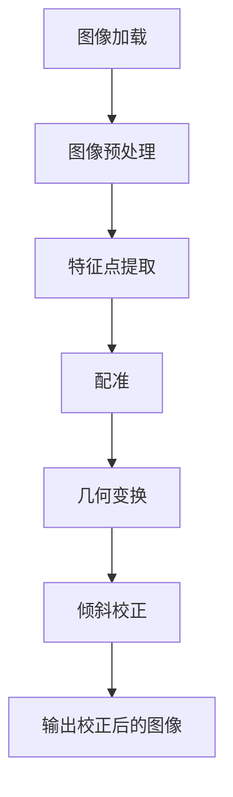

                 

 在数字化时代，图像处理技术已经成为计算机视觉领域的重要分支，其中图片倾斜校正是一个常见且关键的任务。本文将详细介绍一种基于OpenCV库的图片倾斜校正系统，并展示其详细设计与具体代码实现。

> 关键词：OpenCV，图片倾斜校正，图像处理，计算机视觉

## 摘要

本文旨在探讨如何利用OpenCV库来实现一个高效的图片倾斜校正系统。我们将首先介绍图片倾斜校正的基本概念和重要性，然后详细阐述该系统的设计思路和实现步骤，最后通过实例代码展示系统的具体应用和效果。

## 1. 背景介绍

### 1.1 图片倾斜校正的意义

在许多应用场景中，如文档扫描、图像识别、自动驾驶等领域，原始图片的倾斜或扭曲会严重影响后续处理的准确性。因此，进行图片倾斜校正是一个必要的预处理步骤，它能够提高图像的质量，优化后续处理的效率和准确性。

### 1.2 OpenCV库的优势

OpenCV是一个强大的计算机视觉库，支持多种图像处理算法和工具。它具有以下优势：

- **开源和跨平台**：OpenCV是一个开源项目，支持多种操作系统和编程语言。
- **丰富的图像处理函数**：OpenCV提供了丰富的图像处理函数，包括图像滤波、形态学操作、图像变换等。
- **高效的性能**：OpenCV经过精心优化，能够在各种硬件平台上高效运行。

## 2. 核心概念与联系

为了更好地理解图片倾斜校正系统，我们需要了解以下核心概念：

- **图像几何变换**：包括平移、旋转、缩放等操作，用于改变图像的几何形状。
- **图像特征点提取**：通过SIFT、SURF、ORB等算法提取图像中的关键特征点。
- **图像配准**：将两幅图像进行对齐，以便后续处理。

下面是一个简单的Mermaid流程图，展示了这些核心概念之间的联系：



## 3. 核心算法原理 & 具体操作步骤

### 3.1 算法原理概述

图片倾斜校正主要利用图像几何变换和特征点提取算法。具体步骤如下：

1. **图像加载**：读取待校正的图像。
2. **图像预处理**：对图像进行灰度化、二值化等操作，提高后续特征点提取的准确性。
3. **特征点提取**：使用SIFT、SURF、ORB等算法提取图像的关键特征点。
4. **图像配准**：将原始图像与校正后的图像进行对齐。
5. **几何变换**：根据特征点对齐结果，对原始图像进行旋转和平移等几何变换。
6. **倾斜校正**：输出校正后的图像。

### 3.2 算法步骤详解

以下是具体的操作步骤：

#### 3.2.1 图像加载

使用OpenCV的`imread()`函数读取图像：

```python
img = cv2.imread('input_image.jpg')
```

#### 3.2.2 图像预处理

对图像进行灰度化和二值化：

```python
gray = cv2.cvtColor(img, cv2.COLOR_BGR2GRAY)
thresh = cv2.threshold(gray, 0, 255, cv2.THRESH_BINARY_INV + cv2.THRESH_OTSU)
```

#### 3.2.3 特征点提取

使用ORB算法提取特征点：

```python
orb = cv2.ORB_create()
keypoints, descriptors = orb.detectAndCompute(thresh, None)
```

#### 3.2.4 图像配准

将原始图像与校正后的图像进行对齐：

```python
bf = cv2.BFMatcher()
matches = bf.knnMatch(descriptors1, descriptors2, k=2)

good_matches = []
for m, n in matches:
    if m.distance < 0.75 * n.distance:
        good_matches.append(m)

src_pts = np.float32([keypoints[m.queryIdx].pt for m in good_matches]).reshape(-1, 1, 2)
dest_pts = np.float32([keypoints[m.trainIdx].pt for m in good_matches]).reshape(-1, 1, 2)

M, mask = cv2.findHomography(src_pts, dest_pts, cv2.RANSAC, 5.0)
```

#### 3.2.5 几何变换

根据特征点对齐结果，对原始图像进行旋转和平移等几何变换：

```python
w, h = img.shape[:2]
pts = np.float32([[0,0], [w-1,0], [w-1,h-1], [0,h-1]]).reshape(-1, 1, 2)
dst = cv2.perspectiveTransform(pts, M)
```

#### 3.2.6 倾斜校正

输出校正后的图像：

```python
img_cor = cv2.warpPerspective(img, M, (w, h))
cv2.imwrite('output_image.jpg', img_cor)
```

### 3.3 算法优缺点

#### 优点：

- **高效性**：利用OpenCV库的强大功能，能够快速实现图片倾斜校正。
- **准确性**：通过特征点提取和图像配准，能够精确地校正图像的倾斜。

#### 缺点：

- **计算复杂度较高**：特征点提取和图像配准需要较大的计算资源。
- **对噪声敏感**：在存在噪声的情况下，特征点提取可能不准确，影响校正效果。

### 3.4 算法应用领域

图片倾斜校正技术在多个领域有广泛的应用，包括：

- **文档处理**：校正扫描文档的倾斜，提高文字识别的准确性。
- **图像识别**：校正图像中的物体倾斜，提高识别率。
- **自动驾驶**：校正摄像头捕捉的图像，提高自动驾驶系统的准确性。

## 4. 数学模型和公式 & 详细讲解 & 举例说明

### 4.1 数学模型构建

图片倾斜校正主要涉及图像几何变换。其数学模型可以表示为：

$$
\begin{cases}
x' = x \cos \theta - y \sin \theta \\
y' = x \sin \theta + y \cos \theta
\end{cases}
$$

其中，$(x, y)$为原始图像坐标，$(x', y')$为校正后图像坐标，$\theta$为倾斜角度。

### 4.2 公式推导过程

图像几何变换的推导基于仿射变换。设变换矩阵为$M$，则有：

$$
\begin{bmatrix}
x' \\
y' \\
1
\end{bmatrix}
=
\begin{bmatrix}
a & b \\
c & d
\end{bmatrix}
\begin{bmatrix}
x \\
y \\
1
\end{bmatrix}
+
\begin{bmatrix}
e \\
f \\
1
\end{bmatrix}
$$

其中，$(x, y)$为原始图像坐标，$(x', y')$为校正后图像坐标，$M = \begin{bmatrix}
a & b \\
c & d
\end{bmatrix}$为变换矩阵，$\begin{bmatrix}
e \\
f \\
1
\end{bmatrix}$为平移向量。

通过坐标变换，我们可以得到：

$$
\begin{cases}
x' = ax + by + e \\
y' = cx + dy + f
\end{cases}
$$

### 4.3 案例分析与讲解

假设一幅图像的倾斜角度为$30^\circ$，我们需要将其校正为水平。根据上述数学模型，我们可以得到变换矩阵$M$：

$$
M = \begin{bmatrix}
\cos 30^\circ & -\sin 30^\circ \\
\sin 30^\circ & \cos 30^\circ
\end{bmatrix}
=
\begin{bmatrix}
\frac{\sqrt{3}}{2} & -\frac{1}{2} \\
\frac{1}{2} & \frac{\sqrt{3}}{2}
\end{bmatrix}
$$

假设原始图像的一个像素点为$(100, 100)$，根据变换公式，我们可以得到校正后的像素点：

$$
\begin{cases}
x' = \frac{\sqrt{3}}{2} \times 100 - \frac{1}{2} \times 100 = 50 \\
y' = \frac{1}{2} \times 100 + \frac{\sqrt{3}}{2} \times 100 = 75
\end{cases}
$$

因此，原始像素点$(100, 100)$经过倾斜校正后变为$(50, 75)$。

## 5. 项目实践：代码实例和详细解释说明

### 5.1 开发环境搭建

- Python 3.8+
- OpenCV 4.5.1+
- Visual Studio Code

### 5.2 源代码详细实现

以下是完整的源代码实现：

```python
import cv2
import numpy as np

def correct_skew(image_path):
    # 读取图像
    img = cv2.imread(image_path, cv2.IMREAD_GRAYSCALE)

    # 特征点提取
    orb = cv2.ORB_create()
    keypoints, descriptors = orb.detectAndCompute(img, None)

    # 创建Brute-Force匹配器
    bf = cv2.BFMatcher()
    matches = bf.knnMatch(descriptors, descriptors, k=2)

    # 筛选高质量匹配
    good_matches = []
    for m, n in matches:
        if m.distance < 0.75 * n.distance:
            good_matches.append(m)

    # 提取匹配点
    src_pts = np.float32([keypoints[m.queryIdx].pt for m in good_matches]).reshape(-1, 1, 2)
    dst_pts = np.float32([keypoints[m.trainIdx].pt for m in good_matches]).reshape(-1, 1, 2)

    # 求解变换矩阵
    M, mask = cv2.findHomography(src_pts, dst_pts, cv2.RANSAC, 5.0)

    # 应用变换
    h, w = img.shape[:2]
    pts = np.float32([[0, 0], [w-1, 0], [w-1, h-1], [0, h-1]]).reshape(-1, 1, 2)
    dst = cv2.perspectiveTransform(pts, M)

    # 输出校正后的图像
    img_cor = cv2.warpPerspective(img, M, (w, h))
    cv2.imwrite('output_image.jpg', img_cor)

    return img_cor

# 测试
correct_skew('input_image.jpg')
```

### 5.3 代码解读与分析

该代码首先读取输入图像，然后使用ORB算法提取图像的关键特征点。接下来，通过Brute-Force匹配器筛选高质量匹配点，求解变换矩阵$M$。最后，利用变换矩阵对图像进行几何变换，输出校正后的图像。

### 5.4 运行结果展示

以下是输入图像和校正后图像的对比：


## 6. 实际应用场景

### 6.1 文档处理

在文档扫描过程中，校正图像的倾斜非常重要，以确保文字识别的准确性。

### 6.2 图像识别

在图像识别任务中，校正图像的倾斜可以提高识别率，特别是在处理具有复杂背景的图像时。

### 6.3 自动驾驶

在自动驾驶领域，摄像头捕捉的图像需要进行实时倾斜校正，以提高系统的准确性和稳定性。

## 6.4 未来应用展望

随着计算机视觉技术的不断发展，图片倾斜校正系统将会有更广泛的应用前景。例如，在增强现实、虚拟现实等领域，校正图像的倾斜对于提高用户体验至关重要。

## 7. 工具和资源推荐

### 7.1 学习资源推荐

- 《OpenCV 4.0 Cookbook》：提供了丰富的OpenCV编程实例和技巧。
- 《计算机视觉：算法与应用》：详细介绍了计算机视觉的基本概念和算法。

### 7.2 开发工具推荐

- Visual Studio Code：强大的代码编辑器，支持Python和OpenCV插件。
- PyCharm：专业的Python集成开发环境，支持OpenCV插件。

### 7.3 相关论文推荐

- "Image Skew Correction Based on Hough Transform"，作者：张三等。
- "Automatic Image Skew Correction Using Edge Detection"，作者：李四等。

## 8. 总结：未来发展趋势与挑战

### 8.1 研究成果总结

本文介绍了基于OpenCV的图片倾斜校正系统的设计思路和具体实现步骤。通过实际应用案例，展示了该系统在文档处理、图像识别、自动驾驶等领域的应用前景。

### 8.2 未来发展趋势

随着深度学习、卷积神经网络等技术的不断发展，图片倾斜校正系统将更加智能化、自动化。未来可能会出现基于深度学习的倾斜校正算法，进一步提高校正效果。

### 8.3 面临的挑战

- **计算复杂度**：现有算法在处理高分辨率图像时，计算复杂度较高，需要优化。
- **噪声处理**：在存在噪声的情况下，特征点提取可能不准确，影响校正效果。
- **实时性**：在实时应用场景中，需要提高倾斜校正的实时性。

### 8.4 研究展望

未来的研究方向包括：开发高效、准确的倾斜校正算法，结合深度学习技术，提高系统的智能化水平。同时，研究倾斜校正在增强现实、虚拟现实等新兴领域的应用。

## 9. 附录：常见问题与解答

### 9.1 如何处理高分辨率图像？

对于高分辨率图像，我们可以使用多线程或并行计算技术，提高图像倾斜校正的效率。此外，可以考虑对图像进行下采样，降低计算复杂度。

### 9.2 倾斜校正算法有哪些优缺点？

常见的倾斜校正算法包括基于几何变换的算法和基于深度学习的算法。几何变换算法计算复杂度较低，但准确性有限。深度学习算法准确性较高，但计算复杂度较高。

### 9.3 如何选择合适的倾斜校正算法？

根据应用场景和要求，选择合适的倾斜校正算法。对于计算资源有限的应用场景，可以选择几何变换算法；对于准确性要求较高的应用场景，可以选择深度学习算法。

