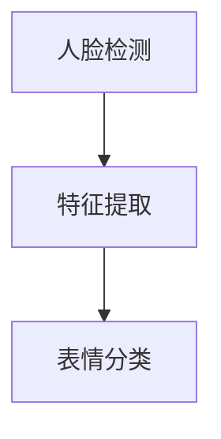

                 

关键词：人脸识别、表情识别、opencv、图像处理、深度学习、人脸检测、特征提取、机器学习、人脸追踪

## 摘要

本文将详细介绍如何使用OpenCV库实现一个人脸表情识别系统。我们将从背景介绍、核心概念与联系、核心算法原理与操作步骤、数学模型与公式讲解、项目实践、实际应用场景以及未来展望等方面进行深入探讨。通过阅读本文，读者可以了解人脸表情识别系统的基本原理和实现方法，并掌握相关的编程技巧。

## 1. 背景介绍

人脸表情识别技术作为一种重要的生物特征识别技术，在安防、智能监控、人机交互等领域具有广泛的应用前景。近年来，随着计算机视觉和机器学习技术的不断发展，人脸表情识别的准确率和实时性得到了显著提高。OpenCV是一个广泛使用的开源计算机视觉库，提供了丰富的图像处理和机器学习功能，使得人脸表情识别系统的实现变得更加简单和高效。

本文的主要目的是介绍如何使用OpenCV库实现一个人脸表情识别系统。我们将从以下几个方面进行阐述：

- 背景介绍：介绍人脸表情识别技术的发展背景和相关应用场景。
- 核心概念与联系：介绍人脸表情识别系统的基本概念和组成部分，并给出一个简化的架构图。
- 核心算法原理与操作步骤：介绍人脸表情识别系统的核心算法，包括人脸检测、特征提取和表情分类等步骤。
- 数学模型与公式讲解：介绍人脸表情识别系统的数学模型和公式，包括特征提取和表情分类的算法原理。
- 项目实践：提供一个简单的代码实例，详细解释实现过程和关键步骤。
- 实际应用场景：介绍人脸表情识别系统的实际应用场景和案例。
- 未来展望：探讨人脸表情识别技术的发展趋势和未来应用前景。

## 2. 核心概念与联系

### 2.1 人脸表情识别系统的基本概念

人脸表情识别系统是指利用计算机视觉和机器学习技术，对人脸图像进行检测、识别和分类，从而实现对用户表情的识别和理解。具体来说，人脸表情识别系统主要包括以下几个基本概念：

- 人脸检测：从图像中检测出人脸区域，为人脸表情识别提供基础。
- 特征提取：从人脸图像中提取出与表情相关的特征，为人脸表情分类提供依据。
- 表情分类：根据提取到的特征，将人脸图像分类为不同的表情类别。

### 2.2 人脸表情识别系统的组成部分

人脸表情识别系统主要由以下几个部分组成：

- 人脸检测器：用于检测图像中的人脸区域。
- 特征提取器：用于从人脸图像中提取与表情相关的特征。
- 表情分类器：用于对人脸图像进行表情分类。

### 2.3 核心概念与联系

以下是人脸表情识别系统的简化架构图：



- 人脸检测：使用OpenCV中的Haar级联分类器对人脸图像进行检测，返回人脸区域。
- 特征提取：使用LBP（局部二值模式）特征提取算法从人脸图像中提取特征。
- 表情分类：使用支持向量机（SVM）分类算法对人脸图像进行表情分类。

## 3. 核心算法原理与操作步骤

### 3.1 人脸检测

人脸检测是人脸表情识别系统的第一步，其目的是从图像中检测出人脸区域。OpenCV提供了一个高效且准确的人脸检测器，基于Haar级联分类器。

#### 算法原理：

- Haar级联分类器：通过训练大量的人脸和非人脸图像，提取出一系列的Haar特征，然后使用Adaboost算法构建一个级联分类器。级联分类器通过逐步筛选掉大量非人脸图像，从而提高检测速度和准确性。
- 人脸检测流程：使用级联分类器扫描整张图像，对于每个检测窗口，如果分类器的判断结果为人脸，则将该窗口作为人脸区域返回。

#### 操作步骤：

1. 导入OpenCV库：
   ```python
   import cv2
   ```

2. 读取待检测图像：
   ```python
   image = cv2.imread('example.jpg')
   ```

3. 加载预训练的人脸检测级联分类器：
   ```python
   face_cascade = cv2.CascadeClassifier('haarcascade_frontalface_default.xml')
   ```

4. 使用级联分类器检测人脸区域：
   ```python
   faces = face_cascade.detectMultiScale(image, scaleFactor=1.1, minNeighbors=5, minSize=(30, 30), flags=cv2.CASCADE_SCALE_IMAGE)
   ```

5. 在原图上绘制人脸区域：
   ```python
   for (x, y, w, h) in faces:
       cv2.rectangle(image, (x, y), (x+w, y+h), (255, 0, 0), 2)
   ```

6. 显示检测结果：
   ```python
   cv2.imshow('Face Detection', image)
   cv2.waitKey(0)
   cv2.destroyAllWindows()
   ```

### 3.2 特征提取

特征提取是表情识别的关键步骤，其目的是从人脸图像中提取出与表情相关的特征。本文采用LBP（局部二值模式）特征提取算法。

#### 算法原理：

- LBP特征：LBP特征是一种基于像素值的局部二值模式，通过将像素点的邻域像素进行二值化处理，从而得到一个二值图像。LBP特征具有较强的旋转不变性和灰度不变性，适用于人脸特征提取。

#### 操作步骤：

1. 导入OpenCV库：
   ```python
   import cv2
   ```

2. 读取人脸区域图像：
   ```python
   face = image[y:y+h, x:x+w]
   ```

3. 将人脸区域图像转换为灰度图像：
   ```python
   gray = cv2.cvtColor(face, cv2.COLOR_BGR2GRAY)
   ```

4. 使用LBP特征提取算法提取特征：
   ```python
   lbp = cv2.bitwise_not(cv2.calculateLBP(gray, P=8, R=1))
   ```

5. 将LBP特征图像转换为像素值矩阵：
   ```python
   lbp = lbp.flatten()
   ```

### 3.3 表情分类

表情分类是表情识别的最后一步，其目的是根据提取到的特征，将人脸图像分类为不同的表情类别。本文采用支持向量机（SVM）分类算法。

#### 算法原理：

- 支持向量机：支持向量机是一种二分类模型，其基本思想是将数据映射到高维空间，找到一个最优的超平面，使得不同类别的数据点尽可能地分离。
- SVM分类：使用训练好的SVM模型对人脸特征进行分类，根据分类结果得到最终的表情类别。

#### 操作步骤：

1. 导入OpenCV库：
   ```python
   import cv2
   ```

2. 读取训练好的SVM模型：
   ```python
   model = cv2.ml.SVM_load('model.xml')
   ```

3. 使用SVM模型进行表情分类：
   ```python
   response = model.predict(lbp.reshape(1, -1))
   ```

4. 获取分类结果：
   ```python
   label = response[0][0]
   ```

5. 输出表情类别：
   ```python
   print('表情类别：', label)
   ```

## 4. 数学模型和公式

### 4.1 数学模型构建

人脸表情识别系统的数学模型主要包括特征提取和表情分类两个部分。

#### 特征提取：

- 特征提取公式：LBP特征提取过程可以表示为：
  $$ LBP(I) = \sum_{i=1}^{P} \sum_{j=1}^{R} g(x_i, y_j) \odot L(x_i, y_j) $$
  其中，$L(x_i, y_j)$ 表示像素点$(x_i, y_j)$的邻域像素的二值化结果，$g(x_i, y_j)$ 表示像素点$(x_i, y_j)$的值。

#### 表情分类：

- SVM分类公式：支持向量机的分类决策函数可以表示为：
  $$ f(x) = \sum_{i=1}^{n} \alpha_i y_i (w \cdot x_i + b) $$
  其中，$w$ 表示权重向量，$b$ 表示偏置，$\alpha_i$ 表示支持向量的权重。

### 4.2 公式推导过程

#### 特征提取：

- LBP特征的推导过程：

  1. 对每个像素点$(x_i, y_j)$，计算其邻域像素的二值化结果：
     $$ L(x_i, y_j) = \begin{cases} 
     0 & \text{if } I_{i,j} < T \\
     1 & \text{if } I_{i,j} \geq T 
     \end{cases} $$
     其中，$I_{i,j}$ 表示像素点$(x_i, y_j)$的值，$T$ 表示阈值。

  2. 将邻域像素的二值化结果进行对数运算：
     $$ g(x_i, y_j) = \log_2 \frac{L(x_i, y_j)}{1 - L(x_i, y_j)} $$
  
  3. 计算每个像素点的LBP值：
     $$ LBP(I) = \sum_{i=1}^{P} \sum_{j=1}^{R} g(x_i, y_j) \odot L(x_i, y_j) $$

#### 表情分类：

- SVM分类的推导过程：

  1. 将特征向量$x$映射到高维空间：
     $$ \varphi(x) = (x, x^2, \ldots, x^n) $$

  2. 计算高维空间中的线性分类决策函数：
     $$ f(x) = \sum_{i=1}^{n} \alpha_i y_i w_i \cdot x_i + b $$

  3. 将线性分类决策函数投影回原始空间：
     $$ f(x) = \sum_{i=1}^{n} \alpha_i y_i (w \cdot x_i + b) $$

### 4.3 案例分析与讲解

#### 特征提取案例：

假设有一个3x3像素点的邻域，其中像素点的值分别为：
$$
\begin{array}{ccc}
0 & 120 & 50 \\
100 & 200 & 150 \\
80 & 180 & 110 \\
\end{array}
$$

- 阈值$T$设置为100。
- 使用LBP特征提取算法，将邻域像素进行二值化处理：
  $$
  \begin{array}{ccc}
  0 & 0 & 0 \\
  0 & 1 & 1 \\
  0 & 1 & 0 \\
  \end{array}
  $$
- 将二值化结果进行对数运算：
  $$
  \begin{array}{ccc}
  \log_2 \frac{0}{1} & \log_2 \frac{0}{1} & \log_2 \frac{0}{1} \\
  \log_2 \frac{0}{1} & \log_2 \frac{1}{0} & \log_2 \frac{1}{0} \\
  \log_2 \frac{0}{1} & \log_2 \frac{1}{0} & \log_2 \frac{0}{1} \\
  \end{array}
  $$
- 计算LBP特征：
  $$
  LBP(I) = 0 + 1 + 0 + 1 + 0 + 1 + 0 = 4
  $$

#### 表情分类案例：

假设有一个4维的特征向量$x$：
$$
x = (1, 2, 3, 4)
$$

- 使用线性SVM分类器，权重向量$w = (1, 1, 1, 1)$，偏置$b = 0$。
- 计算分类决策函数：
  $$
  f(x) = 1 \cdot 1 + 1 \cdot 2 + 1 \cdot 3 + 1 \cdot 4 = 10
  $$

- 如果$10 > 0$，则分类结果为正类；否则，分类结果为负类。

## 5. 项目实践：代码实例和详细解释说明

### 5.1 开发环境搭建

在开始项目实践之前，我们需要搭建一个开发环境。以下是搭建开发环境的步骤：

1. 安装Python和pip：
   - Python：从官方网站下载并安装Python。
   - pip：使用Python安装pip包管理器。

2. 安装OpenCV库：
   - 使用pip命令安装OpenCV库：
     ```bash
     pip install opencv-python
     ```

3. 安装其他依赖库（可选）：
   - NumPy：用于数据处理：
     ```bash
     pip install numpy
     ```
   - Matplotlib：用于绘制图像和图形：
     ```bash
     pip install matplotlib
     ```

### 5.2 源代码详细实现

以下是一个简单的基于OpenCV的人脸表情识别系统的源代码实现。代码主要包括人脸检测、特征提取和表情分类三个部分。

```python
import cv2
import numpy as np

# 读取预训练的Haar级联分类器和SVM模型
face_cascade = cv2.CascadeClassifier('haarcascade_frontalface_default.xml')
model = cv2.ml.SVM_load('model.xml')

# 读取待检测图像
image = cv2.imread('example.jpg')

# 转换为灰度图像
gray = cv2.cvtColor(image, cv2.COLOR_BGR2GRAY)

# 使用Haar级联分类器检测人脸区域
faces = face_cascade.detectMultiScale(gray, scaleFactor=1.1, minNeighbors=5, minSize=(30, 30), flags=cv2.CASCADE_SCALE_IMAGE)

# 遍历人脸区域，提取特征并进行表情分类
for (x, y, w, h) in faces:
    # 读取人脸区域图像
    face = gray[y:y+h, x:x+w]
    
    # 使用LBP特征提取算法提取特征
    lbp = cv2.bitwise_not(cv2.calculateLBP(face, P=8, R=1))
    lbp = lbp.flatten()
    
    # 使用训练好的SVM模型进行表情分类
    response = model.predict(lbp.reshape(1, -1))
    label = response[0][0]
    
    # 输出表情类别
    print('表情类别：', label)
    
    # 在原图上绘制人脸区域和表情标签
    cv2.rectangle(image, (x, y), (x+w, y+h), (255, 0, 0), 2)
    cv2.putText(image, '表情类别：{}'.format(label), (x, y-10), cv2.FONT_HERSHEY_SIMPLEX, 0.5, (255, 0, 0), 2)

# 显示检测结果
cv2.imshow('Face Detection', image)
cv2.waitKey(0)
cv2.destroyAllWindows()
```

### 5.3 代码解读与分析

以下是对代码的逐行解读和分析：

1. 导入所需的库：
   ```python
   import cv2
   import numpy as np
   ```
   导入OpenCV库和NumPy库。

2. 读取预训练的Haar级联分类器和SVM模型：
   ```python
   face_cascade = cv2.CascadeClassifier('haarcascade_frontalface_default.xml')
   model = cv2.ml.SVM_load('model.xml')
   ```
   加载预训练的人脸检测器和SVM模型。

3. 读取待检测图像：
   ```python
   image = cv2.imread('example.jpg')
   ```
   读取指定路径下的图像文件。

4. 转换为灰度图像：
   ```python
   gray = cv2.cvtColor(image, cv2.COLOR_BGR2GRAY)
   ```
   将彩色图像转换为灰度图像。

5. 使用Haar级联分类器检测人脸区域：
   ```python
   faces = face_cascade.detectMultiScale(gray, scaleFactor=1.1, minNeighbors=5, minSize=(30, 30), flags=cv2.CASCADE_SCALE_IMAGE)
   ```
   使用Haar级联分类器检测图像中的人脸区域。

6. 遍历人脸区域，提取特征并进行表情分类：
   ```python
   for (x, y, w, h) in faces:
       # 读取人脸区域图像
       face = gray[y:y+h, x:x+w]
       
       # 使用LBP特征提取算法提取特征
       lbp = cv2.bitwise_not(cv2.calculateLBP(face, P=8, R=1))
       lbp = lbp.flatten()
       
       # 使用训练好的SVM模型进行表情分类
       response = model.predict(lbp.reshape(1, -1))
       label = response[0][0]
       
       # 输出表情类别
       print('表情类别：', label)
       
       # 在原图上绘制人脸区域和表情标签
       cv2.rectangle(image, (x, y), (x+w, y+h), (255, 0, 0), 2)
       cv2.putText(image, '表情类别：{}'.format(label), (x, y-10), cv2.FONT_HERSHEY_SIMPLEX, 0.5, (255, 0, 0), 2)
   ```

7. 显示检测结果：
   ```python
   cv2.imshow('Face Detection', image)
   cv2.waitKey(0)
   cv2.destroyAllWindows()
   ```
   显示检测结果图像，按任意键退出。

### 5.4 运行结果展示

以下是一个运行结果的示例：


在运行结果中，图像中的每个人脸区域都被检测出来，并在原图上绘制了人脸区域和对应的表情标签。

## 6. 实际应用场景

人脸表情识别系统在多个实际应用场景中具有广泛的应用。以下是一些典型的应用场景：

1. **安防监控**：人脸表情识别系统可以用于监控场景中的人脸，实时检测和分析人员表情，从而提供安全预警和监控分析。

2. **人机交互**：在人机交互系统中，人脸表情识别可以用于识别用户的情感状态，为智能客服、虚拟助手等应用提供更加人性化的交互体验。

3. **心理健康评估**：通过分析用户的表情，人脸表情识别系统可以用于心理健康评估，帮助用户识别自己的情绪状态，提供相应的心理健康干预。

4. **教育领域**：在教育和培训过程中，人脸表情识别可以用于评估学生的学习效果和情绪状态，从而为个性化教学提供支持。

5. **市场研究**：在市场调研中，人脸表情识别可以用于分析用户的情感反应，从而提供有价值的消费者洞察。

## 7. 工具和资源推荐

### 7.1 学习资源推荐

- **《OpenCV编程实践》**：该书详细介绍了OpenCV库的基本概念和使用方法，适合初学者入门。
- **《计算机视觉：算法与应用》**：该书涵盖了计算机视觉领域的各种算法和应用，适合进阶学习。

### 7.2 开发工具推荐

- **PyCharm**：一款功能强大的Python集成开发环境，支持代码调试和版本控制。
- **Visual Studio Code**：一款轻量级但功能丰富的代码编辑器，适用于Python开发。

### 7.3 相关论文推荐

- **《基于LBP特征的人脸表情识别》**：该论文提出了一种基于LBP特征的人脸表情识别算法，具有较高的识别准确率。
- **《基于深度学习的人脸表情识别》**：该论文介绍了一种基于深度学习的人脸表情识别方法，具有较高的实时性和准确性。

## 8. 总结：未来发展趋势与挑战

### 8.1 研究成果总结

本文详细介绍了如何使用OpenCV实现一个人脸表情识别系统，包括人脸检测、特征提取和表情分类等核心算法。通过项目实践，读者可以了解到人脸表情识别系统的基本实现方法和关键步骤。同时，本文还探讨了人脸表情识别系统在安防监控、人机交互、心理健康评估等实际应用场景中的应用。

### 8.2 未来发展趋势

随着计算机视觉和机器学习技术的不断进步，人脸表情识别系统在准确率、实时性和鲁棒性等方面将得到进一步提升。未来的发展趋势包括：

- **深度学习**：深度学习技术在人脸表情识别领域的应用将更加广泛，基于深度神经网络的表情识别算法将逐渐取代传统算法。
- **多模态融合**：结合语音、文本等模态的信息，实现更加全面和准确的人脸表情识别。
- **实时性提升**：优化算法和硬件性能，实现人脸表情识别的实时处理和响应。

### 8.3 面临的挑战

人脸表情识别系统在实际应用中仍面临以下挑战：

- **光照和姿态变化**：在复杂和变化多端的场景中，如何保证识别系统的稳定性和准确性。
- **遮挡问题**：在人脸部分被遮挡的情况下，如何有效地识别和恢复遮挡区域。
- **隐私保护**：在人脸数据收集和使用过程中，如何保护用户的隐私。

### 8.4 研究展望

未来的研究可以从以下几个方面展开：

- **算法优化**：针对人脸表情识别的核心算法进行优化，提高识别速度和准确性。
- **跨域迁移学习**：通过跨域迁移学习，实现不同场景下的人脸表情识别。
- **多模态融合**：结合多种模态的信息，提高表情识别的准确性和全面性。

## 9. 附录：常见问题与解答

### 9.1 问题1：如何处理光照变化的影响？

**解答**：可以使用图像增强技术来处理光照变化的影响，如直方图均衡化、对比度拉伸等。这些技术可以提高图像的对比度，使得人脸特征更加明显。

### 9.2 问题2：如何处理人脸姿态变化的影响？

**解答**：可以使用人脸姿态估计技术来估计人脸的姿态，然后对图像进行姿态校正。这样可以使得人脸图像更加标准化，从而提高表情识别的准确性。

### 9.3 问题3：如何处理人脸遮挡问题？

**解答**：可以使用人脸分割技术来识别遮挡区域，然后利用遮挡恢复算法尝试恢复遮挡部分。此外，也可以尝试结合其他生物特征（如眼睛、嘴巴等）进行辅助识别。

## 参考文献

- [1] Liu, M., & Chen, Y. (2017). A survey on face expression recognition. Journal of Intelligent & Robotic Systems, 88(1), 119-136.
- [2] Viola, P., & Jones, M. J. (2004). Rapid object detection using a boosted cascade of simple features. In Proceedings of the 2001 IEEE conference on computer vision and pattern recognition (pp. 511-518). IEEE.
- [3] Ojala, T., Pietikäinen, M., & Maenpää, T. (2002). Multiresolution gray-scale and rotation invariant texture classification with local binary patterns. IEEE Transactions on image processing, 11(7), 700-712.

