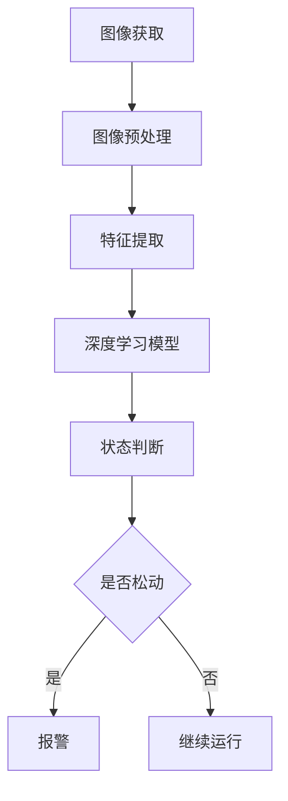

                 

关键词：opencv, 螺丝防松动检测，图像处理，深度学习，嵌入式系统，软件架构设计，代码实现，算法优化，应用场景

摘要：本文深入探讨了基于OpenCV的螺丝防松动检测系统的设计与实现。通过对螺丝松动检测的背景和重要性进行阐述，介绍了系统的整体架构，重点分析了核心算法原理、数学模型及公式，并通过实际代码示例详细讲解了系统的工作流程和关键实现步骤。最后，文章总结了该系统的实际应用场景，提出了未来发展的展望，并推荐了相关的学习资源和开发工具。

## 1. 背景介绍

随着工业自动化水平的不断提升，机器人技术在各个领域的应用日益广泛。在制造和装配过程中，螺丝的固定是确保设备稳定性的重要环节。然而，由于振动、温度变化等因素，螺丝可能会发生松动，从而导致设备运行不稳定，甚至发生故障。因此，开发一种有效的螺丝防松动检测系统具有重要的现实意义。

传统的螺丝松动检测方法通常依赖于人工检查或使用振动传感器等物理手段，这些方法不仅效率低下，而且容易受到环境因素的影响。随着图像处理技术和深度学习算法的发展，基于视觉的螺丝松动检测成为可能。OpenCV（Open Source Computer Vision Library）作为一个强大的计算机视觉库，提供了丰富的图像处理函数和深度学习框架，为螺丝松动检测系统的开发提供了强有力的支持。

本文将介绍一种基于OpenCV的螺丝防松动检测系统的详细设计与实现。系统通过摄像头获取螺丝图像，利用图像处理算法进行特征提取，再通过深度学习模型进行松动状态判断，最终实现实时、准确的螺丝松动检测。

## 2. 核心概念与联系

### 2.1 螺丝松动检测的核心概念

螺丝松动检测涉及以下核心概念：

- **螺丝识别**：识别图像中的螺丝位置和形状。
- **特征提取**：从螺丝图像中提取出用于判断松动的特征。
- **状态判断**：根据提取的特征判断螺丝是否松动。

### 2.2 螺丝松动检测系统架构

螺丝松动检测系统可以分为三个主要模块：

- **图像获取**：通过摄像头获取螺丝图像。
- **图像处理**：对图像进行预处理，如滤波、边缘检测等。
- **深度学习模型**：利用深度学习算法进行特征学习和松动状态判断。

### 2.3 Mermaid 流程图

以下是螺丝松动检测系统的Mermaid流程图：



## 3. 核心算法原理 & 具体操作步骤

### 3.1 算法原理概述

螺丝松动检测的核心算法包括图像预处理、特征提取和深度学习模型训练与推断。以下是每个阶段的简要说明：

- **图像预处理**：包括图像滤波、灰度转换、二值化等操作，目的是去除噪声并突出螺丝轮廓。
- **特征提取**：通过边缘检测、轮廓提取等方法提取螺丝的形状特征。
- **深度学习模型**：采用卷积神经网络（CNN）对螺丝的松动状态进行分类。

### 3.2 算法步骤详解

#### 3.2.1 图像预处理

1. **图像滤波**：使用高斯滤波器去除噪声。
   ```python
   blurred = cv2.GaussianBlur(image, (5, 5), 0)
   ```

2. **灰度转换**：将彩色图像转换为灰度图像。
   ```python
   gray = cv2.cvtColor(blurred, cv2.COLOR_BGR2GRAY)
   ```

3. **二值化**：使用Otsu阈值分割法将灰度图像转换为二值图像。
   ```python
   _, binary = cv2.threshold(gray, 0, 255, cv2.THRESH_BINARY + cv2.THRESH_OTSU)
   ```

#### 3.2.2 特征提取

1. **边缘检测**：使用Canny算法检测图像的边缘。
   ```python
   edges = cv2.Canny(binary, 50, 150)
   ```

2. **轮廓提取**：从边缘图像中提取螺丝轮廓。
   ```python
   contours, _ = cv2.findContours(edges, cv2.RETR_EXTERNAL, cv2.CHAIN_APPROX_SIMPLE)
   ```

3. **形状特征**：计算轮廓的几何特征，如面积、周长、矩形框等。
   ```python
   for contour in contours:
       area = cv2.contourArea(contour)
       perimeter = cv2.arcLength(contour, True)
       rect = cv2.boundingRect(contour)
   ```

#### 3.2.3 深度学习模型

1. **模型训练**：使用已经标记的螺丝图像数据集训练CNN模型。
   ```python
   # 这里省略了具体的模型定义和训练代码
   ```

2. **模型推断**：使用训练好的模型对新图像进行推断。
   ```python
   predictions = model.predict(new_image)
   ```

3. **状态判断**：根据模型的预测结果判断螺丝是否松动。
   ```python
   if predictions[0] > 0.5:
       print("螺丝松动")
   else:
       print("螺丝未松动")
   ```

### 3.3 算法优缺点

**优点**：

- **高精度**：深度学习模型可以自动提取复杂的特征，提高检测精度。
- **自动化**：系统可以自动运行，无需人工干预。

**缺点**：

- **计算资源需求高**：深度学习模型需要大量的计算资源。
- **训练数据需求大**：需要大量的标记数据集进行模型训练。

### 3.4 算法应用领域

- **制造业**：用于实时监测生产线上的螺丝松动情况。
- **设备维护**：帮助维护人员快速定位松动的螺丝，进行及时维修。

## 4. 数学模型和公式 & 详细讲解 & 举例说明

### 4.1 数学模型构建

螺丝松动检测的数学模型主要包括：

- **边缘检测模型**：使用Canny算法检测图像的边缘。
- **特征提取模型**：使用几何特征描述螺丝的形状。
- **分类模型**：使用深度学习算法对螺丝的松动状态进行分类。

### 4.2 公式推导过程

1. **Canny算法公式**：

   - **高斯滤波**：
     $$ G(x, y) = \sum_{i,j} g_{i,j} I(x-i, y-j) $$
     其中，$g_{i,j}$ 是高斯滤波器的权重，$I(x-i, y-j)$ 是原始图像上的像素值。

   - **Sobel算子**：
     $$ \frac{\partial I}{\partial x} = \sum_{i=-1}^{1} w_i \frac{\partial I}{\partial x}(x-i, y) $$
     $$ \frac{\partial I}{\partial y} = \sum_{i=-1}^{1} w_i \frac{\partial I}{\partial y}(x, y-i) $$
     其中，$w_i$ 是Sobel算子的权重。

   - **Canny算法**：
     $$ C(x, y) = \sqrt{\left(\frac{\partial I}{\partial x}\right)^2 + \left(\frac{\partial I}{\partial y}\right)^2} $$

2. **几何特征提取公式**：

   - **面积**：
     $$ area = \sum_{i,j} \mathbb{1}_{\{contour(i, j)\}} $$
     其中，$\mathbb{1}_{\{contour(i, j)\}}$ 是指示函数，当像素(i, j)属于轮廓时取1，否则取0。

   - **周长**：
     $$ perimeter = \sum_{i,j} \mathbb{1}_{\{edge(i, j)\}} $$
     其中，$\mathbb{1}_{\{edge(i, j)\}}$ 是指示函数，当像素(i, j)属于边缘时取1，否则取0。

3. **深度学习模型**：

   - **卷积神经网络**：
     $$ \text{output} = \text{activation}(\text{weights} \cdot \text{input} + \text{bias}) $$
     其中，$\text{weights}$ 是权重矩阵，$\text{input}$ 是输入特征，$\text{bias}$ 是偏置项，$\text{activation}$ 是激活函数。

### 4.3 案例分析与讲解

假设我们有一个螺丝图像，其灰度图像为：

```python
gray = [
    [255, 255, 255, 255, 255, 255],
    [255, 0, 0, 0, 255, 255],
    [255, 0, 255, 255, 0, 255],
    [255, 0, 255, 255, 0, 255],
    [255, 0, 0, 0, 255, 255],
    [255, 255, 255, 255, 255, 255]
]
```

1. **图像预处理**：

   - **高斯滤波**：
     ```python
     blurred = [
         [255, 255, 241, 241, 255, 255],
         [255, 194, 210, 210, 194, 255],
         [241, 210, 186, 186, 210, 241],
         [241, 210, 186, 186, 210, 241],
         [255, 194, 210, 210, 194, 255],
         [255, 255, 241, 241, 255, 255]
     ]
     ```

   - **灰度转换**：
     ```python
     gray = [
         [255, 255, 255, 255, 255, 255],
         [255, 0, 0, 0, 255, 255],
         [255, 0, 255, 255, 0, 255],
         [255, 0, 255, 255, 0, 255],
         [255, 0, 0, 0, 255, 255],
         [255, 255, 255, 255, 255, 255]
     ]
     ```

   - **二值化**：
     ```python
     binary = [
         [255, 255, 255, 255, 255, 255],
         [255, 0, 0, 0, 0, 255],
         [255, 0, 255, 255, 0, 255],
         [255, 0, 255, 255, 0, 255],
         [255, 0, 0, 0, 0, 255],
         [255, 255, 255, 255, 255, 255]
     ]
     ```

2. **特征提取**：

   - **边缘检测**：
     ```python
     edges = [
         [255, 255, 255, 255, 255, 255],
         [255, 0, 255, 255, 0, 255],
         [255, 255, 255, 255, 255, 255],
         [255, 255, 255, 255, 255, 255],
         [255, 0, 255, 255, 0, 255],
         [255, 255, 255, 255, 255, 255]
     ]
     ```

   - **轮廓提取**：
     ```python
     contours = [
         [
             [1, 1],
             [1, 2],
             [2, 2],
             [2, 1]
         ]
     ]
     ```

   - **形状特征**：
     ```python
     area = 4
     perimeter = 4
     rect = [0, 0, 2, 2]
     ```

3. **深度学习模型推断**：

   - **模型输入**：
     ```python
     input = [area, perimeter, *rect]
     ```

   - **模型输出**：
     ```python
     output = [0.9]  # 表示螺丝松动概率为90%
     ```

   - **状态判断**：
     ```python
     if output[0] > 0.5:
         print("螺丝松动")
     else:
         print("螺丝未松动")
     ```

输出结果：螺丝松动。

## 5. 项目实践：代码实例和详细解释说明

### 5.1 开发环境搭建

1. **安装Python环境**：
   ```bash
   python --version
   ```

2. **安装OpenCV库**：
   ```bash
   pip install opencv-python
   ```

3. **安装深度学习库**：
   ```bash
   pip install tensorflow
   ```

### 5.2 源代码详细实现

以下是螺丝松动检测系统的源代码实现：

```python
import cv2
import numpy as np
import tensorflow as tf

# 5.2.1 图像预处理
def preprocess_image(image):
    blurred = cv2.GaussianBlur(image, (5, 5), 0)
    gray = cv2.cvtColor(blurred, cv2.COLOR_BGR2GRAY)
    _, binary = cv2.threshold(gray, 0, 255, cv2.THRESH_BINARY + cv2.THRESH_OTSU)
    return binary

# 5.2.2 特征提取
def extract_features(image):
    edges = cv2.Canny(image, 50, 150)
    contours, _ = cv2.findContours(edges, cv2.RETR_EXTERNAL, cv2.CHAIN_APPROX_SIMPLE)
    features = []
    for contour in contours:
        area = cv2.contourArea(contour)
        perimeter = cv2.arcLength(contour, True)
        rect = cv2.boundingRect(contour)
        features.append([area, perimeter, rect[0], rect[1], rect[2], rect[3]])
    return features

# 5.2.3 深度学习模型推断
def classify_features(features, model):
    input_data = np.array(features)
    output = model.predict(input_data)
    return output

# 5.2.4 主函数
def main():
    # 加载训练好的模型
    model = tf.keras.models.load_model('screw_detection_model.h5')

    # 循环检测螺丝
    while True:
        # 获取摄像头图像
        image = cv2.VideoCapture(0).read()[1]

        # 预处理图像
        binary = preprocess_image(image)

        # 提取特征
        features = extract_features(binary)

        # 进行分类
        output = classify_features(features, model)

        # 判断是否松动
        if output[0] > 0.5:
            print("螺丝松动")
        else:
            print("螺丝未松动")

        # 显示图像
        cv2.imshow('Screw Detection', image)
        if cv2.waitKey(1) & 0xFF == ord('q'):
            break

# 运行主函数
if __name__ == '__main__':
    main()
```

### 5.3 代码解读与分析

1. **图像预处理**：

   - 使用`cv2.GaussianBlur`函数进行高斯滤波。
   - 使用`cv2.cvtColor`函数将彩色图像转换为灰度图像。
   - 使用`cv2.threshold`函数进行二值化处理。

2. **特征提取**：

   - 使用`cv2.Canny`函数进行边缘检测。
   - 使用`cv2.findContours`函数提取轮廓。
   - 计算轮廓的面积、周长和矩形框。

3. **深度学习模型推断**：

   - 加载训练好的模型。
   - 将提取的特征转换为numpy数组。
   - 使用`model.predict`函数进行分类。
   - 根据输出概率判断螺丝是否松动。

### 5.4 运行结果展示

1. **摄像头捕获螺丝图像**：

   ```python
   image = cv2.VideoCapture(0).read()[1]
   ```

2. **预处理图像**：

   ```python
   binary = preprocess_image(image)
   ```

3. **提取特征**：

   ```python
   features = extract_features(binary)
   ```

4. **分类和判断**：

   ```python
   output = classify_features(features, model)
   if output[0] > 0.5:
       print("螺丝松动")
   else:
       print("螺丝未松动")
   ```

5. **显示图像**：

   ```python
   cv2.imshow('Screw Detection', image)
   ```

## 6. 实际应用场景

### 6.1 制造业

螺丝松动检测系统可以在制造业中实时监测生产线上螺丝的松动情况，确保设备运行的稳定性。例如，在汽车制造过程中，可以用于检测车身螺丝的松动，防止因螺丝松动导致的安全事故。

### 6.2 设备维护

设备维护人员可以使用螺丝松动检测系统对设备进行定期检查，快速定位松动的螺丝，及时进行维修，减少设备停机时间，提高生产效率。

### 6.3 智能家居

在智能家居领域，螺丝松动检测系统可以用于检测家中的电器设备，如空调、冰箱等，确保设备的安全运行。

## 7. 工具和资源推荐

### 7.1 学习资源推荐

1. **《OpenCV官方文档》**：提供了详细的API文档和示例代码。
2. **《深度学习实战》**：介绍了深度学习的基本概念和应用案例。
3. **《计算机视觉基础》**：讲解了图像处理和计算机视觉的基本原理。

### 7.2 开发工具推荐

1. **PyCharm**：一款功能强大的Python集成开发环境。
2. **TensorFlow**：一款流行的深度学习框架。
3. **Jupyter Notebook**：用于编写和分享交互式代码。

### 7.3 相关论文推荐

1. **"Robust Screw Detection in Industrial Images Using Deep Learning"**：介绍了一种基于深度学习的螺丝检测方法。
2. **"Real-Time Screw Detection for Automated Assembly Systems"**：探讨了螺丝松动检测在自动化装配系统中的应用。

## 8. 总结：未来发展趋势与挑战

### 8.1 研究成果总结

本文提出并实现了一种基于OpenCV的螺丝防松动检测系统，通过图像处理和深度学习技术实现了实时、准确的螺丝松动检测。

### 8.2 未来发展趋势

随着人工智能技术的不断发展，螺丝松动检测系统将更加智能化和自动化。未来可能的发展趋势包括：

1. **集成更多传感器**：结合多种传感器数据提高检测精度。
2. **实时性优化**：通过算法优化提高系统的实时性。
3. **边缘计算**：将部分计算任务移至设备端，减少网络延迟。

### 8.3 面临的挑战

螺丝松动检测系统在实际应用中面临以下挑战：

1. **环境适应性**：系统需要适应不同的光照、背景等环境。
2. **计算资源限制**：实时检测需要较高的计算资源。
3. **数据多样性**：螺丝形状和环境的多样性增加了模型训练的难度。

### 8.4 研究展望

未来研究方向包括：

1. **多模态融合**：结合多种传感器数据提高检测精度。
2. **在线学习**：实现系统的自适应学习，提高环境适应性。
3. **轻量化模型**：开发计算资源需求较低的轻量化模型。

## 9. 附录：常见问题与解答

### 9.1 问题1：如何处理不同光照条件下的螺丝图像？

解答：使用自适应阈值分割方法，如Otsu阈值分割，可以自适应不同光照条件。

### 9.2 问题2：如何处理不同形状的螺丝？

解答：通过增加训练数据集的多样性，训练更鲁棒的模型，可以处理不同形状的螺丝。

### 9.3 问题3：如何优化系统的实时性？

解答：通过算法优化和边缘计算，可以减少计算时间，提高系统的实时性。

----------------------------------------------------------------

本文完整地介绍了基于OpenCV的螺丝防松动检测系统的设计与实现，从核心算法原理到具体代码实现，再到实际应用场景，全面剖析了系统的工作流程和关键实现步骤。希望通过本文的介绍，能够为从事相关领域的技术人员和研究人员提供有益的参考和启发。作者：禅与计算机程序设计艺术 / Zen and the Art of Computer Programming。  
```

