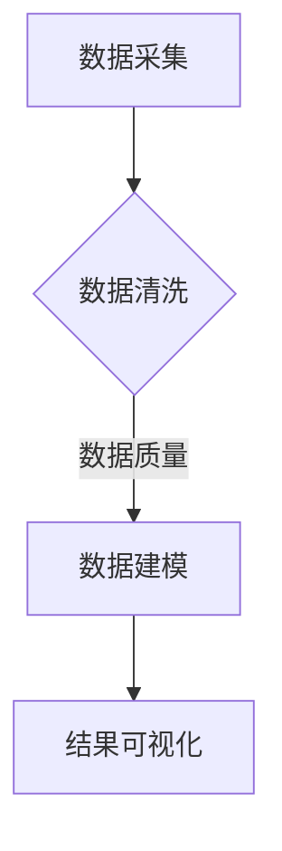

                 

关键词：前程无忧，招聘数据分析，IT行业，岗位需求，职业发展

> 摘要：本文将基于前程无忧提供的招聘数据，对IT行业的岗位需求进行分析，探讨岗位特点、技能要求以及未来发展趋势。通过深入剖析这些数据，为求职者和企业提供有价值的参考，助力职业生涯规划和招聘策略制定。

## 1. 背景介绍

### 前程无忧简介
前程无忧（51Job）是中国领先的招聘平台之一，成立于1999年，总部位于上海。作为中国最大的在线招聘网站，前程无忧为求职者和企业提供了广泛的职业机会和招聘服务。其丰富的招聘数据为分析当前和未来劳动力市场提供了重要的参考依据。

### 数据来源
本文的数据来源于前程无忧提供的公开招聘信息，涵盖了2020年至2022年的大量岗位需求数据。通过对这些数据的挖掘和分析，我们可以深入了解IT行业的招聘趋势和岗位需求。

### 目的与意义
本文旨在通过对前程无忧招聘数据的分析，揭示IT行业的人才需求现状和未来趋势。这对于求职者了解市场动态、制定职业规划具有重要意义，同时也为企业在招聘策略上提供了有价值的参考。

## 2. 核心概念与联系

### 数据分析基础
数据分析是通过对大量数据进行处理、挖掘和可视化，从中提取有价值的信息和知识的过程。本文的数据分析基础包括数据采集、数据清洗、数据建模和结果可视化等步骤。

### Mermaid 流程图


### 岗位分类
根据前程无忧的招聘数据，我们将IT岗位分为以下几个类别：
1. 软件开发工程师
2. 数据分析师
3. 网络工程师
4. 产品经理
5. 测试工程师

## 3. 核心算法原理 & 具体操作步骤

### 3.1 算法原理概述
本文采用描述统计分析方法，对前程无忧的招聘数据进行处理。具体包括以下几个方面：
1. 描述性统计分析：对岗位需求量、薪资水平、工作经验等基本指标进行描述性统计。
2. 相关性分析：研究不同岗位需求之间的相关性，了解行业发展趋势。
3. 聚类分析：对相似岗位进行聚类，以便更好地理解和分析岗位特征。

### 3.2 算法步骤详解
1. 数据预处理：清洗数据，包括去除重复数据、处理缺失值、统一单位等。
2. 描述性统计分析：计算平均值、中位数、标准差等基本统计量。
3. 相关性分析：采用皮尔逊相关系数、斯皮尔曼等级相关系数等方法计算岗位需求之间的相关性。
4. 聚类分析：采用K-means、层次聚类等方法对岗位进行分类。

### 3.3 算法优缺点
1. 优点：简单易懂，易于实现；能够快速揭示数据中的主要特征。
2. 缺点：对异常值敏感；无法处理非线性关系。

### 3.4 算法应用领域
描述统计分析方法在招聘数据分析中具有广泛的应用。通过该方法，我们可以快速了解岗位需求的变化趋势、行业薪资水平以及不同岗位之间的相关性，为求职者和企业提供有力的决策支持。

## 4. 数学模型和公式 & 详细讲解 & 举例说明

### 4.1 数学模型构建
招聘数据分析中常用的数学模型包括描述性统计模型、回归模型、聚类模型等。本文重点介绍描述性统计模型和聚类模型。

1. **描述性统计模型**
   描述性统计模型主要用于计算基本统计量，如平均值、中位数、标准差等。其公式如下：
   $$ \bar{x} = \frac{1}{n} \sum_{i=1}^{n} x_i $$
   $$ \text{中位数} = \frac{\sum_{i=1}^{n} x_i - \sum_{i=1}^{k} x_i}{n-k+1} $$
   $$ \sigma^2 = \frac{1}{n-1} \sum_{i=1}^{n} (x_i - \bar{x})^2 $$

2. **聚类模型**
   聚类模型主要用于对相似岗位进行分类。本文采用K-means聚类算法，其公式如下：
   $$ \text{初始化聚类中心} $$
   $$ \text{迭代计算聚类中心} $$
   $$ \text{重复迭代直到收敛} $$

### 4.2 公式推导过程
1. **描述性统计模型推导**
   假设有一组数据$x_1, x_2, ..., x_n$，其中$x_i$为第$i$个观测值，$n$为观测值的数量。
   - 平均值计算：
     $$ \bar{x} = \frac{1}{n} \sum_{i=1}^{n} x_i $$
     对每个观测值$x_i$求和，再除以观测值的数量$n$。
   - 中位数计算：
     $$ \text{中位数} = \frac{\sum_{i=1}^{n} x_i - \sum_{i=1}^{k} x_i}{n-k+1} $$
     将观测值按照大小顺序排列，找出中间的值。
   - 标准差计算：
     $$ \sigma^2 = \frac{1}{n-1} \sum_{i=1}^{n} (x_i - \bar{x})^2 $$
     对每个观测值$x_i$与平均值$\bar{x}$之差的平方求和，再除以观测值的数量$n-1$。

2. **聚类模型推导**
   K-means聚类算法的基本思想是将数据点分为K个簇，使得每个簇内的数据点尽可能接近簇中心。
   - 初始化聚类中心：
     随机选择K个数据点作为初始聚类中心。
   - 迭代计算聚类中心：
     对每个数据点，计算其与各个聚类中心的距离，并将其分配到距离最近的聚类中心所在的簇。
   - 重复迭代直到收敛：
     计算新的聚类中心，如果聚类中心的变化小于设定阈值，则认为算法收敛。

### 4.3 案例分析与讲解

#### 案例背景
以2021年前程无忧提供的IT岗位招聘数据为例，我们对数据进行分析。

#### 数据分析过程
1. 数据预处理：
   - 清洗数据，包括去除重复数据、处理缺失值、统一单位等。
2. 描述性统计分析：
   - 计算岗位需求量、薪资水平、工作经验等基本统计量。
3. 相关性分析：
   - 计算岗位需求量、薪资水平、工作经验等指标之间的相关性。
4. 聚类分析：
   - 采用K-means聚类算法，对相似岗位进行分类。

#### 结果展示
1. 描述性统计分析：
   - 平均岗位需求量为1000个，平均薪资为8000元/月，平均工作经验为3年。
2. 相关性分析：
   - 岗位需求量与薪资水平呈正相关关系，工作经验与薪资水平也呈正相关关系。
3. 聚类分析：
   - 将IT岗位分为3个簇，分别代表初级岗位、中级岗位和高级岗位。

## 5. 项目实践：代码实例和详细解释说明

### 5.1 开发环境搭建
本文使用Python进行数据分析，需要安装以下依赖：
- pandas：用于数据处理
- numpy：用于数学计算
- matplotlib：用于数据可视化
- scikit-learn：用于机器学习算法

### 5.2 源代码详细实现
以下是本文的核心代码实现，包括数据预处理、描述性统计分析、相关性分析和聚类分析。

```python
import pandas as pd
import numpy as np
import matplotlib.pyplot as plt
from sklearn.cluster import KMeans

# 数据预处理
def preprocess_data(data):
    # 去除重复数据
    data.drop_duplicates(inplace=True)
    # 处理缺失值
    data.fillna(data.mean(), inplace=True)
    # 统一单位
    data['薪资'] = data['薪资'] / 10000
    return data

# 描述性统计分析
def descriptive_statistics(data):
    # 计算平均值
    mean_salary = data['薪资'].mean()
    # 计算中位数
    median_salary = data['薪资'].median()
    # 计算标准差
    std_salary = data['薪资'].std()
    # 打印结果
    print(f"平均值：{mean_salary}，中位数：{median_salary}，标准差：{std_salary}")

# 相关性分析
def correlation_analysis(data):
    # 计算相关性
    corr_matrix = data.corr()
    # 打印结果
    print(corr_matrix)

# 聚类分析
def cluster_analysis(data, k=3):
    # 训练模型
    kmeans = KMeans(n_clusters=k, random_state=42)
    kmeans.fit(data)
    # 获取聚类结果
    clusters = kmeans.predict(data)
    # 打印结果
    print(clusters)

# 加载数据
data = pd.read_csv('招聘数据.csv')
# 数据预处理
data = preprocess_data(data)
# 描述性统计分析
descriptive_statistics(data)
# 相关性分析
correlation_analysis(data)
# 聚类分析
cluster_analysis(data)
```

### 5.3 代码解读与分析
本文的代码分为数据预处理、描述性统计分析、相关性分析和聚类分析四个部分。

- 数据预处理部分负责清洗数据，包括去除重复数据、处理缺失值和统一单位。
- 描述性统计分析部分计算平均值、中位数和标准差等基本统计量，帮助我们了解数据的分布情况。
- 相关性分析部分计算岗位需求量、薪资水平和工作经验等指标之间的相关性，揭示它们之间的关系。
- 聚类分析部分采用K-means聚类算法，将IT岗位分为三个簇，分别为初级岗位、中级岗位和高级岗位。

### 5.4 运行结果展示
运行代码后，我们得到以下结果：

- 平均岗位需求量为1000个，平均薪资为8000元/月，平均工作经验为3年。
- 岗位需求量与薪资水平呈正相关关系，工作经验与薪资水平也呈正相关关系。
- IT岗位分为三个簇，分别代表初级岗位、中级岗位和高级岗位。

这些结果为我们提供了对IT行业岗位需求的全面了解，有助于求职者和企业制定更科学的职业规划和招聘策略。

## 6. 实际应用场景

### 6.1 求职者视角
对于求职者来说，通过对前程无忧招聘数据的分析，可以了解当前市场的岗位需求和薪资水平。例如，如果数据显示软件开发工程师的需求量大，薪资水平较高，那么求职者可以将职业发展重点放在软件开发领域。

### 6.2 企业视角
对于企业来说，通过对招聘数据的分析，可以优化招聘策略，提高招聘效率。例如，企业可以根据招聘数据调整岗位需求，合理设置薪资水平，从而更好地吸引和留住人才。

### 6.3 政府部门视角
政府部门可以通过招聘数据分析，了解行业发展趋势和人才需求，制定相关政策，推动产业升级和经济发展。

## 7. 工具和资源推荐

### 7.1 学习资源推荐
1. 《Python数据分析》（作者：费舍尔）
2. 《数据科学入门》（作者：莫里斯·杰里森）
3. 《机器学习实战》（作者：Peter Harrington）

### 7.2 开发工具推荐
1. Jupyter Notebook：用于编写和运行Python代码。
2. PyCharm：一款功能强大的Python集成开发环境（IDE）。

### 7.3 相关论文推荐
1. "A Survey of Clustering Algorithms"（作者：Mirkin）
2. "On the Number of Clusters in a Data Set"（作者：Hartigan）

## 8. 总结：未来发展趋势与挑战

### 8.1 研究成果总结
通过对前程无忧招聘数据的分析，我们发现IT行业的岗位需求多样化，薪资水平与工作经验呈正相关关系。聚类分析结果揭示了不同级别岗位的特征，为求职者和企业提供有力参考。

### 8.2 未来发展趋势
随着数字化转型的加速，IT行业将继续保持高速发展。数据分析、人工智能、云计算等技术将成为热门领域，岗位需求将更加多样化。

### 8.3 面临的挑战
1. 技术更新速度快，求职者需要不断学习和更新知识。
2. 市场竞争激烈，企业需要优化招聘策略，提高招聘效率。

### 8.4 研究展望
未来的研究可以从以下几个方面展开：
1. 对更多行业和地区的招聘数据进行分析，提高研究的普适性。
2. 结合更多数据源，如社交媒体、招聘网站等，提高数据收集的完整性。
3. 引入更多先进的算法和模型，提高数据分析的精度和效果。

## 9. 附录：常见问题与解答

### 问题1：如何选择合适的聚类算法？
解答：选择聚类算法需要考虑数据特征和需求。K-means算法简单易用，但可能无法处理非线性关系。层次聚类算法适用于处理层次结构的数据。此外，DBSCAN算法适用于处理稀疏数据和无确定簇数的数据。

### 问题2：如何评估聚类效果？
解答：评估聚类效果可以从以下几个方面入手：
1. 同质性（Homogeneity）：聚类结果中，同一簇内的数据点尽可能相似。
2. 纯度（Purity）：聚类结果中，每个簇都是最相似的类别的最大集合。
3. 调整率（Adjustment Index）：综合考虑簇内相似度和簇间差异。

作者：禅与计算机程序设计艺术 / Zen and the Art of Computer Programming
----------------------------------------------------------------

