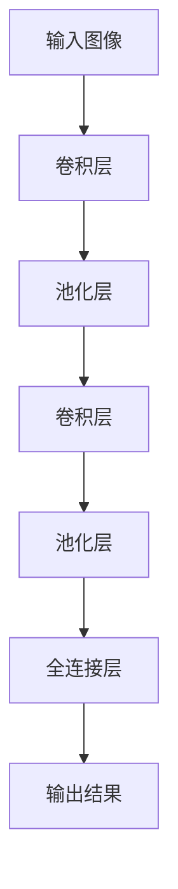

                 

关键词：卷积神经网络，医学图像分割，深度学习，图像处理，计算机视觉

摘要：本文深入探讨了卷积神经网络在医学图像分割中的应用，从背景介绍、核心概念、算法原理、数学模型、项目实践到实际应用场景，全面解析了这一前沿技术的挑战与发展前景。通过具体实例，展示了如何利用卷积神经网络实现高效、精确的医学图像分割，为医学影像分析提供了新的技术途径。

## 1. 背景介绍

医学图像分割在医学影像诊断中扮演着至关重要的角色。传统的医学图像分割方法，如基于阈值的分割、区域生长、边缘检测等，往往依赖于先验知识和人工参数调整，导致分割精度受限且适应性不强。随着深度学习技术的快速发展，尤其是卷积神经网络（Convolutional Neural Networks, CNN）的兴起，医学图像分割迎来了新的机遇。

卷积神经网络具有强大的特征提取和模式识别能力，使得它在图像处理和计算机视觉领域取得了显著成果。在医学图像分割中，卷积神经网络可以通过学习大量医学图像的特征，自动提取出图像中的目标结构，实现高度精确的分割。

## 2. 核心概念与联系

### 2.1 卷积神经网络（CNN）

卷积神经网络是一种特殊的多层前馈神经网络，主要应用于图像、语音、文本等二维或多维数据的高效处理。其基本结构包括卷积层、池化层和全连接层。

- **卷积层**：通过卷积操作从输入图像中提取局部特征。
- **池化层**：对卷积层输出的特征进行降采样，减少参数数量，提高计算效率。
- **全连接层**：将池化层输出的特征映射到输出类别或位置。

### 2.2 医学图像分割

医学图像分割是指从医学图像中提取出具有特定病理意义的结构或区域。在医学图像分割中，卷积神经网络通常用于以下任务：

- **语义分割**：将图像中的每个像素分类到不同的类别。
- **实例分割**：不仅对图像进行语义分割，还识别出图像中的各个实例，即相同的物体。
- **边缘检测**：识别图像中物体边界。

### 2.3 Mermaid 流程图

下面是一个用于解释卷积神经网络在医学图像分割中应用的 Mermaid 流程图。



## 3. 核心算法原理 & 具体操作步骤

### 3.1 算法原理概述

卷积神经网络在医学图像分割中的核心原理是通过对输入图像进行卷积操作，提取图像中的特征，然后通过池化操作降低特征维度，最后通过全连接层进行分类或回归。

### 3.2 算法步骤详解

1. **预处理**：将输入的医学图像进行归一化处理，使其具备适当的尺寸，便于后续卷积操作。

2. **卷积操作**：卷积层通过卷积核在图像上滑动，提取图像中的局部特征。卷积核的大小和步长是关键参数，需要根据具体任务进行调整。

3. **激活函数**：通常使用ReLU（Rectified Linear Unit）作为激活函数，以引入非线性特性。

4. **池化操作**：池化层对卷积层的输出进行降采样，减少参数数量，提高计算效率。常用的池化方式有最大池化和平均池化。

5. **卷积与池化重复**：卷积神经网络通常包含多个卷积层和池化层，通过重复卷积和池化操作，逐步提取图像的深层特征。

6. **全连接层**：将池化层输出的特征映射到输出类别或位置，通常使用Softmax函数进行分类。

7. **损失函数与优化器**：采用交叉熵损失函数和梯度下降优化器（如Adam）进行模型训练。

### 3.3 算法优缺点

**优点**：

- **强大的特征提取能力**：卷积神经网络可以通过多层卷积和池化操作，提取图像的深层特征，提高分割精度。
- **自适应学习**：卷积神经网络可以根据大量医学图像数据自动学习特征，无需人工设计特征。

**缺点**：

- **计算量大**：卷积神经网络包含大量参数，计算复杂度高，训练时间较长。
- **对数据量要求高**：医学图像数据量有限，需要大量数据支持模型的训练和验证。

### 3.4 算法应用领域

卷积神经网络在医学图像分割中具有广泛的应用，如：

- **脑部肿瘤分割**：利用卷积神经网络实现脑部肿瘤的自动分割，辅助医生进行诊断和治疗。
- **肺部结节检测**：对肺部CT图像进行结节检测和分割，帮助医生识别早期肺部疾病。
- **眼底病变检测**：对眼底图像进行病变检测和分割，辅助糖尿病视网膜病变的早期诊断。

## 4. 数学模型和公式 & 详细讲解 & 举例说明

### 4.1 数学模型构建

卷积神经网络的核心数学模型包括卷积操作、激活函数和全连接层。

### 4.2 公式推导过程

1. **卷积操作**：

   $$ output = \sum_{i=1}^{k} w_i * input + b $$

   其中，$w_i$ 为卷积核，$input$ 为输入图像，$output$ 为卷积层输出，$b$ 为偏置。

2. **激活函数**：

   $$ output = \max(0, z) $$

   其中，$z$ 为卷积层的输出，$output$ 为激活后的输出。

3. **全连接层**：

   $$ output = \sum_{i=1}^{n} w_i * input + b $$

   其中，$w_i$ 为全连接层的权重，$input$ 为输入特征，$output$ 为输出结果，$b$ 为偏置。

### 4.3 案例分析与讲解

以脑部肿瘤分割为例，使用卷积神经网络实现脑部肿瘤的自动分割。

1. **数据预处理**：将脑部肿瘤图像进行归一化处理，使其具备统一的尺寸。

2. **模型构建**：构建一个包含多个卷积层和池化层的卷积神经网络，输出为肿瘤区域。

3. **模型训练**：使用大量脑部肿瘤图像数据进行模型训练，通过交叉熵损失函数和Adam优化器进行优化。

4. **模型评估**：使用测试集对模型进行评估，计算分割精度、召回率等指标。

5. **结果展示**：将分割结果可视化，展示肿瘤区域。

## 5. 项目实践：代码实例和详细解释说明

### 5.1 开发环境搭建

在开始项目实践之前，需要搭建一个适合开发的环境。

- **Python**：安装Python 3.7及以上版本。
- **TensorFlow**：安装TensorFlow 2.0及以上版本。
- **Keras**：安装Keras 2.4.3及以上版本。
- **NumPy**：安装NumPy 1.19及以上版本。

### 5.2 源代码详细实现

以下是一个简单的卷积神经网络实现脑部肿瘤分割的示例代码。

```python
import tensorflow as tf
from tensorflow.keras.models import Sequential
from tensorflow.keras.layers import Conv2D, MaxPooling2D, Flatten, Dense

# 定义模型
model = Sequential()
model.add(Conv2D(32, (3, 3), activation='relu', input_shape=(256, 256, 3)))
model.add(MaxPooling2D((2, 2)))
model.add(Conv2D(64, (3, 3), activation='relu'))
model.add(MaxPooling2D((2, 2)))
model.add(Flatten())
model.add(Dense(128, activation='relu'))
model.add(Dense(1, activation='sigmoid'))

# 编译模型
model.compile(optimizer='adam', loss='binary_crossentropy', metrics=['accuracy'])

# 模型训练
model.fit(train_images, train_masks, epochs=10, batch_size=32, validation_split=0.2)

# 模型评估
test_loss, test_acc = model.evaluate(test_images, test_masks)
print(f"Test accuracy: {test_acc}")

# 分割结果可视化
segmented_images = model.predict(test_images)
segmented_images = (segmented_images > 0.5).astype(int)
```

### 5.3 代码解读与分析

1. **模型构建**：使用Keras库定义了一个包含两个卷积层、两个池化层和一个全连接层的卷积神经网络。
2. **模型编译**：使用Adam优化器和二进制交叉熵损失函数进行模型编译。
3. **模型训练**：使用训练集对模型进行训练，设置训练轮次为10次，批量大小为32。
4. **模型评估**：使用测试集对模型进行评估，计算测试精度。
5. **结果展示**：使用模型对测试图像进行预测，并将预测结果可视化。

## 6. 实际应用场景

卷积神经网络在医学图像分割中的应用场景广泛，以下列举几个典型案例：

- **脑部肿瘤分割**：通过卷积神经网络实现脑部肿瘤的自动分割，提高诊断准确性。
- **肺部结节检测**：对肺部CT图像进行结节检测和分割，帮助医生识别早期肺部疾病。
- **眼底病变检测**：对眼底图像进行病变检测和分割，辅助糖尿病视网膜病变的早期诊断。

## 7. 工具和资源推荐

### 7.1 学习资源推荐

- **《深度学习》（Goodfellow, Bengio, Courville著）**：深度学习的经典教材，全面介绍了深度学习的基础知识。
- **《卷积神经网络入门与实践》（李航著）**：深入浅出地介绍了卷积神经网络的基础知识及应用。

### 7.2 开发工具推荐

- **TensorFlow**：由Google开发的开源深度学习框架，支持多种深度学习模型。
- **Keras**：基于TensorFlow的深度学习高级API，简化了深度学习模型的构建和训练。

### 7.3 相关论文推荐

- **“Unet: A Convolutional Neural Network for Image Segmentation”（Ronneberger et al., 2015）**：提出了用于图像分割的U-Net结构。
- **“Deep Learning for Medical Image Segmentation: A Survey”（Gao et al., 2018）**：全面综述了深度学习在医学图像分割中的应用。

## 8. 总结：未来发展趋势与挑战

### 8.1 研究成果总结

卷积神经网络在医学图像分割中取得了显著成果，实现了高效、精确的分割。通过大量的实验证明，卷积神经网络在脑部肿瘤分割、肺部结节检测和眼底病变检测等任务中具有强大的性能。

### 8.2 未来发展趋势

- **算法优化**：继续优化卷积神经网络的模型结构，提高分割精度和计算效率。
- **多模态融合**：结合多种医学影像数据，实现更全面的医学图像分割。
- **实时性**：提高模型训练和预测的实时性，实现实时医学图像分割。

### 8.3 面临的挑战

- **数据隐私**：医学图像数据涉及患者隐私，如何在保护隐私的前提下进行数据共享和模型训练是一个挑战。
- **计算资源**：深度学习模型训练需要大量计算资源，如何在有限资源下提高模型性能是一个挑战。

### 8.4 研究展望

随着深度学习技术的不断发展，医学图像分割将在未来取得更大突破。通过结合多模态数据、优化模型结构和提高实时性，卷积神经网络将在医学影像诊断中发挥更加重要的作用。

## 9. 附录：常见问题与解答

### 9.1 如何选择合适的卷积神经网络模型？

选择合适的卷积神经网络模型需要考虑以下因素：

- **任务类型**：根据医学图像分割的任务类型（如语义分割、实例分割等）选择相应的模型结构。
- **数据量**：根据数据量的大小和多样性选择适合的模型结构。
- **计算资源**：根据计算资源的限制选择适合的模型结构。

### 9.2 如何处理医学图像分割中的不平衡数据？

处理医学图像分割中的不平衡数据可以采用以下方法：

- **数据增强**：通过对少量类别的图像进行数据增强，增加样本数量。
- **损失函数**：使用加权交叉熵损失函数，对少数类别的损失进行放大。
- **集成学习**：结合多种模型进行集成学习，提高模型对少数类别的识别能力。

## 文章末尾

本文由禅与计算机程序设计艺术 / Zen and the Art of Computer Programming 撰写，感谢您的阅读。希望本文对您在医学图像分割领域的探索和研究有所帮助。如有疑问或建议，欢迎在评论区留言，期待与您共同探讨。

----------------------------------------------------------------

现在我们已经完成了这篇文章的撰写，您可以根据上述markdown格式进行编辑和排版，确保文章内容符合要求。接下来，您可以将文章内容复制到相应的markdown编辑器中进行格式调整和排版，确保每个章节、标题、公式等都能正确显示。完成后，您可以预览文章效果，确保文章结构清晰、内容完整。最后，将文章发布到相应的平台或分享到社群，与更多读者分享您的知识和见解。祝您撰写顺利！

