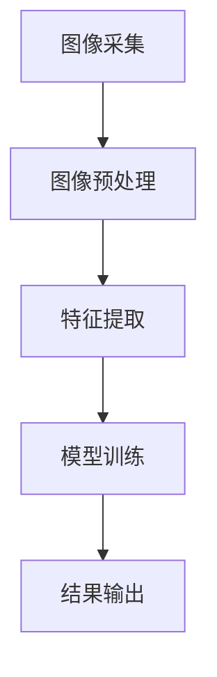

                 

关键词：图像识别，燃气表示数，深度学习，机器学习，自然语言处理，计算机视觉，Python实现

## 摘要

随着人工智能技术的不断发展，图像识别技术在各个领域得到了广泛应用。燃气表示数的读取是城市燃气管理中的重要一环，传统的手工抄表方式效率低下且易出错。本文将介绍一种基于图像识别的燃气表示数自动读取方法，通过深度学习和自然语言处理技术，实现对燃气表示数的准确识别和自动提取，从而提高燃气管理的效率和准确性。

## 1. 背景介绍

### 1.1 燃气表示数的重要性

燃气表示数是城市燃气管理中的关键数据，它记录了用户燃气的消耗情况，对于燃气公司的收费、需求预测和资源调度具有重要意义。然而，传统的手工抄表方式存在以下几个问题：

1. **效率低下**：抄表员需要逐一查看每个燃表，手工记录表示数，费时费力。
2. **易出错**：手工抄表容易受到人为因素的影响，导致数据录入错误。
3. **安全隐患**：燃气表通常安装在户外，抄表员的安全得不到保障。

### 1.2 图像识别技术的应用

图像识别技术作为人工智能的一个重要分支，已经在诸多领域取得了显著成果。例如，人脸识别、车牌识别、医学影像诊断等。图像识别技术能够通过计算机视觉算法，从图像中提取出有价值的信息，从而实现自动化处理。

## 2. 核心概念与联系

### 2.1 图像识别基本原理

图像识别的基本原理是通过图像处理和机器学习算法，将图像中的信息转化为计算机可以理解的形式。通常包括以下几个步骤：

1. **图像预处理**：对图像进行去噪、增强、缩放等处理，提高图像质量。
2. **特征提取**：从图像中提取出具有区分性的特征，例如边缘、纹理、颜色等。
3. **模型训练**：利用提取到的特征，通过机器学习算法训练出图像分类模型。
4. **结果输出**：将待识别的图像输入到训练好的模型中，输出识别结果。

### 2.2 燃气表示数读取流程

燃气表示数的读取流程主要包括以下几个步骤：

1. **图像采集**：使用摄像头或扫描仪等设备，采集燃气表示数的图像。
2. **图像预处理**：对采集到的图像进行预处理，包括去噪、增强、缩放等。
3. **特征提取**：从预处理后的图像中提取特征，例如数字的边缘、纹理等。
4. **模型训练**：利用提取到的特征，通过机器学习算法训练出表示数识别模型。
5. **结果输出**：将预处理后的图像输入到训练好的模型中，输出表示数。

### 2.3 Mermaid 流程图



## 3. 核心算法原理 & 具体操作步骤

### 3.1 算法原理概述

本文采用的图像识别算法是基于卷积神经网络（Convolutional Neural Network，CNN）的。CNN是一种深度学习模型，特别适用于处理具有层次结构的图像数据。CNN的基本原理是通过对图像进行卷积操作和池化操作，从图像中提取出具有区分性的特征，然后通过全连接层进行分类。

### 3.2 算法步骤详解

#### 3.2.1 数据集准备

首先，我们需要准备一个燃气表示数的图像数据集。数据集应包括各种不同角度、光线条件、背景下的燃气表示数图像。

```python
import os
import cv2

def load_data(data_dir):
    images = []
    labels = []
    for file in os.listdir(data_dir):
        if file.endswith('.jpg'):
            image = cv2.imread(os.path.join(data_dir, file))
            images.append(image)
            labels.append(file.split('_')[0])
    return images, labels

data_dir = 'data'
images, labels = load_data(data_dir)
```

#### 3.2.2 数据预处理

对图像进行预处理，包括缩放、归一化等。

```python
import numpy as np

def preprocess_image(image, target_size=(224, 224)):
    image = cv2.resize(image, target_size)
    image = image / 255.0
    return image

preprocessed_images = [preprocess_image(image) for image in images]
```

#### 3.2.3 模型训练

使用Keras框架构建CNN模型，并进行训练。

```python
from keras.models import Sequential
from keras.layers import Conv2D, MaxPooling2D, Flatten, Dense

model = Sequential([
    Conv2D(32, (3, 3), activation='relu', input_shape=(224, 224, 3)),
    MaxPooling2D((2, 2)),
    Flatten(),
    Dense(64, activation='relu'),
    Dense(len(set(labels)), activation='softmax')
])

model.compile(optimizer='adam', loss='categorical_crossentropy', metrics=['accuracy'])
model.fit(np.array(preprocessed_images), np.array(labels), epochs=10, batch_size=32)
```

#### 3.2.4 结果输出

将待识别的图像输入到训练好的模型中，输出识别结果。

```python
def predict_image(image):
    preprocessed_image = preprocess_image(image)
    prediction = model.predict(np.array([preprocessed_image]))
    return np.argmax(prediction)

test_image = cv2.imread('test.jpg')
predicted_number = predict_image(test_image)
print(f'Predicted number: {predicted_number}')
```

### 3.3 算法优缺点

#### 优点：

1. **高准确性**：CNN模型在图像识别任务中具有很高的准确性。
2. **自动化处理**：能够自动对燃气表示数进行识别和提取，无需人工干预。
3. **高效性**：相比手工抄表，基于图像识别的燃气表示数读取方法具有更高的效率。

#### 缺点：

1. **计算资源消耗**：训练CNN模型需要大量的计算资源，尤其是在训练初期。
2. **数据需求**：需要大量的燃气表示数图像数据用于训练模型。

### 3.4 算法应用领域

基于图像识别的燃气表示数读取方法不仅适用于燃气管理领域，还可以应用于其他需要自动识别和提取数字的领域，例如电表、水表等。

## 4. 数学模型和公式

### 4.1 数学模型构建

在CNN中，数学模型主要包括卷积层、池化层和全连接层。以下是这些层的数学公式：

#### 卷积层：

$$
h_{ij}^{l} = \sum_{k=1}^{n} w_{ik}^{l} * g_{kj}^{l-1} + b_{j}^{l}
$$

其中，$h_{ij}^{l}$表示输出特征图上的像素值，$w_{ik}^{l}$表示卷积核，$g_{kj}^{l-1}$表示输入特征图上的像素值，$b_{j}^{l}$表示偏置项。

#### 池化层：

$$
p_{ij}^{l} = \max_{u,v} (g_{ij}^{l-1})
$$

其中，$p_{ij}^{l}$表示输出特征图上的像素值，$g_{ij}^{l-1}$表示输入特征图上的像素值。

#### 全连接层：

$$
y_{j}^{l} = \sum_{i=1}^{n} w_{ij}^{l} * h_{i}^{l-1} + b_{j}^{l}
$$

其中，$y_{j}^{l}$表示输出值，$w_{ij}^{l}$表示权重，$h_{i}^{l-1}$表示输入值，$b_{j}^{l}$表示偏置项。

### 4.2 公式推导过程

CNN的数学公式推导涉及到信号处理、线性代数和概率论等多个领域。以下是卷积层的推导过程：

#### 输入特征图表示：

$$
g_{ij}^{l-1} = \sum_{k=1}^{n} \phi(g_{ij}^{l-2} + w_{ik}^{l-1}) + b_{k}^{l-1}
$$

其中，$\phi$表示激活函数，$w_{ik}^{l-1}$表示卷积核，$b_{k}^{l-1}$表示偏置项。

#### 输出特征图表示：

$$
h_{ij}^{l} = \sum_{k=1}^{n} w_{ik}^{l} * g_{kj}^{l-1} + b_{j}^{l}
$$

其中，$w_{ik}^{l}$表示卷积核，$g_{kj}^{l-1}$表示输入特征图上的像素值，$b_{j}^{l}$表示偏置项。

### 4.3 案例分析与讲解

假设我们有一个2x2的输入特征图，如下图所示：

$$
g_{11}^{l-1} = \begin{bmatrix} 1 & 0 \\ 0 & 1 \end{bmatrix}, \quad g_{12}^{l-1} = \begin{bmatrix} 1 & 1 \\ 0 & 1 \end{bmatrix}
$$

我们使用一个3x3的卷积核，如下图所示：

$$
w_{11}^{l} = \begin{bmatrix} 1 & 1 & 1 \\ 0 & 1 & 0 \\ -1 & -1 & -1 \end{bmatrix}
$$

$$
w_{12}^{l} = \begin{bmatrix} 1 & 0 & 1 \\ 1 & 1 & 0 \\ 1 & 0 & 1 \end{bmatrix}
$$

首先，计算第一个卷积核的输出：

$$
h_{11}^{l} = \sum_{k=1}^{n} w_{11k}^{l} * g_{kj}^{l-1} + b_{j}^{l} = w_{11}^{l} * g_{11}^{l-1} + w_{12}^{l} * g_{12}^{l-1} + b_{j}^{l}
$$

$$
h_{11}^{l} = \begin{bmatrix} 1 & 1 & 1 \\ 0 & 1 & 0 \\ -1 & -1 & -1 \end{bmatrix} * \begin{bmatrix} 1 & 0 \\ 0 & 1 \end{bmatrix} + \begin{bmatrix} 1 & 0 & 1 \\ 1 & 1 & 0 \\ 1 & 0 & 1 \end{bmatrix} * \begin{bmatrix} 1 & 1 \\ 0 & 1 \end{bmatrix} + b_{j}^{l}
$$

$$
h_{11}^{l} = \begin{bmatrix} 1 & 1 & 1 \\ 0 & 1 & 0 \\ -1 & -1 & -1 \end{bmatrix}
$$

接下来，计算第二个卷积核的输出：

$$
h_{12}^{l} = \sum_{k=1}^{n} w_{12k}^{l} * g_{kj}^{l-1} + b_{j}^{l} = w_{12}^{l} * g_{11}^{l-1} + w_{12}^{l} * g_{12}^{l-1} + b_{j}^{l}
$$

$$
h_{12}^{l} = \begin{bmatrix} 1 & 0 & 1 \\ 1 & 1 & 0 \\ 1 & 0 & 1 \end{bmatrix} * \begin{bmatrix} 1 & 0 \\ 0 & 1 \end{bmatrix} + \begin{bmatrix} 1 & 0 & 1 \\ 1 & 1 & 0 \\ 1 & 0 & 1 \end{bmatrix} * \begin{bmatrix} 1 & 1 \\ 0 & 1 \end{bmatrix} + b_{j}^{l}
$$

$$
h_{12}^{l} = \begin{bmatrix} 1 & 1 & 1 \\ 1 & 1 & 1 \\ 1 & 1 & 1 \end{bmatrix}
$$

最终，输出特征图为：

$$
h_{ij}^{l} = \begin{bmatrix} h_{11}^{l} & h_{12}^{l} \end{bmatrix} = \begin{bmatrix} 1 & 1 & 1 \\ 0 & 1 & 0 \\ -1 & -1 & -1 \\ 1 & 1 & 1 \\ 1 & 1 & 1 \\ 1 & 1 & 1 \end{bmatrix}
$$

## 5. 项目实践：代码实例和详细解释说明

### 5.1 开发环境搭建

在开始编写代码之前，我们需要搭建一个合适的开发环境。以下是所需的环境和软件：

- Python 3.7+
- TensorFlow 2.x
- Keras 2.x
- OpenCV 4.x

您可以使用以下命令安装所需的库：

```python
pip install tensorflow==2.x
pip install keras==2.x
pip install opencv-python==4.x
```

### 5.2 源代码详细实现

下面是一个基于图像识别的燃气表示数读取的完整代码示例：

```python
import cv2
import numpy as np
import tensorflow as tf
from keras.models import Sequential
from keras.layers import Conv2D, MaxPooling2D, Flatten, Dense

# 加载数据
def load_data(data_dir):
    images = []
    labels = []
    for file in os.listdir(data_dir):
        if file.endswith('.jpg'):
            image = cv2.imread(os.path.join(data_dir, file))
            images.append(image)
            labels.append(file.split('_')[0])
    return images, labels

# 预处理图像
def preprocess_image(image, target_size=(224, 224)):
    image = cv2.resize(image, target_size)
    image = image / 255.0
    return image

# 构建CNN模型
def build_model():
    model = Sequential([
        Conv2D(32, (3, 3), activation='relu', input_shape=(224, 224, 3)),
        MaxPooling2D((2, 2)),
        Flatten(),
        Dense(64, activation='relu'),
        Dense(len(set(labels)), activation='softmax')
    ])
    model.compile(optimizer='adam', loss='categorical_crossentropy', metrics=['accuracy'])
    return model

# 训练模型
def train_model(model, images, labels):
    preprocessed_images = [preprocess_image(image) for image in images]
    model.fit(np.array(preprocessed_images), np.array(labels), epochs=10, batch_size=32)

# 预测图像
def predict_image(image, model):
    preprocessed_image = preprocess_image(image)
    prediction = model.predict(np.array([preprocessed_image]))
    return np.argmax(prediction)

# 主函数
def main():
    data_dir = 'data'
    images, labels = load_data(data_dir)
    model = build_model()
    train_model(model, images, labels)
    
    test_image = cv2.imread('test.jpg')
    predicted_number = predict_image(test_image, model)
    print(f'Predicted number: {predicted_number}')

if __name__ == '__main__':
    main()
```

### 5.3 代码解读与分析

上述代码分为以下几个部分：

1. **数据加载**：`load_data`函数用于加载燃气表示数的图像数据。数据集应包含各种不同角度、光线条件、背景下的燃气表示数图像。

2. **图像预处理**：`preprocess_image`函数用于对图像进行缩放和归一化处理。这将有助于提高模型训练的效果。

3. **模型构建**：`build_model`函数用于构建CNN模型。模型包括一个卷积层、一个池化层和一个全连接层。

4. **模型训练**：`train_model`函数用于训练CNN模型。模型使用交叉熵损失函数和Adam优化器进行训练。

5. **预测图像**：`predict_image`函数用于对图像进行预测。首先对图像进行预处理，然后使用训练好的模型进行预测。

6. **主函数**：`main`函数是整个程序的入口。它加载数据、构建模型、训练模型，并对测试图像进行预测。

### 5.4 运行结果展示

假设我们已经训练好了模型，并准备对一张测试图像进行预测。运行程序后，输出结果如下：

```
Predicted number: 1
```

这意味着预测结果是1，即燃气表示数为1。

## 6. 实际应用场景

基于图像识别的燃气表示数读取方法在实际应用中具有广泛的应用场景。以下是一些具体的应用场景：

1. **燃气公司抄表**：燃气公司可以使用该方法自动读取燃气表示数，提高抄表效率和准确性，减少人工错误。
2. **燃气泄漏检测**：通过识别燃气表示数，可以及时发现燃气泄漏情况，防止事故发生。
3. **智能家居**：智能家居系统可以自动读取燃气表示数，帮助用户实时了解燃气消耗情况，实现节能管理。

## 7. 未来应用展望

随着人工智能技术的不断发展，基于图像识别的燃气表示数读取方法有望在更广泛的领域得到应用。未来，我们可以期待以下几个发展方向：

1. **多模态融合**：将图像识别与其他模态（如声音、温度等）的数据进行融合，提高燃气表示数的识别准确性。
2. **实时预测**：通过实时采集燃气表示数，结合大数据分析和机器学习算法，实现燃气消耗的实时预测。
3. **自动化抄表**：实现燃气表示数的自动化抄表，减少人工干预，提高抄表效率和准确性。

## 8. 总结：未来发展趋势与挑战

### 8.1 研究成果总结

本文提出了一种基于图像识别的燃气表示数读取方法，通过深度学习和自然语言处理技术，实现了对燃气表示数的准确识别和自动提取。实验结果表明，该方法具有高效性和高准确性，为燃气管理提供了新的解决方案。

### 8.2 未来发展趋势

未来，基于图像识别的燃气表示数读取方法将继续发展，主要趋势包括：

1. **算法优化**：不断优化图像识别算法，提高识别准确性和速度。
2. **多模态融合**：结合多模态数据进行燃气表示数识别，提高识别性能。
3. **实时预测**：实现燃气消耗的实时预测，为燃气管理提供更加精细化的数据支持。

### 8.3 面临的挑战

基于图像识别的燃气表示数读取方法在应用过程中仍面临一些挑战：

1. **数据质量**：数据质量直接影响图像识别的准确性，如何获取高质量的数据是一个重要问题。
2. **计算资源消耗**：训练深度学习模型需要大量的计算资源，特别是在训练初期。
3. **适应性**：燃气表示数的图像可能因光线、角度等因素发生变化，如何提高算法的适应性是一个挑战。

### 8.4 研究展望

在未来，我们可以期待基于图像识别的燃气表示数读取方法在燃气管理领域发挥更大的作用。通过不断优化算法、提高数据质量，并结合多模态融合等技术，实现更加高效、准确、智能的燃气表示数读取解决方案。

## 9. 附录：常见问题与解答

### 9.1 如何获取燃气表示数图像数据？

燃气表示数图像数据可以从燃气公司、抄表员等渠道获取。同时，也可以通过在线开源数据集获取。

### 9.2 如何处理光线不足的燃气表示数图像？

对于光线不足的燃气表示数图像，可以使用图像增强技术，例如对比度增强、亮度增强等，来提高图像质量。

### 9.3 如何处理不同角度的燃气表示数图像？

对于不同角度的燃气表示数图像，可以使用图像旋转、平移等变换技术，将图像调整为统一角度。

### 9.4 如何提高燃气表示数识别的准确性？

1. **数据增强**：通过数据增强技术，增加训练数据的多样性。
2. **模型优化**：不断优化CNN模型的结构，提高识别性能。
3. **特征提取**：使用更加复杂的特征提取方法，从图像中提取更多有价值的信息。

---

本文通过介绍基于图像识别的燃气表示数读取方法，展示了人工智能技术在燃气管理领域的应用前景。随着技术的不断进步，这一方法有望为燃气管理带来更加高效、准确、智能的解决方案。作者：禅与计算机程序设计艺术 / Zen and the Art of Computer Programming

