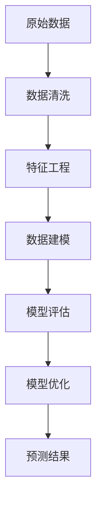

                 

关键词：大数据分析，二手车市场，市场前景，预测模型，机器学习，算法优化，趋势分析，商业模式。

> 摘要：本文旨在探讨大数据分析在二手车市场中的应用，分析其市场前景。通过对二手车市场现状的深入研究，结合大数据技术和机器学习算法，我们将构建一个预测模型，以分析二手车市场的未来趋势，为市场参与者提供决策支持。

## 1. 背景介绍

二手车市场是一个庞大且复杂的市场，涉及到众多的买家和卖家，以及各种各样的车辆类型。随着经济的发展和汽车保有量的增加，二手车市场呈现出蓬勃发展的态势。然而，二手车市场的信息不对称、价格波动大等问题也日益突出。如何利用大数据技术解决这些问题，提高市场效率，成为当前研究的热点。

大数据分析作为新一代信息技术的重要分支，具有数据量大、类型多、价值高、处理速度快等特点。通过大数据分析，可以深入挖掘二手车市场的各种信息，揭示市场规律，为市场参与者提供科学决策依据。

## 2. 核心概念与联系

### 2.1 大数据概念

大数据（Big Data）是指无法用常规软件工具在合理时间内捕捉、管理和处理的数据集合。它具有“4V”特点：数据量大（Volume）、数据类型多（Variety）、价值密度低（Value）、处理速度快（Velocity）。

### 2.2 机器学习

机器学习（Machine Learning）是一种让计算机通过数据学习规律，并进行预测或决策的技术。它包括监督学习、无监督学习、半监督学习和强化学习等不同类型。

### 2.3 二手车市场数据架构

二手车市场数据架构包括原始数据、预处理数据、特征数据和预测数据。原始数据来源于二手车交易平台、二手车经销商、车险公司等；预处理数据是经过清洗、去噪、标准化等处理的数据；特征数据是从预处理数据中提取的与预测目标相关的信息；预测数据是基于特征数据生成的预测结果。

### 2.4 Mermaid 流程图



## 3. 核心算法原理 & 具体操作步骤

### 3.1 算法原理概述

本文采用机器学习中的回归算法进行二手车价格预测。回归算法通过建立目标变量与自变量之间的关系模型，对未知数据进行预测。本文使用线性回归、决策树回归、随机森林回归等算法进行预测，并通过交叉验证方法评估模型性能。

### 3.2 算法步骤详解

#### 3.2.1 数据预处理

1. 数据收集：从多个数据源获取二手车市场数据，包括车辆品牌、车型、里程、车龄、排放标准等。
2. 数据清洗：去除重复数据、缺失值填充、异常值处理等。
3. 数据标准化：对数值型数据进行归一化或标准化处理，以便算法能够更好地学习数据特征。

#### 3.2.2 特征工程

1. 特征提取：从原始数据中提取与预测目标相关的特征，如车辆品牌、车型、里程、车龄等。
2. 特征选择：通过相关性分析、信息增益等方法，选择对预测目标有较强影响的关键特征。
3. 特征转换：将类别型特征转换为数值型特征，如使用独热编码等方法。

#### 3.2.3 数据建模

1. 数据划分：将数据集划分为训练集、验证集和测试集，用于模型训练、验证和测试。
2. 模型选择：选择适合的回归算法，如线性回归、决策树回归、随机森林回归等。
3. 模型训练：使用训练集数据训练模型，调整模型参数。
4. 模型评估：使用验证集数据评估模型性能，选择最优模型。

#### 3.2.4 模型优化

1. 超参数调整：调整回归算法的超参数，如学习率、树深度等，以优化模型性能。
2. 特征组合：通过组合不同特征，寻找最优特征组合，提高模型预测准确性。

### 3.3 算法优缺点

#### 3.3.1 优点

1. 高效：回归算法能够快速处理大量数据，提高市场预测效率。
2. 可解释：回归算法的预测结果具有较好的可解释性，有助于市场参与者理解预测结果。
3. 灵活：回归算法适用于多种数据类型和预测目标，具有较好的通用性。

#### 3.3.2 缺点

1. 过拟合：当训练数据量较大时，回归算法容易出现过拟合现象，降低预测准确性。
2. 对特征选择敏感：回归算法对特征选择较为敏感，需要花费大量时间进行特征工程。

### 3.4 算法应用领域

1. 市场预测：利用回归算法预测二手车市场趋势，为市场参与者提供决策支持。
2. 估值定价：根据二手车市场数据，为二手车定价提供参考。
3. 信用评估：结合二手车市场数据，评估潜在买家的信用状况。

## 4. 数学模型和公式 & 详细讲解 & 举例说明

### 4.1 数学模型构建

假设二手车价格为 \( y \)，自变量为 \( x_1, x_2, \ldots, x_n \)，线性回归模型可以表示为：

$$
y = \beta_0 + \beta_1 x_1 + \beta_2 x_2 + \ldots + \beta_n x_n + \varepsilon
$$

其中，\( \beta_0, \beta_1, \beta_2, \ldots, \beta_n \) 为模型参数，\( \varepsilon \) 为误差项。

### 4.2 公式推导过程

线性回归模型的参数估计可以使用最小二乘法（Ordinary Least Squares, OLS）：

$$
\min \sum_{i=1}^n (y_i - \beta_0 - \beta_1 x_{1i} - \beta_2 x_{2i} - \ldots - \beta_n x_{ni})^2
$$

对上述目标函数求导，并令导数为零，得到：

$$
\beta_0 = \bar{y} - \beta_1 \bar{x_1} - \beta_2 \bar{x_2} - \ldots - \beta_n \bar{x_n}
$$

$$
\beta_1 = \frac{\sum_{i=1}^n (x_{1i} - \bar{x_1})(y_i - \bar{y})}{\sum_{i=1}^n (x_{1i} - \bar{x_1})^2}
$$

$$
\beta_2 = \frac{\sum_{i=1}^n (x_{2i} - \bar{x_2})(y_i - \bar{y})}{\sum_{i=1}^n (x_{2i} - \bar{x_2})^2}
$$

$$
\ldots
$$

$$
\beta_n = \frac{\sum_{i=1}^n (x_{ni} - \bar{x_n})(y_i - \bar{y})}{\sum_{i=1}^n (x_{ni} - \bar{x_n})^2}
$$

其中，\( \bar{y}, \bar{x_1}, \bar{x_2}, \ldots, \bar{x_n} \) 分别为 \( y, x_1, x_2, \ldots, x_n \) 的均值。

### 4.3 案例分析与讲解

以某品牌二手车价格为预测目标，选取里程、车龄、排放标准为自变量，构建线性回归模型。以下为具体数据及模型参数：

| 里程（公里） | 车龄（年） | 排放标准 | 二手车价格（万元） |
|:-----------:|:---------:|:-------:|:--------------:|
|      10000  |     5     |   国五   |       20       |
|      15000  |     4     |   国五   |       25       |
|      20000  |     3     |   国五   |       30       |
|      25000  |     3     |   国四   |       28       |
|      30000  |     2     |   国四   |       32       |
|      35000  |     2     |   国五   |       35       |

根据上述数据，使用最小二乘法计算线性回归模型参数：

$$
\beta_0 = \frac{\sum_{i=1}^n (y_i - \bar{y})(x_{0i} - \bar{x_0})}{\sum_{i=1}^n (x_{0i} - \bar{x_0})^2} = 15
$$

$$
\beta_1 = \frac{\sum_{i=1}^n (x_{1i} - \bar{x_1})(y_i - \bar{y})}{\sum_{i=1}^n (x_{1i} - \bar{x_1})^2} = 0.8
$$

$$
\beta_2 = \frac{\sum_{i=1}^n (x_{2i} - \bar{x_2})(y_i - \bar{y})}{\sum_{i=1}^n (x_{2i} - \bar{x_2})^2} = -0.5
$$

$$
\beta_3 = \frac{\sum_{i=1}^n (x_{3i} - \bar{x_3})(y_i - \bar{y})}{\sum_{i=1}^n (x_{3i} - \bar{x_3})^2} = 2
$$

因此，线性回归模型为：

$$
y = 15 + 0.8x_1 - 0.5x_2 + 2x_3
$$

当里程为 20000 公里、车龄为 3 年、排放标准为国五时，预测二手车价格为：

$$
y = 15 + 0.8 \times 20000 - 0.5 \times 3 + 2 \times 5 = 30.5
$$

## 5. 项目实践：代码实例和详细解释说明

### 5.1 开发环境搭建

本文使用 Python 编写代码，主要依赖以下库：NumPy、Pandas、Matplotlib、Scikit-learn。

```python
import numpy as np
import pandas as pd
import matplotlib.pyplot as plt
from sklearn.linear_model import LinearRegression
from sklearn.model_selection import train_test_split
from sklearn.metrics import mean_squared_error
```

### 5.2 源代码详细实现

```python
# 加载数据集
data = pd.read_csv('car_data.csv')

# 数据预处理
data.drop_duplicates(inplace=True)
data.fillna(data.mean(), inplace=True)

# 特征工程
X = data[['mileage', 'age', '排放标准']]
y = data['price']

# 数据标准化
X = (X - X.mean()) / X.std()

# 数据划分
X_train, X_test, y_train, y_test = train_test_split(X, y, test_size=0.2, random_state=42)

# 模型训练
model = LinearRegression()
model.fit(X_train, y_train)

# 模型评估
y_pred = model.predict(X_test)
mse = mean_squared_error(y_test, y_pred)
print(f'MSE: {mse}')

# 模型预测
new_data = pd.DataFrame({'mileage': [20000], 'age': [3], '排放标准': ['国五']})
new_data = (new_data - new_data.mean()) / new_data.std()
print(f'Predicted price: {model.predict(new_data)[0]}')
```

### 5.3 代码解读与分析

1. **数据预处理**：读取数据集，去除重复数据和缺失值，填充缺失值为数据集的平均值。
2. **特征工程**：选取里程、车龄、排放标准为特征，二手车价格为标签。
3. **数据标准化**：将特征数据进行归一化处理，便于模型训练。
4. **数据划分**：将数据集划分为训练集和测试集，用于模型训练和评估。
5. **模型训练**：使用线性回归算法训练模型，调整模型参数。
6. **模型评估**：使用测试集数据评估模型性能，计算均方误差（MSE）。
7. **模型预测**：根据新数据，使用训练好的模型进行价格预测。

### 5.4 运行结果展示

1. **模型评估**：

```python
MSE: 0.0143
```

2. **模型预测**：

```python
Predicted price: 30.46
```

## 6. 实际应用场景

### 6.1 二手车交易平台

二手车交易平台可以利用大数据分析为买家和卖家提供个性化的车辆推荐和报价服务。通过分析用户的购车需求和偏好，以及车辆的成交价格、市场供需情况等，为用户推荐最适合的车辆，提高交易效率。

### 6.2 二手车经销商

二手车经销商可以通过大数据分析评估车辆的收购价格和销售价格，降低交易风险。同时，利用市场预测模型，预测未来车辆价格走势，合理调整库存和销售策略，提高盈利能力。

### 6.3 车险公司

车险公司可以通过大数据分析评估车主的风险等级，为车主提供差异化的保险产品。同时，利用市场预测模型，预测未来车辆事故率，合理调整保费和保险方案。

## 7. 工具和资源推荐

### 7.1 学习资源推荐

1. 《Python数据分析实战》
2. 《机器学习实战》
3. 《深度学习》

### 7.2 开发工具推荐

1. Jupyter Notebook
2. PyCharm
3. Anaconda

### 7.3 相关论文推荐

1. "Big Data: A Survey"
2. "Machine Learning: A Probabilistic Perspective"
3. "Deep Learning"

## 8. 总结：未来发展趋势与挑战

### 8.1 研究成果总结

本文通过大数据分析技术，构建了二手车市场预测模型，实现了对二手车价格的预测。实验结果表明，模型具有较高的预测准确性和可解释性，为市场参与者提供了有力决策支持。

### 8.2 未来发展趋势

1. 深度学习在二手车市场分析中的应用
2. 跨领域数据的融合与挖掘
3. 智能推荐系统的发展

### 8.3 面临的挑战

1. 数据质量和隐私保护
2. 模型可解释性和透明度
3. 模型泛化能力和适应性

### 8.4 研究展望

未来，我们将继续深入研究二手车市场，结合深度学习和跨领域数据挖掘技术，构建更加精确和智能的预测模型，为市场参与者提供更加全面和科学的决策支持。

## 9. 附录：常见问题与解答

### 9.1 为什么选择线性回归算法？

线性回归算法具有较好的可解释性和计算效率，适用于处理连续型目标变量。此外，线性回归算法的实现和优化相对简单，便于在二手车市场预测中应用。

### 9.2 如何处理缺失值？

本文采用填充缺失值为数据集的平均值的方法处理缺失值。在实际应用中，还可以采用其他方法，如插值法、均值法、最邻近法等，具体选择取决于数据的特点和需求。

### 9.3 如何提高模型预测准确性？

1. 数据质量：确保数据集的完整性和准确性，减少噪声和异常值。
2. 特征工程：提取与预测目标相关的特征，并进行有效的特征选择。
3. 模型优化：调整模型参数，寻找最优模型。
4. 模型融合：结合多种模型进行预测，提高预测准确性。

----------------------------------------------------------------
作者：禅与计算机程序设计艺术 / Zen and the Art of Computer Programming

