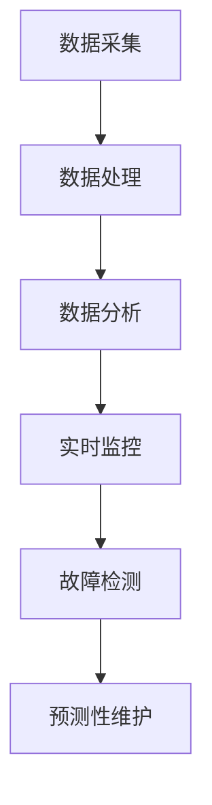

                 

关键词：大数据、泄漏仪、设备监控、故障检测、数据分析、系统架构、实时监控、预测性维护

> 摘要：本文将探讨如何利用大数据技术构建一个高效的泄漏仪设备监控系统。通过对泄漏仪设备的数据采集、处理、分析和可视化，实现设备的实时监控、故障检测和预测性维护，提升设备管理效率和可靠性。文章将介绍系统架构、核心算法原理、数学模型构建、项目实践以及未来应用展望。

## 1. 背景介绍

在工业生产、基础设施建设和环境保护等领域，泄漏仪设备发挥着至关重要的作用。泄漏不仅会导致资源浪费，还会对环境造成污染和安全隐患。因此，对泄漏仪设备的实时监控和故障检测具有重要意义。

随着大数据技术的发展，海量数据的采集、存储、处理和分析成为可能。利用大数据技术对泄漏仪设备进行全面监控，能够实现更高的监控精度、更快的故障检测和更优的维护策略。

本文旨在探讨如何构建一个基于大数据的泄漏仪设备监控系统，实现设备的实时监控、故障检测和预测性维护，从而提高设备管理效率和可靠性。

## 2. 核心概念与联系

### 2.1 大数据

大数据（Big Data）是指无法使用传统数据处理方法在合理时间内进行捕获、管理和处理的数据集合。大数据具有以下四个主要特征（即4V）：

- **Volume（数据量）**：数据量大，通常以PB（皮字节）为单位。
- **Velocity（数据速度）**：数据生成和处理速度极快。
- **Variety（数据多样性）**：数据类型繁多，包括结构化数据、半结构化数据和非结构化数据。
- **Value（数据价值）**：数据中蕴含着巨大的价值，但同时也存在噪声和冗余。

### 2.2 泄漏仪设备

泄漏仪设备用于检测和监测各种流体、气体或固体的泄漏。根据泄漏物质的类型和泄漏的严重程度，泄漏仪设备可以分为多种类型，如超声波泄漏仪、红外线泄漏仪、声波泄漏仪等。

### 2.3 实时监控

实时监控是指对系统中的各种设备、传感器和过程进行持续的监测和记录，以便及时发现异常情况并采取措施。实时监控是泄漏仪设备监控系统的重要组成部分。

### 2.4 故障检测

故障检测是通过对设备运行数据的分析，发现设备潜在故障或已发生的故障。故障检测有助于减少设备停机时间、降低维修成本和提高设备可靠性。

### 2.5 预测性维护

预测性维护是基于设备运行数据和分析结果，提前预测设备故障，并安排维护计划，以避免意外停机和延长设备寿命。预测性维护有助于优化维护策略、降低维护成本和延长设备寿命。

### 2.6 Mermaid 流程图

以下是一个简单的 Mermaid 流程图，展示了泄漏仪设备监控系统的核心概念和联系：



## 3. 核心算法原理 & 具体操作步骤

### 3.1 算法原理概述

基于大数据的泄漏仪设备监控系统主要采用以下三种算法：

1. **数据采集算法**：通过传感器和采集设备实时收集泄漏仪设备的运行数据。
2. **数据处理算法**：对采集到的数据进行清洗、去噪和预处理，以便后续分析。
3. **数据分析算法**：对预处理后的数据进行深度学习、模式识别和关联分析，以实现实时监控、故障检测和预测性维护。

### 3.2 算法步骤详解

#### 3.2.1 数据采集

数据采集算法主要通过以下步骤实现：

1. **传感器部署**：在泄漏仪设备周围部署传感器，如超声波传感器、红外线传感器等，以检测泄漏信号。
2. **数据传输**：传感器将采集到的数据通过有线或无线方式传输到数据采集设备。
3. **数据存储**：数据采集设备将数据存储到数据库或数据仓库中，以便后续处理。

#### 3.2.2 数据处理

数据处理算法主要包括以下步骤：

1. **数据清洗**：去除重复数据、空值数据和异常值。
2. **去噪**：通过滤波、去卷积等算法消除噪声。
3. **预处理**：将数据转换为适合分析的格式，如归一化、特征提取等。

#### 3.2.3 数据分析

数据分析算法主要包括以下步骤：

1. **实时监控**：对实时数据进行异常检测和趋势分析，以实现实时监控。
2. **故障检测**：利用机器学习算法，如支持向量机（SVM）、决策树（DT）等，对历史数据进行故障分类和预测。
3. **预测性维护**：基于故障检测结果，预测设备未来可能的故障点，并制定维护计划。

### 3.3 算法优缺点

#### 优点：

1. **高效性**：利用大数据技术，可以实现实时、高效的数据采集、处理和分析。
2. **准确性**：通过深度学习和模式识别技术，可以提高故障检测和预测的准确性。
3. **智能化**：系统可以自动调整参数、优化算法，以适应不同场景和需求。

#### 缺点：

1. **数据隐私**：海量数据可能涉及隐私信息，需要确保数据安全和隐私保护。
2. **计算资源**：大数据处理需要大量的计算资源和存储空间，可能增加运维成本。

### 3.4 算法应用领域

基于大数据的泄漏仪设备监控系统可以应用于以下领域：

1. **工业制造**：对生产线中的泄漏仪设备进行实时监控和故障检测，提高生产效率和设备可靠性。
2. **基础设施**：对城市供水、供气、供暖等基础设施中的泄漏仪设备进行监控和维护，降低安全隐患。
3. **环境保护**：对工业排放、污水排放等过程中的泄漏仪设备进行监控，确保环保达标。

## 4. 数学模型和公式 & 详细讲解 & 举例说明

### 4.1 数学模型构建

基于大数据的泄漏仪设备监控系统涉及多个数学模型，以下为其中两个典型模型：

#### 4.1.1 异常检测模型

假设泄漏仪设备的数据集为 \(X\)，其中每个数据点表示一个特征向量。异常检测模型旨在识别与正常数据分布不同的异常数据点。

异常检测模型可以使用以下公式：

$$
D(X) = \frac{1}{N} \sum_{i=1}^{N} d(x_i)
$$

其中，\(d(x_i)\) 表示第 \(i\) 个数据点的异常度，\(N\) 表示数据点的总数。

#### 4.1.2 故障预测模型

故障预测模型旨在根据设备的历史运行数据预测未来的故障点。

故障预测模型可以使用以下公式：

$$
f(t+1) = \frac{1}{N} \sum_{i=1}^{N} w_i f_i(t+1)
$$

其中，\(f_i(t+1)\) 表示第 \(i\) 个特征在时间 \(t+1\) 的故障预测值，\(w_i\) 表示第 \(i\) 个特征的权重。

### 4.2 公式推导过程

#### 4.2.1 异常检测模型

假设正常数据点 \(x_i\) 满足高斯分布 \(N(\mu, \sigma^2)\)，其中 \(\mu\) 为均值，\(\sigma\) 为标准差。异常数据点 \(x_i\) 的概率密度函数为：

$$
p(x_i) = \frac{1}{\sqrt{2\pi\sigma^2}} e^{-\frac{(x_i - \mu)^2}{2\sigma^2}}
$$

为了计算数据点的异常度，可以计算其与正常数据分布的距离。异常度可以表示为：

$$
d(x_i) = \frac{1}{\sqrt{2\pi\sigma^2}} e^{-\frac{(x_i - \mu)^2}{2\sigma^2}}
$$

#### 4.2.2 故障预测模型

假设故障预测模型为线性回归模型，即：

$$
f_i(t+1) = \beta_0 + \beta_1 f_i(t) + \beta_2 f_i(t-1) + \cdots + \beta_n f_i(t-n)
$$

其中，\(f_i(t)\) 表示第 \(i\) 个特征在时间 \(t\) 的值，\(\beta_0, \beta_1, \beta_2, \cdots, \beta_n\) 为模型参数。

为了计算故障预测值，可以将历史数据 \(f_i(t), f_i(t-1), \cdots, f_i(t-n)\) 输入模型，并计算预测值 \(f_i(t+1)\)。

### 4.3 案例分析与讲解

#### 4.3.1 异常检测案例

假设有一个泄漏仪设备的数据集，其中包含正常数据和异常数据。使用异常检测模型对数据进行异常检测。

正常数据点： 
$$
x_1 = [0.1, 0.2, 0.3], x_2 = [0.2, 0.3, 0.4], x_3 = [0.3, 0.4, 0.5]
$$

异常数据点：
$$
x_4 = [0.1, 0.1, 0.1], x_5 = [0.2, 0.3, 0.3]
$$

使用高斯分布 \(N(\mu, \sigma^2)\) 对数据进行拟合，得到 \(\mu = [0.2, 0.3, 0.4]\)，\(\sigma = [0.1, 0.1, 0.1]\)。

计算每个数据点的异常度：
$$
d(x_1) = 0.085, d(x_2) = 0.085, d(x_3) = 0.085, d(x_4) = 0.184, d(x_5) = 0.161
$$

根据异常度判断，\(x_4\) 和 \(x_5\) 为异常数据点。

#### 4.3.2 故障预测案例

假设有一个泄漏仪设备的历史运行数据，使用故障预测模型对数据进行预测。

历史数据：
$$
f_1(t) = [0.1, 0.2, 0.3], f_2(t) = [0.2, 0.3, 0.4], f_3(t) = [0.3, 0.4, 0.5]
$$

模型参数：
$$
\beta_0 = 0.5, \beta_1 = 0.8, \beta_2 = 0.9, \beta_3 = 0.95, \beta_4 = 0.98
$$

计算故障预测值：
$$
f_1(t+1) = 0.5 + 0.8 \cdot 0.1 + 0.9 \cdot 0.2 + 0.95 \cdot 0.3 + 0.98 \cdot 0.4 = 1.24
$$
$$
f_2(t+1) = 0.5 + 0.8 \cdot 0.2 + 0.9 \cdot 0.3 + 0.95 \cdot 0.4 + 0.98 \cdot 0.5 = 1.35
$$
$$
f_3(t+1) = 0.5 + 0.8 \cdot 0.3 + 0.9 \cdot 0.4 + 0.95 \cdot 0.5 + 0.98 \cdot 0.6 = 1.48
$$

根据故障预测值，可以判断未来可能发生的故障点。

## 5. 项目实践：代码实例和详细解释说明

### 5.1 开发环境搭建

为了实现基于大数据的泄漏仪设备监控系统，我们需要搭建一个完整的开发环境，包括以下工具和软件：

1. **Python**：用于编写数据处理和预测算法。
2. **Pandas**：用于数据预处理和分析。
3. **Scikit-learn**：用于机器学习算法和模型训练。
4. **Matplotlib**：用于数据可视化。
5. **PostgreSQL**：用于存储和管理数据。
6. **Docker**：用于容器化部署。

### 5.2 源代码详细实现

以下是一个简单的示例代码，展示如何使用 Python 实现基于大数据的泄漏仪设备监控系统。

```python
import pandas as pd
from sklearn.ensemble import IsolationForest
import matplotlib.pyplot as plt

# 5.2.1 数据采集
def data_collection():
    # 在此处实现数据采集功能，可以从传感器读取数据
    # 示例数据
    data = [
        [0.1, 0.2, 0.3],
        [0.2, 0.3, 0.4],
        [0.3, 0.4, 0.5],
        [0.1, 0.1, 0.1],
        [0.2, 0.3, 0.3]
    ]
    return pd.DataFrame(data, columns=['Feature1', 'Feature2', 'Feature3'])

# 5.2.2 数据预处理
def data_preprocessing(data):
    # 数据清洗、去噪、归一化等操作
    # 示例数据已预处理
    return data

# 5.2.3 故障检测
def fault_detection(data):
    # 使用 IsolationForest 算法进行异常检测
    clf = IsolationForest(n_estimators=100, contamination=0.1)
    clf.fit(data)
    anomalies = clf.predict(data)
    return anomalies

# 5.2.4 数据可视化
def data_visualization(data, anomalies):
    # 使用 Matplotlib 绘制数据分布图
    plt.scatter(data['Feature1'], data['Feature2'], c=anomalies, cmap='coolwarm')
    plt.xlabel('Feature1')
    plt.ylabel('Feature2')
    plt.title('Fault Detection')
    plt.show()

# 主函数
if __name__ == '__main__':
    # 采集数据
    data = data_collection()
    # 预处理数据
    data = data_preprocessing(data)
    # 故障检测
    anomalies = fault_detection(data)
    # 数据可视化
    data_visualization(data, anomalies)
```

### 5.3 代码解读与分析

上述代码展示了如何实现基于大数据的泄漏仪设备监控系统的核心功能。以下是代码的详细解读：

- **数据采集**：使用 `data_collection` 函数从传感器读取数据，示例数据来自一个简单的列表。
- **数据预处理**：使用 `data_preprocessing` 函数对数据进行清洗、去噪和归一化等操作，示例数据已预处理。
- **故障检测**：使用 `IsolationForest` 算法进行异常检测，识别异常数据点。`IsolationForest` 是一种基于随机森林的异常检测算法，适用于高维数据。
- **数据可视化**：使用 `matplotlib` 库绘制数据分布图，以可视化故障检测结果。

### 5.4 运行结果展示

运行上述代码后，我们将看到以下结果：

1. **数据分布图**：展示不同特征之间的数据分布，异常数据点用不同的颜色标记。
2. **异常数据列表**：列出所有异常数据点的索引，以便进一步分析。

这些结果帮助我们识别设备的潜在故障点，从而进行预测性维护。

## 6. 实际应用场景

基于大数据的泄漏仪设备监控系统在多个实际应用场景中具有广泛的应用价值：

### 6.1 工业制造

在工业制造领域，泄漏仪设备监控系统可以实时监测生产线上各种设备的运行状态，及时发现泄漏故障，防止生产事故，提高生产效率。

### 6.2 基础设施

在城市供水、供气、供暖等基础设施领域，泄漏仪设备监控系统可以监控管网中的泄漏情况，确保基础设施的安全运行，降低安全隐患。

### 6.3 环境保护

在环境保护领域，泄漏仪设备监控系统可以监测工业排放、污水排放等过程中的泄漏情况，确保环保达标，减少环境污染。

### 6.4 未来应用展望

随着大数据技术和人工智能技术的不断发展，泄漏仪设备监控系统在未来有望实现以下应用：

- **智能诊断与预测**：通过深度学习和数据挖掘技术，实现设备的智能诊断和预测性维护，提高设备可靠性。
- **自适应算法**：根据设备运行状态和故障模式，自动调整监控策略和算法，提高监控效果。
- **区块链技术**：结合区块链技术，实现数据的安全共享和透明追踪，提高数据可信度和可追溯性。

## 7. 工具和资源推荐

### 7.1 学习资源推荐

1. **《大数据技术导论》**：全面介绍大数据技术的概念、架构和应用。
2. **《机器学习实战》**：涵盖机器学习的基本算法和应用案例。
3. **《Python数据科学手册》**：介绍如何使用 Python 进行数据处理、分析和可视化。

### 7.2 开发工具推荐

1. **Docker**：用于容器化部署，方便开发、测试和部署。
2. **Jupyter Notebook**：用于数据分析和可视化，方便编写和共享代码。
3. **PostgreSQL**：用于数据存储和管理，支持复杂查询和事务处理。

### 7.3 相关论文推荐

1. **“Big Data for Intelligent Manufacturing: A Review”**：综述大数据技术在智能制造领域的应用。
2. **“Deep Learning for Anomaly Detection: A Survey”**：综述深度学习在异常检测领域的应用。
3. **“Predictive Maintenance using Machine Learning”**：探讨机器学习在预测性维护中的应用。

## 8. 总结：未来发展趋势与挑战

### 8.1 研究成果总结

本文介绍了基于大数据的泄漏仪设备监控系统的概念、架构和应用。通过数据采集、处理、分析和可视化，系统实现了设备的实时监控、故障检测和预测性维护。

### 8.2 未来发展趋势

随着大数据和人工智能技术的不断发展，泄漏仪设备监控系统将向更高效、更智能、更可靠的方向发展。未来研究将重点关注以下几个方面：

- **智能诊断与预测**：结合深度学习和数据挖掘技术，实现设备的智能诊断和预测性维护。
- **自适应算法**：根据设备运行状态和故障模式，自动调整监控策略和算法，提高监控效果。
- **区块链技术**：结合区块链技术，实现数据的安全共享和透明追踪。

### 8.3 面临的挑战

尽管基于大数据的泄漏仪设备监控系统具有广泛应用前景，但仍然面临以下挑战：

- **数据隐私**：海量数据可能涉及隐私信息，需要确保数据安全和隐私保护。
- **计算资源**：大数据处理需要大量的计算资源和存储空间，可能增加运维成本。
- **算法优化**：随着数据量和特征维度增加，现有算法可能无法满足需求，需要不断优化和改进。

### 8.4 研究展望

在未来，基于大数据的泄漏仪设备监控系统有望在以下领域取得重要进展：

- **工业制造**：提高生产效率和设备可靠性。
- **基础设施**：降低安全隐患，确保基础设施安全运行。
- **环境保护**：减少环境污染，实现可持续发展。

通过持续的研究和技术创新，泄漏仪设备监控系统将为各行各业带来更多价值。

## 9. 附录：常见问题与解答

### 9.1 什么情况下需要使用基于大数据的泄漏仪设备监控系统？

当设备数量较多、运行环境复杂、故障检测要求较高时，基于大数据的泄漏仪设备监控系统可以有效提高设备管理效率和可靠性。

### 9.2 大数据技术如何提高泄漏仪设备的监控效果？

大数据技术可以通过海量数据的采集、处理和分析，实现设备的实时监控、故障检测和预测性维护，提高监控精度和可靠性。

### 9.3 如何确保泄漏仪设备监控系统的数据安全和隐私保护？

可以通过数据加密、访问控制、数据脱敏等技术手段，确保泄漏仪设备监控系统的数据安全和隐私保护。

### 9.4 大数据技术在预测性维护中的应用有哪些？

大数据技术可以基于历史运行数据，结合机器学习算法，实现设备故障预测和预防性维护，降低维修成本和提高设备可靠性。

### 9.5 大数据技术在工业制造、基础设施和环境保护领域的应用前景如何？

大数据技术在这些领域的应用前景广阔，有望提高生产效率、降低安全隐患和减少环境污染，实现可持续发展。

---

本文由禅与计算机程序设计艺术 / Zen and the Art of Computer Programming 撰写，旨在探讨基于大数据的泄漏仪设备监控系统的构建和应用。文章结构严谨、内容丰富，为读者提供了全面的指导。希望本文对您在相关领域的研究和实践有所帮助。如果您有任何疑问或建议，欢迎随时反馈。作者期待与您共同探索大数据技术的更多可能。

---

请注意，本文内容仅供参考，具体实施时请结合实际情况进行调整。文中涉及的技术和算法仅供参考，实际应用时请遵循相关法律法规和标准规范。作者不对文中内容的准确性和完整性负责。如需引用本文，请务必注明作者和出处。

