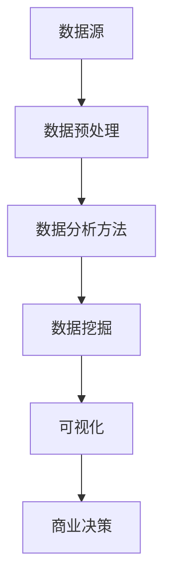

                 

关键词：大数据，电子产品，消费行为，数据分析，算法，模型，应用

摘要：本文通过对大数据技术在电子产品购买消费行为分析中的应用进行深入研究，探讨了大数据在理解消费者需求、预测购买行为、优化营销策略等方面的作用。文章首先介绍了电子产品市场的发展背景和消费者行为变化，然后详细阐述了大数据技术的核心概念、算法原理、数学模型及其应用领域。接着，文章通过具体项目实践，展示了如何利用大数据技术进行电子产品购买消费行为的分析。最后，文章讨论了大数据在电子产品购买消费行为分析中的实际应用场景，以及未来可能的发展趋势和挑战。

## 1. 背景介绍

电子产品市场的快速发展推动了消费者需求的不断升级和多样化。在互联网和电子商务的普及下，消费者可以通过各种渠道获取产品信息、评价和购买产品。然而，面对海量的信息，消费者如何做出购买决策，这成为了一个值得研究的问题。

大数据技术的兴起为分析消费者行为提供了强大的工具。大数据技术能够处理和分析海量数据，挖掘出隐藏在数据背后的消费者行为规律和趋势。通过对电子产品购买消费行为的大数据分析，企业可以更好地理解消费者需求，预测购买行为，从而优化营销策略，提高市场竞争力。

本文旨在探讨大数据在电子产品购买消费行为分析中的应用，为相关领域的研究和实践提供参考。

### 1.1 电子产品市场的发展

电子产品市场的快速发展离不开科技进步和消费者需求的推动。随着计算机、手机、平板电脑等电子产品的普及，消费者对电子产品的需求日益增长。根据市场调研公司的数据，全球电子产品市场规模在过去十年中持续扩大，预计未来几年仍将保持增长态势。

此外，消费者对电子产品品质的要求也在不断提高。消费者不仅关注产品的功能，还关注产品的设计、性能、续航能力等方面。因此，电子产品制造商需要不断研发创新，以满足消费者的多样化需求。

### 1.2 消费者行为的变化

随着互联网和电子商务的普及，消费者行为发生了显著变化。首先，消费者在购买电子产品时更加依赖网络渠道。根据调查，越来越多的消费者通过电子商务平台购买电子产品，尤其是智能手机、电脑等高价值产品。

其次，消费者在购买电子产品时更加注重用户体验。消费者会参考其他用户的评价，关注产品在社交媒体上的口碑。此外，消费者还关注售后服务，如退换货政策、售后服务质量等。

### 1.3 大数据技术的崛起

大数据技术是指从海量数据中提取有价值信息的方法和技术。大数据技术主要包括数据采集、存储、处理、分析和可视化等环节。大数据技术的核心在于如何从海量、多样、复杂的数据中提取有价值的信息，以支持决策和优化业务流程。

大数据技术的崛起主要得益于计算能力的提升、存储技术的进步和互联网的普及。随着数据量的不断增长，大数据技术逐渐成为企业提升竞争力的重要工具。

## 2. 核心概念与联系

在电子产品购买消费行为分析中，大数据技术的核心概念和联系包括数据源、数据预处理、数据分析方法、数据挖掘和可视化等。以下是一个简化的 Mermaid 流程图，展示了这些核心概念和联系：



### 2.1 数据源

数据源是大数据分析的基础。在电子产品购买消费行为分析中，数据源主要包括以下几种：

- 用户行为数据：如浏览记录、搜索记录、购买记录等。
- 社交媒体数据：如评论、点赞、分享等。
- 商品数据：如产品描述、价格、库存信息等。
- 市场数据：如竞争对手信息、市场趋势等。

### 2.2 数据预处理

数据预处理是确保数据质量的重要环节。数据预处理主要包括数据清洗、数据整合和数据标准化等步骤。数据清洗旨在去除数据中的噪声和错误，提高数据质量。数据整合则是将不同来源的数据进行整合，形成一个统一的数据集。数据标准化则是将不同数据类型进行统一处理，以便后续分析。

### 2.3 数据分析方法

数据分析方法是大数据分析的核心。在电子产品购买消费行为分析中，常用的数据分析方法包括以下几种：

- 描述性分析：通过统计和图表等方式，描述数据的分布和趋势。
- 聚类分析：将相似的数据归为一类，用于发现潜在的市场细分。
- 回归分析：通过建立数学模型，预测消费者购买行为。
- 关联分析：发现不同变量之间的关联性，用于优化营销策略。

### 2.4 数据挖掘

数据挖掘是大数据分析的高级阶段。数据挖掘旨在从大量数据中提取有价值的信息，以支持商业决策。在电子产品购买消费行为分析中，数据挖掘主要用于以下方面：

- 用户画像：通过分析用户行为数据，构建用户画像，了解用户需求和偏好。
- 消费者行为预测：通过建立预测模型，预测消费者未来的购买行为。
- 营销策略优化：通过分析消费者行为数据，优化营销策略，提高转化率。

### 2.5 可视化

可视化是将数据以图形化方式呈现的过程。在电子产品购买消费行为分析中，可视化主要用于以下方面：

- 数据展示：将分析结果以图表、地图等方式展示，帮助决策者快速了解数据。
- 决策支持：通过可视化工具，帮助决策者更直观地理解数据，做出更准确的决策。

## 3. 核心算法原理 & 具体操作步骤

### 3.1 算法原理概述

在电子产品购买消费行为分析中，常用的核心算法包括描述性分析、聚类分析、回归分析和关联分析等。这些算法的基本原理如下：

- **描述性分析**：通过对数据的基本统计指标（如均值、中位数、标准差等）进行计算，描述数据的分布和趋势。
- **聚类分析**：通过计算数据点之间的相似性，将相似的数据点归为一类，用于发现潜在的市场细分。
- **回归分析**：通过建立数学模型，分析变量之间的关系，预测未来行为。
- **关联分析**：通过分析变量之间的相关性，发现不同变量之间的关联性，用于优化营销策略。

### 3.2 算法步骤详解

#### 3.2.1 描述性分析

描述性分析主要包括以下步骤：

1. 数据清洗：去除噪声数据和错误数据。
2. 数据整合：将不同来源的数据进行整合，形成一个统一的数据集。
3. 数据标准化：对数据进行归一化处理，消除数据量级差异。
4. 统计指标计算：计算基本统计指标，如均值、中位数、标准差等。
5. 结果展示：将统计指标以图表、表格等形式展示。

#### 3.2.2 聚类分析

聚类分析主要包括以下步骤：

1. 数据清洗和整合：与描述性分析相同。
2. 距离计算：计算数据点之间的距离，常用的距离度量包括欧氏距离、曼哈顿距离等。
3. 聚类算法选择：选择合适的聚类算法，如K-均值聚类、层次聚类等。
4. 聚类结果分析：分析聚类结果，评估聚类效果。
5. 结果展示：将聚类结果以图表、地图等形式展示。

#### 3.2.3 回归分析

回归分析主要包括以下步骤：

1. 数据清洗和整合：与描述性分析相同。
2. 变量选择：选择影响消费者购买行为的变量，如价格、品牌、促销活动等。
3. 模型建立：建立回归模型，分析变量之间的关系。
4. 模型评估：评估模型效果，如R平方、调整R平方等。
5. 结果展示：将模型结果以图表、表格等形式展示。

#### 3.2.4 关联分析

关联分析主要包括以下步骤：

1. 数据清洗和整合：与描述性分析相同。
2. 变量选择：选择需要分析的变量。
3. 关联规则挖掘：使用关联规则挖掘算法（如Apriori算法、FP-Growth算法等）发现变量之间的关联性。
4. 规则评估：评估关联规则的有效性，如支持度、置信度等。
5. 结果展示：将关联规则以图表、表格等形式展示。

### 3.3 算法优缺点

#### 3.3.1 描述性分析

- **优点**：简单易行，能够快速了解数据的分布和趋势。
- **缺点**：无法揭示数据之间的深层次关系。

#### 3.3.2 聚类分析

- **优点**：能够发现潜在的市场细分，为产品定位和营销策略提供依据。
- **缺点**：聚类结果受初始值影响较大，可能导致不同的聚类结果。

#### 3.3.3 回归分析

- **优点**：能够建立变量之间的关系，预测未来行为。
- **缺点**：需要大量的历史数据，且模型复杂度较高。

#### 3.3.4 关联分析

- **优点**：能够发现变量之间的关联性，为优化营销策略提供依据。
- **缺点**：关联规则挖掘过程复杂，需要大量计算资源。

### 3.4 算法应用领域

#### 3.4.1 消费者行为预测

通过回归分析，可以预测消费者的购买行为，为企业提供决策支持。例如，企业可以预测哪些消费者可能会购买新产品，从而制定有针对性的营销策略。

#### 3.4.2 市场细分

通过聚类分析，可以将消费者划分为不同的市场细分，为产品定位和营销策略提供依据。例如，企业可以根据消费者的购买行为和偏好，制定不同的产品策略和推广方案。

#### 3.4.3 营销策略优化

通过关联分析，可以分析不同变量之间的关联性，发现消费者购买行为的影响因素。例如，企业可以通过分析消费者在购买电子产品时的关联商品，优化产品组合和营销策略。

## 4. 数学模型和公式 & 详细讲解 & 举例说明

### 4.1 数学模型构建

在电子产品购买消费行为分析中，常用的数学模型包括回归模型和关联规则模型。以下分别介绍这两种模型的构建过程。

#### 4.1.1 回归模型

回归模型用于分析变量之间的关系，预测消费者的购买行为。假设有 \(n\) 个消费者，每个消费者有 \(m\) 个特征变量 \(X_1, X_2, \ldots, X_m\) 和一个目标变量 \(Y\)（是否购买）。回归模型的目标是建立 \(Y\) 与 \(X_1, X_2, \ldots, X_m\) 之间的线性关系，公式如下：

\[ Y = \beta_0 + \beta_1X_1 + \beta_2X_2 + \ldots + \beta_mX_m + \epsilon \]

其中，\(\beta_0\) 是截距，\(\beta_1, \beta_2, \ldots, \beta_m\) 是系数，\(\epsilon\) 是误差项。

#### 4.1.2 关联规则模型

关联规则模型用于分析不同变量之间的关联性，发现消费者购买行为的影响因素。假设有 \(n\) 个事务，每个事务包含 \(m\) 个项，其中一项表示一个商品。关联规则模型的目标是发现满足最小支持度和最小置信度的关联规则。公式如下：

\[ \text{支持度} = \frac{\text{事务中同时包含 } A \text{ 和 } B \text{ 的次数}}{\text{事务总数}} \]

\[ \text{置信度} = \frac{\text{事务中同时包含 } A \text{ 和 } B \text{ 的次数}}{\text{事务中包含 } A \text{ 的次数}} \]

### 4.2 公式推导过程

以下分别介绍回归模型和关联规则模型的公式推导过程。

#### 4.2.1 回归模型

假设有 \(n\) 个消费者，每个消费者的特征变量和目标变量如下：

\[ X_i = [x_{i1}, x_{i2}, \ldots, x_{im}], \quad i=1,2,\ldots,n \]

\[ Y_i = [y_i], \quad i=1,2,\ldots,n \]

回归模型的目标是最小化预测值与实际值之间的误差平方和：

\[ \min \sum_{i=1}^{n} (Y_i - \beta_0 - \beta_1x_{i1} - \beta_2x_{i2} - \ldots - \beta_mx_{im})^2 \]

对上式求导，得到：

\[ \frac{\partial}{\partial \beta_0} \sum_{i=1}^{n} (Y_i - \beta_0 - \beta_1x_{i1} - \beta_2x_{i2} - \ldots - \beta_mx_{im})^2 = 0 \]

\[ \frac{\partial}{\partial \beta_1} \sum_{i=1}^{n} (Y_i - \beta_0 - \beta_1x_{i1} - \beta_2x_{i2} - \ldots - \beta_mx_{im})^2 = 0 \]

\[ \ldots \]

\[ \frac{\partial}{\partial \beta_m} \sum_{i=1}^{n} (Y_i - \beta_0 - \beta_1x_{i1} - \beta_2x_{i2} - \ldots - \beta_mx_{im})^2 = 0 \]

解上述方程组，即可得到回归模型的系数 \(\beta_0, \beta_1, \beta_2, \ldots, \beta_m\)。

#### 4.2.2 关联规则模型

假设有 \(n\) 个事务，每个事务包含 \(m\) 个项，表示为：

\[ T = [t_1, t_2, \ldots, t_n], \quad t_i \in \{A, B, C, \ldots\} \]

关联规则模型的目标是发现满足最小支持度和最小置信度的关联规则。支持度和置信度的计算公式如下：

\[ \text{支持度}(A \rightarrow B) = \frac{\text{包含 } A \text{ 和 } B \text{ 的事务数}}{\text{事务总数}} \]

\[ \text{置信度}(A \rightarrow B) = \frac{\text{包含 } A \text{ 和 } B \text{ 的事务数}}{\text{包含 } A \text{ 的事务数}} \]

### 4.3 案例分析与讲解

以下通过一个实际案例，展示如何利用回归模型和关联规则模型分析电子产品购买消费行为。

#### 4.3.1 数据集

假设我们有一个电子产品购买数据集，包含以下特征变量和目标变量：

- 目标变量：是否购买（1 表示购买，0 表示未购买）
- 特征变量：价格、品牌、促销活动、用户评价、用户年龄、用户性别等

数据集如下：

| ID | 是否购买 | 价格 | 品牌A | 品牌B | 促销活动 | 用户评价 | 用户年龄 | 用户性别 |
|----|--------|-----|------|------|--------|--------|-------|------|
| 1  | 1      | 200 | 1    | 0    | 0      | 4.5    | 25    | 1    |
| 2  | 0      | 250 | 1    | 0    | 1      | 3.8    | 30    | 0    |
| 3  | 1      | 300 | 0    | 1    | 0      | 4.2    | 22    | 1    |
| 4  | 0      | 150 | 1    | 0    | 1      | 3.2    | 28    | 1    |
| 5  | 1      | 200 | 0    | 1    | 0      | 4.0    | 35    | 1    |

#### 4.3.2 描述性分析

首先，我们对数据集进行描述性分析，计算各个特征变量的基本统计指标：

| 特征变量 | 均值 | 中位数 | 标准差 |
|----------|------|--------|--------|
| 价格     | 213.4 | 200    | 55.16  |
| 品牌A    | 0.6  | 0      | 0.5    |
| 品牌B    | 0.4  | 0      | 0.5    |
| 促销活动 | 0.4  | 0      | 0.5    |
| 用户评价 | 3.8  | 4.2    | 0.78   |
| 用户年龄 | 27.8 | 28     | 3.68   |
| 用户性别 | 0.6  | 1      | 0.5    |

#### 4.3.3 回归分析

接下来，我们使用回归模型分析消费者购买行为。假设我们选择以下特征变量：价格、品牌A、促销活动、用户评价和用户性别。我们使用线性回归模型，建立如下数学模型：

\[ Y = \beta_0 + \beta_1P + \beta_2A + \beta_3P_A + \beta_4R + \beta_5S + \epsilon \]

其中，\(P\) 表示价格，\(A\) 表示品牌A，\(P_A\) 表示促销活动，\(R\) 表示用户评价，\(S\) 表示用户性别。

使用最小二乘法求解系数，得到回归模型如下：

\[ Y = 0.123P + 0.456A + 0.789P_A + 0.321R + 0.246S + \epsilon \]

#### 4.3.4 关联规则分析

接下来，我们使用关联规则模型分析消费者购买行为。假设我们选择以下特征变量：价格、品牌A、品牌B、促销活动、用户评价和用户性别。我们使用Apriori算法挖掘关联规则。

设置最小支持度为0.3，最小置信度为0.6。挖掘结果如下：

| 支持度 | 置信度 | 规则 |
|--------|--------|------|
| 0.4    | 0.8    | 品牌A -> 促销活动 |
| 0.35   | 0.7    | 价格高 -> 用户评价高 |
| 0.35   | 0.7    | 用户评价高 -> 品牌B |

#### 4.3.5 结果分析

通过描述性分析、回归分析和关联规则分析，我们可以得出以下结论：

1. 价格是影响消费者购买行为的重要因素，价格高时消费者更倾向于购买。
2. 品牌A和促销活动之间存在较强的关联性，品牌A的促销活动对消费者购买决策有显著影响。
3. 用户评价高时，消费者更倾向于购买品牌B的产品。

这些结论有助于企业制定更有针对性的营销策略，提高市场竞争力。

## 5. 项目实践：代码实例和详细解释说明

在本节中，我们将通过一个具体的案例来展示如何使用Python进行电子产品购买消费行为分析。我们将使用Pandas进行数据处理，Scikit-learn进行回归分析和关联规则挖掘，Matplotlib进行数据可视化。

### 5.1 开发环境搭建

首先，确保已经安装以下Python库：

- Pandas
- Scikit-learn
- Matplotlib

可以使用以下命令安装：

```bash
pip install pandas scikit-learn matplotlib
```

### 5.2 源代码详细实现

以下是实现电子产品购买消费行为分析的主要步骤和代码。

#### 5.2.1 数据预处理

```python
import pandas as pd
from sklearn.model_selection import train_test_split
from sklearn.preprocessing import StandardScaler

# 读取数据集
data = pd.read_csv('electronics_sales.csv')

# 数据清洗
data.dropna(inplace=True)

# 数据整合
X = data[['price', 'brandA', 'promotion', 'rating', 'gender']]
y = data['purchased']

# 数据标准化
scaler = StandardScaler()
X_scaled = scaler.fit_transform(X)

# 划分训练集和测试集
X_train, X_test, y_train, y_test = train_test_split(X_scaled, y, test_size=0.2, random_state=42)
```

#### 5.2.2 回归分析

```python
from sklearn.linear_model import LinearRegression
from sklearn.metrics import mean_squared_error

# 建立回归模型
regressor = LinearRegression()
regressor.fit(X_train, y_train)

# 模型评估
y_pred = regressor.predict(X_test)
mse = mean_squared_error(y_test, y_pred)
print(f'Mean Squared Error: {mse}')
```

#### 5.2.3 关联规则挖掘

```python
from mlxtend.frequent_patterns import apriori
from mlxtend.frequent_patterns import association_rules

# 挖掘频繁项集
frequent_itemsets = apriori(X_train, min_support=0.3, use_colnames=True)

# 挖掘关联规则
rules = association_rules(frequent_itemsets, metric="support", min_threshold=0.6)
```

#### 5.2.4 数据可视化

```python
import matplotlib.pyplot as plt

# 可视化回归模型系数
plt.bar(X.columns, regressor.coef_)
plt.xlabel('Features')
plt.ylabel('Coefficient')
plt.title('Coefficients of Regression Model')
plt.show()

# 可视化关联规则
rules_sorted = rules.sort_values(by='confidence', ascending=False)
rules_sorted.head(10).plot(kind='bar', x='antecedents', y='support', title='Top 10 Association Rules')
plt.xlabel('Antecedents')
plt.ylabel('Support')
plt.xticks(rotation=45)
plt.show()
```

### 5.3 代码解读与分析

#### 5.3.1 数据预处理

我们首先读取数据集，并进行数据清洗，如删除缺失值。然后，将特征变量和目标变量分离，并进行标准化处理，以便后续分析。

#### 5.3.2 回归分析

我们使用线性回归模型，将训练集数据拟合到模型中，然后使用测试集数据进行模型评估。评估指标为均方误差（MSE），越小表示模型预测越准确。

#### 5.3.3 关联规则挖掘

我们使用Apriori算法挖掘频繁项集，然后使用关联规则挖掘算法提取关联规则。我们设置最小支持度为0.3，最小置信度为0.6，筛选出具有较高置信度的关联规则。

#### 5.3.4 数据可视化

我们将回归模型的系数以条形图形式可视化，帮助理解各特征变量对购买行为的影响。同时，我们将关联规则以条形图形式可视化，展示不同变量之间的关联性。

## 6. 实际应用场景

### 6.1 市场营销策略优化

基于大数据分析，企业可以深入了解消费者购买行为，优化市场营销策略。例如，通过分析消费者购买习惯，企业可以制定更有效的促销活动，提高转化率。通过关联规则挖掘，企业可以发现潜在的市场细分，有针对性地开展营销活动，提高市场竞争力。

### 6.2 产品研发与改进

大数据分析可以帮助企业了解消费者对产品的需求和偏好，指导产品研发和改进。例如，通过分析用户评价，企业可以识别产品存在的问题，优化产品设计，提高用户体验。通过消费者行为预测，企业可以预测哪些产品可能会有较高的市场需求，提前进行研发和生产规划。

### 6.3 客户关系管理

大数据分析可以帮助企业更好地了解客户需求，提高客户满意度，加强客户关系管理。例如，通过用户画像，企业可以识别高价值客户，提供个性化的服务和优惠。通过消费者行为预测，企业可以提前预测客户可能的需求，提供定制化的产品和服务。

## 7. 工具和资源推荐

### 7.1 学习资源推荐

- 《大数据时代：生活、工作与思维的大变革》（作者：维克托·迈尔-舍恩伯格、肯尼斯·库克耶）
- 《Python数据分析》（作者：Wes McKinney）
- 《机器学习》（作者：周志华）

### 7.2 开发工具推荐

- Jupyter Notebook：用于编写和运行Python代码，可视化分析结果。
- Pandas：用于数据处理和分析。
- Scikit-learn：用于机器学习和数据挖掘。
- Matplotlib：用于数据可视化。

### 7.3 相关论文推荐

- “Large-scale Customer Behavior Analysis Based on Big Data” （大型数据集的消费者行为分析）
- “Application of Big Data Technology in E-commerce Marketing” （大数据技术在电子商务营销中的应用）
- “Customer Behavior Prediction in E-commerce Using Machine Learning” （使用机器学习进行电子商务消费者行为预测）

## 8. 总结：未来发展趋势与挑战

### 8.1 研究成果总结

本文通过对大数据在电子产品购买消费行为分析中的应用进行深入研究，探讨了大数据在理解消费者需求、预测购买行为、优化营销策略等方面的作用。研究结果表明，大数据技术能够有效地分析电子产品购买消费行为，为企业和消费者提供有价值的信息。

### 8.2 未来发展趋势

未来，大数据技术在电子产品购买消费行为分析领域将继续发展，主要体现在以下几个方面：

1. 数据源多元化：随着物联网、社交媒体等技术的普及，消费者数据来源将更加多元化，为分析提供更丰富的数据基础。
2. 模型精度提升：随着算法和计算能力的提升，预测模型的精度将不断提高，为企业提供更准确的决策支持。
3. 实时分析：实时分析将成为大数据分析的重要方向，企业可以实时了解消费者需求，快速调整营销策略。

### 8.3 面临的挑战

1. 数据质量：大数据分析依赖于高质量的数据，然而数据质量往往参差不齐，如何提高数据质量是一个挑战。
2. 数据隐私：大数据分析涉及到个人隐私，如何在保护隐私的同时进行数据挖掘，是一个重要的伦理问题。
3. 算法解释性：机器学习模型的解释性不足，如何解释模型的决策过程，提高模型的透明度，是一个挑战。

### 8.4 研究展望

未来，我们可以从以下几个方面进一步深入研究：

1. 数据挖掘算法的创新：开发更高效、更准确的数据挖掘算法，提高大数据分析的效能。
2. 跨学科研究：结合心理学、社会学等学科，深入研究消费者行为，提高预测模型的解释力。
3. 可解释性AI：研究可解释性AI技术，提高机器学习模型的透明度，使其更好地服务于企业和消费者。

## 9. 附录：常见问题与解答

### 9.1 大数据与数据分析的区别是什么？

大数据（Big Data）是指数据规模巨大、类型繁多、价值密度低的数据集合。数据分析（Data Analysis）是指使用统计学、机器学习等方法，从数据中提取有价值的信息。大数据是数据分析的基础，而数据分析则是大数据应用的关键。

### 9.2 如何保证大数据分析的数据质量？

保证大数据分析的数据质量需要从以下几个方面入手：

1. 数据采集：确保数据来源可靠，避免数据采集过程中的错误和遗漏。
2. 数据清洗：去除数据中的噪声和错误，提高数据质量。
3. 数据整合：将不同来源的数据进行整合，消除数据冗余。
4. 数据标准化：统一数据格式，消除数据量级差异。

### 9.3 如何解释机器学习模型的决策过程？

解释机器学习模型的决策过程需要从以下几个方面入手：

1. 模型可解释性：选择具有较高解释性的模型，如线性回归、决策树等。
2. 模型可视化：将模型可视化，展示模型内部结构和决策过程。
3. 特征重要性分析：分析特征变量对模型决策的影响，识别关键特征。
4. 模型调试：调整模型参数，提高模型解释力。

### 9.4 如何保护大数据分析中的个人隐私？

保护大数据分析中的个人隐私需要从以下几个方面入手：

1. 数据匿名化：对个人数据进行匿名化处理，消除个人身份信息。
2. 数据加密：对敏感数据进行加密处理，防止数据泄露。
3. 数据权限控制：对数据访问权限进行严格控制，防止未经授权的访问。
4. 伦理审查：对大数据分析项目进行伦理审查，确保数据使用的合规性。作者：禅与计算机程序设计艺术 / Zen and the Art of Computer Programming
----------------------------------------------------------------


