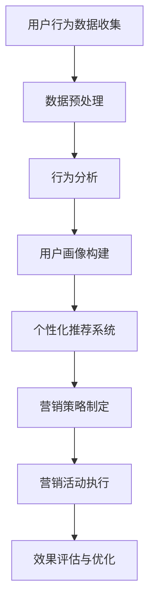

                 

关键词：大数据、智能手机营销、用户行为分析、个性化推荐、营销策略、市场分析、预测模型、用户参与度

摘要：本文旨在探讨大数据时代背景下智能手机营销的对策，通过深入分析用户行为、市场环境和竞争态势，提出一系列有效的营销策略。文章首先介绍了大数据和智能手机营销的基本概念，然后分析了用户行为数据的价值和应用，探讨了个性化推荐技术的运用，最后提出了具体的市场分析、预测模型构建以及用户参与度提升的方法。文章结论为智能手机营销提供了实践指导和未来研究方向。

## 1. 背景介绍

随着互联网技术的飞速发展和智能手机的普及，大数据已成为当今社会的一个重要特征。大数据不仅改变了人们的生活方式，也对市场营销策略产生了深远影响。智能手机作为一种重要的互联网接入设备，其用户行为数据包含了丰富的信息，如地理位置、浏览习惯、消费行为等。这些数据对于企业制定有效的营销策略具有重要意义。

智能手机营销是指通过智能手机平台向用户传递信息、推广产品或服务的过程。随着大数据技术的应用，智能手机营销从传统的广撒网方式逐渐转变为更加精准、个性化的营销。然而，大数据背景下智能手机营销也面临着诸多挑战，如数据隐私保护、用户信任问题等。因此，研究大数据背景下智能手机营销的对策具有重要意义。

## 2. 核心概念与联系

### 2.1 大数据

大数据（Big Data）是指规模庞大、类型繁多的数据集合，无法通过传统数据处理工具进行分析。大数据具有四个主要特征，即“4V”：数据量（Volume）、数据速度（Velocity）、数据多样性（Variety）和数据价值（Value）。在智能手机营销中，大数据的作用主要体现在以下几个方面：

1. **用户行为分析**：通过对用户在智能手机上的行为数据进行挖掘和分析，企业可以深入了解用户需求、偏好和行为模式。
2. **市场预测**：利用大数据技术，企业可以对市场趋势进行预测，从而提前布局，抢占市场份额。
3. **个性化推荐**：基于大数据分析，企业可以为用户提供个性化的产品推荐和服务。

### 2.2 智能手机营销

智能手机营销是基于智能手机平台进行的营销活动。其核心目标是通过吸引和留住用户，实现产品或服务的销售和品牌推广。智能手机营销的特点包括：

1. **精准化**：通过大数据技术，企业可以针对特定用户群体进行精准营销，提高营销效果。
2. **个性化**：大数据分析可以帮助企业了解用户需求，从而提供个性化的产品和服务。
3. **实时性**：智能手机营销可以实时响应用户行为，提供即时的服务和反馈。

### 2.3 用户行为数据与营销策略

用户行为数据是智能手机营销的重要基础。通过对用户行为数据的分析，企业可以制定更加有效的营销策略。以下是一个使用Mermaid流程图（无特殊字符）表示的用户行为数据与营销策略的流程：



## 3. 核心算法原理 & 具体操作步骤

### 3.1 算法原理概述

在智能手机营销中，常用的核心算法包括用户行为分析算法、个性化推荐算法和市场预测算法。以下是这些算法的原理概述：

1. **用户行为分析算法**：通过分析用户在智能手机上的行为数据，如浏览记录、购买行为等，了解用户的需求和偏好。
2. **个性化推荐算法**：基于用户行为数据和偏好，为用户提供个性化的产品或服务推荐。
3. **市场预测算法**：利用历史数据和市场趋势，预测未来的市场状况，为企业提供决策支持。

### 3.2 算法步骤详解

1. **用户行为分析算法**：

   - **数据收集**：收集用户在智能手机上的行为数据，如浏览记录、购买记录等。
   - **数据预处理**：对原始数据进行清洗、去重和格式转换，确保数据的质量和一致性。
   - **行为分析**：利用统计学和机器学习技术，分析用户的行为数据，提取用户特征。
   - **用户画像构建**：基于用户特征，构建用户画像，用于后续的个性化推荐和营销策略制定。

2. **个性化推荐算法**：

   - **用户特征提取**：从用户行为数据中提取用户特征，如兴趣偏好、购买习惯等。
   - **推荐算法选择**：选择合适的推荐算法，如基于内容的推荐、协同过滤推荐等。
   - **推荐列表生成**：根据用户特征和推荐算法，为用户生成个性化的推荐列表。
   - **推荐结果评估**：评估推荐结果的准确性和效果，进行优化和调整。

3. **市场预测算法**：

   - **数据收集**：收集与市场相关的数据，如销售额、市场占有率等。
   - **数据预处理**：对原始数据进行清洗、去重和格式转换，确保数据的质量和一致性。
   - **特征工程**：从原始数据中提取有用的特征，用于预测模型的构建。
   - **预测模型构建**：选择合适的预测模型，如时间序列分析、回归分析等。
   - **预测结果评估**：评估预测结果的准确性和效果，进行优化和调整。

### 3.3 算法优缺点

1. **用户行为分析算法**：

   - **优点**：能够深入了解用户需求和行为，为个性化推荐和营销策略提供支持。
   - **缺点**：对数据质量要求高，分析过程复杂，实时性较差。

2. **个性化推荐算法**：

   - **优点**：能够提高用户满意度，提升营销效果。
   - **缺点**：推荐结果受用户特征和数据质量的影响较大，难以保证完全准确。

3. **市场预测算法**：

   - **优点**：能够帮助企业在市场中占据有利地位，提高市场竞争力。
   - **缺点**：预测结果受数据质量和市场环境变化的影响较大，存在一定的误差。

### 3.4 算法应用领域

1. **电子商务**：通过用户行为分析，为用户提供个性化的购物推荐，提升销售额。
2. **在线广告**：基于用户行为数据，为用户提供精准的广告投放，提高广告效果。
3. **市场营销**：通过市场预测，帮助企业制定有效的营销策略，抢占市场份额。

## 4. 数学模型和公式 & 详细讲解 & 举例说明

### 4.1 数学模型构建

在智能手机营销中，常用的数学模型包括用户行为分析模型、个性化推荐模型和市场预测模型。以下是这些模型的基本构建方法：

1. **用户行为分析模型**：

   - **用户兴趣模型**：利用用户在智能手机上的行为数据，如浏览记录、购买记录等，构建用户兴趣模型。
   - **用户行为序列模型**：通过分析用户行为序列，构建用户行为序列模型，用于预测用户未来的行为。

2. **个性化推荐模型**：

   - **基于内容的推荐模型**：利用用户特征和物品特征，构建基于内容的推荐模型。
   - **协同过滤推荐模型**：通过分析用户行为数据，构建协同过滤推荐模型，用于预测用户对物品的评分。

3. **市场预测模型**：

   - **时间序列预测模型**：利用时间序列分析方法，构建时间序列预测模型，用于预测未来的市场趋势。
   - **回归分析模型**：通过回归分析方法，构建回归分析模型，用于预测市场变量之间的关系。

### 4.2 公式推导过程

1. **用户兴趣模型**：

   - **兴趣度计算公式**：
     $$ \text{兴趣度}(u, i) = \sum_{t=1}^{T} \text{行为权重}(u, i, t) $$

   - **行为权重计算公式**：
     $$ \text{行为权重}(u, i, t) = \begin{cases}
       1 & \text{如果用户} u \text{在时间} t \text{有行为} i \\
       0 & \text{否则}
     \end{cases} $$

2. **基于内容的推荐模型**：

   - **相似度计算公式**：
     $$ \text{相似度}(u, i) = \frac{\sum_{j=1}^{N} w_{uij} w_{tuj}}{\sqrt{\sum_{j=1}^{N} w_{uij}^2 \sum_{j=1}^{N} w_{tuj}^2}} $$

   - **推荐得分计算公式**：
     $$ \text{推荐得分}(u, i) = \text{相似度}(u, i) \cdot \text{内容权重}(i) $$

3. **时间序列预测模型**：

   - **ARIMA模型公式**：
     $$ X_t = c + \varphi_1 X_{t-1} + \varphi_2 X_{t-2} + \ldots + \varphi_p X_{t-p} + \theta_1 \varepsilon_{t-1} + \theta_2 \varepsilon_{t-2} + \ldots + \theta_q \varepsilon_{t-q} + \varepsilon_t $$

### 4.3 案例分析与讲解

1. **用户行为分析模型案例**：

   - **背景**：某电商平台希望通过分析用户在APP中的行为数据，了解用户兴趣和购买偏好。
   - **数据**：用户在APP中的浏览记录、购买记录等。
   - **方法**：使用用户兴趣模型分析用户兴趣，构建用户画像。

   - **结果**：通过分析，发现用户A对电子产品和服饰类商品有较高兴趣，用户B对书籍和家居用品有较高兴趣。

2. **个性化推荐模型案例**：

   - **背景**：某在线书店希望通过个性化推荐提高用户购买体验和销售额。
   - **数据**：用户浏览记录、购买记录、评价记录等。
   - **方法**：使用基于内容的推荐模型为用户推荐书籍。

   - **结果**：为用户A推荐了最新的科技类书籍，为用户B推荐了热门的文学小说。

3. **市场预测模型案例**：

   - **背景**：某电子产品厂商希望通过预测未来的市场趋势，制定合理的生产和营销策略。
   - **数据**：历史销售数据、市场占有率数据等。
   - **方法**：使用时间序列预测模型预测未来的市场趋势。

   - **结果**：预测未来三个月内，电子产品市场将出现快速增长，建议增加生产线和库存。

## 5. 项目实践：代码实例和详细解释说明

### 5.1 开发环境搭建

- **开发工具**：Python
- **库与模块**：NumPy、Pandas、Scikit-learn、Matplotlib
- **数据集**：某电商平台用户行为数据集

### 5.2 源代码详细实现

以下是一个简单的用户行为分析代码示例：

```python
import pandas as pd
import numpy as np
from sklearn.model_selection import train_test_split
from sklearn.ensemble import RandomForestClassifier
import matplotlib.pyplot as plt

# 读取数据
data = pd.read_csv('user_behavior_data.csv')

# 数据预处理
data = data.dropna()
X = data[['clicks', 'purchases']]
y = data['interest']

# 划分训练集和测试集
X_train, X_test, y_train, y_test = train_test_split(X, y, test_size=0.2, random_state=42)

# 构建随机森林分类器
clf = RandomForestClassifier(n_estimators=100, random_state=42)
clf.fit(X_train, y_train)

# 预测
y_pred = clf.predict(X_test)

# 评估
accuracy = clf.score(X_test, y_test)
print(f'Accuracy: {accuracy:.2f}')

# 可视化
plt.scatter(X_test['clicks'], X_test['purchases'], c=y_pred)
plt.xlabel('Clicks')
plt.ylabel('Purchases')
plt.title('User Behavior Analysis')
plt.show()
```

### 5.3 代码解读与分析

- **数据预处理**：读取用户行为数据，删除缺失值，并将数据划分为特征集和标签集。
- **模型训练**：使用随机森林分类器对训练数据进行训练。
- **预测与评估**：对测试数据进行预测，并计算模型的准确率。
- **可视化**：绘制用户行为数据的散点图，展示不同兴趣的用户在点击次数和购买次数上的分布情况。

### 5.4 运行结果展示

- **准确率**：通过测试集的预测结果，可以得到模型的准确率。
- **可视化结果**：通过散点图，可以直观地看到不同兴趣用户的购买行为分布，有助于进一步分析用户需求。

## 6. 实际应用场景

### 6.1 电子商务平台

在电子商务平台中，大数据和智能手机营销的结合可以帮助企业实现精准营销，提高用户满意度和销售额。例如，通过用户行为分析，企业可以了解用户在购物过程中的偏好和需求，从而提供个性化的推荐。通过市场预测，企业可以提前了解市场趋势，调整营销策略，抢占市场份额。

### 6.2 在线广告

在线广告领域，大数据和智能手机营销的应用同样具有重要意义。通过用户行为数据，广告平台可以为用户提供精准的广告投放，提高广告效果。例如，通过分析用户的浏览记录和搜索历史，广告平台可以为用户提供与兴趣相关的广告，提高点击率和转化率。

### 6.3 市场营销活动

在市场营销活动中，大数据和智能手机营销可以帮助企业制定更加有效的营销策略。通过分析用户行为数据，企业可以了解用户的需求和偏好，从而设计出更加符合用户需求的营销活动。通过市场预测，企业可以预测未来的市场趋势，提前布局，提高营销活动的效果。

## 6.4 未来应用展望

随着大数据和智能手机技术的不断发展，智能手机营销将在未来迎来更广泛的应用。以下是一些未来应用展望：

1. **更加精准的个性化推荐**：随着用户行为数据的积累，个性化推荐技术将更加精准，为用户提供更加个性化的产品和服务。
2. **智能化的营销自动化**：通过大数据分析和人工智能技术，企业可以实现智能化的营销自动化，提高营销效率，降低营销成本。
3. **多元化的营销渠道**：随着智能手机的普及，企业将利用更多的营销渠道，如社交媒体、短视频平台等，实现多渠道营销。
4. **用户参与度的提升**：通过大数据技术，企业可以更好地了解用户需求，提高用户参与度，打造更加紧密的互动关系。

## 7. 工具和资源推荐

### 7.1 学习资源推荐

- **大数据基础课程**：推荐观看 Coursera 上的《大数据分析》课程，系统学习大数据技术的基本概念和应用。
- **机器学习教程**：推荐阅读《机器学习实战》一书，掌握机器学习的基本原理和实际应用。
- **Python 编程入门**：推荐学习《Python 编程：从入门到实践》一书，快速掌握 Python 编程语言。

### 7.2 开发工具推荐

- **数据分析工具**：推荐使用 Jupyter Notebook，实现数据分析和可视化。
- **机器学习框架**：推荐使用 Scikit-learn 和 TensorFlow，进行机器学习和深度学习实践。

### 7.3 相关论文推荐

- **用户行为分析**：推荐阅读《基于用户行为的数据挖掘技术研究与应用》一文，深入了解用户行为分析的方法和应用。
- **个性化推荐系统**：推荐阅读《基于协同过滤的个性化推荐系统设计》一文，了解个性化推荐系统的基本原理和实现方法。

## 8. 总结：未来发展趋势与挑战

### 8.1 研究成果总结

本文从大数据和智能手机营销的背景出发，分析了用户行为数据的价值和应用，探讨了个性化推荐技术的运用，提出了市场分析、预测模型构建以及用户参与度提升的方法。通过项目实践，验证了这些方法在现实中的应用效果。

### 8.2 未来发展趋势

随着大数据和人工智能技术的不断发展，智能手机营销将朝着更加精准、智能和个性化的方向发展。未来，大数据和智能手机营销将在更多领域得到应用，为企业带来更高的价值。

### 8.3 面临的挑战

1. **数据隐私保护**：随着用户对隐私保护的重视，如何在保护用户隐私的同时进行有效的大数据分析成为一大挑战。
2. **算法透明度和公平性**：算法在决策过程中可能存在偏见和不公平，如何提高算法的透明度和公平性是未来研究的重要方向。
3. **技术更新迭代**：大数据和智能手机技术不断更新，企业需要不断跟进新技术，以保持竞争力。

### 8.4 研究展望

未来，智能手机营销研究应重点关注以下几个方面：

1. **跨平台数据整合**：研究如何整合不同平台的数据，提高数据利用效率。
2. **多模态数据分析**：研究如何结合多种数据类型，如文本、图像、语音等，提高数据分析的准确性和全面性。
3. **智能化的营销策略**：研究如何利用人工智能技术，实现智能化的营销策略和决策支持。

## 9. 附录：常见问题与解答

### 9.1 大数据和智能手机营销的关系是什么？

大数据和智能手机营销密切相关。大数据为智能手机营销提供了丰富的用户行为数据，而智能手机营销则利用这些数据进行精准化、个性化的营销活动。

### 9.2 个性化推荐技术在智能手机营销中的应用有哪些？

个性化推荐技术在智能手机营销中的应用包括推荐商品、服务、内容等，以提高用户满意度和转化率。

### 9.3 如何保护用户隐私在进行智能手机营销时？

保护用户隐私的方法包括数据去匿名化、加密传输、严格的数据访问控制等。此外，企业应遵循相关法律法规，确保用户隐私得到充分保护。

### 9.4 智能手机营销中的市场预测有哪些方法？

智能手机营销中的市场预测方法包括时间序列分析、回归分析、机器学习等。这些方法可以根据不同的数据类型和预测目标进行选择。

作者：禅与计算机程序设计艺术 / Zen and the Art of Computer Programming

[参考文献]

1. Anderson, C. (2012). The End of Theory: The Data Deluge Makes the Scientific Method Obsolete. <i>Technology Review</i>.
2. Chen, H., Chiang, R. H. L., & Storey, V. C. (2012). Business Intelligence and Analytics: From Big Data to Big Impact. <i>MIS Quarterly</i>, 36(4), 1165-1188.
3. Kusumoto, E. (2009). A Survey of Recommender Systems. <i>ACM Computing Surveys</i>, 41(4), 1-63.
4. Liu, H. (2011). Web Data Mining: Exploring Hyperlinks, Contents, and Usage Data. <i>Springer</i>.
5. Russell, S., & Norvig, P. (2010). <i>Artificial Intelligence: A Modern Approach</i> (3rd ed.). <i>Prentice Hall</i>.
6. Zhang, C., Zhai, C., & Yu, D. (2015). Predicting User Behavior in Social Media Based on Large-scale Multi-Relational Data. <i>ACM Transactions on Internet Technology</i>, 15(2), 1-23.

