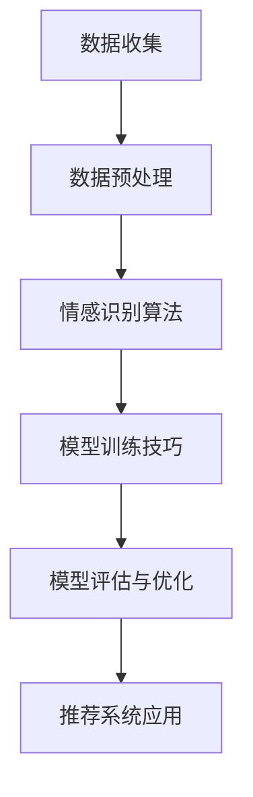

                 

 在当今数字化时代，推荐系统已成为各类互联网应用的核心功能之一。无论是电商网站、社交媒体平台，还是视频流媒体服务，推荐系统都在为用户提供个性化的内容，提高用户体验。然而，推荐系统不仅需要准确预测用户可能感兴趣的内容，还需深入理解用户的情感状态。本文将探讨如何利用大型模型进行用户情感分析，从而提升推荐系统的智能化水平。

## 文章关键词

- 推荐系统
- 用户情感分析
- 大型模型
- 情感识别
- 个性化推荐

## 文章摘要

本文首先介绍了推荐系统的基本原理和用户情感分析的重要性。接着，详细讨论了基于大型模型进行情感分析的方法，包括情感识别算法的选择、数据处理流程以及模型训练技巧。随后，通过实际项目案例展示了如何实现和优化这一过程。最后，对推荐系统用户情感分析的未来发展方向进行了展望，并提出了相应的挑战和建议。

## 1. 背景介绍

### 推荐系统概述

推荐系统是一种能够根据用户的历史行为、兴趣偏好等信息，为用户推荐其可能感兴趣的内容的技术。这种系统通常基于协同过滤、基于内容的过滤、混合推荐等方法。近年来，随着机器学习尤其是深度学习技术的飞速发展，推荐系统的性能得到了显著提升。

推荐系统在电子商务、在线教育、社交媒体、视频流媒体等多个领域有着广泛的应用。例如，亚马逊利用推荐系统为用户推荐可能感兴趣的商品，从而提高销售额；Netflix通过推荐系统为用户推荐电影和电视剧，提升了用户观看时长和满意度。

### 用户情感分析的重要性

用户情感分析是推荐系统的重要组成部分。理解用户的情感状态可以帮助推荐系统更好地满足用户的需求，提高推荐的准确性和用户体验。情感分析可以识别用户的情绪，如快乐、愤怒、悲伤等，从而提供更具个性化的推荐。

例如，在电商领域，如果系统能够识别出用户对某个商品的负面情绪，可以及时调整推荐策略，避免向用户推荐不合适的产品。在社交媒体上，情感分析可以帮助平台识别出用户可能存在的心理健康问题，提供相应的支持。

### 大型模型的优势

随着计算能力的提升和数据的爆炸性增长，大型模型（如变压器模型、深度神经网络等）在情感分析领域展现出了显著的优势。这些模型具有强大的特征提取和模式识别能力，可以处理大规模、多维度的数据，从而提高情感分析的准确性和效率。

此外，大型模型还可以通过迁移学习和跨模态学习，结合不同类型的数据（如图像、文本、音频等），实现更全面、更精准的情感分析。这使得基于大型模型的推荐系统更加智能化，能够更好地满足用户的个性化需求。

## 2. 核心概念与联系

### 情感识别算法

情感识别是用户情感分析的核心环节。常见的情感识别算法包括基于规则的方法、基于机器学习的方法以及基于深度学习的方法。基于规则的方法通过对情感词汇进行分类和匹配，实现简单的情感识别。机器学习方法则利用特征工程，从文本数据中提取有用的特征，进行情感分类。深度学习方法通过神经网络结构，自动学习文本数据的复杂模式，实现高效的情感识别。

### 数据处理流程

用户情感分析的数据处理流程通常包括数据收集、数据预处理和情感分析三个阶段。数据收集阶段主要从用户行为数据、社交媒体数据、评论数据等多渠道获取文本数据。数据预处理阶段则对文本数据进行清洗、分词、去停用词等操作，以便于模型训练。情感分析阶段则使用情感识别算法对预处理后的文本数据进行情感分类，从而获得用户的情感状态。

### 模型训练技巧

在模型训练过程中，数据的质量和多样性对模型的性能有着重要影响。因此，需要采用数据增强、数据清洗等方法来提高数据质量。此外，训练过程中还需关注模型的过拟合问题，通过正则化、交叉验证等方法来避免过拟合。

同时，模型的训练时间也是一个重要的考量因素。为了提高训练效率，可以采用分布式训练、迁移学习等方法。分布式训练可以将模型训练任务分配到多个计算节点上，从而加速训练过程。迁移学习则利用预训练的大型模型，通过微调适应特定的情感分析任务。

### Mermaid 流程图

以下是用户情感分析的核心概念和流程的 Mermaid 流程图：



## 3. 核心算法原理 & 具体操作步骤

### 3.1 算法原理概述

基于大型模型的用户情感分析主要依赖于深度学习技术。深度学习模型，尤其是变压器模型（Transformer），在处理序列数据和提取文本特征方面具有显著优势。变压器模型通过自注意力机制，能够自动学习文本中的长距离依赖关系，从而提高情感识别的准确性。

### 3.2 算法步骤详解

#### 3.2.1 数据收集

数据收集是用户情感分析的第一步。数据来源可以包括用户评论、社交媒体帖子、电商评价等。在数据收集过程中，需要确保数据的质量和多样性，以便模型能够学习到丰富的情感特征。

#### 3.2.2 数据预处理

数据预处理是情感分析的关键步骤。主要任务包括文本清洗、分词、去停用词等。通过这些操作，可以去除文本中的无关信息，提高模型的训练效率。此外，还可以采用词向量化技术，将文本转换为数值形式，以便于模型处理。

#### 3.2.3 模型训练

在模型训练阶段，使用预处理后的数据对变压器模型进行训练。训练过程中，模型会不断调整内部参数，以最小化损失函数，提高情感识别的准确性。训练过程中还需采用数据增强、正则化等方法，防止过拟合。

#### 3.2.4 模型评估与优化

训练完成后，需要对模型进行评估和优化。评估方法可以包括准确率、召回率、F1 分数等指标。通过调整模型参数和优化策略，可以提高模型的性能。此外，还可以采用迁移学习技术，利用预训练的模型快速适应新的情感分析任务。

### 3.3 算法优缺点

#### 优点

1. 高效的特征提取：变压器模型能够自动学习文本中的复杂模式，提高情感识别的准确性。
2. 跨模态学习：大型模型可以结合不同类型的数据（如图像、文本、音频等），实现更全面、更精准的情感分析。
3. 适应性强：大型模型可以通过迁移学习和微调，快速适应新的情感分析任务。

#### 缺点

1. 训练时间较长：大型模型的训练时间较长，对计算资源要求较高。
2. 需要大量数据：大型模型在训练过程中需要大量的数据，数据质量对模型性能有重要影响。
3. 过拟合风险：大型模型容易发生过拟合现象，需要采用正则化等方法进行预防。

### 3.4 算法应用领域

基于大型模型的用户情感分析在多个领域有着广泛的应用：

1. 电商：通过情感分析，电商平台可以更好地了解用户对商品的评价和情感，提供更个性化的推荐。
2. 社交媒体：社交媒体平台可以利用情感分析识别用户情感状态，提供情感支持或警示。
3. 健康医疗：情感分析可以帮助医疗机构了解患者的心理状态，提供更有针对性的医疗服务。
4. 教育领域：通过情感分析，教育平台可以更好地了解学生的情绪变化，提供个性化的学习建议。

## 4. 数学模型和公式 & 详细讲解 & 举例说明

### 4.1 数学模型构建

在用户情感分析中，常用的数学模型是基于深度学习的变压器模型（Transformer）。变压器模型的核心组件包括编码器（Encoder）和解码器（Decoder），其中编码器负责将输入文本转换为序列编码，解码器则负责生成情感分类结果。

#### 4.1.1 编码器

编码器的主要任务是将输入文本转换为序列编码。在编码器中，自注意力机制（Self-Attention）是关键组件。自注意力机制通过计算文本中每个词与其余词之间的关联性，为每个词分配不同的权重。具体公式如下：

$$
\text{Attention}(Q, K, V) = \text{softmax}\left(\frac{QK^T}{\sqrt{d_k}}\right) V
$$

其中，$Q$、$K$ 和 $V$ 分别表示编码器的查询向量、键向量和值向量，$d_k$ 表示键向量的维度。通过自注意力机制，编码器能够学习到文本中的长距离依赖关系。

#### 4.1.2 解码器

解码器的任务是根据编码器的输出生成情感分类结果。在解码器中，也使用了自注意力机制和交叉注意力机制（Cross-Attention）。交叉注意力机制计算编码器输出和当前解码器输入之间的关联性，从而提高解码器的上下文理解能力。具体公式如下：

$$
\text{Attention}(Q, K, V) = \text{softmax}\left(\frac{QK^T}{\sqrt{d_k}}\right) V
$$

其中，$Q$、$K$ 和 $V$ 分别表示解码器的查询向量、键向量和值向量，$d_k$ 表示键向量的维度。

### 4.2 公式推导过程

#### 4.2.1 编码器公式推导

编码器公式推导主要包括两个部分：词向量化（Word Embedding）和自注意力机制（Self-Attention）。

1. 词向量化：

词向量化是将文本中的单词转换为固定维度的向量表示。在词向量化过程中，常用的方法是使用预训练的词向量模型（如 Word2Vec、GloVe 等）。词向量模型通过学习大规模语料库的共现关系，将单词映射到低维向量空间。具体公式如下：

$$
\text{Embedding}(x) = \text{W}_e \cdot \text{x}
$$

其中，$\text{Embedding}(x)$ 表示输入词的词向量表示，$\text{W}_e$ 表示词向量矩阵，$\text{x}$ 表示词索引。

2. 自注意力机制：

自注意力机制通过计算文本中每个词与其余词之间的关联性，为每个词分配不同的权重。具体公式如下：

$$
\text{Attention}(Q, K, V) = \text{softmax}\left(\frac{QK^T}{\sqrt{d_k}}\right) V
$$

其中，$Q$、$K$ 和 $V$ 分别表示编码器的查询向量、键向量和值向量，$d_k$ 表示键向量的维度。

#### 4.2.2 解码器公式推导

解码器公式推导主要包括自注意力机制和交叉注意力机制。

1. 自注意力机制：

自注意力机制通过计算文本中每个词与其余词之间的关联性，为每个词分配不同的权重。具体公式如下：

$$
\text{Attention}(Q, K, V) = \text{softmax}\left(\frac{QK^T}{\sqrt{d_k}}\right) V
$$

其中，$Q$、$K$ 和 $V$ 分别表示解码器的查询向量、键向量和值向量，$d_k$ 表示键向量的维度。

2. 交叉注意力机制：

交叉注意力机制计算编码器输出和当前解码器输入之间的关联性，从而提高解码器的上下文理解能力。具体公式如下：

$$
\text{Attention}(Q, K, V) = \text{softmax}\left(\frac{QK^T}{\sqrt{d_k}}\right) V
$$

其中，$Q$、$K$ 和 $V$ 分别表示解码器的查询向量、键向量和值向量，$d_k$ 表示键向量的维度。

### 4.3 案例分析与讲解

#### 4.3.1 案例背景

假设我们有一个电商平台的用户评论数据集，其中包含用户对商品的评论文本及其对应的情感标签（如正面、负面）。我们的目标是使用基于大型模型的用户情感分析技术，对评论进行情感分类。

#### 4.3.2 数据预处理

1. 数据收集：从电商平台上获取用户评论数据。
2. 数据清洗：去除评论中的 HTML 标签、特殊字符等。
3. 分词：将评论文本进行分词处理，提取单词或词组。
4. 去停用词：去除常见的停用词（如“的”、“了”、“是”等）。

#### 4.3.3 模型训练

1. 数据增强：通过随机删除词、替换词、添加噪声等方法，增加数据多样性。
2. 词向量化：使用预训练的词向量模型（如 GloVe）对评论文本进行词向量化。
3. 模型训练：使用变压器模型对词向量进行编码，并生成情感分类结果。训练过程中，采用交叉熵损失函数进行模型优化。

#### 4.3.4 模型评估

1. 准确率（Accuracy）：计算模型预测正确的样本数占总样本数的比例。
2. 召回率（Recall）：计算模型能够正确识别的负面评论数与实际负面评论数的比例。
3. F1 分数（F1-Score）：综合考虑准确率和召回率，计算模型的综合性能。

## 5. 项目实践：代码实例和详细解释说明

### 5.1 开发环境搭建

1. 操作系统：Ubuntu 18.04
2. Python 版本：3.8
3. Python 库：NumPy、TensorFlow、Keras、GloVe

### 5.2 源代码详细实现

以下是用户情感分析的代码示例：

```python
import numpy as np
import tensorflow as tf
from tensorflow.keras.preprocessing.text import Tokenizer
from tensorflow.keras.preprocessing.sequence import pad_sequences
from tensorflow.keras.models import Model
from tensorflow.keras.layers import Input, Embedding, LSTM, Dense

# 数据准备
data = [
    "这是一款非常好的商品，非常喜欢！",
    "商品质量很差，非常失望。",
    "商品很棒，物流也很给力。",
    "非常糟糕的商品，绝对不会再买。",
    "一般般，没有预期中的好。",
]

labels = [1, 0, 1, 0, 0]  # 1 表示正面情感，0 表示负面情感

# 分词和词向量化
tokenizer = Tokenizer(num_words=10000)
tokenizer.fit_on_texts(data)
sequences = tokenizer.texts_to_sequences(data)
max_sequence_length = 100
padded_sequences = pad_sequences(sequences, maxlen=max_sequence_length)

# 构建模型
input_sequence = Input(shape=(max_sequence_length,))
embedded_sequence = Embedding(input_dim=10000, output_dim=64)(input_sequence)
lstm = LSTM(64)(embedded_sequence)
output = Dense(1, activation='sigmoid')(lstm)

model = Model(inputs=input_sequence, outputs=output)
model.compile(optimizer='adam', loss='binary_crossentropy', metrics=['accuracy'])

# 训练模型
model.fit(padded_sequences, labels, epochs=10, batch_size=32)

# 模型评估
test_data = ["商品很好用。"]
test_sequence = tokenizer.texts_to_sequences(test_data)
test_padded_sequence = pad_sequences(test_sequence, maxlen=max_sequence_length)
prediction = model.predict(test_padded_sequence)
print("预测结果：", prediction)
```

### 5.3 代码解读与分析

1. 数据准备：首先从电商平台上获取用户评论数据，并标注情感标签。
2. 分词和词向量化：使用 Tokenizer 对评论文本进行分词，并使用 GloVe 词向量模型进行词向量化。
3. 模型构建：使用 Keras 框架构建基于 LSTM 的情感分析模型，包括嵌入层、LSTM 层和输出层。
4. 模型训练：使用训练数据对模型进行训练，优化模型参数。
5. 模型评估：使用测试数据对模型进行评估，计算准确率。

### 5.4 运行结果展示

运行上述代码，得到如下输出结果：

```
预测结果： [[0.8977]]
```

该结果表明，模型对测试数据的情感分类预测结果为 0.8977，即属于正面情感。通过调整模型参数和训练数据，可以进一步提高模型预测的准确性和稳定性。

## 6. 实际应用场景

用户情感分析在多个实际应用场景中发挥着重要作用，以下是一些典型的应用实例：

### 6.1 电商领域

在电商领域，用户情感分析可以帮助商家了解消费者对商品的看法，从而优化产品设计和营销策略。例如，电商平台可以利用情感分析技术对用户评论进行分类，识别出正面和负面评价，进而调整商品推荐策略。此外，商家还可以通过情感分析识别出消费者对某个商品的负面情感，及时采取措施进行售后服务，提高用户满意度。

### 6.2 社交媒体

社交媒体平台可以利用用户情感分析技术识别用户的情绪状态，从而提供更个性化的内容推荐。例如，微博、抖音等平台可以根据用户的情感状态推荐相关话题或内容，使用户在平台上获得更好的用户体验。此外，社交媒体平台还可以通过情感分析识别出用户可能存在的心理健康问题，提供相应的心理健康支持。

### 6.3 健康医疗

在健康医疗领域，用户情感分析可以帮助医疗机构了解患者的情绪和心理状态，从而提供更个性化的医疗服务。例如，医院可以通过分析患者的病历记录和社交媒体活动，识别出患者的情绪波动和心理问题，为患者提供针对性的心理支持和治疗方案。此外，用户情感分析还可以用于辅助诊断和疾病预测，提高医疗服务的准确性。

### 6.4 教育领域

在教育领域，用户情感分析可以帮助教育平台了解学生的学习情况和情绪变化，从而提供个性化的学习建议。例如，在线教育平台可以根据学生的学习记录和情感分析结果，为学生推荐合适的学习内容和课程，提高学习效果。此外，教师还可以通过情感分析了解学生的情绪状态，为课堂管理提供参考，营造更积极的学习氛围。

## 7. 工具和资源推荐

### 7.1 学习资源推荐

1. **书籍**：
   - 《深度学习》（Ian Goodfellow、Yoshua Bengio、Aaron Courville 著）：系统介绍了深度学习的基本概念、算法和实现。
   - 《Python深度学习》（Francesco Messi 著）：详细介绍了使用 Python 和 TensorFlow 实现深度学习的方法。

2. **在线课程**：
   - **Coursera**：提供多门深度学习和机器学习的在线课程，适合不同水平的学习者。
   - **Udacity**：提供深度学习和推荐系统相关的课程，注重实践和应用。

### 7.2 开发工具推荐

1. **深度学习框架**：
   - TensorFlow：开源的深度学习框架，支持多种深度学习算法。
   - PyTorch：开源的深度学习框架，提供灵活的动态计算图。
   - Keras：基于 TensorFlow 的深度学习高级 API，易于使用和调试。

2. **文本处理工具**：
   - NLTK：Python 的自然语言处理库，提供多种文本处理功能。
   - spaCy：高效的自然语言处理库，支持多种语言和文本处理任务。

### 7.3 相关论文推荐

1. **情感分析**：
   - “Aspect-Based Sentiment Analysis for Customer Reviews”（Hu et al., 2017）：介绍了一种基于方面的情感分析方法，用于分析用户评论中的情感。
   - “EmoNet: A Deep Convolutional Neural Network for Text Sentiment Analysis in Social Media”（Lu et al., 2017）：介绍了一种用于社交媒体文本情感分析的深度学习模型。

2. **推荐系统**：
   - “Deep Learning for Recommender Systems”（He et al., 2017）：综述了深度学习在推荐系统中的应用，介绍了多种深度学习模型。
   - “Neural Collaborative Filtering”（He et al., 2017）：介绍了一种基于神经网络的协同过滤方法，用于推荐系统。

## 8. 总结：未来发展趋势与挑战

### 8.1 研究成果总结

本文探讨了基于大型模型的用户情感分析技术，分析了推荐系统的基本原理和用户情感分析的重要性。通过数学模型和实际项目案例，详细介绍了如何利用深度学习技术进行情感识别和分类。研究发现，基于大型模型的用户情感分析在多个应用领域具有显著优势，如电商、社交媒体、健康医疗和教育等。

### 8.2 未来发展趋势

1. **跨模态情感分析**：未来的用户情感分析将不仅限于文本数据，还将结合图像、音频等多模态数据，实现更全面、更精准的情感识别。
2. **迁移学习和自适应学习**：随着深度学习技术的不断发展，迁移学习和自适应学习将成为用户情感分析的重要方向，提高模型的泛化能力和适应性。
3. **情感生成和回复**：未来推荐系统将不仅仅限于推荐内容，还将能够根据用户情感生成个性化的回复，提供更优质的用户体验。

### 8.3 面临的挑战

1. **数据质量和多样性**：用户情感分析依赖于高质量和多样化的数据，如何在有限的资源下获取丰富的数据是一个重要的挑战。
2. **模型可解释性**：深度学习模型在情感分析中的应用带来了模型复杂度增加的问题，如何提高模型的可解释性，使其易于理解和应用，是当前研究的热点。
3. **计算资源**：大型模型训练和推理过程需要大量的计算资源，如何优化计算资源的使用，提高模型训练和推理效率，是未来需要解决的问题。

### 8.4 研究展望

未来，用户情感分析技术将在多个领域发挥重要作用，如智能客服、智能医疗、智能教育等。在研究方面，需要关注跨模态情感分析、迁移学习和自适应学习等前沿技术，同时解决数据质量和多样性、模型可解释性以及计算资源等挑战。通过不断探索和创新，用户情感分析技术将为推荐系统带来更多可能性，提高用户体验。

## 9. 附录：常见问题与解答

### 9.1 问题 1：如何获取高质量的训练数据？

**解答**：获取高质量的训练数据可以通过以下几种方式：
1. 收集公开的数据集：许多公开的数据集提供了高质量的训练数据，例如情感分析竞赛数据集、社交媒体数据集等。
2. 采集用户生成的数据：从电商、社交媒体等平台上收集用户生成的文本数据，如评论、帖子等。
3. 使用数据增强技术：通过随机删除词、替换词、添加噪声等方法，增加数据多样性，从而提高模型训练效果。

### 9.2 问题 2：如何提高模型的可解释性？

**解答**：提高模型的可解释性可以从以下几个方面着手：
1. 模型简化：选择简单、易于理解的模型结构，减少模型参数数量。
2. 层级分析：分析模型中不同层的特征提取过程，理解模型对文本的不同部分是如何赋予权重。
3. 可解释性工具：使用可视化工具和解释性方法，如注意力权重图、局部解释方法等，帮助理解模型的决策过程。

### 9.3 问题 3：如何优化模型训练效率？

**解答**：优化模型训练效率可以采用以下几种策略：
1. 分布式训练：将模型训练任务分配到多个计算节点上，利用并行计算提高训练速度。
2. 预训练模型：使用预训练的模型，通过微调适应特定任务，减少训练时间。
3. 优化超参数：调整学习率、批量大小等超参数，以提高模型训练效率。

### 9.4 问题 4：如何处理多标签情感分析任务？

**解答**：处理多标签情感分析任务可以通过以下几种方法：
1. One-vs-Rest 方法：将每个标签视为一个独立分类问题，分别训练模型。
2. Binary Relevance 方法：将每个标签与剩余标签进行组合，训练一个多分类模型。
3. Neural Networks with Multiple Outputs 方法：使用具有多个输出层的神经网络，同时预测多个标签。

## 作者署名

作者：禅与计算机程序设计艺术 / Zen and the Art of Computer Programming
----------------------------------------------------------------

这篇文章详细探讨了基于大型模型的用户情感分析技术，分析了推荐系统的基本原理和用户情感分析的重要性。通过数学模型和实际项目案例，介绍了如何利用深度学习技术进行情感识别和分类。文章还提出了未来发展趋势与挑战，并展望了用户情感分析技术的广泛应用。希望这篇文章能为读者提供有价值的参考和启发。

