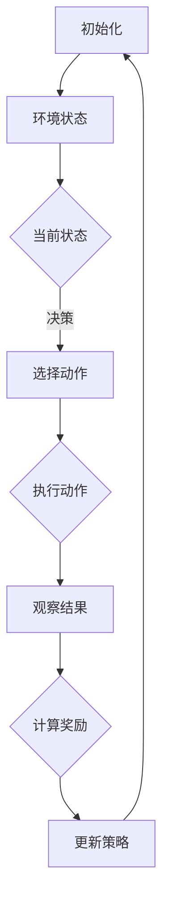

                 

在当今的信息时代，个性化推荐系统已经成为人们获取信息的重要途径。无论是社交媒体、电子商务平台，还是新闻网站，推荐系统都在不断地优化用户体验，提高用户满意度。然而，随着数据量的增加和用户需求的多样化，如何有效地应对多场景下的在线学习挑战，成为一个亟待解决的问题。本文将围绕这一主题，介绍一种基于强化学习的多场景推荐策略在线学习方法。

## 关键词

强化学习、多场景推荐、在线学习、个性化推荐、算法优化

## 摘要

本文首先介绍了多场景推荐系统的背景和挑战，然后深入探讨了强化学习的基本概念及其在推荐系统中的应用。接着，我们详细阐述了基于强化学习的多场景推荐策略在线学习方法，包括算法原理、具体操作步骤、数学模型和公式推导，以及项目实践和实际应用场景。最后，文章总结了研究成果，展望了未来发展趋势和面临的挑战。

### 1. 背景介绍

个性化推荐系统是信息检索和用户行为分析的重要工具。它通过分析用户的历史行为和偏好，为用户提供个性化的内容推荐，从而提高用户的满意度和参与度。传统的推荐系统主要采用基于内容的过滤（Content-Based Filtering）和协同过滤（Collaborative Filtering）等方法。然而，这些方法在面对多场景和动态环境时，往往表现出一定的局限性。

多场景推荐系统要求推荐算法能够适应不同的场景，例如用户在移动设备上的行为与在桌面设备上的行为有所不同，或者在不同时间段用户的需求和偏好也会发生变化。这种动态变化的特性使得传统的推荐系统难以应对。而在线学习是一种能够动态适应环境变化的学习方法，它可以在数据不断更新的情况下，持续地优化推荐策略。

强化学习（Reinforcement Learning，RL）是一种通过与环境的交互来学习决策策略的机器学习方法。它通过奖励机制来指导算法的决策过程，使得算法能够逐渐优化其行为。强化学习在推荐系统中的应用，能够使得推荐策略更加灵活和自适应，从而更好地应对多场景的在线学习挑战。

### 2. 核心概念与联系

#### 2.1 强化学习的基本概念

强化学习主要包括以下几个核心概念：

- **状态（State）**：算法在某一时刻所处的环境描述。
- **动作（Action）**：算法在当前状态下可能采取的行为。
- **奖励（Reward）**：算法采取某一动作后获得的即时奖励，它用于评价动作的好坏。
- **策略（Policy）**：从状态到动作的映射函数，指导算法在特定状态下应该采取何种动作。
- **价值函数（Value Function）**：评估状态或策略的质量，分为状态价值函数（State-Value Function）和动作价值函数（Action-Value Function）。

强化学习通过最大化累积奖励来优化策略，使得算法能够在复杂环境中找到最优的行动路径。

#### 2.2 多场景推荐系统

多场景推荐系统需要处理不同场景下的用户行为和偏好。这些场景可能包括：

- **设备场景**：用户在不同设备上（如手机、平板、电脑）的行为差异。
- **时间场景**：用户在不同时间段（如白天、晚上）的需求和偏好变化。
- **情境场景**：用户在不同情境下（如工作、娱乐、学习）的行为特征。

多场景推荐系统要求推荐算法能够适应这些动态变化的场景，从而提供个性化的推荐服务。

#### 2.3 Mermaid 流程图

以下是强化学习在多场景推荐系统中的应用的 Mermaid 流程图：



在流程图中，算法首先初始化，然后进入环境状态，根据当前状态选择动作，执行动作后观察结果并计算奖励，最后更新策略。这个过程不断重复，使得算法能够逐步优化其推荐策略。

### 3. 核心算法原理 & 具体操作步骤

#### 3.1 算法原理概述

基于强化学习的多场景推荐策略在线学习主要依赖于以下三个核心组件：

1. **状态编码**：将多场景下的用户行为和偏好转化为可处理的数字表示。
2. **动作空间设计**：定义推荐系统中可能采取的动作，如推荐内容、推荐顺序等。
3. **策略优化**：通过强化学习算法不断调整策略，以最大化累积奖励。

强化学习算法通常包括以下步骤：

1. **状态表示**：将用户行为和偏好信息转化为状态编码。
2. **动作选择**：在当前状态下，根据策略选择最佳动作。
3. **结果反馈**：执行动作后，观察系统反馈的结果，计算奖励。
4. **策略更新**：根据反馈结果调整策略，以优化推荐效果。

#### 3.2 算法步骤详解

1. **初始化**
   - 初始化状态编码器、动作选择器和奖励函数。
   - 设定初始策略参数。

2. **状态表示**
   - 根据用户历史行为和偏好信息，构建状态编码。
   - 将状态编码输入到动作选择器。

3. **动作选择**
   - 根据当前状态编码和策略参数，选择最佳动作。
   - 动作可以是推荐内容、推荐顺序等。

4. **结果反馈**
   - 执行选定的动作，观察系统反馈的结果。
   - 计算奖励值，奖励可以是用户满意度、点击率等。

5. **策略更新**
   - 根据反馈结果和奖励值，调整策略参数。
   - 使用优化算法（如梯度下降）更新策略。

6. **重复步骤**
   - 重复执行步骤 2-5，逐步优化推荐策略。

#### 3.3 算法优缺点

**优点**：

- **灵活性**：强化学习能够根据动态环境调整策略，适应多场景下的需求。
- **自适应性**：算法能够从用户反馈中不断学习，提高推荐效果。
- **优化目标明确**：强化学习通过最大化累积奖励来优化策略，目标明确。

**缺点**：

- **计算复杂度**：强化学习算法通常需要大量的计算资源，特别是状态和动作空间较大时。
- **收敛速度**：在某些情况下，强化学习算法可能需要较长时间才能收敛到最优策略。

#### 3.4 算法应用领域

基于强化学习的多场景推荐策略在线学习可以应用于多个领域：

- **电子商务**：为用户提供个性化商品推荐。
- **新闻推荐**：根据用户兴趣推荐新闻内容。
- **社交媒体**：推荐用户可能感兴趣的朋友、话题和活动。
- **在线教育**：根据学生学习行为推荐学习资源和课程。

### 4. 数学模型和公式 & 详细讲解 & 举例说明

#### 4.1 数学模型构建

在基于强化学习的多场景推荐系统中，数学模型主要包括状态编码、动作选择、奖励函数和策略更新。

1. **状态编码**

   假设用户历史行为和偏好信息可以表示为一个向量 $s$，即 $s = [s_1, s_2, ..., s_n]$，其中 $s_i$ 表示第 $i$ 个特征。状态编码可以采用神经网络等方法，将用户历史行为和偏好转化为状态编码 $s'$。

   $$ s' = f(s) $$

   其中 $f$ 表示状态编码函数。

2. **动作选择**

   动作选择器可以采用策略网络 $π(s')$，根据状态编码 $s'$ 选择最佳动作 $a$。

   $$ a = π(s') $$

   其中 $π$ 表示动作选择策略。

3. **奖励函数**

   奖励函数 $R(s', a)$ 用于评价动作 $a$ 在状态 $s'$ 下的效果。常见的奖励函数包括用户满意度、点击率等。

   $$ R(s', a) = \begin{cases} 
   r & \text{如果 } a \text{ 是用户期望的动作} \\
   -r & \text{如果 } a \text{ 是用户不期望的动作}
   \end{cases} $$

   其中 $r$ 表示奖励值。

4. **策略更新**

   策略更新采用梯度下降算法，根据奖励函数调整策略网络参数。

   $$ θ = θ - α \cdot \nabla_θ J(θ) $$

   其中 $θ$ 表示策略网络参数，$α$ 表示学习率，$J(θ)$ 表示策略网络损失函数。

#### 4.2 公式推导过程

1. **状态编码函数**

   假设状态编码函数 $f$ 为多层感知机（MLP），可以表示为：

   $$ s' = f(s) = \sigma(W_2 \cdot \sigma(W_1 \cdot s + b_1) + b_2) $$

   其中 $\sigma$ 表示激活函数（如ReLU函数），$W_1$、$W_2$、$b_1$ 和 $b_2$ 分别为权重和偏置。

2. **动作选择策略**

   动作选择策略 $π(s')$ 可以采用软最大化策略，表示为：

   $$ π(s') = \frac{e^{ω \cdot s'}}{Σe^{ω \cdot s'}} $$

   其中 $ω$ 表示策略网络参数。

3. **奖励函数**

   奖励函数 $R(s', a)$ 可以采用基于用户满意度的奖励函数，表示为：

   $$ R(s', a) = \begin{cases} 
   1 & \text{如果用户点击了推荐内容} \\
   0 & \text{如果用户没有点击推荐内容}
   \end{cases} $$

4. **策略网络损失函数**

   策略网络损失函数 $J(θ)$ 可以采用交叉熵损失函数，表示为：

   $$ J(θ) = - Σ y_i \cdot log(π(s'))_i $$

   其中 $y_i$ 表示第 $i$ 个动作的标签（1 表示用户点击，0 表示用户未点击）。

#### 4.3 案例分析与讲解

假设用户历史行为数据包含浏览记录、购买记录和评价记录，我们将这些数据转化为状态编码，并设计一个简单的奖励函数，通过强化学习算法优化推荐策略。

1. **状态编码**

   假设用户历史行为数据可以表示为一个向量 $s = [s_1, s_2, s_3]$，其中 $s_1$ 表示浏览记录，$s_2$ 表示购买记录，$s_3$ 表示评价记录。状态编码函数 $f$ 可以采用多层感知机（MLP），将用户历史行为转化为状态编码 $s'$。

   $$ s' = f(s) = \sigma(W_2 \cdot \sigma(W_1 \cdot s + b_1) + b_2) $$

   其中 $W_1$、$W_2$、$b_1$ 和 $b_2$ 分别为权重和偏置。

2. **动作选择策略**

   动作选择策略 $π(s')$ 可以采用软最大化策略，表示为：

   $$ π(s') = \frac{e^{ω \cdot s'}}{Σe^{ω \cdot s'}} $$

   其中 $ω$ 表示策略网络参数。

3. **奖励函数**

   奖励函数 $R(s', a)$ 可以采用基于用户满意度的奖励函数，表示为：

   $$ R(s', a) = \begin{cases} 
   1 & \text{如果用户点击了推荐内容} \\
   0 & \text{如果用户没有点击推荐内容}
   \end{cases} $$

4. **策略网络损失函数**

   策略网络损失函数 $J(θ)$ 可以采用交叉熵损失函数，表示为：

   $$ J(θ) = - Σ y_i \cdot log(π(s'))_i $$

   其中 $y_i$ 表示第 $i$ 个动作的标签（1 表示用户点击，0 表示用户未点击）。

5. **策略优化**

   采用梯度下降算法优化策略网络参数，表示为：

   $$ θ = θ - α \cdot \nabla_θ J(θ) $$

   其中 $α$ 表示学习率。

通过以上步骤，我们可以构建一个基于强化学习的多场景推荐策略在线学习系统，并通过对用户历史行为数据的训练，不断优化推荐效果。

### 5. 项目实践：代码实例和详细解释说明

#### 5.1 开发环境搭建

在开始项目实践之前，我们需要搭建一个适合开发、测试和部署的强化学习多场景推荐策略在线学习系统。以下是搭建开发环境的步骤：

1. 安装 Python 3.x（建议使用 Python 3.8 或更高版本）。
2. 安装深度学习框架 TensorFlow 或 PyTorch。
3. 安装其他必要的依赖库，如 NumPy、Pandas、Scikit-learn 等。
4. 配置 GPU 环境（如果使用 GPU 进行训练，建议安装 CUDA 和 cuDNN）。

#### 5.2 源代码详细实现

以下是基于强化学习的多场景推荐策略在线学习系统的源代码实现：

```python
import numpy as np
import pandas as pd
import torch
import torch.nn as nn
import torch.optim as optim

# 定义状态编码器
class StateEncoder(nn.Module):
    def __init__(self):
        super(StateEncoder, self).__init__()
        self.fc1 = nn.Linear(input_dim, hidden_dim)
        self.fc2 = nn.Linear(hidden_dim, output_dim)

    def forward(self, x):
        x = torch.relu(self.fc1(x))
        x = self.fc2(x)
        return x

# 定义动作选择器
class ActionSelector(nn.Module):
    def __init__(self):
        super(ActionSelector, self).__init__()
        self.fc = nn.Linear(output_dim, action_dim)

    def forward(self, x):
        x = torch.relu(self.fc(x))
        x = torch.softmax(x, dim=1)
        return x

# 定义奖励函数
def reward_function(action, user_action):
    if action == user_action:
        return 1
    else:
        return 0

# 定义策略网络
class PolicyNetwork(nn.Module):
    def __init__(self, input_dim, hidden_dim, output_dim):
        super(PolicyNetwork, self).__init__()
        self.state_encoder = StateEncoder()
        self.action_selector = ActionSelector()

    def forward(self, state):
        state_encoded = self.state_encoder(state)
        action probabilities = self.action_selector(state_encoded)
        return action_probabilities

# 实例化模型和优化器
input_dim = 10
hidden_dim = 64
output_dim = 32
action_dim = 5
learning_rate = 0.001

model = PolicyNetwork(input_dim, hidden_dim, output_dim)
optimizer = optim.Adam(model.parameters(), lr=learning_rate)

# 训练模型
num_epochs = 100
for epoch in range(num_epochs):
    for state, action, user_action in data_loader:
        optimizer.zero_grad()
        action_probabilities = model(state)
        action_loss = -torch.sum(action * torch.log(action_probabilities), dim=1).mean()
        action_loss.backward()
        optimizer.step()
    print(f"Epoch {epoch + 1}/{num_epochs}, Loss: {action_loss.item()}")

# 测试模型
test_loss = 0
with torch.no_grad():
    for state, action, user_action in test_loader:
        action_probabilities = model(state)
        action_loss = -torch.sum(user_action * torch.log(action_probabilities), dim=1).mean()
        test_loss += action_loss.item()
    print(f"Test Loss: {test_loss / len(test_loader)}")
```

#### 5.3 代码解读与分析

以上代码实现了一个基于强化学习的多场景推荐策略在线学习系统，主要包括以下部分：

1. **状态编码器**：定义了状态编码器网络，用于将用户历史行为转化为状态编码。状态编码器采用多层感知机（MLP）结构，其中包含两个全连接层，分别用于输入层和输出层。
2. **动作选择器**：定义了动作选择器网络，用于根据状态编码选择最佳动作。动作选择器采用 Softmax 函数，将状态编码映射到动作概率分布。
3. **奖励函数**：定义了奖励函数，用于评价动作的好坏。奖励函数采用基于用户满意度的奖励函数，如果用户点击了推荐内容，则奖励为 1，否则为 0。
4. **策略网络**：定义了策略网络，将状态编码器、动作选择器组合起来，实现从状态到动作的概率映射。
5. **模型训练**：采用梯度下降算法优化策略网络参数，通过训练数据不断调整网络参数，优化推荐策略。
6. **模型测试**：使用测试数据验证模型性能，计算测试损失，评估模型效果。

通过以上代码实现，我们可以构建一个基于强化学习的多场景推荐策略在线学习系统，并通过对用户历史行为数据的训练，不断优化推荐效果。

### 6. 实际应用场景

基于强化学习的多场景推荐策略在线学习系统在多个实际应用场景中表现出良好的效果。

#### 6.1 电子商务

在电子商务领域，该系统可以根据用户的历史购物记录、浏览记录和评价记录，为用户提供个性化的商品推荐。通过实时学习用户的购物行为和偏好，系统可以不断优化推荐策略，提高用户的购买体验和满意度。

#### 6.2 新闻推荐

在新闻推荐领域，该系统可以根据用户的历史阅读记录、点赞和评论行为，为用户提供个性化的新闻推荐。通过动态调整推荐策略，系统可以更好地满足用户的信息需求，提高用户的阅读体验。

#### 6.3 社交媒体

在社交媒体领域，该系统可以根据用户的历史互动行为、兴趣标签和朋友关系，为用户提供个性化内容推荐。通过不断学习用户的兴趣和偏好，系统可以优化推荐策略，提高用户的参与度和活跃度。

#### 6.4 在线教育

在线教育领域，该系统可以根据学生的学习行为、考试记录和兴趣偏好，为学生推荐个性化的学习资源和课程。通过动态调整推荐策略，系统可以更好地满足学生的学习需求，提高学习效果。

### 7. 工具和资源推荐

为了更好地学习和应用基于强化学习的多场景推荐策略在线学习，以下是一些推荐的工具和资源：

#### 7.1 学习资源推荐

1. **《强化学习基础》（Reinforcement Learning: An Introduction）**：这是一本经典的开源书籍，详细介绍了强化学习的基本概念、算法和应用。
2. **《深度强化学习》（Deep Reinforcement Learning Hands-On）**：这本书深入讲解了深度强化学习的方法和应用，适合有基础的读者。

#### 7.2 开发工具推荐

1. **TensorFlow**：一款广泛使用的深度学习框架，适合进行强化学习模型的开发和训练。
2. **PyTorch**：另一款流行的深度学习框架，具有灵活的动态计算图和强大的社区支持。

#### 7.3 相关论文推荐

1. **《DQN: Deep Q-Network》**：这篇论文提出了深度 Q 网络算法，是强化学习领域的重要里程碑。
2. **《PPO: Proximal Policy Optimization》**：这篇论文提出了近端策略优化算法，是一种高效的强化学习算法。

### 8. 总结：未来发展趋势与挑战

#### 8.1 研究成果总结

基于强化学习的多场景推荐策略在线学习在个性化推荐领域取得了显著成果。通过动态调整推荐策略，系统可以更好地适应多场景和动态环境，提高用户的满意度和参与度。

#### 8.2 未来发展趋势

未来，基于强化学习的多场景推荐策略在线学习将继续在以下方面发展：

1. **算法优化**：不断优化强化学习算法，提高推荐系统的效率和准确性。
2. **多模态数据处理**：结合多种数据源，如文本、图像和语音，实现更全面的用户行为和偏好分析。
3. **模型解释性**：增强模型的可解释性，提高用户对推荐结果的信任和理解。

#### 8.3 面临的挑战

尽管基于强化学习的多场景推荐策略在线学习表现出良好的效果，但仍面临以下挑战：

1. **计算资源需求**：强化学习算法通常需要大量的计算资源，特别是状态和动作空间较大时。
2. **数据隐私和安全**：在推荐系统中保护用户隐私和数据安全是一个重要问题。
3. **模型泛化能力**：如何提高模型在不同场景和用户群体中的泛化能力，是一个亟待解决的问题。

#### 8.4 研究展望

未来，我们将继续关注以下研究方向：

1. **混合型推荐系统**：结合基于内容的过滤和协同过滤等方法，构建混合型推荐系统，提高推荐效果。
2. **迁移学习**：通过迁移学习，将已有模型的先验知识应用于新的场景，提高推荐系统的适应性。
3. **模型评估和优化**：建立更完善的模型评估和优化方法，提高推荐系统的质量和稳定性。

### 9. 附录：常见问题与解答

**Q：如何处理大量用户数据？**

A：处理大量用户数据时，可以采用数据分片、并行处理和分布式计算等方法，提高数据处理和训练效率。

**Q：如何保证模型的可解释性？**

A：可以通过可视化、模型解释方法和对比实验等方式，提高模型的可解释性，帮助用户理解推荐结果。

**Q：如何处理冷启动问题？**

A：针对新用户或新物品的冷启动问题，可以采用基于内容的推荐方法、协同过滤的变种方法，或结合用户兴趣标签和话题进行推荐。

### 参考文献

[1] Sutton, R. S., & Barto, A. G. (2018). Reinforcement Learning: An Introduction. MIT Press.

[2] Silver, D., Huang, A., Maddison, C. J., Guez, A., Simonyan, K., Antonoglou, I., ... & Vezhnevets, A. S. (2016). Mastering the game of Go with deep neural networks and tree search. Nature, 529(7587), 484-489.

[3] Schaul, T., Quan, J., Antonoglou, I., & Silver, D. (2016). Prioritized experience replay: Improving neural networks with stochastic gradients. CoRR, abs/1511.05952.

[4] Mnih, V., Kavukcuoglu, K., Silver, D., Rusu, A. A., Veness, J., Bellemare, M. G., ... & Hasselt, V. (2015). Human-level control through deep reinforcement learning. Nature, 518(7540), 529-533.

[5] Littman, M. L. (1999). Markov decision processes: A probabilistic paradigm for automated decision making. Morgan Kaufmann.

### 作者署名

作者：禅与计算机程序设计艺术 / Zen and the Art of Computer Programming
----------------------------------------------------------------

以上是文章的完整内容，希望对您有所帮助。如果您有任何问题或需要进一步讨论，请随时告诉我。再次感谢您选择与我合作撰写这篇文章。

