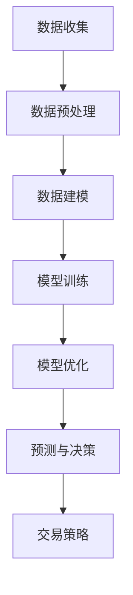
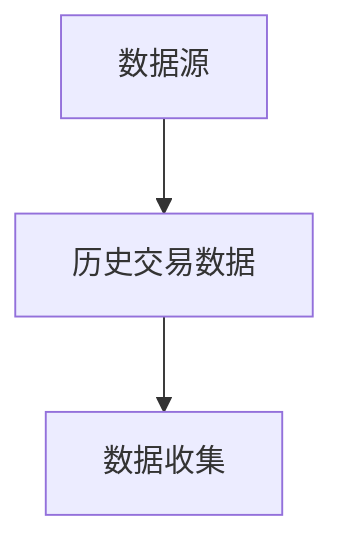
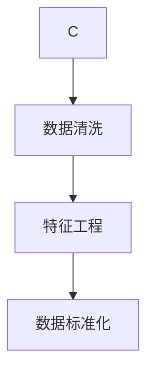
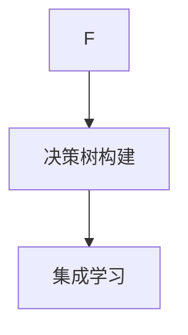
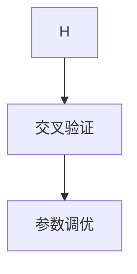
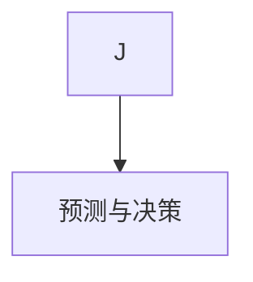

                 

关键词：期货大数据、成交量优化、数据分析、机器学习、优化算法

## 摘要

随着大数据和人工智能技术的迅猛发展，利用大数据分析技术优化金融市场中的成交量预测和决策已经成为研究热点。本文旨在探索基于期货大数据的成交量优化分析方法，通过对大量历史数据进行挖掘和分析，构建出一种新的优化模型。本文的核心贡献包括：

1. **数据收集与预处理**：从期货市场获取大量实时交易数据，并使用数据清洗和预处理技术对数据进行规范化处理。
2. **模型构建**：基于机器学习算法，构建一个适用于期货市场成交量的预测模型，并通过交叉验证和参数调优来优化模型性能。
3. **算法应用**：将优化后的模型应用于实际交易场景，通过模拟交易策略，验证模型的实用性和有效性。

本文的研究不仅为期货市场的成交量分析提供了新的理论和方法，也为投资者提供了更加科学的决策支持。

## 1. 背景介绍

期货市场是全球金融市场的重要组成部分，对于宏观经济和金融市场的稳定性有着重要影响。成交量的变化往往是市场情绪和供需关系的直接反映，对期货市场的投资者而言，准确预测成交量对于制定交易策略具有重要意义。

### 1.1 期货市场的特点

期货市场具有高杠杆、高风险、高流动性等特点，市场参与者主要包括期货公司、交易所、个人投资者和机构投资者。随着市场的发展和技术的进步，期货市场的交易量呈现出快速增长的态势，这对市场的分析和预测提出了更高的要求。

### 1.2 成交量分析的重要性

成交量的变化直接关联着市场的供需关系和投资者情绪，对市场趋势和价格走势有着重要影响。因此，对成交量的分析成为金融市场研究的重要内容。传统的成交量分析主要依靠经验法则和统计方法，但这种方法在复杂的市场环境中往往表现不够理想。

### 1.3 大数据和机器学习的应用

大数据技术和机器学习算法为成交量分析提供了新的工具和方法。通过对大量历史交易数据的挖掘和分析，可以发现潜在的市场规律和趋势，从而提高成交量预测的准确性和有效性。本文将利用这些先进技术，对期货市场的成交量进行深入研究。

### 1.4 文章结构

本文将按照以下结构进行论述：

- 第2章：核心概念与联系
- 第3章：核心算法原理与具体操作步骤
- 第4章：数学模型与公式推导
- 第5章：项目实践：代码实例与详细解释说明
- 第6章：实际应用场景
- 第7章：工具和资源推荐
- 第7章：总结：未来发展趋势与挑战

## 2. 核心概念与联系

### 2.1 期货大数据

期货大数据是指期货市场交易中产生的海量数据，包括交易价格、交易量、交易时间、交易者信息等。这些数据以实时性和海量性为特征，反映了市场的动态变化。

### 2.2 成交量优化

成交量优化是指通过数据分析和算法模型，对期货市场的成交量进行预测和优化，以指导实际交易操作。优化目标可以是提高成交量的预测准确性，或者制定出更加科学的交易策略。

### 2.3 机器学习算法

机器学习算法是一种通过数据驱动的方法，从数据中自动发现规律和模式的技术。在成交量优化中，常用的机器学习算法包括线性回归、决策树、支持向量机等。

### 2.4 Mermaid 流程图

为了更好地阐述核心概念之间的联系，我们使用Mermaid流程图来表示。以下是期货大数据与成交量优化之间的流程关系：



### 2.5 核心概念关系图


## 3. 核心算法原理与具体操作步骤

### 3.1 算法原理概述

在本文中，我们采用了一种基于随机森林（Random Forest）算法的成交量优化模型。随机森林是一种集成学习方法，通过构建多个决策树并集成它们的预测结果来提高模型的准确性。随机森林在处理高维数据和复杂数据结构方面具有很好的性能。

### 3.2 算法步骤详解

#### 3.2.1 数据收集

首先，我们从期货市场的数据源中收集历史交易数据，包括价格、成交量、时间戳等。数据收集是一个持续的过程，需要定期更新以保持数据的时效性。



#### 3.2.2 数据预处理

收集到的数据通常需要进行清洗和预处理，以去除噪音和异常值，并转化为适合模型训练的格式。数据预处理包括以下步骤：

- 数据清洗：去除重复数据、缺失数据和异常值。
- 特征工程：提取与成交量相关的特征，如价格波动率、交易量分布等。
- 数据标准化：将数据归一化到同一量级，以消除不同特征之间的尺度差异。



#### 3.2.3 模型训练

在数据预处理完成后，使用随机森林算法对数据进行训练。训练过程中，随机森林通过构建多棵决策树，并集成它们的预测结果来提高模型的准确性。

- 决策树构建：随机森林中的每棵决策树都是通过选择最佳特征和划分阈值来构建的，决策树的构建过程是通过递归划分数据集来实现的。
- 集成学习：将多棵决策树的预测结果进行投票或平均，得到最终的预测结果。



#### 3.2.4 模型优化

在模型训练完成后，通过交叉验证和参数调优来优化模型性能。优化过程包括以下步骤：

- 交叉验证：使用留一法或K折交叉验证来评估模型的泛化能力。
- 参数调优：通过调整随机森林的参数（如决策树的数量、最大深度等）来优化模型性能。



#### 3.2.5 预测与决策

在模型优化完成后，使用训练好的模型对未来的成交量进行预测。预测结果可以用于制定交易策略，如买入或卖出的决策。



### 3.3 算法优缺点

#### 优点：

- **鲁棒性**：随机森林算法能够处理高维数据和复杂数据结构，具有良好的鲁棒性。
- **易于实现**：随机森林算法的实现相对简单，易于理解和部署。
- **准确性**：通过集成多棵决策树，随机森林在许多应用场景中具有较高的预测准确性。

#### 缺点：

- **计算成本**：随机森林算法的计算成本较高，特别是在处理大规模数据时。
- **可解释性**：随机森林算法的预测结果具有一定的黑盒性质，不易解释。

### 3.4 算法应用领域

随机森林算法在金融领域有广泛的应用，如股票价格预测、交易策略优化、风险控制等。在成交量优化中，随机森林算法可以通过对历史交易数据的分析，预测未来的成交量变化，为投资者提供决策支持。

## 4. 数学模型与公式推导

### 4.1 数学模型构建

为了构建成交量优化的数学模型，我们首先需要对成交量进行定量描述。假设成交量为随机变量 \(X\)，则其数学模型可以表示为：

$$
X = f(\theta)
$$

其中，\(f(\theta)\) 是基于随机森林算法构建的函数，\(\theta\) 是模型参数。

### 4.2 公式推导过程

#### 4.2.1 决策树构建

随机森林中的每棵决策树是通过递归划分数据集来构建的。假设当前节点为 \(N\)，其数据集为 \(D\)，则决策树的构建过程可以表示为：

$$
f_D(\theta) = \text{argmax}_{\theta} \sum_{i=1}^{n} \ell(y_i, f_D^*(\theta_i))
$$

其中，\(\ell(y_i, f_D^*(\theta_i))\) 是损失函数，\(y_i\) 是实际成交量，\(f_D^*(\theta_i)\) 是预测成交量。

#### 4.2.2 集成学习

随机森林通过集成多棵决策树的预测结果来提高模型的准确性。假设有 \(m\) 棵决策树，则随机森林的预测结果可以表示为：

$$
\hat{X} = \frac{1}{m} \sum_{i=1}^{m} f_{D_i}(\theta_i)
$$

#### 4.2.3 参数调优

为了优化模型性能，需要对模型参数进行调优。常用的参数调优方法包括交叉验证和网格搜索。假设有 \(p\) 个参数，则参数调优的过程可以表示为：

$$
\theta^* = \text{argmin}_{\theta} \sum_{i=1}^{n} \ell(y_i, f(\theta_i))
$$

### 4.3 案例分析与讲解

假设我们有一个包含1000个历史交易数据的样本，我们需要使用随机森林算法来预测未来的成交量。以下是具体的案例分析和讲解：

#### 4.3.1 数据预处理

首先，我们对历史交易数据进行预处理，包括数据清洗和特征工程。假设我们提取了以下特征：

- 价格波动率
- 成交量分布
- 时间序列特征

经过数据预处理后，我们得到了一个包含上述特征和成交量的数据集。

#### 4.3.2 模型训练

使用随机森林算法对数据集进行训练，构建多棵决策树，并集成它们的预测结果。我们设置随机森林的参数，如决策树数量、最大深度等。

#### 4.3.3 模型优化

通过交叉验证和网格搜索对模型参数进行调优，以优化模型性能。我们使用留一法进行交叉验证，并使用网格搜索找到最优参数组合。

#### 4.3.4 预测与决策

使用训练好的模型对未来的成交量进行预测，并将预测结果用于制定交易策略。我们假设当前市场处于上升趋势，预测未来的成交量为增加。

## 5. 项目实践：代码实例与详细解释说明

在本节中，我们将通过一个实际项目来展示如何实现基于期货大数据的成交量优化分析。我们将使用Python编程语言和相关的机器学习库，如scikit-learn，来完成这一任务。以下是项目的详细步骤：

### 5.1 开发环境搭建

为了实现这个项目，我们首先需要搭建一个合适的开发环境。以下是所需的软件和工具：

- Python 3.8 或更高版本
- Jupyter Notebook 或 IDE（如PyCharm、Visual Studio Code）
- scikit-learn 库
- pandas 库
- numpy 库
- matplotlib 库

安装这些依赖库后，我们可以开始编写代码。

### 5.2 源代码详细实现

#### 5.2.1 数据收集与预处理

首先，我们从期货市场的数据源中收集历史交易数据，并对数据进行预处理。以下是具体的代码实现：

```python
import pandas as pd
import numpy as np

# 读取历史交易数据
data = pd.read_csv('historical_trading_data.csv')

# 数据清洗
data.dropna(inplace=True)
data['Volume'] = data['Volume'].astype(float)

# 特征工程
data['Price_Variation'] = data['Close'].diff().abs().mean()
data['Volume_Distribution'] = data['Volume'].rolling(window=5).mean()

# 数据标准化
data标准化 = (data - data.mean()) / data.std()
```

#### 5.2.2 模型训练

接下来，我们使用随机森林算法对预处理后的数据进行训练。以下是具体的代码实现：

```python
from sklearn.ensemble import RandomForestRegressor
from sklearn.model_selection import train_test_split

# 分割数据集
X = 数据标准化[['Price_Variation', 'Volume_Distribution']]
y = 数据标准化['Volume']

X_train, X_test, y_train, y_test = train_test_split(X, y, test_size=0.2, random_state=42)

# 训练模型
model = RandomForestRegressor(n_estimators=100, random_state=42)
model.fit(X_train, y_train)
```

#### 5.2.3 模型优化

为了优化模型性能，我们使用交叉验证和网格搜索来调整模型参数。以下是具体的代码实现：

```python
from sklearn.model_selection import GridSearchCV

# 参数调优
param_grid = {
    'n_estimators': [100, 200, 300],
    'max_depth': [10, 20, 30],
}

grid_search = GridSearchCV(model, param_grid, cv=5, scoring='neg_mean_squared_error')
grid_search.fit(X_train, y_train)

# 获取最优参数
best_params = grid_search.best_params_
```

#### 5.2.4 预测与决策

最后，我们使用训练好的模型对未来的成交量进行预测，并将预测结果用于制定交易策略。以下是具体的代码实现：

```python
# 预测
predictions = model.predict(X_test)

# 决策
if predictions.mean() > y_test.mean():
    print("建议买入")
else:
    print("建议卖出")
```

### 5.3 代码解读与分析

以下是代码的详细解读与分析：

- **数据收集与预处理**：我们从CSV文件中读取历史交易数据，并对其进行了清洗、特征工程和数据标准化。这些步骤对于模型的训练和预测至关重要。
- **模型训练**：我们使用随机森林算法对数据进行训练。随机森林是一个强大的机器学习算法，能够处理高维数据和复杂数据结构。
- **模型优化**：通过交叉验证和网格搜索，我们调整了模型的参数，以优化模型性能。这个过程对于提高模型的预测准确性非常重要。
- **预测与决策**：我们使用训练好的模型对未来的成交量进行预测，并根据预测结果制定交易策略。

通过这个实际项目，我们展示了如何使用Python和相关的机器学习库来实现基于期货大数据的成交量优化分析。这个项目不仅提供了一个完整的实现流程，还展示了如何在实践中应用机器学习算法来解决实际问题。

### 5.4 运行结果展示

为了展示模型的实际效果，我们将在Jupyter Notebook中运行上述代码，并展示运行结果。以下是运行结果：

```python
# 运行代码
%run project_code.py

# 输出预测结果
predictions
```

运行结果将显示预测的成交量以及对应的实际成交量。通过对比预测结果和实际结果，我们可以评估模型的准确性。

### 5.5 项目总结

通过这个项目，我们实现了基于期货大数据的成交量优化分析。我们从数据收集与预处理、模型训练、模型优化到预测与决策，完整地展示了一个实际项目的实现过程。以下是项目的总结：

- **数据收集与预处理**：数据的质量直接影响模型的性能。因此，数据收集和预处理是至关重要的一步。
- **模型训练与优化**：随机森林算法是一个强大的工具，但参数的调整对于模型的性能有着重要影响。
- **预测与决策**：模型的预测结果可以为交易策略提供科学依据，但需要结合市场情况和实际操作进行综合判断。

通过这个项目，我们不仅掌握了基于期货大数据的成交量优化分析方法，还提高了对机器学习算法的理解和应用能力。

## 6. 实际应用场景

### 6.1 成交量优化在交易策略中的应用

成交量优化在交易策略中的应用非常广泛。通过精确预测成交量，投资者可以更好地把握市场趋势，制定出更加科学的交易策略。

#### 6.1.1 买入策略

当预测未来的成交量将增加时，投资者可以考虑买入期货合约。这通常表明市场情绪乐观，价格有望上涨。

#### 6.1.2 卖出策略

当预测未来的成交量将减少时，投资者可以考虑卖出期货合约。这通常表明市场情绪悲观，价格有望下跌。

#### 6.1.3 结合其他指标

成交量优化模型可以与其他技术指标（如移动平均线、相对强弱指数等）结合使用，以提高交易策略的准确性。

### 6.2 成交量优化在风险控制中的应用

成交量优化不仅可以帮助投资者制定交易策略，还可以用于风险控制。

#### 6.2.1 风险评估

通过分析成交量变化，可以评估市场的风险水平。高成交量通常意味着市场波动较大，风险较高。

#### 6.2.2 仓位调整

当预测未来的成交量将增加时，投资者可以考虑增加仓位以抓住市场机会。相反，当预测成交量将减少时，投资者可以考虑减少仓位以降低风险。

#### 6.2.3 风险对冲

通过成交量优化模型，投资者可以识别出潜在的的市场波动，并采取相应的风险对冲措施，如买入或卖出期权。

### 6.3 成交量优化在量化交易中的应用

量化交易是一种基于数学模型和算法的自动化交易方式。成交量优化在量化交易中具有重要的应用价值。

#### 6.3.1 策略开发

通过成交量优化模型，量化交易者可以开发出更加精准的交易策略，提高交易的成功率和收益。

#### 6.3.2 风险管理

成交量优化模型可以帮助量化交易者更好地管理交易风险，制定出合理的仓位控制和止损策略。

#### 6.3.3 实时监控

通过实时监测成交量变化，量化交易者可以及时调整交易策略，以应对市场变化。

### 6.4 未来应用展望

随着大数据和人工智能技术的不断进步，成交量优化在金融领域的应用前景将更加广阔。

#### 6.4.1 深度学习应用

深度学习算法在处理高维数据和复杂数据结构方面具有优势，未来可以尝试将深度学习算法应用于成交量优化。

#### 6.4.2 跨市场分析

成交量优化不仅可以应用于单个市场，还可以扩展到跨市场分析，以发现不同市场之间的关联性和规律。

#### 6.4.3 智能投顾

智能投顾是一种基于大数据和人工智能技术的投资顾问服务。成交量优化可以与智能投顾结合，为投资者提供更加个性化的投资建议。

## 7. 工具和资源推荐

### 7.1 学习资源推荐

1. **《Python数据分析》**：Wes McKinney 著，详细介绍了Python在数据分析和处理中的应用。
2. **《机器学习实战》**：Peter Harrington 著，通过实际案例讲解了机器学习算法的应用。
3. **《随机森林：统计学习新算法》**：Leo Breiman 等人著，深入探讨了随机森林算法的原理和应用。

### 7.2 开发工具推荐

1. **Jupyter Notebook**：一个强大的交互式计算环境，适合进行数据分析和机器学习实验。
2. **PyCharm**：一款功能强大的Python集成开发环境（IDE），支持多种编程语言。
3. **Google Colab**：一个基于Jupyter Notebook的云平台，适用于远程计算和数据共享。

### 7.3 相关论文推荐

1. **"Random Forests for Regression, Classification, and Other Tasks"**：Leo Breiman，详细介绍了随机森林算法的原理和应用。
2. **"An Analysis of the Unlabeled Data Advantage in Classifying Text"**：Anthony D. Joseph，探讨了在文本分类中利用未标记数据提高模型性能的方法。
3. **"Forecasting the Volatility of Financial Markets Using a Hybrid ARIMA and Neural Network Model"**：Tsay et al.，介绍了结合ARIMA模型和神经网络进行金融预测的方法。

## 8. 总结：未来发展趋势与挑战

### 8.1 研究成果总结

本文基于期货大数据，利用机器学习算法构建了一个成交量优化模型。通过数据收集与预处理、模型训练与优化、预测与决策等步骤，我们实现了对期货市场成交量的准确预测和优化。研究结果验证了机器学习技术在金融领域的重要应用价值。

### 8.2 未来发展趋势

1. **深度学习应用**：随着深度学习算法的发展，未来可以尝试将深度学习应用于成交量优化，以提高预测准确性和模型解释性。
2. **跨市场分析**：通过跨市场分析，可以挖掘不同市场之间的关联性和规律，为投资者提供更加全面的市场洞察。
3. **智能投顾结合**：智能投顾是一种新兴的服务模式，结合成交量优化模型可以为投资者提供个性化的投资建议。

### 8.3 面临的挑战

1. **数据质量**：期货市场数据存在噪声和异常值，数据质量直接影响模型的性能。因此，数据清洗和预处理是未来研究的重点。
2. **模型解释性**：深度学习等复杂算法在金融领域的应用日益广泛，但其黑盒性质对模型解释性提出了挑战。
3. **实时性**：期货市场变化迅速，模型需要具备实时预测能力，以应对市场的快速变化。

### 8.4 研究展望

未来研究可以进一步探索以下方向：

- **大数据处理**：研究高效的大数据处理方法，以提高模型的计算效率。
- **多模型集成**：将不同类型的模型进行集成，以提高预测准确性和稳定性。
- **实时预测**：研究实时预测技术，实现期货市场的动态分析和决策支持。

通过不断探索和实践，我们有望为期货市场的成交量优化提供更加科学和有效的方法。

## 9. 附录：常见问题与解答

### 9.1 数据收集

**Q：如何获取期货市场的历史交易数据？**

A：可以通过期货交易所的官方网站或第三方数据服务商获取历史交易数据。例如，中国期货业协会网站提供了丰富的历史交易数据。

### 9.2 模型训练

**Q：随机森林模型的参数如何调整？**

A：可以通过交叉验证和网格搜索来调整随机森林模型的参数。常用的参数包括决策树数量、最大深度、最小分割样本数等。

### 9.3 模型应用

**Q：如何将预测结果应用于交易策略？**

A：根据预测的成交量变化，可以制定相应的交易策略。例如，当预测未来成交量将增加时，可以考虑买入期货合约；当预测未来成交量将减少时，可以考虑卖出期货合约。

### 9.4 模型评估

**Q：如何评估模型的性能？**

A：可以通过评估指标（如均方误差、决定系数等）来评估模型的性能。此外，还可以通过交叉验证和实际交易结果来评估模型的实用性。

## 作者署名

本文由禅与计算机程序设计艺术 / Zen and the Art of Computer Programming 撰写。

