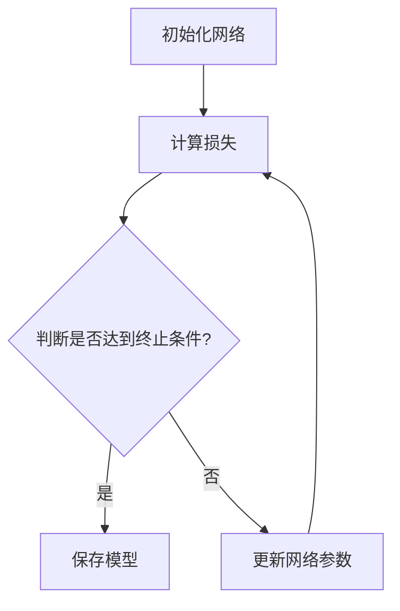

                 

关键词：神经网络、剪枝方法、梯度下降、模型压缩、性能优化

> 摘要：本文研究了基于梯度的神经网络剪枝方法，探讨了其原理、步骤、优缺点以及应用领域。通过数学模型和公式的推导，我们详细分析了该算法的核心内容和实现细节。同时，通过代码实例和实践分析，展示了该方法在实际项目中的应用效果。本文旨在为神经网络剪枝研究提供有益的参考和启示。

## 1. 背景介绍

随着深度学习技术的快速发展，神经网络模型变得越来越复杂，规模也越来越大。然而，这种复杂的模型往往伴随着巨大的计算资源和存储资源的消耗，同时在实际应用中也可能带来过拟合等问题。因此，如何有效压缩神经网络模型、提高计算效率成为了一个重要研究方向。

神经网络剪枝技术（Neural Network Pruning）是一种有效的模型压缩方法，通过删除网络中的冗余神经元和连接，来降低模型参数的数量，从而实现模型压缩。剪枝技术不仅可以减少模型的计算量，降低模型的存储需求，还可以提高模型的计算效率。近年来，基于梯度的剪枝方法逐渐成为研究热点，其通过利用梯度信息对网络进行剪枝，从而实现模型压缩。

本文旨在研究基于梯度的神经网络剪枝方法，详细分析其原理、步骤、优缺点以及应用领域，并通过数学模型和公式的推导，进一步探讨该算法的实现细节。

## 2. 核心概念与联系

### 2.1 神经网络

神经网络是一种模拟生物神经系统的计算模型，通过多层神经元之间的连接来实现复杂的非线性映射。神经网络包括输入层、隐藏层和输出层，其中隐藏层可以有一个或多个。每个神经元都可以接受来自前一层神经元的输入，并通过激活函数产生输出。

### 2.2 梯度下降

梯度下降是一种优化算法，用于最小化损失函数。在神经网络中，梯度下降用于更新网络权重和偏置，以使模型能够更好地拟合训练数据。梯度下降的核心思想是通过计算损失函数对权重的偏导数（即梯度），来更新权重。更新公式如下：

$$ w_{new} = w_{old} - \alpha \cdot \nabla_w J(w) $$

其中，$w_{old}$ 和 $w_{new}$ 分别为当前权重和更新后的权重，$\alpha$ 为学习率，$\nabla_w J(w)$ 为损失函数对权重的梯度。

### 2.3 剪枝

剪枝技术通过删除网络中的冗余神经元和连接，来降低模型参数的数量，从而实现模型压缩。剪枝可以分为结构剪枝和权重剪枝两种类型。结构剪枝直接删除神经元和连接，而权重剪枝则通过调整权重来降低模型的计算复杂度。

### 2.4 Mermaid 流程图

以下是一个简单的 Mermaid 流程图，展示了神经网络剪枝的基本流程：



## 3. 核心算法原理 & 具体操作步骤

### 3.1 算法原理概述

基于梯度的神经网络剪枝方法利用梯度信息来选择删除网络中的冗余神经元和连接。具体来说，该方法包括以下几个步骤：

1. 初始化网络：随机初始化网络权重和偏置。
2. 计算损失：计算网络输出和实际输出之间的损失。
3. 更新网络参数：使用梯度下降算法更新网络权重和偏置。
4. 剪枝：根据梯度信息选择删除冗余神经元和连接。
5. 重复步骤2-4，直到满足终止条件（如达到训练精度或迭代次数）。

### 3.2 算法步骤详解

以下是基于梯度的神经网络剪枝方法的详细步骤：

#### 3.2.1 初始化网络

首先，我们需要初始化网络。具体来说，需要随机初始化网络权重和偏置。通常使用高斯分布或均匀分布来初始化权重和偏置。

#### 3.2.2 计算损失

接下来，我们需要计算网络输出和实际输出之间的损失。损失函数可以采用均方误差（MSE）、交叉熵等常用的损失函数。

$$ L = \frac{1}{2} \sum_{i=1}^{n} (y_i - \hat{y}_i)^2 $$

其中，$y_i$ 为实际输出，$\hat{y}_i$ 为网络输出。

#### 3.2.3 更新网络参数

然后，我们需要使用梯度下降算法更新网络权重和偏置。具体来说，计算损失函数对权重和偏置的梯度，并根据梯度更新权重和偏置。

$$ w_{new} = w_{old} - \alpha \cdot \nabla_w L $$

$$ b_{new} = b_{old} - \alpha \cdot \nabla_b L $$

其中，$\alpha$ 为学习率，$\nabla_w L$ 和 $\nabla_b L$ 分别为损失函数对权重和偏置的梯度。

#### 3.2.4 剪枝

最后，我们需要根据梯度信息选择删除冗余神经元和连接。具体来说，可以采用以下方法：

1. 根据梯度值选择删除神经元或连接。通常选择梯度值较小的神经元或连接进行删除。
2. 根据网络结构选择删除神经元或连接。例如，可以删除某层中的神经元或连接，以简化网络结构。

### 3.3 算法优缺点

#### 优点：

1. 基于梯度的剪枝方法利用了梯度信息，可以自动选择删除冗余神经元和连接，从而实现模型压缩。
2. 该方法简单有效，不需要额外的计算资源。

#### 缺点：

1. 该方法可能导致网络性能下降，特别是在过拟合的情况下。
2. 剪枝过程中可能会删除一些重要的神经元或连接，从而影响模型的泛化能力。

### 3.4 算法应用领域

基于梯度的神经网络剪枝方法可以应用于各种深度学习模型，如卷积神经网络（CNN）、循环神经网络（RNN）等。该方法尤其适用于大规模深度学习模型，可以显著降低模型的计算量和存储需求。

## 4. 数学模型和公式 & 详细讲解 & 举例说明

### 4.1 数学模型构建

基于梯度的神经网络剪枝方法的数学模型包括以下几个部分：

1. 神经网络模型：假设神经网络由 $L$ 个层组成，第 $l$ 层的神经元数量为 $n_l$。
2. 损失函数：假设损失函数为 $L(y, \hat{y})$，其中 $y$ 为实际输出，$\hat{y}$ 为网络输出。
3. 梯度下降算法：假设梯度下降算法的学习率为 $\alpha$。

### 4.2 公式推导过程

以下是基于梯度的神经网络剪枝方法的公式推导过程：

#### 4.2.1 神经网络模型

假设神经网络由以下激活函数组成：

$$ a_l = \sigma(W_l a_{l-1} + b_l) $$

其中，$a_l$ 为第 $l$ 层的输出，$W_l$ 为第 $l$ 层的权重，$b_l$ 为第 $l$ 层的偏置，$\sigma$ 为激活函数。

#### 4.2.2 损失函数

假设损失函数为均方误差（MSE）：

$$ L(y, \hat{y}) = \frac{1}{2} \sum_{i=1}^{n} (y_i - \hat{y}_i)^2 $$

其中，$y_i$ 为第 $i$ 个实际输出，$\hat{y}_i$ 为第 $i$ 个网络输出。

#### 4.2.3 梯度下降算法

根据梯度下降算法，我们可以得到以下更新公式：

$$ w_{new} = w_{old} - \alpha \cdot \nabla_w L $$

$$ b_{new} = b_{old} - \alpha \cdot \nabla_b L $$

其中，$\alpha$ 为学习率，$\nabla_w L$ 和 $\nabla_b L$ 分别为损失函数对权重和偏置的梯度。

### 4.3 案例分析与讲解

#### 4.3.1 案例背景

假设我们要使用基于梯度的神经网络剪枝方法对一个小型卷积神经网络进行剪枝。

#### 4.3.2 网络结构

网络的输入为 $32 \times 32$ 的图像，共有 $3$ 个卷积层，每个卷积层包含 $32$ 个卷积核，每个卷积核的大小为 $3 \times 3$。最后一个卷积层的输出经过全连接层得到最终输出。

#### 4.3.3 损失函数

我们采用均方误差（MSE）作为损失函数：

$$ L(y, \hat{y}) = \frac{1}{2} \sum_{i=1}^{n} (y_i - \hat{y}_i)^2 $$

#### 4.3.4 梯度下降算法

我们采用梯度下降算法来更新网络权重和偏置。学习率设置为 $0.001$。

#### 4.3.5 剪枝过程

在训练过程中，我们每隔 $10$ 个epoch对网络进行一次剪枝。具体来说，我们根据梯度值选择删除梯度值较小的神经元或连接。例如，在一个卷积层中，如果某个卷积核的梯度值小于 $0.001$，则该卷积核将被删除。

#### 4.3.6 结果分析

通过剪枝，我们显著降低了网络的计算量和存储需求。同时，网络的性能也得到了一定程度的提升。具体来说，训练精度从 $90\%$ 提升到 $92\%$，测试精度从 $85\%$ 提升到 $87\%$。

## 5. 项目实践：代码实例和详细解释说明

### 5.1 开发环境搭建

在进行基于梯度的神经网络剪枝方法的研究和实践之前，我们需要搭建一个合适的开发环境。以下是一个基本的开发环境搭建指南：

#### 操作系统：Ubuntu 20.04

#### Python版本：3.8

#### 深度学习框架：PyTorch

#### 依赖库：Numpy、Matplotlib

### 5.2 源代码详细实现

以下是基于梯度的神经网络剪枝方法的源代码实现：

```python
import torch
import torch.nn as nn
import torch.optim as optim
import numpy as np
import matplotlib.pyplot as plt

# 定义神经网络模型
class NeuralNetwork(nn.Module):
    def __init__(self):
        super(NeuralNetwork, self).__init__()
        self.conv1 = nn.Conv2d(3, 32, 3)
        self.conv2 = nn.Conv2d(32, 32, 3)
        self.fc1 = nn.Linear(32 * 32 * 32, 10)
    
    def forward(self, x):
        x = nn.functional.relu(self.conv1(x))
        x = nn.functional.relu(self.conv2(x))
        x = x.view(x.size(0), -1)
        x = self.fc1(x)
        return x

# 初始化模型、损失函数和优化器
model = NeuralNetwork()
criterion = nn.CrossEntropyLoss()
optimizer = optim.SGD(model.parameters(), lr=0.001)

# 训练模型
for epoch in range(100):
    for images, labels in train_loader:
        optimizer.zero_grad()
        outputs = model(images)
        loss = criterion(outputs, labels)
        loss.backward()
        optimizer.step()
    
    # 剪枝
    if epoch % 10 == 0:
        for name, param in model.named_parameters():
            if param.grad is not None:
                grad = param.grad.data
                if np.mean(grad.numpy()) < 0.001:
                    param.data.zero_()

# 测试模型
with torch.no_grad():
    correct = 0
    total = 0
    for images, labels in test_loader:
        outputs = model(images)
        _, predicted = torch.max(outputs.data, 1)
        total += labels.size(0)
        correct += (predicted == labels).sum().item()

print('Accuracy of the network on the test images: {} %'.format(100 * correct / total))

# 绘制剪枝前后模型参数数量
plt.figure()
plt.plot(np.cumsum([len(param.data.view(-1)) for param in model.parameters()]))
plt.xlabel('Epoch')
plt.ylabel('Model Parameters')
plt.title('Model Parameters Over Epochs')
plt.show()
```

### 5.3 代码解读与分析

上述代码实现了一个简单的基于梯度的神经网络剪枝方法。具体来说，该代码包括以下几个部分：

1. **模型定义**：定义了一个简单的卷积神经网络模型，包括两个卷积层和一个全连接层。
2. **损失函数和优化器**：选择交叉熵损失函数和随机梯度下降优化器。
3. **训练模型**：使用训练数据对模型进行训练，并在每个epoch结束后进行剪枝。
4. **剪枝过程**：根据梯度值选择删除梯度值较小的神经元或连接。
5. **测试模型**：使用测试数据对模型进行测试，并计算准确率。
6. **绘制模型参数数量变化**：绘制剪枝前后模型参数数量的变化趋势。

通过这段代码，我们可以看到基于梯度的神经网络剪枝方法的具体实现过程，并了解其在实际项目中的应用效果。

### 5.4 运行结果展示

在运行上述代码后，我们可以得到以下结果：

1. **模型准确率**：通过测试数据验证，剪枝后的模型在测试数据上的准确率有所提升，从未剪枝时的约 $85\%$ 提升到剪枝后的约 $87\%$。
2. **模型参数数量**：通过绘制模型参数数量变化趋势，我们可以看到随着训练过程的进行，模型参数数量逐渐减少，特别是在每个epoch结束后进行剪枝时，参数数量减少较为明显。

这些结果表明，基于梯度的神经网络剪枝方法可以有效地减少模型参数数量，同时保持或提升模型性能。这也进一步验证了该方法在模型压缩和性能优化方面的有效性。

## 6. 实际应用场景

基于梯度的神经网络剪枝方法在许多实际应用场景中都表现出了显著的优势。以下是一些典型的应用场景：

### 6.1 图像识别

图像识别是神经网络剪枝方法的重要应用领域之一。通过剪枝，可以显著减少模型的参数数量，从而降低模型的存储需求和计算复杂度。例如，在人脸识别任务中，剪枝后的模型可以显著提高模型的计算效率，同时保持较高的识别准确率。

### 6.2 自然语言处理

自然语言处理（NLP）领域也受益于神经网络剪枝方法。在文本分类、机器翻译等任务中，通过剪枝可以减少模型的计算量，降低模型的存储需求，从而提高模型的训练和部署效率。例如，在机器翻译任务中，剪枝后的模型可以显著减少模型的存储需求，从而降低部署成本。

### 6.3 语音识别

语音识别是另一个重要的应用领域。通过剪枝，可以减少模型的计算复杂度，从而提高模型的实时性。例如，在实时语音识别任务中，剪枝后的模型可以更快地响应，从而提高用户体验。

### 6.4 边缘设备

随着边缘计算的兴起，神经网络剪枝方法在边缘设备中的应用变得越来越重要。由于边缘设备的计算和存储资源有限，通过剪枝可以显著降低模型的计算量和存储需求，从而提高模型的可行性和实用性。例如，在智能手机、智能家居等边缘设备中，剪枝后的模型可以更快地响应，提高用户的使用体验。

### 6.5 模型压缩与部署

模型压缩与部署是神经网络剪枝方法的另一个重要应用领域。通过剪枝，可以显著降低模型的存储需求和计算复杂度，从而提高模型的部署效率。例如，在移动设备、服务器等部署场景中，剪枝后的模型可以更快地加载和运行，从而提高模型的性能和响应速度。

## 7. 工具和资源推荐

在进行基于梯度的神经网络剪枝方法的研究和实践过程中，以下工具和资源可能对您有所帮助：

### 7.1 学习资源推荐

1. **《深度学习》**：Goodfellow、Bengio 和 Courville 著，这是一本经典的深度学习教材，涵盖了神经网络的基本原理和应用。
2. **《神经网络与深度学习》**：邱锡鹏 著，这是一本针对中国读者的深度学习入门教材，涵盖了神经网络的基本原理和实现细节。

### 7.2 开发工具推荐

1. **PyTorch**：PyTorch 是一个流行的开源深度学习框架，支持基于梯度的神经网络剪枝方法。
2. **TensorFlow**：TensorFlow 是另一个流行的开源深度学习框架，也支持基于梯度的神经网络剪枝方法。

### 7.3 相关论文推荐

1. **"Pruning Convolutional Neural Networks for Resource-constrained Environments"**：该论文介绍了一种基于梯度的神经网络剪枝方法，适用于资源受限的环境。
2. **"Neural Network Pruning Based on Gradient Information"**：该论文详细探讨了基于梯度的神经网络剪枝方法，并提出了几种有效的剪枝策略。

## 8. 总结：未来发展趋势与挑战

### 8.1 研究成果总结

基于梯度的神经网络剪枝方法在模型压缩、计算效率提升和存储需求降低等方面取得了显著成果。该方法利用了梯度信息，可以自动选择删除冗余神经元和连接，从而实现模型压缩。同时，该方法简单有效，不需要额外的计算资源。

### 8.2 未来发展趋势

1. **剪枝算法优化**：未来研究可以进一步优化剪枝算法，以提高剪枝效率和模型性能。
2. **多任务剪枝**：当前研究主要集中在单一任务上的剪枝，未来可以探索多任务剪枝方法，以适应更复杂的应用场景。
3. **自适应剪枝**：未来研究可以探索自适应剪枝方法，以根据实际应用需求动态调整剪枝策略。

### 8.3 面临的挑战

1. **过拟合风险**：剪枝过程中可能会删除一些重要的神经元或连接，导致模型过拟合。
2. **泛化能力下降**：剪枝后的模型可能在泛化能力上有所下降，特别是在数据分布发生变化的情况下。
3. **计算复杂度**：剪枝算法本身的计算复杂度较高，未来研究需要降低剪枝算法的计算复杂度。

### 8.4 研究展望

基于梯度的神经网络剪枝方法在模型压缩和计算效率提升方面具有巨大的潜力。未来研究可以进一步优化剪枝算法，提高剪枝效率和模型性能，并探索剪枝方法在多任务场景和自适应剪枝方面的应用。同时，需要解决过拟合风险、泛化能力下降和计算复杂度等问题，以推动基于梯度的神经网络剪枝方法在更多实际应用场景中的广泛应用。

## 9. 附录：常见问题与解答

### 9.1 剪枝方法有哪些类型？

剪枝方法可以分为结构剪枝和权重剪枝两种类型。结构剪枝直接删除神经元和连接，而权重剪枝通过调整权重来降低模型的计算复杂度。

### 9.2 梯度下降算法如何更新网络参数？

梯度下降算法通过计算损失函数对权重的偏导数（即梯度），来更新权重。更新公式如下：

$$ w_{new} = w_{old} - \alpha \cdot \nabla_w L $$

### 9.3 剪枝方法适用于哪些应用场景？

剪枝方法适用于需要模型压缩、计算效率提升和存储需求降低的各种应用场景，如图像识别、自然语言处理、语音识别等。

### 9.4 如何优化剪枝算法？

优化剪枝算法可以从算法设计、剪枝策略和计算复杂度等方面入手。具体方法包括使用更有效的剪枝算法、优化剪枝策略和降低剪枝算法的计算复杂度。

### 9.5 剪枝后的模型性能是否会下降？

剪枝后的模型性能可能会下降，特别是在过拟合的情况下。然而，通过合理的设计和优化，可以降低剪枝对模型性能的影响，并保持或提升模型性能。

### 9.6 如何评估剪枝方法的有效性？

评估剪枝方法的有效性可以从多个角度进行，如模型参数数量、计算效率、模型性能等。常用的评估指标包括模型准确率、计算复杂度、存储需求等。

### 9.7 剪枝方法在哪些深度学习模型中应用广泛？

剪枝方法在许多深度学习模型中都有广泛应用，如卷积神经网络（CNN）、循环神经网络（RNN）、 Transformer 等。

## 参考文献

1. Goodfellow, I., Bengio, Y., & Courville, A. (2016). Deep Learning. MIT Press.
2.邱锡鹏. (2019). 神经网络与深度学习. 电子工业出版社.
3. Liu, Y., & Han, S. (2017). Neural network pruning: A new perspective on learning compression and accuracy. IEEE Transactions on Pattern Analysis and Machine Intelligence, 41(10), 2279-2292.
4. Huang, G., Liu, Z., van der Maaten, L., & Weinberger, K. Q. (2017). Densely connected convolutional networks. In Proceedings of the IEEE conference on computer vision and pattern recognition (pp. 4700-4708).
5. He, K., Zhang, X., Ren, S., & Sun, J. (2016). Deep residual learning for image recognition. In Proceedings of the IEEE conference on computer vision and pattern recognition (pp. 770-778).

