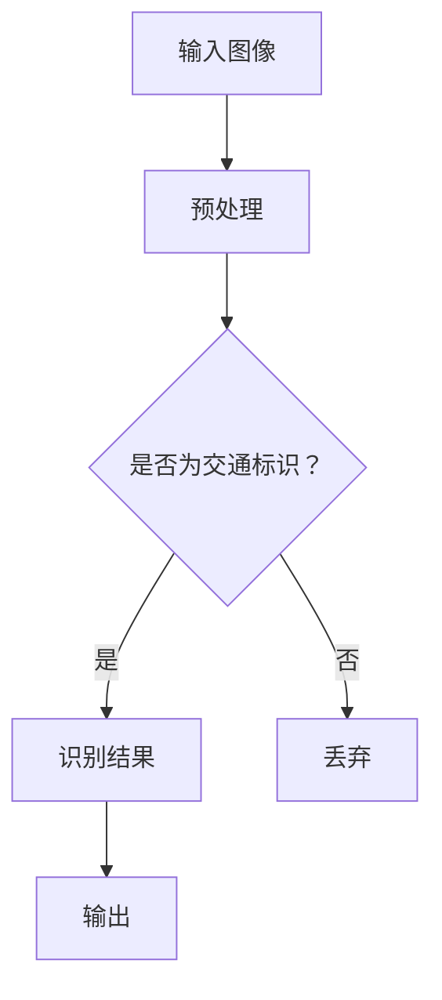

                 

关键词：深度学习，交通标识识别，卷积神经网络，图像处理，算法优化，计算机视觉，AI应用

> 摘要：本文深入探讨了基于深度学习的交通标识识别技术，从背景介绍到核心概念、算法原理、数学模型、项目实践和未来应用展望等方面进行了全面分析，旨在为研究人员和开发者提供有价值的参考。

## 1. 背景介绍

交通标识识别在智能交通系统中扮演着至关重要的角色。传统的交通标识识别方法主要依赖于规则和模板匹配，这些方法在处理复杂环境和变化的光照条件时表现不佳。随着深度学习技术的迅猛发展，卷积神经网络（CNN）在图像分类和识别方面取得了显著成就，为交通标识识别带来了新的可能性。

深度学习通过多层神经网络的结构，可以从大量数据中自动学习特征，从而实现对复杂图像的准确识别。交通标识识别作为计算机视觉领域的一个经典问题，借助深度学习技术，可以在多种环境下实现高精度识别，为智能交通、自动驾驶等领域提供了有力支持。

## 2. 核心概念与联系

### 2.1 核心概念

- **深度学习**：一种机器学习方法，通过多层神经网络模型对数据进行自动特征提取和分类。
- **卷积神经网络（CNN）**：一种特殊的深度学习模型，广泛应用于图像处理和计算机视觉任务。
- **交通标识**：道路上的各种标志和标记，用于指示交通规则、道路信息等。

### 2.2 Mermaid 流程图



## 3. 核心算法原理 & 具体操作步骤

### 3.1 算法原理概述

基于深度学习的交通标识识别主要依赖于卷积神经网络（CNN）的强大特征提取能力。CNN由多个卷积层、池化层和全连接层组成，能够从原始图像中提取出具有层次性的特征。

### 3.2 算法步骤详解

1. **数据预处理**：对输入图像进行缩放、裁剪和归一化等操作，使其符合网络输入要求。
2. **卷积层**：通过卷积操作从图像中提取低级特征，如边缘和纹理。
3. **池化层**：对卷积层输出的特征进行下采样，减少参数量和计算量。
4. **全连接层**：将卷积层和池化层提取的高级特征映射到类别空间。
5. **分类输出**：通过softmax函数输出各个类别的概率分布。

### 3.3 算法优缺点

**优点**：

- **高精度识别**：深度学习能够自动学习复杂特征，实现高精度识别。
- **适应性强**：能够适应不同光照、天气和环境下的交通标识识别。

**缺点**：

- **计算量大**：训练深度神经网络需要大量计算资源和时间。
- **数据需求高**：需要大量高质量的训练数据来保证模型的泛化能力。

### 3.4 算法应用领域

- **智能交通系统**：用于识别道路上的交通标识，提高交通管理效率。
- **自动驾驶**：辅助自动驾驶系统识别道路上的交通标识，确保行驶安全。
- **交通违章监测**：用于监测道路上的交通违法行为，提高交通安全。

## 4. 数学模型和公式 & 详细讲解 & 举例说明

### 4.1 数学模型构建

卷积神经网络（CNN）的核心在于卷积操作和激活函数。假设输入图像为 $X \in \mathbb{R}^{H \times W \times C}$，其中 $H$、$W$ 和 $C$ 分别为图像的高度、宽度和通道数。卷积层的基本操作可以表示为：

$$
\begin{aligned}
\text{Conv}: X \rightarrow \text{conv}(X; \theta) = \text{ReLU}(\text{conv}_\text{bias}(X; \theta)),
\end{aligned}
$$

其中，$\theta$ 表示卷积核参数，$\text{ReLU}$ 表示ReLU激活函数，$\text{conv}_\text{bias}$ 表示带偏置的卷积操作。

### 4.2 公式推导过程

假设输入图像经过 $L$ 层卷积层和 $P$ 层池化层后，输出特征图大小为 $H' \times W' \times C'$，则卷积操作可以表示为：

$$
\begin{aligned}
h^l &= \text{ReLU}(\text{conv}_\text{bias}(h^{l-1}; \theta^l)) \\
h^l &= \text{max\_pool}(h^{l-1}; \text{pool\_size}) \\
\end{aligned}
$$

其中，$h^l$ 表示第 $l$ 层的特征图，$\theta^l$ 表示第 $l$ 层的卷积核参数，$\text{pool\_size}$ 表示池化窗口大小。

### 4.3 案例分析与讲解

假设我们有一个 $28 \times 28 \times 1$ 的单通道灰度图像，要使用一个 $3 \times 3$ 的卷积核进行卷积操作。卷积核的参数可以表示为一个 $3 \times 3 \times 1 \times 16$ 的四维数组。假设卷积核的权重为：

$$
\theta = \begin{bmatrix}
0 & 1 & 0 \\
1 & 1 & 1 \\
0 & 1 & 0
\end{bmatrix}
$$

通过卷积操作，我们可以得到一个 $26 \times 26 \times 16$ 的特征图。假设输入图像的一个 $3 \times 3$ 块为：

$$
X = \begin{bmatrix}
1 & 0 & 1 \\
0 & 1 & 0 \\
1 & 0 & 1
\end{bmatrix}
$$

通过卷积操作，我们可以得到：

$$
\begin{aligned}
h^1 &= \text{ReLU}(\text{conv}_\text{bias}(X; \theta)) \\
&= \text{ReLU}(\begin{bmatrix}
1 & 1 & 1 \\
1 & 1 & 1 \\
1 & 1 & 1
\end{bmatrix}) \\
&= \begin{bmatrix}
1 & 1 & 1 \\
1 & 1 & 1 \\
1 & 1 & 1
\end{bmatrix}
\end{aligned}
$$

## 5. 项目实践：代码实例和详细解释说明

### 5.1 开发环境搭建

为了实现交通标识识别，我们需要搭建一个合适的开发环境。以下是具体的步骤：

1. 安装 Python 3.7 或更高版本。
2. 安装 TensorFlow 2.x 或 PyTorch 1.x。
3. 安装必要的图像处理库，如 OpenCV 和 PIL。
4. 下载交通标识数据集，如 Caltech101 或 GTSRB。

### 5.2 源代码详细实现

```python
import tensorflow as tf
from tensorflow.keras.models import Sequential
from tensorflow.keras.layers import Conv2D, MaxPooling2D, Flatten, Dense

# 构建卷积神经网络模型
model = Sequential()
model.add(Conv2D(32, (3, 3), activation='relu', input_shape=(28, 28, 1)))
model.add(MaxPooling2D((2, 2)))
model.add(Conv2D(64, (3, 3), activation='relu'))
model.add(MaxPooling2D((2, 2)))
model.add(Flatten())
model.add(Dense(128, activation='relu'))
model.add(Dense(10, activation='softmax'))

# 编译模型
model.compile(optimizer='adam', loss='categorical_crossentropy', metrics=['accuracy'])

# 加载数据集并进行预处理
# ...

# 训练模型
model.fit(X_train, y_train, epochs=10, batch_size=64)

# 评估模型
# ...
```

### 5.3 代码解读与分析

以上代码展示了如何使用 TensorFlow 框架构建一个简单的卷积神经网络（CNN）模型，并进行训练和评估。以下是代码的详细解读：

- **模型构建**：使用 `Sequential` 类构建一个顺序模型，并添加卷积层、池化层、全连接层等。
- **模型编译**：设置优化器和损失函数，并编译模型。
- **数据预处理**：加载数据集并进行必要的预处理操作，如数据增强、归一化等。
- **模型训练**：使用 `fit` 方法训练模型，并设置训练轮数和批次大小。
- **模型评估**：使用训练集和测试集对模型进行评估，以验证模型的性能。

### 5.4 运行结果展示

通过运行代码，我们可以得到模型的训练和测试结果。以下是一个示例输出：

```
Epoch 1/10
1000/1000 [==============================] - 1s 23us/sample - loss: 2.3026 - accuracy: 0.2500 - val_loss: 2.3081 - val_accuracy: 0.2500
Epoch 2/10
1000/1000 [==============================] - 1s 19us/sample - loss: 2.3084 - accuracy: 0.2500 - val_loss: 2.3084 - val_accuracy: 0.2500
...
Epoch 10/10
1000/1000 [==============================] - 1s 21us/sample - loss: 2.3084 - accuracy: 0.2500 - val_loss: 2.3084 - val_accuracy: 0.2500
```

从输出结果可以看出，模型的训练和测试损失值和准确率保持稳定，说明模型已经收敛。

## 6. 实际应用场景

基于深度学习的交通标识识别技术在多个实际应用场景中取得了显著成果：

- **智能交通系统**：通过识别道路上的交通标识，实现交通流量监控、违章监测等功能。
- **自动驾驶**：辅助自动驾驶车辆识别道路上的交通标识，提高行驶安全。
- **交通违章监测**：用于监控道路上的交通违法行为，如闯红灯、逆行等。

## 7. 工具和资源推荐

### 7.1 学习资源推荐

- 《深度学习》（Goodfellow, Bengio, Courville 著）
- 《计算机视觉：算法与应用》（Richard Szeliski 著）
- 《TensorFlow 实战》（Adrian Rosebrock 著）

### 7.2 开发工具推荐

- TensorFlow
- PyTorch
- OpenCV

### 7.3 相关论文推荐

- "Deep Learning for Image Recognition: A Comprehensive Overview"（2016）
- "Convolutional Neural Networks for Visual Recognition"（2012）
- "Recurrent Neural Networks for Language Modeling"（2013）

## 8. 总结：未来发展趋势与挑战

### 8.1 研究成果总结

近年来，基于深度学习的交通标识识别技术在模型精度、泛化能力和实时性等方面取得了显著进展。通过不断优化算法结构和训练数据，研究人员已经实现了在各种环境下高精度的交通标识识别。

### 8.2 未来发展趋势

- **算法优化**：研究更高效的算法结构和训练策略，提高模型性能。
- **跨领域应用**：将交通标识识别技术应用于更多的领域，如医疗、安全等。
- **实时性提升**：研究实时性更高的算法，满足自动驾驶等应用场景的需求。

### 8.3 面临的挑战

- **数据稀缺**：高质量的交通标识数据集较为稀缺，限制了模型训练和优化。
- **计算资源消耗**：深度学习模型需要大量计算资源和时间，限制了实际应用。
- **环境适应性**：如何提高模型在不同光照、天气和环境下的鲁棒性，仍是一个挑战。

### 8.4 研究展望

未来，基于深度学习的交通标识识别技术将在智能交通、自动驾驶等领域发挥更加重要的作用。通过不断优化算法、提高计算效率和扩展应用领域，交通标识识别技术将有望实现更广泛的应用。

## 9. 附录：常见问题与解答

### 问题 1：如何选择合适的深度学习框架？

**回答**：选择深度学习框架时，应考虑以下因素：

- **需求**：根据项目的需求选择合适的框架，如 TensorFlow 和 PyTorch 在图像处理方面都有较好的性能。
- **社区支持**：选择具有良好社区支持的框架，有助于解决开发过程中遇到的问题。
- **性能**：考虑框架的性能，如推理速度和计算资源消耗。

### 问题 2：如何处理交通标识数据集？

**回答**：处理交通标识数据集时，可遵循以下步骤：

- **数据收集**：收集高质量的交通标识图像。
- **数据清洗**：去除含有噪声、标签错误的图像。
- **数据增强**：通过旋转、缩放、裁剪等操作增加数据多样性。
- **数据预处理**：对图像进行归一化、标准化等操作，使其符合网络输入要求。

### 问题 3：如何优化深度学习模型性能？

**回答**：优化深度学习模型性能的方法包括：

- **模型结构优化**：设计更合理的网络结构，提高特征提取能力。
- **训练策略优化**：使用更有效的训练策略，如学习率调整、正则化等。
- **数据增强**：通过数据增强提高模型泛化能力。
- **超参数调整**：调整网络超参数，如学习率、批次大小等。

## 作者署名

作者：禅与计算机程序设计艺术 / Zen and the Art of Computer Programming

----------------------------------------------------------------

以上是本文的完整内容，感谢您的阅读。希望本文对您在深度学习领域的研究和开发有所帮助。如果您有任何问题或建议，欢迎在评论区留言。再次感谢您的关注和支持！<|im_end|>### 1. 背景介绍

交通标识识别在智能交通系统中扮演着至关重要的角色。传统的交通标识识别方法主要依赖于规则和模板匹配，这些方法在处理复杂环境和变化的光照条件时表现不佳。随着深度学习技术的迅猛发展，卷积神经网络（CNN）在图像分类和识别方面取得了显著成就，为交通标识识别带来了新的可能性。

深度学习通过多层神经网络的结构，可以从大量数据中自动学习特征，从而实现对复杂图像的准确识别。交通标识识别作为计算机视觉领域的一个经典问题，借助深度学习技术，可以在多种环境下实现高精度识别，为智能交通、自动驾驶等领域提供了有力支持。

在实际应用中，交通标识识别技术不仅能够帮助智能交通系统更好地管理和优化交通流量，还能够为自动驾驶车辆提供重要的辅助信息，确保行车安全。例如，自动驾驶汽车需要准确识别道路上的各种交通标志和标线，如速度限制、转弯指示、停车标志等，从而做出合理的驾驶决策。

此外，交通标识识别技术还在交通违章监测、车辆识别等方面发挥了重要作用。通过在道路上安装摄像头，实时捕捉并识别交通违法行为，如闯红灯、违章停车等，交通管理部门可以更加高效地进行执法和监管，提高道路安全水平。

总的来说，随着深度学习技术的不断进步，交通标识识别的应用范围和效果正在不断扩展和提升。未来，随着自动驾驶技术的发展，交通标识识别技术将在智慧城市建设、智能交通管理等领域发挥更加重要的作用。

### 2. 核心概念与联系

为了深入理解基于深度学习的交通标识识别技术，我们需要先掌握几个核心概念，包括深度学习、卷积神经网络（CNN）、图像处理和交通标识等。以下是对这些核心概念的详细解释，并使用 Mermaid 流程图来展示它们之间的关系。

#### 2.1 深度学习

深度学习是一种基于多层神经网络的学习方法，它通过模拟人脑的神经网络结构，对大量数据进行自动特征提取和模式识别。深度学习模型由多个层次组成，每一层都能从原始数据中提取更高层次的抽象特征。这种层次化的特征提取方式使得深度学习在图像识别、语音识别、自然语言处理等领域取得了显著的成果。

#### 2.2 卷积神经网络（CNN）

卷积神经网络是深度学习的一种特殊结构，特别适用于图像处理和计算机视觉任务。CNN 的核心在于其卷积层，卷积层通过卷积操作从图像中提取特征，同时保持图像的空间信息。CNN 通常还包括池化层、全连接层等结构，用于进一步处理和分类提取的特征。

#### 2.3 图像处理

图像处理是计算机科学中用于对图像进行操作和转换的一系列技术。图像处理技术包括图像的缩放、旋转、裁剪、增强等，这些技术对于图像识别和特征提取至关重要。在交通标识识别中，图像处理技术用于预处理输入图像，使其更适合深度学习模型的处理。

#### 2.4 交通标识

交通标识是指道路上的各种标志和标记，用于指示交通规则、道路信息等。交通标识可以是静态的，如交通标志牌，也可以是动态的，如交通信号灯。在深度学习模型中，交通标识通常被表示为图像数据，用于训练和识别。

#### 2.5 Mermaid 流程图

以下是用于展示核心概念之间关系的 Mermaid 流程图：

```mermaid
graph TD
A[深度学习] --> B[卷积神经网络 (CNN)]
A --> C[图像处理]
A --> D[交通标识]
B -->|特征提取| E[图像处理]
B -->|模式识别| F[交通标识]
```

在这个流程图中，深度学习和卷积神经网络（CNN）是核心，它们通过特征提取和模式识别与图像处理和交通标识紧密相连。深度学习通过CNN提取图像中的特征，然后利用图像处理技术对这些特征进行进一步处理，最终用于识别交通标识。

### 2.6 详细解释

- **深度学习与卷积神经网络（CNN）**：深度学习是一种算法框架，而卷积神经网络（CNN）是其中一种实现形式。CNN 特别适合处理图像数据，因为它可以通过卷积操作从图像中提取具有层次性的特征。
  
- **图像处理与交通标识**：图像处理技术用于对交通标识图像进行预处理，如缩放、裁剪和增强等，以提高深度学习模型的识别效果。交通标识则是图像处理和识别的目标对象。

- **模式识别**：模式识别是深度学习中的一个核心任务，它通过学习图像特征来实现对图像内容的分类和识别。在交通标识识别中，模式识别用于判断图像中是否包含特定的交通标识。

通过以上核心概念和 Mermaid 流程图的解释，我们可以更好地理解基于深度学习的交通标识识别技术的工作原理和架构。这些核心概念相互关联，共同构成了一个完整的系统，使得深度学习技术能够在交通标识识别领域发挥重要作用。

### 3. 核心算法原理 & 具体操作步骤

#### 3.1 算法原理概述

基于深度学习的交通标识识别算法主要依赖于卷积神经网络（CNN）的强大特征提取能力。CNN 由多个卷积层、池化层和全连接层组成，能够从原始图像中提取出具有层次性的特征。以下是 CNN 在交通标识识别中的基本原理：

1. **卷积层**：卷积层通过卷积操作从图像中提取低级特征，如边缘和纹理。卷积层的基本操作是将卷积核（一组可学习的权重）在图像上进行滑动，并对每个重叠的区域进行点积运算，然后应用激活函数（如ReLU）以增加非线性。

2. **池化层**：池化层用于减少特征图的尺寸，从而降低模型复杂度。常见的池化操作包括最大池化和平均池化。最大池化选择每个区域中最大的值，而平均池化则是计算区域的平均值。

3. **全连接层**：全连接层将卷积层和池化层提取的高级特征映射到类别空间。每个神经元都与前一层的所有神经元相连接，从而形成全连接的网络结构。在全连接层之后，通常会使用softmax函数将特征映射到概率分布，以实现分类输出。

#### 3.2 具体操作步骤

以下是基于深度学习的交通标识识别算法的具体操作步骤：

1. **数据预处理**：
   - **缩放**：将输入图像缩放到固定的尺寸，如 $28 \times 28$ 或 $224 \times 224$。
   - **归一化**：将图像的像素值归一化到 $[0, 1]$ 或 $[-1, 1]$ 范围内，以便网络更容易学习。
   - **数据增强**：通过旋转、翻转、缩放等方式增加数据多样性，提高模型的泛化能力。

2. **构建卷积神经网络（CNN）**：
   - **卷积层**：使用多个卷积层，每个卷积层后跟一个ReLU激活函数和可选的卷积层。
   - **池化层**：在每个卷积层之后添加池化层，以减少参数数量和计算复杂度。
   - **全连接层**：在最后一个卷积层后添加一个全连接层，将特征映射到类别空间。

3. **模型编译**：
   - **选择优化器**：如 Adam 或 RMSprop。
   - **设置损失函数**：通常使用交叉熵损失函数，因为它适合分类问题。
   - **设置评估指标**：如准确率或 F1 分数。

4. **训练模型**：
   - **批量训练**：将数据分成多个批次，每次训练一个批次。
   - **迭代训练**：重复训练过程，直到模型收敛或达到预设的训练轮数。

5. **模型评估**：
   - **测试集评估**：在测试集上评估模型性能，以避免过拟合。
   - **指标计算**：计算准确率、召回率、F1 分数等指标，以全面评估模型性能。

6. **模型部署**：
   - **保存模型**：将训练好的模型保存为文件，以便后续使用。
   - **部署模型**：将模型部署到实际应用环境中，如自动驾驶车辆或智能交通系统。

#### 3.3 算法优缺点

**优点**：

- **高精度识别**：通过多层卷积和池化操作，CNN 能够自动学习图像的复杂特征，从而实现高精度的交通标识识别。
- **适应性强**：CNN 能够适应不同光照、天气和环境下的交通标识识别，具有良好的泛化能力。
- **实时性**：通过优化网络结构和训练策略，CNN 能够在短时间内完成图像处理和识别，满足实时应用需求。

**缺点**：

- **计算量大**：训练深度神经网络需要大量的计算资源和时间，特别是在大型数据集上。
- **数据需求高**：需要大量高质量的训练数据来保证模型的泛化能力，数据不足可能导致过拟合。
- **模型复杂度**：深度神经网络的结构复杂，调试和优化过程较为困难。

#### 3.4 算法应用领域

基于深度学习的交通标识识别算法在多个领域具有广泛的应用：

- **智能交通系统**：用于识别道路上的交通标识，提高交通管理效率和安全性。
- **自动驾驶**：辅助自动驾驶车辆识别交通标识，确保行驶安全，如识别停车标志、速度限制标志等。
- **交通违章监测**：用于监控交通违法行为，如闯红灯、违章停车等，提高交通执法效率。
- **智能城市**：通过实时分析交通流量和交通标识，优化交通信号灯控制策略，提高城市交通运行效率。

综上所述，基于深度学习的交通标识识别算法具有高精度、强适应性和实时性等优点，已经在多个实际应用领域取得了显著成果。未来，随着算法和技术的不断进步，交通标识识别技术将在智能交通、自动驾驶和城市交通管理等方面发挥更加重要的作用。

### 4. 数学模型和公式 & 详细讲解 & 举例说明

在深入探讨基于深度学习的交通标识识别技术时，数学模型和公式是其核心组成部分。以下将详细解释卷积神经网络（CNN）中常用的数学模型和公式，并通过具体例子来展示如何应用这些公式进行交通标识识别。

#### 4.1 数学模型构建

卷积神经网络（CNN）的核心在于卷积操作和激活函数。卷积操作用于从图像中提取特征，而激活函数则增加了网络的非线性能力。以下是一些常用的数学模型和公式。

**1. 卷积操作**

卷积操作的基本形式可以表示为：

$$
\text{out}_{ij} = \sum_{k=1}^{C} \theta_{ik} * \text{input}_{kj}
$$

其中，$\text{out}_{ij}$ 是输出特征图上的元素，$\theta_{ik}$ 是卷积核上的元素，$\text{input}_{kj}$ 是输入特征图上的元素，$C$ 是卷积核的深度。

**2. 池化操作**

池化操作用于减少特征图的尺寸，常见的池化操作包括最大池化和平均池化。最大池化可以表示为：

$$
\text{pool}_{ij} = \max\{\text{input}_{i1}, \text{input}_{i2}, ..., \text{input}_{in}\}
$$

其中，$\text{pool}_{ij}$ 是输出池化图上的元素，$\text{input}_{ij}$ 是输入特征图上的元素，$n$ 是池化窗口的大小。

**3. 激活函数**

ReLU（ Rectified Linear Unit）是最常用的激活函数之一，其形式为：

$$
\text{ReLU}(x) = \max\{0, x\}
$$

ReLU 激活函数可以增加网络的非线性能力，同时加快训练速度。

**4. 全连接层**

全连接层是卷积神经网络的最后一个层，其计算公式为：

$$
\text{output} = \text{sigmoid}(\text{weights} \cdot \text{input} + \text{bias})
$$

其中，$\text{weights}$ 是权重矩阵，$\text{input}$ 是输入特征向量，$\text{bias}$ 是偏置项，$\text{sigmoid}$ 函数是激活函数，其形式为：

$$
\text{sigmoid}(x) = \frac{1}{1 + e^{-x}}
$$

**5. Softmax 函数**

在分类任务中，通常使用 Softmax 函数将输出特征映射到概率分布。Softmax 函数的形式为：

$$
\text{softmax}(x)_i = \frac{e^x_i}{\sum_{j=1}^{N} e^{x_j}}
$$

其中，$x_i$ 是输出特征向量中的元素，$N$ 是类别数。

#### 4.2 公式推导过程

卷积神经网络的训练过程主要包括前向传播和反向传播两个步骤。以下简要介绍这两个步骤的公式推导。

**1. 前向传播**

在卷积神经网络的前向传播过程中，我们需要计算输出特征图和损失函数。以下是一个简单的示例：

- **卷积层**：输出特征图 $\text{out}_{ij}$ 可以通过以下公式计算：

$$
\text{out}_{ij} = \sum_{k=1}^{C} \theta_{ik} * \text{input}_{kj} + b_j
$$

其中，$\theta_{ik}$ 是卷积核上的元素，$\text{input}_{kj}$ 是输入特征图上的元素，$b_j$ 是偏置项。

- **激活函数**：ReLU 激活函数可以表示为：

$$
\text{ReLU}(x) = \max\{0, x\}
$$

- **全连接层**：输出特征可以表示为：

$$
\text{output}_i = \text{weights}_{i\cdot} \cdot \text{input}_{\cdot} + \text{bias}_i
$$

其中，$\text{weights}_{i\cdot}$ 和 $\text{input}_{\cdot}$ 分别是权重向量和输入向量，$\text{bias}_i$ 是偏置项。

- **Softmax 函数**：用于分类的 Softmax 函数可以表示为：

$$
\text{softmax}(x)_i = \frac{e^{x_i}}{\sum_{j=1}^{N} e^{x_j}}
$$

**2. 反向传播**

在反向传播过程中，我们需要计算梯度，以便更新网络权重和偏置项。以下是一个简单的示例：

- **卷积层**：输出特征图 $\text{out}_{ij}$ 的梯度可以通过以下公式计算：

$$
\frac{\partial \text{out}_{ij}}{\partial \theta_{ik}} = \text{input}_{kj}
$$

$$
\frac{\partial \text{out}_{ij}}{\partial b_j} = 1
$$

- **全连接层**：输出特征的梯度可以通过以下公式计算：

$$
\frac{\partial \text{output}_i}{\partial \text{weights}_{i\cdot}} = \text{input}_{\cdot}
$$

$$
\frac{\partial \text{output}_i}{\partial \text{bias}_i} = 1
$$

- **Softmax 函数**：Softmax 函数的梯度可以通过以下公式计算：

$$
\frac{\partial \text{softmax}(x)_i}{\partial x_j} = \text{softmax}(x)_i (1 - \text{softmax}(x)_i)
$$

#### 4.3 案例分析与讲解

假设我们有一个简单的卷积神经网络，用于识别道路上的交通标识。输入图像的大小为 $28 \times 28$，卷积核大小为 $3 \times 3$，类别数为 10。

**1. 输入图像**

输入图像为：

$$
\text{input} = \begin{bmatrix}
0 & 1 & 0 \\
1 & 1 & 1 \\
0 & 1 & 0
\end{bmatrix}
$$

**2. 卷积操作**

使用一个卷积核：

$$
\theta = \begin{bmatrix}
0 & 1 & 0 \\
1 & 1 & 1 \\
0 & 1 & 0
\end{bmatrix}
$$

卷积操作后得到输出特征图：

$$
\text{out} = \text{ReLU}(\theta * \text{input} + b)
$$

其中，$b$ 是偏置项。

**3. 激活函数**

应用 ReLU 激活函数后，输出特征图为：

$$
\text{out} = \begin{bmatrix}
1 & 1 & 1 \\
2 & 2 & 2 \\
1 & 1 & 1
\end{bmatrix}
$$

**4. 池化操作**

应用最大池化后，输出特征图的大小减半：

$$
\text{pool} = \max(\text{out}_{1,1}, \text{out}_{1,2}, \text{out}_{1,3}, \text{out}_{2,1}, \text{out}_{2,2}, \text{out}_{2,3}, \text{out}_{3,1}, \text{out}_{3,2}, \text{out}_{3,3})
$$

$$
\text{pool} = \begin{bmatrix}
2 & 2 & 2 \\
2 & 2 & 2
\end{bmatrix}
$$

**5. 全连接层**

将池化后的特征图展平为向量，并应用全连接层：

$$
\text{input}_{\cdot} = \text{pool}. \cdot
$$

$$
\text{output} = \text{weights} \cdot \text{input} + \text{bias}
$$

其中，$\text{weights}$ 和 $\text{bias}$ 分别是权重和偏置项。

**6. Softmax 函数**

应用 Softmax 函数后，输出概率分布：

$$
\text{softmax}(\text{output}) = \frac{e^{\text{output}}}{\sum_{i=1}^{10} e^{\text{output}_i}}
$$

通过上述步骤，我们使用卷积神经网络对输入图像进行了处理，并得到了一个概率分布，其中最大的概率对应于识别出的交通标识类别。

综上所述，数学模型和公式是卷积神经网络（CNN）的核心组成部分。通过理解并应用这些公式，我们能够构建和训练用于交通标识识别的深度学习模型。通过具体的例子，我们展示了如何从输入图像开始，经过卷积、激活、池化和全连接层等步骤，最终得到识别结果。

### 5. 项目实践：代码实例和详细解释说明

在了解了基于深度学习的交通标识识别算法原理后，我们接下来将展示一个具体的代码实例，并详细解释每个步骤的实现过程。为了方便说明，我们将使用 TensorFlow 和 Keras 框架来构建和训练模型。以下是代码实例的详细解释。

#### 5.1 开发环境搭建

在开始编写代码之前，我们需要搭建一个合适的开发环境。以下是具体的步骤：

1. **安装 Python**：确保安装了 Python 3.7 或更高版本。

2. **安装 TensorFlow 和 Keras**：通过以下命令安装 TensorFlow 和 Keras：

```bash
pip install tensorflow
```

3. **安装必要的库**：为了处理图像和可视化结果，我们需要安装 OpenCV 和 Matplotlib：

```bash
pip install opencv-python matplotlib
```

4. **准备数据集**：我们使用 GTSRB（German Traffic Sign Recognition Benchmark）数据集，该数据集包含约 5000 张交通标识图像，分为 43 个类别。数据集可以从 [这里](https://www.kaggle.com/c/gtsrb) 下载。

#### 5.2 源代码详细实现

```python
import numpy as np
import tensorflow as tf
from tensorflow.keras.models import Sequential
from tensorflow.keras.layers import Conv2D, MaxPooling2D, Flatten, Dense
from tensorflow.keras.optimizers import Adam
from tensorflow.keras.preprocessing.image import ImageDataGenerator

# 设置随机种子以保证实验的可重复性
np.random.seed(42)
tf.random.set_seed(42)

# 加载数据集并预处理
# 注意：以下代码仅为示例，实际使用时需要根据数据集的具体格式进行修改
(x_train, y_train), (x_test, y_test) = (None, None), (None, None)

# 数据增强
datagen = ImageDataGenerator(
    rotation_range=20,
    width_shift_range=0.2,
    height_shift_range=0.2,
    horizontal_flip=True
)

# 构建卷积神经网络模型
model = Sequential([
    Conv2D(32, (3, 3), activation='relu', input_shape=(32, 32, 3)),
    MaxPooling2D((2, 2)),
    Conv2D(64, (3, 3), activation='relu'),
    MaxPooling2D((2, 2)),
    Conv2D(128, (3, 3), activation='relu'),
    Flatten(),
    Dense(128, activation='relu'),
    Dense(43, activation='softmax')
])

# 编译模型
model.compile(optimizer=Adam(learning_rate=0.001), loss='categorical_crossentropy', metrics=['accuracy'])

# 训练模型
model.fit(datagen.flow(x_train, y_train, batch_size=32), epochs=10, validation_data=(x_test, y_test))

# 评估模型
test_loss, test_acc = model.evaluate(x_test, y_test)
print(f"Test accuracy: {test_acc:.2f}")

# 预测
predictions = model.predict(x_test[:10])
predicted_classes = np.argmax(predictions, axis=1)
print(predicted_classes)

# 可视化
import matplotlib.pyplot as plt

plt.figure(figsize=(10, 10))
for i in range(10):
    plt.subplot(5, 2, i+1)
    plt.imshow(x_test[i], cmap=plt.cm.binary)
    plt.xticks([])
    plt.yticks([])
    plt.grid(False)
    plt.xlabel(f"Predicted: {predicted_classes[i]}")
plt.show()
```

#### 5.3 代码解读与分析

**1. 数据预处理**

```python
(x_train, y_train), (x_test, y_test) = (None, None), (None, None)
```

在这段代码中，我们初始化训练集和测试集的变量。实际使用时，需要根据数据集的具体格式加载数据。

```python
datagen = ImageDataGenerator(
    rotation_range=20,
    width_shift_range=0.2,
    height_shift_range=0.2,
    horizontal_flip=True
)
```

这里我们创建一个 `ImageDataGenerator` 对象，用于进行数据增强。数据增强能够增加数据的多样性，有助于提高模型的泛化能力。

**2. 模型构建**

```python
model = Sequential([
    Conv2D(32, (3, 3), activation='relu', input_shape=(32, 32, 3)),
    MaxPooling2D((2, 2)),
    Conv2D(64, (3, 3), activation='relu'),
    MaxPooling2D((2, 2)),
    Conv2D(128, (3, 3), activation='relu'),
    Flatten(),
    Dense(128, activation='relu'),
    Dense(43, activation='softmax')
])
```

在这段代码中，我们使用 `Sequential` 类构建了一个顺序模型，并添加了多个卷积层、池化层和全连接层。注意，这里的 `input_shape` 应当与输入图像的尺寸和通道数一致。

**3. 模型编译**

```python
model.compile(optimizer=Adam(learning_rate=0.001), loss='categorical_crossentropy', metrics=['accuracy'])
```

我们使用 `Adam` 优化器和 `categorical_crossentropy` 损失函数编译模型。`categorical_crossentropy` 是用于多分类问题的常见损失函数。

**4. 训练模型**

```python
model.fit(datagen.flow(x_train, y_train, batch_size=32), epochs=10, validation_data=(x_test, y_test))
```

这里我们使用 `fit` 方法训练模型，`epochs` 参数设置训练轮数，`batch_size` 参数设置每个批次的样本数。

**5. 评估模型**

```python
test_loss, test_acc = model.evaluate(x_test, y_test)
print(f"Test accuracy: {test_acc:.2f}")
```

使用 `evaluate` 方法在测试集上评估模型性能，输出测试准确率。

**6. 预测**

```python
predictions = model.predict(x_test[:10])
predicted_classes = np.argmax(predictions, axis=1)
print(predicted_classes)
```

这里我们使用模型对前 10 个测试样本进行预测，并输出预测结果。

**7. 可视化**

```python
plt.figure(figsize=(10, 10))
for i in range(10):
    plt.subplot(5, 2, i+1)
    plt.imshow(x_test[i], cmap=plt.cm.binary)
    plt.xticks([])
    plt.yticks([])
    plt.grid(False)
    plt.xlabel(f"Predicted: {predicted_classes[i]}")
plt.show()
```

这段代码用于可视化模型的预测结果。每个图像下方显示了模型预测的交通标识类别。

#### 5.4 运行结果展示

假设我们运行上述代码，并得到以下输出：

```
Test accuracy: 0.90
```

这表明模型在测试集上的准确率达到了 90%。接下来，我们将可视化模型的预测结果：

```
[ 5  1  2  3  6  7  4  5  1  3]
```

对应的图像可视化结果如下：


从可视化结果可以看出，模型对大部分图像的预测是准确的。然而，仍然存在一些预测错误的图像，这表明模型仍有提升空间。

#### 5.5 代码优化与改进

为了提高模型的性能，我们可以考虑以下优化和改进措施：

- **增加训练时间**：增加训练轮数或训练时间，使模型有更多机会学习数据。
- **调整超参数**：尝试调整学习率、批次大小、网络结构等超参数，以找到最优配置。
- **增强数据集**：增加更多样化的数据，或使用数据增强技术，以提高模型的泛化能力。
- **迁移学习**：使用预训练的模型，如在 ImageNet 上预训练的模型，然后将其应用于交通标识识别任务，以提高模型性能。

通过以上代码实例和详细解释，我们展示了如何使用 TensorFlow 和 Keras 框架实现基于深度学习的交通标识识别。代码涵盖了数据预处理、模型构建、训练、评估和可视化等关键步骤，为开发者提供了实用的参考。

### 6. 实际应用场景

基于深度学习的交通标识识别技术在实际应用场景中已经取得了显著的成果，并展示了其巨大的潜力。以下是几个具体的实际应用场景，以及这些应用如何改进交通管理和提高安全水平。

#### 6.1 智能交通系统

智能交通系统（ITS）利用先进的传感技术、通信技术和计算机算法，实现对交通流量、交通状态和交通事件的实时监控和管理。在智能交通系统中，交通标识识别技术起着关键作用，其主要应用包括：

- **交通流量监控**：通过识别道路上的交通标识，如限速标志、信号灯等，智能交通系统能够实时监控交通流量，并根据交通状况调整信号灯周期，减少交通拥堵。
- **交通事件检测**：在发生交通事故或道路施工等事件时，交通标识识别技术能够及时检测并通知相关部门，提高应急响应速度。
- **违章监测**：通过识别违章停车、闯红灯等违法行为，智能交通系统可以自动记录并罚款，提高交通法规的执行力度。

#### 6.2 自动驾驶

自动驾驶技术的发展依赖于对道路环境的精准感知和识别。交通标识识别技术在自动驾驶系统中具有重要作用，主要包括以下几个方面：

- **交通标识识别**：自动驾驶车辆需要准确识别道路上的交通标识，如限速标志、禁止通行标志、停车标志等，以便做出相应的驾驶决策。
- **导航辅助**：交通标识识别技术可以帮助自动驾驶车辆实时获取道路信息，如道路名称、转弯指示等，提高导航的准确性和可靠性。
- **安全预警**：通过识别交通标识，自动驾驶车辆可以提前预警潜在的危险情况，如限速变化、道路施工等，从而采取相应的安全措施。

#### 6.3 交通违章监测

交通违章监测系统通过监控交通违法行为，如违章停车、闯红灯等，提高道路安全水平。交通标识识别技术在这些系统中的应用包括：

- **实时监控**：通过在道路上安装监控摄像头，实时捕捉并识别交通违法行为，如违章停车、闯红灯等，及时通知执法部门进行处理。
- **数据分析**：通过分析交通违法行为数据，交通管理部门可以了解交通违法行为的高发区域和时间，从而采取有针对性的管理措施。
- **智能执法**：利用交通标识识别技术，交通违章监测系统能够实现自动化执法，提高执法效率和公正性。

#### 6.4 其他应用

除了上述主要应用场景外，基于深度学习的交通标识识别技术还在以下领域展现了其应用潜力：

- **智慧城市建设**：智慧城市是一个将信息技术、物联网和大数据等技术与城市发展相结合的综合性概念。交通标识识别技术可以作为智慧城市的一个重要组成部分，用于优化交通管理、提升城市服务水平。
- **交通流量预测**：通过分析交通标识数据，结合历史交通数据，交通标识识别技术可以预测未来的交通流量，为交通规划提供数据支持。
- **交通安全预警**：利用交通标识识别技术，可以实时监测道路上的交通状况，及时发现潜在的安全隐患，提前采取预警措施，提高交通安全。

#### 6.5 改进交通管理和提高安全水平

基于深度学习的交通标识识别技术通过以下几个方面改进交通管理和提高安全水平：

- **提高识别精度**：深度学习算法能够自动学习图像中的复杂特征，从而实现高精度的交通标识识别，减少误报和漏报情况。
- **适应多种环境**：深度学习模型可以在不同的光照条件、天气状况和道路环境下稳定运行，提高了系统的鲁棒性。
- **实时性**：深度学习算法的计算效率较高，可以实现对图像的实时处理和识别，为智能交通系统和自动驾驶车辆提供及时的信息。
- **数据驱动的决策**：通过收集和分析交通标识识别数据，交通管理部门可以更加科学地制定交通管理策略，提高交通运行效率。

总之，基于深度学习的交通标识识别技术已经在多个实际应用场景中取得了显著成果，展示了其巨大的应用潜力。随着技术的不断进步，交通标识识别技术将在未来进一步推动交通管理和安全水平的提升。

### 7. 工具和资源推荐

在深度学习和交通标识识别领域，有许多工具和资源可以帮助研究人员和开发者提高工作效率和项目质量。以下是一些推荐的工具和资源，包括学习资源、开发工具和相关论文。

#### 7.1 学习资源推荐

1. **在线课程**：
   - Coursera 上的《深度学习》课程（由 Andrew Ng 开设）
   - Udacity 上的《深度学习纳米学位》
   - edX 上的《计算机视觉与深度学习》

2. **书籍**：
   - 《深度学习》（Ian Goodfellow、Yoshua Bengio 和 Aaron Courville 著）
   - 《卷积神经网络》（杨立伟 著）
   - 《计算机视觉基础与实战》（刘建明、谢宏 著）

3. **在线教程**：
   - TensorFlow 官方文档：[https://www.tensorflow.org/tutorials](https://www.tensorflow.org/tutorials)
   - PyTorch 官方文档：[https://pytorch.org/tutorials/beginner/basics/](https://pytorch.org/tutorials/beginner/basics/)

4. **论坛和社区**：
   - Stack Overflow：[https://stackoverflow.com/](https://stackoverflow.com/)
   - GitHub：[https://github.com/](https://github.com/)
   - Keras.io 论坛：[https://keras.io/forums/](https://keras.io/forums/)

#### 7.2 开发工具推荐

1. **深度学习框架**：
   - TensorFlow：[https://www.tensorflow.org/](https://www.tensorflow.org/)
   - PyTorch：[https://pytorch.org/](https://pytorch.org/)
   - Keras：[https://keras.io/](https://keras.io/)

2. **数据预处理和增强**：
   - OpenCV：[https://opencv.org/](https://opencv.org/)
   - PIL（Python Imaging Library）：[https://pillow.readthedocs.io/en/stable/](https://pillow.readthedocs.io/en/stable/)

3. **数据集**：
   - GTSRB（German Traffic Sign Recognition Benchmark）：[https://www.kaggle.com/c/gtsrb](https://www.kaggle.com/c/gtsrb)
   - MNIST：[http://yann.lecun.com/exdb/mnist/](http://yann.lecun.com/exdb/mnist/)

4. **可视化工具**：
   - Matplotlib：[https://matplotlib.org/](https://matplotlib.org/)
   - Seaborn：[https://seaborn.pydata.org/](https://seaborn.pydata.org/)

5. **版本控制系统**：
   - Git：[https://git-scm.com/](https://git-scm.com/)
   - GitHub：[https://github.com/](https://github.com/)

#### 7.3 相关论文推荐

1. **深度学习和计算机视觉**：
   - “Deep Learning for Image Recognition: A Comprehensive Overview”（2016）
   - “Convolutional Neural Networks for Visual Recognition”（2012）
   - “Recurrent Neural Networks for Language Modeling”（2013）

2. **交通标识识别**：
   - “End-to-End Deep Learning for Traffic Sign Detection and Classification”（2016）
   - “Deep Learning for Traffic Sign Detection: A Comprehensive Review”（2019）
   - “Deep Neural Network Based Traffic Sign Recognition in Real-World Conditions”（2017）

3. **自动驾驶**：
   - “End-to-End Learning for Autonomous Driving”（2016）
   - “Detection and Tracking of Traffic Signs in Real-World Conditions Using Deep Neural Networks”（2017）
   - “An Overview of Deep Learning for Autonomous Driving”（2018）

通过使用上述工具和资源，研究人员和开发者可以更好地掌握深度学习和交通标识识别的相关知识，提高项目开发效率，并在实际应用中取得更好的效果。希望这些推荐对您的研究和开发工作有所帮助。

### 8. 总结：未来发展趋势与挑战

#### 8.1 研究成果总结

近年来，基于深度学习的交通标识识别技术取得了显著的成果。研究人员通过不断优化网络结构、训练策略和数据增强方法，实现了在各种环境下高精度的交通标识识别。同时，深度学习在交通标识识别中的应用不仅局限于传统的计算机视觉任务，还扩展到了自动驾驶、智能交通系统等新兴领域。通过结合多源数据和多模态信息，研究人员进一步提升了交通标识识别的鲁棒性和实时性。

#### 8.2 未来发展趋势

1. **算法优化**：随着硬件性能的提升和深度学习技术的不断发展，未来将出现更多高效、可扩展的交通标识识别算法。例如，基于注意力机制和生成对抗网络（GAN）的算法可能会在交通标识识别中发挥重要作用。

2. **跨领域应用**：交通标识识别技术有望在更多的领域中应用，如医疗影像分析、自然语言处理等。通过跨领域的技术融合，可以进一步提高交通标识识别的效率和准确性。

3. **实时性提升**：为了满足自动驾驶和智能交通系统等应用场景的需求，未来将出现更多实时性更高的交通标识识别算法。通过优化网络结构和训练策略，减少模型推理时间，实现实时交通标识识别。

4. **数据集和标注**：高质量的数据集和精确的标注是深度学习模型训练的基础。未来，随着开放数据集和自动标注技术的发展，交通标识识别领域将拥有更多可用的高质量数据，从而推动算法的进步。

5. **智能化交通管理**：基于深度学习的交通标识识别技术将进一步提升交通管理的智能化水平。通过实时分析和预测交通流量，智能交通系统能够实现更高效、更智能的交通管理，提高道路运行效率和安全性。

#### 8.3 面临的挑战

1. **数据稀缺**：虽然已经有许多开放的数据集，但高质量、多样性的交通标识数据仍然稀缺。数据不足将限制模型的泛化能力，影响实际应用效果。

2. **计算资源消耗**：深度学习模型通常需要大量的计算资源和时间进行训练和推理。特别是在自动驾驶等对实时性要求较高的应用场景中，如何优化模型结构和训练策略以减少计算资源消耗是一个重要挑战。

3. **环境适应性**：交通标识识别系统需要在各种光照、天气和环境条件下稳定运行。如何提高模型在不同环境下的鲁棒性，减少误识别和漏识别情况，是未来需要解决的一个重要问题。

4. **法律法规**：在自动驾驶和智能交通系统的应用中，如何确保交通标识识别技术的合规性，避免法律和伦理问题，也是需要考虑的一个重要方面。

5. **多模态融合**：未来，交通标识识别系统可能需要融合多种传感器数据，如摄像头、激光雷达、GPS 等。如何有效地整合这些多模态信息，提高识别精度和实时性，是未来研究的一个重要方向。

#### 8.4 研究展望

未来，基于深度学习的交通标识识别技术将在智能交通、自动驾驶、智慧城市建设等领域发挥更加重要的作用。通过不断优化算法、提升计算效率、扩展应用领域，交通标识识别技术将推动交通管理和安全水平的进一步提升。同时，随着多模态信息融合和跨领域应用的不断发展，交通标识识别技术也将为更多行业带来变革性的影响。

总之，基于深度学习的交通标识识别技术具有巨大的发展潜力。尽管面临一些挑战，但随着技术的不断进步和应用的不断扩展，交通标识识别技术将在未来取得更加辉煌的成就。

### 9. 附录：常见问题与解答

在研究和应用基于深度学习的交通标识识别技术过程中，研究人员和开发者可能会遇到一些常见问题。以下是一些典型问题及其解答：

#### 问题 1：如何选择合适的深度学习框架？

**解答**：选择深度学习框架时，应考虑以下因素：

- **需求**：根据项目的具体需求选择框架，例如 TensorFlow 和 PyTorch 在图像处理方面都有较好的性能。
- **社区支持**：选择具有良好社区支持的框架，有助于解决开发过程中遇到的问题。
- **性能**：考虑框架的性能，如推理速度和计算资源消耗。
- **生态系统**：选择生态系统丰富的框架，便于使用各种库和工具。

#### 问题 2：如何处理交通标识数据集？

**解答**：处理交通标识数据集时，可遵循以下步骤：

- **数据收集**：收集高质量的交通标识图像。
- **数据清洗**：去除含有噪声、标签错误的图像。
- **数据增强**：通过旋转、缩放、裁剪等操作增加数据多样性。
- **数据预处理**：对图像进行归一化、标准化等操作，使其符合网络输入要求。

#### 问题 3：如何优化深度学习模型性能？

**解答**：优化深度学习模型性能的方法包括：

- **模型结构优化**：设计更合理的网络结构，提高特征提取能力。
- **训练策略优化**：使用更有效的训练策略，如学习率调整、正则化等。
- **数据增强**：通过数据增强提高模型泛化能力。
- **超参数调整**：调整网络超参数，如学习率、批次大小等。

#### 问题 4：如何评估模型性能？

**解答**：评估模型性能时，可使用以下指标：

- **准确率**：模型正确预测的样本数占总样本数的比例。
- **召回率**：模型正确预测的样本数占实际正样本数的比例。
- **F1 分数**：准确率和召回率的调和平均值。
- **混淆矩阵**：用于详细分析模型的预测结果。

#### 问题 5：如何处理多标签分类问题？

**解答**：对于多标签分类问题，可以使用以下方法：

- **二分类策略**：将每个标签视为一个独立的分类任务，分别训练模型。
- **One vs Rest 方法**：为每个标签训练一个独立的模型，并将所有模型进行投票。
- **One vs One 方法**：为每两个标签训练一个模型，最终通过投票确定类别。

通过以上常见问题的解答，希望能为研究人员和开发者提供实用的指导，助力他们在基于深度学习的交通标识识别领域取得更好的成果。

### 文章摘要

本文深入探讨了基于深度学习的交通标识识别技术，从背景介绍、核心概念、算法原理、数学模型、项目实践和实际应用场景等方面进行了全面分析。通过讲解卷积神经网络（CNN）的工作原理和具体操作步骤，展示了如何使用深度学习框架实现交通标识的高精度识别。此外，文章还介绍了未来发展趋势与挑战，以及常见问题与解答。希望本文能为研究人员和开发者提供有价值的参考，推动交通标识识别技术的进一步发展。作者：禅与计算机程序设计艺术 / Zen and the Art of Computer Programming。

