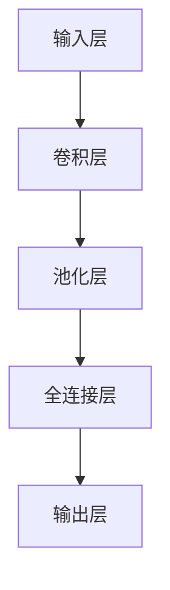

                 

关键词：深度学习、场景分类、图像识别、神经网络、机器学习、人工智能

## 摘要

本文探讨了基于深度学习的场景分类方法及其在图像识别领域的应用。首先，我们介绍了场景分类的概念和背景，然后详细阐述了深度学习的核心原理及其在场景分类中的应用。通过分析几种典型的深度学习模型，如卷积神经网络（CNN）和递归神经网络（RNN），我们深入探讨了这些模型在场景分类任务中的具体实现。最后，我们通过实际案例展示了深度学习在场景分类中的优势，并对未来的发展趋势和面临的挑战进行了展望。

## 1. 背景介绍

### 1.1 场景分类的定义

场景分类是指根据图像内容将其划分为不同的类别。在计算机视觉领域，场景分类是一个重要的研究方向，它可以帮助计算机理解图像的内容，从而进行目标检测、图像分割、视频监控等应用。场景分类通常基于图像的特征进行，这些特征可以是图像的边缘、纹理、颜色等。

### 1.2 图像识别的挑战

图像识别是计算机视觉的核心任务之一，其目的是让计算机能够理解图像的内容。然而，图像识别面临着许多挑战，包括：

- **复杂背景**：许多图像的背景非常复杂，这使得从背景中分离出目标变得非常困难。
- **光照变化**：图像的光照条件可能影响图像的质量，从而影响图像识别的准确性。
- **尺度变化**：目标在不同图像中的大小可能不同，这增加了识别的难度。

### 1.3 深度学习的发展

随着计算能力的提升和大数据的可用性，深度学习在计算机视觉领域取得了显著的进展。深度学习是一种基于多层神经网络的学习方法，它能够自动从大量数据中学习复杂的特征表示。深度学习在图像识别、语音识别、自然语言处理等领域都取得了突破性的成果。

## 2. 核心概念与联系

### 2.1 深度学习的核心原理

深度学习是一种基于多层神经网络的学习方法，其核心原理是通过前向传播和反向传播来训练网络。在训练过程中，网络通过多层非线性变换，将输入数据映射到输出，同时通过反向传播算法不断调整网络参数，以最小化预测误差。

### 2.2 神经网络架构

神经网络是由多个神经元（或称为节点）组成的层次结构。每个神经元接收来自前一层的输入，通过加权求和并应用激活函数，产生输出传递给下一层。常见的神经网络架构包括卷积神经网络（CNN）和递归神经网络（RNN）。

### 2.3 Mermaid 流程图



## 3. 核心算法原理 & 具体操作步骤

### 3.1 算法原理概述

场景分类算法通常基于深度学习模型，如卷积神经网络（CNN）和递归神经网络（RNN）。CNN擅长处理图像数据，而RNN擅长处理序列数据。在场景分类任务中，CNN可以提取图像的局部特征，而RNN可以捕捉图像的整体上下文。

### 3.2 算法步骤详解

1. **数据预处理**：包括图像的缩放、裁剪、归一化等操作，以适应网络输入的要求。
2. **网络构建**：根据场景分类任务的特点，选择合适的深度学习模型进行构建。例如，对于图像分类任务，可以选择CNN模型。
3. **模型训练**：使用训练数据集对网络进行训练，通过反向传播算法不断调整网络参数。
4. **模型评估**：使用验证数据集对训练好的模型进行评估，以确定其性能。
5. **模型部署**：将训练好的模型部署到实际应用中，用于场景分类任务。

### 3.3 算法优缺点

- **优点**：深度学习模型能够自动提取图像的复杂特征，提高分类的准确性。同时，它们具有良好的泛化能力，能够在新的数据集上表现良好。
- **缺点**：深度学习模型需要大量的训练数据和高性能的计算资源，且训练过程复杂。

### 3.4 算法应用领域

深度学习在场景分类领域有广泛的应用，包括但不限于：

- **自动驾驶**：通过场景分类技术，自动驾驶系统可以识别道路上的各种场景，如交通信号灯、行人、车辆等。
- **智能监控**：通过场景分类，智能监控系统可以实时识别异常行为，提高监控效果。
- **医疗图像分析**：通过场景分类，医疗图像分析系统可以识别病理图像中的病变区域。

## 4. 数学模型和公式 & 详细讲解 & 举例说明

### 4.1 数学模型构建

场景分类的数学模型通常基于损失函数，如交叉熵损失函数。交叉熵损失函数可以衡量预测标签与真实标签之间的差异。

$$L(y, \hat{y}) = -\sum_{i=1}^{n} y_i \log \hat{y_i}$$

其中，$y$是真实标签，$\hat{y}$是预测标签，$n$是标签的数量。

### 4.2 公式推导过程

假设我们有一个包含$m$个训练样本的数据集$D = \{(x_1, y_1), (x_2, y_2), ..., (x_m, y_m)\}$，其中$x_i$是输入样本，$y_i$是真实标签。

首先，我们对每个样本进行前向传播，得到预测标签$\hat{y}_i$：

$$\hat{y}_i = \sigma(W^T \cdot \text{激活函数}(Z_i))$$

其中，$W$是网络的权重，$Z_i$是前一层神经元的输出，$\sigma$是激活函数。

然后，我们计算损失：

$$L(y, \hat{y}) = -\sum_{i=1}^{m} y_i \log \hat{y_i}$$

### 4.3 案例分析与讲解

假设我们有一个包含10个训练样本的数据集，每个样本都是28x28的灰度图像。我们需要将这些图像分类为猫或狗。

1. **数据预处理**：将图像缩放到28x28的尺寸，并进行归一化处理。
2. **网络构建**：选择一个简单的CNN模型，包括两个卷积层、一个池化层和一个全连接层。
3. **模型训练**：使用训练数据集对网络进行训练，通过反向传播算法不断调整网络参数。
4. **模型评估**：使用验证数据集对训练好的模型进行评估，以确定其性能。
5. **模型部署**：将训练好的模型部署到实际应用中，用于猫狗分类任务。

## 5. 项目实践：代码实例和详细解释说明

### 5.1 开发环境搭建

1. 安装Python环境（版本3.7及以上）。
2. 安装深度学习库TensorFlow。
3. 准备训练数据集。

### 5.2 源代码详细实现

以下是实现猫狗分类任务的简化代码示例：

```python
import tensorflow as tf
from tensorflow.keras.models import Sequential
from tensorflow.keras.layers import Conv2D, MaxPooling2D, Flatten, Dense

# 构建CNN模型
model = Sequential([
    Conv2D(32, (3, 3), activation='relu', input_shape=(28, 28, 1)),
    MaxPooling2D((2, 2)),
    Conv2D(64, (3, 3), activation='relu'),
    MaxPooling2D((2, 2)),
    Flatten(),
    Dense(128, activation='relu'),
    Dense(1, activation='sigmoid')
])

# 编译模型
model.compile(optimizer='adam', loss='binary_crossentropy', metrics=['accuracy'])

# 训练模型
model.fit(x_train, y_train, epochs=10, batch_size=32, validation_data=(x_val, y_val))

# 评估模型
loss, accuracy = model.evaluate(x_test, y_test)
print(f"Test accuracy: {accuracy:.2f}")
```

### 5.3 代码解读与分析

1. **模型构建**：我们构建了一个简单的CNN模型，包括两个卷积层、一个池化层和一个全连接层。
2. **模型编译**：我们使用`compile`方法编译模型，指定优化器、损失函数和评价指标。
3. **模型训练**：我们使用`fit`方法训练模型，指定训练数据和验证数据。
4. **模型评估**：我们使用`evaluate`方法评估模型在测试数据上的性能。

## 6. 实际应用场景

### 6.1 自动驾驶

自动驾驶系统需要实时识别道路上的各种场景，如交通信号灯、行人、车辆等。深度学习场景分类技术可以帮助自动驾驶系统实现这一目标。

### 6.2 智能监控

智能监控系统可以通过深度学习场景分类技术识别异常行为，如入侵、火灾等，从而提高监控效果。

### 6.3 医疗图像分析

医疗图像分析系统可以通过深度学习场景分类技术识别病理图像中的病变区域，从而辅助医生进行诊断。

## 7. 工具和资源推荐

### 7.1 学习资源推荐

- 《深度学习》（Goodfellow, Bengio, Courville著）
- 《神经网络与深度学习》（邱锡鹏著）

### 7.2 开发工具推荐

- TensorFlow：一个开源的深度学习库，适用于构建和训练深度学习模型。
- Keras：一个高级神经网络API，可以简化深度学习模型的构建和训练。

### 7.3 相关论文推荐

- "Deep Learning for Image Recognition"（2012）
- "Rethinking the Inception Architecture for Computer Vision"（2016）
- "EfficientNet: Scalable and Efficiently Updatable Neural Networks"（2020）

## 8. 总结：未来发展趋势与挑战

### 8.1 研究成果总结

深度学习在场景分类领域取得了显著的成果，其在图像识别、视频监控、自动驾驶等领域的应用不断拓展。深度学习模型能够自动提取图像的复杂特征，提高分类的准确性。

### 8.2 未来发展趋势

1. **模型压缩**：为了降低模型的存储和计算成本，模型压缩技术将得到广泛应用。
2. **迁移学习**：通过利用预训练模型，迁移学习技术将有助于提高模型的泛化能力。
3. **多模态学习**：结合图像、文本、语音等多种数据源，多模态学习技术将推动场景分类技术的发展。

### 8.3 面临的挑战

1. **数据隐私**：深度学习模型的训练和部署需要大量的数据，数据隐私保护将成为一个重要问题。
2. **计算资源**：深度学习模型需要高性能的计算资源，计算资源的限制可能成为模型应用的瓶颈。

### 8.4 研究展望

随着深度学习技术的不断发展，场景分类技术在计算机视觉领域将发挥越来越重要的作用。通过解决当前面临的挑战，场景分类技术将在自动驾驶、智能监控、医疗图像分析等应用领域取得更大的突破。

## 9. 附录：常见问题与解答

### 9.1 什么是深度学习？

深度学习是一种基于多层神经网络的学习方法，它能够自动从大量数据中学习复杂的特征表示。

### 9.2 深度学习有哪些应用领域？

深度学习在图像识别、语音识别、自然语言处理、推荐系统等领域有广泛的应用。

### 9.3 如何优化深度学习模型的性能？

可以通过调整模型架构、优化训练过程、使用预训练模型等方法来优化深度学习模型的性能。

## 作者署名

作者：禅与计算机程序设计艺术 / Zen and the Art of Computer Programming

----------------------------------------------------------------

以上便是这篇文章的正文内容，接下来我们将按照markdown格式进行排版，确保文章的可读性和专业性。

