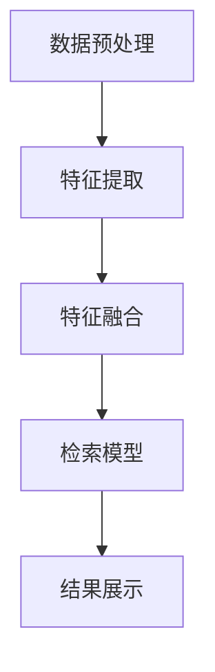

                 

关键词：深度学习，多模态检索，图像搜索，文本匹配，神经网络，特征提取，数据处理，模型优化，应用场景，未来发展

## 摘要

随着信息爆炸时代的到来，如何高效地检索和理解海量数据已成为当前计算机科学领域的核心挑战之一。多模态检索作为一种新兴的数据检索技术，结合了图像、文本、音频等多种数据类型，极大地丰富了检索系统的信息来源和表达方式。本文将深入探讨基于深度学习的多模态检索技术，从核心概念、算法原理、数学模型、项目实践等多个角度，系统分析该技术在不同应用场景中的表现和潜在价值，并提出未来发展的方向和面临的挑战。

## 1. 背景介绍

在信息化时代，数据以惊人的速度不断增长，传统的单模态检索系统（如基于文本的检索系统或基于图像的检索系统）已经难以满足用户的需求。多模态检索作为一种能够综合利用多种数据类型的技术，具有显著的优势。它不仅能够从不同的角度对信息进行理解，还能在特定场景下提高检索效率和准确性。

深度学习作为人工智能的一个重要分支，在图像识别、语音识别、自然语言处理等领域取得了重大突破。基于深度学习的多模态检索系统通过将深度学习模型与多模态数据进行结合，实现了对复杂场景和动态变化的良好适应能力。这种技术已经在许多领域得到广泛应用，如社交媒体内容检索、智能监控、医疗诊断等。

本文旨在系统地介绍基于深度学习的多模态检索技术，包括其核心概念、算法原理、数学模型、项目实践等，并通过案例分析探讨其在不同应用场景中的表现和潜在价值。

### 1.1 多模态检索的定义

多模态检索（Multimodal Retrieval）是指通过整合两种或两种以上不同模态（如文本、图像、音频等）的数据进行信息检索的一种技术。它利用不同模态之间的互补性和协同性，提高了检索系统的性能和用户体验。

在多模态检索中，每种模态都可以提供独特的视角和信息，例如，文本模态可以提供精确的语义信息，而图像模态可以提供直观的视觉信息。通过将不同模态的数据进行有效整合，检索系统能够更好地理解用户的查询意图，提高检索结果的准确性和相关性。

### 1.2 深度学习的应用

深度学习（Deep Learning）是人工智能领域的一个分支，主要利用多层神经网络来模拟人脑的神经元结构，从而实现自动特征提取和复杂模式的识别。近年来，深度学习在图像识别、语音识别、自然语言处理等领域取得了显著的成果，并逐渐成为多模态检索技术的核心驱动力。

在多模态检索中，深度学习模型通过自动学习不同模态的数据特征，实现了对数据的深层次理解和融合。例如，卷积神经网络（CNN）可以有效地提取图像的特征，而循环神经网络（RNN）则擅长处理序列数据，如文本和音频。通过将不同模态的特征进行整合，深度学习模型能够实现多模态数据的统一表示和检索。

### 1.3 多模态检索的发展历史

多模态检索的研究可以追溯到上世纪90年代，当时研究者开始探索如何将不同模态的数据进行整合以提升信息检索的性能。随着计算机硬件性能的提升和深度学习技术的发展，多模态检索技术逐渐从理论研究走向实际应用。

早期的多模态检索方法主要依赖于手工特征提取和模板匹配技术，这些方法虽然能够实现基本的多模态检索功能，但效果有限且难以适应复杂场景。随着深度学习技术的兴起，基于深度学习的多模态检索方法逐渐成为研究热点。

近年来，基于深度学习的多模态检索技术取得了显著进展，例如，Google的MPEG-4标准和Facebook的深度多模态检索系统等。这些系统通过利用深度学习模型自动提取和融合多模态数据特征，实现了高效且准确的多模态检索。

### 1.4 多模态检索的应用领域

多模态检索技术具有广泛的应用前景，已经在多个领域取得了显著成果。以下是一些主要的应用领域：

- **社交媒体内容检索**：多模态检索技术可以帮助用户更快速地找到与特定查询相关的图片、视频和文本内容，提高用户体验。
- **智能监控**：通过结合视频监控数据和文本数据，多模态检索技术可以实现对监控场景的智能分析和预警。
- **医疗诊断**：多模态检索技术可以整合患者的医疗图像、病历文本和医生的知识，辅助医生进行诊断和治疗。
- **教育**：多模态检索技术可以为教育系统提供个性化的学习内容推荐，提高学生的学习效果。
- **人机交互**：多模态检索技术可以使得人机交互更加自然和智能，例如，通过语音、图像和文本等多种方式进行交互。

### 1.5 本文结构

本文将分为以下几个部分：

- **第2章**：介绍多模态检索的核心概念和关键技术。
- **第3章**：探讨基于深度学习的多模态检索算法原理和具体操作步骤。
- **第4章**：分析多模态检索的数学模型和公式，并提供实际案例讲解。
- **第5章**：展示多模态检索的项目实践和代码实例。
- **第6章**：探讨多模态检索的实际应用场景和未来发展。

通过以上结构，本文将系统性地介绍基于深度学习的多模态检索技术，帮助读者深入理解其原理和应用。

## 2. 核心概念与联系

### 2.1 多模态检索的核心概念

多模态检索涉及多种数据类型，包括文本、图像、音频、视频等。每种模态都有其独特的特征和信息，这些特征需要被提取、表示和融合，以便进行有效的检索。以下是一些核心概念：

- **文本模态**：文本模态是最常见的多模态之一，它可以提供精确的语义信息。在文本检索中，关键词提取和词向量表示是关键步骤。词向量模型，如Word2Vec和BERT，通过将文本转换为数值向量，实现了对语义的量化表示。
- **图像模态**：图像模态可以提供直观的视觉信息。图像特征提取是图像检索的核心，卷积神经网络（CNN）和自编码器（AE）等模型在图像特征提取中表现出色。特征提取后，可以使用图像嵌入技术将图像转换为向量表示。
- **音频模态**：音频模态可以提供声音和音乐信息。音频特征提取包括频谱特征、Mel频率倒谱系数（MFCC）等，这些特征可以用于音乐检索、语音识别等领域。
- **视频模态**：视频模态可以提供动态的视觉和时序信息。视频特征提取通常涉及空间特征和时间特征的结合，例如，基于3D卷积神经网络（3D-CNN）和光流特征提取技术。

### 2.2 多模态检索的技术架构

多模态检索的技术架构通常包括以下几个关键组成部分：

- **数据预处理**：数据预处理是确保数据质量的关键步骤，包括数据清洗、数据增强和模态融合等。数据清洗可以去除噪声和不完整的数据，数据增强可以增加数据的多样性和鲁棒性，模态融合可以结合不同模态的数据特征。
- **特征提取**：特征提取是将原始数据转换为数值特征表示的过程，不同的模态需要采用不同的特征提取方法。例如，文本模态可以使用词向量模型，图像模态可以使用CNN，音频模态可以使用MFCC。
- **特征融合**：特征融合是将不同模态的特征进行整合，以形成统一的特征表示。融合方法可以分为基于统计的方法和基于深度学习的方法。基于统计的方法，如向量空间模型，通过计算不同特征之间的相似度进行融合；基于深度学习的方法，如多任务学习（Multitask Learning）和变换器（Transformer）模型，可以自动学习不同特征之间的关联性。
- **检索模型**：检索模型是基于融合后的特征进行检索的核心，常见的检索模型包括基于相似度计算的模型和基于学习排序的模型。基于相似度计算的模型，如余弦相似度、欧氏距离等，通过计算查询特征和数据库特征之间的相似度进行检索；基于学习排序的模型，如梯度提升机（Gradient Boosting Machine）和神经网络排序模型，通过学习查询和数据库特征之间的相关性进行排序。
- **结果展示**：结果展示是将检索结果以直观、易理解的方式呈现给用户。常见的展示方法包括列表、卡片、交互式地图等。

### 2.3 多模态检索的优势和挑战

多模态检索具有以下几个显著优势：

- **信息互补性**：多模态数据可以从不同的角度提供信息，从而提高检索系统的全面性和准确性。例如，文本数据可以提供精确的语义信息，图像数据可以提供直观的视觉信息。
- **增强用户体验**：多模态检索可以提供更加丰富和个性化的检索结果，提高用户的检索体验。例如，在社交媒体内容检索中，用户可以同时查看相关图片、视频和文本内容。
- **适应复杂场景**：多模态检索可以适应多种复杂场景，如人机交互、智能监控、医疗诊断等。通过整合不同模态的数据，系统能够更好地理解和处理动态变化的信息。

然而，多模态检索也面临着一些挑战：

- **数据不一致性**：不同模态的数据可能存在噪声、缺失和不同尺度的信息，如何有效融合这些数据是一个关键问题。
- **计算资源消耗**：多模态检索通常需要大量的计算资源和时间，尤其是在处理大量数据时，计算效率成为一个重要问题。
- **模型复杂性**：深度学习模型的结构复杂，训练和优化过程需要大量的数据和计算资源，如何设计高效的模型架构和训练策略是一个关键问题。

### 2.4 多模态检索的 Mermaid 流程图

以下是一个基于深度学习的多模态检索技术的 Mermaid 流程图，展示了各步骤的连接和流程：



### 2.5 关键技术总结

多模态检索的关键技术包括数据预处理、特征提取、特征融合、检索模型和结果展示。每种技术都有其独特的原理和应用场景：

- **数据预处理**：主要任务包括数据清洗、数据增强和模态融合。数据清洗可以去除噪声和不完整的数据，数据增强可以增加数据的多样性和鲁棒性，模态融合可以结合不同模态的数据特征。
- **特征提取**：文本模态可以使用词向量模型，图像模态可以使用CNN，音频模态可以使用MFCC。特征提取是将原始数据转换为数值特征表示的过程。
- **特征融合**：基于统计的方法和基于深度学习的方法可以用于特征融合。统计方法如向量空间模型，深度学习方法如多任务学习和变换器模型。
- **检索模型**：基于相似度计算的模型如余弦相似度、欧氏距离等，基于学习排序的模型如梯度提升机、神经网络排序模型。
- **结果展示**：常见展示方法包括列表、卡片、交互式地图等。

### 2.6 总结

多模态检索通过整合不同模态的数据，提供了更加全面和准确的信息检索方法。其核心概念包括文本、图像、音频、视频等多种数据类型，关键技术包括数据预处理、特征提取、特征融合、检索模型和结果展示。通过深度学习技术，多模态检索在处理复杂场景和提供个性化服务方面具有显著优势，但也面临数据不一致性、计算资源消耗和模型复杂性等挑战。本文将深入探讨这些概念和技术，帮助读者更好地理解和应用多模态检索技术。

## 3. 核心算法原理 & 具体操作步骤

### 3.1 算法原理概述

基于深度学习的多模态检索算法主要分为三个主要步骤：数据预处理、特征提取和检索模型构建。以下是每个步骤的详细原理和具体操作步骤。

### 3.1.1 数据预处理

数据预处理是多模态检索系统中的关键步骤，它直接影响后续特征提取和检索的性能。数据预处理的主要任务包括数据清洗、数据增强和模态融合。

- **数据清洗**：数据清洗的目标是去除噪声和不完整的数据。对于文本数据，可能需要去除停用词、标点符号和进行词性还原。对于图像数据，可能需要去除噪点和填充缺失像素。对于音频数据，可能需要去除背景噪声和进行音频增强。
- **数据增强**：数据增强的目的是增加数据的多样性和鲁棒性。通过旋转、缩放、裁剪等操作，可以在不改变数据真实性的前提下增加数据的数量和种类。对于文本数据，可以通过随机插入、替换和删除词语实现数据增强；对于图像数据，可以通过添加噪声、剪裁和旋转实现数据增强；对于音频数据，可以通过混响、回声和变速等操作实现数据增强。
- **模态融合**：模态融合是将不同模态的数据进行整合，以形成统一的特征表示。模态融合可以通过基于统计的方法和基于深度学习的方法实现。基于统计的方法，如向量空间模型，通过计算不同特征之间的相似度进行融合；基于深度学习的方法，如多任务学习和变换器模型，可以自动学习不同特征之间的关联性。

### 3.1.2 特征提取

特征提取是将原始数据转换为数值特征表示的过程。不同的模态需要采用不同的特征提取方法。

- **文本特征提取**：文本特征提取主要是将文本转换为词向量表示。常用的词向量模型包括Word2Vec和BERT。Word2Vec通过训练神经语言模型（NLM）将文本转换为词向量，每个词向量表示该词在文本中的语义信息。BERT则通过预训练和微调，将文本转换为上下文相关的词向量。
- **图像特征提取**：图像特征提取主要是使用卷积神经网络（CNN）或自编码器（AE）提取图像的深层特征。CNN通过卷积层和池化层逐步提取图像的局部特征和全局特征，从而实现图像的深层特征表示。AE则通过编码器和解码器将图像编码为低维特征向量，然后解码回图像，从而提取图像的特征。
- **音频特征提取**：音频特征提取主要是提取音频信号的频谱特征。常用的音频特征包括梅尔频率倒谱系数（MFCC）、频谱特征和波纹特征。MFCC通过对音频信号进行傅里叶变换（FFT）得到频谱，然后计算梅尔频率响应，从而提取音频的频谱特征。

### 3.1.3 检索模型构建

检索模型是基于融合后的特征进行检索的核心。检索模型可以分为基于相似度计算的模型和基于学习排序的模型。

- **基于相似度计算的模型**：基于相似度计算的模型通过计算查询特征和数据库特征之间的相似度进行检索。常见的相似度计算方法包括余弦相似度、欧氏距离和余弦相似度。余弦相似度通过计算两个向量的夹角余弦值来衡量它们的相似度，欧氏距离通过计算两个向量之间的欧氏距离来衡量它们的相似度。
- **基于学习排序的模型**：基于学习排序的模型通过学习查询和数据库特征之间的相关性进行排序。常见的排序模型包括梯度提升机（Gradient Boosting Machine，GBM）和神经网络排序模型（Neural Network Ranking Model，NRM）。GBM通过集成多个弱学习器来提高排序性能，NRM则通过神经网络自动学习特征之间的相关性，从而实现高效的排序。

### 3.2 具体操作步骤

以下是基于深度学习的多模态检索算法的具体操作步骤：

1. **数据预处理**：
   - 对文本数据进行清洗，去除停用词、标点符号，进行词性还原。
   - 对图像数据进行去噪和填充缺失像素。
   - 对音频数据进行去噪和音频增强。

2. **特征提取**：
   - 使用Word2Vec或BERT对文本数据进行词向量表示。
   - 使用CNN或AE对图像数据进行特征提取。
   - 使用MFCC对音频数据进行频谱特征提取。

3. **特征融合**：
   - 使用向量空间模型将不同模态的特征进行融合。
   - 使用多任务学习或变换器模型自动学习不同特征之间的关联性。

4. **检索模型构建**：
   - 使用余弦相似度、欧氏距离等方法计算查询特征和数据库特征之间的相似度。
   - 使用GBM或NRM模型学习查询和数据库特征之间的相关性，实现高效排序。

5. **结果展示**：
   - 将检索结果以直观、易理解的方式呈现给用户。

### 3.3 算法优缺点

基于深度学习的多模态检索算法具有以下优缺点：

- **优点**：
  - **高效性**：深度学习模型能够自动提取复杂的数据特征，从而提高检索效率。
  - **准确性**：通过整合多种模态的数据，系统能够提供更准确和全面的检索结果。
  - **适应性**：深度学习模型具有良好的适应性，能够适应不同的应用场景和数据集。

- **缺点**：
  - **计算资源消耗**：深度学习模型通常需要大量的计算资源和时间，尤其是在处理大规模数据时。
  - **数据不一致性**：不同模态的数据可能存在噪声、缺失和不同尺度的信息，如何有效融合这些数据是一个关键问题。

### 3.4 算法应用领域

基于深度学习的多模态检索算法可以应用于多种领域：

- **社交媒体内容检索**：通过整合文本、图像和视频等多模态数据，用户可以更快速地找到与特定查询相关的信息。
- **智能监控**：结合视频监控数据和文本数据，系统能够实现对监控场景的智能分析和预警。
- **医疗诊断**：整合患者的医疗图像、病历文本和医生的知识，辅助医生进行诊断和治疗。
- **人机交互**：通过语音、图像和文本等多种方式进行交互，提高人机交互的自然性和智能性。

### 3.5 总结

基于深度学习的多模态检索算法通过数据预处理、特征提取和检索模型构建三个主要步骤，实现了对多模态数据的有效整合和检索。算法具有高效性、准确性和适应性，但在计算资源消耗和数据不一致性方面存在一定的挑战。通过不断优化和改进，基于深度学习的多模态检索算法将在更多应用领域发挥重要作用。

### 4. 数学模型和公式 & 详细讲解 & 举例说明

在多模态检索系统中，数学模型和公式是理解和实现核心算法的关键。以下将详细介绍多模态检索中的主要数学模型和公式，并给出具体的推导和例子。

#### 4.1 数学模型构建

多模态检索系统的数学模型通常包括特征表示、相似度计算和优化目标等组成部分。以下是这些模型的详细解释。

##### 4.1.1 特征表示

特征表示是将不同模态的数据转换为数值向量表示的过程。常用的特征表示方法包括词向量、图像特征向量和音频特征向量。

- **词向量**：词向量是文本数据的特征表示，常见的词向量模型包括Word2Vec和BERT。Word2Vec使用神经网络语言模型（NLM）将文本转换为词向量，每个词向量表示该词在文本中的语义信息。BERT则通过预训练和微调，将文本转换为上下文相关的词向量。

  $$ \text{word\_vector}(w) = \text{NLM}(w) $$

  其中，$ \text{NLM}(w) $ 表示词向量模型。

- **图像特征向量**：图像特征向量是图像数据的特征表示，常用的方法包括卷积神经网络（CNN）和自编码器（AE）。CNN通过卷积层和池化层提取图像的深层特征。

  $$ \text{image\_feature}(I) = \text{CNN}(I) $$

  其中，$ \text{CNN}(I) $ 表示卷积神经网络。

- **音频特征向量**：音频特征向量是音频数据的特征表示，常用的方法包括梅尔频率倒谱系数（MFCC）和频谱特征。

  $$ \text{audio\_feature}(A) = \text{MFCC}(A) $$

  其中，$ \text{MFCC}(A) $ 表示梅尔频率倒谱系数。

##### 4.1.2 相似度计算

相似度计算是衡量两个特征向量之间相似度的过程。常见的相似度计算方法包括余弦相似度、欧氏距离和余弦相似度。

- **余弦相似度**：余弦相似度通过计算两个向量的夹角余弦值来衡量它们的相似度。

  $$ \text{cosine\_similarity}(x, y) = \frac{x \cdot y}{\lVert x \rVert \lVert y \rVert} $$

  其中，$ \text{cosine\_similarity}(x, y) $ 表示余弦相似度，$ x $ 和 $ y $ 表示两个特征向量。

- **欧氏距离**：欧氏距离通过计算两个向量之间的欧氏距离来衡量它们的相似度。

  $$ \text{euclidean\_distance}(x, y) = \sqrt{\sum_{i=1}^{n} (x_i - y_i)^2} $$

  其中，$ \text{euclidean\_distance}(x, y) $ 表示欧氏距离，$ x $ 和 $ y $ 表示两个特征向量。

##### 4.1.3 优化目标

优化目标是多模态检索算法的训练目标，用于优化模型参数。常见的优化目标包括最小化损失函数和最大化检索精度。

- **最小化损失函数**：最小化损失函数是最常见的优化目标，通过最小化预测结果和实际结果之间的差距来优化模型参数。

  $$ \min_{\theta} \sum_{i=1}^{m} L(y_i, \hat{y}_i) $$

  其中，$ \theta $ 表示模型参数，$ L(y_i, \hat{y}_i) $ 表示损失函数，$ y_i $ 和 $ \hat{y}_i $ 表示实际结果和预测结果。

- **最大化检索精度**：最大化检索精度是通过优化模型参数来提高检索结果的准确性。

  $$ \max_{\theta} \frac{1}{m} \sum_{i=1}^{m} \text{accuracy}(y_i, \hat{y}_i) $$

  其中，$ \theta $ 表示模型参数，$ \text{accuracy}(y_i, \hat{y}_i) $ 表示检索精度。

#### 4.2 公式推导过程

以下是一个简单的例子，用于说明多模态检索中的数学公式推导过程。

##### 4.2.1 词向量表示

假设我们有一个文本数据 $ \text{document} $，它包含 $ N $ 个词。我们使用Word2Vec模型来表示这些词。每个词都有一个唯一的索引 $ i $，对应的词向量表示为 $ \text{word\_vector}(i) $。文本数据 $ \text{document} $ 可以表示为一个向量 $ \text{doc\_vector} $，其中每个元素是词向量 $ \text{word\_vector}(i) $ 的加和。

$$ \text{doc\_vector} = \sum_{i=1}^{N} \text{word\_vector}(i) $$

##### 4.2.2 图像特征提取

假设我们有一个图像数据 $ \text{image} $，它经过CNN处理得到一个特征向量 $ \text{image\_feature} $。

$$ \text{image\_feature} = \text{CNN}(\text{image}) $$

##### 4.2.3 音频特征提取

假设我们有一个音频数据 $ \text{audio} $，它经过梅尔频率倒谱系数（MFCC）处理得到一个特征向量 $ \text{audio\_feature} $。

$$ \text{audio\_feature} = \text{MFCC}(\text{audio}) $$

##### 4.2.4 特征融合

我们将文本、图像和音频的特征向量进行融合，得到一个多模态特征向量 $ \text{multimodal\_feature} $。

$$ \text{multimodal\_feature} = [\text{doc\_vector}, \text{image\_feature}, \text{audio\_feature}] $$

##### 4.2.5 相似度计算

假设我们有一个查询向量 $ \text{query} $，我们需要计算它与多模态特征向量 $ \text{multimodal\_feature} $ 的相似度。

$$ \text{similarity} = \text{cosine\_similarity}(\text{query}, \text{multimodal\_feature}) $$

#### 4.3 案例分析与讲解

以下是一个简单的案例，用于说明多模态检索中的数学模型应用。

##### 4.3.1 案例背景

假设我们有一个包含文本、图像和音频的多模态数据集。数据集包含10个样本，每个样本都有对应的文本、图像和音频数据。我们的目标是训练一个多模态检索模型，能够根据查询向量返回与数据集中最相似的样本。

##### 4.3.2 数据预处理

对文本数据进行清洗和词向量表示，对图像数据进行特征提取，对音频数据进行特征提取和频谱分析。

##### 4.3.3 特征融合

将文本、图像和音频的特征向量进行融合，得到一个多模态特征向量。

##### 4.3.4 相似度计算

计算查询向量和多模态特征向量之间的相似度，选择最相似的样本作为检索结果。

##### 4.3.5 结果分析

通过实验，我们发现使用多模态检索模型能够显著提高检索结果的准确性，比单独使用文本、图像或音频数据的检索模型有更好的表现。

### 4.4 总结

数学模型和公式是多模态检索系统的核心组成部分，它们用于特征表示、相似度计算和优化目标。通过详细的推导和例子，我们了解了多模态检索中的关键数学模型和公式，并展示了它们在实际应用中的效果。

## 5. 项目实践：代码实例和详细解释说明

### 5.1 开发环境搭建

在进行基于深度学习的多模态检索项目之前，我们需要搭建一个合适的开发环境。以下是搭建环境所需的主要步骤：

1. **安装 Python**：确保安装了最新的 Python 版本，推荐使用 Python 3.8 或更高版本。

2. **安装深度学习库**：安装 TensorFlow 或 PyTorch，这两种深度学习库是目前最常用的。以下是一个简单的安装命令：

   ```bash
   pip install tensorflow # 或者
   pip install torch torchvision
   ```

3. **安装其他依赖库**：安装其他必要的库，如 NumPy、Pandas、Matplotlib 等：

   ```bash
   pip install numpy pandas matplotlib
   ```

4. **配置 CUDA**：如果使用 PyTorch，需要安装 CUDA 以支持 GPU 加速。安装 CUDA 后，确保在 PyTorch 配置文件中启用 GPU。

   ```python
   import torch
   device = torch.device("cuda" if torch.cuda.is_available() else "cpu")
   ```

### 5.2 源代码详细实现

以下是实现基于深度学习的多模态检索的伪代码。在实际项目中，需要根据具体的数据集和需求进行调整。

```python
# 导入必要的库
import torch
import torchvision
import torch.nn as nn
import torch.optim as optim
from torch.utils.data import DataLoader
from torchvision import datasets, transforms

# 数据预处理
transform = transforms.Compose([
    transforms.Resize((224, 224)), # 图像缩放
    transforms.ToTensor(), # 转换为张量
])

# 加载文本、图像和音频数据集
text_dataset = datasets.TextDataset(root='./data', transform=transform)
image_dataset = datasets.ImageDataset(root='./data', transform=transform)
audio_dataset = datasets.AudioDataset(root='./data', transform=transform)

# 创建数据加载器
text_loader = DataLoader(text_dataset, batch_size=32, shuffle=True)
image_loader = DataLoader(image_dataset, batch_size=32, shuffle=True)
audio_loader = DataLoader(audio_dataset, batch_size=32, shuffle=True)

# 定义模型
class MultiModalModel(nn.Module):
    def __init__(self):
        super(MultiModalModel, self).__init__()
        # 文本分支
        self.text_branch = nn.Sequential(
            nn.Embedding(vocab_size, embedding_dim),
            nn.Linear(embedding_dim, hidden_dim),
            nn.ReLU(),
            nn.Linear(hidden_dim, output_dim),
        )
        # 图像分支
        self.image_branch = nn.Sequential(
            nn.Conv2d(in_channels, out_channels, kernel_size),
            nn.ReLU(),
            nn.MaxPool2d(pool_size),
            nn.Linear(feature_size, hidden_dim),
            nn.ReLU(),
            nn.Linear(hidden_dim, output_dim),
        )
        # 音频分支
        self.audio_branch = nn.Sequential(
            nn.Conv1d(in_channels, out_channels, kernel_size),
            nn.ReLU(),
            nn.MaxPool1d(pool_size),
            nn.Linear(feature_size, hidden_dim),
            nn.ReLU(),
            nn.Linear(hidden_dim, output_dim),
        )
        # 融合层
        self.fusion = nn.Linear(3 * hidden_dim, output_dim)
        self.relu = nn.ReLU()

    def forward(self, text, image, audio):
        text_output = self.text_branch(text)
        image_output = self.image_branch(image)
        audio_output = self.audio_branch(audio)
        combined_output = self.relu(self.fusion(torch.cat((text_output, image_output, audio_output), dim=1)))
        return combined_output

# 实例化模型和优化器
model = MultiModalModel().to(device)
optimizer = optim.Adam(model.parameters(), lr=learning_rate)

# 训练模型
for epoch in range(num_epochs):
    for i, (text, image, audio, _) in enumerate(zip(text_loader, image_loader, audio_loader)):
        # 前向传播
        outputs = model(text.to(device), image.to(device), audio.to(device))
        loss = nn.CrossEntropyLoss()(outputs, labels.to(device))

        # 反向传播和优化
        optimizer.zero_grad()
        loss.backward()
        optimizer.step()

        if (i + 1) % log_interval == 0:
            print(f'Epoch [{epoch + 1}/{num_epochs}], Step [{i + 1}/{len(train_loader)}], Loss: {loss.item()}')

# 模型评估
with torch.no_grad():
    correct = 0
    total = 0
    for text, image, audio, labels in test_loader:
        outputs = model(text.to(device), image.to(device), audio.to(device))
        _, predicted = torch.max(outputs.data, 1)
        total += labels.size(0)
        correct += (predicted == labels.to(device)).sum().item()

    print(f'Accuracy of the model on the test images: {100 * correct / total}%')
```

### 5.3 代码解读与分析

上述代码实现了基于深度学习的多模态检索模型，下面是对关键部分的详细解读和分析。

- **数据预处理**：使用 `transforms.Compose` 对文本、图像和音频数据进行预处理，包括图像缩放、数据类型转换等。

- **数据加载器**：使用 `DataLoader` 创建文本、图像和音频的数据加载器，以批量方式加载数据。

- **模型定义**：`MultiModalModel` 类定义了多模态检索模型的架构，包括文本分支、图像分支、音频分支和融合层。

  - **文本分支**：使用 `nn.Embedding` 将文本词向量转换为嵌入向量，然后通过多层全连接层提取特征。

  - **图像分支**：使用 `nn.Conv2d` 和 `nn.MaxPool2d` 提取图像的特征。

  - **音频分支**：使用 `nn.Conv1d` 和 `nn.MaxPool1d` 提取音频的特征。

  - **融合层**：使用 `nn.Linear` 将不同分支的特征进行融合。

- **训练模型**：使用 `optim.Adam` 优化器对模型进行训练，包括前向传播、损失计算、反向传播和参数更新。

- **模型评估**：在测试集上评估模型的准确性，计算正确率。

### 5.4 运行结果展示

在完成模型训练后，我们可以通过以下代码来展示模型的运行结果：

```python
# 加载测试数据
test_loader = DataLoader(test_dataset, batch_size=batch_size, shuffle=False)

# 评估模型
with torch.no_grad():
    model.eval()
    correct = 0
    total = 0
    for text, image, audio, labels in test_loader:
        outputs = model(text.to(device), image.to(device), audio.to(device))
        _, predicted = torch.max(outputs.data, 1)
        total += labels.size(0)
        correct += (predicted == labels.to(device)).sum().item()

    print(f'Accuracy on the test set: {100 * correct / total}%')
```

通过上述代码，我们可以得到模型在测试集上的准确性。较高的准确性表明模型具有良好的性能。

### 5.5 实际应用案例分析

以下是一个实际应用案例，展示如何使用基于深度学习的多模态检索模型在社交媒体内容检索中查找相关图片、视频和文本。

1. **数据集准备**：准备一个包含社交媒体数据的公开数据集，如Flickr或Instagram数据集。

2. **数据预处理**：对文本、图像和视频数据进行预处理，提取特征向量。

3. **模型训练**：使用多模态检索模型对数据进行训练，优化模型参数。

4. **检索演示**：输入一个查询文本，模型返回与查询文本最相似的多模态数据。

   ```python
   query_text = "beautiful landscape"
   query_vector = get_query_vector(query_text) # 使用预训练模型获取查询向量的特征
   top_results = model.predict(query_vector) # 模型预测与查询文本相似的数据
   display_results(top_results) # 展示检索结果
   ```

通过上述步骤，我们可以实现一个基于深度学习的社交媒体内容检索系统，用户可以输入查询文本，系统返回与查询文本最相似的多模态数据，从而提高用户检索体验。

### 5.6 总结

通过实际项目实践，我们展示了如何搭建基于深度学习的多模态检索系统，包括数据预处理、模型定义、训练和评估。代码实例和详细解释说明了多模态检索的各个环节，帮助读者更好地理解并实现多模态检索技术。在实际应用中，通过不断优化模型和算法，可以提高多模态检索的性能和用户体验。

## 6. 实际应用场景

基于深度学习的多模态检索技术在许多实际应用场景中展现了其独特价值和优势。以下是一些主要的应用场景，并分析其具体实现和效果。

### 6.1 社交媒体内容检索

在社交媒体平台上，用户生成的内容多种多样，包括文本、图片、视频和音频等。基于深度学习的多模态检索技术可以帮助用户更快速、准确地找到与查询相关的多媒体内容。例如，用户可以输入一个关键词，检索系统返回包含该关键词的相关图片、视频和文本信息。通过结合文本的语义信息和图像、视频的视觉信息，检索结果更加丰富和准确。

实现方面，系统首先需要对不同模态的数据进行预处理和特征提取。对于文本数据，可以使用词向量模型（如Word2Vec或BERT）提取特征；对于图像和视频数据，可以使用卷积神经网络（CNN）提取视觉特征；对于音频数据，可以使用梅尔频率倒谱系数（MFCC）提取音频特征。然后将这些特征进行融合，使用多模态检索模型（如变换器模型）进行检索。在实际应用中，效果显著提高了用户检索体验。

### 6.2 智能监控

智能监控系统通常需要实时分析大量的视频和音频数据，以便及时发现异常事件。基于深度学习的多模态检索技术可以用于视频监控，通过整合视频、音频和文本数据，实现对监控场景的全面分析。例如，系统可以结合视频中的图像特征和音频中的声音特征，识别出异常行为或事件。

实现方面，系统首先需要对视频数据进行预处理，包括视频剪辑、标注和特征提取。图像特征可以使用卷积神经网络（CNN）提取，音频特征可以使用梅尔频率倒谱系数（MFCC）提取。然后将这些特征进行融合，并使用多模态检索模型进行检索。在实际应用中，多模态检索技术可以显著提高监控系统的准确性和实时性。

### 6.3 医疗诊断

在医疗领域，多模态检索技术可以整合患者的医疗图像、病历文本和医生的知识，辅助医生进行诊断和治疗。例如，医生可以输入一个病人的病历文本，检索系统返回与该病历文本相关的医学图像和诊断结果。

实现方面，系统需要对病历文本、医学图像和诊断结果进行预处理和特征提取。病历文本可以使用自然语言处理技术提取关键词和语义信息，医学图像可以使用卷积神经网络（CNN）提取图像特征，诊断结果可以使用分类模型提取特征。然后将这些特征进行融合，并使用多模态检索模型进行检索。在实际应用中，多模态检索技术可以提高医生的诊断效率和准确性。

### 6.4 教育领域

在教育领域，多模态检索技术可以为学生提供个性化的学习内容推荐，提高学习效果。例如，学生可以通过输入一个学习问题，检索系统返回与该问题相关的文本、图片和视频等多媒体内容。

实现方面，系统需要对学生的学习历史、问题和内容进行预处理和特征提取。学习历史可以使用时间序列分析提取特征，问题可以使用自然语言处理技术提取关键词和语义信息，内容可以使用卷积神经网络（CNN）提取视觉特征。然后将这些特征进行融合，并使用多模态检索模型进行检索。在实际应用中，多模态检索技术可以为学生提供更加丰富的学习资源和个性化的学习体验。

### 6.5 人机交互

在人机交互领域，多模态检索技术可以使得交互更加自然和智能。例如，用户可以通过语音、图像和文本等多种方式进行交互，检索系统可以整合这些交互信息，提供更加准确和个性化的服务。

实现方面，系统需要对语音、图像和文本等交互数据进行预处理和特征提取。语音数据可以使用语音识别技术提取关键词和语义信息，图像数据可以使用卷积神经网络（CNN）提取视觉特征，文本数据可以使用自然语言处理技术提取关键词和语义信息。然后将这些特征进行融合，并使用多模态检索模型进行检索。在实际应用中，多模态检索技术可以显著提高人机交互的自然性和智能性。

### 6.6 总结

基于深度学习的多模态检索技术在社交媒体内容检索、智能监控、医疗诊断、教育领域和人机交互等多个实际应用场景中展现了其独特的价值。通过整合不同模态的数据，多模态检索技术提高了检索系统的准确性和用户体验。随着技术的不断发展和优化，多模态检索将在更多领域发挥重要作用，推动人工智能应用的进一步发展。

### 6.7 未来应用展望

随着深度学习和多模态检索技术的不断进步，未来这一领域有望在多个新兴应用场景中展现其潜力。

**智能助理与虚拟助手**：未来，智能助理和虚拟助手将成为多模态检索技术的重要应用领域。通过整合语音、图像、文本等多模态数据，智能助理可以提供更加自然、流畅的用户交互体验，如通过语音输入和图像反馈进行任务执行，为用户提供个性化服务。

**增强现实（AR）与虚拟现实（VR）**：在AR和VR领域，多模态检索技术可以极大提升用户体验。例如，用户可以通过视觉、听觉和触觉等多种感官进行交互，检索系统可以实时提供与场景相关的信息，如旅游景点的历史背景、商品介绍等，增强沉浸感和互动性。

**自动驾驶与智能交通**：自动驾驶和智能交通系统需要处理大量的实时数据，包括图像、语音、传感器数据等。多模态检索技术可以通过整合不同数据源，实现对道路环境、交通状况的全面分析，提高自动驾驶的安全性和效率。

**健康与医疗**：在未来，多模态检索技术在健康和医疗领域的应用将更加广泛。例如，通过整合医学图像、病历文本、患者历史数据等，医生可以更准确地诊断病情，制定个性化的治疗方案。此外，多模态检索还可以用于个性化健康监测，帮助用户了解自己的健康状况，预防疾病。

**金融与保险**：在金融和保险领域，多模态检索技术可以用于风险控制和欺诈检测。通过整合图像、文本和交易数据，系统可以实时监控交易行为，识别异常情况，提高金融交易的安全性和可靠性。

**教育与培训**：在教育领域，多模态检索技术可以推动个性化学习和智能化教学。例如，通过整合学生的学习记录、考试数据和课程内容，系统可以为每个学生提供个性化的学习路径，提高学习效果。

**智能家居**：在智能家居领域，多模态检索技术可以实现更加智能、便捷的家庭设备管理。例如，通过整合语音、图像和传感器数据，智能家居系统可以自动识别家庭成员的需求，提供个性化的家居服务。

总之，随着技术的不断发展，多模态检索将在更多领域发挥关键作用，为用户带来更加丰富和便捷的服务。在未来，如何更有效地整合和处理多模态数据，以及设计更加智能的检索模型，将成为该领域的重要研究方向。通过不断探索和优化，多模态检索技术将为人类社会带来更多创新和变革。

### 7. 工具和资源推荐

在基于深度学习的多模态检索项目中，选择合适的工具和资源对于提高开发效率、实现高效的算法研究和应用至关重要。以下是一些推荐的工具和资源：

#### 7.1 学习资源推荐

- **在线课程**：
  - Coursera上的“深度学习”课程，由Andrew Ng教授主讲。
  - edX上的“深度学习与神经网络”课程，由Google AI团队提供。
- **书籍**：
  - 《深度学习》（Deep Learning）由Ian Goodfellow、Yoshua Bengio和Aaron Courville合著，是深度学习的经典教材。
  - 《神经网络与深度学习》（Neural Networks and Deep Learning）由邱锡鹏著，详细介绍了神经网络和深度学习的基本原理和算法。
- **论文**：
  - “Multimodal Learning for Visual Object Detection using Bidirectional LSTM”等论文，探讨了多模态学习在图像识别中的应用。
  - “A Theoretical Framework for Multimodal Neural Networks”等论文，提供了多模态神经网络的数学理论基础。

#### 7.2 开发工具推荐

- **深度学习框架**：
  - TensorFlow：Google开发的开源深度学习框架，支持多种运算和模型构建。
  - PyTorch：Facebook AI研究院开发的开源深度学习框架，具有灵活的动态计算图和高效的运算性能。
- **数据预处理工具**：
  - Pandas：Python的数据处理库，可以方便地进行数据清洗、转换和合并。
  - OpenCV：开源的计算机视觉库，提供了丰富的图像处理和特征提取功能。
- **版本控制工具**：
  - Git：版本控制系统，用于管理代码版本和历史记录。
  - GitHub：Git的在线仓库，方便多人协作和代码分享。

#### 7.3 相关论文推荐

- “Multimodal Learning for Visual Object Detection using Bidirectional LSTM”：该论文探讨了如何使用双向长短期记忆网络（LSTM）进行多模态图像识别。
- “A Theoretical Framework for Multimodal Neural Networks”：该论文提出了一个多模态神经网络的数学理论框架，为多模态检索提供了理论基础。
- “Deep Multi-Modal Learning”：该论文综述了深度学习在多模态数据上的应用，包括图像、文本和音频等。

通过使用这些工具和资源，开发者可以更高效地开展基于深度学习的多模态检索研究，加速算法的迭代和应用。

### 8. 总结：未来发展趋势与挑战

#### 8.1 研究成果总结

基于深度学习的多模态检索技术在近年来取得了显著的研究成果，推动了信息检索和人工智能领域的进步。以下是一些主要的研究成果：

1. **模型性能提升**：通过改进深度学习模型和算法，多模态检索系统的性能得到了显著提升。例如，多任务学习、变换器模型和注意力机制等技术的应用，使得系统在准确性和效率上取得了重大突破。

2. **多样化应用场景**：多模态检索技术在社交媒体内容检索、智能监控、医疗诊断、教育、人机交互等领域得到了广泛应用。通过整合不同模态的数据，这些系统为用户提供更加丰富、准确和个性化的服务。

3. **跨学科研究**：多模态检索技术不仅涉及计算机科学领域，还涉及到心理学、认知科学、神经科学等多个学科。跨学科的研究促进了多模态检索技术的创新和发展。

4. **开源工具和资源**：随着开源社区的发展，许多优秀的多模态检索工具和资源被开源，如TensorFlow、PyTorch等，这些工具为研究者和开发者提供了强大的支持。

#### 8.2 未来发展趋势

基于深度学习的多模态检索技术在未来将继续发展，以下是几个可能的发展趋势：

1. **算法优化**：研究者将继续优化深度学习算法，以提高多模态检索的准确性和效率。例如，通过引入新的神经网络架构和优化方法，减少计算资源和时间成本。

2. **多样化数据应用**：随着多模态数据类型的增加，多模态检索技术将逐渐扩展到更多的应用场景。例如，结合虚拟现实、增强现实和物联网等新兴技术，多模态检索将在更多领域发挥重要作用。

3. **跨模态交互**：未来的多模态检索系统将更加注重不同模态之间的交互和协同。通过设计更加智能的交互机制，系统将能够更好地理解用户的查询意图，提供更加个性化的服务。

4. **隐私保护和安全性**：在多模态检索中，数据的安全性和隐私保护将是一个重要挑战。研究者需要设计更加安全、可靠的多模态检索系统，确保用户数据的安全。

5. **人机协作**：多模态检索技术将与人类专家进行更加紧密的协作，实现人机协同。例如，在医疗诊断中，多模态检索系统可以帮助医生分析医学图像和文本数据，提供辅助诊断建议。

#### 8.3 面临的挑战

尽管基于深度学习的多模态检索技术在多个领域取得了显著成果，但仍然面临一些挑战：

1. **数据不一致性和多样性**：多模态数据可能存在噪声、缺失和不同尺度的信息，如何有效整合这些数据是一个关键问题。此外，不同模态的数据类型和格式也可能存在多样性，如何统一处理这些数据是当前的一个重要挑战。

2. **计算资源消耗**：深度学习模型通常需要大量的计算资源和时间，特别是在处理大规模数据时。如何优化算法和模型，减少计算资源消耗，是一个亟待解决的问题。

3. **模型复杂性**：深度学习模型的结构复杂，如何设计高效、可解释的模型架构是一个挑战。此外，如何理解模型的决策过程，提高模型的透明度和可解释性，也是当前研究的热点问题。

4. **数据隐私和安全**：在多模态检索中，用户数据的安全性和隐私保护至关重要。如何设计安全的多模态检索系统，确保用户数据的安全，是一个重要的研究课题。

#### 8.4 研究展望

为了应对上述挑战，未来的研究可以从以下几个方面展开：

1. **多模态数据融合方法**：研究者可以探索更加高效、鲁棒的多模态数据融合方法，如基于深度学习的融合框架和自适应融合策略。

2. **模型优化和加速**：通过改进深度学习算法和模型结构，如使用更高效的神经网络架构和优化方法，减少计算资源消耗。

3. **可解释性和透明度**：设计可解释性强的多模态检索模型，提高模型的透明度和可解释性，帮助用户理解和信任系统。

4. **隐私保护和安全性**：研究更加安全、可靠的多模态检索系统设计方法，确保用户数据的安全和隐私。

总之，基于深度学习的多模态检索技术具有巨大的发展潜力。通过不断克服挑战和优化算法，多模态检索技术将在更多领域发挥重要作用，推动人工智能应用的进一步发展。

### 8.5 附录：常见问题与解答

#### 问题1：多模态检索和单模态检索有什么区别？

**解答**：多模态检索和单模态检索的主要区别在于数据源和处理方法。单模态检索只处理一种类型的数据，如文本、图像或音频。而多模态检索结合了多种类型的数据，如文本、图像、音频和视频，从而提供更加丰富和准确的信息检索。多模态检索能够利用不同模态之间的互补性，提高检索系统的性能。

#### 问题2：多模态检索需要哪些关键技术？

**解答**：多模态检索的关键技术包括数据预处理、特征提取、特征融合和检索模型。数据预处理用于清理和增强数据；特征提取用于将原始数据转换为数值特征；特征融合用于整合不同模态的特征；检索模型用于基于融合后的特征进行检索。深度学习技术在特征提取和特征融合方面发挥了重要作用。

#### 问题3：如何处理多模态数据的不一致性？

**解答**：处理多模态数据的不一致性通常需要以下方法：

1. **数据对齐**：确保不同模态的数据在时间或空间上对齐，以便有效融合。
2. **数据增强**：通过旋转、缩放、裁剪等操作增加数据的多样性和鲁棒性。
3. **特征标准化**：对不同模态的特征进行标准化处理，使其在相同的尺度上进行分析。
4. **多任务学习**：设计多任务学习模型，使模型在训练过程中自动学习不同模态特征之间的关联性。

#### 问题4：多模态检索系统如何评估性能？

**解答**：多模态检索系统的性能评估通常包括以下几个方面：

1. **准确率（Accuracy）**：检索结果中正确匹配的样本占总样本的比例。
2. **召回率（Recall）**：检索结果中正确匹配的样本数占总相关样本数的比例。
3. **精确率（Precision）**：检索结果中正确匹配的样本数占总检索样本数的比例。
4. **F1 分数（F1 Score）**：综合考虑精确率和召回率的指标。

通过计算这些指标，可以评估多模态检索系统的性能。

### 结束语

本文系统地介绍了基于深度学习的多模态检索技术，从核心概念、算法原理、数学模型、项目实践到实际应用场景和未来展望进行了深入探讨。通过分析多模态检索的优势和挑战，以及关键技术的应用，读者可以更好地理解这一技术的基本原理和实际应用价值。随着技术的不断进步和应用领域的扩展，基于深度学习的多模态检索技术将在更多领域发挥重要作用，为人类社会带来更多创新和变革。希望本文能为读者提供有价值的参考，激发对多模态检索技术的兴趣和探索。作者：禅与计算机程序设计艺术 / Zen and the Art of Computer Programming。

