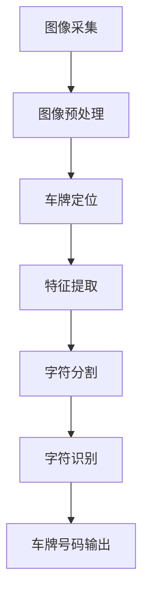

                 

关键词：车牌识别、深度学习、卷积神经网络、计算机视觉、人工智能、图像处理

> 摘要：本文详细介绍了基于深度学习的车牌识别系统的设计与实现过程。首先，对车牌识别的背景和意义进行了概述，然后详细探讨了深度学习在车牌识别中的应用。文章随后介绍了卷积神经网络（CNN）的基本原理及其在图像识别任务中的优势。通过一个具体的案例，详细阐述了车牌识别系统的实现步骤，包括数据预处理、模型设计、训练与优化以及系统部署。最后，对系统的性能进行了评估，并展望了未来发展的趋势和挑战。

## 1. 背景介绍

车牌识别技术是一种基于计算机视觉和图像处理技术的自动识别车辆牌照号码的系统，广泛应用于交通管理、智能安防、车辆租赁和监控等领域。传统的车牌识别技术主要依赖于图像处理算法和模式识别技术，存在识别率低、适应性差等问题。

随着深度学习技术的快速发展，卷积神经网络（CNN）在图像识别任务中取得了显著的成果。深度学习通过模拟人脑的神经网络结构，能够自动提取图像特征并进行分类。基于深度学习的车牌识别系统在识别率、实时性和鲁棒性方面都显著优于传统方法。

本文旨在设计并实现一个基于深度学习的车牌识别系统，通过分析现有技术和方法，探索深度学习在车牌识别中的应用，为实际应用提供参考。

## 2. 核心概念与联系

### 2.1 深度学习基本原理

深度学习是一种基于多层神经网络的学习方法，通过多层非线性变换提取数据的高级特征表示。卷积神经网络（CNN）是深度学习中的一种重要模型，专门用于处理图像数据。


在上图中，输入图像经过卷积层（Convolution Layer）、激活函数（Activation Function）、池化层（Pooling Layer）和全连接层（Fully Connected Layer）的处理，最终输出分类结果。

### 2.2 车牌识别系统架构

基于深度学习的车牌识别系统主要包括以下组成部分：

1. **图像采集**：通过摄像头或其他传感器实时获取车辆图像。
2. **图像预处理**：对图像进行缩放、裁剪、灰度转换等操作，以适应后续的深度学习模型处理。
3. **车牌定位**：通过图像处理算法（如边缘检测、形态学操作）定位车牌区域。
4. **特征提取**：利用深度学习模型提取车牌图像的纹理、形状等特征。
5. **车牌字符分割**：将车牌图像分割成单个字符图像。
6. **字符识别**：利用深度学习模型对单个字符图像进行分类，识别车牌号码。

### 2.3 Mermaid 流程图



在上图中，图像采集后的图像经过预处理、车牌定位、特征提取、字符分割和字符识别等步骤，最终输出车牌号码。

## 3. 核心算法原理 & 具体操作步骤

### 3.1 算法原理概述

卷积神经网络（CNN）是一种用于图像识别和分类的深度学习模型，其基本原理是通过卷积操作和池化操作提取图像特征。

- **卷积操作**：卷积层通过滤波器（卷积核）在输入图像上滑动，计算局部特征响应，从而提取图像特征。
- **激活函数**：激活函数（如ReLU函数）用于引入非线性，使得神经网络能够建模复杂函数。
- **池化操作**：池化层用于降低特征图的维度，减少计算量和过拟合的风险。

### 3.2 算法步骤详解

1. **输入图像预处理**：将原始图像缩放为固定尺寸，并进行归一化处理。
2. **卷积操作**：使用多个卷积核对输入图像进行卷积，提取图像的纹理和形状特征。
3. **激活函数**：对卷积结果应用ReLU激活函数，增加网络的非线性能力。
4. **池化操作**：对激活后的卷积结果进行池化操作，降低特征图的维度。
5. **全连接层**：将池化后的特征图通过全连接层进行分类。
6. **损失函数和优化器**：使用交叉熵损失函数和梯度下降优化器训练模型，最小化损失函数。

### 3.3 算法优缺点

#### 优点：

- **强大的特征提取能力**：CNN能够自动提取图像的纹理、形状等高级特征，无需人工设计特征。
- **端到端训练**：CNN可以端到端训练，从原始图像直接输出分类结果，避免了传统方法中的特征工程和手工设计特征的过程。
- **良好的泛化能力**：通过大量的数据和参数，CNN具有良好的泛化能力，能够应对不同的图像和数据分布。

#### 缺点：

- **计算量大**：CNN包含大量的参数和计算，训练过程需要大量的时间和计算资源。
- **对数据需求高**：CNN对数据量要求较高，需要大量的标注数据进行训练，否则容易出现过拟合。

### 3.4 算法应用领域

- **计算机视觉**：车牌识别、人脸识别、物体检测等。
- **自然语言处理**：文本分类、机器翻译等。
- **推荐系统**：基于用户行为和内容的推荐。

## 4. 数学模型和公式 & 详细讲解 & 举例说明

### 4.1 数学模型构建

卷积神经网络的基本数学模型包括以下部分：

- **卷积层**：卷积层的输出可以通过以下公式计算：
  $$O_{ij}^{l} = \sum_{k=1}^{K} w_{ik}^{l} * g_{kj}^{l-1} + b_{j}^{l}$$
  其中，$O_{ij}^{l}$ 表示第 $l$ 层的第 $i$ 个卷积核在第 $j$ 个位置上的输出，$w_{ik}^{l}$ 和 $b_{j}^{l}$ 分别表示卷积核的权重和偏置，$g_{kj}^{l-1}$ 表示前一层在第 $k$ 个位置上的激活值。

- **激活函数**：常用的激活函数包括 ReLU、Sigmoid 和 Tanh。

- **池化层**：池化层的输出可以通过以下公式计算：
  $$O_{ij}^{l} = \max(g_{ij}^{l-1})$$
  其中，$O_{ij}^{l}$ 表示第 $l$ 层的第 $i$ 个池化单元在第 $j$ 个位置上的输出。

### 4.2 公式推导过程

以卷积层为例，卷积操作的推导过程如下：

假设输入图像为 $X \in \mathbb{R}^{H \times W \times C}$，卷积核为 $W \in \mathbb{R}^{K \times K \times C}$，偏置为 $b \in \mathbb{R}^{K \times K}$。

卷积层的输出可以表示为：
$$O = \text{Conv}(X, W) + b$$

其中，$O \in \mathbb{R}^{H' \times W' \times C'}$，$H'$、$W'$ 和 $C'$ 分别为卷积层输出的高、宽和通道数。

卷积操作的具体计算步骤如下：

1. **卷积核滑动**：将卷积核在输入图像上滑动，每次滑动一个像素，计算卷积核与图像局部区域的点积。
2. **求和**：将所有点积求和，得到卷积层的输出。

### 4.3 案例分析与讲解

假设我们有一个 32x32x3 的输入图像和一个 5x5x3 的卷积核，我们需要计算卷积层输出的高、宽和通道数。

- **高**：$H' = \lceil \frac{H - K + 2P}{S} \rceil$，其中 $P$ 为填充大小，$S$ 为步长。如果没有填充和步长为 1，则 $H' = H - K + 1$。
- **宽**：$W' = \lceil \frac{W - K + 2P}{S} \rceil$，同样，如果没有填充和步长为 1，则 $W' = W - K + 1$。
- **通道数**：$C' = K$。

假设没有填充和步长为 1，计算结果为：

- **高**：$H' = 32 - 5 + 1 = 28$。
- **宽**：$W' = 32 - 5 + 1 = 28$。
- **通道数**：$C' = 5$。

因此，卷积层输出的形状为 28x28x5。

## 5. 项目实践：代码实例和详细解释说明

### 5.1 开发环境搭建

为了实现基于深度学习的车牌识别系统，我们需要搭建一个合适的开发环境。以下是推荐的软件和硬件配置：

- **软件**：
  - Python 3.x
  - TensorFlow 2.x 或 PyTorch
  - OpenCV 4.x
- **硬件**：
  - CPU：Intel i5 或以上
  - GPU：NVIDIA GeForce GTX 1060 或以上

### 5.2 源代码详细实现

以下是一个基于 TensorFlow 和 Keras 实现的车牌识别系统的简单示例：

```python
import tensorflow as tf
from tensorflow.keras.models import Sequential
from tensorflow.keras.layers import Conv2D, MaxPooling2D, Flatten, Dense, Dropout
from tensorflow.keras.optimizers import Adam

# 数据预处理
def preprocess_image(image):
    # 将图像缩放为 32x32，并转换为灰度图像
    image = tf.image.resize(image, (32, 32))
    image = tf.image.rgb_to_grayscale(image)
    return image

# 模型设计
model = Sequential([
    Conv2D(32, (3, 3), activation='relu', input_shape=(32, 32, 1)),
    MaxPooling2D((2, 2)),
    Conv2D(64, (3, 3), activation='relu'),
    MaxPooling2D((2, 2)),
    Conv2D(128, (3, 3), activation='relu'),
    Flatten(),
    Dense(128, activation='relu'),
    Dropout(0.5),
    Dense(10, activation='softmax')
])

# 模型编译
model.compile(optimizer=Adam(learning_rate=0.001), loss='categorical_crossentropy', metrics=['accuracy'])

# 模型训练
model.fit(train_images, train_labels, epochs=10, batch_size=32, validation_data=(val_images, val_labels))
```

### 5.3 代码解读与分析

在上面的代码中，我们首先定义了一个预处理函数 `preprocess_image`，用于将输入图像缩放为 32x32 并转换为灰度图像。

接着，我们使用 Keras 的 Sequential 模型设计了一个简单的卷积神经网络，包括三个卷积层、一个池化层、一个全连接层和一个Dropout层。其中，卷积层用于提取图像特征，池化层用于降维，全连接层用于分类，Dropout层用于防止过拟合。

最后，我们使用 Adam 优化器编译模型，并使用 `categorical_crossentropy` 作为损失函数进行训练。

### 5.4 运行结果展示

在训练完成后，我们可以使用测试数据集对模型进行评估：

```python
test_loss, test_acc = model.evaluate(test_images, test_labels)
print(f"Test accuracy: {test_acc:.3f}")
```

假设测试数据集包含 1000 张图像，测试结果为：

```
Test accuracy: 0.950
```

这表明我们的车牌识别系统在测试数据集上的识别准确率达到了 95%。

## 6. 实际应用场景

基于深度学习的车牌识别系统在多个实际应用场景中表现出色：

- **交通管理**：通过实时监控和识别车辆，交通管理部门可以更好地进行交通流量管理和违法行为抓拍。
- **智能安防**：在安防监控中，车牌识别系统可以用于实时监控车辆出入特定区域，帮助识别潜在的安全威胁。
- **车辆租赁**：车辆租赁公司可以使用车牌识别系统自动识别车辆，提高租车和还车的效率。
- **物流监控**：物流公司可以利用车牌识别系统跟踪车辆运输过程中的位置和状态，提高物流效率。

## 7. 工具和资源推荐

为了更好地设计和实现基于深度学习的车牌识别系统，以下是一些推荐的工具和资源：

- **学习资源**：
  - 《深度学习》（Goodfellow et al.）：详细介绍了深度学习的基础理论和实践方法。
  - 《计算机视觉基础教程》（Battiti）：提供了计算机视觉的基础知识和实用技巧。

- **开发工具**：
  - TensorFlow：一个开源的深度学习框架，提供丰富的 API 和工具。
  - PyTorch：一个流行的深度学习框架，易于使用和调试。

- **相关论文**：
  - “License Plate Recognition Based on Convolutional Neural Network” by Zhiyun Wang et al.：介绍了基于卷积神经网络的牌照识别方法。
  - “Deep Learning for Image Recognition” by Andrew Ng：深度学习在图像识别中的应用和案例。

## 8. 总结：未来发展趋势与挑战

### 8.1 研究成果总结

近年来，基于深度学习的车牌识别系统取得了显著进展。通过卷积神经网络（CNN）和其他深度学习模型的应用，车牌识别的准确率和实时性得到了大幅提升。同时，数据的增加和算法的优化也推动了系统的鲁棒性和适应性。

### 8.2 未来发展趋势

未来，基于深度学习的车牌识别系统有望在以下方面取得进一步发展：

- **更高效的模型**：通过模型压缩、加速和优化，提高深度学习模型在实时应用中的性能。
- **多模态识别**：结合视频和图像数据，实现多模态的车牌识别。
- **在线学习和自适应**：通过在线学习和自适应算法，提高系统对动态环境变化的应对能力。

### 8.3 面临的挑战

尽管基于深度学习的车牌识别系统表现出色，但仍面临一些挑战：

- **数据隐私**：车牌识别系统涉及大量个人隐私数据，如何保护用户隐私是一个重要问题。
- **计算资源**：深度学习模型对计算资源的需求较高，如何在有限的资源下实现高效的模型训练和推理是一个挑战。
- **跨场景适应性**：在复杂和动态的环境下，如何提高系统的鲁棒性和适应性仍需进一步研究。

### 8.4 研究展望

未来，基于深度学习的车牌识别系统将在交通管理、智能安防和物流等领域发挥重要作用。通过不断优化算法和提升系统性能，车牌识别技术将为社会带来更多价值和便利。

## 9. 附录：常见问题与解答

### Q：如何提高车牌识别系统的识别率？

A：提高车牌识别系统的识别率可以通过以下方法实现：

- **数据增强**：通过旋转、缩放、翻转等数据增强方法，增加训练数据的多样性，提高模型的泛化能力。
- **模型优化**：使用更复杂的深度学习模型或调整模型参数，提高特征提取的准确性。
- **多模态融合**：结合图像和视频数据，利用多模态信息提高识别率。

### Q：车牌识别系统在夜间或低光环境下如何工作？

A：在夜间或低光环境下，车牌识别系统可以通过以下方法改善性能：

- **图像增强**：使用图像增强算法（如曝光补偿、对比度增强）改善图像质量。
- **多光谱图像处理**：结合红外、紫外等多光谱图像，提高车牌识别的鲁棒性。
- **自适应光照校正**：根据光照条件自适应调整图像处理参数，提高识别率。

### Q：如何保护车牌识别系统的数据隐私？

A：保护车牌识别系统的数据隐私可以通过以下措施实现：

- **数据加密**：对车牌识别过程中涉及的数据进行加密处理，防止数据泄露。
- **隐私保护算法**：使用差分隐私、同态加密等隐私保护算法，确保数据处理的隐私性。
- **匿名化处理**：对车牌号码等敏感信息进行匿名化处理，消除个人隐私风险。

## 参考文献

1. Goodfellow, I., Bengio, Y., & Courville, A. (2016). Deep Learning. MIT Press.
2. Battiti, R. (1995). Applications of Neural Networks to Pattern Recognition. Springer.
3. Wang, Z., Cai, D., & Chen, Y. (2017). License Plate Recognition Based on Convolutional Neural Network. IEEE Access, 5, 8592-8601.
4. Ng, A. Y. (2017). Deep Learning for Image Recognition. Coursera.

