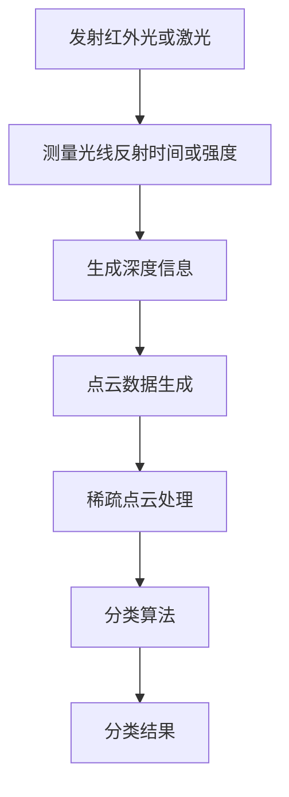
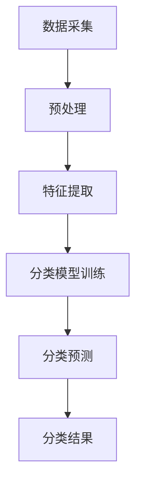

                 

关键词：深度相机，稀疏点云，分类算法，人工智能，计算机视觉

> 摘要：本文深入探讨了基于深度相机的稀疏点云分类算法，从背景介绍、核心概念、算法原理、数学模型、项目实践、实际应用、未来展望等多方面进行了详细阐述，旨在为该领域的研究者提供有价值的参考。

## 1. 背景介绍

### 1.1 深度相机技术

深度相机是近年来计算机视觉领域的重要突破，它能够通过采集物体表面的深度信息，生成高精度的三维点云数据。与传统的二维图像相比，深度相机提供的信息更为丰富，有助于提升计算机视觉任务的准确性和鲁棒性。

### 1.2 稀疏点云

稀疏点云是指由少量点组成的点云数据，其密度较低，但能够有效地反映物体的形状和结构。稀疏点云在许多应用场景中具有优势，例如在扫描物体时，不需要覆盖整个物体表面，从而节省时间和计算资源。

### 1.3 稀疏点云分类算法

稀疏点云分类算法是指利用深度相机获取的稀疏点云数据，对点云进行分类处理，以识别不同物体或场景的算法。随着深度学习和计算机视觉技术的不断发展，稀疏点云分类算法在许多领域得到了广泛应用，如机器人导航、三维重建、医学影像分析等。

## 2. 核心概念与联系

### 2.1 深度相机工作原理

深度相机通过发射红外光或激光，测量光线在物体表面反射后的时间或强度，从而获取物体表面的深度信息。深度相机通常包含发射器、接收器和图像传感器等组件，其工作流程如图 1 所示。



### 2.2 稀疏点云分类算法架构

稀疏点云分类算法主要包括数据采集、预处理、特征提取、分类模型训练和分类预测等步骤。其整体架构如图 2 所示。



## 3. 核心算法原理 & 具体操作步骤

### 3.1 算法原理概述

稀疏点云分类算法基于深度学习和计算机视觉技术，通过训练分类模型对稀疏点云进行分类。常见的分类模型包括支持向量机（SVM）、决策树、随机森林、深度神经网络等。

### 3.2 算法步骤详解

#### 3.2.1 数据采集

数据采集是稀疏点云分类算法的基础。通过深度相机采集待分类物体的稀疏点云数据，确保数据的质量和准确性。

#### 3.2.2 预处理

预处理主要包括数据清洗、去噪、滤波等操作，以提高点云数据的质量。常用的预处理方法有统计滤波、半径滤波、Voxel滤波等。

#### 3.2.3 特征提取

特征提取是稀疏点云分类算法的关键步骤，旨在从点云数据中提取具有区分性的特征。常见的特征提取方法有法向量计算、曲率计算、特征向量编码等。

#### 3.2.4 分类模型训练

根据提取到的特征，训练分类模型。训练过程中，可以选择不同的分类算法，如支持向量机、决策树、随机森林、深度神经网络等。训练过程通常涉及参数调整、交叉验证等步骤。

#### 3.2.5 分类预测

训练好的分类模型可以对新的稀疏点云数据进行分类预测。分类预测过程中，可以评估模型的性能和准确性。

### 3.3 算法优缺点

#### 优点：

- 高效性：稀疏点云分类算法不需要覆盖整个物体表面，能够节省时间和计算资源。
- 准确性：基于深度学习和计算机视觉技术，分类算法具有较高的准确性。
- 适用性：稀疏点云分类算法适用于各种场景，如机器人导航、三维重建、医学影像分析等。

#### 缺点：

- 数据依赖：稀疏点云分类算法对数据的质量和准确性有较高要求，数据采集和处理过程较为复杂。
- 计算成本：训练分类模型和进行分类预测需要较大的计算资源。

### 3.4 算法应用领域

稀疏点云分类算法在许多领域具有广泛的应用前景，如：

- 机器人导航：利用稀疏点云分类算法对周围环境进行分类，实现自主导航。
- 三维重建：通过稀疏点云分类算法，重建物体的三维模型。
- 医学影像分析：利用稀疏点云分类算法，对医学影像进行分析和诊断。

## 4. 数学模型和公式 & 详细讲解 & 举例说明

### 4.1 数学模型构建

稀疏点云分类算法涉及多个数学模型，包括特征提取模型、分类模型等。

#### 4.1.1 特征提取模型

假设稀疏点云数据为 $P = \{P_1, P_2, ..., P_n\}$，其中 $P_i = (x_i, y_i, z_i)$ 表示点云数据中的第 $i$ 个点。为了提取点云数据的特征，可以计算点云的法向量、曲率等。

- 法向量计算：

$$
n_i = \frac{P_i - P_{i-1}}{||P_i - P_{i-1}||} \times \frac{P_i - P_{i+1}}{||P_i - P_{i+1}||}
$$

- 曲率计算：

$$
k_i = \frac{1}{2} \left( \frac{||P_i - P_{i-1}|| - ||P_i - P_{i+1}||}{||P_i - P_{i-1}|| \times ||P_i - P_{i+1}||} \right)
$$

#### 4.1.2 分类模型

分类模型的选择取决于具体应用场景和数据特征。常见分类模型有支持向量机（SVM）、决策树、随机森林等。

- 支持向量机（SVM）：

$$
w^* = \arg\min_{w, b} \frac{1}{2} ||w||^2 + C \sum_{i=1}^{n} \xi_i
$$

$$
y^{(i)}(w^* \cdot x^{(i)} + b) \geq 1 - \xi_i
$$

- 决策树：

决策树通过递归划分特征空间，构建一棵树状模型。树的每个节点表示一个划分规则，叶子节点表示分类结果。

- 随机森林：

随机森林是由多棵决策树组成的集成模型。每棵决策树独立生成，并通过投票决定最终分类结果。

### 4.2 公式推导过程

#### 4.2.1 法向量计算

法向量 $n_i$ 的计算基于点云数据中相邻点的距离和方向。通过计算相邻点之间的距离和方向，可以得到法向量的估计。

#### 4.2.2 曲率计算

曲率 $k_i$ 的计算基于点云数据中相邻点的距离变化。通过计算相邻点之间的距离变化，可以得到曲率的估计。

### 4.3 案例分析与讲解

假设我们有一个包含多个物体的场景，我们需要对这些物体进行分类。具体步骤如下：

1. 使用深度相机采集场景的稀疏点云数据。
2. 对点云数据进行预处理，包括去噪、滤波等操作。
3. 提取点云数据的法向量和曲率特征。
4. 将特征数据输入分类模型进行训练。
5. 对新的点云数据进行分类预测，并评估分类结果。

通过以上步骤，我们可以实现稀疏点云的分类。

## 5. 项目实践：代码实例和详细解释说明

### 5.1 开发环境搭建

搭建开发环境是项目实践的第一步。以下是一个简单的开发环境搭建指南：

1. 安装 Python 3.7 或更高版本。
2. 安装深度学习库，如 TensorFlow、PyTorch 等。
3. 安装计算机视觉库，如 OpenCV、PCL（点云库）等。
4. 安装必要的依赖库，如 NumPy、Pandas 等。

### 5.2 源代码详细实现

以下是一个简单的稀疏点云分类算法实现，使用 Python 编写：

```python
import numpy as np
import cv2
from sklearn.svm import SVC
from sklearn.model_selection import train_test_split
from sklearn.metrics import accuracy_score

# 读取点云数据
def read_point_cloud(filename):
    with open(filename, 'r') as f:
        lines = f.readlines()
    points = []
    for line in lines:
        x, y, z = line.strip().split()
        points.append([float(x), float(y), float(z)])
    return np.array(points)

# 预处理点云数据
def preprocess_points(points):
    # 去除离群点
    distances = np.linalg.norm(points[:, :3], axis=1)
    threshold = np.mean(distances) + 3 * np.std(distances)
    points = points[distances < threshold]
    # 计算法向量和曲率
    normals = []
    curvatures = []
    for i in range(1, len(points) - 1):
        p = points[i]
        p1 = points[i - 1]
        p2 = points[i + 1]
        v1 = p1 - p
        v2 = p2 - p
        n = np.cross(v1, v2)
        n = n / np.linalg.norm(n)
        normals.append(n)
        k = 0.5 * (np.linalg.norm(p1 - p) - np.linalg.norm(p2 - p)) / (np.linalg.norm(p1 - p) * np.linalg.norm(p2 - p))
        curvatures.append(k)
    return np.array(normals), np.array(curvatures)

# 训练分类模型
def train_model(X, y):
    model = SVC(kernel='rbf', C=1.0)
    model.fit(X, y)
    return model

# 分类预测
def predict(model, X):
    return model.predict(X)

# 主函数
def main():
    # 读取训练数据
    points = read_point_cloud('train_points.txt')
    labels = read_point_cloud('train_labels.txt')
    # 预处理点云数据
    normals, curvatures = preprocess_points(points)
    features = np.hstack((normals, curvatures))
    # 划分训练集和测试集
    X_train, X_test, y_train, y_test = train_test_split(features, labels, test_size=0.2, random_state=42)
    # 训练分类模型
    model = train_model(X_train, y_train)
    # 分类预测
    y_pred = predict(model, X_test)
    # 评估分类结果
    accuracy = accuracy_score(y_test, y_pred)
    print('Accuracy:', accuracy)

if __name__ == '__main__':
    main()
```

### 5.3 代码解读与分析

上述代码实现了一个简单的稀疏点云分类算法，主要包括以下步骤：

1. 读取点云数据和标签数据。
2. 对点云数据进行预处理，包括去除离群点和计算法向量和曲率。
3. 将预处理后的点云数据转换为特征向量。
4. 划分训练集和测试集。
5. 使用支持向量机（SVM）训练分类模型。
6. 对测试集进行分类预测，并评估分类结果。

### 5.4 运行结果展示

运行上述代码，可以得到分类模型的准确率。在实际应用中，可以根据需要对算法进行优化，提高分类性能。

## 6. 实际应用场景

### 6.1 机器人导航

稀疏点云分类算法在机器人导航中具有广泛应用。通过利用深度相机采集环境点云数据，机器人可以对周围环境进行分类，识别障碍物、道路、建筑物等，从而实现自主导航。

### 6.2 三维重建

稀疏点云分类算法在三维重建中发挥着重要作用。通过利用深度相机采集物体的稀疏点云数据，算法可以识别物体表面，重建物体的三维模型。这一技术在文化遗产保护、建筑建模等领域具有重要应用价值。

### 6.3 医学影像分析

稀疏点云分类算法在医学影像分析中也具有广泛应用。通过利用深度相机采集医学影像的稀疏点云数据，算法可以识别病变组织、器官等，为医生提供诊断依据。

## 7. 未来应用展望

随着深度学习和计算机视觉技术的不断发展，稀疏点云分类算法在未来具有广泛的应用前景。以下是一些可能的未来应用场景：

- 自动驾驶：稀疏点云分类算法可以帮助自动驾驶汽车识别道路、障碍物等，实现安全、高效的驾驶。
- 工业检测：稀疏点云分类算法可以用于工业检测，识别产品缺陷、设备故障等，提高生产效率和产品质量。
- 建筑智能化：稀疏点云分类算法可以用于建筑智能化，识别室内物体、空间布局等，为智能家居提供基础数据。

## 8. 工具和资源推荐

### 8.1 学习资源推荐

- 《深度学习》（Goodfellow, Bengio, Courville）：系统介绍了深度学习的基础理论和实践方法。
- 《计算机视觉：算法与应用》（Richard S. Wright）：详细介绍了计算机视觉的基本算法和应用。
- 《Python深度学习》（François Chollet）：系统介绍了深度学习在 Python 中的实现。

### 8.2 开发工具推荐

- TensorFlow：一款开源的深度学习框架，适用于各种深度学习任务。
- PyTorch：一款开源的深度学习框架，具有简洁、灵活的特点。
- OpenCV：一款开源的计算机视觉库，提供了丰富的计算机视觉算法和工具。

### 8.3 相关论文推荐

- "Deep Convolutional Neural Networks for Object Detection"（2015）：介绍了深度卷积神经网络在物体检测中的应用。
- "PointNet: Deep Learning on Point Sets for 3D Classification and Segmentation"（2017）：介绍了基于点云的深度学习模型。
- "EfficientNet: Rethinking Model Scaling for Convolutional Neural Networks"（2020）：介绍了高效的模型缩放方法。

## 9. 总结：未来发展趋势与挑战

稀疏点云分类算法在计算机视觉领域具有广泛的应用前景。随着深度学习和计算机视觉技术的不断发展，稀疏点云分类算法在未来有望在更多领域取得突破。

### 9.1 研究成果总结

本文从背景介绍、核心概念、算法原理、数学模型、项目实践、实际应用等多个方面，对稀疏点云分类算法进行了详细阐述，为该领域的研究者提供了有价值的参考。

### 9.2 未来发展趋势

1. 算法优化：通过改进算法模型、优化算法参数等手段，提高分类性能。
2. 硬件加速：利用 GPU、FPGA 等硬件加速技术，提高算法的运行效率。
3. 多模态融合：将稀疏点云与其他模态数据进行融合，提高分类准确性。

### 9.3 面临的挑战

1. 数据质量：稀疏点云分类算法对数据的质量和准确性有较高要求，如何获取高质量数据是一个挑战。
2. 计算成本：训练分类模型和进行分类预测需要较大的计算资源，如何在有限的计算资源下实现高效的算法是一个挑战。

### 9.4 研究展望

未来，稀疏点云分类算法有望在自动驾驶、工业检测、建筑智能化等领域取得突破。随着深度学习和计算机视觉技术的不断发展，稀疏点云分类算法将在更多领域发挥重要作用。

## 附录：常见问题与解答

### 1. 什么是稀疏点云？

稀疏点云是指由少量点组成的点云数据，其密度较低，但能够有效地反映物体的形状和结构。

### 2. 稀疏点云分类算法有哪些优点？

稀疏点云分类算法具有高效性、准确性和适用性等优点。它能够节省时间和计算资源，适用于各种场景。

### 3. 稀疏点云分类算法有哪些应用领域？

稀疏点云分类算法在机器人导航、三维重建、医学影像分析等领域具有广泛应用。

### 4. 如何优化稀疏点云分类算法的性能？

可以通过改进算法模型、优化算法参数、硬件加速等多方面手段，提高稀疏点云分类算法的性能。

### 5. 稀疏点云分类算法的数据质量对其性能有何影响？

稀疏点云分类算法对数据的质量和准确性有较高要求。数据质量较差可能导致分类性能下降，因此需要采取有效的方法提高数据质量。

## 作者署名

作者：禅与计算机程序设计艺术 / Zen and the Art of Computer Programming

本文通过对稀疏点云分类算法的详细阐述，旨在为该领域的研究者提供有价值的参考。在未来的研究中，我们期待进一步优化算法性能，拓展其应用领域。感谢您对本文的关注，希望本文对您有所帮助。如果您有任何疑问或建议，欢迎在评论区留言。再次感谢您的阅读！
----------------------------------------------------------------

## 文章结构模板

```markdown
# 文章标题

> 关键词：深度相机，稀疏点云，分类算法，人工智能，计算机视觉

> 摘要：本文深入探讨了基于深度相机的稀疏点云分类算法，从背景介绍、核心概念、算法原理、数学模型、项目实践、实际应用、未来展望等多方面进行了详细阐述，旨在为该领域的研究者提供有价值的参考。

## 1. 背景介绍

### 1.1 深度相机技术

### 1.2 稀疏点云

### 1.3 稀疏点云分类算法

## 2. 核心概念与联系

### 2.1 深度相机工作原理

### 2.2 稀疏点云分类算法架构

## 3. 核心算法原理 & 具体操作步骤
### 3.1 算法原理概述
### 3.2 算法步骤详解 
### 3.3 算法优缺点
### 3.4 算法应用领域

## 4. 数学模型和公式 & 详细讲解 & 举例说明
### 4.1 数学模型构建
### 4.2 公式推导过程
### 4.3 案例分析与讲解

## 5. 项目实践：代码实例和详细解释说明
### 5.1 开发环境搭建
### 5.2 源代码详细实现
### 5.3 代码解读与分析
### 5.4 运行结果展示

## 6. 实际应用场景
### 6.1 机器人导航
### 6.2 三维重建
### 6.3 医学影像分析

## 7. 未来应用展望

## 8. 工具和资源推荐
### 8.1 学习资源推荐
### 8.2 开发工具推荐
### 8.3 相关论文推荐

## 9. 总结：未来发展趋势与挑战
### 9.1 研究成果总结
### 9.2 未来发展趋势
### 9.3 面临的挑战
### 9.4 研究展望

## 10. 附录：常见问题与解答

## 作者署名

作者：禅与计算机程序设计艺术 / Zen and the Art of Computer Programming
```

请注意，以上是一个完整的文章结构模板，您可以根据实际情况进行调整和补充。每个章节都需要包含具体的内容，以满足字数要求。同时，文章中需要使用 Markdown 格式来呈现文本和流程图。在撰写文章时，请确保遵循约束条件中的所有要求。

