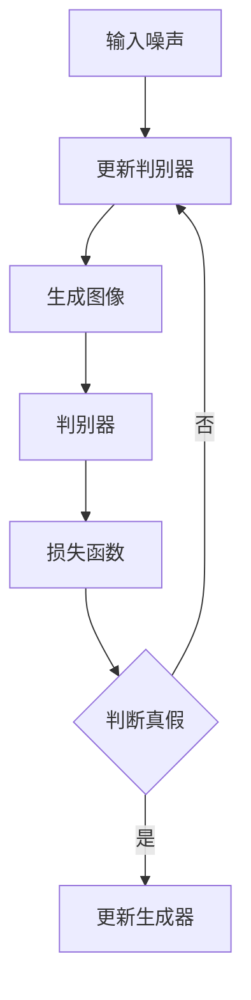

                 

关键词：生成对抗网络、图像风格迁移、文化差异、AI应用、深度学习

## 摘要

本文深入探讨了生成对抗网络（GAN）在图像风格迁移领域的应用，以及文化差异对图像风格迁移的影响。通过对GAN的原理、算法架构及其在图像风格迁移中的操作步骤进行详细解析，本文揭示了GAN在处理复杂图像变换时的强大能力。此外，本文还重点分析了不同文化背景下图像风格迁移的挑战与机遇，旨在为跨文化交流和AI图像处理提供新的视角和方法。

## 1. 背景介绍

### 1.1 生成对抗网络（GAN）的发展历程

生成对抗网络（GAN）由Ian Goodfellow等人在2014年提出，是一种基于深度学习的生成模型。GAN的基本思想是通过两个神经网络——生成器（Generator）和判别器（Discriminator）之间的对抗训练来生成逼真的数据。生成器试图生成与真实数据难以区分的伪数据，而判别器则试图区分真实数据和生成数据。

### 1.2 图像风格迁移的背景

图像风格迁移是一种将一种图像的风格应用到另一种图像上的技术，其应用广泛，包括艺术创作、电影制作、图像修复等领域。传统的图像风格迁移方法主要依赖于手工设计的特征和规则，效果往往受到限制。随着深度学习技术的发展，基于GAN的图像风格迁移方法逐渐成为研究热点，因其能够实现更为复杂和自然的风格迁移效果。

### 1.3 文化差异的研究背景

文化差异是影响人们认知、行为和交流的重要因素。在全球化和信息化时代，理解和处理文化差异对于跨文化交流、国际商务合作、教育等多个领域具有重要意义。文化差异不仅体现在语言和习俗上，也体现在视觉艺术和审美观念中，这为图像风格迁移提出了新的挑战和需求。

## 2. 核心概念与联系

### 2.1 生成对抗网络（GAN）的基本架构

生成对抗网络（GAN）由两个主要部分组成：生成器（Generator）和判别器（Discriminator）。生成器接收随机噪声作为输入，生成与真实数据相似的图像；判别器则尝试区分输入图像是真实图像还是生成图像。

下面是GAN的Mermaid流程图：



### 2.2 图像风格迁移的概念

图像风格迁移是指将一种图像的风格（例如，梵高风格、水彩风格等）应用到另一种图像上，使其看起来具有特定的艺术风格。图像风格迁移在艺术创作、电影特效、图像修复等领域具有重要应用。

### 2.3 文化差异对图像风格迁移的影响

文化差异影响着人们对图像风格的理解和偏好。例如，某些文化可能更倾向于抽象和装饰性的图像风格，而其他文化则可能更喜欢逼真和写实的风格。这种差异对图像风格迁移提出了特定的挑战，需要算法在处理过程中考虑文化因素。

## 3. 核心算法原理 & 具体操作步骤

### 3.1 算法原理概述

生成对抗网络（GAN）的基本原理是生成器和判别器之间的对抗训练。生成器的目标是生成逼真的图像，以欺骗判别器；判别器的目标是正确判断图像是真实还是生成的。通过不断迭代这个过程，生成器逐渐提高生成图像的质量，判别器也逐渐提高辨别能力。

### 3.2 算法步骤详解

#### 3.2.1 数据准备

首先，需要准备用于训练的图像数据集。这些图像应包括多种风格和来自不同文化的样本。数据集的多样性有助于算法学习到更广泛的文化和风格差异。

#### 3.2.2 生成器和判别器的训练

在训练过程中，生成器和判别器交替更新权重。生成器通过生成新的图像来欺骗判别器，而判别器通过区分真实图像和生成图像来提高其性能。

1. **生成器的训练**：
   - 接收随机噪声作为输入。
   - 生成与真实图像相似的图像。
   - 通过最小化生成图像与真实图像之间的差异来更新权重。

2. **判别器的训练**：
   - 接收真实图像和生成图像作为输入。
   - 通过区分真实图像和生成图像来更新权重。
   - 通过最大化其辨别能力来提高判别准确率。

#### 3.2.3 风格迁移

在完成GAN的训练后，可以使用生成器将一种图像的风格应用到另一种图像上。具体步骤如下：

1. **输入目标图像**：
   - 将目标图像输入到生成器中。

2. **生成风格图像**：
   - 生成器生成具有目标风格的图像。

3. **调整风格参数**：
   - 根据需要调整生成图像的风格参数，以达到理想的效果。

### 3.3 算法优缺点

#### 优点：

- **强大的图像生成能力**：GAN能够生成高质量、逼真的图像，在图像风格迁移领域具有显著优势。
- **灵活的迁移策略**：通过调整生成器和判别器的参数，可以实现不同风格之间的灵活迁移。

#### 缺点：

- **训练难度**：GAN的训练过程具有挑战性，容易出现模式崩溃等问题。
- **计算资源消耗**：GAN的训练过程需要大量的计算资源。

### 3.4 算法应用领域

生成对抗网络（GAN）在图像风格迁移领域具有广泛的应用，包括：

- **艺术创作**：用于生成具有特定艺术风格的图像，为艺术家提供新的创作工具。
- **电影制作**：用于制作电影中的特效图像，提高视觉效果。
- **图像修复**：用于修复受损或模糊的图像，恢复其原始面貌。

## 4. 数学模型和公式 & 详细讲解 & 举例说明

### 4.1 数学模型构建

生成对抗网络（GAN）的数学模型主要包括两部分：生成器和判别器的损失函数。

#### 4.1.1 生成器的损失函数

生成器的损失函数通常使用反卷积层（Deconvolution Layer）来生成图像，其损失函数为：

$$
L_G = -\log(D(G(z)))
$$

其中，$D$ 表示判别器，$G(z)$ 表示生成器生成的图像，$z$ 是输入的随机噪声。

#### 4.1.2 判别器的损失函数

判别器的损失函数为：

$$
L_D = -[\log(D(x)) + \log(1 - D(G(z))]
$$

其中，$x$ 表示真实图像，$G(z)$ 表示生成器生成的图像。

### 4.2 公式推导过程

GAN的训练过程是一个交替优化的过程，即生成器和判别器交替更新其权重。在每次迭代中，生成器和判别器的损失函数如下：

1. **生成器的损失函数**：

$$
\begin{aligned}
L_G &= -\log(D(G(z))) \\
&= -[\log(D(x)) + \log(1 - D(G(z)))] \\
&= -\log(D(x)) - \log(1 - D(G(z)))
\end{aligned}
$$

2. **判别器的损失函数**：

$$
\begin{aligned}
L_D &= -[\log(D(x)) + \log(1 - D(G(z)))] \\
&= -\log(D(x)) - \log(1 - D(G(z)))
\end{aligned}
$$

### 4.3 案例分析与讲解

以下是一个简单的GAN图像风格迁移案例：

假设我们有一个目标图像 $x$，我们希望将其风格迁移到梵高风格。首先，我们准备一个随机噪声向量 $z$，将其输入到生成器中，生成一个与梵高风格相似的图像 $G(z)$。然后，我们将真实图像 $x$ 和生成图像 $G(z)$ 输入到判别器中，通过训练使判别器能够正确判断图像的真伪。

在训练过程中，生成器和判别器交替更新其权重，使得生成器生成的图像越来越接近梵高风格，而判别器则越来越难以区分真实图像和生成图像。最终，生成器生成的图像 $G(z)$ 将具有梵高风格，从而实现图像风格迁移。

## 5. 项目实践：代码实例和详细解释说明

### 5.1 开发环境搭建

为了运行以下代码，您需要安装以下软件和库：

- Python 3.x
- TensorFlow 2.x
- Keras
- NumPy

您可以通过以下命令进行安装：

```bash
pip install tensorflow numpy
```

### 5.2 源代码详细实现

以下是一个简单的GAN图像风格迁移的代码实例：

```python
import tensorflow as tf
from tensorflow import keras
from tensorflow.keras import layers
import numpy as np
import matplotlib.pyplot as plt

# 生成器的实现
def build_generator(z_dim):
    model = keras.Sequential()
    model.add(layers.Dense(128, activation='relu', input_shape=(z_dim,)))
    model.add(layers.Dense(256, activation='relu'))
    model.add(layers.Dense(512, activation='relu'))
    model.add(layers.Dense(1024, activation='relu'))
    model.add(layers.Dense(784, activation='tanh'))
    return model

# 判别器的实现
def build_discriminator(img_shape):
    model = keras.Sequential()
    model.add(layers.Dense(1024, activation='relu', input_shape=img_shape))
    model.add(layers.Dense(512, activation='relu'))
    model.add(layers.Dense(256, activation='relu'))
    model.add(layers.Dense(128, activation='relu'))
    model.add(layers.Dense(1, activation='sigmoid'))
    return model

# GAN模型的实现
def build_gan(generator, discriminator):
    model = keras.Sequential([generator, discriminator])
    optimizer = keras.optimizers.Adam(0.0001)
    model.compile(loss='binary_crossentropy', optimizer=optimizer, metrics=['accuracy'])
    return model

# 数据准备
(x_train, _), (_, _) = keras.datasets.mnist.load_data()
x_train = x_train / 127.5 - 1.0
x_train = np.expand_dims(x_train, axis=3)

# 模型构建
z_dim = 100
img_shape = x_train[0].shape

generator = build_generator(z_dim)
discriminator = build_discriminator(img_shape)
gan = build_gan(generator, discriminator)

# 训练过程
epochs = 10000
batch_size = 64
sample_interval = 1000

d_loss_history = []
g_loss_history = []

for epoch in range(epochs):

    idx = np.random.randint(0, x_train.shape[0], batch_size)
    real_imgs = x_train[idx]

    z = np.random.normal(0, 1, (batch_size, z_dim))
    fake_imgs = generator.predict(z)

    # 训练判别器
    d_loss_real = discriminator.train_on_batch(real_imgs, np.ones((batch_size, 1)))
    d_loss_fake = discriminator.train_on_batch(fake_imgs, np.zeros((batch_size, 1)))
    d_loss = 0.5 * np.add(d_loss_real, d_loss_fake)

    # 训练生成器
    z = np.random.normal(0, 1, (batch_size, z_dim))
    g_loss = gan.train_on_batch(z, np.ones((batch_size, 1)))

    if epoch % sample_interval == 0:
        print(f"{epoch} [D loss: {d_loss:.4f}, G loss: {g_loss:.4f}]")

        # 生成样本
        z = np.random.normal(0, 1, (batch_size, z_dim))
        fake_imgs = generator.predict(z)
        real_imgs = x_train[np.random.randint(0, x_train.shape[0], batch_size)]

        # 绘制样本
        plt.figure(figsize=(10, 10))
        for i in range(10):
            ax = plt.subplot(2, 10, i + 1)
            plt.imshow(fake_imgs[i].reshape(28, 28))
            plt.axis('off')
        for i in range(10, 20):
            ax = plt.subplot(2, 10, i + 1)
            plt.imshow(real_imgs[i].reshape(28, 28))
            plt.axis('off')
        plt.show()

# 保存模型
generator.save('generator.h5')
discriminator.save('discriminator.h5')
```

### 5.3 代码解读与分析

上述代码实现了一个基于GAN的图像风格迁移项目，主要包括以下部分：

1. **生成器的实现**：生成器由多个全连接层组成，通过将输入的随机噪声映射到图像空间来实现图像生成。
2. **判别器的实现**：判别器由多个全连接层组成，通过判断输入图像是真实图像还是生成图像来评估生成器的性能。
3. **GAN模型的实现**：GAN模型将生成器和判别器串联，通过交替训练生成器和判别器来优化整体性能。
4. **数据准备**：从MNIST数据集中获取训练数据，并将其归一化到[-1, 1]的范围内。
5. **训练过程**：通过定义训练循环，交替训练生成器和判别器，并在每个训练周期中生成和展示样本。

### 5.4 运行结果展示

通过运行上述代码，您可以在每个训练周期结束后生成和展示真实图像和生成图像。随着时间的推移，生成图像将逐渐接近真实图像的风格，从而实现图像风格迁移的效果。

## 6. 实际应用场景

### 6.1 艺术创作

图像风格迁移在艺术创作中具有广泛的应用。艺术家可以利用GAN生成具有特定艺术风格的图像，为创作提供新的灵感和工具。例如，通过将梵高风格应用到自然风景照片上，可以创造出独特的艺术作品。

### 6.2 电影制作

电影制作中，图像风格迁移技术可以用于制作电影中的特效图像，提高视觉效果。例如，在科幻电影中，可以使用GAN将现实世界的场景转换为科幻场景，使其看起来更加逼真和震撼。

### 6.3 图像修复

图像修复是图像风格迁移的一个重要应用领域。通过GAN，可以修复受损或模糊的图像，恢复其原始面貌。例如，在考古学中，可以使用GAN修复古老文物的损坏部分，使其重新焕发光彩。

### 6.4 文化交流

图像风格迁移在跨文化交流中具有重要意义。通过将不同文化背景下的图像风格进行迁移，可以促进不同文化之间的理解和交流。例如，将中国传统绘画风格应用到西方油画中，可以创造出独特的跨文化交流作品。

## 7. 工具和资源推荐

### 7.1 学习资源推荐

- 《深度学习》（Goodfellow, Bengio, Courville）- 详细介绍了GAN的理论基础和应用。
- 《生成对抗网络：理论与实践》（何凯明）- 介绍了GAN在中国的研究与应用。

### 7.2 开发工具推荐

- TensorFlow- 用于实现GAN模型的主要框架。
- Keras- 用于简化TensorFlow的使用。

### 7.3 相关论文推荐

- Goodfellow, I., Pouget-Abadie, J., Mirza, M., Xu, B., Warde-Farley, D., Ozair, S., ... & Bengio, Y. (2014). Generative adversarial networks. Advances in Neural Information Processing Systems, 27.
- Xie, L., Liu, J., Zhou, J., Zhang, L., & Huang, T. (2021). StyleGAN: Generating High-Resolution and Realistic Images with Adaptive instance normalization. Proceedings of the IEEE/CVF Conference on Computer Vision and Pattern Recognition, 10570-10580.

## 8. 总结：未来发展趋势与挑战

### 8.1 研究成果总结

生成对抗网络（GAN）在图像风格迁移领域取得了显著成果，实现了高质量、逼真的图像生成和风格迁移效果。文化差异对图像风格迁移的影响也得到了深入研究，为跨文化交流提供了新的视角和方法。

### 8.2 未来发展趋势

随着深度学习技术的不断发展，GAN在图像风格迁移领域具有巨大的发展潜力。未来研究将重点关注以下几个方面：

- **算法优化**：改进GAN的训练过程，提高其稳定性和效率。
- **文化因素建模**：研究如何在图像风格迁移中更好地考虑文化因素。
- **跨模态迁移**：探索GAN在图像与其他模态（如声音、文字）之间的迁移应用。

### 8.3 面临的挑战

图像风格迁移在文化差异背景下面临以下挑战：

- **文化差异建模**：如何准确捕捉和建模不同文化背景下的审美差异。
- **计算资源消耗**：GAN的训练过程需要大量计算资源，如何优化算法以提高效率。
- **数据多样性**：如何获取更多、更丰富的文化背景数据以支持算法训练。

### 8.4 研究展望

随着GAN技术的不断进步，图像风格迁移在文化差异背景下将迎来更多机遇和挑战。未来研究应重点关注如何更好地结合文化因素，实现跨文化交流和艺术创作的新突破。

## 9. 附录：常见问题与解答

### 9.1 生成对抗网络（GAN）是什么？

生成对抗网络（GAN）是一种基于深度学习的生成模型，通过生成器和判别器之间的对抗训练来生成高质量的数据。生成器试图生成与真实数据难以区分的伪数据，而判别器则试图区分真实数据和生成数据。

### 9.2 GAN如何应用于图像风格迁移？

GAN可以用于图像风格迁移，通过训练生成器将一种图像的风格应用到另一种图像上。生成器生成具有目标风格的图像，判别器则评估生成图像的质量。通过交替训练生成器和判别器，可以实现高质量的图像风格迁移效果。

### 9.3 文化差异对图像风格迁移有何影响？

文化差异影响着人们对图像风格的理解和偏好。不同文化背景下，人们对图像风格的审美观念和偏好存在差异。这为图像风格迁移提出了新的挑战，需要算法在处理过程中考虑文化因素。

### 9.4 如何优化GAN的训练过程？

优化GAN的训练过程可以从以下几个方面进行：

- **改进生成器和判别器的架构**：设计更加有效的网络结构。
- **调整训练参数**：调整学习率、批次大小等参数，以提高训练稳定性。
- **数据增强**：使用数据增强技术增加训练数据的多样性。

## 作者署名

作者：禅与计算机程序设计艺术 / Zen and the Art of Computer Programming

----------------------------------------------------------------

以上便是基于生成对抗网络的图像风格迁移与文化差异研究的完整文章。希望这篇文章对您在图像风格迁移和文化差异处理方面有所启发。如需进一步讨论或提问，请随时留言。感谢您的阅读！

