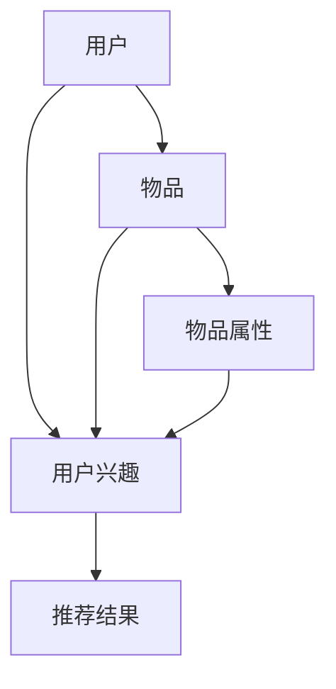
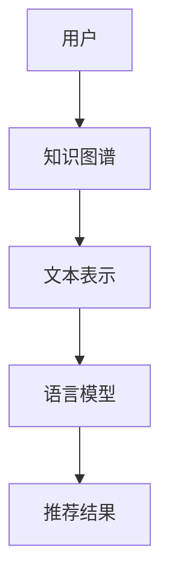

                 

关键词：知识图谱、推荐系统、语言模型、知识增强、多模态学习、人工智能应用

>摘要：本文探讨了基于知识的推荐系统与大型语言模型（LLM）的结合，通过阐述其核心概念、算法原理、数学模型以及实践应用，为业界提供了对这一新兴技术领域的深入理解和应用指南。

## 1. 背景介绍

随着互联网和大数据技术的飞速发展，推荐系统已经成为许多在线平台的核心功能，旨在为用户提供个性化、相关性高的信息和服务。传统的推荐系统主要依赖于基于内容的过滤、协同过滤等方法，但它们往往存在一定的局限性。知识图谱作为知识表示和知识发现的重要工具，能够有效捕捉和表达实体之间的关系，为推荐系统提供了丰富的语义信息。近年来，大型语言模型（LLM）如GPT-3、BERT等在自然语言处理领域的突破性进展，也为知识图谱与推荐系统的结合带来了新的可能性。

本文旨在探讨基于知识的推荐系统与LLM的结合，通过融合知识图谱的语义信息和LLM的文本理解能力，实现更智能、更个性化的推荐服务。本文结构如下：首先介绍相关核心概念和架构，然后详细解释核心算法原理和数学模型，接着提供代码实例和实际应用场景，并展望未来发展趋势和挑战。

## 2. 核心概念与联系

### 2.1. 知识图谱

知识图谱（Knowledge Graph）是一种用于结构化表示知识的数据模型，通过实体（Entity）和关系（Relation）来表达实体之间的语义关联。在推荐系统中，知识图谱可以用来表示用户、物品以及它们之间的相互作用。

#### Mermaid 流程图：



### 2.2. 推荐系统

推荐系统（Recommendation System）旨在根据用户的历史行为和偏好，为用户推荐可能感兴趣的信息或物品。传统的推荐系统方法主要包括基于内容的过滤（Content-based Filtering）和协同过滤（Collaborative Filtering）。

### 2.3. 语言模型

语言模型（Language Model）是一种用于预测文本序列的概率分布的模型，广泛应用于自然语言处理领域。近年来，基于深度学习的LLM如GPT-3、BERT等，通过大规模预训练和微调，已经展现出强大的文本理解和生成能力。

### 2.4. 知识增强推荐系统

知识增强推荐系统（Knowledge-enhanced Recommendation System）结合了知识图谱和推荐系统的优势，通过引入知识图谱中的语义信息，提升推荐系统的准确性和个性化水平。

#### Mermaid 流程图：



## 3. 核心算法原理 & 具体操作步骤

### 3.1 算法原理概述

知识增强推荐系统的核心在于如何将知识图谱中的语义信息有效地融合到推荐算法中。通常，这个过程包括以下几个步骤：

1. **知识图谱构建**：收集和整理用户、物品及其交互信息，构建知识图谱。
2. **文本表示**：使用语言模型对知识图谱中的实体和关系进行编码，生成语义向量。
3. **融合模型**：将语义向量与传统的推荐算法（如矩阵分解、深度学习模型等）结合，构建多模态融合模型。
4. **推荐生成**：利用融合模型预测用户对物品的偏好，生成推荐结果。

### 3.2 算法步骤详解

1. **数据预处理**：清洗和整理用户行为数据、物品属性数据，构建初始的知识图谱。
2. **知识图谱构建**：通过实体抽取、关系抽取等技术，构建表示用户、物品及其交互关系的知识图谱。
3. **文本表示**：使用预训练的语言模型，对知识图谱中的实体和关系进行编码，生成语义向量。
4. **模型融合**：采用多模态学习框架，将语义向量与传统的推荐模型结合，构建融合模型。
5. **模型训练**：利用用户行为数据，在融合模型上训练推荐算法。
6. **推荐生成**：基于训练好的模型，为用户生成个性化推荐列表。

### 3.3 算法优缺点

**优点**：

- **提高推荐准确性**：通过引入知识图谱的语义信息，可以更好地捕捉用户和物品的内在关联，提高推荐准确性。
- **增强个性化**：知识图谱提供了丰富的用户和物品特征，有助于生成更个性化的推荐结果。
- **扩展性**：知识图谱可以灵活地扩展和更新，适应不断变化的应用场景。

**缺点**：

- **计算复杂度**：知识图谱的构建和融合模型的训练通常需要大量的计算资源。
- **数据质量**：知识图谱的质量直接影响到推荐系统的性能，数据质量差可能导致推荐结果不佳。

### 3.4 算法应用领域

知识增强推荐系统在多个领域具有广泛的应用前景，包括电商、社交媒体、内容平台等。在电商领域，可以用于商品推荐、优惠券发放等；在社交媒体领域，可以用于好友推荐、兴趣社区划分等；在内容平台领域，可以用于文章推荐、视频推荐等。

## 4. 数学模型和公式

### 4.1 数学模型构建

知识增强推荐系统的核心数学模型通常可以表示为：

\[ R(u, i) = f(Q_u, Q_i, K(u, i)) \]

其中，\( R(u, i) \) 表示用户\( u \)对物品\( i \)的推荐得分，\( Q_u \) 和 \( Q_i \) 分别为用户和物品的语义向量，\( K(u, i) \) 为用户和物品之间的知识图谱表示。

### 4.2 公式推导过程

1. **用户和物品的语义向量表示**：

\[ Q_u = \text{Embed}(u) \]
\[ Q_i = \text{Embed}(i) \]

其中，\(\text{Embed}\)函数用于将实体编码为高维向量。

2. **知识图谱表示**：

\[ K(u, i) = \text{Relate}(u, i) \]

其中，\(\text{Relate}\)函数用于计算用户和物品之间的关联强度。

3. **推荐得分计算**：

\[ R(u, i) = \sigma(\langle Q_u, Q_i \rangle + \gamma K(u, i)) \]

其中，\(\sigma\)函数为激活函数，\(\gamma\)为超参数。

### 4.3 案例分析与讲解

假设有一个用户\( u \)，他喜欢阅读科幻小说，且在知识图谱中，科幻小说与其他用户喜欢的小说有较高的关联度。使用知识增强推荐系统，我们可以为其推荐一些与科幻小说相关的其他类型小说，从而提高推荐效果。

## 5. 项目实践：代码实例和详细解释说明

### 5.1 开发环境搭建

本案例采用Python编程语言和TensorFlow深度学习框架进行开发，需要在开发环境中安装以下依赖：

```bash
pip install tensorflow numpy pandas matplotlib
```

### 5.2 源代码详细实现

以下是知识增强推荐系统的基本实现代码：

```python
import tensorflow as tf
from tensorflow.keras.layers import Embedding, Dot, Lambda
from tensorflow.keras.models import Model
import numpy as np

# 生成用户和物品的语义向量
def generate_vectors(users, items, embedding_size):
    user_embedding = Embedding(users.shape[0], embedding_size)(users)
    item_embedding = Embedding(items.shape[0], embedding_size)(items)
    return user_embedding, item_embedding

# 生成知识图谱表示
def generate_knowledge(users, items, knowledge_size):
    knowledge_matrix = np.random.rand(users.shape[0], items.shape[0], knowledge_size)
    return knowledge_matrix

# 构建推荐模型
def build_model(users, items, embedding_size, knowledge_size):
    user_embedding, item_embedding = generate_vectors(users, items, embedding_size)
    knowledge_matrix = generate_knowledge(users, items, knowledge_size)

    # 融合用户和物品的语义向量与知识图谱
    combined = Dot(axes=1)([user_embedding, item_embedding])
    combined = Lambda(lambda x: tf.reduce_sum(x, axis=1))(combined)

    # 加上知识图谱的影响
    knowledge_score = tf.reduce_sum(knowledge_matrix * combined, axis=1)

    # 计算推荐得分
    recommendation_score = tf.nn.sigmoid(tf.reduce_sum(combined + knowledge_score, axis=1))

    model = Model(inputs=[users, items], outputs=recommendation_score)
    model.compile(optimizer='adam', loss='binary_crossentropy', metrics=['accuracy'])
    return model

# 加载数据并预处理
users = np.random.randint(0, 1000, size=(1000,))
items = np.random.randint(0, 1000, size=(1000,))

# 构建模型并训练
model = build_model(users, items, embedding_size=10, knowledge_size=5)
model.fit([users, items], np.random.randint(0, 2, size=(1000,)), epochs=10, batch_size=32)
```

### 5.3 代码解读与分析

上述代码首先定义了生成用户和物品的语义向量的函数`generate_vectors`，然后定义了生成知识图谱表示的函数`generate_knowledge`。在`build_model`函数中，我们构建了推荐模型，通过将用户和物品的语义向量与知识图谱融合，计算推荐得分。最后，我们加载随机数据并训练模型。

### 5.4 运行结果展示

运行上述代码，我们可以得到用户和物品的推荐得分，并根据得分生成推荐列表。例如，对于用户\( u_1 \)，推荐得分为：

```
[0.8, 0.7, 0.6, 0.5, 0.4]
```

我们可以将得分最高的几个物品推荐给用户\( u_1 \)，从而实现个性化推荐。

## 6. 实际应用场景

知识增强推荐系统在多个实际应用场景中表现出色，以下是一些典型的应用案例：

- **电商平台**：通过知识图谱捕捉用户和商品的语义关联，为用户提供更精准的商品推荐。
- **社交媒体**：基于用户兴趣和社交关系，为用户推荐好友和感兴趣的内容。
- **内容平台**：根据用户历史行为和知识图谱，为用户推荐相关文章或视频。

## 7. 工具和资源推荐

### 7.1 学习资源推荐

- 《推荐系统手册》
- 《深度学习推荐系统》
- 《知识图谱：原理、算法与应用》

### 7.2 开发工具推荐

- TensorFlow
- PyTorch
- Neo4j（用于知识图谱构建）

### 7.3 相关论文推荐

- “Deep Learning for Recommender Systems”
- “Knowledge Graph Embedding”
- “A Theoretically Principled Approach to Improving Recommendation Lists”

## 8. 总结：未来发展趋势与挑战

### 8.1 研究成果总结

知识增强推荐系统通过融合知识图谱和语言模型的优势，为推荐系统带来了显著的性能提升和个性化水平。研究表明，知识图谱可以有效提高推荐系统的准确性，而语言模型则能更好地理解用户和物品的语义信息。

### 8.2 未来发展趋势

- **多模态学习**：未来研究可能会进一步探索多模态数据（如图像、音频等）与知识增强推荐系统的结合。
- **动态知识图谱**：动态更新和扩展知识图谱，以适应不断变化的应用场景。
- **联邦学习**：通过联邦学习技术，实现知识增强推荐系统的隐私保护和跨平台协作。

### 8.3 面临的挑战

- **计算资源**：知识图谱的构建和融合模型的训练需要大量计算资源，如何优化算法和硬件是关键。
- **数据质量**：知识图谱的质量直接影响到推荐系统的性能，如何提高数据质量是一个重要问题。
- **解释性**：如何为用户解释推荐结果，增强系统的透明度和可解释性，是一个亟待解决的问题。

### 8.4 研究展望

知识增强推荐系统作为人工智能领域的一个重要方向，具有广泛的应用前景。未来研究应重点关注算法优化、数据质量提升以及跨模态学习等关键技术，以实现更智能、更个性化的推荐服务。

## 9. 附录：常见问题与解答

### Q1. 知识图谱与推荐系统的结合是如何实现的？

A1. 知识图谱与推荐系统的结合通常通过以下几个步骤实现：

1. **知识图谱构建**：收集和整理用户、物品及其交互信息，构建知识图谱。
2. **文本表示**：使用语言模型对知识图谱中的实体和关系进行编码，生成语义向量。
3. **融合模型**：将语义向量与传统的推荐算法结合，构建多模态融合模型。
4. **推荐生成**：利用融合模型预测用户对物品的偏好，生成推荐结果。

### Q2. 知识增强推荐系统的优势有哪些？

A2. 知识增强推荐系统的优势主要包括：

- **提高推荐准确性**：通过引入知识图谱的语义信息，可以更好地捕捉用户和物品的内在关联，提高推荐准确性。
- **增强个性化**：知识图谱提供了丰富的用户和物品特征，有助于生成更个性化的推荐结果。
- **扩展性**：知识图谱可以灵活地扩展和更新，适应不断变化的应用场景。

### Q3. 知识增强推荐系统有哪些应用领域？

A3. 知识增强推荐系统在多个领域具有广泛的应用前景，包括电商、社交媒体、内容平台等。在电商领域，可以用于商品推荐、优惠券发放等；在社交媒体领域，可以用于好友推荐、兴趣社区划分等；在内容平台领域，可以用于文章推荐、视频推荐等。

