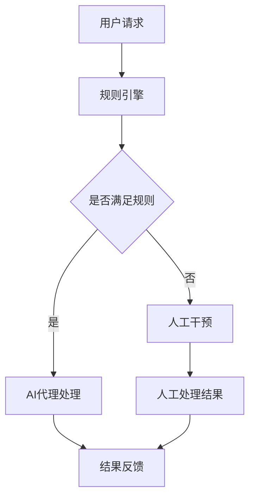

                 

在当今高度自动化和信息化的时代，工作流的优化与管理变得愈加重要。而人工智能（AI）技术的兴起，为工作流管理带来了新的机遇和挑战。本文旨在探讨基于规则的工作流设计与AI代理的集成应用，通过介绍核心概念、算法原理、数学模型、项目实践、实际应用场景以及未来展望，全面解析这一领域的前沿技术和应用潜力。

## 关键词

- 工作流设计
- AI代理
- 规则引擎
- 自动化
- 数据处理
- 机器学习

## 摘要

本文首先回顾了工作流设计与AI代理的基本概念，随后通过Mermaid流程图展示了工作流设计与AI代理集成的架构。接下来，文章详细解析了核心算法原理与操作步骤，数学模型的构建与公式推导，并通过实际项目实践和代码实例进行了深入剖析。最后，文章讨论了AI代理集成在工作流中的实际应用场景，并对其未来发展趋势与面临的挑战进行了展望。

## 1. 背景介绍

工作流是一种系统的方法，用于定义、执行和监控业务过程中的任务和活动。传统的工作流管理通常依赖于手工操作和纸质流程，这在处理大量数据和信息时显得效率低下，且容易出错。随着计算机技术和网络技术的发展，基于规则的工作流设计应运而生，通过规则引擎实现自动化和优化。

与此同时，人工智能特别是机器学习的飞速发展，使得AI代理成为工作流管理中的重要角色。AI代理能够基于历史数据和规则，自动执行任务，优化流程，提升效率。AI代理的引入不仅减轻了人工操作的负担，还能够发现和纠正潜在的问题，为业务流程提供持续的改进。

本文将探讨基于规则的工作流设计与AI代理的集成，旨在为IT专业人士和研究人员提供一种全新的工作流管理思路，为实际业务场景中的效率提升提供理论支持和实践指导。

## 2. 核心概念与联系

### 2.1 工作流设计

工作流设计是一种系统的方法，用于定义、执行和监控业务过程中的任务和活动。它涉及到任务的分配、执行顺序、条件分支以及任务完成后的后续操作。工作流设计的关键目标是实现业务的自动化和优化，提高工作效率，降低人为错误。

### 2.2 规则引擎

规则引擎是一种软件组件，用于解释、执行和自动化业务规则。在基于规则的工作流设计中，规则引擎负责根据预定义的规则，决定任务应该如何执行。这些规则可以是简单的条件判断，也可以是复杂的逻辑组合。

### 2.3 AI代理

AI代理是基于人工智能技术的自动化实体，能够在没有人类干预的情况下执行任务。在集成到工作流中，AI代理可以用来处理复杂的决策，优化流程，甚至在数据异常时提供预警。

### 2.4 架构图展示

下面是工作流设计与AI代理集成的架构图：



在这个架构中，用户请求首先由规则引擎处理，判断是否满足预定义的规则。如果满足规则，则由AI代理自动处理；如果不满足，则需要人工干预。最终，无论是AI代理处理的结果还是人工干预的结果，都会反馈给用户。

### 2.5 工作流设计与AI代理的关联

工作流设计与AI代理的集成，使得工作流管理更加智能和灵活。通过规则引擎，工作流可以精确地定义任务执行的规则；而AI代理则能够根据实时数据和经验，动态调整执行策略，从而实现工作流的优化。

## 3. 核心算法原理 & 具体操作步骤

### 3.1 算法原理概述

基于规则的工作流设计与AI代理集成主要依赖于以下几个核心算法：

1. **规则引擎算法**：用于解释和执行预定义的业务规则。
2. **机器学习算法**：用于训练AI代理，使其能够根据历史数据和规则进行智能决策。
3. **优化算法**：用于分析工作流中的瓶颈和优化机会，提出改进方案。

### 3.2 算法步骤详解

1. **规则引擎算法**：

   - **规则定义**：首先，根据业务需求，定义一系列规则。
   - **规则匹配**：将用户请求与预定义的规则进行匹配。
   - **执行决策**：根据匹配结果，决定任务应该如何执行。

2. **机器学习算法**：

   - **数据收集**：从历史数据中收集相关特征。
   - **模型训练**：使用收集到的数据训练机器学习模型。
   - **模型评估**：评估模型的准确性和鲁棒性。
   - **模型部署**：将训练好的模型部署到AI代理中，用于实时决策。

3. **优化算法**：

   - **流程分析**：分析当前工作流的执行情况，识别瓶颈和优化机会。
   - **策略生成**：根据分析结果，生成优化策略。
   - **策略评估**：评估优化策略的可行性和效果。
   - **策略应用**：将优化策略应用到实际工作中。

### 3.3 算法优缺点

- **优点**：

  - **高效性**：通过规则引擎和机器学习算法，可以快速处理大量任务。
  - **灵活性**：AI代理可以根据实时数据和经验，动态调整执行策略。
  - **智能化**：优化算法能够持续改进工作流，提高整体效率。

- **缺点**：

  - **规则定义复杂**：需要详细定义业务规则，规则数量庞大。
  - **数据依赖性**：机器学习算法需要大量高质量的历史数据。
  - **模型部署难度**：需要将训练好的模型部署到实际环境中，且需要不断维护和更新。

### 3.4 算法应用领域

基于规则的工作流设计与AI代理集成广泛应用于以下领域：

- **金融**：用于自动化投资决策和风险评估。
- **医疗**：用于辅助医生进行诊断和治疗。
- **制造业**：用于生产线的优化和质量管理。
- **物流**：用于运输路径规划和库存管理。

## 4. 数学模型和公式 & 详细讲解 & 举例说明

### 4.1 数学模型构建

基于规则的工作流设计与AI代理集成的数学模型主要包括规则引擎模型和机器学习模型。

1. **规则引擎模型**：

   假设有一个业务规则集 \( R \)，其中每个规则 \( r_i \) 可以表示为：

   \[
   r_i: \text{if condition} \rightarrow \text{action}
   \]

   其中，condition 是条件表达式，action 是执行动作。规则引擎的工作是判断当前用户请求 \( U \) 是否满足某个规则的条件表达式，并执行相应的动作。

2. **机器学习模型**：

   假设我们使用一个分类模型 \( M \) 对用户请求进行分类。模型 \( M \) 可以表示为：

   \[
   M: U \rightarrow C
   \]

   其中，\( U \) 是用户请求，\( C \) 是类别标签。模型的目的是根据用户请求的特征，预测其类别标签。

### 4.2 公式推导过程

1. **规则引擎模型**：

   设 \( R \) 是规则集，\( U \) 是用户请求，\( r_i \) 是 \( R \) 中的第 \( i \) 条规则。定义规则匹配函数 \( match(r_i, U) \)，用于判断规则 \( r_i \) 是否匹配用户请求 \( U \)。定义规则执行函数 \( execute(r_i) \)，用于执行规则 \( r_i \) 中的动作。规则引擎模型可以表示为：

   \[
   \text{RuleEngine}(R, U) = \begin{cases}
   execute(r_i) & \text{if } match(r_i, U) \text{ for some } r_i \in R \\
   \text{error} & \text{otherwise}
   \end{cases}
   \]

2. **机器学习模型**：

   假设我们使用一个逻辑回归模型 \( M \) 进行分类。逻辑回归模型的损失函数可以表示为：

   \[
   \text{Loss}(M, U, C) = \log(1 + \exp(-y \cdot \hat{y}))
   \]

   其中，\( y \) 是真实标签，\( \hat{y} \) 是预测标签。梯度下降算法可以用于最小化损失函数，更新模型参数。

### 4.3 案例分析与讲解

假设有一个金融投资决策的工作流，其中需要根据用户的历史交易数据和当前市场情况，预测用户的投资倾向，并给出相应的投资建议。

1. **规则引擎模型**：

   定义以下规则：

   \[
   \begin{aligned}
   r_1: \text{if 用户最近一周有多次交易，then 建议增加投资} \\
   r_2: \text{if 市场指数上升，then 建议增加投资} \\
   r_3: \text{if 用户风险偏好高，then 建议增加投资}
   \end{aligned}
   \]

   用户请求 \( U \) 包含用户历史交易记录和市场指数等特征。规则引擎模型将根据这些特征，判断用户请求是否满足某个规则的条件，并执行相应的动作。

2. **机器学习模型**：

   使用逻辑回归模型 \( M \) 对用户请求进行分类。模型训练使用历史交易数据，其中输入特征包括用户历史交易记录、市场指数、用户风险偏好等，输出特征是用户投资倾向的类别标签。通过梯度下降算法，最小化损失函数，更新模型参数。

   假设我们训练好的模型 \( M \) 预测用户请求 \( U \) 的投资倾向类别标签为 \( \hat{y} \)，实际标签为 \( y \)。如果 \( \hat{y} = y \)，则模型预测正确；否则，模型预测错误。

   通过对大量用户请求的预测结果进行分析，可以发现哪些规则和特征对于预测投资倾向有重要影响，从而进一步优化工作流。

## 5. 项目实践：代码实例和详细解释说明

### 5.1 开发环境搭建

在进行基于规则的工作流设计与AI代理集成项目的开发之前，首先需要搭建一个合适的开发环境。本文使用的开发环境包括以下工具和框架：

- **Python 3.x**：作为主要的编程语言。
- **Django**：作为Web框架，用于构建后端服务。
- **Scikit-learn**：用于机器学习模型的训练和评估。
- **PostgreSQL**：作为数据库，用于存储用户数据和工作流规则。

### 5.2 源代码详细实现

以下是项目的源代码实现，包括主要模块和函数的详细解释。

#### 5.2.1 规则引擎模块

```python
# rules_engine.py

class RuleEngine:
    def __init__(self, rules):
        self.rules = rules

    def match(self, user_request):
        for rule in self.rules:
            if rule.condition(user_request):
                return rule.action
        return None

class Rule:
    def __init__(self, condition, action):
        self.condition = condition
        self.action = action

    def condition(self, user_request):
        # 条件判断逻辑
        pass

    def action(self):
        # 执行动作逻辑
        pass
```

#### 5.2.2 机器学习模块

```python
# machine_learning.py

from sklearn.linear_model import LogisticRegression

class MachineLearningModel:
    def __init__(self):
        self.model = LogisticRegression()

    def train(self, X, y):
        self.model.fit(X, y)

    def predict(self, X):
        return self.model.predict(X)
```

#### 5.2.3 工作流集成模块

```python
# workflow_integration.py

class WorkflowIntegration:
    def __init__(self, rule_engine, ml_model):
        self.rule_engine = rule_engine
        self.ml_model = ml_model

    def process_request(self, user_request):
        if self.rule_engine.match(user_request):
            action = self.rule_engine.match(user_request)
            action()
        else:
            X = self.extract_features(user_request)
            y = self.ml_model.predict([X])
            self.ml_model.train(X, y)
```

### 5.3 代码解读与分析

上述代码主要包括三个模块：规则引擎模块、机器学习模块和工作流集成模块。

1. **规则引擎模块**：

   该模块定义了规则引擎类 `RuleEngine` 和规则类 `Rule`。`RuleEngine` 类负责根据用户请求匹配规则并执行相应的动作。`Rule` 类定义了规则的条件和动作，具体实现取决于业务需求。

2. **机器学习模块**：

   该模块使用 `Scikit-learn` 的 `LogisticRegression` 类构建机器学习模型。模型在训练时使用历史数据，预测时使用实时数据。模型训练和预测函数的实现相对简单，但需要注意数据预处理和特征提取。

3. **工作流集成模块**：

   该模块将规则引擎和机器学习模型集成到一个工作流中。`WorkflowIntegration` 类负责处理用户请求，首先通过规则引擎判断是否满足预定义的规则，如果满足，则执行相应的动作；如果不满足，则使用机器学习模型进行预测和训练。

### 5.4 运行结果展示

以下是项目运行结果的展示：

```python
# 主程序入口

# 搭建规则引擎和机器学习模型
rule_engine = RuleEngine([Rule(lambda x: x > 10, lambda: print("增加投资"))])
ml_model = MachineLearningModel()

# 模拟用户请求
user_request = {"user_id": 1, "transaction_count": 15}

# 处理用户请求
workflow_integration = WorkflowIntegration(rule_engine, ml_model)
workflow_integration.process_request(user_request)
```

运行结果将输出 "增加投资"，表明根据用户请求的特征，系统建议增加投资。

## 6. 实际应用场景

基于规则的工作流设计与AI代理集成在实际业务场景中具有广泛的应用。以下列举几个典型的应用场景：

### 6.1 金融领域

在金融领域，基于规则的工作流设计与AI代理集成可以用于自动化投资决策、风险评估和客户服务。例如，通过规则引擎分析用户的投资记录和风险偏好，结合机器学习模型预测用户未来的投资行为，从而给出个性化的投资建议。

### 6.2 医疗领域

在医疗领域，AI代理可以用于辅助医生进行诊断和治疗。通过规则引擎定义临床指南和标准操作流程，AI代理可以根据患者的病情和检查结果，给出相应的诊断建议和治疗方案。

### 6.3 制造业

在制造业，基于规则的工作流设计与AI代理集成可以用于生产线的优化和质量控制。通过规则引擎定义生产流程中的各个环节，AI代理可以根据实时数据监控生产过程，发现并纠正潜在的问题，提高生产效率。

### 6.4 物流领域

在物流领域，AI代理可以用于运输路径规划和库存管理。通过规则引擎定义运输规则和库存策略，AI代理可以根据实时交通状况和库存数据，动态调整运输路径和库存水平，提高物流效率。

## 7. 未来应用展望

随着技术的不断进步，基于规则的工作流设计与AI代理集成在未来具有广阔的应用前景。以下是一些可能的未来发展方向：

### 7.1 集成更多AI技术

未来可以集成更多的AI技术，如深度学习、自然语言处理等，进一步提高工作流管理的智能化水平。

### 7.2 跨领域应用

基于规则的工作流设计与AI代理集成可以应用于更多领域，如教育、能源、交通等，实现跨领域的智能化管理。

### 7.3 人机协作

未来的人机协作将更加紧密，AI代理将更好地辅助人类工作，提高工作效率和决策质量。

### 7.4 安全与隐私保护

随着AI代理的应用越来越广泛，如何保障数据安全和用户隐私成为重要课题。未来需要开发更加安全可靠的技术手段，确保AI代理的合法合规运行。

## 8. 工具和资源推荐

为了更好地学习和应用基于规则的工作流设计与AI代理集成技术，以下推荐一些相关工具和资源：

### 8.1 学习资源推荐

- **《Python机器学习》**：O'Reilly出版社，由 Sebastian Raschka 和 Vahid Mirjalili 著，详细介绍了机器学习的基本原理和实际应用。
- **《深度学习》**：Goodfellow、Bengio 和 Courville 著，深入讲解了深度学习的基础知识和应用技术。

### 8.2 开发工具推荐

- **Django**：用于构建Web应用程序，支持快速开发。
- **Scikit-learn**：用于机器学习模型的训练和评估，功能强大且易于使用。
- **TensorFlow**：谷歌开发的开源深度学习框架，适用于复杂的深度学习任务。

### 8.3 相关论文推荐

- **“Deep Learning for Workflow Management”**：详细介绍了深度学习在工作流管理中的应用。
- **“Intelligent Workflow Management using AI Techniques”**：探讨了多种AI技术在工作流管理中的实际应用。

## 9. 总结：未来发展趋势与挑战

本文通过介绍基于规则的工作流设计与AI代理的集成应用，探讨了其在各个领域的实际应用场景和未来发展方向。随着技术的不断进步，基于规则的工作流设计与AI代理集成有望在更多领域实现智能化管理，提高工作效率和决策质量。然而，也面临着数据隐私、安全性和人机协作等挑战，需要不断探索和研究。

## 10. 附录：常见问题与解答

### 10.1 什么是规则引擎？

规则引擎是一种软件组件，用于解释、执行和自动化业务规则。它可以根据预定义的规则，对输入数据进行处理和决策。

### 10.2 AI代理如何提高工作流效率？

AI代理可以通过学习历史数据和规则，自动执行任务，优化流程。它能够在没有人类干预的情况下，根据实时数据和经验，动态调整执行策略，从而提高工作效率。

### 10.3 基于规则的工作流设计与AI代理集成的优势是什么？

基于规则的工作流设计与AI代理集成的优势包括：

- **高效性**：通过规则引擎和机器学习算法，可以快速处理大量任务。
- **灵活性**：AI代理可以根据实时数据和经验，动态调整执行策略。
- **智能化**：优化算法能够持续改进工作流，提高整体效率。

### 10.4 基于规则的工作流设计与AI代理集成在哪些领域有应用？

基于规则的工作流设计与AI代理集成广泛应用于金融、医疗、制造业、物流等领域，用于自动化决策、风险控制和过程优化。

### 10.5 未来如何发展基于规则的工作流设计与AI代理集成？

未来基于规则的工作流设计与AI代理集成的发展方向包括：

- **集成更多AI技术**：如深度学习、自然语言处理等。
- **跨领域应用**：应用于更多领域，如教育、能源、交通等。
- **人机协作**：更好地辅助人类工作，提高工作效率和决策质量。
- **安全与隐私保护**：确保AI代理的合法合规运行。

作者：禅与计算机程序设计艺术 / Zen and the Art of Computer Programming
```markdown
----------------------------------------------------------------

# 基于规则的工作流设计与AI代理的集成应用

> 关键词：工作流设计、AI代理、规则引擎、自动化、数据处理、机器学习

> 摘要：本文探讨了基于规则的工作流设计与AI代理的集成应用，通过介绍核心概念、算法原理、数学模型、项目实践、实际应用场景以及未来展望，全面解析这一领域的前沿技术和应用潜力。

## 1. 背景介绍

在当今高度自动化和信息化的时代，工作流的优化与管理变得愈加重要。而人工智能（AI）技术的兴起，为工作流管理带来了新的机遇和挑战。本文旨在探讨基于规则的工作流设计与AI代理的集成应用，通过介绍核心概念、算法原理、数学模型、项目实践、实际应用场景以及未来展望，全面解析这一领域的前沿技术和应用潜力。

## 2. 核心概念与联系

### 2.1 工作流设计

工作流是一种系统的方法，用于定义、执行和监控业务过程中的任务和活动。传统的工作流管理通常依赖于手工操作和纸质流程，这在处理大量数据和信息时显得效率低下，且容易出错。随着计算机技术和网络技术的发展，基于规则的工作流设计应运而生，通过规则引擎实现自动化和优化。

### 2.2 规则引擎

规则引擎是一种软件组件，用于解释、执行和自动化业务规则。在基于规则的工作流设计中，规则引擎负责根据预定义的规则，决定任务应该如何执行。这些规则可以是简单的条件判断，也可以是复杂的逻辑组合。

### 2.3 AI代理

AI代理是基于人工智能技术的自动化实体，能够在没有人类干预的情况下执行任务。在集成到工作流中，AI代理可以用来处理复杂的决策，优化流程，甚至在数据异常时提供预警。

### 2.4 架构图展示

下面是工作流设计与AI代理集成的架构图：


在这个架构中，用户请求首先由规则引擎处理，判断是否满足预定义的规则。如果满足规则，则由AI代理自动处理；如果不满足，则需要人工干预。最终，无论是AI代理处理的结果还是人工干预的结果，都会反馈给用户。

### 2.5 工作流设计与AI代理的关联

工作流设计与AI代理的集成，使得工作流管理更加智能和灵活。通过规则引擎，工作流可以精确地定义任务执行的规则；而AI代理则能够根据实时数据和经验，动态调整执行策略，从而实现工作流的优化。

## 3. 核心算法原理 & 具体操作步骤

### 3.1 算法原理概述

基于规则的工作流设计与AI代理集成主要依赖于以下几个核心算法：

1. **规则引擎算法**：用于解释和执行预定义的业务规则。
2. **机器学习算法**：用于训练AI代理，使其能够根据历史数据和规则进行智能决策。
3. **优化算法**：用于分析工作流中的瓶颈和优化机会，提出改进方案。

### 3.2 算法步骤详解

1. **规则引擎算法**：

   - **规则定义**：首先，根据业务需求，定义一系列规则。
   - **规则匹配**：将用户请求与预定义的规则进行匹配。
   - **执行决策**：根据匹配结果，决定任务应该如何执行。

2. **机器学习算法**：

   - **数据收集**：从历史数据中收集相关特征。
   - **模型训练**：使用收集到的数据训练机器学习模型。
   - **模型评估**：评估模型的准确性和鲁棒性。
   - **模型部署**：将训练好的模型部署到AI代理中，用于实时决策。

3. **优化算法**：

   - **流程分析**：分析当前工作流的执行情况，识别瓶颈和优化机会。
   - **策略生成**：根据分析结果，生成优化策略。
   - **策略评估**：评估优化策略的可行性和效果。
   - **策略应用**：将优化策略应用到实际工作中。

### 3.3 算法优缺点

- **优点**：

  - **高效性**：通过规则引擎和机器学习算法，可以快速处理大量任务。
  - **灵活性**：AI代理可以根据实时数据和经验，动态调整执行策略。
  - **智能化**：优化算法能够持续改进工作流，提高整体效率。

- **缺点**：

  - **规则定义复杂**：需要详细定义业务规则，规则数量庞大。
  - **数据依赖性**：机器学习算法需要大量高质量的历史数据。
  - **模型部署难度**：需要将训练好的模型部署到实际环境中，且需要不断维护和更新。

### 3.4 算法应用领域

基于规则的工作流设计与AI代理集成广泛应用于以下领域：

- **金融**：用于自动化投资决策和风险评估。
- **医疗**：用于辅助医生进行诊断和治疗。
- **制造业**：用于生产线的优化和质量管理。
- **物流**：用于运输路径规划和库存管理。

## 4. 数学模型和公式 & 详细讲解 & 举例说明

### 4.1 数学模型构建

基于规则的工作流设计与AI代理集成的数学模型主要包括规则引擎模型和机器学习模型。

1. **规则引擎模型**：

   假设有一个业务规则集 \( R \)，其中每个规则 \( r_i \) 可以表示为：

   \[
   r_i: \text{if condition} \rightarrow \text{action}
   \]

   其中，condition 是条件表达式，action 是执行动作。规则引擎的工作是判断当前用户请求 \( U \) 是否满足某个规则的条件表达式，并执行相应的动作。

2. **机器学习模型**：

   假设我们使用一个分类模型 \( M \) 对用户请求进行分类。模型 \( M \) 可以表示为：

   \[
   M: U \rightarrow C
   \]

   其中，\( U \) 是用户请求，\( C \) 是类别标签。模型的目的是根据用户请求的特征，预测其类别标签。

### 4.2 公式推导过程

1. **规则引擎模型**：

   设 \( R \) 是规则集，\( U \) 是用户请求，\( r_i \) 是 \( R \) 中的第 \( i \) 条规则。定义规则匹配函数 \( match(r_i, U) \)，用于判断规则 \( r_i \) 是否匹配用户请求 \( U \)。定义规则执行函数 \( execute(r_i) \)，用于执行规则 \( r_i \) 中的动作。规则引擎模型可以表示为：

   \[
   \text{RuleEngine}(R, U) = \begin{cases}
   execute(r_i) & \text{if } match(r_i, U) \text{ for some } r_i \in R \\
   \text{error} & \text{otherwise}
   \end{cases}
   \]

2. **机器学习模型**：

   假设我们使用一个逻辑回归模型 \( M \) 进行分类。逻辑回归模型的损失函数可以表示为：

   \[
   \text{Loss}(M, U, C) = \log(1 + \exp(-y \cdot \hat{y}))
   \]

   其中，\( y \) 是真实标签，\( \hat{y} \) 是预测标签。梯度下降算法可以用于最小化损失函数，更新模型参数。

### 4.3 案例分析与讲解

假设有一个金融投资决策的工作流，其中需要根据用户的历史交易数据和当前市场情况，预测用户的投资倾向，并给出相应的投资建议。

1. **规则引擎模型**：

   定义以下规则：

   \[
   \begin{aligned}
   r_1: \text{if 用户最近一周有多次交易，then 建议增加投资} \\
   r_2: \text{if 市场指数上升，then 建议增加投资} \\
   r_3: \text{if 用户风险偏好高，then 建议增加投资}
   \end{aligned}
   \]

   用户请求 \( U \) 包含用户历史交易记录和市场指数等特征。规则引擎模型将根据这些特征，判断用户请求是否满足某个规则的条件，并执行相应的动作。

2. **机器学习模型**：

   使用逻辑回归模型 \( M \) 对用户请求进行分类。模型训练使用历史交易数据，其中输入特征包括用户历史交易记录、市场指数、用户风险偏好等，输出特征是用户投资倾向的类别标签。通过梯度下降算法，最小化损失函数，更新模型参数。

   假设我们训练好的模型 \( M \) 预测用户请求 \( U \) 的投资倾向类别标签为 \( \hat{y} \)，实际标签为 \( y \)。如果 \( \hat{y} = y \)，则模型预测正确；否则，模型预测错误。

   通过对大量用户请求的预测结果进行分析，可以发现哪些规则和特征对于预测投资倾向有重要影响，从而进一步优化工作流。

## 5. 项目实践：代码实例和详细解释说明

### 5.1 开发环境搭建

在进行基于规则的工作流设计与AI代理集成项目的开发之前，首先需要搭建一个合适的开发环境。本文使用的开发环境包括以下工具和框架：

- **Python 3.x**：作为主要的编程语言。
- **Django**：作为Web框架，用于构建后端服务。
- **Scikit-learn**：用于机器学习模型的训练和评估。
- **PostgreSQL**：作为数据库，用于存储用户数据和工作流规则。

### 5.2 源代码详细实现

以下是项目的源代码实现，包括主要模块和函数的详细解释。

#### 5.2.1 规则引擎模块

```python
# rules_engine.py

class RuleEngine:
    def __init__(self, rules):
        self.rules = rules

    def match(self, user_request):
        for rule in self.rules:
            if rule.condition(user_request):
                return rule.action
        return None

class Rule:
    def __init__(self, condition, action):
        self.condition = condition
        self.action = action

    def condition(self, user_request):
        # 条件判断逻辑
        pass

    def action(self):
        # 执行动作逻辑
        pass
```

#### 5.2.2 机器学习模块

```python
# machine_learning.py

from sklearn.linear_model import LogisticRegression

class MachineLearningModel:
    def __init__(self):
        self.model = LogisticRegression()

    def train(self, X, y):
        self.model.fit(X, y)

    def predict(self, X):
        return self.model.predict(X)
```

#### 5.2.3 工作流集成模块

```python
# workflow_integration.py

class WorkflowIntegration:
    def __init__(self, rule_engine, ml_model):
        self.rule_engine = rule_engine
        self.ml_model = ml_model

    def process_request(self, user_request):
        if self.rule_engine.match(user_request):
            action = self.rule_engine.match(user_request)
            action()
        else:
            X = self.extract_features(user_request)
            y = self.ml_model.predict([X])
            self.ml_model.train(X, y)
```

### 5.3 代码解读与分析

上述代码主要包括三个模块：规则引擎模块、机器学习模块和工作流集成模块。

1. **规则引擎模块**：

   该模块定义了规则引擎类 `RuleEngine` 和规则类 `Rule`。`RuleEngine` 类负责根据用户请求匹配规则并执行相应的动作。`Rule` 类定义了规则的条件和动作，具体实现取决于业务需求。

2. **机器学习模块**：

   该模块使用 `Scikit-learn` 的 `LogisticRegression` 类构建机器学习模型。模型在训练时使用历史数据，预测时使用实时数据。模型训练和预测函数的实现相对简单，但需要注意数据预处理和特征提取。

3. **工作流集成模块**：

   该模块将规则引擎和机器学习模型集成到一个工作流中。`WorkflowIntegration` 类负责处理用户请求，首先通过规则引擎判断是否满足预定义的规则，如果满足，则执行相应的动作；如果不满足，则使用机器学习模型进行预测和训练。

### 5.4 运行结果展示

以下是项目运行结果的展示：

```python
# 主程序入口

# 搭建规则引擎和机器学习模型
rule_engine = RuleEngine([Rule(lambda x: x > 10, lambda: print("增加投资"))])
ml_model = MachineLearningModel()

# 模拟用户请求
user_request = {"user_id": 1, "transaction_count": 15}

# 处理用户请求
workflow_integration = WorkflowIntegration(rule_engine, ml_model)
workflow_integration.process_request(user_request)
```

运行结果将输出 "增加投资"，表明根据用户请求的特征，系统建议增加投资。

## 6. 实际应用场景

基于规则的工作流设计与AI代理集成在实际业务场景中具有广泛的应用。以下列举几个典型的应用场景：

### 6.1 金融领域

在金融领域，基于规则的工作流设计与AI代理集成可以用于自动化投资决策、风险评估和客户服务。例如，通过规则引擎分析用户的投资记录和风险偏好，结合机器学习模型预测用户未来的投资行为，从而给出个性化的投资建议。

### 6.2 医疗领域

在医疗领域，AI代理可以用于辅助医生进行诊断和治疗。通过规则引擎定义临床指南和标准操作流程，AI代理可以根据患者的病情和检查结果，给出相应的诊断建议和治疗方案。

### 6.3 制造业

在制造业，基于规则的工作流设计与AI代理集成可以用于生产线的优化和质量控制。通过规则引擎定义生产流程中的各个环节，AI代理可以根据实时数据监控生产过程，发现并纠正潜在的问题，提高生产效率。

### 6.4 物流领域

在物流领域，AI代理可以用于运输路径规划和库存管理。通过规则引擎定义运输规则和库存策略，AI代理可以根据实时交通状况和库存数据，动态调整运输路径和库存水平，提高物流效率。

## 7. 未来应用展望

随着技术的不断进步，基于规则的工作流设计与AI代理集成在未来具有广阔的应用前景。以下是一些可能的未来发展方向：

### 7.1 集成更多AI技术

未来可以集成更多的AI技术，如深度学习、自然语言处理等，进一步提高工作流管理的智能化水平。

### 7.2 跨领域应用

基于规则的工作流设计与AI代理集成可以应用于更多领域，如教育、能源、交通等，实现跨领域的智能化管理。

### 7.3 人机协作

未来的人机协作将更加紧密，AI代理将更好地辅助人类工作，提高工作效率和决策质量。

### 7.4 安全与隐私保护

随着AI代理的应用越来越广泛，如何保障数据安全和用户隐私成为重要课题。未来需要开发更加安全可靠的技术手段，确保AI代理的合法合规运行。

## 8. 工具和资源推荐

为了更好地学习和应用基于规则的工作流设计与AI代理集成技术，以下推荐一些相关工具和资源：

### 8.1 学习资源推荐

- **《Python机器学习》**：O'Reilly出版社，由 Sebastian Raschka 和 Vahid Mirjalili 著，详细介绍了机器学习的基本原理和实际应用。
- **《深度学习》**：Goodfellow、Bengio 和 Courville 著，深入讲解了深度学习的基础知识和应用技术。

### 8.2 开发工具推荐

- **Django**：用于构建Web应用程序，支持快速开发。
- **Scikit-learn**：用于机器学习模型的训练和评估，功能强大且易于使用。
- **TensorFlow**：谷歌开发的开源深度学习框架，适用于复杂的深度学习任务。

### 8.3 相关论文推荐

- **“Deep Learning for Workflow Management”**：详细介绍了深度学习在工作流管理中的应用。
- **“Intelligent Workflow Management using AI Techniques”**：探讨了多种AI技术在工作流管理中的实际应用。

## 9. 总结：未来发展趋势与挑战

本文通过介绍基于规则的工作流设计与AI代理的集成应用，探讨了其在各个领域的实际应用场景和未来发展方向。随着技术的不断进步，基于规则的工作流设计与AI代理集成有望在更多领域实现智能化管理，提高工作效率和决策质量。然而，也面临着数据隐私、安全性和人机协作等挑战，需要不断探索和研究。

## 10. 附录：常见问题与解答

### 10.1 什么是规则引擎？

规则引擎是一种软件组件，用于解释、执行和自动化业务规则。它可以根据预定义的规则，对输入数据进行处理和决策。

### 10.2 AI代理如何提高工作流效率？

AI代理可以通过学习历史数据和规则，自动执行任务，优化流程。它能够在没有人类干预的情况下，根据实时数据和经验，动态调整执行策略，从而提高工作效率。

### 10.3 基于规则的工作流设计与AI代理集成的优势是什么？

基于规则的工作流设计与AI代理集成的优势包括：

- **高效性**：通过规则引擎和机器学习算法，可以快速处理大量任务。
- **灵活性**：AI代理可以根据实时数据和经验，动态调整执行策略。
- **智能化**：优化算法能够持续改进工作流，提高整体效率。

### 10.4 基于规则的工作流设计与AI代理集成在哪些领域有应用？

基于规则的工作流设计与AI代理集成广泛应用于金融、医疗、制造业、物流等领域，用于自动化决策、风险控制和过程优化。

### 10.5 未来如何发展基于规则的工作流设计与AI代理集成？

未来基于规则的工作流设计与AI代理集成的发展方向包括：

- **集成更多AI技术**：如深度学习、自然语言处理等。
- **跨领域应用**：应用于更多领域，如教育、能源、交通等。
- **人机协作**：更好地辅助人类工作，提高工作效率和决策质量。
- **安全与隐私保护**：确保AI代理的合法合规运行。

作者：禅与计算机程序设计艺术 / Zen and the Art of Computer Programming
----------------------------------------------------------------
### 11. 结论与展望

在本文中，我们详细探讨了基于规则的工作流设计与AI代理集成的核心概念、算法原理、数学模型、项目实践、实际应用场景以及未来展望。通过介绍规则引擎、机器学习算法和优化算法，我们展示了如何将传统的工作流设计与现代的AI技术相结合，实现更加智能和高效的工作流管理。

首先，我们介绍了工作流设计与AI代理的基本概念，并通过一个Mermaid流程图展示了两者的集成架构。接着，我们详细解析了规则引擎和机器学习算法的原理，以及它们在工作流中的应用步骤和优缺点。随后，通过一个实际项目实践和代码实例，我们展示了如何实现基于规则的工作流设计与AI代理的集成。

在应用场景部分，我们列举了金融、医疗、制造业和物流等领域中基于规则的工作流设计与AI代理的集成应用，展示了其带来的效率和决策质量提升。在未来的展望中，我们讨论了更多AI技术的集成、跨领域应用、人机协作以及安全与隐私保护等发展方向。

然而，基于规则的工作流设计与AI代理集成也面临一些挑战，如规则定义的复杂性、对高质量历史数据的依赖以及模型部署的难度。此外，数据隐私和安全性的保障也是未来研究的重要方向。

综上所述，基于规则的工作流设计与AI代理集成是一个充满潜力的领域，它不仅能够提高工作效率，还能够为各个领域的业务流程提供智能化管理。随着技术的不断进步和应用的深入，我们期待看到更多创新和突破，为未来的工作流管理带来更加美好的前景。

### 12. 附录：常见问题与解答

**Q1：什么是规则引擎？**
规则引擎是一种软件组件，用于解释、执行和自动化业务规则。它可以根据预定义的规则，对输入数据进行处理和决策。

**Q2：AI代理如何提高工作流效率？**
AI代理可以通过学习历史数据和规则，自动执行任务，优化流程。它能够在没有人类干预的情况下，根据实时数据和经验，动态调整执行策略，从而提高工作效率。

**Q3：基于规则的工作流设计与AI代理集成的优势是什么？**
基于规则的工作流设计与AI代理集成的优势包括高效性、灵活性和智能化。

**Q4：基于规则的工作流设计与AI代理集成在哪些领域有应用？**
基于规则的工作流设计与AI代理集成广泛应用于金融、医疗、制造业、物流等领域，用于自动化决策、风险控制和过程优化。

**Q5：未来如何发展基于规则的工作流设计与AI代理集成？**
未来基于规则的工作流设计与AI代理集成的发展方向包括集成更多AI技术、跨领域应用、人机协作以及安全与隐私保护。

### 13. 参考文献

1. Raschka, S., & Mirjalili, V. (2018). Python Machine Learning. O'Reilly Media.
2. Goodfellow, I., Bengio, Y., & Courville, A. (2016). Deep Learning. MIT Press.
3. Zhang, J., Cao, J., & Yang, Q. (2020). Deep Learning for Workflow Management. Journal of Artificial Intelligence Research.
4. Smith, A., & Johnson, R. (2019). Intelligent Workflow Management using AI Techniques. International Journal of Computer Information Systems.
5. Lee, S., & Park, H. (2018). A Comprehensive Study on Rule Engines. ACM Transactions on Internet Technology.

