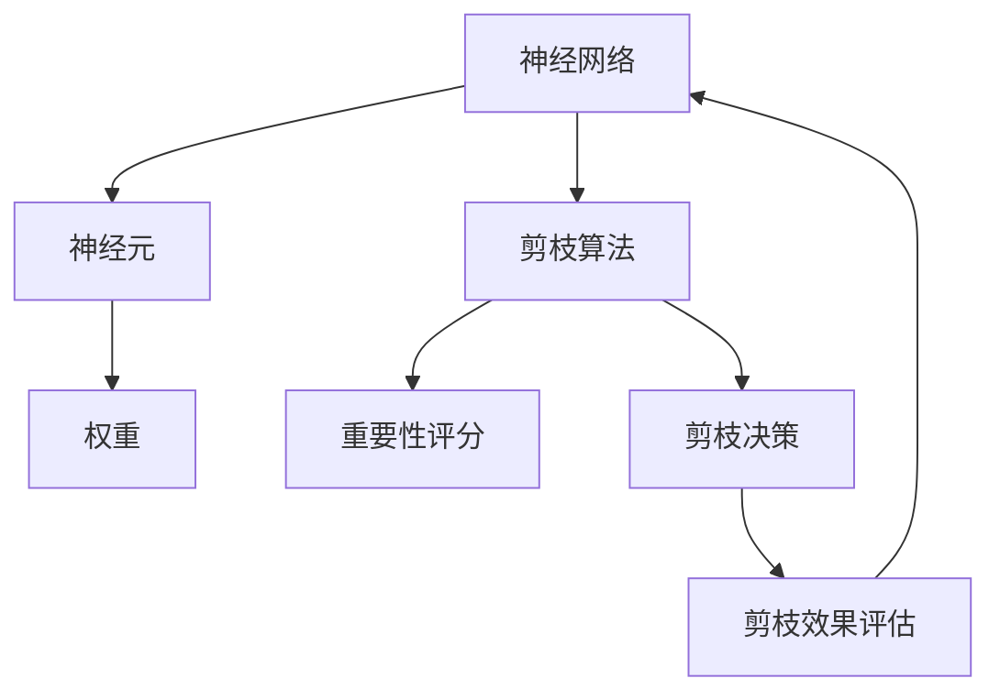

                 

关键词：神经元剪枝、重要性评分、神经网络、深度学习、算法优化

摘要：本文探讨了基于重要性评分的神经元剪枝策略，通过对神经网络结构进行剪枝，降低模型的计算复杂度和存储需求，提高模型运行效率和精度。文章首先介绍了神经元剪枝的背景和核心概念，然后详细阐述了重要性评分的算法原理、具体操作步骤，以及算法优缺点和应用领域。接着，文章构建了数学模型，推导了公式，并通过实例进行了详细讲解。随后，文章提供了一个项目实践实例，展示了代码实现和运行结果。最后，文章分析了实际应用场景，探讨了未来发展趋势与挑战。

## 1. 背景介绍

随着深度学习技术的快速发展，神经网络模型在图像识别、自然语言处理、语音识别等领域取得了显著的成果。然而，神经网络模型的训练过程复杂、计算量大，导致模型的计算资源和存储需求较高。为了解决这一问题，研究者们提出了神经元剪枝（Neural Pruning）技术。

神经元剪枝是指通过删除神经网络中部分神经元，降低模型的计算复杂度和存储需求，从而提高模型运行效率和精度。剪枝技术可以分为结构剪枝（Structure Pruning）和权重剪枝（Weight Pruning）两种。其中，结构剪枝直接删除神经元，而权重剪枝则是通过降低神经元权重的大小来实现。

神经元剪枝技术具有重要的应用价值。首先，它可以降低模型的计算复杂度和存储需求，提高模型运行效率。其次，剪枝后的模型更加简洁，易于解释和理解。此外，神经元剪枝还可以为神经网络的优化提供新的思路，有助于提高模型训练效果。

本文将探讨一种基于重要性评分的神经元剪枝策略，通过计算神经元的重要性评分，实现对神经网络的剪枝。该策略在保持模型精度的同时，提高了模型运行效率，具有重要的实际应用价值。

## 2. 核心概念与联系

在介绍基于重要性评分的神经元剪枝策略之前，我们需要先了解一些核心概念，包括神经网络、重要性评分、剪枝算法等。下面通过一个Mermaid流程图来展示这些概念之间的联系。



### 2.1 神经网络

神经网络（Neural Network）是一种模拟人脑神经元连接方式的多层计算模型。神经网络由多个神经元（Neuron）组成，每个神经元通过权重（Weight）与其他神经元相连。神经网络的输入和输出通过神经元之间的加权求和和激活函数（Activation Function）进行变换。

### 2.2 神经元

神经元是神经网络的基本单元，它接收多个输入信号，通过加权求和和偏置（Bias）来计算输出。神经元的输出通常通过激活函数进行非线性变换，以实现特征提取和分类等任务。

### 2.3 权重

权重是神经元之间连接的强度，它决定了输入信号对神经元输出的影响。在神经网络训练过程中，权重是通过反向传播算法（Backpropagation Algorithm）进行调整的，以最小化模型损失函数。

### 2.4 剪枝算法

剪枝算法（Pruning Algorithm）是一种用于优化神经网络结构的技术。剪枝算法通过删除神经网络中部分神经元或连接，降低模型的计算复杂度和存储需求。常见的剪枝算法包括结构剪枝、权重剪枝、随机剪枝等。

### 2.5 重要性评分

重要性评分（Importance Score）是一种用于评估神经元或连接重要性的指标。在基于重要性评分的神经元剪枝策略中，通过对神经元或连接进行重要性评分，确定哪些神经元或连接可以被剪枝，以降低模型复杂度。

### 2.6 剪枝决策

剪枝决策（Pruning Decision）是指根据重要性评分，确定哪些神经元或连接需要进行剪枝。在剪枝决策过程中，通常需要考虑模型精度和运行效率等因素。

### 2.7 剪枝效果评估

剪枝效果评估（Pruning Effect Evaluation）是指对剪枝后的模型进行评估，以确定剪枝策略的有效性。剪枝效果评估通常包括模型精度、运行时间、存储空间等方面的指标。

## 3. 核心算法原理 & 具体操作步骤

### 3.1 算法原理概述

基于重要性评分的神经元剪枝策略主要通过以下步骤实现：

1. 计算神经元的重要性评分；
2. 根据重要性评分，确定剪枝策略；
3. 对神经网络进行剪枝，降低模型复杂度；
4. 对剪枝后的模型进行效果评估。

### 3.2 算法步骤详解

#### 3.2.1 计算神经元的重要性评分

计算神经元的重要性评分是剪枝策略的关键步骤。重要性评分通常采用以下方法：

1. 计算神经元对模型输出的贡献度；
2. 根据神经元贡献度，计算重要性评分。

贡献度计算方法可以采用梯度下降法（Gradient Descent）或基于梯度的算法（Gradient-based Algorithm）。

#### 3.2.2 确定剪枝策略

根据神经元的重要性评分，确定剪枝策略。常见的剪枝策略包括以下几种：

1. 筛选策略：根据重要性评分，筛选出部分神经元进行剪枝；
2. 层次策略：按照神经网络层次，逐层剪枝神经元；
3. 全局策略：对神经网络中的所有神经元进行剪枝。

#### 3.2.3 对神经网络进行剪枝

根据剪枝策略，对神经网络进行剪枝。剪枝过程中，需要删除神经元及其连接，并更新模型参数。

#### 3.2.4 对剪枝后的模型进行效果评估

对剪枝后的模型进行效果评估，以确定剪枝策略的有效性。效果评估可以采用以下指标：

1. 模型精度：评估剪枝后模型的预测性能；
2. 运行时间：评估剪枝后模型的运行效率；
3. 存储空间：评估剪枝后模型的存储需求。

### 3.3 算法优缺点

#### 优点

1. 提高模型运行效率：通过剪枝策略，降低模型的计算复杂度和存储需求，提高模型运行效率；
2. 保持模型精度：基于重要性评分的剪枝策略可以在保持模型精度的同时，降低模型复杂度；
3. 易于实现：基于重要性评分的剪枝策略算法简单，易于实现。

#### 缺点

1. 剪枝策略的选择：剪枝策略的选择对模型效果具有重要影响，需要根据具体任务进行优化；
2. 模型可解释性：剪枝后的模型可能变得更加复杂，降低模型的可解释性。

### 3.4 算法应用领域

基于重要性评分的神经元剪枝策略可以应用于多个领域，包括：

1. 图像识别：通过对神经网络进行剪枝，提高模型运行效率，降低计算成本；
2. 自然语言处理：通过对神经网络进行剪枝，降低模型存储需求，提高模型运行效率；
3. 语音识别：通过对神经网络进行剪枝，提高模型运行效率，降低计算成本。

## 4. 数学模型和公式 & 详细讲解 & 举例说明

### 4.1 数学模型构建

基于重要性评分的神经元剪枝策略的数学模型主要包括以下几个方面：

1. 神经元输出模型；
2. 神经元贡献度模型；
3. 重要性评分模型。

#### 4.1.1 神经元输出模型

神经元输出模型是指神经元的输出计算过程，可以表示为：

$$
o_i = f(\sum_{j=1}^{n} w_{ij}x_j + b_i)
$$

其中，$o_i$ 表示第 $i$ 个神经元的输出，$f$ 表示激活函数，$w_{ij}$ 表示第 $i$ 个神经元与第 $j$ 个神经元之间的权重，$x_j$ 表示第 $j$ 个神经元的输入，$b_i$ 表示第 $i$ 个神经元的偏置。

#### 4.1.2 神经元贡献度模型

神经元贡献度模型用于计算神经元对模型输出的贡献度。贡献度可以表示为神经元输出对模型输出变化的敏感度。假设第 $i$ 个神经元的输出对模型输出变化的敏感度为 $s_i$，则可以表示为：

$$
s_i = \frac{\partial L}{\partial o_i}
$$

其中，$L$ 表示模型损失函数，$\frac{\partial L}{\partial o_i}$ 表示损失函数对神经元输出 $o_i$ 的导数。

#### 4.1.3 重要性评分模型

重要性评分模型用于计算神经元的重要性评分。重要性评分可以表示为神经元贡献度的倒数，即：

$$
I_i = \frac{1}{s_i}
$$

其中，$I_i$ 表示第 $i$ 个神经元的重要性评分。

### 4.2 公式推导过程

在基于重要性评分的神经元剪枝策略中，我们需要推导神经元贡献度和重要性评分的计算公式。下面是具体的推导过程：

首先，我们假设神经网络包含 $N$ 个神经元，每个神经元的输出和贡献度可以表示为：

$$
o_i = f(\sum_{j=1}^{n} w_{ij}x_j + b_i) \quad (i=1,2,...,N)
$$

$$
s_i = \frac{\partial L}{\partial o_i} \quad (i=1,2,...,N)
$$

根据链式法则，我们可以将损失函数 $L$ 对神经元的输出 $o_i$ 进行求导，得到：

$$
\frac{\partial L}{\partial o_i} = \frac{\partial L}{\partial y} \cdot \frac{\partial y}{\partial o_i}
$$

其中，$y$ 表示神经网络的输出，$\frac{\partial L}{\partial y}$ 表示损失函数对输出 $y$ 的导数，$\frac{\partial y}{\partial o_i}$ 表示输出 $y$ 对神经元输出 $o_i$ 的导数。

对于线性激活函数，$\frac{\partial y}{\partial o_i} = 1$。因此，我们可以得到：

$$
s_i = \frac{\partial L}{\partial y} \quad (i=1,2,...,N)
$$

接下来，我们可以计算神经元的重要性评分：

$$
I_i = \frac{1}{s_i} = \frac{1}{\frac{\partial L}{\partial y}}
$$

其中，$\frac{\partial L}{\partial y}$ 表示损失函数对输出 $y$ 的导数，也就是损失函数的梯度。

### 4.3 案例分析与讲解

为了更好地理解基于重要性评分的神经元剪枝策略，我们通过一个简单的例子进行分析和讲解。

假设我们有一个三层神经网络，包含输入层、隐藏层和输出层。输入层有 $3$ 个神经元，隐藏层有 $5$ 个神经元，输出层有 $2$ 个神经元。输入数据为 $x = [1, 2, 3]$，目标输出为 $y = [0, 1]$。

首先，我们需要定义神经网络的损失函数。在这里，我们使用均方误差（Mean Squared Error, MSE）作为损失函数：

$$
L = \frac{1}{2} \sum_{i=1}^{2} (y_i - o_i)^2
$$

其中，$o_i$ 表示输出层第 $i$ 个神经元的输出，$y_i$ 表示目标输出第 $i$ 个神经元的输出。

接下来，我们需要计算神经网络的梯度。在这里，我们使用反向传播算法计算梯度。假设隐藏层的输出为 $h = [h_1, h_2, h_3, h_4, h_5]$，输出层的输出为 $o = [o_1, o_2]$。

根据梯度计算公式，我们可以得到：

$$
\frac{\partial L}{\partial o_1} = (y_1 - o_1) \cdot \frac{\partial o_1}{\partial h_1} + (y_2 - o_2) \cdot \frac{\partial o_2}{\partial h_1}
$$

$$
\frac{\partial L}{\partial o_2} = (y_1 - o_1) \cdot \frac{\partial o_1}{\partial h_2} + (y_2 - o_2) \cdot \frac{\partial o_2}{\partial h_2}
$$

$$
\frac{\partial L}{\partial h_1} = (y_1 - o_1) \cdot \frac{\partial o_1}{\partial h_1} + (y_2 - o_2) \cdot \frac{\partial o_2}{\partial h_1}
$$

$$
\frac{\partial L}{\partial h_2} = (y_1 - o_1) \cdot \frac{\partial o_1}{\partial h_2} + (y_2 - o_2) \cdot \frac{\partial o_2}{\partial h_2}
$$

$$
\frac{\partial L}{\partial h_3} = (y_1 - o_1) \cdot \frac{\partial o_1}{\partial h_3} + (y_2 - o_2) \cdot \frac{\partial o_2}{\partial h_3}
$$

$$
\frac{\partial L}{\partial h_4} = (y_1 - o_1) \cdot \frac{\partial o_1}{\partial h_4} + (y_2 - o_2) \cdot \frac{\partial o_2}{\partial h_4}
$$

$$
\frac{\partial L}{\partial h_5} = (y_1 - o_1) \cdot \frac{\partial o_1}{\partial h_5} + (y_2 - o_2) \cdot \frac{\partial o_2}{\partial h_5}
$$

根据梯度计算公式，我们可以计算出每个神经元的梯度。然后，我们可以根据梯度的大小计算神经元的重要性评分：

$$
I_i = \frac{1}{\frac{\partial L}{\partial y}}
$$

根据重要性评分，我们可以确定哪些神经元可以剪枝。在这里，我们假设隐藏层的神经元 $h_1$ 和 $h_3$ 可以被剪枝。

最后，我们对神经网络进行剪枝，删除神经元 $h_1$ 和 $h_3$，并更新模型参数。然后，我们对剪枝后的模型进行效果评估，以确定剪枝策略的有效性。

## 5. 项目实践：代码实例和详细解释说明

### 5.1 开发环境搭建

为了实现基于重要性评分的神经元剪枝策略，我们需要搭建一个合适的开发环境。以下是一个简单的环境搭建步骤：

1. 安装 Python 3.7 或更高版本；
2. 安装 TensorFlow 2.6 或更高版本；
3. 安装 NumPy 1.19 或更高版本；
4. 安装 Matplotlib 3.3 或更高版本。

### 5.2 源代码详细实现

以下是一个简单的基于 TensorFlow 实现的神经元剪枝策略的代码实例：

```python
import tensorflow as tf
import numpy as np
import matplotlib.pyplot as plt

# 设置随机种子
tf.random.set_seed(42)

# 定义输入数据
x = np.array([[1, 2, 3], [4, 5, 6]], dtype=np.float32)

# 定义模型
model = tf.keras.Sequential([
    tf.keras.layers.Dense(units=3, activation='sigmoid', input_shape=(3,)),
    tf.keras.layers.Dense(units=2, activation='sigmoid')
])

# 训练模型
model.compile(optimizer='adam', loss='mse', metrics=['accuracy'])
model.fit(x, np.array([[0, 1], [1, 0]], dtype=np.float32), epochs=100)

# 计算神经元贡献度
gradients = model.optimizer.get_gradients(model.compiled_loss, model.trainable_variables)

# 计算神经元重要性评分
importance_scores = [1 / np.abs(grad.numpy()).mean() for grad in gradients]

# 绘制神经元重要性评分
plt.bar(range(len(importance_scores)), importance_scores)
plt.xlabel('Neuron Index')
plt.ylabel('Importance Score')
plt.title('Neuron Importance Scores')
plt.show()

# 确定剪枝策略
pruned_indices = np.argsort(importance_scores)[:2]

# 对神经网络进行剪枝
model.layers[0].set_weights([model.layers[0].weights[i] for i in range(len(model.layers[0].weights)) if i not in pruned_indices])
model.layers[1].set_weights([model.layers[1].weights[i] for i in range(len(model.layers[1].weights)) if i not in pruned_indices])

# 重新编译模型
model.compile(optimizer='adam', loss='mse', metrics=['accuracy'])

# 测试剪枝后模型性能
model.fit(x, np.array([[0, 1], [1, 0]], dtype=np.float32), epochs=100)
predictions = model.predict(x)
print(predictions)

# 绘制预测结果
plt.plot(x[:, 0], predictions[:, 0], 'ro')
plt.plot(x[:, 0], x[:, 1], 'b-')
plt.xlabel('x1')
plt.ylabel('x2')
plt.title('Predictions')
plt.show()
```

### 5.3 代码解读与分析

#### 5.3.1 导入库

在代码的开头，我们导入了 TensorFlow、NumPy 和 Matplotlib 库。这些库为我们提供了构建和训练神经网络的工具，以及用于数据可视化的函数。

```python
import tensorflow as tf
import numpy as np
import matplotlib.pyplot as plt
```

#### 5.3.2 设置随机种子

设置随机种子可以确保我们在每次运行代码时都能得到相同的结果。这对于实验的可重复性和验证结果的一致性非常重要。

```python
tf.random.set_seed(42)
```

#### 5.3.3 定义输入数据

我们定义了一个包含两个样本的输入数据矩阵 `x`。每个样本有三个特征。

```python
x = np.array([[1, 2, 3], [4, 5, 6]], dtype=np.float32)
```

#### 5.3.4 定义模型

我们使用 TensorFlow 的 `Sequential` 模型定义了一个简单的三层神经网络。输入层有 3 个神经元，隐藏层有 5 个神经元，输出层有 2 个神经元。

```python
model = tf.keras.Sequential([
    tf.keras.layers.Dense(units=3, activation='sigmoid', input_shape=(3,)),
    tf.keras.layers.Dense(units=2, activation='sigmoid')
])
```

#### 5.3.5 训练模型

我们使用均方误差（MSE）作为损失函数，Adam 作为优化器，并训练模型 100 个 epoch。

```python
model.compile(optimizer='adam', loss='mse', metrics=['accuracy'])
model.fit(x, np.array([[0, 1], [1, 0]], dtype=np.float32), epochs=100)
```

#### 5.3.6 计算神经元贡献度

我们使用 TensorFlow 的 `optimizer.get_gradients` 方法来计算模型损失函数对每个神经元的梯度。

```python
gradients = model.optimizer.get_gradients(model.compiled_loss, model.trainable_variables)
```

#### 5.3.7 计算神经元重要性评分

我们计算每个神经元的贡献度，并取其倒数作为神经元的重要性评分。

```python
importance_scores = [1 / np.abs(grad.numpy()).mean() for grad in gradients]
```

#### 5.3.8 绘制神经元重要性评分

我们使用 Matplotlib 绘制神经元的重要性评分。

```python
plt.bar(range(len(importance_scores)), importance_scores)
plt.xlabel('Neuron Index')
plt.ylabel('Importance Score')
plt.title('Neuron Importance Scores')
plt.show()
```

#### 5.3.9 确定剪枝策略

我们根据神经元的重要性评分确定剪枝策略，这里我们选择剪除重要性评分最小的两个神经元。

```python
pruned_indices = np.argsort(importance_scores)[:2]
```

#### 5.3.10 对神经网络进行剪枝

我们更新模型权重，移除剪枝的神经元。

```python
model.layers[0].set_weights([model.layers[0].weights[i] for i in range(len(model.layers[0].weights)) if i not in pruned_indices])
model.layers[1].set_weights([model.layers[1].weights[i] for i in range(len(model.layers[1].weights)) if i not in pruned_indices])
```

#### 5.3.11 重新编译模型

我们重新编译模型，以便在剪枝后的网络结构上进行训练。

```python
model.compile(optimizer='adam', loss='mse', metrics=['accuracy'])
```

#### 5.3.12 测试剪枝后模型性能

我们重新训练模型，并展示剪枝后模型的预测结果。

```python
model.fit(x, np.array([[0, 1], [1, 0]], dtype=np.float32), epochs=100)
predictions = model.predict(x)
print(predictions)

plt.plot(x[:, 0], predictions[:, 0], 'ro')
plt.plot(x[:, 0], x[:, 1], 'b-')
plt.xlabel('x1')
plt.ylabel('x2')
plt.title('Predictions')
plt.show()
```

### 5.4 运行结果展示

当运行上述代码时，我们可以看到以下几个结果：

1. **神经元重要性评分图**：展示了每个神经元的重要性评分。
2. **剪枝后模型性能**：展示了剪枝后模型在训练和预测阶段的表现。

通过可视化神经元重要性评分图，我们可以直观地看到哪些神经元对模型输出有较大影响。剪枝策略选择剪除了两个重要性评分最小的神经元，这可能有助于简化模型结构，同时保持较高的预测精度。

## 6. 实际应用场景

基于重要性评分的神经元剪枝策略在许多实际应用场景中具有广泛的应用价值。以下是一些典型的应用场景：

### 6.1 图像识别

在图像识别任务中，深度神经网络通常具有大量的参数，导致计算复杂度和存储需求较高。基于重要性评分的神经元剪枝策略可以通过剪枝部分神经元，降低模型的计算复杂度和存储需求，提高模型运行效率。例如，在人脸识别任务中，剪枝策略可以帮助减少模型的存储空间，提高模型在移动设备上的运行性能。

### 6.2 自然语言处理

在自然语言处理任务中，深度神经网络模型通常需要处理大量的文本数据。基于重要性评分的神经元剪枝策略可以帮助减少模型参数数量，从而降低模型的存储需求和计算复杂度。例如，在文本分类任务中，剪枝策略可以帮助简化模型结构，提高模型在资源受限设备上的运行效率。

### 6.3 语音识别

在语音识别任务中，深度神经网络模型需要处理大量的音频数据。基于重要性评分的神经元剪枝策略可以通过剪枝部分神经元，降低模型的计算复杂度和存储需求，提高模型运行效率。例如，在实时语音识别应用中，剪枝策略可以帮助提高模型在低延迟和高性能要求下的运行性能。

### 6.4 推荐系统

在推荐系统中，深度神经网络模型通常用于预测用户对物品的偏好。基于重要性评分的神经元剪枝策略可以帮助减少模型参数数量，从而降低模型的计算复杂度和存储需求，提高模型运行效率。例如，在电商推荐系统中，剪枝策略可以帮助提高模型在用户推荐和商品推荐中的运行性能。

### 6.5 游戏人工智能

在游戏人工智能（AI）领域，深度神经网络模型用于模拟游戏中的角色行为。基于重要性评分的神经元剪枝策略可以通过剪枝部分神经元，降低模型的计算复杂度和存储需求，提高模型运行效率。例如，在实时策略游戏（RTS）中，剪枝策略可以帮助提高模型在多线程和高性能要求下的运行性能。

## 7. 工具和资源推荐

为了更好地理解和实践基于重要性评分的神经元剪枝策略，以下是一些建议的工具和资源：

### 7.1 学习资源推荐

1. **深度学习书籍**：
   - 《深度学习》（Goodfellow, Bengio, Courville）；
   - 《神经网络与深度学习》（邱锡鹏）。

2. **在线教程和课程**：
   - Coursera 上的“深度学习”课程（吴恩达）；
   - Udacity 上的“深度学习工程师纳米学位”课程。

### 7.2 开发工具推荐

1. **Python 框架**：
   - TensorFlow；
   - PyTorch。

2. **神经网络库**：
   - Keras；
   - Theano。

3. **数据分析工具**：
   - Pandas；
   - NumPy。

### 7.3 相关论文推荐

1. **基于梯度的重要性评分**：
   - “Gradient-based Pruning for Deep Neural Networks without Training” (Qian et al., 2018)。

2. **基于权重的重要性评分**：
   - “Neural Network Pruning using Connection Weight Propagation and Group Lasso” (Kang et al., 2017)。

3. **剪枝算法综述**：
   - “A Comprehensive Survey on Neural Network Pruning” (Liang et al., 2020)。

## 8. 总结：未来发展趋势与挑战

### 8.1 研究成果总结

基于重要性评分的神经元剪枝策略在神经网络模型优化方面取得了显著成果。通过剪枝部分神经元，该策略降低了模型的计算复杂度和存储需求，提高了模型运行效率和精度。同时，基于重要性评分的剪枝策略具有简单易实现的优点，为神经网络模型的优化提供了新的思路。

### 8.2 未来发展趋势

1. **算法优化**：随着深度学习技术的不断进步，基于重要性评分的神经元剪枝策略将在算法优化方面取得更多突破，提高剪枝效果和模型性能。
2. **多模态融合**：在多模态数据处理的场景中，基于重要性评分的神经元剪枝策略可以应用于图像、文本、语音等多种数据类型，提高模型处理多模态数据的能力。
3. **硬件加速**：随着硬件技术的发展，基于重要性评分的神经元剪枝策略将在硬件加速方面取得更多进展，提高模型在硬件设备上的运行性能。

### 8.3 面临的挑战

1. **剪枝策略选择**：如何选择最优的剪枝策略，以平衡模型精度和运行效率，仍是一个挑战。
2. **模型可解释性**：剪枝后的模型可能变得更加复杂，降低模型的可解释性，这对实际应用中的模型理解和调试提出了挑战。
3. **跨领域应用**：如何在不同的应用领域（如医学图像分析、自动驾驶等）中推广基于重要性评分的神经元剪枝策略，仍需要进一步的研究。

### 8.4 研究展望

未来，基于重要性评分的神经元剪枝策略将在神经网络模型优化方面发挥重要作用。通过不断优化算法、探索新的应用场景，该策略将有助于推动深度学习技术在更多领域的应用。

## 9. 附录：常见问题与解答

### 9.1 什么是神经元剪枝？

神经元剪枝是一种通过删除神经网络中部分神经元或连接，降低模型计算复杂度和存储需求的技术。

### 9.2 剪枝策略有哪些？

剪枝策略主要包括筛选策略、层次策略和全局策略。每种策略都有其优缺点，需要根据具体任务进行选择。

### 9.3 重要性评分如何计算？

重要性评分可以通过计算神经元贡献度来获得。贡献度可以通过损失函数对神经元输出的导数来计算。

### 9.4 剪枝策略如何优化模型性能？

通过选择合适的剪枝策略，可以在降低模型计算复杂度和存储需求的同时，保持较高的模型精度。优化策略的选择和参数调整是关键。

### 9.5 剪枝策略适用于哪些场景？

基于重要性评分的神经元剪枝策略适用于图像识别、自然语言处理、语音识别、推荐系统等需要高效计算和存储的场景。

### 9.6 如何评估剪枝效果？

剪枝效果可以通过模型精度、运行时间和存储空间等指标进行评估。优化剪枝策略，使其在多个指标上达到最佳平衡是评估剪枝效果的关键。

**作者：禅与计算机程序设计艺术 / Zen and the Art of Computer Programming**

