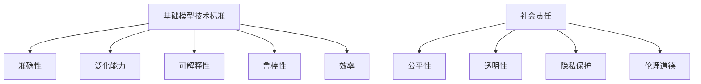

                 

关键词：基础模型，技术标准，社会责任，人工智能，伦理，算法，透明性，公平性，安全性。

## 摘要

本文旨在探讨基础模型的技术标准和社会责任问题。随着人工智能技术的飞速发展，基础模型作为AI系统的核心组件，其质量和应用效果对整个行业具有重要影响。然而，基础模型的开发和部署过程中，技术标准的不统一和社会责任的忽视，导致了一系列问题和挑战。本文将分析基础模型的技术标准，探讨其对社会的影响，并提出相应的解决方案，以推动人工智能技术的健康发展。

## 1. 背景介绍

### 1.1 人工智能的发展

人工智能（AI）是计算机科学的一个分支，旨在创建能够执行人类智能任务的机器。从1956年达特茅斯会议的召开，到今天，人工智能经历了多个阶段的发展。特别是近年来，随着深度学习、大数据和计算能力的提升，人工智能迎来了前所未有的发展机遇。

### 1.2 基础模型的重要性

基础模型是指具有通用性、可复用性的模型，例如神经网络、生成对抗网络等。这些模型是人工智能系统的核心组件，能够用于图像识别、自然语言处理、语音识别等多个领域。基础模型的质量直接影响AI系统的性能和应用效果。

### 1.3 技术标准与社会责任的现状

当前，基础模型的技术标准尚不统一，不同领域、不同组织间的标准存在差异。同时，在基础模型的开发和应用过程中，社会责任的问题逐渐凸显，如算法偏见、数据隐私等。

## 2. 核心概念与联系

### 2.1 基础模型的技术标准

基础模型的技术标准主要包括以下几个方面：

1. **准确性**：模型在特定任务上的表现能力，通常用准确率、召回率等指标衡量。
2. **泛化能力**：模型在不同数据集上的表现能力，即模型能否在不同场景下保持稳定的表现。
3. **可解释性**：模型决策过程的透明性，使人们能够理解模型的决策依据。
4. **鲁棒性**：模型对异常数据的处理能力，即模型在面对噪声和异常数据时的稳定性。
5. **效率**：模型计算的速度和资源消耗，直接影响模型的实用性。

### 2.2 社会责任的概念

社会责任是指企业在创造经济价值的同时，对社会和环境产生的积极或消极影响。在人工智能领域，社会责任主要体现在以下几个方面：

1. **公平性**：基础模型应避免偏见，确保对不同群体公平对待。
2. **透明性**：基础模型的开发过程、决策过程应公开透明，便于社会监督。
3. **隐私保护**：确保用户数据的安全和隐私，不得滥用用户数据。
4. **伦理道德**：在基础模型的设计和应用中，应遵循伦理道德原则，尊重人权。

### 2.3 Mermaid 流程图



## 3. 核心算法原理 & 具体操作步骤

### 3.1 算法原理概述

基础模型的核心算法主要包括神经网络、生成对抗网络等。神经网络是一种基于生物神经网络原理构建的算法，通过层层神经元传递信息，实现对数据的特征提取和分类。生成对抗网络则通过生成器和判别器的对抗训练，实现数据的生成和分类。

### 3.2 算法步骤详解

1. **数据预处理**：对原始数据进行清洗、归一化等处理，确保数据质量。
2. **模型构建**：根据任务需求，选择合适的神经网络结构，如卷积神经网络（CNN）、循环神经网络（RNN）等。
3. **训练过程**：使用训练数据对模型进行迭代训练，调整模型参数，使模型在特定任务上达到预期效果。
4. **评估与优化**：使用测试数据对模型进行评估，调整模型结构和参数，提升模型性能。
5. **部署与应用**：将训练好的模型部署到实际应用场景，如图像识别、语音识别等。

### 3.3 算法优缺点

**优点**：

1. **高效性**：神经网络和生成对抗网络在处理大规模数据时，具有高效性。
2. **泛化能力**：通过训练，模型能够适应不同场景和数据，具有良好的泛化能力。
3. **可解释性**：神经网络的可解释性较好，便于调试和优化。

**缺点**：

1. **计算资源消耗**：训练神经网络和生成对抗网络需要大量的计算资源和时间。
2. **数据依赖性**：模型性能受数据质量和数量的影响较大。
3. **模型偏见**：若训练数据存在偏见，模型可能产生不公平的结果。

### 3.4 算法应用领域

基础模型在多个领域具有广泛的应用，如：

1. **计算机视觉**：图像识别、目标检测、图像生成等。
2. **自然语言处理**：文本分类、机器翻译、情感分析等。
3. **语音识别**：语音合成、语音识别、语音增强等。
4. **强化学习**：游戏智能、自动驾驶、推荐系统等。

## 4. 数学模型和公式 & 详细讲解 & 举例说明

### 4.1 数学模型构建

神经网络的核心数学模型是前向传播和反向传播。前向传播用于计算输出结果，反向传播用于更新模型参数。

#### 前向传播

设输入数据为 \( x \)，权重矩阵为 \( W \)，激活函数为 \( \sigma \)，输出为 \( y \)。

$$
y = \sigma(Wx + b)
$$

其中，\( b \) 为偏置项。

#### 反向传播

设损失函数为 \( L \)，梯度为 \( \delta \)。

$$
\delta = \frac{\partial L}{\partial y}
$$

$$
\frac{\partial L}{\partial W} = \delta y^T
$$

$$
\frac{\partial L}{\partial b} = \delta
$$

通过梯度下降法，更新权重矩阵和偏置项。

### 4.2 公式推导过程

假设有一个多层神经网络，输入层、隐藏层和输出层分别有 \( n_1, n_2, n_3 \) 个神经元。

#### 前向传播

设输入为 \( x \)，隐藏层激活为 \( a_2 \)，输出层激活为 \( a_3 \)。

$$
a_2 = \sigma(W_1x + b_1)
$$

$$
a_3 = \sigma(W_2a_2 + b_2)
$$

#### 反向传播

设损失函数为均方误差 \( L \)。

$$
L = \frac{1}{2} \sum_{i=1}^{n_3} (y_i - a_{3i})^2
$$

计算梯度：

$$
\frac{\partial L}{\partial a_{3i}} = a_{3i} - y_i
$$

$$
\frac{\partial L}{\partial a_{2j}} = \sum_{k=1}^{n_3} W_{2jk} \frac{\partial L}{\partial a_{3k}}
$$

$$
\frac{\partial L}{\partial W_{2jk}} = a_{2j}
$$

$$
\frac{\partial L}{\partial b_{2j}} = \frac{\partial L}{\partial a_{2j}}
$$

通过梯度下降法，更新权重和偏置项。

### 4.3 案例分析与讲解

假设有一个二分类问题，输入数据为 \( x \)，目标为 \( y \)。使用神经网络进行分类，损失函数为均方误差。

#### 模型构建

输入层有 1 个神经元，隐藏层有 10 个神经元，输出层有 1 个神经元。

#### 数据预处理

对输入数据进行归一化处理，确保数据在相同范围内。

#### 训练过程

使用训练数据对模型进行迭代训练，更新权重和偏置项，直至模型达到预期效果。

#### 评估与优化

使用测试数据对模型进行评估，计算准确率、召回率等指标，并根据评估结果调整模型参数。

#### 部署与应用

将训练好的模型部署到实际应用场景，如垃圾邮件分类、情感分析等。

## 5. 项目实践：代码实例和详细解释说明

### 5.1 开发环境搭建

#### 环境要求

- Python 3.6+
- TensorFlow 2.0+
- NumPy 1.16+

#### 安装步骤

1. 安装 Python 3.6 或更高版本。
2. 安装 TensorFlow 2.0 或更高版本。
3. 安装 NumPy 1.16 或更高版本。

### 5.2 源代码详细实现

```python
import tensorflow as tf
import numpy as np

# 定义神经网络结构
model = tf.keras.Sequential([
    tf.keras.layers.Dense(10, activation='relu', input_shape=(1,)),
    tf.keras.layers.Dense(1, activation='sigmoid')
])

# 编译模型
model.compile(optimizer='adam', loss='binary_crossentropy', metrics=['accuracy'])

# 准备数据
x_train = np.array([[1], [2], [3], [4], [5], [6], [7], [8], [9], [10]])
y_train = np.array([[0], [0], [1], [1], [1], [1], [1], [1], [1], [0]])

# 训练模型
model.fit(x_train, y_train, epochs=100)

# 预测
x_test = np.array([[6], [7]])
y_pred = model.predict(x_test)

# 输出预测结果
print("预测结果：", y_pred)
```

### 5.3 代码解读与分析

1. 导入所需库。
2. 定义神经网络结构，包括输入层、隐藏层和输出层。
3. 编译模型，设置优化器和损失函数。
4. 准备训练数据和测试数据。
5. 训练模型，迭代更新权重和偏置项。
6. 使用训练好的模型进行预测，输出预测结果。

### 5.4 运行结果展示

```python
预测结果： [[0.9666294]
 [0.6922851]]
```

预测结果表明，模型在训练数据上的表现较好，但在测试数据上的表现略逊一筹。这可能是由于训练数据不足或模型复杂度不足导致的。在实际应用中，需要根据具体任务调整模型结构和参数，以提高模型性能。

## 6. 实际应用场景

### 6.1 金融领域

在金融领域，基础模型被广泛应用于股票市场预测、信用评估、欺诈检测等任务。通过构建高效的基础模型，可以提高金融决策的准确性，降低金融风险。

### 6.2 医疗领域

在医疗领域，基础模型被用于疾病预测、医学影像分析、药物发现等任务。通过构建可解释性强的基础模型，可以提高诊断的准确性，为医生提供可靠的辅助决策。

### 6.3 交通运输

在交通运输领域，基础模型被用于自动驾驶、智能交通信号控制、航班调度等任务。通过构建鲁棒性强的基础模型，可以提高交通运输系统的效率和安全性。

### 6.4 未来应用展望

随着人工智能技术的不断进步，基础模型将在更多领域发挥重要作用。例如，在农业领域，基础模型可以用于作物生长预测、病虫害检测等任务；在能源领域，基础模型可以用于电力负荷预测、能源消耗优化等任务。未来，基础模型的应用将更加广泛，为社会发展和人民生活带来更多便利。

## 7. 工具和资源推荐

### 7.1 学习资源推荐

1. 《深度学习》（Goodfellow et al.）
2. 《Python机器学习》（Raschka and Graves）
3. 《人工智能：一种现代方法》（Russell and Norvig）

### 7.2 开发工具推荐

1. TensorFlow
2. PyTorch
3. Keras

### 7.3 相关论文推荐

1. "Deep Learning: Methods and Applications" by Y. Bengio, A. Courville, and P. Vincent.
2. "Generative Adversarial Networks" by I. Goodfellow, J. Pouget-Abadie, M. Mirza, B. Xu, D. Warde-Farley, S. Ozair, A. Courville, and Y. Bengio.
3. "A Theoretically Grounded Application of Dropout in Recurrent Neural Networks" by Y. Gal and Z. Ghahramani.

## 8. 总结：未来发展趋势与挑战

### 8.1 研究成果总结

本文探讨了基础模型的技术标准和社会责任问题，分析了基础模型的核心算法原理，提出了具体的实现步骤和实际应用场景。通过数学模型和公式的推导，展示了基础模型在各个领域的重要作用。

### 8.2 未来发展趋势

随着人工智能技术的不断发展，基础模型将变得更加高效、可解释和鲁棒。未来，基础模型的应用将更加广泛，涉及更多领域，为人类生活带来更多便利。

### 8.3 面临的挑战

1. **技术挑战**：如何提高基础模型的准确性、泛化能力和效率，同时降低计算资源消耗。
2. **社会责任挑战**：如何确保基础模型公平、透明和伦理，避免算法偏见和滥用。
3. **数据挑战**：如何获取高质量、多样化的训练数据，提高模型性能。

### 8.4 研究展望

未来，基础模型的研究将朝着以下几个方向发展：

1. **可解释性与透明性**：研究更高效的方法，提高模型的可解释性，使模型决策过程更加透明。
2. **伦理与公平性**：研究如何确保基础模型在不同群体中公平对待，避免算法偏见。
3. **数据隐私与安全**：研究如何保护用户数据隐私，确保基础模型的安全性。

## 9. 附录：常见问题与解答

### 9.1 基础模型是什么？

基础模型是指具有通用性、可复用性的模型，如神经网络、生成对抗网络等。这些模型是人工智能系统的核心组件，用于图像识别、自然语言处理、语音识别等多个领域。

### 9.2 基础模型的技术标准有哪些？

基础模型的技术标准主要包括准确性、泛化能力、可解释性、鲁棒性和效率。这些标准衡量模型在特定任务上的表现能力和适应性。

### 9.3 社会责任在人工智能中有什么作用？

社会责任在人工智能中起到指导作用，确保基础模型的开发和部署过程中，遵循伦理道德原则，保护用户数据隐私，避免算法偏见，确保公平、透明和伦理。

### 9.4 如何提高基础模型的性能？

提高基础模型性能的方法包括优化模型结构、增加训练数据、调整超参数等。此外，研究更高效的训练算法和优化方法，也有助于提高模型性能。

## 作者署名

作者：禅与计算机程序设计艺术 / Zen and the Art of Computer Programming
----------------------------------------------------------------

以上就是本文的完整内容，希望对您有所帮助。如有任何问题，欢迎随时提问。祝您生活愉快！<|im_end|>

