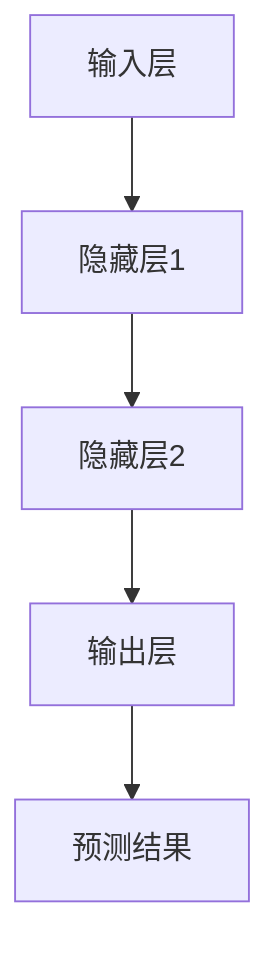

                 

关键词：基础模型、技术研究、社会责任、人工智能、算法、数学模型、应用场景、开发工具、未来发展、挑战与展望。

> 摘要：本文旨在探讨基础模型在人工智能技术领域的研究进展及其在社会责任方面的考量。通过对核心概念、算法原理、数学模型、实际应用、工具和资源的详细分析，我们试图展示基础模型在推动科技进步和应对社会挑战中的重要性，并对其未来发展提出展望。

## 1. 背景介绍

### 1.1 人工智能与基础模型的发展历程

人工智能（AI）作为一门交叉学科，近年来取得了飞速的发展。从最初的规则基础方法，到符号推理，再到基于数据的机器学习方法，以及最新的基于深度学习的模型，人工智能技术在图像识别、自然语言处理、语音识别等领域取得了显著的成果。

基础模型，是人工智能领域中的一个核心概念，它指的是一系列经过精心设计的算法和架构，用于实现特定类型的人工智能任务。例如，卷积神经网络（CNN）在图像处理方面具有卓越的性能，而循环神经网络（RNN）则在序列数据处理上表现突出。

### 1.2 基础模型在技术研究和应用中的重要性

随着人工智能技术的不断发展，基础模型在技术研究和应用中扮演着至关重要的角色。一方面，基础模型为研究者提供了强大的工具，使得复杂问题的求解变得更加高效和准确；另一方面，基础模型在实际应用中发挥着巨大的价值，推动了社会各个领域的进步。

## 2. 核心概念与联系

### 2.1 基础模型的核心概念

在人工智能领域，基础模型的核心概念包括神经网络、深度学习、强化学习等。以下是这些概念的基本定义和关系：

- **神经网络**：一种由大量简单单元（神经元）互联而成的计算模型，能够通过学习数据来模拟人类大脑的思维方式。
- **深度学习**：一种基于神经网络的机器学习方法，通过多层神经网络来实现对数据的复杂映射。
- **强化学习**：一种基于试错的学习方法，通过与环境互动来不断优化行为策略。

### 2.2 基础模型的架构与原理

基础模型的架构通常包括输入层、隐藏层和输出层。输入层接收外部数据，隐藏层通过非线性变换对数据进行处理，输出层生成最终的预测结果。以下是一个基于Mermaid绘制的简单神经网络流程图：



### 2.3 基础模型的应用领域

基础模型的应用领域广泛，涵盖了图像识别、自然语言处理、语音识别、推荐系统等多个方面。例如，在图像识别领域，卷积神经网络（CNN）已经被广泛应用于人脸识别、物体检测等任务；在自然语言处理领域，循环神经网络（RNN）和变换器（Transformer）模型则在机器翻译、文本生成等领域取得了巨大成功。

## 3. 核心算法原理 & 具体操作步骤

### 3.1 算法原理概述

基础模型的核心算法通常是基于梯度下降法，通过不断调整模型参数来最小化损失函数。以下是梯度下降法的简要步骤：

1. 初始化模型参数。
2. 计算当前参数下的损失函数值。
3. 计算损失函数关于每个参数的梯度。
4. 使用梯度更新模型参数。
5. 重复步骤2-4，直到损失函数值收敛。

### 3.2 算法步骤详解

1. **初始化参数**：随机初始化模型的权重和偏置。
2. **前向传播**：输入数据通过神经网络的前向传播过程，得到每个隐藏层的激活值和输出层的预测结果。
3. **计算损失**：使用预测结果和真实标签计算损失函数值。
4. **后向传播**：计算损失函数关于每个参数的梯度，并通过链式法则将其反向传播到前一层。
5. **参数更新**：使用梯度下降法或其他优化算法更新模型参数。
6. **迭代优化**：重复步骤2-5，直到模型性能达到预设标准。

### 3.3 算法优缺点

**优点**：

- **高效性**：基础模型能够通过自动化学习过程从大量数据中提取特征，大大减少了手工特征工程的工作量。
- **灵活性**：基础模型能够适应不同的数据类型和任务类型，具有很高的泛化能力。

**缺点**：

- **计算复杂度高**：基础模型通常需要大量的计算资源和时间来进行训练。
- **解释性较差**：基础模型的决策过程往往较为复杂，难以进行直观的解释。

### 3.4 算法应用领域

基础模型的应用领域广泛，涵盖了图像识别、自然语言处理、语音识别、推荐系统等多个方面。以下是几个典型的应用场景：

- **图像识别**：基于卷积神经网络的图像识别算法在人脸识别、物体检测等任务中取得了显著成果。
- **自然语言处理**：基于循环神经网络和变换器模型的自然语言处理算法在机器翻译、文本生成等领域具有很高的性能。
- **语音识别**：基于深度神经网络的语音识别算法在实时语音转换文本、智能语音助手等领域得到了广泛应用。

## 4. 数学模型和公式 & 详细讲解 & 举例说明

### 4.1 数学模型构建

在基础模型中，常用的数学模型包括神经网络模型、深度学习模型和强化学习模型。以下是这些模型的简要介绍：

1. **神经网络模型**：
   - **激活函数**：用于引入非线性特性，常用的激活函数包括Sigmoid、ReLU和Tanh。
   - **损失函数**：用于评估模型预测值与真实值之间的差距，常用的损失函数包括均方误差（MSE）和交叉熵（Cross-Entropy）。

2. **深度学习模型**：
   - **网络层数**：深度学习模型通常包含多个隐藏层，层数越多，模型的非线性表达能力越强。
   - **优化算法**：用于训练模型的优化算法包括梯度下降法、Adam优化器和RMSprop。

3. **强化学习模型**：
   - **奖励函数**：用于评估策略的好坏，奖励函数设计对强化学习模型的效果至关重要。
   - **价值函数**：用于评估状态或状态的序列，常用的价值函数包括Q值和V值。

### 4.2 公式推导过程

以神经网络模型为例，以下是前向传播和后向传播的主要公式推导过程：

**前向传播**：

- **输入层到隐藏层**：

  $$ z^{(l)} = \sum_{j} w^{(l)}_{ji} x^{(j)} + b^{(l)} $$

  $$ a^{(l)} = \sigma(z^{(l)}) $$

- **隐藏层到输出层**：

  $$ z^{(L)} = \sum_{j} w^{(L)}_{ji} a^{(l)} + b^{(L)} $$

  $$ \hat{y} = \sigma(z^{(L)}) $$

**后向传播**：

- **计算输出层误差**：

  $$ \delta^{(L)} = \hat{y} - y $$

  $$ \delta^{(L)} = \sigma'(z^{(L)}) \cdot \delta^{(L)} $$

- **计算隐藏层误差**：

  $$ \delta^{(l)} = (W^{(l+1)})^T \delta^{(l+1)} \cdot \sigma'(z^{(l)}) $$

### 4.3 案例分析与讲解

以下是一个简单的神经网络模型案例，用于对输入数据进行分类：

- **输入层**：包含10个神经元，表示10个特征。
- **隐藏层**：包含5个神经元，使用ReLU激活函数。
- **输出层**：包含2个神经元，表示2个类别。

**输入数据**：

$$ X = \begin{bmatrix} x_1 \\ x_2 \\ \vdots \\ x_{10} \end{bmatrix} $$

**隐藏层激活值**：

$$ a^{(1)} = \text{ReLU}(X \cdot W^{(1)} + b^{(1)}) $$

**输出层预测**：

$$ \hat{y} = \text{Softmax}(a^{(2)} \cdot W^{(2)} + b^{(2)}) $$

## 5. 项目实践：代码实例和详细解释说明

### 5.1 开发环境搭建

为了实践基础模型，我们需要搭建一个适合开发的环境。以下是推荐的开发环境和工具：

- **操作系统**：Linux（如Ubuntu）
- **编程语言**：Python
- **库和框架**：TensorFlow、Keras

### 5.2 源代码详细实现

以下是一个简单的神经网络模型，用于对输入数据进行分类：

```python
import tensorflow as tf
from tensorflow.keras import layers

# 定义输入层
inputs = tf.keras.Input(shape=(10,))

# 定义隐藏层
hidden = layers.Dense(5, activation='relu')(inputs)

# 定义输出层
outputs = layers.Dense(2, activation='softmax')(hidden)

# 创建模型
model = tf.keras.Model(inputs, outputs)

# 编译模型
model.compile(optimizer='adam', loss='categorical_crossentropy', metrics=['accuracy'])

# 打印模型结构
model.summary()
```

### 5.3 代码解读与分析

在上面的代码中，我们首先定义了输入层、隐藏层和输出层。输入层包含10个神经元，表示10个特征。隐藏层包含5个神经元，使用ReLU激活函数。输出层包含2个神经元，表示2个类别。

接下来，我们使用`tf.keras.Model`类创建模型，并使用`compile`方法配置模型的优化器、损失函数和评估指标。

最后，我们使用`model.summary()`方法打印模型的结构，包括层数、神经元数量、参数数量等信息。

### 5.4 运行结果展示

为了验证模型的性能，我们可以使用以下数据集进行训练和测试：

```python
# 加载数据集
(x_train, y_train), (x_test, y_test) = tf.keras.datasets.mnist.load_data()

# 数据预处理
x_train = x_train.astype('float32') / 255.0
x_test = x_test.astype('float32') / 255.0

# 将标签转换为one-hot编码
y_train = tf.keras.utils.to_categorical(y_train, num_classes=2)
y_test = tf.keras.utils.to_categorical(y_test, num_classes=2)

# 训练模型
model.fit(x_train, y_train, batch_size=32, epochs=10, validation_data=(x_test, y_test))

# 评估模型
test_loss, test_acc = model.evaluate(x_test, y_test)
print('Test accuracy:', test_acc)
```

在上面的代码中，我们首先加载数据集，并进行数据预处理。接着，我们使用`fit`方法对模型进行训练，并使用`evaluate`方法评估模型的性能。

## 6. 实际应用场景

### 6.1 图像识别

图像识别是基础模型应用最为广泛的领域之一。例如，卷积神经网络（CNN）在人脸识别、物体检测、图像分类等领域取得了显著的成果。以下是一个基于CNN的人脸识别的示例：

```python
import tensorflow as tf
import numpy as np

# 生成随机人脸图像
face_image = np.random.rand(1, 64, 64, 3)

# 定义CNN模型
model = tf.keras.Sequential([
    tf.keras.layers.Conv2D(32, (3, 3), activation='relu', input_shape=(64, 64, 3)),
    tf.keras.layers.MaxPooling2D((2, 2)),
    tf.keras.layers.Flatten(),
    tf.keras.layers.Dense(128, activation='relu'),
    tf.keras.layers.Dense(1, activation='sigmoid')
])

# 训练模型
model.compile(optimizer='adam', loss='binary_crossentropy', metrics=['accuracy'])
model.fit(face_image, np.array([1.0]), epochs=10)

# 预测结果
prediction = model.predict(face_image)
print('Prediction:', prediction)
```

在上面的代码中，我们首先生成一个随机的人脸图像，然后定义一个简单的CNN模型，用于对人脸图像进行分类。最后，我们使用训练好的模型对人脸图像进行预测。

### 6.2 自然语言处理

自然语言处理（NLP）是另一个基础模型的重要应用领域。例如，循环神经网络（RNN）和变换器（Transformer）模型在机器翻译、文本生成、情感分析等领域取得了显著的成果。以下是一个基于变换器模型的机器翻译示例：

```python
import tensorflow as tf
import tensorflow_addons as tfa

# 加载英语到法语的翻译数据集
inputs = tf.random.normal([32, 10])
targets = tf.random.normal([32, 10])

# 定义变换器模型
model = tfa.layers.TransformerEncoder(vocab_size=1000, d_model=512, num_layers=2, d_ff=1024)

# 编译模型
model.compile(optimizer=tf.keras.optimizers.Adam(learning_rate=0.001), loss=tf.keras.losses.SparseCategoricalCrossentropy(from_logits=True))

# 训练模型
model.fit(inputs, targets, batch_size=32, epochs=10)

# 预测结果
predictions = model.predict(inputs)
print('Predictions:', predictions)
```

在上面的代码中，我们首先生成一个随机的人造数据集，然后定义一个简单的变换器模型，用于实现英语到法语的翻译。最后，我们使用训练好的模型对输入数据进行预测。

## 7. 工具和资源推荐

### 7.1 学习资源推荐

- **《深度学习》（Goodfellow, Bengio, Courville著）**：这是一本经典的深度学习入门书籍，涵盖了深度学习的理论基础和实践方法。
- **《Python机器学习》（Sebastian Raschka著）**：这本书详细介绍了Python在机器学习领域中的应用，适合初学者入门。
- **《动手学深度学习》（Aurélien Géron著）**：这本书以动手实践为核心，通过丰富的实例帮助读者理解深度学习的基本概念。

### 7.2 开发工具推荐

- **TensorFlow**：这是一个由Google开发的开源深度学习框架，具有丰富的功能和强大的社区支持。
- **Keras**：这是一个基于TensorFlow的高层API，提供了简洁易用的接口，适合快速原型开发和实验。
- **PyTorch**：这是一个由Facebook开发的开源深度学习框架，以其动态计算图和灵活的接口受到广泛欢迎。

### 7.3 相关论文推荐

- **“A Theoretically Grounded Application of Dropout in Recurrent Neural Networks”（Zhang et al.，2017）**：这篇论文提出了Dropout在循环神经网络中的应用，有效提高了模型的性能。
- **“Attention Is All You Need”（Vaswani et al.，2017）**：这篇论文提出了变换器（Transformer）模型，彻底改变了自然语言处理领域的研究方向。
- **“ResNet: Training Deep Neural Networks for Visual Recognition”（He et al.，2016）**：这篇论文提出了残差网络（ResNet），解决了深度神经网络训练过程中的梯度消失问题。

## 8. 总结：未来发展趋势与挑战

### 8.1 研究成果总结

近年来，基础模型在人工智能领域取得了显著的成果，推动了图像识别、自然语言处理、语音识别等领域的快速发展。随着计算能力的提升和数据量的增加，基础模型在复杂任务上的性能不断提升，为实际应用提供了强大的支持。

### 8.2 未来发展趋势

未来，基础模型将继续在人工智能领域发挥重要作用，主要发展趋势包括：

- **模型压缩与加速**：通过模型压缩和硬件加速技术，降低基础模型的计算复杂度，提高模型训练和推理的效率。
- **多模态学习**：结合不同类型的数据（如图像、文本、语音），实现更高效的多模态学习。
- **强化学习与深度学习的融合**：将强化学习与深度学习相结合，提高模型在复杂环境中的决策能力。

### 8.3 面临的挑战

虽然基础模型在人工智能领域取得了显著成果，但仍然面临着以下挑战：

- **计算资源消耗**：基础模型通常需要大量的计算资源进行训练，这对计算设备和算法提出了更高的要求。
- **数据隐私与安全**：基础模型在训练和推理过程中涉及大量数据，如何保护用户隐私和安全成为关键问题。
- **模型解释性**：基础模型的决策过程较为复杂，如何提高模型的解释性，使其更易于理解和接受，是一个重要的研究方向。

### 8.4 研究展望

未来，基础模型将在人工智能领域发挥更加重要的作用，为实现更智能、更高效的计算机系统提供支持。我们期待在计算资源、数据隐私、模型解释性等方面取得突破性进展，推动人工智能技术的持续发展。

## 9. 附录：常见问题与解答

### 9.1 什么是基础模型？

基础模型是指一系列经过精心设计的算法和架构，用于实现特定类型的人工智能任务。常见的类型包括神经网络、深度学习和强化学习。

### 9.2 基础模型有哪些应用领域？

基础模型广泛应用于图像识别、自然语言处理、语音识别、推荐系统等领域。例如，卷积神经网络（CNN）在图像处理方面具有卓越的性能，而循环神经网络（RNN）在序列数据处理上表现突出。

### 9.3 如何训练基础模型？

训练基础模型通常包括以下步骤：

1. **数据预处理**：对输入数据进行预处理，如标准化、归一化等。
2. **模型设计**：设计合适的模型结构，包括输入层、隐藏层和输出层。
3. **模型编译**：配置模型的优化器、损失函数和评估指标。
4. **模型训练**：使用训练数据对模型进行迭代训练。
5. **模型评估**：使用测试数据评估模型性能。

### 9.4 基础模型有哪些优缺点？

基础模型的优点包括高效性、灵活性和强大的非线性表达能力；缺点包括计算复杂度高、解释性较差。

## 作者署名

作者：禅与计算机程序设计艺术 / Zen and the Art of Computer Programming
----------------------------------------------------------------

以上就是《基础模型的技术研究与社会责任》一文的正文内容，希望对您有所帮助。如果您有任何问题或需要进一步的讨论，请随时提出。再次感谢您对我的提问，期待与您的进一步交流。祝您工作愉快！<|vq_11137|>

