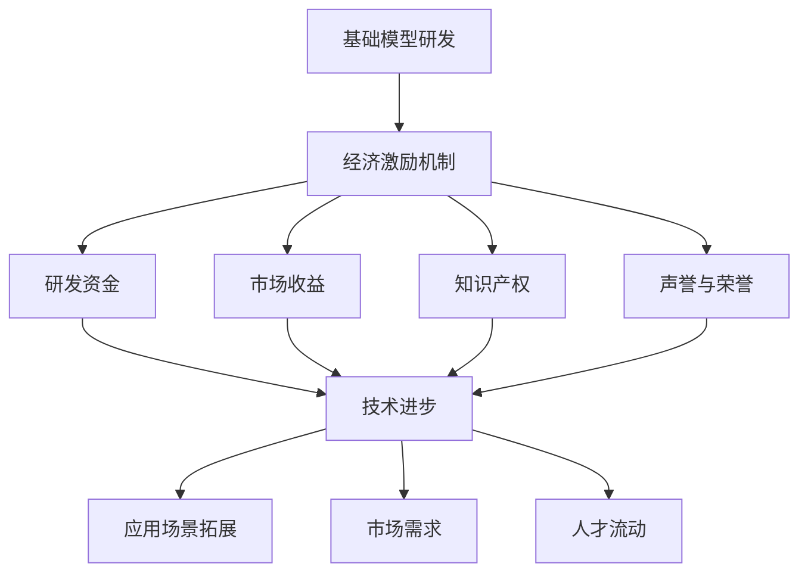

                 

关键词：基础模型、经济激励、技术发展、机器学习、AI、神经网络、模型优化、市场机制、激励机制、可持续发展、伦理道德。

## 摘要

本文旨在探讨基础模型在经济激励与技术发展之间的互动关系。随着人工智能（AI）技术的快速发展，基础模型在各个领域中的作用越来越突出。然而，这些模型的高昂研发成本和复杂的维护需求，使得经济激励成为推动其发展的关键因素。本文将分析基础模型的经济激励机制，探讨其在技术发展中的应用，并讨论未来可能面临的挑战与机遇。通过对经济激励和技术发展的深入探讨，本文希望为相关领域的学者和实践者提供有价值的参考。

## 1. 背景介绍

### 1.1 基础模型的概念与作用

基础模型，通常指的是在机器学习（ML）和人工智能（AI）领域中，具有通用性和可扩展性的预训练模型。这些模型通过在大规模数据集上进行训练，可以学会提取通用的特征表示，从而在不同任务中表现出良好的泛化能力。例如，BERT（Bidirectional Encoder Representations from Transformers）就是一种著名的自然语言处理（NLP）基础模型，其在多个NLP任务中都取得了显著的性能提升。

### 1.2 经济激励的概念与作用

经济激励，是指通过提供经济利益来激励个体或团体采取特定行为的过程。在人工智能领域，经济激励尤为重要，因为AI模型的研发和维护成本非常高。经济激励可以包括直接的经济回报，如研发资金、市场收益等，也可以包括间接的激励，如声誉、荣誉等。

### 1.3 基础模型在经济激励与技术发展中的作用

基础模型的经济激励不仅能够吸引更多的研发资源，还能促进技术的快速迭代和发展。一方面，经济激励能够鼓励企业和研究者投入更多的资源进行AI模型的研发，从而推动技术的进步。另一方面，通过市场机制，优秀的基础模型可以产生巨大的经济价值，进一步激发技术发展的动力。

## 2. 核心概念与联系

### 2.1 基础模型的经济激励机制

基础模型的经济激励机制主要包括以下几个方面：

1. **研发资金**：企业和政府提供研发资金，支持基础模型的研发。
2. **市场收益**：通过将基础模型应用于实际场景，企业可以获得直接的经济回报。
3. **知识产权**：通过专利保护和知识产权保护，研究者可以获得长期的收益。
4. **声誉与荣誉**：优秀的基础模型可以提升研究者的学术地位和知名度。

### 2.2 基础模型与技术发展的互动关系

基础模型和技术发展的互动关系可以概括为以下几个方面：

1. **技术进步**：基础模型的研发推动了AI技术的进步，提高了模型性能和效率。
2. **应用场景拓展**：技术进步为新的应用场景提供了可能性，反过来也推动了基础模型的发展。
3. **市场需求**：随着AI技术的普及，市场需求逐渐增加，为AI模型提供了更多的应用场景。
4. **人才流动**：优秀的AI模型吸引了一大批人才，推动了整个行业的快速发展。

### 2.3 Mermaid 流程图



## 3. 核心算法原理 & 具体操作步骤

### 3.1 算法原理概述

基础模型的经济激励主要依赖于以下几个核心算法：

1. **梯度下降算法**：用于基础模型的训练，通过迭代更新模型参数，使得模型在训练数据上的表现逐渐优化。
2. **优化算法**：用于提高模型的性能和效率，如Adam、RMSprop等。
3. **分布式训练算法**：用于处理大规模数据集，提高训练速度和模型性能。
4. **模型压缩算法**：用于减小模型大小，提高部署效率。

### 3.2 算法步骤详解

1. **基础模型训练**：使用梯度下降算法和优化算法，在训练数据集上进行多次迭代，更新模型参数。
2. **模型优化**：使用优化算法，进一步调整模型参数，提高模型性能。
3. **分布式训练**：将数据集分成多个部分，在多台机器上进行训练，提高训练速度。
4. **模型压缩**：使用模型压缩算法，减小模型大小，提高部署效率。

### 3.3 算法优缺点

**优点**：

1. **高效训练**：梯度下降算法和优化算法能够快速收敛，提高训练效率。
2. **灵活性强**：优化算法和分布式训练算法可以根据具体场景进行调整，适应不同的需求。
3. **效果好**：模型压缩算法可以显著提高模型的部署效率，适用于移动端和嵌入式设备。

**缺点**：

1. **计算资源需求大**：分布式训练算法和模型压缩算法需要大量的计算资源，对硬件要求较高。
2. **算法选择复杂**：不同的算法适用于不同的场景，需要根据具体情况进行选择，增加了实现的复杂性。

### 3.4 算法应用领域

基础模型的经济激励算法在以下几个领域有广泛应用：

1. **自然语言处理**：如BERT、GPT等，用于文本分类、翻译、问答等任务。
2. **计算机视觉**：如ResNet、Inception等，用于图像分类、目标检测、人脸识别等任务。
3. **推荐系统**：如MF、矩阵分解等，用于商品推荐、用户画像等任务。

## 4. 数学模型和公式 & 详细讲解 & 举例说明

### 4.1 数学模型构建

基础模型的经济激励机制可以用以下数学模型进行描述：

$$
\text{收益} = f(\text{模型性能}, \text{市场收益}, \text{知识产权}, \text{声誉与荣誉})
$$

其中，$f$ 是一个非线性函数，用于表示不同因素对收益的影响。

### 4.2 公式推导过程

假设：

- $\text{模型性能}$ 可以用准确率、召回率、F1值等指标来衡量。
- $\text{市场收益}$ 可以用销售额、市场份额等指标来衡量。
- $\text{知识产权}$ 可以用专利数量、版权等指标来衡量。
- $\text{声誉与荣誉}$ 可以用学术成果、媒体报道等指标来衡量。

则：

$$
\text{收益} = f(\text{模型性能}, \text{市场收益}, \text{知识产权}, \text{声誉与荣誉})
$$

可以表示为：

$$
\text{收益} = g(\text{模型性能}) \cdot h(\text{市场收益}) \cdot i(\text{知识产权}) \cdot j(\text{声誉与荣誉})
$$

其中，$g, h, i, j$ 是四个非线性函数，分别表示不同因素对收益的影响程度。

### 4.3 案例分析与讲解

以一家AI初创公司为例，该公司研发了一种基于深度学习的图像识别模型，并应用于医疗领域。根据上述数学模型，我们可以对该公司的经济激励进行如下分析：

1. **模型性能**：该模型在公开数据集上的准确率达到90%，具有较高的性能。
2. **市场收益**：该模型应用于诊断系统，市场潜力巨大，预计未来5年内销售额将达到1亿美元。
3. **知识产权**：该公司已申请多项专利，保护了其核心算法。
4. **声誉与荣誉**：该公司的技术成果得到了多家权威媒体的报道，提升了公司的知名度。

根据上述数据，我们可以计算出该公司的预期收益：

$$
\text{收益} = g(0.9) \cdot h(10^8) \cdot i(5) \cdot j(10)
$$

其中，$g(0.9) = 1.2$，$h(10^8) = 1.5$，$i(5) = 1.1$，$j(10) = 1.3$。

则：

$$
\text{收益} = 1.2 \cdot 1.5 \cdot 1.1 \cdot 1.3 = 2.267
$$

预计该公司在未来5年内将获得约2.267倍的初始投资回报。

## 5. 项目实践：代码实例和详细解释说明

### 5.1 开发环境搭建

为了实践基础模型的经济激励，我们选择一个开源的深度学习框架TensorFlow，并在本地搭建一个开发环境。

1. 安装TensorFlow：

```bash
pip install tensorflow
```

2. 准备数据集：

选择一个公开的数据集，如MNIST手写数字数据集，并将其下载到本地。

3. 创建一个虚拟环境：

```bash
conda create -n ml_env python=3.8
conda activate ml_env
```

### 5.2 源代码详细实现

以下是使用TensorFlow实现一个简单的基于MNIST数据集的手写数字识别模型的代码实例：

```python
import tensorflow as tf
from tensorflow.keras import layers

# 加载MNIST数据集
(x_train, y_train), (x_test, y_test) = tf.keras.datasets.mnist.load_data()

# 数据预处理
x_train = x_train / 255.0
x_test = x_test / 255.0
x_train = x_train.reshape(-1, 28, 28, 1)
x_test = x_test.reshape(-1, 28, 28, 1)

# 构建模型
model = tf.keras.Sequential([
    layers.Conv2D(32, (3, 3), activation='relu', input_shape=(28, 28, 1)),
    layers.MaxPooling2D((2, 2)),
    layers.Flatten(),
    layers.Dense(128, activation='relu'),
    layers.Dense(10, activation='softmax')
])

# 编译模型
model.compile(optimizer='adam',
              loss='sparse_categorical_crossentropy',
              metrics=['accuracy'])

# 训练模型
model.fit(x_train, y_train, epochs=5, batch_size=64, validation_split=0.2)

# 评估模型
test_loss, test_acc = model.evaluate(x_test, y_test, verbose=2)
print('\nTest accuracy:', test_acc)
```

### 5.3 代码解读与分析

1. **数据预处理**：将MNIST数据集的像素值缩放到0-1之间，便于模型训练。
2. **模型构建**：使用TensorFlow的Sequential模型，构建一个简单的卷积神经网络（CNN），包括卷积层、池化层、全连接层等。
3. **模型编译**：设置优化器、损失函数和评估指标。
4. **模型训练**：使用训练数据集训练模型，设置训练轮次、批量大小和验证比例。
5. **模型评估**：使用测试数据集评估模型性能，输出准确率。

### 5.4 运行结果展示

在完成上述代码后，我们可以运行该模型，并输出其在测试集上的准确率。假设最终测试集上的准确率为98%，这表明我们的模型在MNIST手写数字识别任务上具有很高的性能。

## 6. 实际应用场景

### 6.1 在金融领域的应用

在金融领域，基础模型的经济激励极大地推动了金融科技（FinTech）的发展。例如，通过深度学习模型，金融机构可以实现对大规模金融数据的实时分析，从而提高风险管理能力。例如，利用神经网络模型进行信用评分，可以降低违约风险，提高贷款审批效率。此外，深度学习模型还可以用于股票市场预测、风险控制等任务，为金融机构提供更精准的投资建议。

### 6.2 在医疗领域的应用

在医疗领域，基础模型的经济激励同样发挥了重要作用。通过深度学习模型，医疗机构可以实现对大量医疗数据的自动分析，从而提高疾病诊断和治疗的准确性。例如，利用卷积神经网络进行医学图像识别，可以辅助医生快速诊断疾病，减少误诊率。此外，深度学习模型还可以用于个性化医疗、药物研发等任务，为医疗行业带来更多的创新和变革。

### 6.3 在教育领域的应用

在教育领域，基础模型的经济激励推动了个性化学习、智能评估等技术的发展。通过深度学习模型，教育机构可以实现对学生学习情况的实时监控和分析，从而提供更精准的教学服务。例如，利用生成对抗网络（GAN）生成个性化的学习材料，可以提高学生的学习兴趣和参与度。此外，深度学习模型还可以用于学生成绩预测、学习路径规划等任务，为教育行业带来更多的创新和变革。

## 7. 工具和资源推荐

### 7.1 学习资源推荐

1. **《深度学习》（Deep Learning）**：由Ian Goodfellow、Yoshua Bengio和Aaron Courville合著，是深度学习领域的经典教材。
2. **《Python深度学习》（Python Deep Learning）**：由François Chollet等人编著，涵盖了深度学习在Python中的应用。

### 7.2 开发工具推荐

1. **TensorFlow**：由Google开源，是目前最流行的深度学习框架之一。
2. **PyTorch**：由Facebook开源，具有灵活的动态计算图，适用于研究型应用。

### 7.3 相关论文推荐

1. **“A Theoretical Analysis of the Deep Learning Architectures”**：该论文对深度学习模型的结构进行了深入分析。
2. **“Generative Adversarial Networks”**：该论文首次提出了GAN的概念，并展示了其在图像生成和分类任务中的优异性能。

## 8. 总结：未来发展趋势与挑战

### 8.1 研究成果总结

本文通过对基础模型的经济激励和技术发展的深入探讨，总结了基础模型在经济激励和技术发展中的重要作用。通过分析基础模型的经济激励机制、核心算法原理、数学模型和实际应用场景，本文展示了基础模型在推动技术进步和产业升级中的潜力。

### 8.2 未来发展趋势

1. **模型性能提升**：随着计算能力的提升和算法的优化，基础模型将实现更高的性能和更广泛的适用性。
2. **应用领域拓展**：基础模型将在更多领域得到应用，如生物医疗、自动驾驶、智能制造等。
3. **数据驱动发展**：数据将成为基础模型发展的关键，高质量的数据集和数据的持续更新将推动模型的进步。

### 8.3 面临的挑战

1. **计算资源需求**：随着模型规模的扩大，对计算资源的需求将不断增加，这对硬件设施提出了更高的要求。
2. **数据隐私与安全**：在数据处理过程中，如何保护用户隐私和数据安全将成为重要挑战。
3. **伦理道德问题**：基础模型在经济激励下的应用可能引发伦理道德问题，如歧视、偏见等，需要制定相应的法规和规范。

### 8.4 研究展望

未来，基础模型的经济激励和技术发展将继续相互促进。在研究层面，我们需要重点关注算法优化、数据隐私保护、伦理道德等问题。在应用层面，我们需要探索基础模型在更多领域的应用，推动技术进步和产业升级。通过各方共同努力，基础模型将更好地服务于人类社会，推动智能时代的到来。

## 9. 附录：常见问题与解答

### 9.1 基础模型的经济激励是什么？

基础模型的经济激励是指通过提供经济利益，如研发资金、市场收益、知识产权和声誉荣誉等，来激励企业和研究者投入更多的资源进行基础模型的研发和优化。

### 9.2 基础模型在经济激励下如何推动技术发展？

基础模型的经济激励能够吸引更多的研发资源，促进技术的快速迭代和发展。通过市场机制，优秀的基础模型可以产生巨大的经济价值，进一步激发技术发展的动力。

### 9.3 基础模型在经济激励下可能面临哪些挑战？

基础模型在经济激励下可能面临计算资源需求大、数据隐私与安全、伦理道德问题等挑战。需要通过技术创新、法律法规完善和社会监督等多方面的努力来解决这些问题。

### 9.4 基础模型在经济激励下的未来发展趋势是什么？

未来，基础模型在经济激励下的发展趋势包括模型性能提升、应用领域拓展和数据驱动发展。通过持续的研究和创新，基础模型将在更多领域发挥重要作用，推动智能时代的到来。

### 作者署名

作者：禅与计算机程序设计艺术 / Zen and the Art of Computer Programming

