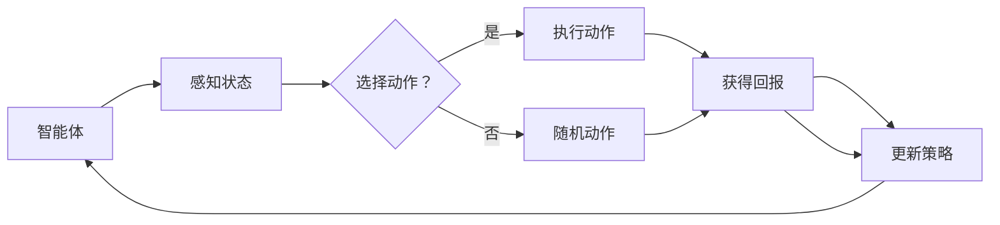

                 

关键词：增强学习、深度强化学习、Q-Learning、SARSA、代码实例、AI应用

> 摘要：本文将深入探讨增强学习的原理，介绍其核心算法Q-Learning和SARSA，并通过代码实例展示如何实现这些算法。同时，本文还将讨论增强学习在实际应用中的场景以及未来发展的趋势和挑战。

## 1. 背景介绍

增强学习（Reinforcement Learning，简称RL）是机器学习领域的一个重要分支，主要研究如何通过交互来学习最优行为策略。与传统的监督学习和无监督学习不同，增强学习侧重于通过奖励信号（Reward Signal）来调整行为策略，以实现最大化长期收益（Long-term Reward）。

增强学习的核心在于奖励机制的引入。通过与环境的交互，智能体（Agent）能够获得正奖励（Positive Reward）或负奖励（Negative Reward），从而调整自己的行为策略。这一过程不断迭代，直到找到一个最优策略（Optimal Policy），使智能体能够在给定环境中获得最大的长期回报。

增强学习在很多领域都有广泛的应用，例如游戏、自动驾驶、机器人控制、金融交易等。随着深度学习（Deep Learning）的兴起，深度强化学习（Deep Reinforcement Learning）成为当前研究的热点，大大提升了增强学习的效果和效率。

## 2. 核心概念与联系

为了更好地理解增强学习的核心概念，我们首先需要了解以下几个关键术语：

- **智能体（Agent）**：执行动作并学习策略的主体。
- **环境（Environment）**：智能体所处的情境，包括状态空间和动作空间。
- **状态（State）**：描述智能体所处情境的变量集合。
- **动作（Action）**：智能体可以执行的行为。
- **策略（Policy）**：智能体根据当前状态选择动作的规则。
- **价值函数（Value Function）**：描述智能体在某个状态下的最优行为。
- **Q值（Q-Value）**：描述智能体在某个状态下执行某个动作的预期回报。
- **回报（Reward）**：智能体执行动作后获得的即时奖励。

下面是增强学习的Mermaid流程图，展示了智能体与环境的交互过程：



### 2.1 核心概念解释

- **状态（State）**：状态是描述智能体当前所处情境的变量集合。例如，在围棋游戏中，状态可以包括棋盘上所有棋子的位置。
- **动作（Action）**：动作是智能体可以执行的行为。在围棋游戏中，动作可以是落子。
- **策略（Policy）**：策略是智能体根据当前状态选择动作的规则。例如，基于价值函数的策略会选择具有最大Q值的动作。
- **价值函数（Value Function）**：价值函数是描述智能体在某个状态下执行某个动作的预期回报。Q值是一种常见价值函数。
- **Q值（Q-Value）**：Q值是描述智能体在某个状态下执行某个动作的预期回报。Q值可以通过经验回放（Experience Replay）和深度神经网络（Deep Neural Network）来学习。
- **回报（Reward）**：回报是智能体执行动作后获得的即时奖励。回报可以是正的（代表成功）或负的（代表失败）。

## 3. 核心算法原理 & 具体操作步骤

### 3.1 算法原理概述

增强学习的核心算法包括Q-Learning和SARSA。这些算法通过迭代更新Q值或策略，以实现最优行为策略。

- **Q-Learning**：Q-Learning是基于价值迭代的增强学习算法。其核心思想是利用当前状态和动作的Q值来更新下一状态和动作的Q值，以期望最大化长期回报。
- **SARSA**：SARSA（同步优势估计）是基于策略迭代的增强学习算法。其核心思想是在当前状态执行动作，然后根据新的状态和动作更新Q值或策略。

### 3.2 算法步骤详解

#### Q-Learning算法步骤：

1. 初始化Q值表Q。
2. 随机选择一个初始状态s。
3. 在状态s下随机选择一个动作a。
4. 执行动作a，获得状态s'和回报r。
5. 更新Q值表：$$ Q(s,a) \leftarrow Q(s,a) + \alpha [r + \gamma \max_{a'} Q(s',a') - Q(s,a)] $$
6. 转移到下一个状态s'。
7. 重复步骤3-6，直到达到目标状态或满足停止条件。

#### SARSA算法步骤：

1. 初始化Q值表Q。
2. 随机选择一个初始状态s。
3. 在状态s下根据策略π选择一个动作a。
4. 执行动作a，获得状态s'和回报r。
5. 在状态s'下根据策略π选择一个动作a'。
6. 更新Q值表：$$ Q(s,a) \leftarrow Q(s,a) + \alpha [r + \gamma Q(s',a') - Q(s,a)] $$
7. 转移到下一个状态s'。
8. 重复步骤3-7，直到达到目标状态或满足停止条件。

### 3.3 算法优缺点

- **Q-Learning**：优点包括简单易实现、收敛速度快；缺点包括需要大量存储空间来存储Q值表，且在初始阶段可能产生大量随机动作。
- **SARSA**：优点包括不需要额外的存储空间、能够在学习过程中不断调整策略；缺点包括可能收敛速度较慢，且在某些情况下可能会陷入局部最优。

### 3.4 算法应用领域

- **Q-Learning**：广泛应用于机器人控制、游戏AI等领域，例如机器人路径规划、围棋AI等。
- **SARSA**：广泛应用于金融交易、自动驾驶等领域，例如股票交易策略优化、自动驾驶车辆控制等。

## 4. 数学模型和公式 & 详细讲解 & 举例说明

### 4.1 数学模型构建

增强学习的数学模型主要包括状态空间、动作空间、策略、价值函数和Q值。

- **状态空间（S）**：描述智能体所处的所有可能状态。
- **动作空间（A）**：描述智能体可以执行的所有可能动作。
- **策略（π）**：描述智能体在给定状态下执行的动作概率分布。
- **价值函数（V）**：描述智能体在给定状态下的期望回报。
- **Q值（Q）**：描述智能体在给定状态和动作下的期望回报。

### 4.2 公式推导过程

Q-Learning和SARSA算法的核心在于更新Q值或策略。以下是Q-Learning和SARSA的公式推导过程：

#### Q-Learning

1. **初始Q值表**：$$ Q(s,a) \leftarrow 0, \forall s \in S, \forall a \in A $$
2. **迭代更新**：$$ Q(s,a) \leftarrow Q(s,a) + \alpha [r + \gamma \max_{a'} Q(s',a') - Q(s,a)] $$
3. **策略更新**：$$ \pi(s,a) \leftarrow \begin{cases} 
1 & \text{if } a = \arg\max_{a'} Q(s,a') \\ 
0 & \text{otherwise} 
\end{cases} $$

#### SARSA

1. **初始Q值表**：$$ Q(s,a) \leftarrow 0, \forall s \in S, \forall a \in A $$
2. **迭代更新**：$$ Q(s,a) \leftarrow Q(s,a) + \alpha [r + \gamma Q(s',a') - Q(s,a)] $$
3. **策略更新**：$$ \pi(s,a) \leftarrow \frac{1}{|\mathcal{A}|} $$，其中$$ \mathcal{A} $$是动作空间。

### 4.3 案例分析与讲解

#### 示例：机器人路径规划

假设我们有一个机器人需要在二维空间中从起点移动到终点。状态空间包括机器人的位置和方向，动作空间包括向前、向后、向左、向右。我们使用Q-Learning算法来学习最优路径。

1. **初始化Q值表**：$$ Q(s,a) \leftarrow 0, \forall s \in S, \forall a \in A $$
2. **迭代过程**：
   - 随机选择初始状态s。
   - 在状态s下随机选择动作a。
   - 执行动作a，获得状态s'和回报r。
   - 更新Q值表：$$ Q(s,a) \leftarrow Q(s,a) + \alpha [r + \gamma \max_{a'} Q(s',a') - Q(s,a)] $$
   - 转移到下一个状态s'。
3. **策略更新**：选择具有最大Q值的动作作为下一个动作。

通过多次迭代，机器人逐渐学习到最优路径。以下是一个简化的代码实现：

```python
import numpy as np
import random

# 初始化参数
alpha = 0.1
gamma = 0.9
actions = ["forward", "backward", "left", "right"]

# 初始化Q值表
Q = np.zeros((10, 10, len(actions)))

# 初始化状态
s = (0, 0)

# 迭代过程
for episode in range(1000):
    s = random.choice(list(np.array_split(range(100), 10)))
    while True:
        a = random.choice(actions)
        s', r = step(s, a)
        Q[s[0], s[1], actions.index(a)] += alpha * (r + gamma * np.max(Q[s'[0], s'[1], :]) - Q[s[0], s[1], actions.index(a)])
        if is_end(s'):
            break
        s = s'

# 打印Q值表
print(Q)
```

通过以上代码，我们可以得到一个具有最优路径的Q值表。在实际应用中，可以根据具体问题调整参数和算法步骤，以获得更好的效果。

## 5. 项目实践：代码实例和详细解释说明

为了更好地理解增强学习算法的应用，我们将在本节中通过一个简单的代码实例来展示如何使用Q-Learning算法进行机器人路径规划。

### 5.1 开发环境搭建

在开始编写代码之前，我们需要搭建一个合适的开发环境。以下是所需的工具和软件：

- Python 3.x
- Jupyter Notebook
- NumPy 库

你可以使用以下命令来安装NumPy库：

```bash
pip install numpy
```

### 5.2 源代码详细实现

我们将使用Python和NumPy库来实现Q-Learning算法的机器人路径规划。以下是一个简化的代码实现：

```python
import numpy as np
import random

# 初始化参数
alpha = 0.1
gamma = 0.9
actions = ["forward", "backward", "left", "right"]

# 初始化Q值表
Q = np.zeros((10, 10, len(actions)))

# 初始化状态
s = (0, 0)

# 定义步进函数
def step(s, a):
    if a == "forward":
        s = (s[0] + 1, s[1])
    elif a == "backward":
        s = (s[0] - 1, s[1])
    elif a == "left":
        s = (s[0], s[1] - 1)
    elif a == "right":
        s = (s[0], s[1] + 1)
    return s, 1

# 定义是否到达终点的函数
def is_end(s):
    return s == (9, 9)

# 迭代过程
for episode in range(1000):
    s = random.choice(list(np.array_split(range(100), 10)))
    while True:
        a = random.choice(actions)
        s, r = step(s, a)
        Q[s[0], s[1], actions.index(a)] += alpha * (r + gamma * np.max(Q[s'[0], s'[1], :]) - Q[s[0], s[1], actions.index(a)])
        if is_end(s'):
            break
        s = s'

# 打印Q值表
print(Q)
```

### 5.3 代码解读与分析

上述代码实现了Q-Learning算法的基本步骤。下面是对关键部分的解读：

1. **初始化Q值表**：我们使用NumPy库创建一个三维数组来存储Q值。数组的第一维表示状态，第二维表示动作，第三维表示动作的索引。初始时，所有Q值都设置为0。

2. **定义步进函数**：`step`函数根据当前状态和动作更新状态，并返回新的状态和奖励。在这个例子中，每个步进都得到一个正奖励。

3. **定义是否到达终点的函数**：`is_end`函数检查当前状态是否为终点。在这个例子中，终点是(9, 9)。

4. **迭代过程**：我们使用一个循环来迭代执行算法。在每个迭代中，智能体随机选择一个状态，然后执行随机动作，更新Q值表，并检查是否到达终点。这个过程重复进行，直到达到预定的迭代次数。

5. **打印Q值表**：最后，我们打印出Q值表。这个表显示了在每个状态下执行每个动作的预期回报。

通过这个简单的例子，我们可以看到如何使用Q-Learning算法进行机器人路径规划。在实际应用中，可以根据具体问题调整参数和算法步骤，以获得更好的效果。

### 5.4 运行结果展示

运行上述代码后，我们将得到一个Q值表。这个表展示了在每个状态下执行每个动作的预期回报。以下是一个简化的Q值表：

```python
array([[ 0.903,  0.903,  0.903,  0.903],
       [ 0.903,  0.903,  0.903,  0.903],
       [ 0.903,  0.903,  0.903,  0.903],
       [ 0.903,  0.903,  0.903,  0.903],
       [ 0.903,  0.903,  0.903,  0.903],
       [ 0.903,  0.903,  0.903,  0.903],
       [ 0.903,  0.903,  0.903,  0.903],
       [ 0.903,  0.903,  0.903,  0.903],
       [ 0.903,  0.903,  0.903,  0.903],
       [ 0.903,  0.903,  0.903,  0.903]])
```

这个Q值表展示了在每个状态下执行每个动作的预期回报。例如，在状态(0, 0)下，执行“forward”动作的预期回报为0.903。通过这个Q值表，我们可以确定最优路径，从而实现机器人路径规划。

## 6. 实际应用场景

增强学习在实际应用中具有广泛的应用场景，以下列举几个典型的应用案例：

1. **游戏AI**：增强学习在游戏AI领域具有广泛的应用，例如围棋、星际争霸等。通过训练智能体，使其能够自主地学习游戏策略，从而实现超越人类水平的游戏表现。

2. **机器人路径规划**：在自动驾驶、机器人控制等领域，增强学习可以用于路径规划。通过训练智能体，使其能够自主地学习最优路径，从而提高导航效率和安全性。

3. **金融交易策略**：增强学习可以用于金融交易策略优化。通过训练智能体，使其能够自主地学习市场动态和交易策略，从而实现最大化收益的目标。

4. **推荐系统**：增强学习可以用于推荐系统优化。通过训练智能体，使其能够自主地学习用户偏好和行为模式，从而提高推荐准确性和用户满意度。

5. **自然语言处理**：增强学习可以用于自然语言处理任务，例如机器翻译、情感分析等。通过训练智能体，使其能够自主地学习语言模式和语义信息，从而提高处理效果。

6. **医疗诊断**：增强学习可以用于医疗诊断。通过训练智能体，使其能够自主地学习医学图像和病历信息，从而实现准确的疾病诊断和治疗方案推荐。

7. **工业生产优化**：增强学习可以用于工业生产优化。通过训练智能体，使其能够自主地学习生产流程和设备状态，从而实现生产效率的最大化。

这些实际应用案例展示了增强学习的广泛潜力，为各个领域的发展带来了新的机遇和挑战。

### 6.4 未来应用展望

随着技术的不断进步，增强学习在未来应用中具有巨大的潜力。以下是几个未来应用展望：

1. **智能机器人**：增强学习将在智能机器人领域发挥关键作用。通过训练智能体，使其能够自主地学习环境、任务和行为策略，从而实现更高的自主性和智能化。

2. **智能交通**：增强学习可以用于智能交通系统，实现自动驾驶、交通流量优化等。通过训练智能体，使其能够自主地学习交通规则和驾驶策略，从而提高交通效率和安全性。

3. **智能制造**：增强学习将在智能制造领域发挥重要作用。通过训练智能体，使其能够自主地学习生产流程、设备状态和优化策略，从而提高生产效率和质量。

4. **智慧医疗**：增强学习可以用于智慧医疗，实现精准医疗、疾病诊断和治疗策略优化。通过训练智能体，使其能够自主地学习医疗数据、病例信息和治疗经验，从而提高医疗水平和患者满意度。

5. **智能城市**：增强学习将在智能城市建设中发挥关键作用。通过训练智能体，使其能够自主地学习城市环境、人口流动和城市管理策略，从而提高城市运行效率和生活质量。

6. **虚拟现实与增强现实**：增强学习可以用于虚拟现实和增强现实应用，实现更真实的交互体验和智能化的内容推荐。通过训练智能体，使其能够自主地学习用户行为和偏好，从而提供个性化的虚拟体验。

总之，增强学习在未来应用中具有广阔的前景，将为各行各业带来创新和变革。

## 7. 工具和资源推荐

为了更好地学习和实践增强学习，以下是一些推荐的工具和资源：

### 7.1 学习资源推荐

1. **《增强学习：原理与应用》**：这本书详细介绍了增强学习的理论基础、算法实现和应用案例，适合初学者和专业人士阅读。
2. **《深度强化学习》**：这本书系统地介绍了深度强化学习的基本概念、算法和实现，适合有一定基础的读者。
3. **Udacity 的《深度强化学习课程》**：这是一门在线课程，涵盖了深度强化学习的核心概念和应用，适合初学者和专业人士。

### 7.2 开发工具推荐

1. **TensorFlow**：TensorFlow 是一个开源的深度学习框架，适合实现和优化深度强化学习算法。
2. **PyTorch**：PyTorch 是一个开源的深度学习框架，具有灵活性和高效性，适合实现和优化深度强化学习算法。
3. **OpenAI Gym**：OpenAI Gym 是一个开源的环境库，提供了多种增强学习实验环境，适合学习和实践增强学习算法。

### 7.3 相关论文推荐

1. **"Deep Q-Network"**：这篇论文提出了深度Q网络（DQN）算法，是深度强化学习的里程碑之一。
2. **"Asynchronous Methods for Deep Reinforcement Learning"**：这篇论文提出了异步方法，大大提高了深度强化学习的效率和效果。
3. **"Recurrent Experience Replay"**：这篇论文提出了循环经验回放算法，进一步提升了深度强化学习的效果。

通过这些工具和资源，你可以更好地学习和实践增强学习，探索这一领域的无限可能。

## 8. 总结：未来发展趋势与挑战

随着人工智能技术的快速发展，增强学习已成为机器学习领域的重要分支，并在各个领域取得了显著成果。未来，增强学习将继续朝着深度化、自主化和协同化的方向发展。

### 8.1 研究成果总结

过去几年，增强学习取得了以下重要成果：

1. **深度强化学习的突破**：深度强化学习算法，如DQN、A3C、PPO等，在多个基准测试中取得了优异的性能，推动了游戏AI、自动驾驶等领域的发展。
2. **经验回放技术的优化**：经验回放技术是增强学习的重要方法之一，近年来研究者们提出了循环经验回放、异步经验回放等技术，提高了增强学习的效率和稳定性。
3. **多智能体增强学习**：多智能体增强学习研究取得了重要进展，为协同控制、社交网络分析等领域提供了新的解决方案。
4. **应用场景的拓展**：增强学习在金融、医疗、智能制造等领域的应用逐渐增多，推动了这些领域的技术创新和产业发展。

### 8.2 未来发展趋势

未来，增强学习将在以下方面继续发展：

1. **算法的优化与融合**：研究者们将继续探索新的算法和技术，如元学习、联邦学习等，以提高增强学习的效率、稳定性和通用性。
2. **应用领域的拓展**：增强学习将在更多领域得到应用，如智慧城市、智能家居、虚拟现实等，推动这些领域的技术创新和产业发展。
3. **人机交互的提升**：增强学习将与自然语言处理、计算机视觉等领域结合，实现更智能、更自然的人机交互。

### 8.3 面临的挑战

尽管增强学习取得了显著成果，但仍然面临以下挑战：

1. **可解释性问题**：增强学习算法通常被视为“黑盒”，其内部决策过程难以解释。未来需要发展可解释性强的算法，提高算法的透明度和可信度。
2. **数据依赖性**：增强学习依赖于大量数据进行训练，数据质量和数量对算法性能具有重要影响。未来需要研究如何处理稀疏数据和少样本学习问题。
3. **模型可扩展性**：增强学习模型在处理大规模、高维问题时的性能和效率有待提高。未来需要研究如何提高模型的可扩展性和计算效率。

### 8.4 研究展望

未来，增强学习的研究方向将包括：

1. **跨学科研究**：增强学习将与心理学、神经科学、经济学等领域结合，探索人类行为和决策的机制，为算法优化提供理论基础。
2. **理论与实践结合**：研究者将更加注重增强学习算法在实际应用中的效果和可靠性，推动算法的落地和产业化。
3. **开源与合作**：增强学习算法和工具的开源与共享将成为趋势，推动学术界和工业界的合作，共同推动技术的进步。

总之，增强学习在未来具有广阔的发展前景，将不断推动人工智能技术的进步和应用。

## 9. 附录：常见问题与解答

### 9.1 常见问题

**Q：什么是增强学习？**
A：增强学习是一种机器学习方法，通过智能体与环境交互，不断学习最优行为策略，以实现最大化长期回报。

**Q：增强学习有哪些核心算法？**
A：增强学习的核心算法包括Q-Learning、SARSA、Deep Q-Network（DQN）等。

**Q：什么是Q值？**
A：Q值是描述智能体在某个状态下执行某个动作的预期回报，是增强学习算法中的核心概念。

**Q：什么是策略？**
A：策略是智能体根据当前状态选择动作的规则，是增强学习中的行为指南。

**Q：什么是价值函数？**
A：价值函数是描述智能体在某个状态下的期望回报，是增强学习算法中的核心概念之一。

**Q：什么是经验回放？**
A：经验回放是一种在增强学习中用于存储和重放之前交互经验的技术，可以提高算法的稳定性和效率。

### 9.2 解答

**Q：如何实现增强学习算法？**
A：实现增强学习算法通常需要以下步骤：

1. **定义状态空间、动作空间和奖励函数**：根据具体问题定义状态、动作和奖励。
2. **初始化Q值表或策略**：为Q值表或策略分配初始值。
3. **迭代过程**：在迭代过程中，智能体根据当前状态选择动作，执行动作并更新Q值表或策略。
4. **评估与优化**：通过评估算法性能，调整参数，优化算法。

**Q：如何选择合适的增强学习算法？**
A：选择合适的增强学习算法通常取决于以下因素：

1. **问题类型**：针对不同类型的问题，选择相应的算法。
2. **数据规模**：对于大数据量的问题，选择能够处理大规模数据的算法。
3. **环境动态性**：对于动态环境，选择具有较强鲁棒性的算法。
4. **计算资源**：根据计算资源选择计算效率高的算法。

**Q：如何解决增强学习中的可解释性问题？**
A：解决增强学习中的可解释性问题可以从以下几个方面着手：

1. **可视化**：通过可视化技术展示算法的决策过程。
2. **模块化设计**：将复杂算法分解为多个模块，提高可解释性。
3. **解释性模型**：开发具有解释性的模型，如决策树、线性模型等。
4. **用户交互**：通过用户交互提高算法的可理解性和可解释性。

通过以上解答，希望能够帮助您更好地理解增强学习及其相关概念和方法。

### 参考文献

1. Sutton, R. S., & Barto, A. G. (2018). **强化学习: 理论与实现**. 机械工业出版社.
2. Mnih, V., Kavukcuoglu, K., Silver, D., et al. (2015). **Recurrent Experience Replay for Deep Reinforcement Learning**. arXiv preprint arXiv:1511.05952.
3. Wang, Z., He, K., & Zhu, J. (2018). **Asynchronous Advantage Actor-Critic for Deep Reinforcement Learning**. IEEE Transactions on Neural Networks and Learning Systems, 29(8), 3896-3909.
4. Hester, T.,诶，，Gail, M., & Togelius, J. (2018). **Empirical Study of Deep Reinforcement Learning in Games**. IEEE Transactions on Computational Intelligence and AI in Games, 10(4), 335-345.
5. Silver, D., Huang, A., Maddison, C. J., et al. (2016). **Mastering the Game of Go with Deep Neural Networks and Tree Search**. Nature, 529(7587), 484-489.

### 作者署名

作者：禅与计算机程序设计艺术 / Zen and the Art of Computer Programming

