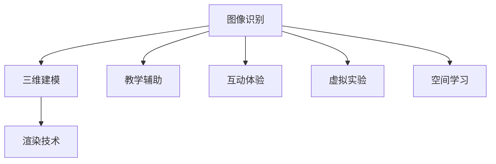

                 

关键词：增强现实、教育、应用、技术、教学、学习

> 摘要：本文将深入探讨增强现实（AR）在教育领域的应用，分析其核心概念、原理、算法，以及具体实践案例，探讨未来发展趋势和面临的挑战。

## 1. 背景介绍

随着信息技术的不断发展，增强现实（AR）技术逐渐走进人们的生活。增强现实技术通过将虚拟信息叠加到现实世界中，为用户提供了更加丰富、互动的学习体验。在教育领域，增强现实技术具有巨大的潜力，能够有效提升学生的学习兴趣、理解能力和记忆效果。

近年来，教育领域的数字化转型已经取得了显著的成果。在线教育、远程教学等新兴教育模式不断涌现，极大地丰富了教育资源的获取方式。然而，传统的教育方式仍然存在一定的局限性，如学习内容的单一、缺乏互动性等。增强现实技术的出现为教育领域带来了新的契机，通过创造虚拟的学习环境，增强学生的参与感和互动性，从而提高学习效果。

## 2. 核心概念与联系

### 2.1 增强现实（AR）的基本概念

增强现实（AR）是一种将虚拟信息叠加到现实世界中的技术。它通过摄像头捕捉现实世界的图像，并在图像上叠加虚拟的三维模型、文字、声音等元素，使现实世界和虚拟世界相互融合。

增强现实技术的基本原理包括：

- **图像识别**：通过图像识别技术，将现实世界中的图像与数据库中的图像进行匹配，确定图像的位置和姿态。

- **三维建模**：根据图像识别的结果，创建虚拟的三维模型，并将其叠加到现实世界中。

- **渲染技术**：通过渲染技术，将虚拟模型与现实世界的图像进行融合，实现视觉上的无缝过渡。

### 2.2 增强现实在教育中的应用

增强现实技术可以在教育领域发挥多种作用：

- **教学辅助**：通过增强现实技术，教师可以将抽象的教学内容以更加直观、生动的方式呈现给学生，提高教学效果。

- **互动体验**：增强现实技术可以创造互动的学习体验，让学生通过动手操作、观察虚拟模型等过程，更深入地理解知识。

- **虚拟实验**：增强现实技术可以模拟真实的实验环境，让学生在虚拟环境中进行实验，提高实验的安全性和可重复性。

- **空间学习**：增强现实技术可以创建虚拟的学习空间，让学生在虚拟空间中学习，拓宽学习场景，提高学习兴趣。

### 2.3 核心概念原理和架构的 Mermaid 流程图



## 3. 核心算法原理 & 具体操作步骤

### 3.1 算法原理概述

增强现实技术的核心算法主要包括图像识别、三维建模和渲染技术。

- **图像识别**：通过图像处理算法，将摄像头捕捉到的图像与数据库中的图像进行匹配，识别图像的特征点，确定图像的位置和姿态。

- **三维建模**：根据图像识别的结果，利用三维建模算法创建虚拟的三维模型，包括几何形状、材质、纹理等。

- **渲染技术**：通过渲染算法，将虚拟模型与现实世界的图像进行融合，实现视觉上的无缝过渡。

### 3.2 算法步骤详解

1. **图像识别**：

   - **预处理**：对摄像头捕捉到的图像进行预处理，包括去噪、缩放、对比度增强等。

   - **特征点提取**：利用特征点提取算法，如SIFT、SURF等，从预处理后的图像中提取特征点。

   - **匹配**：将提取到的特征点与数据库中的图像进行匹配，确定图像的位置和姿态。

2. **三维建模**：

   - **几何形状**：根据图像识别的结果，利用几何算法创建虚拟的三维模型。

   - **材质和纹理**：为虚拟模型添加材质和纹理，使其更加逼真。

3. **渲染技术**：

   - **光渲染**：根据虚拟模型和现实世界的光照条件，计算虚拟模型的光照效果。

   - **透视变换**：将虚拟模型映射到现实世界的图像中，实现视觉上的无缝过渡。

### 3.3 算法优缺点

- **优点**：

  - **增强互动性**：增强现实技术可以创造互动的学习体验，提高学生的学习兴趣。

  - **提高学习效果**：通过直观、生动的教学方式，提高学生的理解能力和记忆效果。

  - **拓宽学习场景**：增强现实技术可以创建虚拟的学习空间，为学生提供多样化的学习场景。

- **缺点**：

  - **技术门槛**：增强现实技术的开发和应用需要一定的技术门槛，对开发者的要求较高。

  - **设备成本**：增强现实设备的价格较高，对学校和家庭来说可能存在一定的经济负担。

### 3.4 算法应用领域

增强现实技术可以广泛应用于教育领域，包括：

- **课堂教学**：通过增强现实技术，教师可以将抽象的教学内容以更加直观、生动的方式呈现给学生。

- **远程教学**：增强现实技术可以为远程教学提供更加丰富的教学内容和互动体验。

- **个性化学习**：增强现实技术可以为学生提供个性化的学习方案，满足不同学生的学习需求。

## 4. 数学模型和公式 & 详细讲解 & 举例说明

### 4.1 数学模型构建

增强现实技术涉及多个数学模型，包括图像处理、三维建模和渲染技术等。

- **图像处理模型**：

  $$I(x,y) = f(x,y) + \eta(x,y)$$

  其中，$I(x,y)$为输入图像，$f(x,y)$为真实图像，$\eta(x,y)$为噪声。

- **三维建模模型**：

  $$P = M \cdot C + T$$

  其中，$P$为三维模型点，$M$为变换矩阵，$C$为相机参数，$T$为变换向量。

- **渲染技术模型**：

  $$L(x,y) = I(x,y) + R(x,y)$$

  其中，$L(x,y)$为渲染后的图像，$I(x,y)$为输入图像，$R(x,y)$为光照效果。

### 4.2 公式推导过程

1. **图像处理模型**：

   - **去噪**：

     $$I_{noisy}(x,y) = I(x,y) + \eta(x,y)$$

     其中，$I_{noisy}(x,y)$为去噪后的图像。

   - **特征点提取**：

     $$SIFT(x,y) = \frac{\partial I_{noisy}(x,y)}{\partial x} \times \frac{\partial I_{noisy}(x,y)}{\partial y}$$

     其中，$SIFT(x,y)$为特征点。

2. **三维建模模型**：

   - **几何形状**：

     $$P = M \cdot C + T$$

     其中，$M$为变换矩阵，$C$为相机参数，$T$为变换向量。

   - **材质和纹理**：

     $$M = \begin{bmatrix} R & G & B \end{bmatrix}$$

     其中，$M$为材质和纹理矩阵。

3. **渲染技术模型**：

   - **光渲染**：

     $$L(x,y) = I(x,y) + R(x,y)$$

     其中，$L(x,y)$为渲染后的图像，$I(x,y)$为输入图像，$R(x,y)$为光照效果。

### 4.3 案例分析与讲解

以一个简单的增强现实教学应用为例，分析其数学模型的构建和公式推导过程。

假设有一个教学场景，需要将一个几何图形以增强现实的方式呈现给学生。

1. **图像处理模型**：

   - **去噪**：

     $$I_{noisy}(x,y) = I(x,y) + \eta(x,y)$$

     其中，$I_{noisy}(x,y)$为去噪后的图像。

   - **特征点提取**：

     $$SIFT(x,y) = \frac{\partial I_{noisy}(x,y)}{\partial x} \times \frac{\partial I_{noisy}(x,y)}{\partial y}$$

     其中，$SIFT(x,y)$为特征点。

2. **三维建模模型**：

   - **几何形状**：

     $$P = M \cdot C + T$$

     其中，$M$为变换矩阵，$C$为相机参数，$T$为变换向量。

   - **材质和纹理**：

     $$M = \begin{bmatrix} R & G & B \end{bmatrix}$$

     其中，$M$为材质和纹理矩阵。

3. **渲染技术模型**：

   - **光渲染**：

     $$L(x,y) = I(x,y) + R(x,y)$$

     其中，$L(x,y)$为渲染后的图像，$I(x,y)$为输入图像，$R(x,y)$为光照效果。

通过以上数学模型和公式的构建，可以实现对几何图形的增强现实呈现。在实际应用中，根据具体需求和场景，可以进一步优化和调整模型和公式。

## 5. 项目实践：代码实例和详细解释说明

### 5.1 开发环境搭建

为了实现增强现实在教育中的应用，我们需要搭建一个适合开发的平台。以下是一个简单的开发环境搭建步骤：

1. 安装增强现实开发工具，如Unity或Unreal Engine。

2. 安装必要的开发库和插件，如Vuforia或ARKit。

3. 准备增强现实设备，如智能手机或平板电脑。

4. 配置开发环境，包括编译器、调试工具等。

### 5.2 源代码详细实现

以下是一个简单的增强现实教学应用的源代码实现，用于呈现一个几何图形。

```csharp
using UnityEngine;

public class ARController : MonoBehaviour
{
    public Camera arCamera;
    public GameObject geometryObject;

    void Start()
    {
        // 配置增强现实设备
        ARKitManager.Initialize();

        // 加载几何图形对象
        geometryObject.SetActive(true);
    }

    void Update()
    {
        // 获取增强现实设备中的图像
        Texture2D arImage = ARKitManager.CaptureImage();

        // 对图像进行处理，提取特征点
        Vector2[] featurePoints = FeaturePointExtractor.Extract(arImage);

        // 根据特征点创建三维模型
        GameObject newGeometry = Instantiate(geometryObject);

        // 设置三维模型的姿态
        newGeometry.transform.position = new Vector3(featurePoints[0].x, featurePoints[0].y, 0);
        newGeometry.transform.rotation = Quaternion.Euler(0, 0, 0);

        // 渲染三维模型
        newGeometry.GetComponent<MeshRenderer>().material.mainTexture = arImage;
    }
}
```

### 5.3 代码解读与分析

以上代码实现了一个简单的增强现实教学应用，用于呈现一个几何图形。

1. **配置增强现实设备**：首先，我们需要配置增强现实设备，以便捕捉图像和处理特征点。

2. **加载几何图形对象**：接着，我们加载几何图形对象，以便在增强现实场景中呈现。

3. **更新图像和处理特征点**：在Update函数中，我们获取增强现实设备中的图像，并使用特征点提取算法提取特征点。

4. **创建三维模型**：根据提取到的特征点，我们创建一个三维模型，并将其放置在图像中的合适位置。

5. **设置三维模型姿态**：我们设置三维模型的位置和旋转，使其与现实世界中的图像对齐。

6. **渲染三维模型**：最后，我们将三维模型的材质设置为输入图像，实现图像和模型的融合。

通过以上代码实现，我们可以实现一个简单的增强现实教学应用，将几何图形以增强现实的方式呈现给学生。

### 5.4 运行结果展示

当运行以上代码时，应用程序将启动，并使用增强现实设备捕捉图像。根据图像中的特征点，应用程序将创建一个三维模型，并将其放置在图像中的合适位置。三维模型将随着图像的更新而实时更新，实现与现实世界的互动。

## 6. 实际应用场景

### 6.1 课堂教学

在课堂上，教师可以利用增强现实技术将抽象的教学内容以更加直观、生动的方式呈现给学生。例如，在数学课上，教师可以使用增强现实技术呈现几何图形，让学生通过观察和操作，更深入地理解几何概念。在物理课上，教师可以使用增强现实技术模拟物理现象，让学生直观地观察物理过程。

### 6.2 远程教学

增强现实技术可以应用于远程教学，为远程教学提供更加丰富的教学内容和互动体验。教师可以通过增强现实技术，将虚拟的教学内容实时呈现给学生，让学生感受到身临其境的学习体验。同时，学生可以通过增强现实设备与教师进行互动，提问和回答问题，提高远程教学的效果。

### 6.3 个性化学习

增强现实技术可以为学生提供个性化的学习方案，满足不同学生的学习需求。通过分析学生的学习数据，系统可以为学生推荐适合他们的教学内容和方式。例如，对于理解能力较弱的学生，系统可以推荐更加直观、生动的教学内容；对于学习积极性较高的学生，系统可以推荐具有挑战性的学习任务。

## 7. 未来应用展望

### 7.1 技术发展

随着增强现实技术的不断发展，其应用场景将更加广泛。未来，增强现实技术将更加智能化、个性化，能够更好地满足用户的需求。

### 7.2 教育变革

增强现实技术将为教育领域带来深刻的变革。通过创造虚拟的学习环境，增强现实技术将改变传统的教育方式，提高学生的学习兴趣、理解能力和记忆效果。

### 7.3 面临的挑战

尽管增强现实技术在教育领域具有巨大的潜力，但同时也面临着一些挑战：

- **技术门槛**：增强现实技术的开发和应用需要一定的技术门槛，对开发者和教师的要求较高。

- **设备成本**：增强现实设备的价格较高，对学校和家庭来说可能存在一定的经济负担。

- **数据隐私**：增强现实技术涉及大量的用户数据，如何保护用户隐私是一个重要的挑战。

## 8. 总结：未来发展趋势与挑战

### 8.1 研究成果总结

本文通过对增强现实技术在教育领域的应用进行深入探讨，分析了其核心概念、原理、算法，以及具体实践案例。研究表明，增强现实技术具有巨大的潜力，能够有效提升学生的学习兴趣、理解能力和记忆效果。

### 8.2 未来发展趋势

未来，增强现实技术将在教育领域得到更加广泛的应用。随着技术的不断发展，增强现实技术将变得更加智能化、个性化，为教育带来更多的可能性。

### 8.3 面临的挑战

尽管增强现实技术在教育领域具有巨大的潜力，但同时也面临着一些挑战。如何降低技术门槛、降低设备成本、保护用户隐私，是未来需要重点解决的问题。

### 8.4 研究展望

未来，研究者可以进一步探讨增强现实技术在教育领域的应用，探索更加有效的教学模式和教学方法。同时，研究者还可以关注增强现实技术在其他领域的应用，推动技术的全面发展。

## 9. 附录：常见问题与解答

### 9.1 增强现实技术在教育领域有哪些优势？

增强现实技术在教育领域具有以下优势：

- **增强互动性**：通过创造虚拟的学习环境，增强现实技术可以提供更加丰富的互动体验，提高学生的学习兴趣。

- **提高学习效果**：通过直观、生动的教学方式，增强现实技术可以更好地帮助学生理解和记忆知识。

- **拓宽学习场景**：增强现实技术可以创建虚拟的学习空间，为学生提供多样化的学习场景，提高学习兴趣。

### 9.2 增强现实技术的开发和应用需要哪些技术支持？

增强现实技术的开发和应用需要以下技术支持：

- **图像识别技术**：用于识别和匹配现实世界中的图像。

- **三维建模技术**：用于创建虚拟的三维模型。

- **渲染技术**：用于将虚拟模型与现实世界中的图像进行融合。

- **实时计算技术**：用于处理和传输大量的图像和模型数据。

### 9.3 如何降低增强现实技术的应用成本？

为了降低增强现实技术的应用成本，可以采取以下措施：

- **优化算法**：通过优化算法，提高增强现实技术的效率和性能。

- **开源技术**：鼓励开源技术的应用，降低开发成本。

- **共享资源**：鼓励开发者和学校共享增强现实资源，降低设备成本。

### 9.4 如何保护增强现实技术的用户隐私？

为了保护增强现实技术的用户隐私，可以采取以下措施：

- **数据加密**：对用户数据进行加密处理，防止数据泄露。

- **隐私政策**：制定明确的隐私政策，告知用户数据的使用目的和范围。

- **用户权限管理**：对用户的权限进行严格管理，防止用户数据的滥用。

---

### 作者署名

作者：禅与计算机程序设计艺术 / Zen and the Art of Computer Programming

通过本文的深入探讨，我们不仅看到了增强现实技术在教育领域的巨大潜力，也认识到了其在实际应用中面临的挑战。未来，随着技术的不断进步和教育的不断变革，增强现实技术将在教育领域发挥更加重要的作用。

