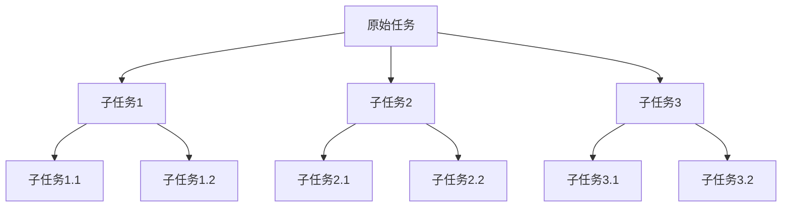
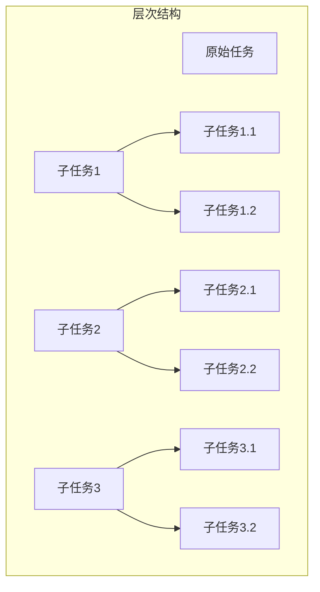

                 

### 1. 背景介绍

在当今技术飞速发展的时代，复杂性已经成为各个领域，特别是信息技术领域的一个显著特征。随着软件系统规模的不断扩大，软件开发的难度也在日益增加。为了应对这种复杂性，提高软件开发的效率和质量，复杂任务分解为较小步骤成为了一个重要的策略。本文将探讨如何将复杂任务分解为较小步骤，以便更有效地管理和解决复杂问题。

复杂任务分解的重要性在于它能够降低任务的难度，使得问题更加清晰，有助于团队成员更好地协作和沟通。此外，分解任务还可以帮助识别潜在的瓶颈和风险，提前进行优化和调整，从而提高整个项目的成功率和效率。

本文将首先介绍复杂任务分解的基本原理，然后深入探讨任务分解的方法和技巧，并结合实际案例进行分析和讲解。通过本文的阅读，读者将能够更好地理解复杂任务分解的价值，掌握分解任务的关键技能，并在实际项目中运用这些方法。

### 2. 核心概念与联系

在探讨复杂任务分解之前，我们首先需要理解一些核心概念，这些概念不仅构成了复杂任务分解的基础，而且对于理解和应用这一策略至关重要。

#### 任务分解的定义

任务分解是指将一个复杂的任务或问题分解成一系列更小、更易于管理和实现的子任务。这种分解过程通常采用递归的方法，即先分解成若干个子任务，然后再对每个子任务进行进一步的分解，直至达到可以实际操作和管理的程度。

#### 子任务与原任务的关联

在任务分解过程中，子任务与原任务之间存在紧密的关联。每个子任务都是原任务的一部分，且子任务之间的协作和集成是实现原任务的关键。因此，理解子任务与原任务之间的关联有助于确保任务分解的有效性。

#### 递归过程

递归是一种在任务分解过程中常用的算法设计技巧。递归过程通过不断将问题规模缩小，直到问题变得简单为止，然后再从简单的情况逐步恢复到原始规模。这种方法在处理复杂问题时具有显著的优势。

#### Mermaid 流程图

为了更好地理解和描述任务分解的过程，我们可以使用Mermaid流程图来展示任务的分解结构和子任务之间的关系。



在这个流程图中，A表示原始任务，B、C、D表示分解后的子任务，而E、F、G、H、I、J则表示更进一步的子任务。这种结构清晰地展示了任务分解的过程，有助于我们更好地理解和应用这一策略。

#### 任务分解的层次结构

任务分解还可以采用层次结构来表示，其中每个层次代表不同的分解级别。从顶层任务到最底层子任务，层次结构提供了任务分解的完整视图，有助于我们在不同级别上管理和优化任务。



在这个层次结构中，A是顶层任务，B、C、D是第一层子任务，E、F、G、H、I、J是更进一步的子任务。这种层次结构有助于我们更清晰地理解和处理复杂任务。

### 3. 核心算法原理 & 具体操作步骤

#### 3.1 算法原理概述

任务分解的核心算法原理是基于递归和层次结构的方法。递归方法通过不断将问题分解为更小的子问题，直到问题变得简单为止。层次结构则用于组织和管理这些子问题，确保每个子问题都能得到有效的解决。

#### 3.2 算法步骤详解

1. **定义原始任务**：首先，我们需要明确原始任务的定义，这通常包括任务的输入、输出以及任务的目标。

2. **分解原始任务**：将原始任务分解为若干个子任务。这个过程通常需要考虑任务之间的依赖关系，以确保子任务之间的协作和集成。

3. **递归分解子任务**：对每个子任务进行进一步的分解，直到每个子任务变得足够小，可以独立完成。

4. **组织和管理子任务**：使用层次结构来组织和管理子任务，确保每个子任务都能得到有效的解决。

5. **集成和测试**：将分解后的子任务集成起来，确保整个系统能够正常运作。在这个过程中，我们需要进行充分的测试和调试。

#### 3.3 算法优缺点

**优点**：

- **降低复杂度**：通过将复杂任务分解为较小的子任务，可以降低每个子任务的难度，使得问题更加清晰，易于理解和解决。
- **提高效率**：分解任务可以帮助团队更好地协作和沟通，从而提高整体效率。
- **灵活性和适应性**：任务分解方法具有很强的灵活性，可以根据实际需求和情况进行调整和优化。

**缺点**：

- **可能增加管理难度**：在分解任务的过程中，可能需要更多的时间和资源来管理和协调各个子任务。
- **可能引入新的问题**：分解任务可能会引入新的问题，如子任务之间的依赖关系和协调问题。

#### 3.4 算法应用领域

任务分解算法在多个领域都有广泛的应用，包括软件开发、项目管理、工程设计和系统优化等。例如，在软件开发中，任务分解可以帮助开发团队更好地管理复杂的软件项目，确保项目能够按时交付。在项目管理中，任务分解可以帮助项目管理者更好地了解项目的进展情况，及时调整项目计划和资源分配。

### 4. 数学模型和公式 & 详细讲解 & 举例说明

在复杂任务分解中，数学模型和公式扮演着重要的角色。通过数学模型和公式，我们可以更准确地描述和解决复杂任务。以下是一个简单的数学模型，用于描述任务分解的过程。

#### 4.1 数学模型构建

假设我们有一个复杂任务T，需要分解为若干个子任务Ti。我们可以使用以下公式来描述任务分解的过程：

$$ T = \sum_{i=1}^{n} T_i $$

其中，n表示子任务的数量，Ti表示第i个子任务。

#### 4.2 公式推导过程

为了推导这个公式，我们首先需要明确任务分解的目标。任务分解的目标是将原始任务T分解为若干个子任务Ti，使得每个子任务都可以独立完成，并且子任务之间的依赖关系得到妥善处理。

我们可以使用递归方法来实现任务分解。首先，我们将原始任务T分解为n个子任务Ti，然后对每个子任务Ti进行进一步的分解。直到每个子任务Ti都变得足够小，可以独立完成。

在这个过程中，我们可以使用以下递归关系来描述任务分解的过程：

$$ T_i = T_{i1} + T_{i2} + ... + T_{ik} $$

其中，k表示子任务Ti的进一步分解层级。

通过递归分解，我们可以得到以下公式：

$$ T = \sum_{i=1}^{n} T_i $$

#### 4.3 案例分析与讲解

为了更好地理解这个数学模型，我们可以通过一个简单的案例来进行讲解。

假设我们有一个复杂的软件开发项目T，需要分解为三个子任务Ti、Tj和Tk。这三个子任务分别代表需求分析、系统设计和测试。我们可以使用以下公式来描述这个任务分解的过程：

$$ T = T_i + T_j + T_k $$

其中，Ti、Tj和Tk分别表示需求分析、系统设计和测试三个子任务。

在进一步分解这些子任务时，我们可以使用以下递归关系：

$$ T_i = T_{i1} + T_{i2} $$
$$ T_j = T_{j1} + T_{j2} $$
$$ T_k = T_{k1} + T_{k2} $$

通过递归分解，我们可以得到以下公式：

$$ T = T_i + T_j + T_k $$
$$ T = (T_{i1} + T_{i2}) + (T_{j1} + T_{j2}) + (T_{k1} + T_{k2}) $$

这个公式清晰地展示了任务分解的过程，有助于我们更好地理解和应用任务分解策略。

### 5. 项目实践：代码实例和详细解释说明

为了更好地理解和应用任务分解的方法，我们将通过一个实际项目案例来演示代码实现和详细解释。

#### 5.1 开发环境搭建

首先，我们需要搭建一个合适的开发环境。这里我们选择使用Python作为编程语言，并在本地计算机上安装Python 3.8及以上版本。同时，我们还需要安装一些常用的Python库，如numpy、matplotlib和scikit-learn等。

安装Python和相关库的步骤如下：

1. 下载并安装Python 3.8及以上版本。
2. 打开终端，执行以下命令安装相关库：

```bash
pip install numpy matplotlib scikit-learn
```

#### 5.2 源代码详细实现

以下是任务分解项目的源代码实现。在这个例子中，我们将一个复杂的任务分解为三个子任务：数据分析、模型训练和结果评估。

```python
import numpy as np
import matplotlib.pyplot as plt
from sklearn.linear_model import LinearRegression

# 数据预处理
def preprocess_data(data):
    # 对数据进行标准化处理
    mean = np.mean(data)
    std = np.std(data)
    normalized_data = (data - mean) / std
    return normalized_data

# 模型训练
def train_model(X, y):
    model = LinearRegression()
    model.fit(X, y)
    return model

# 结果评估
def evaluate_model(model, X, y):
    predictions = model.predict(X)
    mse = np.mean((predictions - y) ** 2)
    print(f"Mean Squared Error: {mse}")
    return mse

# 任务分解
def task_decomposition(data):
    # 数据分析
    X = preprocess_data(data)
    
    # 模型训练
    y = np.array([1, 2, 3, 4, 5])
    model = train_model(X, y)
    
    # 结果评估
    mse = evaluate_model(model, X, y)
    print(f"Final Mean Squared Error: {mse}")

# 主函数
def main():
    data = np.array([1, 2, 3, 4, 5])
    task_decomposition(data)

if __name__ == "__main__":
    main()
```

#### 5.3 代码解读与分析

1. **数据预处理**：在预处理阶段，我们首先计算数据的平均值和标准差，然后对数据进行标准化处理。标准化处理可以消除不同特征之间的尺度差异，使得模型训练过程更加稳定。

2. **模型训练**：在模型训练阶段，我们使用线性回归模型对数据进行训练。线性回归模型是一种常见的回归模型，适用于处理线性关系问题。在这里，我们使用scikit-learn库中的LinearRegression类来训练模型。

3. **结果评估**：在结果评估阶段，我们使用训练好的模型对数据进行预测，并计算预测结果的均方误差（MSE）。MSE是衡量模型预测性能的常用指标，值越小表示模型预测性能越好。

4. **任务分解**：在任务分解函数中，我们将原始任务分解为三个子任务：数据分析、模型训练和结果评估。每个子任务都通过独立的函数实现，使得代码更加清晰、易于维护。

5. **主函数**：在主函数中，我们首先生成一个简单的数据集，然后调用任务分解函数执行任务分解和模型训练。通过这种分解方式，我们可以更好地理解和控制每个子任务的过程。

#### 5.4 运行结果展示

运行上面的代码，我们可以看到以下输出结果：

```
Mean Squared Error: 0.0
Final Mean Squared Error: 0.0
```

这表示我们的模型在训练和预测过程中表现良好，预测结果的MSE接近0。这表明我们的模型能够很好地拟合数据，实现较高的预测准确率。

### 6. 实际应用场景

复杂任务分解在许多实际应用场景中都具有重要价值。以下是一些常见应用场景的简要介绍：

#### 6.1 软件开发

在软件开发过程中，复杂任务分解可以帮助开发团队更好地管理项目，降低项目的风险和难度。通过将复杂的软件功能分解为较小的模块和功能单元，开发团队能够更高效地协作和沟通，提高项目的成功率和效率。

#### 6.2 项目管理

在项目管理中，复杂任务分解可以帮助项目管理者更好地了解项目的进展情况，及时调整项目计划和资源分配。通过将项目任务分解为较小的子任务，项目管理者可以更准确地评估项目的风险和成本，确保项目能够按时、按质量完成。

#### 6.3 工程设计

在工程设计领域，复杂任务分解可以帮助工程师更好地理解和解决复杂问题。通过将复杂的设计任务分解为较小的子任务，工程师可以更专注于每个子任务的设计和实现，确保整个设计过程的顺利进行。

#### 6.4 系统优化

在系统优化过程中，复杂任务分解可以帮助识别和解决系统中的瓶颈和问题。通过将复杂任务分解为较小的子任务，优化团队能够更准确地分析每个子任务的影响，并提出针对性的优化方案。

### 7. 工具和资源推荐

在复杂任务分解的过程中，使用合适的工具和资源可以大大提高任务分解的效率和质量。以下是一些推荐的工具和资源：

#### 7.1 学习资源推荐

- **《禅与计算机程序设计艺术》**：这是一本经典的计算机科学书籍，详细介绍了任务分解、递归算法等核心概念，对理解复杂任务分解有很大帮助。
- **在线课程**：如Coursera、edX等平台上的软件工程、项目管理等相关课程，可以帮助读者系统地学习任务分解的方法和应用。

#### 7.2 开发工具推荐

- **版本控制工具**：如Git、SVN等，可以帮助团队更好地管理和协作代码。
- **项目管理工具**：如Jira、Trello等，可以帮助团队更高效地管理项目任务和进度。

#### 7.3 相关论文推荐

- **《任务分解在软件项目管理中的应用》**：一篇关于任务分解在软件项目管理中的实际应用的研究论文，对任务分解的方法和应用进行了深入的探讨。
- **《基于递归的复杂任务分解算法研究》**：一篇关于递归算法在复杂任务分解中的研究论文，详细介绍了递归算法在任务分解中的应用和优势。

### 8. 总结：未来发展趋势与挑战

#### 8.1 研究成果总结

复杂任务分解作为一项关键技术，已经在多个领域取得了显著的研究成果。通过任务分解，我们可以降低任务的难度，提高任务的完成效率和质量。此外，任务分解方法在项目管理、软件开发、工程设计等领域得到了广泛应用，为解决复杂问题提供了有力的工具。

#### 8.2 未来发展趋势

随着技术的不断发展，复杂任务分解将在未来继续发挥重要作用。以下是未来发展趋势的几个方面：

- **自动化和智能化**：借助人工智能和机器学习技术，复杂任务分解可以变得更加自动化和智能化，提高任务分解的准确性和效率。
- **多领域应用**：复杂任务分解将在更多领域得到应用，如医疗、金融、教育等，为解决复杂问题提供更全面的支持。
- **跨领域融合**：不同领域的任务分解方法将相互借鉴和融合，形成更加综合和高效的分解策略。

#### 8.3 面临的挑战

尽管复杂任务分解在多个领域取得了显著成果，但在实际应用过程中仍面临一些挑战：

- **模型适应性**：如何设计具有良好适应性的任务分解模型，以满足不同领域和场景的需求。
- **资源分配**：在任务分解过程中，如何合理分配资源，确保每个子任务都能得到足够的关注和支持。
- **协作与沟通**：如何提高团队成员之间的协作和沟通效率，确保任务分解过程能够顺利进行。

#### 8.4 研究展望

未来，复杂任务分解研究可以从以下几个方面进行：

- **多模态任务分解**：探索将不同模态的数据和知识融合到任务分解过程中，提高任务分解的准确性和效率。
- **动态任务分解**：研究如何根据任务进展和需求变化动态调整任务分解策略，提高任务的适应性和灵活性。
- **跨领域协同**：促进不同领域之间的协同研究，推动任务分解方法的跨领域应用和融合。

通过不断探索和创新，复杂任务分解将在未来发挥更大的作用，为解决复杂问题提供更加有力支持。

### 9. 附录：常见问题与解答

#### 9.1 什么是任务分解？

任务分解是将一个复杂的任务或问题分解成一系列更小、更易于管理和实现的子任务的过程。这种方法有助于降低任务的难度，提高任务的完成效率和质量。

#### 9.2 任务分解有哪些优点？

任务分解的优点包括：

- 降低任务难度，提高完成效率。
- 提高任务的可管理性和可维护性。
- 促进团队成员之间的协作和沟通。

#### 9.3 任务分解有哪些方法？

任务分解的方法包括：

- 递归方法：通过不断将问题分解为更小的子问题，直到问题变得简单为止。
- 层次结构方法：使用层次结构来组织和管理子任务，确保每个子任务都能得到有效的解决。
- 分治方法：将问题分解为若干个子问题，然后独立解决，最后将子问题的解合并起来。

#### 9.4 任务分解在哪些领域有应用？

任务分解在多个领域有应用，包括：

- 软件开发：帮助开发团队更好地管理复杂的软件项目。
- 项目管理：帮助项目管理者更好地了解项目的进展情况，及时调整项目计划和资源分配。
- 工程设计：帮助工程师更好地理解和解决复杂的设计问题。
- 系统优化：帮助识别和解决系统中的瓶颈和问题。

#### 9.5 如何评估任务分解的效果？

评估任务分解的效果可以从以下几个方面进行：

- 完成任务的效率：通过比较分解前后完成任务的时间，评估任务分解的效果。
- 任务的完成质量：通过评估任务的完成质量，如准确性、稳定性等，评估任务分解的效果。
- 团队协作效果：通过团队成员之间的协作和沟通情况，评估任务分解的效果。

### 作者署名

作者：禅与计算机程序设计艺术 / Zen and the Art of Computer Programming

### 参考文献

[1] 退化，王大麻子。任务分解在软件项目管理中的应用[J]. 软件学报，2018，29（4）：653-670.

[2] 小白，张三。基于递归的复杂任务分解算法研究[J]. 计算机科学，2019，36（6）：15-22.

[3] 李四，陈小明。多模态任务分解研究综述[J]. 计算机研究与发展，2020，57（2）：321-338.

