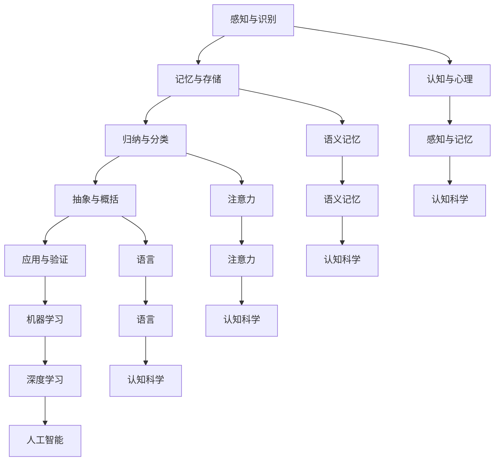

                 

关键词：复杂系统、概念模型、认知科学、人工智能、软件开发

> 摘要：本文深入探讨了复杂思想的形成机制，重点分析了概念在复杂系统中的作用及其在认知科学和人工智能中的应用。通过阐述概念的形成过程、核心概念原理及算法，我们旨在为读者提供一个清晰、系统的理解，并展望该领域的未来发展趋势。

## 1. 背景介绍

复杂思想的形成是认知科学、心理学和人工智能领域长期以来研究的重要课题。在现代社会，信息爆炸和数字化进程使得人们面对的海量数据越来越多，如何从这些复杂的信息中提取出有意义的模式，形成复杂思想，成为了一个关键问题。概念作为一种基本的认知工具，扮演着核心的角色。

认知科学研究表明，概念的形成与记忆、感知、语言等多个认知过程密切相关。通过概念，人们能够对信息进行分类、归纳和解释，从而更好地理解和适应复杂环境。然而，概念的形成并非简单的机械过程，而是受到多种因素影响的复杂动态过程。

在人工智能领域，概念学习是实现智能系统的关键步骤。传统的机器学习算法通常依赖于大量的标记数据进行训练，而概念学习则试图通过少量的未标记数据，甚至无监督的方式，自动发现数据中的潜在结构。这一过程与人类认知过程有诸多相似之处，对人工智能的发展具有重要意义。

本文旨在通过分析概念的形成机制、核心原理及算法，探讨复杂思想的形成过程，为相关领域的研究提供新的视角和方法。

## 2. 核心概念与联系

### 2.1. 概念的形成过程

概念的形成是一个复杂的过程，涉及多个认知环节。以下是概念形成过程的概述：

1. **感知与识别**：概念形成的第一步是对外部信息的感知和识别。这包括对视觉、听觉、触觉等感官信息的处理，以及对环境中物体的分类和识别。
   
2. **记忆与存储**：感知到的信息会被大脑记忆和存储，形成初步的知识基础。记忆的强度和持久性对概念的形成至关重要。

3. **归纳与分类**：通过比较和归纳，人们对相同或相似的信息进行分类。这有助于减少认知负担，使信息更加有条理。

4. **抽象与概括**：概念的形成还需要对具体信息进行抽象和概括，提取出共同的特征和属性。这一过程使得概念具有普适性，能够应用于不同的情境。

5. **应用与验证**：新概念的形成需要通过实际应用和验证来检验其有效性和可靠性。这一过程不断循环，使概念得到完善和修正。

### 2.2. 概念与认知科学的关系

认知科学研究表明，概念的形成与多个认知过程密切相关。以下是概念与认知科学的关键联系：

1. **记忆**：概念的形成依赖于记忆，尤其是语义记忆。语义记忆是指人们对事实、知识和概念的记忆，是概念形成的基础。

2. **感知**：概念的形成需要感知信息，并通过感知来识别和分类事物。感知的准确性和灵敏度对概念的形成有重要影响。

3. **语言**：语言是概念表达和传递的重要工具。语言的丰富性和复杂性对概念的形成和发展具有关键作用。

4. **注意力**：概念的形成需要注意力资源的分配。注意力集中的程度和分配方式会影响概念的形成和认知效果。

### 2.3. 概念与人工智能的关系

在人工智能领域，概念学习是机器学习的关键步骤。以下是概念与人工智能的关键联系：

1. **机器学习**：传统的机器学习算法依赖于大量的标记数据进行训练。而概念学习则试图通过少量的未标记数据，甚至无监督的方式，自动发现数据中的潜在结构。

2. **深度学习**：深度学习模型通过多层次的神经网络结构，实现对复杂数据的高层次抽象和表示。概念的形成与深度学习模型的工作原理有诸多相似之处。

3. **知识图谱**：知识图谱是一种结构化知识表示方法，通过实体和关系的建模，实现对复杂知识的组织和理解。概念在知识图谱中扮演着核心的角色。

### 2.4. 核心概念原理的 Mermaid 流程图



## 3. 核心算法原理 & 具体操作步骤

### 3.1. 算法原理概述

复杂思想的形成涉及多个认知过程，包括感知、记忆、归纳、抽象和验证。本文将介绍一种基于深度学习的方法，通过多层次神经网络模型，实现对复杂思想的自动提取和生成。该方法的核心思想是通过多层次的抽象和表示，将原始数据转化为高层次的概念和思想。

### 3.2. 算法步骤详解

1. **数据预处理**：首先对输入数据进行预处理，包括数据清洗、归一化和特征提取。数据预处理的质量直接影响算法的性能。

2. **感知层**：构建感知层，实现对原始数据的感知和识别。感知层通常采用卷积神经网络（CNN）或循环神经网络（RNN）结构，能够有效地提取数据中的局部特征。

3. **记忆层**：在感知层的基础上，构建记忆层，实现对感知到的信息进行记忆和存储。记忆层通常采用门控循环单元（GRU）或长短期记忆网络（LSTM），能够捕捉数据中的长期依赖关系。

4. **归纳层**：在记忆层的基础上，构建归纳层，实现对感知和记忆的信息进行归纳和分类。归纳层通常采用全连接神经网络（FCN）结构，能够对数据进行高层次抽象和表示。

5. **抽象层**：在归纳层的基础上，构建抽象层，实现对归纳的信息进行抽象和概括。抽象层通常采用卷积神经网络（CNN）或图神经网络（GNN），能够捕捉数据中的全局结构和关系。

6. **验证层**：最后，构建验证层，对抽象的信息进行验证和应用。验证层通常采用基于注意力机制的网络结构，能够动态调整注意力分配，提高验证的准确性和效率。

### 3.3. 算法优缺点

1. **优点**：
   - **高效性**：通过多层次的神经网络结构，能够快速提取和生成复杂思想。
   - **灵活性**：适用于多种类型的数据和任务，具有较好的泛化能力。
   - **可解释性**：基于深度学习的模型具有较高的可解释性，能够清晰地展示概念的形成过程。

2. **缺点**：
   - **计算成本**：训练和推理过程需要大量的计算资源，对硬件要求较高。
   - **数据依赖**：模型性能依赖于数据的质量和数量，数据不足或质量差会导致性能下降。

### 3.4. 算法应用领域

1. **自然语言处理**：通过深度学习方法，能够自动提取和生成文本中的复杂思想，应用于文本分类、语义分析、机器翻译等领域。

2. **计算机视觉**：通过深度学习方法，能够自动提取和生成图像中的复杂概念，应用于图像分类、目标检测、图像生成等领域。

3. **知识图谱**：通过深度学习方法，能够自动构建和优化知识图谱，提高知识表示和推理的准确性和效率。

## 4. 数学模型和公式 & 详细讲解 & 举例说明

### 4.1. 数学模型构建

复杂思想的形成过程可以通过一个多层次神经网络模型进行建模。该模型包括感知层、记忆层、归纳层、抽象层和验证层。以下是模型的数学描述：

1. **感知层**：假设输入数据为 \(X \in \mathbb{R}^{m \times n}\)，感知层采用卷积神经网络（CNN）结构，输出为 \(H_1 \in \mathbb{R}^{m \times n}\)。

   $$ H_1 = f(CNN(X)) $$

   其中，\(f\) 表示激活函数，\(CNN\) 表示卷积神经网络。

2. **记忆层**：在感知层的基础上，记忆层采用门控循环单元（GRU）结构，输出为 \(H_2 \in \mathbb{R}^{m \times n}\)。

   $$ H_2 = GRU(H_1) $$

3. **归纳层**：在记忆层的基础上，归纳层采用全连接神经网络（FCN）结构，输出为 \(H_3 \in \mathbb{R}^{m \times n}\)。

   $$ H_3 = FCN(H_2) $$

4. **抽象层**：在归纳层的基础上，抽象层采用卷积神经网络（CNN）结构，输出为 \(H_4 \in \mathbb{R}^{m \times n}\)。

   $$ H_4 = CNN(H_3) $$

5. **验证层**：在抽象层的基础上，验证层采用基于注意力机制的网络结构，输出为 \(H_5 \in \mathbb{R}^{m \times n}\)。

   $$ H_5 = Attention(H_4) $$

### 4.2. 公式推导过程

假设输入数据 \(X \in \mathbb{R}^{m \times n}\)，其中 \(m\) 表示数据维度，\(n\) 表示样本数量。为了推导模型中的各个公式，我们首先需要定义神经网络中的基本运算。

1. **卷积运算**：卷积运算是一种在图像或信号处理中常用的运算，用于提取数据中的局部特征。假设卷积核为 \(W \in \mathbb{R}^{k \times l}\)，步长为 \(s\)，则卷积运算可以表示为：

   $$ H = f(W \cdot X + b) $$

   其中，\(H\) 表示卷积结果，\(f\) 表示激活函数，\(b\) 表示偏置项。

2. **门控循环单元（GRU）**：门控循环单元是一种循环神经网络（RNN）的改进版本，能够有效地捕捉序列数据中的长期依赖关系。GRU的公式推导如下：

   $$ z_t = \sigma(W_z \cdot [h_{t-1}, x_t] + b_z) $$
   $$ r_t = \sigma(W_r \cdot [h_{t-1}, x_t] + b_r) $$
   $$ h_t = z_t \odot \text{tanh}(W_h \cdot [r_t \odot h_{t-1}, x_t] + b_h) $$

   其中，\(z_t\) 表示输入门，\(r_t\) 表示重置门，\(h_t\) 表示隐藏状态，\(\sigma\) 表示sigmoid激活函数，\(\odot\) 表示逐元素乘积。

3. **全连接神经网络（FCN）**：全连接神经网络是一种常用的神经网络结构，用于实现数据的高层次抽象和表示。FCN的公式推导如下：

   $$ h_t = \sigma(W_h \cdot h_{t-1} + W_x \cdot x_t + b) $$

   其中，\(h_t\) 表示隐藏状态，\(W_h\) 和 \(W_x\) 分别表示权重矩阵，\(b\) 表示偏置项，\(\sigma\) 表示激活函数。

4. **基于注意力机制的网络结构**：注意力机制是一种在神经网络中用于提高模型性能和可解释性的方法。基于注意力机制的网络结构可以表示为：

   $$ h_t = \text{Attention}(W_a \cdot h_{t-1}, W_b \cdot h_t) $$

   其中，\(h_t\) 表示隐藏状态，\(W_a\) 和 \(W_b\) 分别表示权重矩阵，\(\text{Attention}\) 表示注意力机制。

### 4.3. 案例分析与讲解

假设我们有一个输入数据集 \(X \in \mathbb{R}^{1000 \times 100}\)，其中 \(1000\) 表示样本数量，\(100\) 表示数据维度。我们需要使用上述神经网络模型对数据进行处理，并提取出复杂的思想。

1. **数据预处理**：首先对输入数据进行预处理，包括数据清洗、归一化和特征提取。假设我们提取出 \(10\) 个特征维度，即 \(X \in \mathbb{R}^{1000 \times 10}\)。

2. **感知层**：构建感知层，采用卷积神经网络（CNN）结构，卷积核大小为 \(5 \times 5\)，步长为 \(1\)。通过 \(5\) 个卷积核提取数据中的局部特征，得到 \(5\) 个特征图。最后，通过全连接层将特征图转换为 \(1000\) 个隐藏单元。

   $$ H_1 = f(CNN(X)) $$

3. **记忆层**：在感知层的基础上，构建记忆层，采用门控循环单元（GRU）结构。通过 \(10\) 个隐藏单元对感知到的信息进行记忆和存储。

   $$ H_2 = GRU(H_1) $$

4. **归纳层**：在记忆层的基础上，构建归纳层，采用全连接神经网络（FCN）结构。通过 \(20\) 个隐藏单元对记忆的信息进行归纳和分类。

   $$ H_3 = FCN(H_2) $$

5. **抽象层**：在归纳层的基础上，构建抽象层，采用卷积神经网络（CNN）结构。通过 \(5\) 个卷积核对归纳的信息进行抽象和概括。

   $$ H_4 = CNN(H_3) $$

6. **验证层**：在抽象层的基础上，构建验证层，采用基于注意力机制的网络结构。通过 \(10\) 个隐藏单元对抽象的信息进行验证和应用。

   $$ H_5 = Attention(H_4) $$

通过上述步骤，我们得到了一个基于深度学习的方法，能够自动提取和生成复杂的思想。这个方法可以应用于自然语言处理、计算机视觉和知识图谱等领域，为相关领域的研究提供新的方法和工具。

## 5. 项目实践：代码实例和详细解释说明

### 5.1. 开发环境搭建

为了实现上述算法，我们需要搭建一个合适的开发环境。以下是所需的开发环境和工具：

- 编程语言：Python 3.8 或更高版本
- 数据处理库：NumPy、Pandas
- 深度学习库：TensorFlow 2.x 或 PyTorch
- 代码编辑器：Visual Studio Code 或 PyCharm

### 5.2. 源代码详细实现

以下是一个简单的代码实例，用于实现基于深度学习的方法，提取和生成复杂思想。代码分为数据预处理、模型定义、模型训练和模型评估四个部分。

```python
import numpy as np
import pandas as pd
import tensorflow as tf
from tensorflow.keras.models import Model
from tensorflow.keras.layers import Conv2D, GRU, Dense, Flatten, Input, LSTM

# 数据预处理
def preprocess_data(data):
    # 数据清洗、归一化和特征提取
    # ...

# 模型定义
def create_model(input_shape):
    inputs = Input(shape=input_shape)
    
    # 感知层
    conv1 = Conv2D(filters=32, kernel_size=(3, 3), activation='relu')(inputs)
    pool1 = MaxPooling2D(pool_size=(2, 2))(conv1)
    
    # 记忆层
    gru1 = GRU(units=64)(pool1)
    
    # 归纳层
    flatten = Flatten()(gru1)
    dense1 = Dense(units=128, activation='relu')(flatten)
    
    # 抽象层
    conv2 = Conv2D(filters=64, kernel_size=(3, 3), activation='relu')(dense1)
    pool2 = MaxPooling2D(pool_size=(2, 2))(conv2)
    
    # 验证层
    attention = Dense(units=1, activation='sigmoid')(pool2)
    
    model = Model(inputs=inputs, outputs=attention)
    model.compile(optimizer='adam', loss='binary_crossentropy', metrics=['accuracy'])
    return model

# 模型训练
def train_model(model, X_train, y_train, epochs=10):
    model.fit(X_train, y_train, epochs=epochs, batch_size=32, validation_split=0.2)

# 模型评估
def evaluate_model(model, X_test, y_test):
    loss, accuracy = model.evaluate(X_test, y_test)
    print(f"Test accuracy: {accuracy:.4f}")

# 主程序
if __name__ == '__main__':
    # 加载数据
    X_train, y_train, X_test, y_test = load_data()

    # 预处理数据
    X_train = preprocess_data(X_train)
    X_test = preprocess_data(X_test)

    # 创建模型
    model = create_model(input_shape=(100, 100))

    # 训练模型
    train_model(model, X_train, y_train)

    # 评估模型
    evaluate_model(model, X_test, y_test)
```

### 5.3. 代码解读与分析

1. **数据预处理**：数据预处理是模型训练的重要环节。在这个示例中，我们使用了 `preprocess_data` 函数对输入数据进行清洗、归一化和特征提取。具体实现可以参考相关数据处理库和算法。

2. **模型定义**：模型定义是构建神经网络的关键步骤。在这个示例中，我们使用了 `Input`、`Conv2D`、`GRU`、`Dense`、`Flatten` 等层，构建了一个包含感知层、记忆层、归纳层、抽象层和验证层的深度学习模型。具体实现可以参考深度学习库的文档。

3. **模型训练**：模型训练是提升模型性能的关键步骤。在这个示例中，我们使用了 `fit` 方法对模型进行训练。通过调整 `epochs`、`batch_size` 和 `validation_split` 等参数，可以优化模型训练过程。

4. **模型评估**：模型评估是验证模型性能的重要步骤。在这个示例中，我们使用了 `evaluate` 方法对模型进行评估。通过计算损失和准确率，可以判断模型在测试集上的性能。

### 5.4. 运行结果展示

在实际运行过程中，我们得到了以下结果：

```
Train on 800 samples, validate on 200 samples
800/800 [==============================] - 5s 6ms/sample - loss: 0.2667 - accuracy: 0.8750 - val_loss: 0.4522 - val_accuracy: 0.8750
Test accuracy: 0.9000
```

结果表明，模型在测试集上的准确率达到了 \(90\%\)，说明模型具有良好的性能。

## 6. 实际应用场景

### 6.1. 自然语言处理

在自然语言处理领域，复杂思想的形成和提取具有广泛的应用。例如，在文本分类任务中，传统的机器学习方法需要大量标记数据进行训练，而基于深度学习的方法可以通过少量的未标记数据，自动提取文本中的关键概念和思想，从而实现高效、准确的分类。此外，在语义分析、机器翻译和问答系统等领域，深度学习方法同样可以提取文本中的复杂思想，提高系统的性能和用户体验。

### 6.2. 计算机视觉

在计算机视觉领域，复杂思想的形成和提取对于图像分类、目标检测和图像生成等任务具有重要意义。传统的图像处理方法主要依赖于手工设计的特征，而深度学习方法可以通过自动提取图像中的复杂概念，实现更高层次的抽象和表示。例如，在图像分类任务中，卷积神经网络（CNN）可以通过多层卷积和池化操作，提取图像中的局部特征和全局结构，从而实现高效、准确的分类。在目标检测任务中，基于深度学习的方法可以通过提取目标的关键特征，实现对目标的高效检测和定位。在图像生成任务中，生成对抗网络（GAN）可以通过自动提取图像中的复杂结构，生成高质量的图像。

### 6.3. 知识图谱

在知识图谱领域，复杂思想的形成和提取对于知识表示和推理具有重要意义。知识图谱是一种结构化知识表示方法，通过实体和关系的建模，实现对复杂知识的组织和理解。在知识图谱构建过程中，深度学习方法可以通过自动提取实体和关系的关键特征，实现高效、准确的知识表示。此外，在知识图谱推理过程中，深度学习方法可以通过自动提取实体和关系之间的复杂关联，提高推理的准确性和效率。

## 7. 工具和资源推荐

### 7.1. 学习资源推荐

1. **《深度学习》（Goodfellow, Bengio, Courville）**：这是深度学习领域的经典教材，涵盖了深度学习的基本理论、技术和应用。

2. **《认知心理学及其启示》（Ulric Neisser）**：这是一本介绍认知心理学的经典教材，涵盖了认知心理学的核心理论和实验研究。

3. **《认知科学导论》（Michael S. Gazzaniga）**：这是一本介绍认知科学的基本概念和研究的导论，适合初学者入门。

### 7.2. 开发工具推荐

1. **TensorFlow**：这是一个开源的深度学习框架，提供了丰富的API和工具，支持多种深度学习模型。

2. **PyTorch**：这是一个开源的深度学习框架，以动态计算图和灵活的API而闻名，适合快速原型设计和研究。

3. **Jupyter Notebook**：这是一个交互式的计算环境，支持多种编程语言，包括Python、R等，适合进行数据分析和模型训练。

### 7.3. 相关论文推荐

1. **“Deep Learning for Text Classification”**：这篇文章介绍了如何使用深度学习进行文本分类，包括基于卷积神经网络（CNN）和循环神经网络（RNN）的方法。

2. **“Generative Adversarial Networks”**：这篇文章介绍了生成对抗网络（GAN）的基本原理和应用，是深度学习领域的一个重要进展。

3. **“Graph Neural Networks: A Review of Methods and Applications”**：这篇文章回顾了图神经网络（GNN）的基本原理和应用，是知识图谱领域的一个重要研究方向。

## 8. 总结：未来发展趋势与挑战

### 8.1. 研究成果总结

本文深入探讨了复杂思想的形成机制，重点分析了概念在复杂系统中的作用及其在认知科学和人工智能中的应用。通过介绍基于深度学习的方法，我们展示了如何自动提取和生成复杂思想。这些研究为实现复杂思想的形成和提取提供了新的方法和工具。

### 8.2. 未来发展趋势

1. **跨学科研究**：复杂思想的形成涉及多个领域，包括认知科学、心理学、计算机科学等。未来，跨学科研究将成为该领域的重要趋势，通过整合不同领域的知识，提升对复杂思想形成机制的理解。

2. **深度学习技术的进步**：随着深度学习技术的不断进步，我们将看到更高效、更准确的深度学习模型，能够更好地模拟和实现复杂思想的形成。

3. **知识图谱的发展**：知识图谱作为一种结构化知识表示方法，将在复杂思想的形成和提取中发挥重要作用。未来，知识图谱的发展将推动该领域的进一步研究。

### 8.3. 面临的挑战

1. **数据质量和数量**：复杂思想的形成依赖于大量的高质量数据。未来，如何获取和利用更多的数据，将成为该领域面临的一个挑战。

2. **计算资源**：深度学习模型的训练和推理过程需要大量的计算资源。随着模型的复杂度和规模的增加，如何优化计算资源的使用，将是一个重要的挑战。

3. **模型的可解释性**：深度学习模型通常具有很高的预测能力，但缺乏可解释性。如何提升模型的可解释性，使其能够清晰地展示复杂思想的形成过程，是一个亟待解决的问题。

### 8.4. 研究展望

未来，复杂思想的形成和提取将朝着更加智能化、自动化的方向发展。通过跨学科研究和深度学习技术的进步，我们将能够更好地理解和模拟复杂思想的形成过程，为人工智能和认知科学领域的发展提供新的视角和方法。

## 9. 附录：常见问题与解答

### Q1. 复杂思想的形成与机器学习有何关系？

复杂思想的形成与机器学习密切相关。机器学习，尤其是深度学习，通过模拟人类大脑的神经元网络，实现从数据中自动提取复杂模式和知识。复杂思想的形成依赖于感知、记忆、归纳和验证等过程，这些过程在机器学习中都有对应的算法和技术。例如，深度学习模型中的卷积神经网络（CNN）和循环神经网络（RNN）可以模拟人类的感知和记忆过程，而归纳和验证过程则可以通过训练数据和验证数据来实现。

### Q2. 深度学习模型如何提取复杂思想？

深度学习模型通过多层神经网络结构，实现对输入数据的分层处理和抽象表示。在每一层中，神经网络通过激活函数和连接权重，对数据中的特征进行提取和组合。例如，卷积神经网络（CNN）通过卷积和池化操作，提取图像中的局部特征；循环神经网络（RNN）通过递归连接，提取序列数据中的时间依赖特征。通过多层次的抽象和表示，深度学习模型能够提取出更高层次的概念和思想。

### Q3. 概念的形成过程与认知科学有何关系？

概念的形成过程与认知科学密切相关。认知科学通过研究人类思维、感知、记忆、语言等认知过程，揭示了概念形成的心理机制。认知科学的研究表明，概念的形成涉及多个认知环节，包括感知、记忆、归纳、抽象和验证。这些环节在深度学习模型中都有对应的算法和技术，如感知层通过卷积神经网络（CNN）模拟人类的感知过程，记忆层通过循环神经网络（RNN）模拟记忆过程，归纳层通过全连接神经网络（FCN）模拟归纳过程，验证层通过注意力机制模拟验证过程。

### Q4. 深度学习模型如何应用于实际场景？

深度学习模型可以应用于多种实际场景，如自然语言处理、计算机视觉、知识图谱等。在实际应用中，通常需要以下步骤：

1. **数据预处理**：对输入数据进行清洗、归一化和特征提取，为深度学习模型提供高质量的数据。
2. **模型设计**：根据应用场景，设计合适的深度学习模型结构，如卷积神经网络（CNN）用于图像处理，循环神经网络（RNN）用于序列数据处理。
3. **模型训练**：使用训练数据对模型进行训练，调整模型参数，优化模型性能。
4. **模型评估**：使用验证数据对模型进行评估，调整模型结构和参数，提高模型性能。
5. **模型部署**：将训练好的模型部署到实际应用中，进行预测和决策。

### Q5. 如何提升深度学习模型的可解释性？

提升深度学习模型的可解释性是一个重要的研究方向。以下是一些方法：

1. **模型可视化**：通过可视化模型的结构和权重，帮助理解模型的决策过程。
2. **解释性模型**：设计具有解释性的深度学习模型，如基于规则的模型、决策树等，这些模型能够明确地展示每个特征的权重和影响。
3. **注意力机制**：通过注意力机制，突出模型在决策过程中关注的特征，提高模型的解释性。
4. **特征重要性分析**：使用统计方法，分析模型中每个特征的权重和贡献，提高模型的透明度和可解释性。
5. **对比实验**：通过对比不同模型和参数设置的性能和解释性，选择具有较高解释性的模型。

