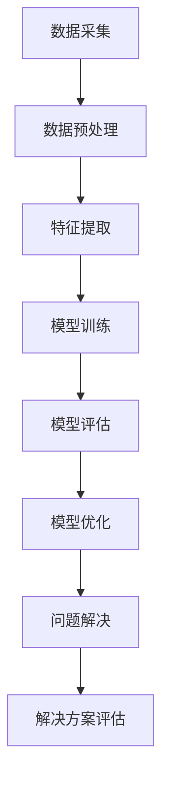

                 

关键词：人工智能、复杂问题、简单解决方案、技术博客、深度学习、算法优化、应用场景、数学模型、代码实例、未来展望

> 摘要：本文将探讨如何利用人工智能技术来解决复杂问题，通过简单解决方案的实践，展示人工智能在各个领域的应用潜力。我们将深入分析核心算法原理、数学模型及其在实际项目中的应用，以期为读者提供实用的技术指南和展望未来的发展趋势。

## 1. 背景介绍

在当今这个信息技术飞速发展的时代，我们面临着各种各样的复杂问题。这些问题可能来源于数据处理、模式识别、预测分析等多个领域。随着大数据和云计算的兴起，传统的计算方法在处理这些复杂问题时显得力不从心。这时，人工智能技术，特别是深度学习和机器学习，成为了解决这些复杂问题的有力工具。

然而，尽管人工智能技术已经取得了显著的进展，但在实际应用中，如何将复杂的问题转化为简单的解决方案，仍然是一个值得深入研究的课题。本文旨在通过探讨一系列成功案例，展示人工智能在复杂问题求解中的力量，并分析其背后的原理和实现方法。

## 2. 核心概念与联系

为了更好地理解人工智能如何解决复杂问题，我们需要首先了解一些核心概念和其之间的联系。以下是一个Mermaid流程图，展示了人工智能解决复杂问题的主要步骤和概念之间的关系：



### 2.1 数据采集

数据采集是人工智能解决复杂问题的第一步。无论是图像识别、自然语言处理还是推荐系统，都需要大量的数据作为基础。数据的来源可以包括公开的数据集、用户生成的内容或者企业内部的数据。

### 2.2 数据预处理

采集到的数据通常是不完整的、噪声的，因此需要进行预处理。预处理包括数据清洗、数据整合和数据转换等步骤，以确保数据的质量和一致性。

### 2.3 特征提取

特征提取是将原始数据转换成机器学习模型可以处理的特征向量的过程。这一步非常关键，因为好的特征提取可以显著提高模型的性能。

### 2.4 模型训练

在特征提取之后，我们使用机器学习算法来训练模型。模型训练的目的是通过不断调整模型的参数，使其能够更好地拟合训练数据。

### 2.5 模型评估

模型训练完成后，我们需要对其性能进行评估。常见的评估指标包括准确率、召回率、F1分数等。

### 2.6 模型优化

模型评估后，如果性能不理想，我们需要进行模型优化。优化方法包括调整超参数、使用更复杂的模型架构等。

### 2.7 问题解决

经过一系列步骤后，我们得到了一个性能良好的模型，接下来就可以将其应用到实际的复杂问题解决了。

### 2.8 解决方案评估

最后，我们需要对解决方案进行评估，以确保其能够满足实际需求。

## 3. 核心算法原理 & 具体操作步骤

### 3.1 算法原理概述

在解决复杂问题时，人工智能主要依赖于以下核心算法：

1. **深度学习**：通过构建多层神经网络，实现对复杂数据的建模和预测。
2. **强化学习**：通过试错和反馈机制，训练模型在特定环境下做出最优决策。
3. **自然语言处理**：利用深度学习模型，实现对文本数据的理解和生成。

### 3.2 算法步骤详解

#### 3.2.1 深度学习

深度学习的具体步骤如下：

1. **数据采集**：收集大量带标签的训练数据。
2. **数据预处理**：清洗数据，归一化处理。
3. **特征提取**：使用卷积神经网络（CNN）或循环神经网络（RNN）提取特征。
4. **模型训练**：使用反向传播算法训练模型。
5. **模型评估**：使用交叉验证等方法评估模型性能。
6. **模型优化**：根据评估结果调整模型参数。

#### 3.2.2 强化学习

强化学习的具体步骤如下：

1. **环境构建**：定义环境状态、动作和奖励。
2. **模型初始化**：初始化价值函数或策略网络。
3. **探索与利用**：在训练过程中，通过探索新动作和利用已有经验，更新模型。
4. **模型评估**：评估模型在特定环境下的性能。
5. **策略优化**：根据评估结果调整策略网络。

#### 3.2.3 自然语言处理

自然语言处理的具体步骤如下：

1. **文本预处理**：包括分词、去停用词、词向量化等。
2. **特征提取**：使用词嵌入或编码器-解码器（Encoder-Decoder）模型提取特征。
3. **模型训练**：使用训练数据训练模型。
4. **模型评估**：使用测试数据评估模型性能。
5. **文本生成**：利用训练好的模型生成文本。

### 3.3 算法优缺点

#### 深度学习

优点：
- 能够处理大量复杂数据。
- 自适应性强，能够不断优化。

缺点：
- 需要大量训练数据。
- 模型训练时间较长。

#### 强化学习

优点：
- 能够在不确定环境中做出最优决策。
- 能够处理连续动作和状态。

缺点：
- 训练过程可能不稳定。
- 需要大量的探索和试错。

#### 自然语言处理

优点：
- 能够理解自然语言。
- 能够生成自然语言。

缺点：
- 对数据处理要求较高。
- 模型训练时间较长。

### 3.4 算法应用领域

深度学习、强化学习和自然语言处理在各个领域都有广泛的应用，包括但不限于：

- **图像识别**：如人脸识别、图像分类等。
- **自然语言处理**：如机器翻译、文本生成等。
- **游戏**：如围棋、象棋等。

## 4. 数学模型和公式 & 详细讲解 & 举例说明

在人工智能领域，数学模型和公式是理解和应用算法的基础。以下我们将详细介绍一些核心的数学模型和公式，并通过具体案例进行讲解。

### 4.1 数学模型构建

在深度学习中，最基础的数学模型是神经网络。神经网络由多个神经元（节点）组成，每个节点都连接到其他节点。神经网络的主要数学模型包括激活函数、损失函数和优化算法。

#### 激活函数

激活函数是神经网络中的一个关键组件，它用于将线性变换引入到神经网络中，使得网络具有非线性能力。以下是一些常用的激活函数：

$$
f(x) = \text{ReLU}(x) = \max(0, x)
$$

$$
f(x) = \text{Sigmoid}(x) = \frac{1}{1 + e^{-x}}
$$

#### 损失函数

损失函数用于评估模型的预测值与实际值之间的差距。以下是一些常用的损失函数：

$$
L(\theta) = \sum_{i=1}^{m} \frac{1}{2} (y_i - \hat{y}_i)^2
$$

$$
L(\theta) = -\sum_{i=1}^{m} y_i \log(\hat{y}_i) + (1 - y_i) \log(1 - \hat{y}_i)
$$

#### 优化算法

优化算法用于更新神经网络的权重，以最小化损失函数。以下是一些常用的优化算法：

$$
\theta_{\text{new}} = \theta_{\text{old}} - \alpha \nabla_{\theta} L(\theta)
$$

### 4.2 公式推导过程

#### 损失函数的推导

假设我们有一个二分类问题，目标变量 \( y \) 可以取值 0 或 1，预测变量 \( \hat{y} \) 也是一个介于 0 和 1 之间的概率值。为了计算损失，我们使用交叉熵损失函数：

$$
L(\theta) = -\sum_{i=1}^{m} y_i \log(\hat{y}_i) + (1 - y_i) \log(1 - \hat{y}_i)
$$

其中，\( \hat{y}_i \) 是第 \( i \) 个样本的预测概率，\( y_i \) 是第 \( i \) 个样本的实际标签。

#### 优化算法的推导

我们使用梯度下降法来最小化损失函数。梯度下降法的核心思想是沿着损失函数的梯度方向更新权重：

$$
\theta_{\text{new}} = \theta_{\text{old}} - \alpha \nabla_{\theta} L(\theta)
$$

其中，\( \alpha \) 是学习率，\( \nabla_{\theta} L(\theta) \) 是损失函数关于权重的梯度。

### 4.3 案例分析与讲解

#### 案例一：手写数字识别

假设我们有一个手写数字识别问题，输入是手写数字的图像，输出是数字的标签。我们可以使用卷积神经网络（CNN）来解决这个问题。

1. **数据采集**：收集大量手写数字图像和对应的标签数据。
2. **数据预处理**：对图像进行归一化处理，转换为灰度图像，并裁剪为固定大小。
3. **特征提取**：使用卷积层提取图像的特征。
4. **模型训练**：使用训练数据训练模型。
5. **模型评估**：使用测试数据评估模型性能。
6. **模型优化**：根据评估结果调整模型参数。

#### 案例二：股票价格预测

假设我们有一个股票价格预测问题，输入是历史股票价格数据，输出是未来股票价格的预测值。我们可以使用时间序列模型（如长短期记忆网络LSTM）来解决这个问题。

1. **数据采集**：收集历史股票价格数据。
2. **数据预处理**：对数据进行归一化处理，并提取时间序列特征。
3. **特征提取**：使用LSTM层提取时间序列特征。
4. **模型训练**：使用训练数据训练模型。
5. **模型评估**：使用测试数据评估模型性能。
6. **模型优化**：根据评估结果调整模型参数。

## 5. 项目实践：代码实例和详细解释说明

在本节中，我们将通过一个具体的代码实例，展示如何使用人工智能技术解决一个实际问题。我们将使用Python编程语言和TensorFlow库来实现一个手写数字识别模型。

### 5.1 开发环境搭建

在开始编写代码之前，我们需要搭建一个适合开发和测试的环境。以下是所需的工具和库：

- Python 3.8 或更高版本
- TensorFlow 2.3 或更高版本
- NumPy 1.19 或更高版本

您可以通过以下命令安装所需的库：

```bash
pip install python==3.8
pip install tensorflow==2.3
pip install numpy==1.19
```

### 5.2 源代码详细实现

以下是一个简单的手写数字识别模型的代码实现：

```python
import tensorflow as tf
from tensorflow.keras import layers
from tensorflow.keras.datasets import mnist

# 加载MNIST数据集
(x_train, y_train), (x_test, y_test) = mnist.load_data()

# 数据预处理
x_train = x_train / 255.0
x_test = x_test / 255.0
x_train = x_train.reshape(-1, 28, 28, 1)
x_test = x_test.reshape(-1, 28, 28, 1)

# 构建模型
model = tf.keras.Sequential([
    layers.Conv2D(32, (3, 3), activation='relu', input_shape=(28, 28, 1)),
    layers.MaxPooling2D((2, 2)),
    layers.Conv2D(64, (3, 3), activation='relu'),
    layers.MaxPooling2D((2, 2)),
    layers.Conv2D(64, (3, 3), activation='relu'),
    layers.Flatten(),
    layers.Dense(64, activation='relu'),
    layers.Dense(10, activation='softmax')
])

# 编译模型
model.compile(optimizer='adam',
              loss='sparse_categorical_crossentropy',
              metrics=['accuracy'])

# 训练模型
model.fit(x_train, y_train, epochs=5, batch_size=32, validation_split=0.1)

# 评估模型
test_loss, test_acc = model.evaluate(x_test, y_test, verbose=2)
print(f"Test accuracy: {test_acc}")
```

### 5.3 代码解读与分析

#### 数据预处理

```python
x_train = x_train / 255.0
x_test = x_test / 255.0
x_train = x_train.reshape(-1, 28, 28, 1)
x_test = x_test.reshape(-1, 28, 28, 1)
```

在这段代码中，我们首先将图像数据归一化，即将像素值从 0 到 255 范围缩放到 0 到 1 的范围。然后，我们将图像数据从 (28, 28) 的形状调整为 (28, 28, 1)，以便输入到卷积层中。

#### 模型构建

```python
model = tf.keras.Sequential([
    layers.Conv2D(32, (3, 3), activation='relu', input_shape=(28, 28, 1)),
    layers.MaxPooling2D((2, 2)),
    layers.Conv2D(64, (3, 3), activation='relu'),
    layers.MaxPooling2D((2, 2)),
    layers.Conv2D(64, (3, 3), activation='relu'),
    layers.Flatten(),
    layers.Dense(64, activation='relu'),
    layers.Dense(10, activation='softmax')
])
```

在这段代码中，我们构建了一个简单的卷积神经网络（CNN）。模型包括五个卷积层、一个全连接层和输出层。卷积层使用ReLU激活函数，全连接层使用ReLU激活函数，输出层使用softmax激活函数，用于计算概率分布。

#### 模型编译

```python
model.compile(optimizer='adam',
              loss='sparse_categorical_crossentropy',
              metrics=['accuracy'])
```

在这段代码中，我们使用Adam优化器来最小化损失函数，使用sparse\_categorical\_crossentropy作为损失函数，并监控准确率作为评估指标。

#### 模型训练

```python
model.fit(x_train, y_train, epochs=5, batch_size=32, validation_split=0.1)
```

在这段代码中，我们使用训练数据训练模型，训练5个周期，每个批次包含32个样本。我们还设置了10%的数据用于验证。

#### 模型评估

```python
test_loss, test_acc = model.evaluate(x_test, y_test, verbose=2)
print(f"Test accuracy: {test_acc}")
```

在这段代码中，我们使用测试数据评估模型性能，并打印出测试准确率。

## 6. 实际应用场景

人工智能技术在实际应用中已经取得了显著的成果。以下是一些典型的应用场景：

### 6.1 医疗诊断

人工智能技术在医疗领域的应用日益广泛，特别是在诊断方面。通过分析医疗影像，如X光片、CT扫描和MRI，人工智能模型可以辅助医生进行疾病诊断，提高诊断准确率。

### 6.2 交通运输

自动驾驶是人工智能在交通运输领域的典型应用。通过使用计算机视觉和深度学习技术，自动驾驶系统能够实时识别道路标志、车辆和行人，并做出相应的决策，从而提高道路安全性和交通效率。

### 6.3 零售电商

推荐系统是人工智能在零售电商领域的核心应用。通过分析用户的历史购买行为和浏览记录，人工智能模型可以生成个性化的商品推荐，从而提高用户满意度和销售额。

### 6.4 金融服务

人工智能技术在金融服务领域的应用包括风险控制、欺诈检测和信用评估等。通过分析大量金融数据，人工智能模型可以准确预测风险，提高金融服务的质量和效率。

## 7. 工具和资源推荐

为了更好地学习和实践人工智能技术，以下是一些建议的工具和资源：

### 7.1 学习资源推荐

- 《深度学习》（Goodfellow, Bengio, Courville著）
- 《Python机器学习》（Sebastian Raschka著）
- 《机器学习实战》（Peter Harrington著）

### 7.2 开发工具推荐

- TensorFlow：用于构建和训练机器学习模型的强大工具。
- Jupyter Notebook：用于编写和执行Python代码的交互式环境。
- Keras：基于TensorFlow的简化版高级API，用于快速构建模型。

### 7.3 相关论文推荐

- “Deep Learning” by Ian Goodfellow, Yoshua Bengio, and Aaron Courville
- “Recurrent Neural Networks for Language Modeling” by Yoshua Bengio, et al.
- “Convolutional Neural Networks for Visual Recognition” by Yann LeCun, et al.

## 8. 总结：未来发展趋势与挑战

随着人工智能技术的不断发展，其在解决复杂问题方面将发挥越来越重要的作用。未来，人工智能将在更多领域得到应用，如智慧城市、智能制造和生物技术等。

然而，人工智能的发展也面临一些挑战，包括数据隐私、模型可解释性和算法公平性等。为了克服这些挑战，我们需要在技术、政策和伦理等方面进行综合考虑。

总之，人工智能的力量将为我们解决复杂问题提供更多的可能性。通过深入研究和实践，我们有望实现更加简单、高效的解决方案。

## 9. 附录：常见问题与解答

### 9.1 什么是人工智能？

人工智能（AI）是指计算机系统模拟人类智能行为的理论和实践，包括学习、推理、规划、感知、理解自然语言和视觉等能力。

### 9.2 人工智能有哪些类型？

人工智能可以分为两大类：弱人工智能和强人工智能。弱人工智能专注于特定任务，如语音识别、图像分类等；强人工智能具有全面的人类智能，能够进行通用任务。

### 9.3 人工智能的主要应用领域有哪些？

人工智能的主要应用领域包括医疗诊断、交通运输、零售电商、金融服务、智能家居和智能制造等。

### 9.4 如何学习人工智能？

学习人工智能可以从以下几个步骤开始：

1. 学习Python编程语言。
2. 学习数学基础知识，如线性代数、概率论和微积分。
3. 学习机器学习和深度学习的基本原理。
4. 实践项目，如使用TensorFlow或Keras构建模型。
5. 阅读相关书籍和论文，如《深度学习》、《Python机器学习》等。

### 9.5 人工智能的前沿研究方向是什么？

人工智能的前沿研究方向包括：

1. 自主决策和推理。
2. 大规模机器学习。
3. 强化学习。
4. 自然语言处理。
5. 计算机视觉。

### 9.6 人工智能对社会有哪些影响？

人工智能对社会的影响包括：

1. 提高生产效率，降低成本。
2. 改善医疗诊断和治疗效果。
3. 增强交通和能源管理。
4. 提高教育和娱乐体验。
5. 对就业市场和职业道德提出新挑战。

### 9.7 如何确保人工智能的安全和伦理？

确保人工智能的安全和伦理需要：

1. 制定和遵守相关法规和标准。
2. 提高透明度和可解释性。
3. 保障数据隐私。
4. 避免算法歧视。
5. 强化伦理教育和培训。

