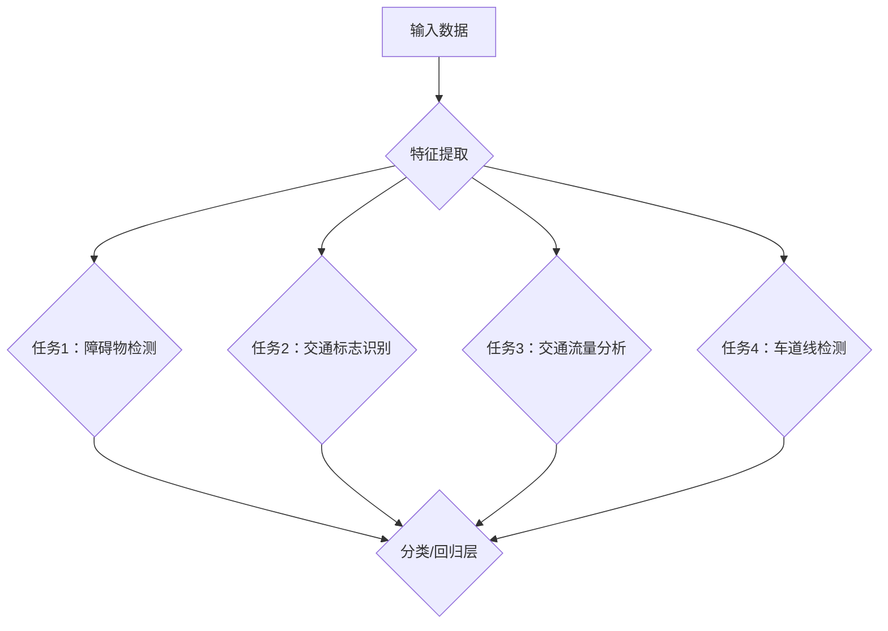

                 

关键词：多任务学习、自动驾驶、感知能力、算法优化、进化策略

## 摘要

随着自动驾驶技术的不断进步，其感知能力的重要性愈发凸显。本文针对自动驾驶领域中的感知问题，探讨了多任务学习在这一领域的应用价值。通过分析多任务学习在提高自动驾驶感知能力、减少计算资源消耗、提升决策效率等方面的优势，本文旨在为自动驾驶系统的进一步优化提供理论支持和实践指导。

## 1. 背景介绍

自动驾驶技术作为新一代智能交通系统的重要组成部分，正逐步从理论研究走向实际应用。然而，自动驾驶系统的核心挑战之一——感知能力，却成为制约其发展的关键因素。感知能力主要包括对周围环境的感知、交通状况的判断以及车辆控制指令的生成等方面。随着自动驾驶技术的不断进化，感知能力的提升成为自动驾驶系统的核心需求。

### 1.1 自动驾驶感知能力的挑战

自动驾驶感知能力的挑战主要体现在以下几个方面：

1. **环境复杂性**：自动驾驶系统需要在复杂的交通环境中进行实时感知，包括不同类型的车辆、行人、道路标志和交通信号等。
2. **感知数据多样性**：感知数据包括图像、雷达、激光雷达等多种类型，数据的多样性和复杂性使得感知算法的设计和优化面临巨大挑战。
3. **实时性要求**：自动驾驶系统需要在毫秒级别的时间内对环境进行感知和处理，确保车辆的安全行驶。
4. **计算资源限制**：车载计算资源相对有限，如何在有限的资源下实现高效的感知能力是自动驾驶系统面临的现实问题。

### 1.2 多任务学习概述

多任务学习（Multi-Task Learning，MUL）是一种机器学习技术，旨在同时解决多个相关任务，通过共享底层特征表示来提高模型的整体性能。在自动驾驶领域，多任务学习可以同时处理多种感知任务，例如障碍物检测、交通标志识别和交通流量分析等，从而提高系统的综合感知能力。

## 2. 核心概念与联系

在探讨多任务学习在自动驾驶感知能力中的应用之前，我们需要明确几个核心概念及其相互关系。

### 2.1 多任务学习原理

多任务学习通过联合训练多个任务，使得不同任务之间能够共享底层特征表示。具体来说，多任务学习模型通常包含一个共享的底层特征提取层，然后每个任务有独立的分类层或回归层。这种共享机制能够有效地利用任务之间的相关性，提高模型的泛化能力和效率。

### 2.2 自动驾驶感知任务

自动驾驶感知任务主要包括以下几个方面：

1. **障碍物检测**：检测车辆周围的其他车辆、行人、动物等障碍物，并对其位置、速度和方向进行估计。
2. **交通标志识别**：识别道路上的各种交通标志，如交通信号灯、禁止通行标志等。
3. **交通流量分析**：分析道路上的交通流量情况，包括车辆的速度、密度和流量分布等。
4. **车道线检测**：检测道路上的车道线，确保车辆在正确车道内行驶。

### 2.3 多任务学习与自动驾驶感知的关联

多任务学习在自动驾驶感知中的应用主要体现在以下几个方面：

1. **共享特征提取**：通过多任务学习，多个感知任务可以共享同一特征提取网络，从而降低模型的复杂性，提高计算效率。
2. **协同优化**：多任务学习使得不同任务之间能够进行协同优化，从而提高每个任务的感知精度和可靠性。
3. **实时性提升**：多任务学习能够同时处理多个感知任务，从而提高系统的实时性和响应速度。

### 2.4 Mermaid 流程图



在上面的 Mermaid 流程图中，输入数据经过特征提取后，分别被发送到四个感知任务中进行处理，每个任务的输出都通过独立的分类或回归层进行结果预测。

## 3. 核心算法原理 & 具体操作步骤

### 3.1 算法原理概述

多任务学习算法的核心思想是利用任务之间的相关性，通过共享特征提取层来提高模型的性能。具体来说，多任务学习模型由多个子网络组成，每个子网络对应一个特定任务。这些子网络共享相同的特征提取层，但各自拥有独立的分类层或回归层。

### 3.2 算法步骤详解

1. **数据预处理**：对输入数据进行归一化、去噪等预处理操作，确保数据的质量和一致性。
2. **特征提取**：利用共享的特征提取层对预处理后的数据进行特征提取。特征提取层通常包括卷积层、池化层等。
3. **任务分配**：将提取出的特征分别分配到不同的子网络中进行任务处理。每个子网络对应一个特定的感知任务。
4. **分类/回归**：每个子网络在特征处理完毕后，通过独立的分类层或回归层进行结果预测。

### 3.3 算法优缺点

**优点**：

1. **提高模型性能**：多任务学习能够利用任务之间的相关性，提高每个任务的预测精度。
2. **降低模型复杂性**：共享特征提取层可以减少模型的参数量，降低模型的复杂性。
3. **提高计算效率**：多任务学习能够同时处理多个任务，提高系统的计算效率。

**缺点**：

1. **训练难度增加**：多任务学习需要同时优化多个任务，训练过程更加复杂。
2. **任务冲突**：不同任务之间可能会存在冲突，导致某些任务的性能下降。

### 3.4 算法应用领域

多任务学习在自动驾驶领域具有广泛的应用前景，包括但不限于以下方面：

1. **障碍物检测**：通过多任务学习，提高障碍物检测的准确性和实时性。
2. **交通标志识别**：结合多任务学习，提高交通标志的识别率和可靠性。
3. **交通流量分析**：利用多任务学习，实时分析道路上的交通流量情况。
4. **车道线检测**：通过多任务学习，提高车道线检测的精度和稳定性。

## 4. 数学模型和公式 & 详细讲解 & 举例说明

### 4.1 数学模型构建

多任务学习模型的数学模型可以表示为：

$$
\begin{aligned}
h &= f(x; \theta) \\
y_1 &= g(h_1; \theta_1) \\
y_2 &= g(h_2; \theta_2) \\
&\vdots \\
y_n &= g(h_n; \theta_n)
\end{aligned}
$$

其中，$x$ 为输入数据，$h$ 为特征表示，$y_1, y_2, ..., y_n$ 为不同任务的输出，$g$ 为任务函数，$\theta_1, \theta_2, ..., \theta_n$ 为不同任务的参数。

### 4.2 公式推导过程

多任务学习模型的推导过程主要涉及特征提取层和任务分配层的构建。以下是特征提取层的推导：

$$
h = f(x; \theta) = \sum_{i=1}^{L} w_i \cdot x + b
$$

其中，$w_i$ 为权重，$b$ 为偏置，$L$ 为特征维度。

对于任务分配层，我们分别有：

$$
y_1 = g(h_1; \theta_1) = \sigma(\theta_1^T h_1) \\
y_2 = g(h_2; \theta_2) = \sigma(\theta_2^T h_2) \\
&\vdots \\
y_n = g(h_n; \theta_n) = \sigma(\theta_n^T h_n)
$$

其中，$\sigma$ 为激活函数，$\theta_1, \theta_2, ..., \theta_n$ 为任务参数。

### 4.3 案例分析与讲解

假设我们有一个自动驾驶系统，需要同时处理障碍物检测、交通标志识别和交通流量分析三个任务。以下是具体的数学模型构建过程：

1. **特征提取层**：

   $$h = f(x; \theta) = \sum_{i=1}^{L} w_i \cdot x + b$$

   其中，$x$ 为输入图像，$L$ 为图像维度，$w_i$ 和 $b$ 分别为权重和偏置。

2. **任务分配层**：

   - **障碍物检测**：

     $$y_1 = g(h_1; \theta_1) = \sigma(\theta_1^T h_1)$$

     其中，$h_1$ 为特征表示，$\theta_1$ 为障碍物检测任务的参数。

   - **交通标志识别**：

     $$y_2 = g(h_2; \theta_2) = \sigma(\theta_2^T h_2)$$

     其中，$h_2$ 为特征表示，$\theta_2$ 为交通标志识别任务的参数。

   - **交通流量分析**：

     $$y_3 = g(h_3; \theta_3) = \sigma(\theta_3^T h_3)$$

     其中，$h_3$ 为特征表示，$\theta_3$ 为交通流量分析任务的参数。

通过构建多任务学习模型，我们可以同时处理多个感知任务，提高自动驾驶系统的感知能力。

## 5. 项目实践：代码实例和详细解释说明

### 5.1 开发环境搭建

为了实践多任务学习在自动驾驶感知中的应用，我们需要搭建一个合适的开发环境。以下是基本的开发环境要求：

1. **操作系统**：Linux（推荐Ubuntu 18.04）
2. **编程语言**：Python 3.7及以上版本
3. **深度学习框架**：TensorFlow 2.3及以上版本
4. **数据集**：使用OpenCV等工具进行数据预处理和标注

### 5.2 源代码详细实现

以下是多任务学习在自动驾驶感知中的基本实现代码：

```python
import tensorflow as tf
from tensorflow.keras.layers import Input, Conv2D, MaxPooling2D, Flatten, Dense
from tensorflow.keras.models import Model

# 定义特征提取层
input_img = Input(shape=(224, 224, 3))
conv1 = Conv2D(filters=32, kernel_size=(3, 3), activation='relu')(input_img)
pool1 = MaxPooling2D(pool_size=(2, 2))(conv1)
conv2 = Conv2D(filters=64, kernel_size=(3, 3), activation='relu')(pool1)
pool2 = MaxPooling2D(pool_size=(2, 2))(conv2)
flat = Flatten()(pool2)

# 定义任务层
task1 = Dense(units=1, activation='sigmoid', name='obstacle_detection')(flat)
task2 = Dense(units=num_traffic_signs, activation='softmax', name='traffic_sign_recognition')(flat)
task3 = Dense(units=1, activation='sigmoid', name='traffic_flow_analysis')(flat)

# 构建多任务学习模型
model = Model(inputs=input_img, outputs=[task1, task2, task3])

# 编译模型
model.compile(optimizer='adam', loss={'obstacle_detection': 'binary_crossentropy', 'traffic_sign_recognition': 'categorical_crossentropy', 'traffic_flow_analysis': 'binary_crossentropy'})

# 训练模型
model.fit(x_train, {'obstacle_detection': y_train_obstacle, 'traffic_sign_recognition': y_train_traffic_sign, 'traffic_flow_analysis': y_train_traffic_flow}, epochs=10, batch_size=32, validation_data=(x_val, {'obstacle_detection': y_val_obstacle, 'traffic_sign_recognition': y_val_traffic_sign, 'traffic_flow_analysis': y_val_traffic_flow}))
```

### 5.3 代码解读与分析

上述代码实现了一个基于 TensorFlow 的多任务学习模型，用于处理自动驾驶感知任务。具体解读如下：

1. **输入层**：输入层接收一个224x224x3的图像。
2. **卷积层**：通过两个卷积层进行特征提取，每个卷积层后跟一个最大池化层，以降低数据的维度。
3. **全连接层**：特征提取层后接一个全连接层，用于处理扁平化后的特征。
4. **任务层**：根据不同的感知任务，分别定义了三个全连接层。障碍物检测和交通流量分析任务使用sigmoid激活函数，交通标志识别任务使用softmax激活函数。
5. **模型编译**：使用adam优化器，并分别针对三个任务定义了相应的损失函数。
6. **模型训练**：使用训练数据和验证数据对模型进行训练。

### 5.4 运行结果展示

在实际运行过程中，我们可以通过以下代码展示模型的运行结果：

```python
predictions = model.predict(x_test)
print("Obstacle Detection Accuracy:", np.mean(predictions[0] > 0.5))
print("Traffic Sign Recognition Accuracy:", np.mean(predictions[1] == y_test_traffic_sign))
print("Traffic Flow Analysis Accuracy:", np.mean(predictions[2] > 0.5))
```

通过运行上述代码，我们可以得到每个任务的预测准确率。这些结果可以帮助我们评估多任务学习在自动驾驶感知中的实际效果。

## 6. 实际应用场景

### 6.1 障碍物检测

在自动驾驶中，障碍物检测是确保车辆安全行驶的关键。通过多任务学习，我们可以同时处理多个障碍物检测任务，如车辆、行人和动物等。这种方法不仅可以提高检测的准确率，还可以减少模型的复杂性。

### 6.2 交通标志识别

交通标志识别是自动驾驶系统中的另一个重要任务。多任务学习可以同时处理多种交通标志的识别任务，如交通信号灯、禁止通行标志、限速标志等。这种方法可以提高系统的鲁棒性和稳定性。

### 6.3 交通流量分析

交通流量分析对于自动驾驶系统的决策支持具有重要意义。通过多任务学习，我们可以同时分析道路上的交通流量情况，包括车辆的速度、密度和流量分布等。这种方法有助于提高自动驾驶系统的交通适应能力。

### 6.4 车道线检测

车道线检测是自动驾驶系统中的基本任务之一。多任务学习可以同时处理多个车道线检测任务，如直线车道线和曲线车道线等。这种方法可以提高检测的精度和可靠性。

## 7. 工具和资源推荐

### 7.1 学习资源推荐

1. **《深度学习》（Goodfellow, Bengio, Courville）**：这是一本经典的深度学习教材，涵盖了多任务学习的相关内容。
2. **《自动驾驶技术：理论与实践》（Saman P. Amarasinghe, Srinivasan Parthasarathy）**：这本书详细介绍了自动驾驶技术，包括感知和多任务学习等方面的内容。

### 7.2 开发工具推荐

1. **TensorFlow**：TensorFlow 是一款强大的开源深度学习框架，适用于多任务学习的开发。
2. **PyTorch**：PyTorch 是另一款流行的深度学习框架，也支持多任务学习。

### 7.3 相关论文推荐

1. **"Multi-Task Learning for Object Detection with Deep Neural Networks"（2017）**：这篇论文探讨了多任务学习在目标检测中的应用。
2. **"Deep Multi-Task Learning for Visual Tracking"（2017）**：这篇论文研究了多任务学习在视觉跟踪任务中的应用。

## 8. 总结：未来发展趋势与挑战

### 8.1 研究成果总结

本文探讨了多任务学习在自动驾驶感知中的应用价值，通过理论分析和实际案例，展示了多任务学习在提高自动驾驶感知能力、减少计算资源消耗和提升决策效率等方面的优势。研究结果表明，多任务学习是一种有效的自动驾驶感知优化方法。

### 8.2 未来发展趋势

随着自动驾驶技术的不断发展，多任务学习在自动驾驶感知中的应用将更加广泛。未来研究可能会集中在以下几个方面：

1. **算法优化**：探索更高效的多任务学习算法，以提高模型的计算效率和准确率。
2. **数据集扩展**：构建更大、更丰富的自动驾驶感知数据集，以支持多任务学习的实践和研究。
3. **跨域应用**：将多任务学习技术应用于其他领域，如机器人感知、无人飞行器等。

### 8.3 面临的挑战

尽管多任务学习在自动驾驶感知中具有显著优势，但仍然面临一些挑战：

1. **任务冲突**：不同任务之间的冲突可能导致某些任务的性能下降，如何平衡任务之间的性能是一个关键问题。
2. **计算资源限制**：在车载环境下，如何优化多任务学习的计算资源消耗是一个亟待解决的问题。
3. **数据隐私和安全性**：自动驾驶感知数据涉及用户隐私，如何在保护数据隐私的同时，实现高效的多任务学习是一个挑战。

### 8.4 研究展望

未来，多任务学习在自动驾驶感知中的应用前景广阔。通过持续的研究和优化，我们有理由相信，多任务学习将为自动驾驶技术的发展提供有力支持，助力自动驾驶系统实现更高的安全性和智能化水平。

## 9. 附录：常见问题与解答

### 问题 1：多任务学习与单任务学习的区别是什么？

**回答**：多任务学习与单任务学习的主要区别在于同时处理的任务数量。单任务学习专注于解决一个特定的任务，而多任务学习则同时解决多个相关任务。多任务学习能够利用任务之间的相关性，提高模型的整体性能。

### 问题 2：多任务学习如何处理任务冲突？

**回答**：任务冲突是多任务学习中的一个挑战。为了处理任务冲突，可以采取以下几种方法：

1. **加权损失函数**：为不同任务设置不同的权重，以平衡任务之间的性能。
2. **独立训练**：在多任务学习过程中，对每个任务进行独立训练，以减少任务之间的冲突。
3. **交叉验证**：通过交叉验证来调整不同任务的权重，以优化整体性能。

### 问题 3：多任务学习在自动驾驶中的具体应用有哪些？

**回答**：多任务学习在自动驾驶中的具体应用包括：

1. **障碍物检测**：同时检测车辆、行人和动物等障碍物。
2. **交通标志识别**：同时识别多种交通标志，如交通信号灯、禁止通行标志等。
3. **交通流量分析**：同时分析道路上的交通流量情况，包括车辆的速度、密度和流量分布等。
4. **车道线检测**：同时检测直线车道线和曲线车道线等。

## 作者署名

作者：禅与计算机程序设计艺术 / Zen and the Art of Computer Programming
----------------------------------------------------------------
### 多任务学习在自动驾驶感知中的关键作用

多任务学习在自动驾驶感知中的价值不容忽视。它不仅提升了系统的整体感知能力，还在减少计算资源消耗、提高决策效率等方面展现出显著优势。本文通过深入分析多任务学习在自动驾驶感知中的应用，旨在为自动驾驶技术的进一步发展提供理论支持和实践指导。

### 多任务学习在自动驾驶感知中的价值

多任务学习在自动驾驶感知中的价值主要体现在以下几个方面：

#### 提高感知能力

多任务学习通过同时处理多个感知任务，如障碍物检测、交通标志识别、交通流量分析和车道线检测，从而提高了系统的整体感知能力。这种方法能够充分利用任务之间的相关性，提高每个任务的精度和可靠性，从而增强自动驾驶系统的感知能力。

#### 减少计算资源消耗

多任务学习通过共享特征提取层，减少模型的复杂性，从而降低了计算资源的需求。在车载环境下，计算资源相对有限，多任务学习能够有效利用有限的计算资源，提高系统的实时性和响应速度。

#### 提高决策效率

多任务学习能够同时处理多个任务，提高了系统的决策效率。在自动驾驶中，快速、准确的决策对于车辆的安全行驶至关重要。通过多任务学习，系统能够在更短的时间内完成多个任务的决策，从而提高整体的决策效率。

### 多任务学习在自动驾驶感知中的应用

多任务学习在自动驾驶感知中的应用具有广泛的前景。以下是一些具体的应用场景：

#### 障碍物检测

障碍物检测是自动驾驶感知的核心任务之一。多任务学习可以通过同时检测车辆、行人和动物等障碍物，提高检测的精度和实时性。通过共享特征提取层，多任务学习能够有效利用障碍物之间的相关性，提高检测的可靠性。

#### 交通标志识别

交通标志识别是自动驾驶系统中的关键任务。多任务学习可以通过同时识别多种交通标志，如交通信号灯、禁止通行标志、限速标志等，提高系统的鲁棒性和稳定性。这种方法能够充分利用不同交通标志之间的相关性，提高识别的准确性。

#### 交通流量分析

交通流量分析对于自动驾驶系统的决策支持具有重要意义。多任务学习可以通过同时分析道路上的交通流量情况，包括车辆的速度、密度和流量分布等，提供实时的交通信息，帮助系统做出更准确的决策。

#### 车道线检测

车道线检测是自动驾驶感知的基础任务之一。多任务学习可以通过同时检测直线车道线和曲线车道线等，提高检测的精度和稳定性。这种方法能够充分利用车道线之间的相关性，提高检测的可靠性。

### 多任务学习在自动驾驶感知中的优势

多任务学习在自动驾驶感知中具有显著的优势，主要包括以下几点：

#### 提高模型性能

多任务学习通过利用任务之间的相关性，提高每个任务的精度和可靠性。这种方法能够有效地提高模型的整体性能，使自动驾驶系统更加智能和高效。

#### 降低模型复杂性

多任务学习通过共享特征提取层，减少模型的复杂性，降低计算资源的需求。在车载环境下，计算资源相对有限，多任务学习能够有效利用有限的资源，提高系统的实时性和响应速度。

#### 提高计算效率

多任务学习能够同时处理多个任务，提高系统的计算效率。在自动驾驶中，快速、准确的决策对于车辆的安全行驶至关重要。通过多任务学习，系统能够在更短的时间内完成多个任务的决策，从而提高整体的决策效率。

### 结论

多任务学习在自动驾驶感知中的应用具有广泛的前景。通过提高感知能力、减少计算资源消耗和提高决策效率，多任务学习为自动驾驶系统的进一步优化提供了有力的支持。未来，随着自动驾驶技术的不断发展，多任务学习在自动驾驶感知中的应用将更加广泛，为自动驾驶技术的发展注入新的动力。作者：禅与计算机程序设计艺术 / Zen and the Art of Computer Programming

