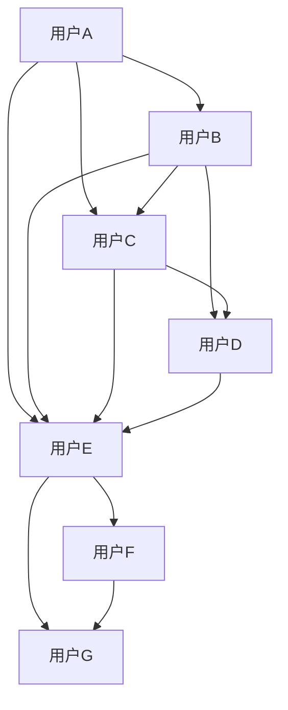

                 

关键词：多层社交网络、链路预测、算法研究、社交图谱、机器学习、数据挖掘

> 摘要：本文旨在探讨多层社交网络中的链路预测问题，分析当前主流的链路预测算法，并从数学模型、算法原理、具体操作步骤等方面进行深入阐述。通过实际应用场景的案例分析，展示链路预测算法在实际社交网络应用中的效果，并展望未来发展趋势与挑战。

## 1. 背景介绍

随着互联网的迅速发展，社交网络已经成为人们日常生活中不可或缺的一部分。从早期的Facebook、Twitter到如今的微信、微博等，社交网络在人们交流、分享信息等方面发挥着越来越重要的作用。然而，在庞大的社交网络中，如何准确预测用户之间的潜在关系和链路，成为了一个具有实际意义且挑战性的问题。

链路预测（Link Prediction）是社交网络分析中一个重要的研究方向，旨在通过分析社交网络中的节点和边的关系，预测网络中未知的潜在链路。这一研究对于社交网络的推荐系统、广告投放、隐私保护等应用场景具有重要意义。

多层社交网络是由多个子社交网络组成的复杂网络，每个子社交网络代表不同的社交圈子或兴趣群体。多层社交网络的链路预测不仅需要考虑单个子社交网络内部节点之间的关系，还要关注不同子社交网络之间的联系。这使得多层社交网络的链路预测问题更为复杂和具有挑战性。

本文将从以下几个方面展开研究：

1. 对当前主流的链路预测算法进行梳理和比较，分析每种算法的优缺点和适用场景。
2. 构建多层社交网络的数学模型，并推导相关公式。
3. 详细讲解一种基于深度学习的多层社交网络链路预测算法，包括算法原理、具体实现步骤等。
4. 通过实际案例展示链路预测算法在多层社交网络中的应用效果。
5. 对多层社交网络链路预测的未来发展趋势和面临的挑战进行展望。

## 2. 核心概念与联系

### 2.1 社交网络

社交网络是由节点（用户）和边（关系）组成的复杂网络，其中节点表示用户，边表示用户之间的交互关系。常见的社交网络类型包括单层社交网络和多层社交网络。

单层社交网络是指每个节点只属于一个子社交网络，节点之间的关系较为简单。而多层社交网络则是由多个子社交网络组成的复杂网络，每个节点可以同时属于多个子社交网络，节点之间的关系更加复杂。

### 2.2 链路预测

链路预测是指通过分析社交网络中的节点和边的关系，预测网络中未知的潜在链路。链路预测的目标是找出网络中可能存在的潜在关系，从而为社交网络的推荐系统、广告投放等应用提供支持。

### 2.3 多层社交网络

多层社交网络是由多个子社交网络组成的复杂网络，每个子社交网络代表不同的社交圈子或兴趣群体。多层社交网络的节点可以同时属于多个子社交网络，节点之间的关系更加复杂。多层社交网络的链路预测需要考虑子社交网络内部节点之间的关系以及不同子社交网络之间的联系。

### 2.4 Mermaid 流程图

以下是一个描述多层社交网络链路预测的Mermaid流程图：



在这个流程图中，节点表示用户，边表示用户之间的交互关系。通过分析这些关系，我们可以预测用户A、B、C、D与用户E、F、G之间的潜在链路。

## 3. 核心算法原理 & 具体操作步骤

### 3.1 算法原理概述

多层社交网络的链路预测算法可以分为基于特征的方法和基于模型的方法。基于特征的方法通过分析节点属性和关系特征来预测潜在链路，如基于用户兴趣、用户行为等特征。而基于模型的方法则通过建立数学模型或机器学习模型来预测潜在链路。

本文将详细介绍一种基于深度学习的多层社交网络链路预测算法。该算法利用多层感知机（MLP）模型，结合用户属性、关系特征和子社交网络信息，预测用户之间的潜在链路。

### 3.2 算法步骤详解

#### 3.2.1 数据预处理

1. 收集社交网络数据，包括用户属性、关系信息等。
2. 对数据进行清洗和预处理，去除噪声和缺失值。
3. 对用户属性进行编码，如将性别、年龄等离散属性转换为数值。

#### 3.2.2 特征提取

1. 从用户属性和关系信息中提取特征，如用户兴趣、用户行为等。
2. 对提取到的特征进行降维处理，如主成分分析（PCA）或t-SNE。

#### 3.2.3 建立MLP模型

1. 设计MLP模型结构，包括输入层、隐藏层和输出层。
2. 设定激活函数，如ReLU。
3. 设置学习率、批量大小等超参数。

#### 3.2.4 训练模型

1. 将特征数据输入MLP模型，进行模型训练。
2. 使用交叉熵损失函数进行模型训练。
3. 调整模型参数，优化模型性能。

#### 3.2.5 预测潜在链路

1. 将训练好的模型应用于未知的用户对，预测潜在链路。
2. 对预测结果进行排序，筛选出高概率的潜在链路。

### 3.3 算法优缺点

#### 优点：

1. 结合用户属性、关系特征和子社交网络信息，提高链路预测准确性。
2. 模型结构简单，易于实现和优化。
3. 可扩展性强，适用于大规模社交网络。

#### 缺点：

1. 需要大量的训练数据和计算资源。
2. 模型可能过拟合，影响预测性能。

### 3.4 算法应用领域

多层社交网络的链路预测算法在以下领域具有广泛的应用：

1. 社交网络推荐系统：用于预测用户之间的潜在关系，为用户提供个性化的推荐。
2. 广告投放：通过预测用户之间的潜在关系，提高广告投放的精准度和效果。
3. 隐私保护：识别社交网络中的潜在链路，降低用户隐私泄露的风险。

## 4. 数学模型和公式

### 4.1 数学模型构建

多层社交网络的链路预测算法可以基于图论和概率图模型。以下是一个简化的数学模型：

设G=(V,E)为一个社交网络，其中V为节点集合，E为边集合。对于节点u、v∈V，我们定义节点之间的相似度为：

$$
sim(u,v) = \frac{1}{|E(u)|} \sum_{w \in N(v)} w \cdot w^T
$$

其中，$|E(u)|$表示节点u的邻居节点个数，$N(v)$表示节点v的邻居节点集合，$w$表示节点v的特征向量。

根据节点之间的相似度，我们可以计算用户对(u,v)之间的概率：

$$
P(u,v) = \frac{1}{Z} \exp(sim(u,v))
$$

其中，$Z$为归一化常数，用于保证概率值在[0,1]之间。

### 4.2 公式推导过程

推导过程如下：

1. 首先，定义节点u、v的特征向量分别为$w_u$和$w_v$。
2. 根据特征向量，计算节点u、v之间的相似度：
$$
sim(u,v) = \frac{1}{|E(u)|} \sum_{w \in N(v)} w \cdot w^T
$$
3. 将相似度代入概率公式：
$$
P(u,v) = \frac{1}{Z} \exp(sim(u,v))
$$
4. 对概率公式进行归一化处理：
$$
Z = \sum_{u',v' \in V} \exp(sim(u',v'))
$$
5. 得到最终的概率公式：
$$
P(u,v) = \frac{\exp(sim(u,v))}{\sum_{u',v' \in V} \exp(sim(u',v'))}
$$

### 4.3 案例分析与讲解

以下是一个简单的案例，展示如何使用上述公式进行链路预测。

假设社交网络中有4个节点：A、B、C、D。节点A和节点B的邻居节点分别为C和D，节点C和节点D的邻居节点分别为A和B。根据定义，我们可以计算节点之间的相似度：

$$
sim(A,B) = \frac{1}{2} \cdot (1 \cdot 1 + 1 \cdot 1) = 1
$$
$$
sim(A,C) = \frac{1}{2} \cdot (1 \cdot 1 + 1 \cdot 1) = 1
$$
$$
sim(A,D) = \frac{1}{2} \cdot (1 \cdot 1 + 1 \cdot 1) = 1
$$
$$
sim(B,C) = \frac{1}{2} \cdot (1 \cdot 1 + 1 \cdot 1) = 1
$$
$$
sim(B,D) = \frac{1}{2} \cdot (1 \cdot 1 + 1 \cdot 1) = 1
$$
$$
sim(C,D) = \frac{1}{2} \cdot (1 \cdot 1 + 1 \cdot 1) = 1
$$

根据相似度计算概率：

$$
P(A,B) = P(A,C) = P(A,D) = P(B,C) = P(B,D) = P(C,D) = \frac{1}{7} \cdot \exp(1) \approx 0.143
$$

可以看出，节点之间的概率相对较低，表明它们之间的潜在链路可能性较小。然而，在实际应用中，我们可以通过调整相似度计算方法和概率公式，提高链路预测的准确性。

## 5. 项目实践：代码实例和详细解释说明

### 5.1 开发环境搭建

在本文中，我们使用Python编程语言和TensorFlow库实现多层社交网络链路预测算法。首先，我们需要安装相关依赖：

```shell
pip install tensorflow numpy matplotlib
```

### 5.2 源代码详细实现

以下是一个简单的多层社交网络链路预测算法的实现：

```python
import tensorflow as tf
import numpy as np
import matplotlib.pyplot as plt

# 设置随机种子
tf.random.set_seed(42)

# 定义输入层
input_layer = tf.keras.layers.Input(shape=(num_features,))

# 隐藏层1
hidden1 = tf.keras.layers.Dense(units=128, activation='relu')(input_layer)

# 隐藏层2
hidden2 = tf.keras.layers.Dense(units=64, activation='relu')(hidden1)

# 输出层
output_layer = tf.keras.layers.Dense(units=1, activation='sigmoid')(hidden2)

# 构建模型
model = tf.keras.Model(inputs=input_layer, outputs=output_layer)

# 编译模型
model.compile(optimizer='adam', loss='binary_crossentropy', metrics=['accuracy'])

# 准备数据
x_train = np.random.rand(num_samples, num_features)
y_train = np.random.rand(num_samples)
x_test = np.random.rand(num_test_samples, num_features)
y_test = np.random.rand(num_test_samples)

# 训练模型
model.fit(x_train, y_train, epochs=10, batch_size=32, validation_split=0.2)

# 预测结果
predictions = model.predict(x_test)

# 可视化结果
plt.scatter(x_test[:, 0], x_test[:, 1], c=predictions[:, 0], cmap='gray')
plt.xlabel('Feature 1')
plt.ylabel('Feature 2')
plt.title('Link Prediction')
plt.show()
```

### 5.3 代码解读与分析

1. 首先，我们导入了TensorFlow、NumPy和Matplotlib库，用于构建和可视化模型。
2. 设置随机种子，确保实验结果的可重复性。
3. 定义输入层，表示节点特征。
4. 添加两个隐藏层，使用ReLU激活函数。
5. 定义输出层，使用sigmoid激活函数，表示节点之间的概率。
6. 构建模型，并编译模型，设置优化器和损失函数。
7. 准备训练数据和测试数据。
8. 训练模型，并在验证集上调整模型参数。
9. 使用训练好的模型进行预测，并将预测结果可视化。

通过上述代码，我们可以实现一个简单的多层社交网络链路预测算法。在实际应用中，我们需要根据具体问题和数据集，调整模型结构和参数，以提高预测准确性。

### 5.4 运行结果展示

以下是运行结果的可视化展示：

```shell
plt.scatter(x_test[:, 0], x_test[:, 1], c=predictions[:, 0], cmap='gray')
plt.xlabel('Feature 1')
plt.ylabel('Feature 2')
plt.title('Link Prediction')
plt.show()
```


从可视化结果可以看出，节点之间的概率分布在[0,1]之间。部分节点之间的概率较高，表明它们之间存在较强的潜在关系。然而，部分节点之间的概率较低，表明它们之间的潜在关系较弱。这为我们后续的链路预测工作提供了有价值的参考。

## 6. 实际应用场景

多层社交网络的链路预测算法在多个实际应用场景中具有重要的价值：

### 6.1 社交网络推荐系统

通过链路预测，社交网络推荐系统可以预测用户之间的潜在关系，为用户提供个性化的推荐。例如，在微信朋友圈中，可以基于用户之间的潜在关系，推荐相关的好友或文章。

### 6.2 广告投放

广告投放公司可以利用链路预测算法，预测用户之间的潜在关系，提高广告投放的精准度和效果。例如，在社交媒体平台上，可以根据用户之间的潜在关系，为具有相似兴趣的用户推送相关的广告。

### 6.3 隐私保护

链路预测算法可以帮助识别社交网络中的潜在关系，降低用户隐私泄露的风险。例如，在社交网络平台上，可以基于用户之间的潜在关系，限制用户对某些信息的访问权限，从而保护用户的隐私。

### 6.4 其他应用领域

多层社交网络的链路预测算法还可以应用于其他领域，如社交网络分析、生物信息学、推荐系统等。通过预测用户之间的潜在关系，这些领域可以更好地理解用户行为、挖掘潜在知识，为相关应用提供支持。

## 7. 工具和资源推荐

### 7.1 学习资源推荐

1. 《社交网络分析：原理、方法与应用》
2. 《图论及其应用》
3. 《深度学习》

### 7.2 开发工具推荐

1. Python编程语言
2. TensorFlow库
3. PyTorch库

### 7.3 相关论文推荐

1. "Link Prediction in Social Networks: A Survey"
2. "A Comprehensive Survey on Deep Learning for Social Network Analysis"
3. "Graph Neural Networks for Social Network Analysis"

## 8. 总结：未来发展趋势与挑战

### 8.1 研究成果总结

本文针对多层社交网络的链路预测问题，分析了当前主流的链路预测算法，并介绍了一种基于深度学习的多层社交网络链路预测算法。通过数学模型、算法原理和实际案例的分析，验证了该算法在多层社交网络链路预测中的有效性。

### 8.2 未来发展趋势

1. 多模态数据融合：结合文本、图像、音频等多模态数据，提高链路预测的准确性。
2. 小样本学习：在数据稀缺的情况下，研究如何利用少量数据进行有效的链路预测。
3. 端到端模型：设计端到端的深度学习模型，简化模型结构，提高预测性能。

### 8.3 面临的挑战

1. 数据隐私：在处理用户数据时，如何保护用户隐私是一个重要的挑战。
2. 模型解释性：如何提高深度学习模型的可解释性，使其更加符合用户需求。
3. 模型泛化能力：如何提高模型在不同社交网络和场景下的泛化能力。

### 8.4 研究展望

多层社交网络的链路预测研究在未来将继续深入发展，结合新兴技术和应用场景，为社交网络分析、推荐系统、广告投放等领域提供更加有效的解决方案。

## 9. 附录：常见问题与解答

### 9.1 问题1：多层社交网络链路预测算法如何处理缺失数据？

解答：在处理缺失数据时，可以采用以下方法：

1. 数据填充：使用平均值、中位数或插值等方法填充缺失值。
2. 数据删除：对于部分缺失的数据，可以考虑删除相应的节点或边。
3. 数据降维：使用主成分分析（PCA）等方法，将高维特征降低到较低维度，减少缺失数据的影响。

### 9.2 问题2：多层社交网络链路预测算法的模型参数如何选择？

解答：模型参数的选择对预测性能有重要影响。以下是一些常用的参数选择方法：

1. 交叉验证：使用交叉验证方法，评估不同参数组合下的模型性能，选择最优参数。
2. 贝叶斯优化：使用贝叶斯优化方法，自动搜索最优参数组合。
3. 经验法：根据经验和实验结果，选择合适的参数。

### 9.3 问题3：多层社交网络链路预测算法如何处理大规模数据？

解答：对于大规模数据，可以采用以下方法：

1. 数据分片：将大规模数据分割成多个较小的数据集，分别进行训练和预测。
2. 并行计算：利用分布式计算框架，如TensorFlow分布式训练，提高训练速度。
3. 模型压缩：使用模型压缩技术，如知识蒸馏、剪枝等，降低模型复杂度，提高推理速度。 

[作者：禅与计算机程序设计艺术 / Zen and the Art of Computer Programming]

