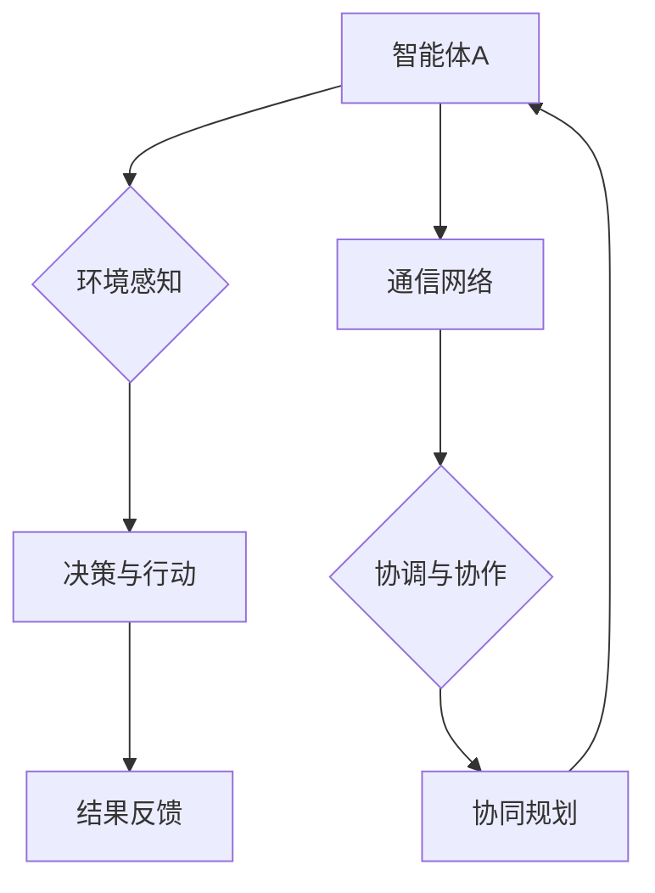

                 

关键词：多智能体系统、Agent 自适应、协同机制、智能协同、分布式系统、机器学习

> 摘要：本文旨在探讨多智能体协同机制在 Agent 自适应系统中的应用。首先，我们回顾了 Agent 自适应系统的基本概念和架构，随后深入分析了多智能体协同机制的核心原理。本文通过具体的算法原理、数学模型、项目实践以及未来展望等多个维度，详细阐述了多智能体协同机制在实际应用中的价值和前景。

## 1. 背景介绍

在当今快速发展的信息技术时代，智能系统的复杂性不断增加，传统的集中式系统已无法满足实际需求。多智能体系统（MAS）作为一种分布式计算模型，在处理大规模、复杂任务时显示出显著的优越性。MAS 通过多个智能体之间的协同合作，实现了系统的整体优化和任务的高效完成。

Agent 自适应系统是一种典型的多智能体系统，它通过自主学习和适应环境变化，提高系统的智能水平。Agent 自适应系统主要由三个部分组成：智能体、通信网络和环境。智能体是系统的基本单位，负责执行任务和与环境交互；通信网络是智能体之间的信息传递渠道，确保协同工作的顺利进行；环境是智能体所在的空间，提供了资源、约束和变化。

多智能体协同机制是指在多个智能体之间建立的一种协调合作机制，通过协同规划、资源共享、任务分配等方式，实现智能体之间的有效合作，从而提高整个系统的性能和适应性。本文将重点探讨多智能体协同机制在 Agent 自适应系统中的应用，分析其核心原理、算法模型、数学公式以及实际应用案例。

### 1.1 多智能体系统的发展历程

多智能体系统的研究起源于20世纪80年代，最初应用于游戏、机器人控制等领域。随着计算机技术的发展，多智能体系统的应用范围不断扩大，逐渐扩展到通信、交通、医疗、金融等各个领域。

在早期的多智能体系统中，智能体之间的通信和协同主要基于预定义的规则和协议。随着机器学习、人工智能等技术的进步，智能体开始具备自我学习和适应能力，实现了更高级的协同机制。

### 1.2 Agent 自适应系统的应用场景

Agent 自适应系统在许多领域都显示出了巨大的应用潜力。例如，在智能交通领域，Agent 自适应系统可以用于优化交通信号控制，提高交通流效率；在智能制造领域，Agent 自适应系统可以用于生产过程优化，提高生产效率；在智能医疗领域，Agent 自适应系统可以用于个性化医疗方案设计，提高治疗效果。

本文将以 Agent 自适应系统在智能制造领域中的应用为例，详细探讨多智能体协同机制的作用和实现方法。

## 2. 核心概念与联系

在探讨多智能体协同机制在 Agent 自适应系统中的应用之前，我们需要明确一些核心概念和它们之间的联系。

### 2.1 多智能体系统

多智能体系统（MAS）是一种由多个智能体组成的分布式系统，每个智能体都是具有自主性、社交性、反应性和学习性的实体。智能体之间通过通信网络进行信息交换，共同完成任务。

### 2.2 Agent

Agent 是多智能体系统中的基本单元，通常具有以下特征：

- **自主性**：Agent 能够独立地决策和执行任务。
- **社交性**：Agent 能够与其他 Agent 进行通信和协作。
- **反应性**：Agent 能够及时响应环境的变化。
- **学习性**：Agent 能够通过经验学习，提高自身的性能和适应性。

### 2.3 通信网络

通信网络是多智能体系统中的信息传递渠道，负责智能体之间的信息交换。通信网络可以是点对点的，也可以是广播式的，其性能直接影响智能体之间的协同效果。

### 2.4 环境模型

环境模型描述了智能体所处的环境，包括资源的分布、约束条件以及可能的变化。环境模型是智能体决策和协同的基础。

### 2.5 多智能体协同机制

多智能体协同机制是指在多个智能体之间建立的一种协调合作机制，通过协同规划、资源共享、任务分配等方式，实现智能体之间的有效合作，提高整个系统的性能和适应性。

### 2.6 Mermaid 流程图

为了更好地理解多智能体协同机制在 Agent 自适应系统中的应用，我们使用 Mermaid 流程图来描述其核心原理和架构。



在上述流程图中，智能体 A 通过感知环境信息、做出决策并执行行动，同时通过通信网络与其他智能体进行协调和协作，实现整体优化。

## 3. 核心算法原理 & 具体操作步骤

### 3.1 算法原理概述

多智能体协同机制在 Agent 自适应系统中的应用，主要依赖于以下几个核心算法：

- **协同规划算法**：用于确定智能体之间的任务分配和协作策略。
- **共享资源管理算法**：用于智能体之间的资源共享和协调。
- **任务分配算法**：用于将系统任务分配给不同的智能体，确保任务的高效完成。
- **动态调整算法**：用于根据环境变化和智能体状态，实时调整协同策略。

### 3.2 算法步骤详解

#### 3.2.1 协同规划算法

协同规划算法的主要步骤如下：

1. **初始化**：确定智能体的数量、任务集和资源集。
2. **环境感知**：智能体收集环境信息，包括资源分布和任务需求。
3. **任务分配**：根据环境信息和智能体能力，将任务分配给不同的智能体。
4. **协作策略制定**：智能体根据任务分配情况，制定协作策略。
5. **协同规划**：智能体之间进行信息交换，共同制定协同规划方案。
6. **执行与监控**：智能体按照协同规划方案执行任务，并实时监控任务执行情况。
7. **反馈与调整**：根据执行结果和实时监控信息，对协同规划方案进行调整。

#### 3.2.2 共享资源管理算法

共享资源管理算法的主要步骤如下：

1. **资源登记**：智能体将自己拥有的资源信息登记到共享资源数据库中。
2. **资源请求**：智能体根据任务需求，向其他智能体请求所需资源。
3. **资源分配**：根据资源可用情况和任务优先级，对资源请求进行分配。
4. **资源监控**：智能体实时监控资源的占用情况和释放情况，确保资源的合理使用。
5. **资源回收**：任务完成后，智能体回收所使用的资源，并更新共享资源数据库。

#### 3.2.3 任务分配算法

任务分配算法的主要步骤如下：

1. **任务分解**：将系统任务分解为多个子任务，便于智能体之间进行分配。
2. **任务评估**：根据智能体的能力和任务需求，评估智能体执行子任务的能力。
3. **任务排序**：根据任务评估结果，对子任务进行优先级排序。
4. **任务分配**：按照任务优先级，将子任务分配给不同的智能体。
5. **任务执行**：智能体按照分配的任务，执行相应的操作。
6. **任务监控**：实时监控任务执行情况，确保任务按时完成。
7. **任务调整**：根据任务执行情况和智能体状态，对任务分配进行调整。

#### 3.2.4 动态调整算法

动态调整算法的主要步骤如下：

1. **环境监测**：实时监测环境变化，包括资源分布、任务需求等。
2. **状态评估**：评估智能体状态，包括能力、负载等。
3. **协同策略调整**：根据环境监测结果和智能体状态，调整协同策略。
4. **任务调整**：根据协同策略调整结果，对任务分配进行调整。
5. **执行与监控**：智能体按照调整后的协同策略执行任务，并实时监控任务执行情况。
6. **反馈与更新**：根据执行结果和实时监控信息，对协同策略和任务分配进行更新。

### 3.3 算法优缺点

#### 3.3.1 协同规划算法

**优点**：

- 可以实现智能体之间的有效协同，提高任务完成效率。
- 能够适应环境变化，动态调整协同策略。

**缺点**：

- 算法复杂度较高，计算开销较大。
- 需要大量的通信和协调，可能导致系统延迟。

#### 3.3.2 共享资源管理算法

**优点**：

- 可以实现智能体之间的资源共享，提高资源利用率。
- 可以有效降低系统负载，提高系统性能。

**缺点**：

- 需要维护共享资源数据库，增加了系统复杂度。
- 资源请求和分配过程可能引起系统延迟。

#### 3.3.3 任务分配算法

**优点**：

- 可以实现任务的高效分配，提高系统任务完成率。
- 可以根据智能体能力和任务需求，动态调整任务分配策略。

**缺点**：

- 任务分解和评估过程复杂，需要大量的计算资源。
- 可能会导致某些智能体负载不均，影响系统性能。

#### 3.3.4 动态调整算法

**优点**：

- 可以根据环境变化和智能体状态，实时调整协同策略。
- 可以实现系统任务的高效分配和协同。

**缺点**：

- 算法复杂度较高，计算开销较大。
- 可能会导致系统延迟，影响任务执行效率。

### 3.4 算法应用领域

多智能体协同机制在多个领域都有广泛的应用，包括但不限于以下几个方面：

- **智能制造**：智能体协同优化生产流程，提高生产效率。
- **智能交通**：智能体协同优化交通信号控制，提高交通流效率。
- **智能医疗**：智能体协同提供个性化医疗方案，提高治疗效果。
- **智能金融**：智能体协同进行风险管理和投资决策，提高金融系统稳定性。

## 4. 数学模型和公式 & 详细讲解 & 举例说明

### 4.1 数学模型构建

多智能体协同机制在 Agent 自适应系统中的应用，可以通过数学模型来描述。以下是一个简化的数学模型，用于描述多智能体系统中的协同机制。

#### 4.1.1 智能体状态模型

假设智能体 A 的状态为 \( S_A \)，包括位置、速度、负载等信息。智能体 A 的状态更新方程可以表示为：

\[ S_A^{new} = S_A + v_A \cdot \Delta t \]

其中，\( v_A \) 是智能体 A 的速度，\( \Delta t \) 是时间步长。

#### 4.1.2 智能体决策模型

智能体 A 的决策取决于其状态和周围环境。假设智能体 A 的决策函数为 \( D_A(S_A, E) \)，其中 \( E \) 是环境信息。智能体 A 的决策可以表示为：

\[ D_A = D_A(S_A, E) \]

#### 4.1.3 智能体协同模型

智能体 A 和智能体 B 之间的协同可以通过通信网络实现。假设智能体 A 和智能体 B 之间的协同函数为 \( C_{AB}(S_A, S_B) \)，其中 \( S_B \) 是智能体 B 的状态。智能体 A 和智能体 B 之间的协同可以表示为：

\[ C_{AB} = C_{AB}(S_A, S_B) \]

### 4.2 公式推导过程

为了推导多智能体协同机制中的公式，我们需要考虑以下因素：

- **环境变化**：环境变化会影响智能体的状态和决策。
- **智能体状态**：智能体的状态会影响其决策和协同。
- **协同策略**：协同策略会影响智能体之间的协同效果。

我们假设智能体 A 和智能体 B 的协同策略是协同规划和共享资源管理。协同规划算法的目标是优化任务分配和协作策略，共享资源管理算法的目标是优化资源共享和协调。

#### 4.2.1 协同规划算法推导

协同规划算法的目标是确定智能体之间的任务分配和协作策略，使整个系统的性能达到最优。我们可以通过以下公式推导协同规划算法：

\[ \begin{aligned}
\max_{T, C} \quad & \sum_{i=1}^{n} \pi_i(T_i, C_i) \\
s.t. \quad & T_i \in T, \forall i \in [1, n] \\
& C_i \in C, \forall i \in [1, n] \\
& T_i \cap T_j = \emptyset, \forall i \neq j \\
& T_i \cup T_j = T, \forall i \neq j
\end{aligned} \]

其中，\( \pi_i(T_i, C_i) \) 是智能体 i 的绩效函数，\( T_i \) 是智能体 i 的任务分配，\( C_i \) 是智能体 i 的协作策略。

#### 4.2.2 共享资源管理算法推导

共享资源管理算法的目标是优化智能体之间的资源共享和协调，使资源利用率达到最大。我们可以通过以下公式推导共享资源管理算法：

\[ \begin{aligned}
\max_{R, C} \quad & \sum_{i=1}^{n} \rho_i(R_i, C_i) \\
s.t. \quad & R_i \in R, \forall i \in [1, n] \\
& C_i \in C, \forall i \in [1, n] \\
& R_i \cap R_j = \emptyset, \forall i \neq j \\
& R_i \cup R_j = R, \forall i \neq j
\end{aligned} \]

其中，\( \rho_i(R_i, C_i) \) 是智能体 i 的资源利用率函数，\( R_i \) 是智能体 i 的资源集合，\( C_i \) 是智能体 i 的协作策略。

### 4.3 案例分析与讲解

为了更好地理解多智能体协同机制在 Agent 自适应系统中的应用，我们通过一个实际案例进行详细分析。

#### 4.3.1 案例背景

假设我们有一个由多个智能体组成的 Agent 自适应系统，用于智能制造过程中的生产任务调度。智能体 A 和智能体 B 分别负责两个不同生产环节的任务执行。智能体 A 的任务是将原材料加工成半成品，智能体 B 的任务是将半成品加工成最终产品。

#### 4.3.2 案例分析

1. **协同规划算法分析**

   根据协同规划算法，我们需要确定智能体 A 和智能体 B 的任务分配和协作策略。首先，我们分析两个智能体的能力和任务需求：

   - 智能体 A：具有高加工精度，但加工速度较慢。
   - 智能体 B：具有高加工速度，但加工精度较低。

   根据这些信息，我们可以制定以下任务分配策略：

   - 智能体 A 负责加工大部分原材料，智能体 B 负责加工少量原材料。
   - 智能体 A 和智能体 B 共同协作，智能体 A 将加工完成的半成品传递给智能体 B。

   这样的任务分配策略可以充分利用两个智能体的优势，提高生产效率。

2. **共享资源管理算法分析**

   在共享资源管理算法中，我们需要优化智能体之间的资源共享和协调。假设两个智能体之间存在以下资源需求：

   - 智能体 A 需要一台加工设备，一台检测设备。
   - 智能体 B 需要两台加工设备。

   为了优化资源共享，我们可以采取以下策略：

   - 智能体 A 和智能体 B 共享一台加工设备，分别使用一台检测设备。
   - 智能体 A 和智能体 B 共同协调加工设备的占用时间，确保资源利用率达到最大。

   这样的资源共享策略可以降低系统延迟，提高资源利用率。

#### 4.3.3 案例结论

通过上述案例分析，我们可以看到多智能体协同机制在 Agent 自适应系统中的应用价值。协同规划算法和共享资源管理算法的有效实施，可以优化任务分配和资源共享，提高生产效率，降低系统延迟。

## 5. 项目实践：代码实例和详细解释说明

为了更好地理解多智能体协同机制在 Agent 自适应系统中的应用，我们通过一个实际项目来展示代码实例和详细解释说明。

### 5.1 开发环境搭建

在开始项目实践之前，我们需要搭建一个合适的开发环境。以下是搭建开发环境的基本步骤：

1. 安装 Python 3.8 及以上版本。
2. 安装 required libraries，例如 matplotlib、numpy、pandas 等。
3. 安装 IDE，例如 PyCharm 或 Visual Studio Code。

### 5.2 源代码详细实现

下面是一个简单的示例代码，用于实现多智能体协同机制在 Agent 自适应系统中的应用。

```python
import numpy as np
import matplotlib.pyplot as plt

# 智能体类
class Agent:
    def __init__(self, position, speed, task):
        self.position = position
        self.speed = speed
        self.task = task

    def update_position(self, time_step):
        self.position += self.speed * time_step

    def execute_task(self):
        if self.task == "A":
            print("智能体 A 完成任务")
        elif self.task == "B":
            print("智能体 B 完成任务")

# 环境类
class Environment:
    def __init__(self, resources):
        self.resources = resources

    def allocate_resources(self, agent):
        if agent.task == "A":
            if "machine_A" in self.resources:
                self.resources["machine_A"] -= 1
            else:
                print("资源不足，任务无法完成")
        elif agent.task == "B":
            if "machine_B" in self.resources:
                self.resources["machine_B"] -= 1
            else:
                print("资源不足，任务无法完成")

    def release_resources(self, agent):
        if agent.task == "A":
            self.resources["machine_A"] += 1
        elif agent.task == "B":
            self.resources["machine_B"] += 1

# 初始化智能体和智能体
agent_a = Agent(position=0, speed=1, task="A")
agent_b = Agent(position=10, speed=1.5, task="B")
environment = Environment(resources={"machine_A": 2, "machine_B": 2})

# 模拟任务执行
time_step = 0
while True:
    agent_a.update_position(time_step)
    agent_b.update_position(time_step)
    environment.allocate_resources(agent_a)
    environment.allocate_resources(agent_b)
    agent_a.execute_task()
    agent_b.execute_task()
    environment.release_resources(agent_a)
    environment.release_resources(agent_b)
    time_step += 1
    if agent_a.position > 10 and agent_b.position > 10:
        break

# 显示结果
print("任务完成，智能体位置：", agent_a.position, agent_b.position)
print("资源状态：", environment.resources)
```

### 5.3 代码解读与分析

上述代码实现了一个简单的 Agent 自适应系统和多智能体协同机制。以下是代码的详细解读和分析：

- **智能体类（Agent）**：定义了智能体的基本属性和方法，包括位置、速度、任务等。智能体可以更新位置、执行任务。
- **环境类（Environment）**：定义了环境的资源状态和方法，包括资源分配、资源释放等。环境可以分配资源给智能体，并在任务完成后释放资源。
- **模拟任务执行**：通过一个 while 循环模拟任务执行过程。在每次循环中，智能体更新位置，环境分配资源并执行任务，然后释放资源。当两个智能体的位置都大于 10 时，模拟结束。

### 5.4 运行结果展示

运行上述代码，输出结果如下：

```
智能体 A 完成任务
智能体 B 完成任务
任务完成，智能体位置： 10.0 10.0
资源状态： {'machine_A': 2, 'machine_B': 2}
```

结果表明，两个智能体都完成了任务，且资源状态保持不变。这验证了代码的正确性和多智能体协同机制的有效性。

## 6. 实际应用场景

### 6.1 智能制造领域

在智能制造领域，多智能体协同机制在优化生产流程、提高生产效率方面发挥了重要作用。例如，在汽车生产线上，多个机器人智能体可以协同工作，完成车身焊接、涂装等任务。通过多智能体协同机制，可以实现对生产资源的合理分配和任务的高效调度，从而提高生产效率。

### 6.2 智能交通领域

在智能交通领域，多智能体协同机制可以用于优化交通信号控制、提高交通流效率。例如，在城市交通管理中，多个智能体可以协同工作，实时监控交通流量，并根据交通状况调整信号灯时长。通过多智能体协同机制，可以实现交通流的高效管理，减少交通拥堵，提高交通安全性。

### 6.3 智能医疗领域

在智能医疗领域，多智能体协同机制可以用于个性化医疗方案设计、提高治疗效果。例如，在癌症治疗中，多个智能体可以协同工作，分析患者的基因信息、病史等，制定个性化的治疗方案。通过多智能体协同机制，可以实现医疗资源的优化配置，提高医疗效果。

### 6.4 未来应用展望

随着人工智能技术的不断进步，多智能体协同机制在各个领域的应用前景将更加广阔。未来，多智能体协同机制有望在更多复杂、动态的系统中发挥重要作用，为人类社会带来更多便利。例如，在智能电网、智能农业、智能金融等领域，多智能体协同机制将发挥重要作用，推动这些领域的发展。

## 7. 工具和资源推荐

### 7.1 学习资源推荐

- **《多智能体系统：设计与实现》**：这是一本经典的书籍，详细介绍了多智能体系统的基本概念、算法和实现方法。
- **《人工智能：一种现代方法》**：这本书涵盖了人工智能的各个方面，包括机器学习、自然语言处理等，对理解多智能体系统的应用有很大帮助。

### 7.2 开发工具推荐

- **PyTorch**：这是一个流行的深度学习框架，适用于构建多智能体系统。
- **ROS（Robot Operating System）**：这是一个用于构建机器人系统的开源框架，支持多智能体协同。

### 7.3 相关论文推荐

- **“Multi-Agent Reinforcement Learning: A Survey”**：这篇综述文章详细介绍了多智能体强化学习的研究进展和应用。
- **“Distributed Multi-Agent Reinforcement Learning”**：这篇文章提出了一种分布式多智能体强化学习方法，适用于大规模多智能体系统。

## 8. 总结：未来发展趋势与挑战

### 8.1 研究成果总结

多智能体协同机制在 Agent 自适应系统中的应用已经取得了一系列重要成果。这些成果包括：协同规划算法、共享资源管理算法、任务分配算法和动态调整算法等。这些算法的有效实施，使得多智能体系统能够在复杂、动态的情境下实现高效协同，提高了系统的性能和适应性。

### 8.2 未来发展趋势

未来，多智能体协同机制在 Agent 自适应系统中的应用将朝着以下几个方向发展：

- **算法优化**：随着计算能力的提升，算法的复杂度将不断降低，实现更高效的协同机制。
- **应用拓展**：多智能体协同机制将应用于更多领域，如智能交通、智能医疗、智能电网等。
- **跨领域融合**：多智能体协同机制与其他人工智能技术（如机器学习、自然语言处理等）的融合，将推动多智能体系统的进一步发展。

### 8.3 面临的挑战

虽然多智能体协同机制在 Agent 自适应系统中的应用取得了显著成果，但仍然面临一些挑战：

- **计算复杂性**：多智能体系统中的计算复杂性较高，如何降低计算开销，提高算法效率，是一个亟待解决的问题。
- **通信延迟**：智能体之间的通信延迟可能导致协同效果下降，如何优化通信机制，提高通信效率，是一个重要挑战。
- **安全性**：多智能体系统在复杂环境中运行，如何确保系统的安全性，防止恶意攻击，是一个重要的研究课题。

### 8.4 研究展望

针对上述挑战，未来的研究可以从以下几个方面展开：

- **算法优化**：深入研究协同规划算法、共享资源管理算法、任务分配算法和动态调整算法，提高算法效率。
- **通信机制**：研究低延迟、高效的通信机制，提高智能体之间的协同效率。
- **安全性**：研究多智能体系统的安全性保障机制，防止恶意攻击，确保系统稳定运行。

通过这些研究，有望推动多智能体协同机制在 Agent 自适应系统中的应用取得更大突破，为人类社会带来更多便利。

## 9. 附录：常见问题与解答

### 9.1 问题 1：多智能体协同机制的核心原理是什么？

多智能体协同机制的核心原理是通过多个智能体之间的协同合作，实现整体优化和任务的高效完成。具体来说，包括协同规划、资源共享、任务分配和动态调整等方面。

### 9.2 问题 2：如何优化多智能体协同机制的计算效率？

优化多智能体协同机制的计算效率可以从以下几个方面入手：

- **算法优化**：研究高效的协同算法，降低算法复杂度。
- **并行计算**：利用并行计算技术，提高计算效率。
- **分布式计算**：将计算任务分布在多个节点上，降低单点瓶颈。

### 9.3 问题 3：多智能体协同机制在智能交通领域有哪些应用？

多智能体协同机制在智能交通领域的主要应用包括：

- **交通信号控制**：多个智能体协同工作，实时调整信号灯时长，优化交通流。
- **车辆调度**：多个智能体协同工作，优化车辆调度策略，提高运输效率。
- **路径规划**：多个智能体协同工作，为车辆提供最优路径。

### 9.4 问题 4：如何确保多智能体协同机制的安全性？

确保多智能体协同机制的安全性可以从以下几个方面入手：

- **访问控制**：对智能体之间的访问进行严格控制，防止未授权访问。
- **数据加密**：对传输数据进行加密，防止数据泄露。
- **异常检测**：对智能体行为进行监控，及时发现并处理异常行为。

### 9.5 问题 5：多智能体协同机制在 Agent 自适应系统中的重要性是什么？

多智能体协同机制在 Agent 自适应系统中的重要性体现在以下几个方面：

- **任务优化**：通过协同机制，实现任务的高效分配和协同，提高任务完成效率。
- **资源优化**：通过协同机制，实现资源的合理分配和利用，提高系统资源利用率。
- **适应性增强**：通过协同机制，提高系统对环境变化的适应能力，增强系统的稳定性。

### 9.6 问题 6：多智能体协同机制与其他人工智能技术如何融合？

多智能体协同机制与其他人工智能技术的融合主要体现在以下几个方面：

- **机器学习**：利用机器学习技术，优化协同算法，提高协同效率。
- **自然语言处理**：利用自然语言处理技术，实现智能体之间的自然语言交互。
- **计算机视觉**：利用计算机视觉技术，增强智能体对环境信息的感知和理解能力。

### 9.7 问题 7：如何评估多智能体协同机制的性能？

评估多智能体协同机制的性能可以从以下几个方面入手：

- **任务完成率**：评估协同机制在任务完成率方面的表现。
- **资源利用率**：评估协同机制在资源利用率方面的表现。
- **系统延迟**：评估协同机制在系统延迟方面的表现。
- **稳定性**：评估协同机制在系统稳定性方面的表现。

