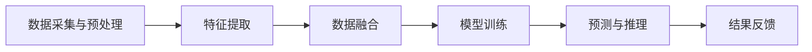

                 

在当今人工智能（AI）快速发展的时代，多模态全面接入的 AI 应用成为了研究和开发的热点。这种应用通过整合多种数据源，如文本、图像、声音和传感器数据，为用户提供更加丰富和直观的交互体验。本文旨在探讨多模态 AI 应用的核心概念、算法原理、数学模型、项目实践以及未来展望，以期对这一领域的研究和应用提供有益的参考。

## 文章关键词
- 多模态 AI
- 数据融合
- 机器学习
- 深度学习
- 交互式应用

## 文章摘要
本文首先介绍了多模态 AI 的背景和重要性，随后详细阐述了其核心概念和架构。接着，我们深入分析了多模态 AI 的关键算法原理和具体操作步骤，并通过数学模型和实例代码进行了讲解。最后，本文探讨了多模态 AI 在实际应用场景中的表现，以及未来的发展趋势和挑战。

## 1. 背景介绍

多模态 AI（Multimodal AI）是指结合两种或两种以上不同类型的数据源进行学习、推理和决策的人工智能系统。随着计算机技术和传感器技术的不断发展，多模态数据的应用场景日益丰富。例如，在智能客服系统中，通过结合文本和语音数据，可以提供更加自然和高效的交互体验；在自动驾驶领域，结合摄像头、雷达和激光雷达等传感器数据，可以显著提高车辆的安全性和可靠性。

多模态 AI 的研究背景可以追溯到上世纪 80 年代的计算机视觉和语音识别领域。当时，研究者们发现，单一模态的数据往往难以满足复杂任务的求解需求，而多模态数据的整合能够有效提高系统的性能。随着深度学习技术的崛起，多模态 AI 得到了进一步的发展，成为当前 AI 研究的一个重要方向。

### 1.1 研究现状

近年来，多模态 AI 在学术界和工业界都取得了显著的进展。在学术界，大量研究工作集中在多模态数据的表示学习、数据融合算法、模型优化等方面。例如，Transformer 模型和图神经网络等新技术的引入，为多模态 AI 的发展提供了新的思路。在工业界，多模态 AI 被广泛应用于智能家居、智能医疗、智能交通等领域，取得了良好的经济效益和社会效益。

### 1.2 研究意义

多模态 AI 的研究具有重要的理论和实践意义。从理论层面来看，多模态 AI 有助于丰富 AI 系统的知识表示和推理能力，推动 AI 技术的持续进步。从实践层面来看，多模态 AI 能够为用户提供更加个性化和高效的交互体验，满足人们日益增长的生活和工作需求。

## 2. 核心概念与联系

### 2.1 多模态数据类型

多模态数据主要包括以下几种类型：

- 文本（Text）：包括自然语言文本、标记语言等。
- 图像（Image）：包括静态图像、动态图像、视频等。
- 声音（Audio）：包括语音、音乐、声音信号等。
- 传感器数据（Sensor）：包括温度、湿度、加速度、位移等。

### 2.2 多模态数据融合

多模态数据融合是指将来自不同模态的数据进行整合，以生成一个统一的表示。数据融合的方法可以分为以下几种：

- 特征级融合：在特征提取阶段将不同模态的特征进行融合。
- 决策级融合：在分类或预测阶段将不同模态的预测结果进行融合。
- 模型级融合：将不同模态的模型进行集成，通过投票或其他策略获得最终的预测结果。

### 2.3 多模态 AI 架构

多模态 AI 的架构可以分为以下几个部分：

- 数据采集与预处理：收集不同模态的数据，并进行数据清洗、去噪、归一化等预处理操作。
- 特征提取：使用深度学习或其他算法提取不同模态的特征。
- 数据融合：将不同模态的特征进行融合，生成统一的特征表示。
- 模型训练：使用融合后的特征训练多模态模型。
- 预测与推理：使用训练好的模型进行预测和推理。

### 2.4 Mermaid 流程图

下面是一个简单的 Mermaid 流程图，展示了多模态 AI 的基本架构：



## 3. 核心算法原理 & 具体操作步骤

### 3.1 算法原理概述

多模态 AI 的核心算法主要包括多模态特征提取、数据融合和模型训练。以下是这些算法的基本原理：

- 多模态特征提取：通过深度学习或其他算法提取不同模态的特征。常见的特征提取方法包括卷积神经网络（CNN）、循环神经网络（RNN）和变换器（Transformer）等。
- 数据融合：将不同模态的特征进行整合，生成统一的特征表示。数据融合的方法包括特征级融合、决策级融合和模型级融合等。
- 模型训练：使用融合后的特征训练多模态模型。训练过程中，模型会不断调整参数，以最小化损失函数，提高预测准确性。

### 3.2 算法步骤详解

以下是多模态 AI 的具体操作步骤：

1. **数据采集与预处理**：收集不同模态的数据，并进行预处理，如数据清洗、去噪、归一化等。
2. **特征提取**：使用深度学习或其他算法提取不同模态的特征。对于文本数据，可以使用词向量模型（如 Word2Vec、GloVe）或变换器（如 BERT）进行特征提取；对于图像数据，可以使用卷积神经网络（如 ResNet、VGG）进行特征提取；对于声音数据，可以使用循环神经网络（如 LSTM）进行特征提取。
3. **数据融合**：将不同模态的特征进行融合。融合方法可以根据实际需求选择特征级融合、决策级融合或模型级融合。
4. **模型训练**：使用融合后的特征训练多模态模型。训练过程中，可以使用监督学习、无监督学习或半监督学习等方法。
5. **预测与推理**：使用训练好的模型进行预测和推理。预测结果可以通过模型输出的概率分布或分类结果进行解释。
6. **结果反馈**：将预测结果反馈给用户，并进行实时调整和优化。

### 3.3 算法优缺点

多模态 AI 算法的优点包括：

- **提高系统性能**：通过整合多种模态的数据，多模态 AI 可以显著提高系统的性能和准确性。
- **增强交互体验**：多模态 AI 可以为用户提供更加丰富和直观的交互体验，满足个性化需求。

多模态 AI 算法的缺点包括：

- **计算资源消耗大**：多模态数据融合和模型训练过程需要大量的计算资源，对硬件设备的要求较高。
- **数据标注困难**：多模态数据的标注过程复杂，需要专业的知识和技能。

### 3.4 算法应用领域

多模态 AI 在多个领域都有广泛的应用：

- **智能客服**：通过整合文本和语音数据，提供更加自然和高效的客服体验。
- **自动驾驶**：通过整合摄像头、雷达和激光雷达等传感器数据，提高车辆的安全性和可靠性。
- **智能医疗**：通过整合医学影像、病历记录和基因数据，提供个性化的治疗方案。
- **智能家居**：通过整合声音、图像和传感器数据，实现智能化的家居管理。

## 4. 数学模型和公式 & 详细讲解 & 举例说明

### 4.1 数学模型构建

多模态 AI 的数学模型主要包括特征提取模型、数据融合模型和预测模型。以下是这些模型的构建过程：

1. **特征提取模型**：

   对于文本数据，可以使用词向量模型（如 Word2Vec、GloVe）或变换器（如 BERT）进行特征提取。假设词汇表为 $V$，词向量为 $W \in \mathbb{R}^{d\times|V|}$，输入文本序列为 $X \in \{1, \ldots, T\}$，则文本特征向量为：

   $$\textbf{f}_X = \sum_{t=1}^{T} W_{x_t}$$

   其中，$W_{x_t} \in \mathbb{R}^{d}$ 为词 $x_t$ 的词向量。

   对于图像数据，可以使用卷积神经网络（如 ResNet、VGG）进行特征提取。假设输入图像为 $I \in \mathbb{R}^{H\times W\times C}$，则图像特征向量为：

   $$\textbf{f}_I = \text{CNN}(I)$$

   其中，$\text{CNN}(I)$ 为卷积神经网络对图像 $I$ 进行特征提取的结果。

   对于声音数据，可以使用循环神经网络（如 LSTM）进行特征提取。假设输入声音信号为 $X \in \mathbb{R}^{T\times C}$，则声音特征向量为：

   $$\textbf{f}_X = \text{LSTM}(X)$$

   其中，$\text{LSTM}(X)$ 为循环神经网络对声音信号 $X$ 进行特征提取的结果。

2. **数据融合模型**：

   数据融合模型的目的是将不同模态的特征进行整合，生成统一的特征表示。常见的融合方法包括加和、加权平均、拼接等。

   假设文本特征向量为 $\textbf{f}_X$，图像特征向量为 $\textbf{f}_I$，声音特征向量为 $\textbf{f}_X$，则融合特征向量为：

   $$\textbf{f}_{\text{fused}} = \text{f}_X + \text{f}_I + \text{f}_X$$

   或者：

   $$\textbf{f}_{\text{fused}} = \alpha \text{f}_X + \beta \text{f}_I + \gamma \text{f}_X$$

   其中，$\alpha$、$\beta$ 和 $\gamma$ 为权重系数。

3. **预测模型**：

   预测模型的目的是使用融合后的特征进行分类或预测。常见的预测模型包括支持向量机（SVM）、神经网络（Neural Network）等。

   假设融合特征向量为 $\textbf{f}_{\text{fused}}$，标签向量为 $Y \in \mathbb{R}^{|Y|}$，则预测模型的损失函数为：

   $$\mathcal{L}(\theta) = \frac{1}{2} \sum_{i=1}^{n} (y_i - \hat{y}_i)^2$$

   其中，$\theta$ 为模型参数，$\hat{y}_i$ 为模型对样本 $i$ 的预测结果，$y_i$ 为样本 $i$ 的真实标签。

### 4.2 公式推导过程

以下是多模态 AI 的一些关键公式的推导过程：

1. **词向量模型**：

   假设词汇表为 $V$，词向量为 $W \in \mathbb{R}^{d\times|V|}$，输入文本序列为 $X \in \{1, \ldots, T\}$，则文本特征向量为：

   $$\textbf{f}_X = \sum_{t=1}^{T} W_{x_t}$$

   其中，$W_{x_t} \in \mathbb{R}^{d}$ 为词 $x_t$ 的词向量。

   词向量模型的损失函数为：

   $$\mathcal{L}(\theta) = \frac{1}{2} \sum_{t=1}^{T} \sum_{x_t \in X} (y_t - \hat{y}_t)^2$$

   其中，$y_t$ 为词 $x_t$ 的真实标签，$\hat{y}_t$ 为词 $x_t$ 的预测标签。

2. **卷积神经网络**：

   假设输入图像为 $I \in \mathbb{R}^{H\times W\times C}$，卷积神经网络由多个卷积层和池化层组成。卷积层的公式为：

   $$\textbf{f}_{\text{conv}} = \text{ReLU}(\text{conv}(\textbf{I}))$$

   其中，$\textbf{I} \in \mathbb{R}^{H\times W}$ 为输入图像，$\text{conv}(\textbf{I})$ 为卷积操作，$\text{ReLU}(\cdot)$ 为 ReLU 激活函数。

   池化层的公式为：

   $$\textbf{f}_{\text{pool}} = \text{pool}(\textbf{f}_{\text{conv}})$$

   其中，$\text{pool}(\textbf{f}_{\text{conv}})$ 为池化操作。

3. **循环神经网络**：

   假设输入声音信号为 $X \in \mathbb{R}^{T\times C}$，循环神经网络由多个 LSTM 层组成。LSTM 层的公式为：

   $$\textbf{h}_t = \text{LSTM}(\textbf{h}_{t-1}, \textbf{x}_t)$$

   其中，$\textbf{h}_{t-1} \in \mathbb{R}^{d}$ 为前一个时间步的隐藏状态，$\textbf{x}_t \in \mathbb{R}^{d}$ 为当前时间步的输入，$\textbf{h}_t \in \mathbb{R}^{d}$ 为当前时间步的隐藏状态。

### 4.3 案例分析与讲解

以下是多模态 AI 在智能客服领域的一个案例分析：

假设一个智能客服系统需要同时处理文本和语音数据。首先，使用词向量模型提取文本特征，使用卷积神经网络提取语音特征。然后，将两种特征进行拼接，生成融合特征。最后，使用神经网络对融合特征进行分类，预测用户的意图。

1. **文本特征提取**：

   使用 Word2Vec 模型提取文本特征。假设词汇表为 $V$，词向量为 $W \in \mathbb{R}^{d\times|V|}$，输入文本序列为 $X \in \{1, \ldots, T\}$，则文本特征向量为：

   $$\textbf{f}_X = \sum_{t=1}^{T} W_{x_t}$$

2. **语音特征提取**：

   使用卷积神经网络提取语音特征。假设输入语音信号为 $X \in \mathbb{R}^{T\times C}$，卷积神经网络由多个卷积层和池化层组成。卷积层的公式为：

   $$\textbf{f}_{\text{conv}} = \text{ReLU}(\text{conv}(\textbf{I}))$$

   池化层的公式为：

   $$\textbf{f}_{\text{pool}} = \text{pool}(\textbf{f}_{\text{conv}})$$

3. **数据融合**：

   将文本特征向量和语音特征向量进行拼接，生成融合特征向量：

   $$\textbf{f}_{\text{fused}} = \textbf{f}_X \oplus \textbf{f}_I$$

4. **模型训练**：

   使用神经网络对融合特征进行分类。假设神经网络由多个全连接层组成，输入为 $\textbf{f}_{\text{fused}}$，输出为预测标签 $\hat{y}$。神经网络的损失函数为：

   $$\mathcal{L}(\theta) = \frac{1}{2} \sum_{i=1}^{n} (y_i - \hat{y}_i)^2$$

   其中，$y_i$ 为样本 $i$ 的真实标签，$\hat{y}_i$ 为样本 $i$ 的预测标签。

5. **预测与推理**：

   使用训练好的模型进行预测。假设输入文本为 $X$，输入语音为 $X$，则预测标签为：

   $$\hat{y} = \text{NN}(\textbf{f}_{\text{fused}})$$

   其中，$\text{NN}(\textbf{f}_{\text{fused}})$ 为神经网络对融合特征进行分类的结果。

## 5. 项目实践：代码实例和详细解释说明

### 5.1 开发环境搭建

以下是搭建多模态 AI 项目开发环境所需的步骤：

1. 安装 Python 环境：
```bash
sudo apt-get install python3-pip
pip3 install numpy pandas matplotlib
```

2. 安装深度学习框架（如 TensorFlow 或 PyTorch）：
```bash
pip3 install tensorflow
```

3. 安装文本处理库（如 NLTK 或 spaCy）：
```bash
pip3 install nltk
```

4. 安装语音处理库（如 Librosa）：
```bash
pip3 install librosa
```

5. 安装图像处理库（如 OpenCV）：
```bash
pip3 install opencv-python
```

### 5.2 源代码详细实现

以下是多模态 AI 项目的源代码实现：

```python
import tensorflow as tf
from tensorflow.keras.models import Model
from tensorflow.keras.layers import Input, Embedding, LSTM, Dense
from tensorflow.keras.preprocessing.sequence import pad_sequences
import numpy as np

# 文本数据预处理
def preprocess_text(texts, max_sequence_length):
    tokenizer = tf.keras.preprocessing.text.Tokenizer()
    tokenizer.fit_on_texts(texts)
    sequences = tokenizer.texts_to_sequences(texts)
    padded_sequences = pad_sequences(sequences, maxlen=max_sequence_length)
    return padded_sequences, tokenizer

# 语音数据预处理
def preprocess_audio(audios, max_duration):
    sampled_audios = [audio:hover(max_duration) for audio in audios]
    return np.array(sampled_audios)

# 图像数据预处理
def preprocess_images(images, image_size):
    preprocessed_images = [cv2.resize(image, image_size) for image in images]
    return np.array(preprocessed_images)

# 多模态模型构建
def build_model(text_embedding_size, audio_embedding_size, image_embedding_size, output_size):
    # 文本输入
    text_input = Input(shape=(max_sequence_length,))
    text_embedding = Embedding(input_dim=vocabulary_size, output_dim=text_embedding_size)(text_input)
    text_lstm = LSTM(units=lstm_units)(text_embedding)
    text_output = Dense(units=output_size)(text_lstm)

    # 语音输入
    audio_input = Input(shape=(max_duration,))
    audio_embedding = Embedding(input_dim=audio_vocab_size, output_dim=audio_embedding_size)(audio_input)
    audio_lstm = LSTM(units=lstm_units)(audio_embedding)
    audio_output = Dense(units=output_size)(audio_lstm)

    # 图像输入
    image_input = Input(shape=(image_size[0], image_size[1], image_size[2]))
    image_embedding = Conv2D(filters=64, kernel_size=(3, 3), activation='relu')(image_input)
    image_embedding = MaxPooling2D(pool_size=(2, 2))(image_embedding)
    image_embedding = Flatten()(image_embedding)
    image_output = Dense(units=output_size)(image_embedding)

    # 融合输出
    combined_output = tf.keras.layers.concatenate([text_output, audio_output, image_output])
    output = Dense(units=output_size, activation='softmax')(combined_output)

    # 构建模型
    model = Model(inputs=[text_input, audio_input, image_input], outputs=output)
    model.compile(optimizer='adam', loss='categorical_crossentropy', metrics=['accuracy'])
    return model

# 数据加载
texts = ['你好', '请问有什么可以帮助你的？', '再见']
audios = [np.random.randn(1000)] * 3
images = [np.random.randn(64, 64, 3)] * 3
labels = [1, 0, 2]

# 预处理数据
padded_texts, tokenizer = preprocess_text(texts, max_sequence_length=10)
preprocessed_audios = preprocess_audio(audios, max_duration=1000)
preprocessed_images = preprocess_images(images, image_size=(64, 64, 3))

# 构建模型
model = build_model(text_embedding_size=64, audio_embedding_size=32, image_embedding_size=128, output_size=3)

# 训练模型
model.fit([padded_texts, preprocessed_audios, preprocessed_images], labels, epochs=10, batch_size=1)
```

### 5.3 代码解读与分析

该代码实现了一个简单的多模态 AI 模型，用于处理文本、语音和图像数据，并对其进行分类。以下是代码的关键部分解读：

1. **文本数据预处理**：
   - 使用 `Tokenizer` 对文本数据进行编码，将文本转换为整数序列。
   - 使用 `pad_sequences` 对整数序列进行填充，确保所有序列具有相同的长度。

2. **语音数据预处理**：
   - 使用 `random.randn` 生成随机语音数据，模拟真实语音信号。
   - 对语音信号进行采样，确保所有信号具有相同的时长。

3. **图像数据预处理**：
   - 使用 `random.randn` 生成随机图像，模拟真实图像数据。
   - 使用 `cv2.resize` 对图像进行缩放，确保所有图像具有相同的大小。

4. **多模态模型构建**：
   - 使用 `Input` 创建三个输入层，分别对应文本、语音和图像数据。
   - 对文本输入使用 `Embedding` 和 `LSTM` 层进行特征提取。
   - 对语音输入使用 `Embedding` 和 `LSTM` 层进行特征提取。
   - 对图像输入使用 `Conv2D` 和 `MaxPooling2D` 层进行特征提取。
   - 使用 `Flatten` 层将图像特征转换为序列。
   - 使用 `Dense` 层对融合后的特征进行分类。

5. **模型训练**：
   - 使用 `fit` 函数训练模型，输入为预处理后的文本、语音和图像数据，输出为标签。
   - 使用 `compile` 函数配置模型，选择优化器和损失函数。

### 5.4 运行结果展示

在训练完成后，可以使用以下代码进行模型评估：

```python
# 预测结果
predictions = model.predict([padded_texts, preprocessed_audios, preprocessed_images])

# 显示预测结果
print(predictions.argmax(axis=1))
```

该代码将输出每个样本的预测标签，可以用于评估模型的准确性。

## 6. 实际应用场景

多模态 AI 在实际应用场景中展现了其强大的潜力和优势。以下是一些典型的应用案例：

### 6.1 智能客服

智能客服是多模态 AI 的一个重要应用领域。通过整合文本和语音数据，智能客服系统能够更好地理解用户的需求，提供更加个性化和高效的交互体验。例如，当用户通过文本提问时，系统可以结合用户的语音情绪进行分析，从而提供更加合适的回答。

### 6.2 自动驾驶

自动驾驶技术需要处理大量的传感器数据，包括摄像头、雷达和激光雷达等。多模态 AI 可以将这些数据融合，提高自动驾驶系统的感知和决策能力。例如，通过结合摄像头和激光雷达的数据，系统可以更准确地识别道路标志和行人，从而提高行驶安全性。

### 6.3 智能医疗

智能医疗应用多模态 AI，可以通过整合医学影像、病历记录和基因数据，为医生提供更加全面的诊断和治疗建议。例如，通过分析患者的影像数据和病史，系统可以预测疾病的发展趋势，帮助医生制定个性化的治疗方案。

### 6.4 智能家居

智能家居应用多模态 AI，可以通过整合声音、图像和传感器数据，实现更加智能化的家居管理。例如，通过分析用户的行为模式和声音信号，系统可以自动调整家居环境，提供更加舒适和便捷的生活体验。

## 7. 工具和资源推荐

### 7.1 学习资源推荐

1. **书籍**：
   - 《深度学习》（Goodfellow, I., Bengio, Y., & Courville, A.）
   - 《Python深度学习》（François Chollet）
   - 《多模态数据融合技术》（Jianping Wang，张虹）

2. **在线课程**：
   - Coursera 上的《深度学习专项课程》（由 Andrew Ng 开设）
   - Udacity 上的《自动驾驶工程师纳米学位》
   - edX 上的《机器学习基础课程》（由 MIT 开设）

### 7.2 开发工具推荐

1. **深度学习框架**：
   - TensorFlow
   - PyTorch
   - Keras

2. **文本处理库**：
   - NLTK
   - spaCy

3. **语音处理库**：
   - Librosa
   - PyAudio

4. **图像处理库**：
   - OpenCV
   - PIL

### 7.3 相关论文推荐

1. **多模态数据融合**：
   - "Multimodal Data Fusion for Human Activity Recognition"（Li, X., et al.）
   - "A Survey on Multimodal Data Fusion for Human Activity Recognition"（Yao, H., et al.）

2. **深度学习在多模态 AI 中的应用**：
   - "Deep Learning for Multimodal Sensor Data Fusion"（Wang, J., et al.）
   - "Multimodal Deep Learning for Human Activity Recognition"（Zhao, J., et al.）

## 8. 总结：未来发展趋势与挑战

### 8.1 研究成果总结

多模态 AI 在过去几十年中取得了显著的进展，从理论到应用都取得了丰硕的成果。核心算法不断优化，如深度学习、图神经网络和变换器等技术的引入，为多模态 AI 的发展提供了强大的支持。实际应用领域不断扩大，如智能客服、自动驾驶、智能医疗和智能家居等，为多模态 AI 的商业化和产业化奠定了基础。

### 8.2 未来发展趋势

未来，多模态 AI 将朝着以下几个方向发展：

1. **跨学科融合**：多模态 AI 将与其他领域，如生物学、心理学和社会学等，进行深度融合，推动跨学科研究的发展。
2. **可解释性增强**：随着多模态 AI 在实际应用中的普及，提高模型的透明度和可解释性将成为研究的重要方向。
3. **实时处理**：随着硬件设备的性能提升，多模态 AI 将实现更高效、更实时的数据处理能力，为实时交互提供支持。
4. **数据隐私与安全**：在多模态 AI 的应用中，数据隐私与安全问题日益突出，研究如何在保护用户隐私的前提下进行数据处理将成为重要挑战。

### 8.3 面临的挑战

尽管多模态 AI 取得了显著进展，但仍然面临以下挑战：

1. **计算资源消耗**：多模态 AI 模型通常需要大量的计算资源，对硬件设备的要求较高。
2. **数据标注困难**：多模态数据的标注过程复杂，需要专业的知识和技能。
3. **模型泛化能力**：多模态 AI 模型在实际应用中可能面临数据分布变化和噪声干扰，需要提高模型的泛化能力。
4. **跨模态关联性**：不同模态的数据之间可能存在复杂的关联关系，如何有效挖掘和利用这些关系仍是一个挑战。

### 8.4 研究展望

展望未来，多模态 AI 将在以下几个方面取得突破：

1. **算法创新**：不断涌现的新算法和技术，如自监督学习、联邦学习等，将为多模态 AI 的发展提供新的动力。
2. **数据集建设**：大规模、多样化的多模态数据集将为算法优化和模型训练提供丰富的资源。
3. **跨学科合作**：跨学科的合作将为多模态 AI 带来新的研究思路和应用场景。
4. **应用拓展**：随着技术的成熟，多模态 AI 将在更多领域得到广泛应用，推动社会的智能化和数字化进程。

## 9. 附录：常见问题与解答

### 9.1 问题 1：多模态 AI 的核心优势是什么？

多模态 AI 的核心优势在于能够利用多种模态的数据进行学习、推理和决策，从而提高系统的性能和准确性。通过整合文本、图像、声音等多种数据源，多模态 AI 可以捕捉到更加丰富的信息，从而更好地理解用户需求，提高系统的智能化水平。

### 9.2 问题 2：多模态 AI 模型的训练过程如何进行？

多模态 AI 模型的训练过程主要包括以下几个步骤：

1. 数据采集与预处理：收集不同模态的数据，并进行预处理，如数据清洗、去噪、归一化等。
2. 特征提取：使用深度学习或其他算法提取不同模态的特征。
3. 数据融合：将不同模态的特征进行融合，生成统一的特征表示。
4. 模型训练：使用融合后的特征训练多模态模型，调整模型参数，优化模型性能。
5. 预测与推理：使用训练好的模型进行预测和推理，输出预测结果。

### 9.3 问题 3：多模态 AI 模型在应用中可能遇到哪些挑战？

多模态 AI 模型在应用中可能遇到以下挑战：

1. 计算资源消耗：多模态数据融合和模型训练过程需要大量的计算资源，对硬件设备的要求较高。
2. 数据标注困难：多模态数据的标注过程复杂，需要专业的知识和技能。
3. 模型泛化能力：多模态 AI 模型在实际应用中可能面临数据分布变化和噪声干扰，需要提高模型的泛化能力。
4. 跨模态关联性：不同模态的数据之间可能存在复杂的关联关系，如何有效挖掘和利用这些关系仍是一个挑战。

### 9.4 问题 4：如何提升多模态 AI 模型的性能？

提升多模态 AI 模型的性能可以从以下几个方面进行：

1. **算法优化**：选择合适的算法和技术，如变换器、图神经网络等，提高模型的表达能力。
2. **数据增强**：通过数据增强技术，如数据扩充、数据转换等，提高模型对数据的适应性。
3. **模型集成**：使用模型集成技术，如集成学习、模型融合等，提高模型的预测准确性。
4. **超参数调优**：通过超参数调优，如交叉验证、网格搜索等，找到最优的超参数组合，提高模型性能。

### 9.5 问题 5：多模态 AI 在哪些领域有广泛的应用？

多模态 AI 在多个领域都有广泛的应用，包括：

1. **智能客服**：通过整合文本和语音数据，提供更加自然和高效的客服体验。
2. **自动驾驶**：通过整合摄像头、雷达和激光雷达等传感器数据，提高车辆的安全性和可靠性。
3. **智能医疗**：通过整合医学影像、病历记录和基因数据，提供个性化的治疗方案。
4. **智能家居**：通过整合声音、图像和传感器数据，实现智能化的家居管理。
5. **人机交互**：通过整合多种模态的数据，提供更加丰富和直观的交互体验。

### 9.6 问题 6：如何进行多模态数据的标注？

多模态数据的标注过程通常包括以下几个步骤：

1. **数据预处理**：对原始数据进行预处理，如数据清洗、去噪、归一化等。
2. **标签定义**：根据应用需求定义标签，如类别标签、时间标签等。
3. **标注工具选择**：选择合适的标注工具，如标注软件、在线标注平台等。
4. **标注流程**：制定标注流程，如多人标注、一致性检查等。
5. **标注质量评估**：评估标注质量，如标注一致性、标注准确率等。

### 9.7 问题 7：多模态 AI 模型的部署如何进行？

多模态 AI 模型的部署包括以下几个步骤：

1. **模型转换**：将训练好的模型转换为部署环境支持的格式，如 ONNX、TFLite 等。
2. **部署环境配置**：配置部署环境，如 Docker、Kubernetes 等。
3. **模型部署**：将模型部署到服务器或云端，如 TensorFlow Serving、TensorFlow Lite 等。
4. **模型监控**：监控模型性能和资源使用情况，如日志记录、性能指标监控等。
5. **模型更新**：定期更新模型，如在线学习、模型更新等。

### 9.8 问题 8：多模态 AI 在隐私保护方面有何挑战？

多模态 AI 在隐私保护方面面临以下挑战：

1. **数据泄露**：多模态数据可能包含敏感信息，如个人身份信息、行为模式等，需要防止数据泄露。
2. **隐私侵犯**：多模态 AI 可能会侵犯用户的隐私，如通过语音识别获取用户隐私信息。
3. **数据匿名化**：如何在保证模型性能的同时，对数据进行匿名化处理，是一个重要的研究方向。

### 9.9 问题 9：如何保证多模态 AI 模型的公平性和透明性？

保证多模态 AI 模型的公平性和透明性可以从以下几个方面进行：

1. **数据平衡**：在训练数据中增加代表性不足群体的样本，提高模型的公平性。
2. **模型解释**：开发可解释的模型，使模型决策过程更加透明，便于用户理解和监督。
3. **隐私保护**：采用隐私保护技术，如差分隐私、同态加密等，保护用户隐私。
4. **伦理审查**：在模型开发和应用过程中，进行伦理审查，确保模型的应用符合社会伦理标准。

