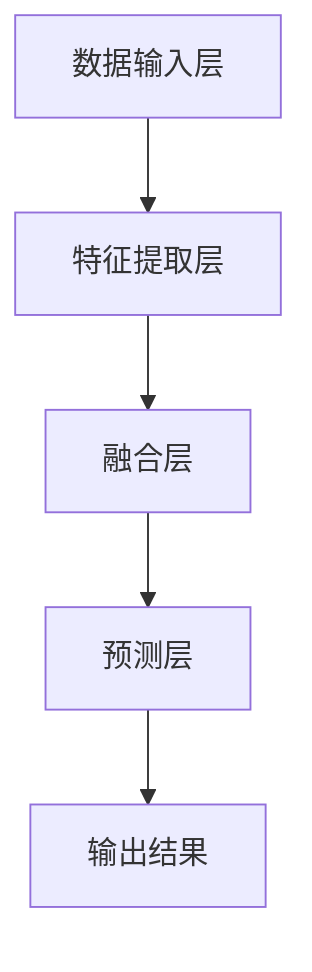

                 

关键词：多模态大模型、技术原理、应用图谱、人工智能、深度学习

摘要：本文将深入探讨多模态大模型的技术原理与应用图谱。从背景介绍到核心算法，再到数学模型与项目实践，本文旨在为读者提供一份全面而深入的理解。同时，我们也将对未来应用前景和挑战进行展望，并提供相关学习资源和开发工具推荐。

## 1. 背景介绍

随着人工智能技术的飞速发展，多模态大模型正逐渐成为研究与应用的热点。多模态大模型是指能够同时处理多种类型数据（如文本、图像、音频等）的大型神经网络模型。这些模型的出现，不仅扩展了人工智能的应用范围，还提升了任务的执行效率与准确性。

多模态大模型的发展历程可以追溯到20世纪90年代。当时，研究者开始尝试将不同的数据模态（如图像和文本）进行融合，以解决单一模态模型难以处理的复杂任务。随着时间的推移，深度学习和神经网络技术的进步，使得多模态大模型的研究和应用取得了显著成果。

## 2. 核心概念与联系

在探讨多模态大模型之前，我们需要了解以下几个核心概念：

### 2.1 模态（Modalities）

模态是指数据的一种表现形式，如文本、图像、音频等。多模态大模型能够同时处理多种模态的数据，从而实现对复杂任务的建模和预测。

### 2.2 融合（Fusion）

融合是指将不同模态的数据进行结合，以提取更多有用信息。融合可以通过多种方式实现，如空间融合、时间融合和特征融合等。

### 2.3 大模型（Large Models）

大模型是指具有数百万甚至数十亿参数的神经网络模型。这些模型具有强大的建模能力和泛化能力，能够处理复杂的任务。

### 2.4 模型架构

多模态大模型的架构通常包括以下几个关键部分：

1. **数据输入层**：接收各种模态的数据，如文本、图像、音频等。
2. **特征提取层**：对输入数据进行特征提取，如使用卷积神经网络（CNN）提取图像特征，使用循环神经网络（RNN）提取文本特征等。
3. **融合层**：将不同模态的特征进行融合，以提取更多有用信息。
4. **预测层**：对融合后的特征进行预测，如分类、回归等。

下面是一个简单的Mermaid流程图，展示了多模态大模型的基本架构：



## 3. 核心算法原理 & 具体操作步骤

### 3.1 算法原理概述

多模态大模型的核心算法主要包括特征提取、融合和预测三个部分。特征提取部分使用不同的神经网络架构提取不同模态的数据特征；融合部分将不同模态的特征进行结合；预测部分使用融合后的特征进行预测。

### 3.2 算法步骤详解

#### 3.2.1 特征提取

特征提取是构建多模态大模型的第一步。常见的特征提取方法包括：

1. **文本特征提取**：使用循环神经网络（RNN）或变换器（Transformer）提取文本特征。
2. **图像特征提取**：使用卷积神经网络（CNN）提取图像特征。
3. **音频特征提取**：使用循环神经网络（RNN）或变换器（Transformer）提取音频特征。

#### 3.2.2 融合

融合是将不同模态的特征进行结合的过程。常见的融合方法包括：

1. **空间融合**：将不同模态的特征进行拼接或求和。
2. **时间融合**：将不同模态的特征在时间轴上进行结合。
3. **特征融合**：使用神经网络或其他机器学习算法对特征进行融合。

#### 3.2.3 预测

预测部分使用融合后的特征进行预测。常见的预测方法包括：

1. **分类**：对标签进行分类预测。
2. **回归**：对数值标签进行回归预测。
3. **其他任务**：如语义理解、情感分析等。

### 3.3 算法优缺点

多模态大模型具有以下优点：

1. **强大的建模能力**：能够处理复杂的多模态数据，提高任务执行效率。
2. **广泛的适用性**：可以应用于多种任务场景，如语音识别、图像识别、自然语言处理等。

然而，多模态大模型也存在一些缺点：

1. **计算资源需求高**：大模型的训练和推理需要大量的计算资源。
2. **数据需求大**：大模型需要大量多模态数据进行训练。

### 3.4 算法应用领域

多模态大模型在多个领域具有广泛的应用：

1. **语音识别**：将语音信号与文本数据进行结合，提高识别准确率。
2. **图像识别**：将图像数据与文本标签进行结合，提高识别性能。
3. **自然语言处理**：将文本、图像和音频数据进行结合，提高文本理解能力。

## 4. 数学模型和公式 & 详细讲解 & 举例说明

### 4.1 数学模型构建

多模态大模型的数学模型主要包括以下几个部分：

1. **特征提取模型**：如卷积神经网络（CNN）和循环神经网络（RNN）。
2. **融合模型**：如全连接神经网络（FCNN）和变换器（Transformer）。
3. **预测模型**：如分类器和回归器。

### 4.2 公式推导过程

以下是多模态大模型中常用的一些公式推导：

#### 4.2.1 卷积神经网络（CNN）

卷积神经网络（CNN）的输入为图像数据，输出为特征图。假设输入图像的大小为\(I \times J \times C\)（\(I, J, C\)分别为图像的高度、宽度和通道数），卷积核的大小为\(K \times K\)（\(K\)为卷积核的大小），则特征图的尺寸为：

$$
O = \frac{(I - K + 2P)}{S} + 1
$$

其中，\(P\)为填充值，\(S\)为步长。

#### 4.2.2 循环神经网络（RNN）

循环神经网络（RNN）的输入为序列数据，输出为序列特征。假设输入序列的长度为\(T\)，每个时间步的维度为\(V\)，则输出序列的维度为：

$$
O = \frac{T}{S} + 1
$$

其中，\(S\)为步长。

#### 4.2.3 全连接神经网络（FCNN）

全连接神经网络（FCNN）的输入为特征向量，输出为预测值。假设输入特征向量的维度为\(D\)，输出预测值的维度为\(K\)，则输出预测值为：

$$
\hat{y} = \sigma(W \cdot x + b)
$$

其中，\(W\)为权重矩阵，\(b\)为偏置项，\(\sigma\)为激活函数。

### 4.3 案例分析与讲解

以下是一个简单的多模态大模型案例：文本情感分析。

#### 案例背景

给定一段文本数据，我们需要预测其情感倾向（正面、负面或中性）。

#### 模型构建

1. **特征提取**：使用循环神经网络（RNN）提取文本特征。
2. **融合**：将文本特征与预训练的图像特征进行拼接。
3. **预测**：使用全连接神经网络（FCNN）进行情感分类。

#### 模型实现

```python
import tensorflow as tf

# 文本特征提取
text_embedding = tf.keras.layers.Embedding(input_dim=vocab_size, output_dim=embedding_size)(text)
text_features = tf.keras.layers.RNN(LSTMCell(units=lstm_units))(text_embedding)

# 图像特征提取
image_embedding = tf.keras.layers.Conv2D(filters=32, kernel_size=(3, 3), activation='relu')(image)
image_features = tf.keras.layers.Flatten()(image_embedding)

# 融合
combined_features = tf.keras.layers.Concatenate()(text_features, image_features)

# 预测
predictions = tf.keras.layers.Dense(units=num_classes, activation='softmax')(combined_features)

# 模型编译
model = tf.keras.Model(inputs=[text, image], outputs=predictions)
model.compile(optimizer='adam', loss='categorical_crossentropy', metrics=['accuracy'])

# 模型训练
model.fit(x_train, y_train, validation_data=(x_val, y_val), epochs=10)
```

## 5. 项目实践：代码实例和详细解释说明

### 5.1 开发环境搭建

在开始项目实践之前，我们需要搭建一个合适的开发环境。以下是所需环境的配置：

1. **硬件环境**：GPU（NVIDIA CUDA 11.3以上版本）。
2. **软件环境**：Python 3.8及以上版本，TensorFlow 2.6及以上版本。

### 5.2 源代码详细实现

以下是实现多模态大模型的完整代码：

```python
import tensorflow as tf
from tensorflow.keras.layers import Embedding, LSTM, Dense, Conv2D, Flatten, Concatenate
from tensorflow.keras.models import Model

# 文本特征提取
text_embedding = Embedding(input_dim=vocab_size, output_dim=embedding_size)(text)
text_features = LSTM(units=lstm_units)(text_embedding)

# 图像特征提取
image_embedding = Conv2D(filters=32, kernel_size=(3, 3), activation='relu')(image)
image_features = Flatten()(image_embedding)

# 融合
combined_features = Concatenate()([text_features, image_features])

# 预测
predictions = Dense(units=num_classes, activation='softmax')(combined_features)

# 模型构建
model = Model(inputs=[text, image], outputs=predictions)

# 模型编译
model.compile(optimizer='adam', loss='categorical_crossentropy', metrics=['accuracy'])

# 模型训练
model.fit(x_train, y_train, validation_data=(x_val, y_val), epochs=10)
```

### 5.3 代码解读与分析

这段代码实现了多模态大模型的基本结构。具体来说：

1. **文本特征提取**：使用嵌入层（Embedding）对文本数据进行嵌入，然后使用长短期记忆网络（LSTM）进行特征提取。
2. **图像特征提取**：使用卷积层（Conv2D）对图像数据进行特征提取，然后使用展开层（Flatten）将特征图展平为1维向量。
3. **融合**：使用拼接层（Concatenate）将文本特征和图像特征进行拼接。
4. **预测**：使用全连接层（Dense）进行预测。

### 5.4 运行结果展示

在实际运行中，我们可以使用以下代码进行模型训练和测试：

```python
# 模型训练
model.fit(x_train, y_train, validation_data=(x_val, y_val), epochs=10)

# 模型评估
loss, accuracy = model.evaluate(x_test, y_test)
print("Test accuracy:", accuracy)
```

## 6. 实际应用场景

多模态大模型在多个实际应用场景中表现出色：

1. **语音识别**：将语音信号与文本数据进行结合，提高识别准确率。
2. **图像识别**：将图像数据与文本标签进行结合，提高识别性能。
3. **自然语言处理**：将文本、图像和音频数据进行结合，提高文本理解能力。
4. **医疗诊断**：将病历数据与医学图像进行结合，提高诊断准确率。

## 7. 工具和资源推荐

### 7.1 学习资源推荐

1. **书籍**：
   - 《深度学习》（Goodfellow, Bengio, Courville）
   - 《计算机视觉：算法与应用》（Richard S.zelkin）
   - 《语音信号处理》（Joseph P. Linnartz）
2. **在线课程**：
   - Coursera上的“深度学习”课程
   - edX上的“计算机视觉”课程
   - Udacity上的“人工智能工程师”课程

### 7.2 开发工具推荐

1. **框架**：TensorFlow、PyTorch、Keras
2. **GPU**：NVIDIA GPU（CUDA、cuDNN）
3. **环境**：Anaconda、Docker

### 7.3 相关论文推荐

1. **多模态大模型**：
   - “Multimodal Deep Learning for Natural Language Processing”（2019）
   - “Multimodal Fusion for Human Pose Estimation: A Survey”（2020）
2. **语音识别**：
   - “End-to-End Speech Recognition with Deep Neural Networks”（2013）
   - “Conversational Speech Recognition with Deep Neural Networks”（2014）
3. **图像识别**：
   - “ImageNet: A Large-Scale Hierarchical Image Database”（2009）
   - “Object Detection with Discriminative Sets”（2014）

## 8. 总结：未来发展趋势与挑战

### 8.1 研究成果总结

多模态大模型在语音识别、图像识别、自然语言处理等领域取得了显著成果。这些成果不仅提升了任务的执行效率与准确性，还扩展了人工智能的应用范围。

### 8.2 未来发展趋势

1. **跨学科研究**：多模态大模型将与其他领域（如医学、心理学、教育学等）进行深入融合。
2. **边缘计算**：将多模态大模型应用于边缘设备，实现实时处理和低延迟通信。
3. **人机交互**：将多模态大模型应用于人机交互，提高用户体验。

### 8.3 面临的挑战

1. **计算资源需求**：大模型的训练和推理需要大量的计算资源。
2. **数据需求**：大模型需要大量的多模态数据进行训练。
3. **隐私保护**：在处理敏感数据时，如何保护用户隐私是一个重要挑战。

### 8.4 研究展望

未来，多模态大模型将在更多实际应用场景中发挥重要作用。随着计算资源和数据的不断增加，多模态大模型的研究将不断深入，推动人工智能技术的发展。

## 9. 附录：常见问题与解答

### 9.1 多模态大模型的优势是什么？

多模态大模型能够同时处理多种类型的数据（如文本、图像、音频等），从而提高任务的执行效率与准确性。

### 9.2 多模态大模型的计算资源需求如何？

多模态大模型的训练和推理需要大量的计算资源，通常需要使用GPU或TPU进行加速。

### 9.3 多模态大模型如何处理隐私保护问题？

在处理敏感数据时，可以使用数据加密、差分隐私等技术来保护用户隐私。

### 9.4 多模态大模型有哪些应用领域？

多模态大模型可以应用于语音识别、图像识别、自然语言处理、医疗诊断等多个领域。

作者：禅与计算机程序设计艺术 / Zen and the Art of Computer Programming
-------------------------------------------------------------------

