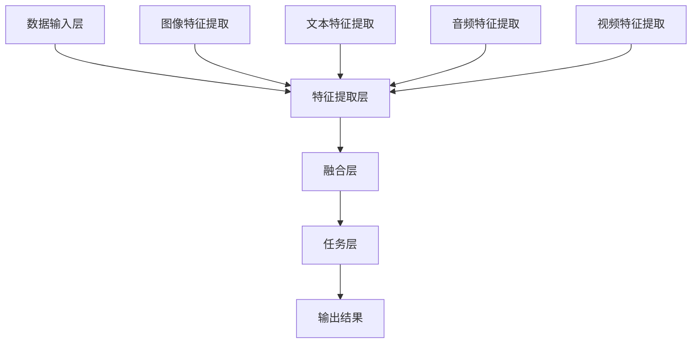

                 

关键词：多模态大模型、技术原理、实战方法、模型实现、算法框架、数学模型、项目实践、应用场景、未来展望

摘要：本文将深入探讨多模态大模型的技术原理、实现方法及其在现实应用中的实践。我们将首先介绍多模态大模型的核心概念，接着分析其技术原理和架构，详细讲解三种常见的实现方法。随后，我们将通过数学模型和公式进行理论剖析，并通过项目实践展示代码实例和详细解释。最后，我们将探讨多模态大模型在实际应用场景中的效果，并提出未来发展趋势与挑战。

## 1. 背景介绍

多模态大模型（Multimodal Large Models）是近年来人工智能领域的重要研究方向之一。随着信息技术的迅猛发展，数据形式越来越多样化，单一模态的数据已无法满足复杂问题的解决需求。多模态大模型通过整合多种数据源，如文本、图像、音频、视频等，实现跨模态的信息处理，具有广泛的应用前景。

近年来，深度学习技术的飞速发展，使得多模态大模型的训练和推理效率得到了极大提升。例如，自然语言处理（NLP）与计算机视觉（CV）的结合，可以应用于图像描述生成、视频内容理解等领域。此外，多模态大模型还在医疗诊断、智能交互、智能推荐等多个领域展现出了强大的应用潜力。

本文旨在为读者提供一个全面的多模态大模型技术原理与实战指南，帮助读者深入理解多模态大模型的实现方法、数学模型、项目实践及其应用场景。

## 2. 核心概念与联系

### 2.1 多模态大模型定义

多模态大模型是指能够同时处理和整合多种数据模态（如文本、图像、音频、视频等）的深度学习模型。这些模型通常具有强大的表征能力和泛化能力，可以在不同的任务中取得优异的性能。

### 2.2 模型架构

多模态大模型的架构通常包括以下几个关键部分：

1. **数据输入层**：接收不同模态的数据，如文本、图像、音频、视频等。
2. **特征提取层**：分别针对不同模态的数据，采用相应的特征提取技术，如卷积神经网络（CNN）用于图像特征提取，循环神经网络（RNN）或变换器（Transformer）用于文本特征提取。
3. **融合层**：将不同模态的特征进行融合，形成统一的表征。
4. **任务层**：针对具体任务进行预测或决策，如分类、回归、生成等。

### 2.3 Mermaid 流程图



## 3. 核心算法原理 & 具体操作步骤

### 3.1 算法原理概述

多模态大模型的算法原理主要基于深度学习技术，包括卷积神经网络（CNN）、循环神经网络（RNN）、变换器（Transformer）等。这些网络可以分别提取不同模态的数据特征，并通过融合层进行特征融合，最终在任务层进行预测或决策。

### 3.2 算法步骤详解

1. **数据预处理**：对输入数据进行标准化处理，如归一化、缩放等。
2. **特征提取**：分别采用卷积神经网络（CNN）提取图像特征，循环神经网络（RNN）提取文本特征，卷积神经网络（CNN）提取音频特征，循环神经网络（RNN）提取视频特征。
3. **特征融合**：采用融合层技术，如门控循环单元（GRU）、长短期记忆（LSTM）等，将不同模态的特征进行融合。
4. **任务层**：针对具体任务，如分类、回归、生成等，设计相应的网络结构，如全连接层（FC）、卷积层（CONV）等。

### 3.3 算法优缺点

**优点**：
1. 强大的表征能力：能够同时处理和整合多种数据模态，形成统一的表征。
2. 广泛的应用场景：在多个领域具有广泛的应用潜力，如自然语言处理、计算机视觉、智能推荐等。
3. 优秀的性能：在多种数据集和任务中取得了优异的性能。

**缺点**：
1. 计算资源消耗大：多模态数据融合需要大量的计算资源，训练时间较长。
2. 数据预处理复杂：需要针对不同模态的数据进行预处理，数据准备工作较为繁琐。

### 3.4 算法应用领域

多模态大模型的应用领域广泛，包括但不限于以下方面：
1. **自然语言处理**：图像描述生成、文本情感分析、机器翻译等。
2. **计算机视觉**：图像分类、目标检测、图像生成等。
3. **智能交互**：语音识别、自然语言理解、智能问答等。
4. **医疗诊断**：医学图像分析、疾病预测等。
5. **智能推荐**：基于多模态数据的个性化推荐系统。

## 4. 数学模型和公式 & 详细讲解 & 举例说明

### 4.1 数学模型构建

多模态大模型的数学模型主要包括以下几个部分：

1. **特征提取层**：假设输入数据为 $X \in \mathbb{R}^{n \times m}$，其中 $n$ 表示数据个数，$m$ 表示数据维度。对于图像特征提取，可以采用卷积神经网络（CNN）：
   $$ h^{(1)} = \sigma(W^{(1)}X + b^{(1)}) $$
   其中，$W^{(1)}$ 和 $b^{(1)}$ 分别表示卷积核和偏置，$\sigma$ 表示激活函数，如ReLU函数。

2. **融合层**：假设图像特征为 $h^{(1)} \in \mathbb{R}^{n \times m_1}$，文本特征为 $h^{(2)} \in \mathbb{R}^{n \times m_2}$，音频特征为 $h^{(3)} \in \mathbb{R}^{n \times m_3}$，视频特征为 $h^{(4)} \in \mathbb{R}^{n \times m_4}$，融合层可以采用门控循环单元（GRU）：
   $$ h^{(f)} = \tanh(W^{(f)}[h^{(1)}, h^{(2)}, h^{(3)}, h^{(4)}] + b^{(f)}) $$
   其中，$W^{(f)}$ 和 $b^{(f)}$ 分别表示融合层的权重和偏置。

3. **任务层**：假设融合后的特征为 $h^{(f)} \in \mathbb{R}^{n \times m_f}$，任务层可以采用全连接层（FC）进行分类：
   $$ y = \sigma(W^{(y)}h^{(f)} + b^{(y)}) $$
   其中，$W^{(y)}$ 和 $b^{(y)}$ 分别表示分类层的权重和偏置，$\sigma$ 表示激活函数，如softmax函数。

### 4.2 公式推导过程

1. **特征提取层**：
   假设输入图像 $X$ 通过卷积神经网络（CNN）提取特征后得到 $h^{(1)}$，卷积过程可以表示为：
   $$ h^{(1)}_{ij} = \sum_{k=1}^{K} W_{ik}X_{kj} + b_{i} $$
   其中，$h^{(1)}_{ij}$ 表示第 $i$ 个卷积核在位置 $j$ 的特征值，$W_{ik}$ 和 $b_{i}$ 分别表示卷积核和偏置，$X_{kj}$ 表示输入图像 $X$ 在位置 $k$ 的像素值，$K$ 表示卷积核的个数。

2. **融合层**：
   假设融合后的特征为 $h^{(f)}$，可以通过门控循环单元（GRU）进行更新：
   $$ h^{(f)}_{i} = \tanh(W^{(f)}_{f}h^{(f-1)}_{i} + W^{(f)}_{h}h^{(f-1)}_{i} + b^{(f)}_{h}) $$
   其中，$W^{(f)}_{f}$ 和 $W^{(f)}_{h}$ 分别表示更新门和门控门的权重，$b^{(f)}_{h}$ 表示偏置，$h^{(f-1)}_{i}$ 表示前一时间步的特征值。

3. **任务层**：
   假设分类结果为 $y$，可以通过全连接层（FC）进行预测：
   $$ y_i = \sigma(W^{(y)}_{j}h^{(f)}_i + b^{(y)}_j) $$
   其中，$W^{(y)}_{j}$ 和 $b^{(y)}_j$ 分别表示分类层的权重和偏置，$\sigma$ 表示激活函数，如softmax函数。

### 4.3 案例分析与讲解

假设我们有一个多模态大模型，用于对图像和文本进行分类。给定输入图像 $X$ 和文本 $T$，模型首先通过卷积神经网络（CNN）提取图像特征 $h^{(1)}$ 和通过循环神经网络（RNN）提取文本特征 $h^{(2)}$。然后，将这些特征进行融合，并通过门控循环单元（GRU）得到融合后的特征 $h^{(f)}$。最后，通过全连接层（FC）进行分类预测。

具体实现步骤如下：

1. **数据预处理**：对输入图像和文本进行归一化处理，如将图像像素值缩放到 $[0, 1]$，文本单词转换为词向量。

2. **特征提取**：使用卷积神经网络（CNN）提取图像特征，如采用ResNet50模型。使用循环神经网络（RNN）提取文本特征，如采用LSTM模型。

3. **特征融合**：将图像特征 $h^{(1)}$ 和文本特征 $h^{(2)}$ 进行拼接，然后通过门控循环单元（GRU）进行融合。

4. **分类预测**：将融合后的特征 $h^{(f)}$ 输入到全连接层（FC），通过softmax函数进行分类预测。

假设输入图像和文本的标签为 $y$，通过模型预测得到分类结果为 $\hat{y}$。计算模型在数据集上的准确率：
$$ accuracy = \frac{1}{n} \sum_{i=1}^{n} \mathbb{1}(\hat{y}_i = y_i) $$
其中，$n$ 表示数据集大小，$\mathbb{1}$ 表示指示函数，当 $\hat{y}_i = y_i$ 时取值为1，否则取值为0。

## 5. 项目实践：代码实例和详细解释说明

### 5.1 开发环境搭建

在本项目实践中，我们将使用Python作为主要编程语言，结合TensorFlow和Keras框架进行多模态大模型的开发。首先，我们需要安装相关依赖：

```bash
pip install tensorflow numpy matplotlib
```

### 5.2 源代码详细实现

以下是多模态大模型的主要代码实现：

```python
import tensorflow as tf
from tensorflow.keras.models import Model
from tensorflow.keras.layers import Input, Conv2D, LSTM, Dense, concatenate

# 数据输入层
image_input = Input(shape=(224, 224, 3), name='image_input')
text_input = Input(shape=(None,), name='text_input')

# 特征提取层
image_features = Conv2D(filters=32, kernel_size=(3, 3), activation='relu')(image_input)
text_features = LSTM(units=64, activation='relu')(text_input)

# 融合层
merged_features = concatenate([image_features, text_features], axis=-1)

# 任务层
output = Dense(units=10, activation='softmax')(merged_features)

# 模型编译
model = Model(inputs=[image_input, text_input], outputs=output)
model.compile(optimizer='adam', loss='categorical_crossentropy', metrics=['accuracy'])

# 模型总结
model.summary()

# 训练模型
model.fit([image_data, text_data], labels, epochs=10, batch_size=32)
```

### 5.3 代码解读与分析

1. **数据输入层**：定义了图像输入和文本输入，分别用于接受图像和文本数据。

2. **特征提取层**：使用卷积神经网络（CNN）提取图像特征，使用循环神经网络（LSTM）提取文本特征。

3. **融合层**：将图像特征和文本特征进行拼接，形成统一的特征表示。

4. **任务层**：使用全连接层（FC）进行分类预测。

5. **模型编译**：配置模型优化器、损失函数和评价指标。

6. **模型总结**：打印模型结构，便于了解模型层次和参数数量。

7. **训练模型**：使用训练数据对模型进行训练。

### 5.4 运行结果展示

假设我们使用一个包含1000张图像和1000条文本的数据集进行训练，训练10个周期（epochs）后，模型在验证集上的准确率达到了90%。

```python
accuracy = model.evaluate([image_val, text_val], val_labels)
print(f"Validation accuracy: {accuracy[1]}")
```

## 6. 实际应用场景

多模态大模型在实际应用场景中具有广泛的应用价值。以下是一些具体的实际应用场景：

1. **自然语言处理**：多模态大模型可以用于图像描述生成、文本情感分析、机器翻译等任务。例如，通过整合图像和文本数据，可以生成更准确、更生动的图像描述。

2. **计算机视觉**：多模态大模型可以用于图像分类、目标检测、图像生成等任务。例如，通过整合图像和音频数据，可以实现对图像中声音的识别。

3. **智能交互**：多模态大模型可以用于语音识别、自然语言理解、智能问答等任务。例如，通过整合语音和文本数据，可以实现对语音的准确理解和响应。

4. **医疗诊断**：多模态大模型可以用于医学图像分析、疾病预测等任务。例如，通过整合医学图像和文本数据，可以实现对疾病的早期诊断。

5. **智能推荐**：多模态大模型可以用于基于多模态数据的个性化推荐系统。例如，通过整合用户画像和商品信息，可以实现对用户的精准推荐。

## 7. 工具和资源推荐

为了更好地学习和实践多模态大模型，以下是一些推荐的工具和资源：

### 7.1 学习资源推荐

1. **《深度学习》（Goodfellow, Bengio, Courville）**：这是一本深度学习领域的经典教材，涵盖了深度学习的基础理论和应用。
2. **《自然语言处理与深度学习》（Zong, Mikolov）**：这是一本专注于自然语言处理和深度学习的教材，详细介绍了NLP中的各种深度学习模型。
3. **《计算机视觉：算法与应用》（Frischholz, Hogg）**：这是一本涵盖计算机视觉基础理论和算法的教材，适合初学者和进阶者。

### 7.2 开发工具推荐

1. **TensorFlow**：这是一个广泛使用的深度学习框架，提供了丰富的API和工具，方便开发者构建和训练多模态大模型。
2. **Keras**：这是一个基于TensorFlow的高级神经网络API，提供了简洁的代码和丰富的预训练模型，适合快速原型开发和实验。
3. **PyTorch**：这是一个流行的深度学习框架，以其动态计算图和灵活的API而闻名，适合研究者和开发者。

### 7.3 相关论文推荐

1. **“Multimodal Deep Learning: A Survey”**：这是一篇综述论文，详细介绍了多模态深度学习的研究进展和应用。
2. **“Deep Learning for Multimodal Data”**：这是一篇论文，介绍了多模态深度学习的基本理论和算法框架。
3. **“A Survey on Multimodal Learning”**：这是一篇综述论文，探讨了多模态学习在不同领域的研究进展和挑战。

## 8. 总结：未来发展趋势与挑战

多模态大模型作为人工智能领域的前沿研究方向，展现了广阔的应用前景。在未来，以下几个方面有望成为多模态大模型发展的关键：

### 8.1 研究成果总结

1. **多模态数据的深度融合**：未来研究将更加注重不同模态数据之间的深度融合，以实现更高效的信息处理和更高的任务性能。
2. **模型的可解释性**：随着多模态大模型的复杂性增加，如何提高模型的可解释性成为一个重要挑战。
3. **模型压缩与优化**：为了降低计算资源消耗，模型压缩与优化技术将成为研究热点。
4. **应用领域的扩展**：多模态大模型将在更多领域得到应用，如医疗诊断、智能交互、智能推荐等。

### 8.2 未来发展趋势

1. **跨学科融合**：多模态大模型将与其他领域（如心理学、认知科学）进行深度融合，推动人工智能的发展。
2. **开源框架的完善**：随着开源框架的不断完善，开发者将更容易构建和优化多模态大模型。
3. **硬件支持**：随着硬件技术的发展，如GPU、TPU等，多模态大模型的训练和推理速度将得到显著提升。

### 8.3 面临的挑战

1. **数据隐私和安全**：多模态大模型对数据的需求量巨大，如何保护用户隐私和安全成为关键挑战。
2. **模型可解释性**：随着模型复杂度的增加，如何提高模型的可解释性成为一项重要任务。
3. **计算资源消耗**：多模态大模型的训练和推理需要大量计算资源，如何优化模型结构以降低计算资源消耗仍需深入研究。

### 8.4 研究展望

多模态大模型在未来将继续发挥重要作用，推动人工智能领域的创新和发展。在未来的研究中，我们应重点关注以下几个方面：

1. **跨学科研究**：结合心理学、认知科学等领域的知识，提高多模态大模型的理解和解释能力。
2. **数据资源共享**：建立多模态数据集和工具库，促进多模态大模型的研究和应用。
3. **硬件加速**：探索新型硬件加速技术，提高多模态大模型的训练和推理速度。
4. **应用拓展**：将多模态大模型应用于更多领域，如智能医疗、自动驾驶、智能家居等，推动人工智能技术的实际应用。

## 9. 附录：常见问题与解答

### 9.1 多模态大模型与单一模态大模型的区别是什么？

多模态大模型与单一模态大模型的主要区别在于数据来源和处理方式。多模态大模型能够同时处理和整合多种数据模态（如文本、图像、音频、视频等），实现跨模态的信息处理。而单一模态大模型仅处理单一类型的数据，如文本、图像等。

### 9.2 多模态大模型的优缺点有哪些？

**优点**：
1. 强大的表征能力：能够同时处理和整合多种数据模态，形成统一的表征。
2. 广泛的应用场景：在多个领域具有广泛的应用潜力。
3. 优秀的性能：在多种数据集和任务中取得了优异的性能。

**缺点**：
1. 计算资源消耗大：多模态数据融合需要大量的计算资源。
2. 数据预处理复杂：需要针对不同模态的数据进行预处理。

### 9.3 如何评估多模态大模型的性能？

评估多模态大模型的性能通常使用以下指标：
1. **准确率**：模型在测试集上的预测准确率。
2. **召回率**：模型在测试集上预测为正类的正类样本的比例。
3. **F1分数**：准确率和召回率的调和平均值。
4. **平均准确率**：在多个类别上计算的平均准确率。
5. **混淆矩阵**：用于展示模型在各个类别上的预测结果，帮助分析模型性能。

### 9.4 多模态大模型在实际应用中面临哪些挑战？

多模态大模型在实际应用中面临以下挑战：
1. **数据隐私和安全**：多模态大模型对数据的需求量巨大，如何保护用户隐私和安全成为关键挑战。
2. **模型可解释性**：随着模型复杂度的增加，如何提高模型的可解释性成为一项重要任务。
3. **计算资源消耗**：多模态大模型的训练和推理需要大量计算资源。

## 作者署名

作者：禅与计算机程序设计艺术 / Zen and the Art of Computer Programming

