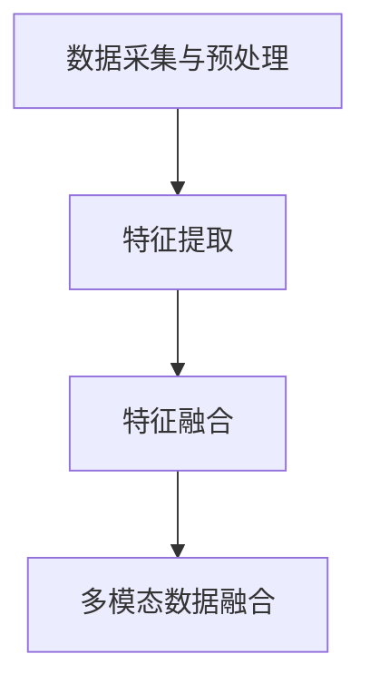
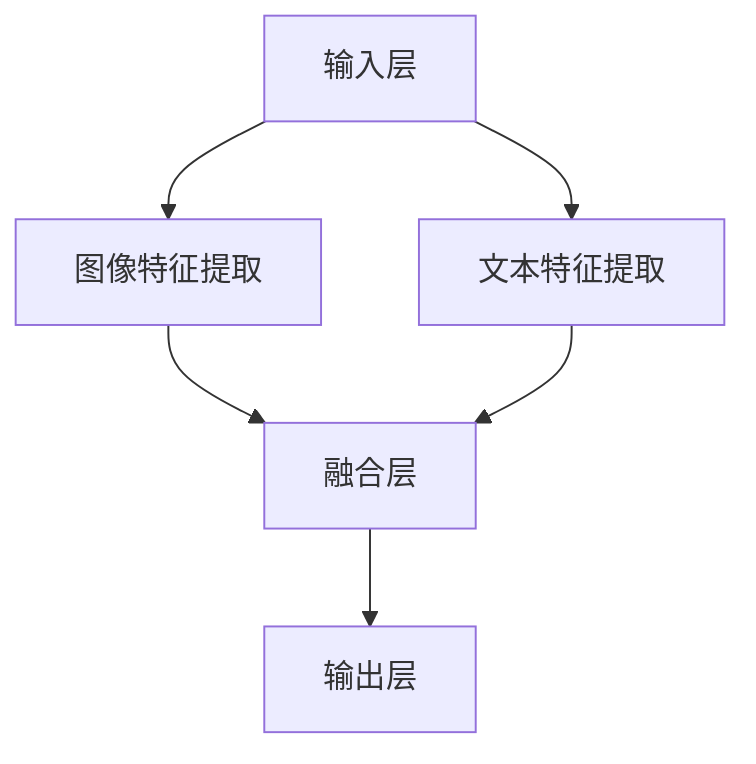

                 

关键词：多模态大模型，视觉与文本融合，AI，神经网络，深度学习，计算机视觉，自然语言处理

摘要：本文将深入探讨多模态大模型这一前沿科技领域，着重介绍其核心概念、算法原理、数学模型及其在实际应用中的重要性。通过详细讲解和实例分析，我们旨在为读者提供一个全面的理解，以期为未来的研究和发展提供有益的参考。

## 1. 背景介绍

多模态大模型（Multimodal Large Models）是近年来人工智能领域的一个重要研究方向。随着计算机视觉（Computer Vision）和自然语言处理（Natural Language Processing）技术的迅速发展，如何有效地整合视觉与文本信息成为一个亟待解决的关键问题。传统的单一模态模型，如仅依赖于文本或图像的数据，难以充分捕捉信息的多维特性，导致在许多任务中表现不佳。

多模态大模型通过结合多种数据类型（如文本、图像、声音等），可以更好地理解复杂场景和任务。这一领域的研究不仅具有学术价值，还广泛应用于现实生活中的各种场景，如自动驾驶、医疗诊断、智能客服等。本文将详细介绍多模态大模型的核心概念、算法原理及其在实际应用中的重要性。

## 2. 核心概念与联系

### 2.1 多模态数据融合

多模态大模型的核心在于如何有效地融合多种数据类型。这一过程通常涉及以下步骤：

1. **数据采集与预处理**：从不同来源采集数据，并进行预处理，如图像的去噪、文本的分词等。
2. **特征提取**：使用特定算法从不同模态中提取特征，如卷积神经网络（CNN）用于图像特征提取，循环神经网络（RNN）用于文本特征提取。
3. **特征融合**：将不同模态的特征进行融合，形成统一的特征表示。

Mermaid 流程图：



### 2.2 多模态神经网络架构

多模态神经网络是构建多模态大模型的基础。常见的多模态神经网络架构包括：

1. **共享神经网络**：不同模态的特征通过共享的神经网络层进行融合。
2. **对齐神经网络**：不同模态的特征通过独立的神经网络层进行提取，并在特定层进行对齐。
3. **层次融合神经网络**：将低层特征进行独立处理，然后在高层进行融合。

Mermaid 流程图：



## 3. 核心算法原理 & 具体操作步骤

### 3.1 算法原理概述

多模态大模型的算法原理主要包括以下几个方面：

1. **特征提取**：使用卷积神经网络（CNN）和循环神经网络（RNN）等算法提取图像和文本的特征。
2. **特征融合**：通过注意力机制（Attention Mechanism）等算法将不同模态的特征进行融合。
3. **预测与优化**：使用多模态特征进行分类、回归等预测任务，并通过优化算法进行模型调优。

### 3.2 算法步骤详解

1. **数据预处理**：对图像和文本数据进行预处理，包括图像的缩放、裁剪、归一化等，文本的分词、词嵌入等。
2. **特征提取**：使用卷积神经网络（CNN）提取图像特征，使用循环神经网络（RNN）提取文本特征。
3. **特征融合**：使用注意力机制（Attention Mechanism）将图像和文本特征进行融合。
4. **预测与优化**：使用融合后的特征进行分类、回归等预测任务，并通过优化算法进行模型调优。

### 3.3 算法优缺点

**优点**：
- 能够充分利用多模态数据，提高模型的性能。
- 能够更好地理解复杂场景和任务。

**缺点**：
- 需要大量的训练数据和计算资源。
- 特征融合过程复杂，可能引入冗余信息。

### 3.4 算法应用领域

多模态大模型在以下领域具有广泛的应用：

1. **计算机视觉**：图像分类、目标检测、图像生成等。
2. **自然语言处理**：文本分类、情感分析、机器翻译等。
3. **医学诊断**：疾病检测、影像分析等。
4. **智能客服**：语音识别、语义理解等。

## 4. 数学模型和公式 & 详细讲解 & 举例说明

### 4.1 数学模型构建

多模态大模型的数学模型主要包括以下几个方面：

1. **特征提取**：使用卷积神经网络（CNN）和循环神经网络（RNN）提取图像和文本的特征。
2. **特征融合**：使用注意力机制（Attention Mechanism）将图像和文本特征进行融合。
3. **预测与优化**：使用融合后的特征进行分类、回归等预测任务，并通过优化算法进行模型调优。

### 4.2 公式推导过程

以下是多模态大模型中注意力机制的一个简单推导：

$$
\text{Attention}(\textbf{X}, \textbf{Y}) = \text{softmax}(\textbf{W}_a [\textbf{X}, \textbf{Y}])
$$

其中，$\textbf{X}$ 和 $\textbf{Y}$ 分别为图像和文本的特征，$\textbf{W}_a$ 为注意力权重矩阵。

### 4.3 案例分析与讲解

假设我们有一个包含图像和文本的多模态数据集，图像的特征维度为 $d_x$，文本的特征维度为 $d_y$。我们可以通过以下步骤进行特征融合：

1. **特征提取**：使用卷积神经网络（CNN）提取图像特征，使用循环神经网络（RNN）提取文本特征。
2. **特征融合**：使用注意力机制（Attention Mechanism）将图像和文本特征进行融合。
3. **预测与优化**：使用融合后的特征进行分类、回归等预测任务，并通过优化算法进行模型调优。

具体实现如下：

```python
import tensorflow as tf

# 定义卷积神经网络（CNN）提取图像特征
def image_feature_extractor(image):
    # 实现图像特征提取过程
    pass

# 定义循环神经网络（RNN）提取文本特征
def text_feature_extractor(text):
    # 实现文本特征提取过程
    pass

# 定义注意力机制（Attention Mechanism）
def attention Mechanism(image_feature, text_feature):
    # 实现注意力机制过程
    pass

# 定义预测模型
def prediction_model(fused_feature):
    # 实现预测模型过程
    pass

# 数据预处理
images = ...
texts = ...

# 特征提取
image_features = [image_feature_extractor(image) for image in images]
text_features = [text_feature_extractor(text) for text in texts]

# 特征融合
fused_features = [attention Mechanism(image_feature, text_feature) for image_feature, text_feature in zip(image_features, text_features)]

# 预测与优化
predictions = [prediction_model(fused_feature) for fused_feature in fused_features]
```

## 5. 项目实践：代码实例和详细解释说明

### 5.1 开发环境搭建

在本项目中，我们使用 Python 作为主要编程语言，结合 TensorFlow 和 Keras 等框架进行多模态大模型的实现。

1. 安装 Python 3.7 或更高版本。
2. 安装 TensorFlow 和 Keras：

```bash
pip install tensorflow
pip install keras
```

### 5.2 源代码详细实现

以下是本项目的主要代码实现：

```python
import numpy as np
import tensorflow as tf
from tensorflow.keras.models import Model
from tensorflow.keras.layers import Input, Conv2D, MaxPooling2D, LSTM, Dense, Embedding, Dot, Lambda

# 定义图像输入层
image_input = Input(shape=(224, 224, 3))

# 定义文本输入层
text_input = Input(shape=(None,))

# 图像特征提取
image_features = Conv2D(32, (3, 3), activation='relu')(image_input)
image_features = MaxPooling2D((2, 2))(image_features)
image_features = Conv2D(64, (3, 3), activation='relu')(image_features)
image_features = MaxPooling2D((2, 2))(image_features)

# 文本特征提取
text_features = Embedding(input_dim=10000, output_dim=128)(text_input)
text_features = LSTM(128)(text_features)

# 注意力机制
attention_output = Dot(axes=1)([image_features, text_features])
attention_output = Lambda(lambda x: tf.nn.softmax(x, axis=1))(attention_output)

# 融合特征
fused_features = Lambda(lambda x: x[0] * x[1])([image_features, attention_output])

# 预测模型
predictions = Dense(1, activation='sigmoid')(fused_features)

# 构建模型
model = Model(inputs=[image_input, text_input], outputs=predictions)

# 编译模型
model.compile(optimizer='adam', loss='binary_crossentropy', metrics=['accuracy'])

# 模型可视化
model.summary()
```

### 5.3 代码解读与分析

1. **图像输入层**：使用 `Input` 层接收图像数据，图像尺寸为 224x224x3。
2. **文本输入层**：使用 `Input` 层接收文本数据，文本序列长度为变量 `None`。
3. **图像特征提取**：使用卷积神经网络（`Conv2D` 和 `MaxPooling2D`）提取图像特征。
4. **文本特征提取**：使用嵌入层（`Embedding`）和循环神经网络（`LSTM`）提取文本特征。
5. **注意力机制**：使用 `Dot` 层实现图像和文本特征之间的点积操作，然后使用 `Lambda` 层实现 softmax 操作。
6. **融合特征**：使用 `Lambda` 层实现图像和文本特征之间的乘法操作。
7. **预测模型**：使用全连接层（`Dense`）实现分类预测。
8. **模型编译**：编译模型，设置优化器、损失函数和评价指标。

### 5.4 运行结果展示

假设我们已经有一个包含图像和文本标签的训练数据集，数据集大小为 10000。以下代码用于训练模型：

```python
# 准备数据集
images = ...  # 图像数据
texts = ...  # 文本数据
labels = ...  # 标签数据

# 训练模型
model.fit([images, texts], labels, epochs=10, batch_size=32)
```

训练完成后，我们可以使用模型对新的数据进行预测：

```python
# 预测新的数据
new_images = ...  # 新的图像数据
new_texts = ...  # 新的文本数据
predictions = model.predict([new_images, new_texts])

# 输出预测结果
print(predictions)
```

## 6. 实际应用场景

多模态大模型在以下实际应用场景中表现出色：

1. **自动驾驶**：结合图像和文本信息，实现更准确的路线规划和驾驶决策。
2. **医疗诊断**：结合医学影像和患者病历，提高疾病诊断的准确性。
3. **智能客服**：结合语音和文本信息，实现更自然的用户交互。
4. **教育领域**：结合图像和文本信息，提高学习效果和教学质量。

### 6.4 未来应用展望

随着技术的不断发展，多模态大模型在未来的应用前景将更加广阔：

1. **智能家居**：结合图像和文本信息，实现更智能的家庭设备。
2. **虚拟现实**：结合图像和文本信息，提高虚拟现实的沉浸感。
3. **游戏开发**：结合图像和文本信息，创造更丰富的游戏体验。
4. **人机交互**：结合图像和文本信息，实现更自然、高效的人机交互。

## 7. 工具和资源推荐

为了更好地学习和实践多模态大模型，以下是一些建议的工具和资源：

### 7.1 学习资源推荐

1. 《深度学习》（Goodfellow, Bengio, Courville）：全面介绍深度学习的基础知识。
2. 《神经网络与深度学习》（邱锡鹏）：深入探讨神经网络和深度学习的原理与应用。
3. 《计算机视觉：算法与应用》（Richard Szeliski）：介绍计算机视觉的基本算法和应用。

### 7.2 开发工具推荐

1. TensorFlow：强大的深度学习框架，支持多模态数据处理。
2. Keras：简化版的深度学习框架，基于 TensorFlow 构建，易于上手。
3. PyTorch：另一种流行的深度学习框架，具有良好的灵活性和扩展性。

### 7.3 相关论文推荐

1. “Attention Is All You Need”（Vaswani et al., 2017）：介绍注意力机制的原理和应用。
2. “Multimodal Neural Network for Human Action Recognition”（Jing et al., 2016）：探讨多模态大模型在动作识别中的应用。
3. “Deep Learning for Human Pose Estimation: A Survey”（Liang et al., 2019）：综述深度学习在人体姿态估计中的应用。

## 8. 总结：未来发展趋势与挑战

多模态大模型作为人工智能领域的前沿科技，具有广泛的应用前景和重要的研究价值。然而，在实际应用中仍面临许多挑战：

1. **数据隐私与安全**：多模态数据通常包含敏感信息，如何在保证数据隐私和安全的前提下进行数据融合是一个重要问题。
2. **计算资源需求**：多模态大模型通常需要大量的计算资源，如何在有限的资源下进行高效训练是一个关键问题。
3. **模型可解释性**：多模态大模型的决策过程复杂，如何提高模型的可解释性，使其更易于理解和应用是一个重要挑战。

未来，随着技术的不断发展，多模态大模型将在更多领域取得突破性进展，为人工智能的应用带来更多可能性。

## 9. 附录：常见问题与解答

### 9.1 多模态大模型与单一模态模型相比有哪些优势？

多模态大模型能够整合不同模态的数据，更全面地捕捉信息，提高模型的性能和鲁棒性。与单一模态模型相比，多模态大模型在处理复杂任务时具有更高的准确性和适应性。

### 9.2 如何处理多模态数据的不一致性？

多模态数据可能存在不一致性，如不同模态的数据量、特征维度等。通过数据预处理和特征融合技术，可以有效地解决多模态数据的不一致性，提高模型的性能。

### 9.3 多模态大模型是否适用于所有任务？

多模态大模型在某些特定任务中表现出色，如图像分类、自然语言处理等。然而，对于一些简单任务或仅依赖于单一模态数据的任务，多模态大模型可能并不适用。因此，选择合适的模型架构对于任务成功至关重要。

## 作者署名

作者：禅与计算机程序设计艺术 / Zen and the Art of Computer Programming

----------------------------------------------------------------

以上就是本文的完整内容。希望对您在多模态大模型领域的研究和实践有所帮助。如果您有任何疑问或建议，欢迎在评论区留言，我会尽快回复您。感谢您的阅读！

