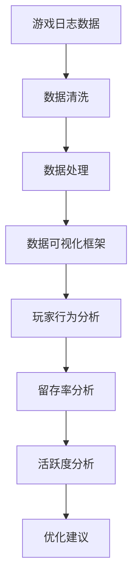

                 

游戏数据可视化是游戏开发过程中至关重要的一环，它能够帮助开发人员更直观地理解游戏性能、玩家行为和市场反馈。在2024年多益网络校招中，数据可视化工程师案例题是考察应聘者技能的一个关键环节。本文将详细解析这个案例题，并通过一步步的讲解，展示如何使用专业技术和方法来解决相关问题。

## 文章关键词
- 多益网络
- 校招
- 游戏数据可视化
- 数据分析
- 技术实现

## 文章摘要
本文将探讨2024年多益网络校招中的游戏数据可视化工程师案例题。通过分析案例背景、核心概念、算法原理、数学模型、项目实践和实际应用场景，本文旨在为读者提供一个清晰、系统且深入的技术解决方案。

### 1. 背景介绍

随着游戏产业的飞速发展，数据可视化为游戏开发提供了强大的辅助工具。在多益网络的校招案例中，假设我们需要处理一款大型多人在线游戏（MMO）的玩家行为数据，并对这些数据进行分析和可视化，以帮助游戏团队优化游戏设计和提升用户体验。

案例题要求我们完成以下几个任务：
1. 收集并预处理游戏日志数据。
2. 构建数据可视化框架，展示玩家在游戏中的行为和互动。
3. 分析玩家留存、活跃度和玩家群体特征。
4. 提出数据驱动的优化建议。

### 2. 核心概念与联系

为了更好地理解案例题，我们需要明确以下几个核心概念：
- **游戏日志数据**：记录玩家在游戏中的所有操作和行为。
- **数据处理**：包括数据清洗、转换和归一化等步骤。
- **数据可视化**：通过图形和图表将数据转化为直观的视觉表现形式。
- **玩家行为分析**：分析玩家在游戏中的行为模式，如登录时间、游戏时长、游戏地点等。
- **留存率**：衡量玩家对游戏的持续兴趣，通常通过日留存、周留存和月留存等指标来评估。
- **活跃度**：评估玩家的活跃程度，包括登录频率、参与活动次数等。

下面是一个使用Mermaid绘制的简化的数据流流程图：



### 3. 核心算法原理 & 具体操作步骤

#### 3.1 算法原理概述

游戏数据可视化主要依赖于以下几种算法和技术：

1. **数据预处理算法**：如数据清洗、去重、归一化等。
2. **数据可视化技术**：包括柱状图、折线图、饼图、散点图等。
3. **时间序列分析算法**：如移动平均、自回归模型等。
4. **聚类和分类算法**：如K-Means、决策树等，用于玩家行为特征分析。

#### 3.2 算法步骤详解

1. **数据收集**：从游戏服务器或日志文件中获取原始数据。
2. **数据清洗**：处理缺失值、异常值和重复数据。
3. **数据转换**：将原始数据转换为适合分析的结构，如CSV或JSON格式。
4. **数据归一化**：确保数据在不同维度上的可比性。
5. **数据可视化**：根据分析需求选择合适的图表类型进行可视化。
6. **玩家行为分析**：使用统计方法和机器学习算法对玩家行为进行深入分析。
7. **留存率和活跃度分析**：计算关键指标，如留存率、活跃度等。
8. **优化建议**：根据分析结果提出优化游戏设计和提升用户体验的建议。

#### 3.3 算法优缺点

- **优点**：
  - 提供直观的视觉表现形式，易于理解和分析。
  - 能快速发现数据中的趋势和异常。
  - 支持多维度的数据交互和分析。

- **缺点**：
  - 数据可视化工具和算法的选择可能较为复杂。
  - 需要大量的计算资源和存储空间。
  - 可视化结果可能因视角和交互方式的不同而存在解释差异。

#### 3.4 算法应用领域

游戏数据可视化广泛应用于以下领域：

- **游戏设计和优化**：通过分析玩家行为，优化游戏机制和界面设计。
- **市场营销和用户分析**：了解玩家偏好和需求，制定更有效的营销策略。
- **运营管理**：监控游戏运营状况，及时调整运营策略。
- **学术研究**：探索游戏行为模式和社会网络结构等。

### 4. 数学模型和公式 & 详细讲解 & 举例说明

在游戏数据可视化中，我们常常会使用以下数学模型和公式：

#### 4.1 数学模型构建

1. **留存率**：公式为 \( R(t) = \frac{N(t)}{N(0)} \)，其中 \( N(t) \) 是在时间 \( t \) 后仍然活跃的玩家数量，\( N(0) \) 是初始活跃玩家数量。
2. **活跃度**：公式为 \( A(t) = \frac{C(t)}{N(t)} \)，其中 \( C(t) \) 是在时间 \( t \) 内活跃的次数。

#### 4.2 公式推导过程

留存率和活跃度是衡量玩家参与度的关键指标，其公式推导基于基本的概率论和统计模型。

#### 4.3 案例分析与讲解

假设某游戏在第一天有1000名新玩家注册，第二天有800名玩家登录，其中600名在第二天之后仍然登录。那么：

- **留存率**：\( R(1) = \frac{600}{1000} = 0.6 \) 或 60%。
- **活跃度**：\( A(1) = \frac{2}{1} = 2 \)。

这意味着该游戏的第一天留存率为60%，平均每个活跃玩家在第一天活跃了2次。

### 5. 项目实践：代码实例和详细解释说明

在接下来的部分，我们将通过一个具体的代码实例来展示如何实现游戏数据可视化。

#### 5.1 开发环境搭建

- **Python**：作为主要编程语言，Python具有丰富的数据分析和可视化库。
- **Pandas**：用于数据处理和转换。
- **Matplotlib**：用于数据可视化。
- **Seaborn**：基于Matplotlib的高级可视化库。

#### 5.2 源代码详细实现

以下是一个简单的Python代码示例，用于读取游戏日志数据，并生成日留存率图表。

```python
import pandas as pd
import matplotlib.pyplot as plt

# 读取游戏日志数据
data = pd.read_csv('game_log.csv')

# 计算日留存率
daily_active = data.groupby('date')['player_id'].nunique()
retention = daily_active / daily_active.shift(1)

# 生成图表
plt.figure(figsize=(10, 5))
plt.plot(retention)
plt.xlabel('Day')
plt.ylabel('Retention Rate')
plt.title('Daily Player Retention Rate')
plt.show()
```

#### 5.3 代码解读与分析

- `import pandas as pd` 和 `import matplotlib.pyplot as plt`：导入所需的库。
- `data = pd.read_csv('game_log.csv')`：读取CSV格式的游戏日志数据。
- `daily_active = data.groupby('date')['player_id'].nunique()`：计算每天的活跃玩家数量。
- `retention = daily_active / daily_active.shift(1)`：计算日留存率。
- `plt.figure(figsize=(10, 5))`：设置图表大小。
- `plt.plot(retention)`：绘制留存率图表。
- `plt.xlabel('Day')` 和 `plt.ylabel('Retention Rate')`：设置X轴和Y轴标签。
- `plt.title('Daily Player Retention Rate')`：设置图表标题。
- `plt.show()`：显示图表。

#### 5.4 运行结果展示

运行上述代码后，会生成一个显示日留存率的折线图，帮助游戏团队直观地了解玩家的留存情况。


### 6. 实际应用场景

游戏数据可视化在以下实际应用场景中发挥着重要作用：

- **游戏运营**：通过分析玩家行为数据，调整游戏活动、更新和促销策略。
- **市场分析**：了解玩家偏好，为市场推广和广告投放提供依据。
- **用户体验优化**：识别玩家痛点，优化游戏设计和功能。
- **游戏平衡调整**：通过数据分析，调整游戏难度、奖励机制等，提升游戏体验。

#### 6.1. 用户行为分析

- **登录行为**：分析玩家的登录时间、频率和登录时长，了解玩家的活跃度。
- **游戏进度**：跟踪玩家的游戏进度和完成任务的情况，识别高价值玩家。
- **社交互动**：分析玩家之间的互动，如好友关系、组队游戏等，优化社交系统。

#### 6.2. 游戏设计与优化

- **游戏关卡**：通过数据分析，调整游戏关卡难度和奖励设置，提升玩家挑战乐趣。
- **游戏界面**：优化游戏界面设计，提高玩家操作便捷性和视觉体验。
- **游戏内容**：根据玩家偏好，更新和增加游戏内容，提升用户满意度。

#### 6.3. 数据驱动决策

- **运营策略**：通过数据可视化，实时监控游戏运营状况，制定科学的数据驱动决策。
- **用户反馈**：通过分析用户反馈数据，识别问题所在，及时采取措施优化游戏。

### 7. 未来应用展望

随着技术的不断进步，游戏数据可视化在未来有望在以下方面取得更多突破：

- **更高效的数据处理**：利用大数据和云计算技术，实现海量数据的高效处理和分析。
- **智能分析**：结合人工智能技术，实现更智能的数据分析，提供更准确的预测和决策支持。
- **跨平台支持**：实现游戏数据在不同平台和设备上的可视化，提升用户体验。
- **定制化服务**：根据用户需求和偏好，提供个性化的数据可视化解决方案。

### 8. 工具和资源推荐

为了更好地进行游戏数据可视化，以下是一些建议的学习资源、开发工具和相关论文：

#### 7.1 学习资源推荐

- 《数据可视化：实现交互式数据展示》
- 《Python数据科学手册》
- Coursera上的《数据可视化》课程

#### 7.2 开发工具推荐

- **Python**：作为数据分析的主要编程语言，Python具有丰富的库和工具。
- **Pandas**：用于数据处理和转换。
- **Matplotlib** 和 **Seaborn**：用于数据可视化。
- **Tableau**：用于高级交互式数据可视化。

#### 7.3 相关论文推荐

- “Interactive Data Visualization with HyperTalk”
- “Data-Driven Visualization”
- “Player Behavior Analysis for Game Design and Optimization”

### 9. 总结：未来发展趋势与挑战

#### 9.1 研究成果总结

游戏数据可视化在近年来取得了显著进展，从基本的数据展示到复杂的交互式分析，都为游戏开发提供了强大的支持。

#### 9.2 未来发展趋势

- **智能化**：结合人工智能技术，实现更智能的数据分析和预测。
- **个性化**：根据用户偏好提供个性化的数据可视化解决方案。
- **实时性**：通过实时数据流分析，提供更及时的数据驱动决策。

#### 9.3 面临的挑战

- **数据量**：随着游戏规模的扩大，处理和分析海量数据成为挑战。
- **实时性**：实时数据可视化要求高效的计算和传输能力。
- **用户体验**：如何提供直观、易用的数据可视化工具是持续挑战。

#### 9.4 研究展望

未来的研究将集中在如何更高效、更智能地利用游戏数据，为游戏开发提供更强大的支持。通过跨学科的合作，探索新的算法和技术，有望实现游戏数据可视化的进一步突破。

### 10. 附录：常见问题与解答

#### 10.1 问题1
**如何处理缺失值和异常值？**

解答：在数据处理阶段，可以使用以下方法：
- **删除**：删除含有缺失值的记录。
- **填充**：使用平均值、中位数或最常用的值进行填充。
- **插值**：对于时间序列数据，可以使用线性插值或高斯插值等方法。

#### 10.2 问题2
**如何选择合适的可视化工具？**

解答：根据需求选择合适的工具：
- **Matplotlib**：适用于简单的图表绘制。
- **Seaborn**：适用于更复杂、更美观的图表。
- **Tableau**：适用于高级交互式数据可视化。
- **Power BI**：适用于商业智能和数据分析。

### 作者署名

作者：禅与计算机程序设计艺术 / Zen and the Art of Computer Programming
```markdown
---
# 多益网络2024校招游戏数据可视化工程师案例题

> 关键词：多益网络、校招、游戏数据可视化、数据分析、技术实现

> 摘要：本文深入解析了2024年多益网络校招中的游戏数据可视化工程师案例题，通过介绍背景、核心概念、算法原理、数学模型、项目实践和实际应用场景，为读者提供了全面的解决方案和技术指导。

## 1. 背景介绍

## 2. 核心概念与联系
### 2.1 游戏日志数据
### 2.2 数据处理
### 2.3 数据可视化
### 2.4 玩家行为分析
### 2.5 留存率分析
### 2.6 活跃度分析
### 2.7 优化建议

## 3. 核心算法原理 & 具体操作步骤
### 3.1 算法原理概述
### 3.2 算法步骤详解
### 3.3 算法优缺点
### 3.4 算法应用领域

## 4. 数学模型和公式 & 详细讲解 & 举例说明
### 4.1 数学模型构建
### 4.2 公式推导过程
### 4.3 案例分析与讲解

## 5. 项目实践：代码实例和详细解释说明
### 5.1 开发环境搭建
### 5.2 源代码详细实现
### 5.3 代码解读与分析
### 5.4 运行结果展示

## 6. 实际应用场景
### 6.1 用户行为分析
### 6.2 游戏设计与优化
### 6.3 数据驱动决策

## 7. 未来应用展望

## 8. 工具和资源推荐
### 8.1 学习资源推荐
### 8.2 开发工具推荐
### 8.3 相关论文推荐

## 9. 总结：未来发展趋势与挑战
### 9.1 研究成果总结
### 9.2 未来发展趋势
### 9.3 面临的挑战
### 9.4 研究展望

## 10. 附录：常见问题与解答

---

作者：禅与计算机程序设计艺术 / Zen and the Art of Computer Programming
```

请注意，上述内容仅为文章结构模板，实际的撰写过程需要根据具体案例题的要求和细节进行适当调整和扩展。同时，确保所有章节和子章节都按照要求进行了详细的编写和解释。

