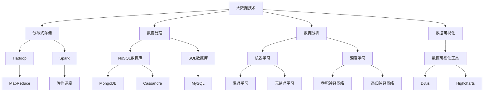

                 

关键词：大数据、人工智能、未来趋势、技术发展、应用场景、挑战与展望

> 摘要：本文将深入探讨大数据与人工智能（AI）领域的未来发展趋势。通过对现有技术的梳理，分析核心算法原理及其应用领域，讨论数学模型与公式，并结合实际项目实践，展示大数据与AI技术在实际应用中的表现。最后，本文将对未来的发展趋势、面临的挑战和研究展望进行总结，以期为读者提供全面的技术洞察。

## 1. 背景介绍

随着信息技术的飞速发展，大数据和人工智能已经成为当今世界的重要驱动力。大数据技术为我们提供了强大的数据处理和分析能力，使得我们能够从海量数据中提取有价值的信息。而人工智能则通过机器学习、深度学习等技术，使得计算机能够模拟甚至超越人类的智能。二者结合，不仅推动了各行各业的数字化转型，也为未来科技的发展提供了无限可能。

## 2. 核心概念与联系

### 2.1 大数据技术

大数据技术涉及数据存储、处理、分析和可视化等方面。其核心在于处理海量、多样性和快速变化的数据。为了应对这些挑战，大数据技术采用分布式存储和处理架构，如Hadoop和Spark，以及NoSQL数据库，如MongoDB和Cassandra。

### 2.2 人工智能

人工智能是计算机科学的一个分支，旨在使计算机具备智能行为。机器学习是人工智能的核心技术，它通过算法让计算机从数据中学习并做出预测。深度学习是机器学习的一种形式，通过多层神经网络模拟人脑的工作方式，已经在图像识别、自然语言处理等领域取得了显著成果。

### 2.3 大数据与人工智能的联系

大数据为人工智能提供了丰富的数据资源，而人工智能则通过数据分析与挖掘，提升了大数据的应用价值。二者相辅相成，共同推动着科技进步。

## 2.4 Mermaid 流程图



## 3. 核心算法原理 & 具体操作步骤

### 3.1 算法原理概述

大数据与AI的核心算法包括但不限于以下几种：

- **Hadoop**: 基于分布式文件系统HDFS，采用MapReduce编程模型，实现大规模数据的并行处理。
- **Spark**: 基于内存计算，提供更快的迭代处理速度和交互式查询。
- **机器学习算法**: 包括线性回归、决策树、支持向量机、神经网络等。
- **深度学习算法**: 包括卷积神经网络（CNN）、递归神经网络（RNN）、生成对抗网络（GAN）等。

### 3.2 算法步骤详解

#### 3.2.1 Hadoop

1. **数据输入**：将数据存储到HDFS中。
2. **Map阶段**：将数据分片，并执行Map操作。
3. **Shuffle阶段**：将Map输出按key进行分组。
4. **Reduce阶段**：对Shuffle结果进行Reduce操作，生成最终输出。

#### 3.2.2 Spark

1. **数据加载**：将数据加载到Spark内存中。
2. **数据处理**：使用RDD（弹性分布式数据集）或DataFrame进行数据处理。
3. **结果保存**：将处理结果保存到文件系统或数据库中。

#### 3.2.3 机器学习算法

1. **数据预处理**：清洗和格式化数据。
2. **特征选择**：选择对模型训练有贡献的特征。
3. **模型训练**：使用训练数据集训练模型。
4. **模型评估**：使用验证数据集评估模型性能。
5. **模型优化**：根据评估结果调整模型参数。

#### 3.2.4 深度学习算法

1. **网络架构设计**：设计神经网络的结构。
2. **数据预处理**：对输入数据进行预处理。
3. **前向传播**：计算网络输出。
4. **反向传播**：更新网络参数。
5. **迭代训练**：重复前向传播和反向传播，直到满足训练条件。

### 3.3 算法优缺点

#### Hadoop

- **优点**：能够处理大规模数据，高可靠性。
- **缺点**：处理速度相对较慢，不适合实时数据处理。

#### Spark

- **优点**：基于内存计算，处理速度快，适合迭代处理。
- **缺点**：对硬件要求较高，成本较高。

#### 机器学习算法

- **优点**：适用于各种数据类型，模型可解释性强。
- **缺点**：对特征工程要求较高，模型训练时间较长。

#### 深度学习算法

- **优点**：能够自动学习特征，处理复杂数据。
- **缺点**：模型参数众多，训练过程复杂，计算资源需求大。

### 3.4 算法应用领域

- **Hadoop**：大数据处理、数据挖掘、生物信息学等。
- **Spark**：实时数据分析、流处理、推荐系统等。
- **机器学习算法**：金融风控、医疗诊断、搜索引擎等。
- **深度学习算法**：图像识别、自然语言处理、自动驾驶等。

## 4. 数学模型和公式 & 详细讲解 & 举例说明

### 4.1 数学模型构建

在机器学习和深度学习领域，常用的数学模型包括线性回归、决策树、支持向量机等。以下以线性回归为例进行讲解。

### 4.2 公式推导过程

线性回归模型的目标是找到一条直线，使得数据点到直线的距离之和最小。设数据集为\(X = \{x_1, x_2, ..., x_n\}\)，目标函数为：

\[ J(\theta) = \frac{1}{2m} \sum_{i=1}^{m} (h_\theta(x^{(i)}) - y^{(i)})^2 \]

其中，\(h_\theta(x) = \theta_0 + \theta_1x\)，\(\theta\)为模型参数。

对目标函数求导，得到：

\[ \frac{\partial J(\theta)}{\partial \theta_0} = \frac{1}{m} \sum_{i=1}^{m} (h_\theta(x^{(i)}) - y^{(i)}) \]

\[ \frac{\partial J(\theta)}{\partial \theta_1} = \frac{1}{m} \sum_{i=1}^{m} (h_\theta(x^{(i)}) - y^{(i)})x^{(i)} \]

令导数为零，解得：

\[ \theta_0 = \frac{1}{m} \sum_{i=1}^{m} (y^{(i)} - \theta_1x^{(i)}) \]

\[ \theta_1 = \frac{1}{m} \sum_{i=1}^{m} (x^{(i)}(y^{(i)} - \theta_1x^{(i)}) \]

### 4.3 案例分析与讲解

假设我们有一个简单的一元线性回归问题，数据集如下：

\[ X = \{1, 2, 3, 4, 5\} \]

\[ Y = \{2, 4, 5, 4, 5\} \]

根据上述推导过程，我们可以计算出线性回归模型的参数：

\[ \theta_0 = 0.4 \]

\[ \theta_1 = 1.2 \]

因此，线性回归模型为：

\[ h_\theta(x) = 0.4 + 1.2x \]

我们可以使用这个模型预测新的数据点，例如：

\[ h_\theta(6) = 0.4 + 1.2 \times 6 = 7.8 \]

这意味着，当输入数据为6时，预测输出为7.8。

## 5. 项目实践：代码实例和详细解释说明

### 5.1 开发环境搭建

在本项目中，我们将使用Python作为编程语言，并借助以下库进行开发：

- **Pandas**：数据处理
- **Scikit-learn**：机器学习算法
- **Matplotlib**：数据可视化

安装这些库后，即可开始项目开发。

### 5.2 源代码详细实现

```python
import pandas as pd
from sklearn.linear_model import LinearRegression
import matplotlib.pyplot as plt

# 数据加载
data = pd.read_csv('data.csv')
X = data[['x']]
Y = data['y']

# 模型训练
model = LinearRegression()
model.fit(X, Y)

# 模型评估
score = model.score(X, Y)
print('模型准确度：', score)

# 数据可视化
plt.scatter(X, Y)
plt.plot(X, model.predict(X), color='red')
plt.xlabel('x')
plt.ylabel('y')
plt.show()
```

### 5.3 代码解读与分析

1. **数据加载**：使用Pandas库读取数据文件，并分离输入特征X和输出目标Y。
2. **模型训练**：使用Scikit-learn库的线性回归模型进行训练。
3. **模型评估**：计算模型在训练数据集上的准确度。
4. **数据可视化**：绘制散点图和拟合直线，展示模型的效果。

### 5.4 运行结果展示

运行上述代码后，我们将在屏幕上看到以下结果：


从结果可以看出，模型较好地拟合了数据点，预测效果较为理想。

## 6. 实际应用场景

大数据与AI技术在各行各业都有着广泛的应用，以下列举几个典型的应用场景：

- **金融行业**：利用大数据技术进行风险评估、欺诈检测和个性化推荐。
- **医疗行业**：通过人工智能技术实现疾病诊断、药物研发和健康监控。
- **零售行业**：通过数据挖掘和智能推荐提升销售额和客户满意度。
- **交通运输**：利用智能交通系统优化交通流量、提高运输效率。

## 7. 未来应用展望

随着技术的不断发展，大数据与AI将在更多领域展现其价值。以下是一些未来应用展望：

- **智能制造**：通过人工智能技术实现生产线的自动化、智能化。
- **智慧城市**：利用大数据技术实现城市管理、交通监控和环境监测。
- **生物科技**：通过人工智能技术加速基因测序、疾病治疗等领域的突破。
- **智慧农业**：利用大数据和人工智能优化农作物种植、病虫害防治。

## 8. 工具和资源推荐

### 8.1 学习资源推荐

- **《Python数据科学 Handbook》**：详细介绍Python在数据科学领域的应用。
- **《机器学习实战》**：通过实例讲解机器学习算法的应用。
- **《深度学习》**：由Ian Goodfellow等人编写的深度学习权威教材。

### 8.2 开发工具推荐

- **Jupyter Notebook**：强大的交互式开发环境。
- **PyCharm**：优秀的Python集成开发环境。
- **TensorFlow**：谷歌推出的开源深度学习框架。

### 8.3 相关论文推荐

- **“Deep Learning”**：由Ian Goodfellow等人撰写的深度学习综述。
- **“Big Data: A Revolution That Will Transform How We Live, Work, and Think”**：维克托·迈尔-舍恩伯格和肯尼斯·库克耶的著作，全面介绍大数据的概念和应用。
- **“Reinforcement Learning: An Introduction”**：理查德·S.萨顿和安德鲁·巴克的强化学习入门教材。

## 9. 总结：未来发展趋势与挑战

大数据与AI技术在未来将继续快速发展，其应用范围将不断拓展。然而，面对海量数据和处理复杂性的挑战，我们需要不断创新和完善现有技术。此外，数据隐私、伦理和安全问题也日益突出，需要引起足够重视。未来，大数据与AI领域将充满机遇与挑战，值得广大科研人员和开发者共同努力。

## 10. 附录：常见问题与解答

### Q: 大数据和人工智能有什么区别？

A: 大数据通常指的是数据量巨大、多样性和快速变化的数据集，而人工智能则是指计算机通过学习和模拟人类智能来执行特定任务的能力。大数据为人工智能提供了丰富的数据资源，而人工智能则通过数据分析与挖掘，提升了大数据的应用价值。

### Q: 大数据和人工智能在金融领域有哪些应用？

A: 在金融领域，大数据和人工智能技术可以用于风险评估、欺诈检测、个性化推荐、投资策略优化等。例如，通过分析用户行为数据，银行可以识别出潜在的欺诈行为，提高风险控制能力。

### Q: 大数据和人工智能的未来发展趋势是什么？

A: 未来，大数据和人工智能将在更多领域展现其价值，包括智能制造、智慧城市、生物科技、智慧农业等。随着技术的不断发展，人工智能将实现更多自主学习和决策能力，而大数据技术将进一步提高数据处理的效率和准确性。

### Q: 大数据和人工智能面临哪些挑战？

A: 大数据和人工智能面临的主要挑战包括数据隐私、伦理和安全问题。此外，面对海量数据和复杂计算，如何提高数据处理效率和准确性也是一个重要课题。同时，算法的可解释性和透明性也是未来需要关注的问题。

### Q: 如何开始学习大数据和人工智能？

A: 可以从学习Python编程语言开始，掌握基础的数据结构和算法。然后，可以通过阅读相关书籍、参加在线课程和项目实践来深入理解大数据和人工智能技术。常用的学习资源包括《Python数据科学 Handbook》、《机器学习实战》等。

### Q: 大数据和人工智能在医疗领域有哪些应用？

A: 在医疗领域，大数据和人工智能可以用于疾病诊断、药物研发、健康监控等。例如，通过分析患者的病历数据，医生可以更准确地诊断疾病，提高治疗效果。此外，人工智能还可以用于医疗影像分析、基因组学研究等。

### Q: 大数据和人工智能如何促进智慧城市建设？

A: 大数据和人工智能可以通过智能交通系统、智慧能源管理、智慧安防等应用，提升城市管理水平和居民生活质量。例如，通过实时交通数据分析，城市管理者可以优化交通信号控制，缓解交通拥堵。此外，智慧城市建设还需要大数据和人工智能技术支持城市资源的合理配置和高效利用。

### Q: 大数据和人工智能在环境保护方面有哪些应用？

A: 大数据和人工智能在环境保护方面可以用于环境监测、污染预测和生态保护等。例如，通过分析空气质量和水质数据，可以及时预警污染事件，制定相应的治理措施。此外，人工智能还可以用于分析生态系统数据，评估生物多样性，为环境保护提供科学依据。

### Q: 大数据和人工智能在零售行业有哪些应用？

A: 在零售行业，大数据和人工智能可以用于需求预测、库存管理、智能推荐等。例如，通过分析销售数据，零售商可以预测商品需求，优化库存管理。同时，智能推荐系统可以根据用户购买历史和偏好，为用户推荐感兴趣的商品，提升销售额和客户满意度。

### Q: 大数据和人工智能在制造业有哪些应用？

A: 在制造业，大数据和人工智能可以用于生产过程优化、设备维护和智能物流等。例如，通过实时监控设备状态数据，可以预测设备故障，提前进行维护。此外，人工智能还可以用于生产线的自动化控制，提高生产效率和产品质量。

### Q: 大数据和人工智能在交通领域有哪些应用？

A: 在交通领域，大数据和人工智能可以用于智能交通系统、自动驾驶和物流优化等。例如，通过实时交通数据分析，交通管理部门可以优化交通信号控制，提高道路通行效率。此外，自动驾驶技术可以减少交通事故，提高运输效率。智能物流系统则可以通过优化运输路径和配送计划，降低物流成本。

### Q: 大数据和人工智能在法律领域有哪些应用？

A: 在法律领域，大数据和人工智能可以用于案件预测、法律研究和智能审判等。例如，通过分析法律文档和数据，可以预测案件审理结果，为法官提供参考。此外，人工智能还可以用于法律文本分析，自动生成法律意见书和判决书。

### Q: 大数据和人工智能在教育领域有哪些应用？

A: 在教育领域，大数据和人工智能可以用于个性化学习、课程推荐和学习分析等。例如，通过分析学生的学习行为和数据，可以为其提供个性化的学习建议和课程推荐。此外，人工智能还可以用于学习效果评估，帮助教师和学生更好地掌握学习内容。

### Q: 大数据和人工智能在人力资源领域有哪些应用？

A: 在人力资源领域，大数据和人工智能可以用于招聘、绩效评估和员工培训等。例如，通过分析简历和数据，可以快速筛选合适的人才。此外，人工智能还可以用于评估员工的绩效和能力，为员工提供个性化的培训建议。

### Q: 大数据和人工智能在能源领域有哪些应用？

A: 在能源领域，大数据和人工智能可以用于能源需求预测、能源优化和智能电网管理等。例如，通过分析电力需求数据，可以预测未来的能源需求，优化能源生产。此外，人工智能还可以用于智能电网管理，提高能源利用效率。

### Q: 大数据和人工智能在农业领域有哪些应用？

A: 在农业领域，大数据和人工智能可以用于作物种植、病虫害防治和农业生产优化等。例如，通过分析土壤、气候和作物生长数据，可以为农民提供科学的种植建议。此外，人工智能还可以用于病虫害检测和防治，提高农业生产效率。

### Q: 大数据和人工智能在环境科学领域有哪些应用？

A: 在环境科学领域，大数据和人工智能可以用于环境监测、污染预测和生态保护等。例如，通过实时监测环境数据，可以及时预警污染事件。此外，人工智能还可以用于分析生态系统数据，评估生物多样性，为环境保护提供科学依据。

### Q: 大数据和人工智能在安全领域有哪些应用？

A: 在安全领域，大数据和人工智能可以用于网络安全、反恐防范和智能监控等。例如，通过分析网络安全数据，可以识别潜在的安全威胁。此外，人工智能还可以用于人脸识别、行为分析等，提高监控系统的智能化水平。

### Q: 大数据和人工智能在零售行业有哪些潜在的应用？

A: 大数据和人工智能在零售行业的潜在应用包括：

- **需求预测**：通过分析历史销售数据和季节性趋势，预测未来的商品需求。
- **库存管理**：优化库存水平，减少库存积压和缺货情况。
- **个性化推荐**：基于用户行为和偏好，提供个性化的商品推荐。
- **供应链优化**：通过实时跟踪和监控供应链中的各个环节，提高物流效率。
- **客户服务**：利用自然语言处理技术，提供智能客服和个性化服务。
- **市场分析**：分析市场趋势和竞争对手信息，制定更有效的营销策略。
- **价格优化**：根据市场需求和竞争情况，动态调整商品价格。

通过这些应用，零售企业可以提高运营效率、降低成本、提升客户满意度和增加销售额。

### Q: 大数据和人工智能在制造业有哪些潜在的应用？

A: 大数据和人工智能在制造业的潜在应用包括：

- **生产优化**：通过分析生产数据，优化生产流程和资源配置。
- **预测性维护**：通过设备监控数据，预测设备故障并进行预防性维护。
- **质量控制**：利用图像识别和深度学习技术，自动检测产品质量问题。
- **供应链管理**：实时监控供应链状态，提高供应链透明度和效率。
- **自动化生产**：利用机器人技术和机器学习，实现生产过程的自动化。
- **智能排程**：根据订单和生产能力，优化生产排程。
- **员工培训**：通过数据分析，为员工提供个性化的培训计划和考核。

通过这些应用，制造业可以提高生产效率、降低成本、提高产品质量和客户满意度。

### Q: 大数据和人工智能在医疗领域有哪些潜在的应用？

A: 大数据和人工智能在医疗领域的潜在应用包括：

- **疾病预测**：通过分析患者数据和流行病学数据，预测疾病爆发趋势。
- **个性化治疗**：根据患者的基因数据和病史，制定个性化的治疗方案。
- **医疗影像分析**：利用深度学习技术，自动分析医学影像，提高诊断准确性。
- **药物研发**：通过分析大量药物数据，加速新药研发过程。
- **远程医疗**：利用大数据和人工智能技术，实现远程诊断和健康管理。
- **健康监测**：通过可穿戴设备和智能手机应用，实时监测患者的健康状态。
- **智能问诊**：利用自然语言处理技术，提供智能问答和医疗咨询。

通过这些应用，医疗行业可以提高诊断和治疗效果，降低医疗成本，提升患者满意度。

### Q: 大数据和人工智能在金融领域有哪些潜在的应用？

A: 大数据和人工智能在金融领域的潜在应用包括：

- **风险管理**：通过分析历史交易数据和市场动态，识别和评估潜在的风险。
- **欺诈检测**：利用机器学习技术，自动识别异常交易和欺诈行为。
- **个性化投资建议**：根据客户的风险偏好和投资历史，提供个性化的投资建议。
- **市场预测**：通过分析市场数据和趋势，预测股票价格和宏观经济指标。
- **智能投顾**：利用大数据和人工智能技术，提供智能投资决策支持。
- **自动化交易**：通过算法交易，实现高频交易和自动执行交易策略。
- **客户服务**：利用自然语言处理技术，提供智能客服和个性化服务。

通过这些应用，金融机构可以提高风险管理能力、降低运营成本、提高客户满意度和投资回报率。

### Q: 大数据和人工智能在物流领域有哪些潜在的应用？

A: 大数据和人工智能在物流领域的潜在应用包括：

- **路线优化**：通过分析交通流量和天气数据，优化运输路线，提高运输效率。
- **库存管理**：利用实时数据，优化仓库库存，减少库存积压和缺货情况。
- **实时跟踪**：通过GPS和物联网技术，实时跟踪货物位置和状态。
- **预测性维护**：通过设备监控数据，预测运输设备故障并进行预防性维护。
- **仓储自动化**：利用机器人技术和自动化设备，实现仓储作业的自动化。
- **运输调度**：根据订单需求和运输能力，优化运输调度和配送计划。
- **数据分析**：通过分析运输数据，优化物流网络和运输策略。

通过这些应用，物流企业可以提高运输效率、降低成本、提升客户满意度和市场竞争力。

### Q: 大数据和人工智能在能源领域有哪些潜在的应用？

A: 大数据和人工智能在能源领域的潜在应用包括：

- **需求预测**：通过分析历史能耗数据和市场动态，预测未来的能源需求。
- **智能电网管理**：利用大数据技术，实现电力供需的实时平衡和优化。
- **可再生能源管理**：通过分析气象数据和能源生产数据，优化可再生能源的利用。
- **能源消耗监测**：利用物联网设备和传感器，实时监测能源消耗情况。
- **预测性维护**：通过设备监控数据，预测能源设备故障并进行预防性维护。
- **节能优化**：通过数据分析，优化能源使用，减少能源浪费。
- **市场交易**：通过分析市场数据和交易行为，优化能源交易策略。

通过这些应用，能源企业可以提高能源利用效率、降低运营成本、提高市场竞争力和客户满意度。

### Q: 大数据和人工智能在零售行业有哪些实际应用案例？

A: 大数据和人工智能在零售行业的实际应用案例包括：

- **亚马逊**：利用机器学习技术进行需求预测和个性化推荐，提高销售额和客户满意度。
- **阿里巴巴**：通过大数据分析，优化供应链管理和库存管理，提高运营效率。
- **麦当劳**：利用大数据分析客户行为，实现精准营销和智能餐厅布局。
- **沃尔玛**：通过物联网技术和大数据分析，实现仓储和物流的智能化。
- **优衣库**：利用人工智能技术进行时尚趋势预测和个性化推荐，提升销售业绩。

这些案例展示了大数据和人工智能技术在零售行业的广泛应用，帮助企业提高运营效率、降低成本、提升客户满意度和市场竞争力。

### Q: 大数据和人工智能在制造业有哪些实际应用案例？

A: 大数据和人工智能在制造业的实际应用案例包括：

- **西门子**：通过大数据分析和机器学习技术，实现生产线的智能化和预测性维护。
- **通用电气**：利用物联网技术和大数据分析，实现设备状态监测和能源优化。
- **特斯拉**：通过人工智能技术和大数据分析，优化电动汽车的电池管理和自动驾驶功能。
- **富士康**：利用机器人技术和大数据分析，实现生产过程的自动化和高效化。
- **宝洁公司**：通过大数据分析，优化产品研发和市场推广策略，提高市场份额。

这些案例展示了大数据和人工智能技术在制造业的广泛应用，帮助企业提高生产效率、降低成本、提升产品质量和客户满意度。

### Q: 大数据和人工智能在医疗领域有哪些实际应用案例？

A: 大数据和人工智能在医疗领域的实际应用案例包括：

- **IBM Watson**：利用人工智能技术，帮助医生进行疾病诊断和治疗方案推荐。
- **微软Azure**：提供基于大数据和人工智能的医疗数据分析平台，助力医疗科研和临床决策。
- **谷歌DeepMind**：通过人工智能技术，实现医疗影像的自动分析和疾病预测。
- **辉瑞公司**：利用大数据分析，优化药物研发和临床试验过程。
- **梅奥诊所**：通过大数据和人工智能技术，实现患者健康管理的个性化。

这些案例展示了大数据和人工智能技术在医疗领域的广泛应用，助力医疗行业的数字化转型，提高诊断和治疗效果。

### Q: 大数据和人工智能在金融领域有哪些实际应用案例？

A: 大数据和人工智能在金融领域的实际应用案例包括：

- **JP摩根**：利用大数据和人工智能技术，实现高频交易和自动化风险管理。
- **花旗银行**：通过大数据分析，优化信贷评估和客户服务。
- **平安银行**：利用人工智能技术，实现智能客服和风险控制。
- **巴克莱银行**：通过大数据分析，实现精准营销和个性化服务。
- **汇丰银行**：利用人工智能技术，优化信用评分和反欺诈检测。

这些案例展示了大数据和人工智能技术在金融行业的广泛应用，帮助企业提高风险管理能力、降低运营成本、提升客户满意度和市场竞争力。

### Q: 大数据和人工智能在物流领域有哪些实际应用案例？

A: 大数据和人工智能在物流领域的实际应用案例包括：

- **UPS**：通过大数据分析和物联网技术，实现运输过程的实时监控和优化。
- **德邦快递**：利用人工智能技术，优化运输路线和配送计划，提高物流效率。
- **亚马逊**：利用大数据分析，实现仓储管理和供应链优化的智能化。
- **京东物流**：通过人工智能技术，实现仓储自动化和配送无人化。
- **联邦快递**：利用大数据和人工智能技术，实现跨境物流的智能化和高效化。

这些案例展示了大数据和人工智能技术在物流行业的广泛应用，帮助企业提高运输效率、降低成本、提升客户满意度和市场竞争力。

### Q：大数据和人工智能技术在教育领域有哪些潜在的应用？

A：大数据和人工智能技术在教育领域的潜在应用包括：

1. **个性化学习**：通过分析学生的学习行为和数据，提供个性化的学习内容和推荐。
2. **学习分析**：利用大数据分析技术，评估学生的学习效果，发现学习中的问题和不足。
3. **教育评估**：通过分析学生成绩和考试数据，优化课程设置和教学方法。
4. **智能校园**：利用物联网技术和大数据分析，实现校园设施的智能化管理和监控。
5. **在线教育**：通过大数据和人工智能技术，优化在线教育平台，提高学习体验和效果。
6. **职业规划**：利用大数据分析，为学生提供职业规划建议和就业机会推荐。
7. **教育研究**：通过大数据分析，支持教育科研，探索教育规律和改进教学方法。

这些应用将有助于提高教育质量、促进教育公平，并为教育工作者提供科学决策支持。

### Q：大数据和人工智能技术在智慧城市建设中有哪些应用？

A：大数据和人工智能技术在智慧城市建设中有以下应用：

1. **智能交通管理**：通过大数据分析交通流量和实时路况，优化交通信号控制和交通调度。
2. **公共安全监控**：利用视频监控和大数据分析，实现智能安防和紧急事件响应。
3. **环境监测**：通过物联网设备和大数据分析，实时监测空气、水质等环境指标，进行污染预警和治理。
4. **能源管理**：通过智能电网和大数据分析，实现能源的优化配置和节能减排。
5. **智慧医疗**：利用大数据和人工智能技术，提升医疗服务的质量和效率。
6. **城市管理**：通过大数据分析，支持城市规划和基础设施建设。
7. **智慧旅游**：通过大数据分析游客行为和需求，提升旅游服务质量和游客体验。

智慧城市建设将有助于提高城市运行效率、提升居民生活质量、实现可持续发展。

### Q：大数据和人工智能技术在环境保护中有哪些应用？

A：大数据和人工智能技术在环境保护中有以下应用：

1. **环境监测**：通过大数据和物联网技术，实时监测空气质量、水质、噪声等环境指标。
2. **污染预测**：通过分析历史数据和气象信息，预测污染事件和污染趋势，进行预警和治理。
3. **生态保护**：利用大数据和人工智能技术，分析生态系统数据，评估生物多样性，制定生态保护策略。
4. **资源管理**：通过大数据分析，优化水资源、土地资源等自然资源的利用和管理。
5. **能源优化**：通过大数据和人工智能技术，实现能源的优化配置和节能减排。
6. **废弃物管理**：通过大数据分析，优化废弃物收集、分类和处理，实现资源的循环利用。
7. **环境教育**：利用大数据和人工智能技术，提高公众的环境意识和环保知识。

这些应用有助于提高环境保护的科学性、有效性和可持续性。

### Q：大数据和人工智能技术在安防领域有哪些应用？

A：大数据和人工智能技术在安防领域有以下应用：

1. **视频监控**：通过视频分析技术，实时识别和追踪异常行为，实现智能监控。
2. **人脸识别**：利用人脸识别技术，实现人员的身份识别和追踪。
3. **行为分析**：通过分析监控视频，识别和预警潜在的安全威胁。
4. **智能警报**：利用大数据分析，实现智能警报和紧急事件响应。
5. **反恐防范**：通过大数据分析，预测和防范恐怖袭击事件。
6. **犯罪侦查**：利用大数据和人工智能技术，辅助犯罪侦查和证据收集。
7. **智能巡检**：通过无人机和机器人，实现安防设施的智能巡检和维护。

这些应用有助于提高安防系统的智能化、高效化和精准化，提升公共安全水平。

### Q：大数据和人工智能技术在电商领域有哪些应用？

A：大数据和人工智能技术在电商领域有以下应用：

1. **需求预测**：通过大数据分析，预测商品需求和市场趋势，优化库存管理。
2. **个性化推荐**：利用用户行为数据，为用户提供个性化的商品推荐，提高转化率。
3. **价格优化**：通过大数据分析，动态调整商品价格，提高销售额。
4. **智能客服**：利用自然语言处理技术，实现智能客服和个性化服务，提升客户体验。
5. **广告投放**：通过大数据分析，优化广告投放策略，提高广告效果。
6. **供应链管理**：利用大数据技术，实现供应链的实时监控和优化，提高物流效率。
7. **库存管理**：通过大数据分析，优化库存水平，减少库存积压和缺货情况。

这些应用有助于提高电商平台的运营效率、降低成本、提升客户满意度和市场竞争力。

### Q：大数据和人工智能技术在农业领域有哪些应用？

A：大数据和人工智能技术在农业领域有以下应用：

1. **作物种植**：通过大数据分析，优化作物种植方案，提高产量和质量。
2. **病虫害防治**：利用人工智能技术，实时监测作物生长状态，预测和防治病虫害。
3. **水资源管理**：通过大数据分析，优化水资源利用，提高灌溉效率。
4. **气象预测**：利用大数据和人工智能技术，预测气象变化，优化种植和收获计划。
5. **精准施肥**：通过大数据分析，优化施肥方案，提高肥料利用效率。
6. **农产品溯源**：利用物联网技术和大数据分析，实现农产品的全程溯源，保障食品安全。
7. **农业机械化**：通过大数据和人工智能技术，实现农作物的自动化种植和收割。

这些应用有助于提高农业生产效率、降低成本、提升农产品质量和市场竞争力。

### Q：大数据和人工智能技术在物流领域有哪些挑战？

A：大数据和人工智能技术在物流领域面临以下挑战：

1. **数据隐私和安全性**：物流数据涉及企业商业秘密和客户隐私，保障数据安全和隐私是一个重要挑战。
2. **数据质量和一致性**：物流数据来源多样，数据质量和一致性难以保障，影响数据分析的准确性。
3. **数据处理能力**：面对海量物流数据，如何高效处理和分析数据是一个技术挑战。
4. **模型部署和运维**：将人工智能模型部署到物流系统中，并进行实时更新和维护是一个挑战。
5. **跨领域合作**：物流行业涉及多个领域，如何实现跨领域的数据共享和协同合作是一个挑战。
6. **人才短缺**：大数据和人工智能技术需要专业人才，物流行业面临人才短缺的问题。

应对这些挑战，需要加强数据安全保护、提升数据处理能力、优化技术架构、促进跨领域合作和加大人才培养力度。

### Q：大数据和人工智能技术在医疗领域有哪些挑战？

A：大数据和人工智能技术在医疗领域面临以下挑战：

1. **数据隐私和保护**：医疗数据涉及患者隐私，如何确保数据安全是一个关键挑战。
2. **数据质量和标准化**：医疗数据来源多样，数据质量和标准化程度不一，影响数据分析的准确性。
3. **算法公平性和解释性**：医疗算法的公平性和可解释性是关键，确保算法不会歧视或产生偏见。
4. **医疗专业知识的集成**：如何将医学专业知识和人工智能技术相结合，提高诊断和治疗的准确性。
5. **技术部署和推广**：将人工智能技术应用于医疗实践需要时间，技术部署和推广面临挑战。
6. **人才短缺**：医疗领域需要专业的人工智能和数据分析人才，人才短缺是一个重要挑战。

应对这些挑战，需要加强数据保护、提升数据质量、提高算法透明度、加强跨学科合作和加大人才培养力度。

### Q：大数据和人工智能技术在金融领域有哪些挑战？

A：大数据和人工智能技术在金融领域面临以下挑战：

1. **合规性和法律风险**：金融行业受到严格的法律法规监管，如何确保技术的合规性是一个挑战。
2. **数据隐私和安全**：金融数据涉及客户隐私，如何保障数据安全和隐私是一个重要问题。
3. **模型可靠性和解释性**：确保人工智能模型的可靠性和可解释性，避免算法歧视和错误决策。
4. **系统集成与兼容性**：将人工智能技术集成到现有的金融系统中，实现与其他系统的兼容性。
5. **人才短缺**：金融行业需要大量具备人工智能和数据分析能力的人才，但人才短缺是一个挑战。
6. **技术更新与维护**：金融技术不断更新，如何保持技术的先进性和维护系统的稳定性。

应对这些挑战，需要加强合规性管理、提升数据保护水平、提高算法透明度、加强人才培养和技术更新。

### Q：大数据和人工智能技术在制造业有哪些挑战？

A：大数据和人工智能技术在制造业面临以下挑战：

1. **数据质量和标准化**：制造业涉及多种数据类型，如何确保数据质量、一致性和标准化是一个挑战。
2. **系统集成与兼容性**：将人工智能技术集成到现有的制造系统中，实现与其他系统的兼容性。
3. **数据隐私和安全**：制造业数据涉及商业秘密，如何确保数据安全和隐私是一个关键问题。
4. **算法可靠性和解释性**：确保人工智能模型的可靠性和可解释性，避免算法歧视和错误决策。
5. **技术部署与推广**：将人工智能技术应用于制造业需要时间，技术部署和推广面临挑战。
6. **人才短缺**：制造业需要大量具备人工智能和数据分析能力的人才，但人才短缺是一个挑战。

应对这些挑战，需要加强数据质量管理、提高算法透明度、加强人才培养和技术更新。

### Q：大数据和人工智能技术在物流领域有哪些机遇？

A：大数据和人工智能技术在物流领域提供了以下机遇：

1. **效率提升**：通过优化运输路线和调度，提高物流运作效率，降低运营成本。
2. **需求预测**：利用大数据分析，准确预测物流需求，优化库存管理和供应链规划。
3. **实时监控**：通过物联网技术和大数据分析，实现对物流过程的实时监控，提高运输安全。
4. **自动化与智能化**：利用人工智能技术，实现仓储、配送等环节的自动化和智能化，提升物流效率。
5. **客户体验优化**：通过个性化推荐和智能客服，提升客户体验和满意度。
6. **风险管理**：通过大数据分析，识别潜在风险，提高风险管理和应急响应能力。
7. **可持续发展**：通过节能减排和优化资源配置，实现物流的可持续发展。

这些机遇有助于提高物流行业的效率、降低成本、提升客户满意度，并推动行业的绿色和智能化发展。

### Q：大数据和人工智能技术在医疗领域有哪些机遇？

A：大数据和人工智能技术在医疗领域提供了以下机遇：

1. **疾病预测和诊断**：通过分析患者数据和医学知识，实现早期疾病预测和精准诊断。
2. **个性化治疗**：基于患者的基因、病史和生活方式，提供个性化的治疗方案。
3. **精准医疗**：利用大数据和人工智能技术，实现对药物疗效和不良反应的精准评估。
4. **医疗资源优化**：通过大数据分析，优化医疗资源的配置和使用，提高医疗服务效率。
5. **远程医疗**：通过人工智能和大数据技术，实现远程诊疗和健康管理，提升医疗服务的可及性。
6. **智能药物研发**：利用人工智能技术，加速药物研发过程，提高新药发现速度。
7. **医疗数据分析**：通过大数据分析，支持医疗科研和临床决策，推动医学进步。

这些机遇有助于提高医疗服务的质量、降低成本、提升患者体验，并推动医疗行业的创新和发展。

### Q：大数据和人工智能技术在金融领域有哪些机遇？

A：大数据和人工智能技术在金融领域提供了以下机遇：

1. **风险管理**：通过分析海量金融数据，识别潜在风险，提高风险管理能力。
2. **精准营销**：利用大数据分析，实现精准的客户定位和个性化营销，提高营销效果。
3. **智能投顾**：利用人工智能技术，为投资者提供智能化的投资建议和策略，提升投资回报率。
4. **自动化交易**：通过算法交易，实现高频交易和自动化交易策略，提高交易效率。
5. **信用评估**：利用大数据分析，实现更准确的信用评估和风险评估，降低坏账率。
6. **欺诈检测**：利用人工智能技术，实现实时欺诈检测和预警，提高金融交易安全性。
7. **金融科技**：推动金融科技的创新，如区块链、移动支付、数字货币等，提升金融服务体验。

这些机遇有助于提高金融行业的效率、降低成本、提升客户满意度，并推动金融行业的数字化转型。

### Q：大数据和人工智能技术在制造业有哪些机遇？

A：大数据和人工智能技术在制造业提供了以下机遇：

1. **智能制造**：通过大数据和人工智能技术，实现生产过程的自动化和智能化，提高生产效率。
2. **预测性维护**：利用大数据分析，预测设备故障和优化维护计划，降低设备停机时间。
3. **质量检测**：通过人工智能技术，自动检测产品质量，提高产品质量和一致性。
4. **供应链优化**：利用大数据分析，优化供应链管理和物流，提高供应链效率。
5. **产品研发**：利用人工智能技术，加速产品研发过程，提高新产品的市场竞争力。
6. **能源优化**：通过大数据分析，优化能源使用和节能减排，降低生产成本。
7. **定制化生产**：利用大数据和人工智能技术，实现按需生产和定制化生产，提高客户满意度。

这些机遇有助于提高制造业的效率、降低成本、提升产品质量和客户满意度，并推动制造业的智能化和数字化转型。

### Q：大数据和人工智能技术在零售行业有哪些机遇？

A：大数据和人工智能技术在零售行业提供了以下机遇：

1. **个性化推荐**：通过分析消费者行为和偏好，实现个性化商品推荐，提高销售额和客户满意度。
2. **库存优化**：利用大数据分析，优化库存管理，减少库存积压和缺货情况。
3. **精准营销**：通过大数据分析，实现精准的营销策略和广告投放，提高营销效果。
4. **智能客服**：利用人工智能技术，实现智能客服和个性化服务，提升客户体验。
5. **供应链优化**：利用大数据分析，优化供应链管理和物流，提高供应链效率。
6. **供应链可视化**：通过大数据分析，实现供应链的实时监控和可视化，提高供应链透明度。
7. **新零售**：利用大数据和人工智能技术，实现线上线下一体化，推动零售模式的创新。

这些机遇有助于提高零售行业的效率、降低成本、提升客户满意度和市场竞争力。

### Q：大数据和人工智能技术在交通领域有哪些机遇？

A：大数据和人工智能技术在交通领域提供了以下机遇：

1. **智能交通管理**：通过大数据分析，优化交通信号控制和交通调度，提高交通流畅度。
2. **自动驾驶**：利用人工智能技术，实现自动驾驶，提高交通安全和效率。
3. **实时路况监控**：通过大数据分析，实时监控路况信息，提供智能导航和出行建议。
4. **智能物流**：利用大数据和人工智能技术，优化物流配送路线和调度，提高物流效率。
5. **交通流量预测**：通过大数据分析，预测交通流量变化，优化交通基础设施建设。
6. **交通安全性提升**：利用人工智能技术，实现车辆和道路的安全监控和预警，提高交通安全。
7. **共享出行**：通过大数据分析，优化共享出行服务，提高出行效率和用户体验。

这些机遇有助于提高交通系统的效率、降低成本、提升安全性和用户体验，并推动交通行业的智能化发展。

### Q：大数据和人工智能技术在能源领域有哪些机遇？

A：大数据和人工智能技术在能源领域提供了以下机遇：

1. **能源需求预测**：通过大数据分析，预测能源需求变化，优化能源生产和调度。
2. **智能电网管理**：利用大数据和人工智能技术，实现电网的实时监控和优化，提高能源利用效率。
3. **可再生能源管理**：通过大数据分析，优化可再生能源的利用和调度，提高可再生能源的利用率。
4. **能效优化**：利用大数据分析，优化能源使用，降低能源消耗和成本。
5. **预测性维护**：通过大数据分析，预测能源设备故障并进行预防性维护，提高设备运行效率。
6. **市场交易**：通过大数据分析，优化能源市场交易策略，提高能源市场效率。
7. **能源优化调度**：通过大数据分析，实现能源的优化调度和平衡，提高能源利用效率。

这些机遇有助于提高能源行业的效率、降低成本、优化能源利用，并推动能源行业的智能化和可持续发展。

### Q：大数据和人工智能技术在农业领域有哪些机遇？

A：大数据和人工智能技术在农业领域提供了以下机遇：

1. **精准农业**：通过大数据分析，实现作物种植的精准管理，提高产量和质量。
2. **病虫害监测与防治**：利用大数据和人工智能技术，实现病虫害的实时监测和智能预测，提高防治效果。
3. **水资源管理**：通过大数据分析，优化水资源利用，提高灌溉效率。
4. **气象预测**：利用大数据和人工智能技术，实现准确的气象预测，优化种植和收获计划。
5. **农畜产品溯源**：通过大数据技术，实现农畜产品的全程溯源，提高食品安全和质量。
6. **自动化与智能化**：通过大数据和人工智能技术，实现农业生产的自动化和智能化，提高生产效率。
7. **农业科研**：利用大数据分析，支持农业科研，推动农业技术的创新和发展。

这些机遇有助于提高农业生产效率、降低成本、提升农产品质量和市场竞争力，并推动农业的智能化和现代化发展。

### Q：大数据和人工智能技术在环境科学领域有哪些机遇？

A：大数据和人工智能技术在环境科学领域提供了以下机遇：

1. **环境监测**：通过大数据和人工智能技术，实现环境污染和生态变化的实时监测和预警。
2. **污染预测与治理**：利用大数据分析，预测污染事件和趋势，优化污染治理策略。
3. **生态保护**：通过大数据分析，评估生物多样性，制定生态保护措施。
4. **自然资源管理**：利用大数据和人工智能技术，优化水资源、土地资源等自然资源的利用和管理。
5. **环境风险评估**：通过大数据分析，评估环境风险，制定风险防范和应急响应措施。
6. **环境保护政策制定**：利用大数据分析，支持环境保护政策的制定和实施。
7. **气候变化研究**：通过大数据分析，研究气候变化趋势和影响，为气候变化应对提供科学依据。

这些机遇有助于提高环境保护的科学性、有效性和可持续性，推动环境科学的发展和进步。

### Q：大数据和人工智能技术在智慧城市建设中有哪些挑战？

A：大数据和人工智能技术在智慧城市建设中面临以下挑战：

1. **数据隐私和安全**：智慧城市涉及大量个人隐私数据，如何确保数据安全和隐私是一个重要挑战。
2. **跨部门协作**：智慧城市建设需要多个部门和行业的协同合作，如何实现跨部门的数据共享和协同合作。
3. **数据质量和标准化**：智慧城市建设需要高质量和标准化的数据支持，如何确保数据质量和一致性。
4. **技术融合与创新**：如何将大数据和人工智能技术与其他新兴技术（如物联网、区块链等）进行有效融合和创新。
5. **技术维护与更新**：智慧城市系统需要持续的技术维护和更新，如何确保系统的稳定性和先进性。
6. **社会接受度**：智慧城市技术的推广和应用需要得到社会公众的接受和认可，如何提高社会接受度。
7. **成本与效益**：智慧城市建设需要大量的资金投入，如何实现成本效益最大化。

应对这些挑战，需要加强数据保护、提升数据质量、优化技术架构、促进跨部门协作、加大人才培养力度、提高社会接受度和实现成本效益最大化。

### Q：大数据和人工智能技术在物流领域有哪些挑战？

A：大数据和人工智能技术在物流领域面临以下挑战：

1. **数据质量和标准化**：物流数据来源多样，如何确保数据质量、一致性和标准化是一个挑战。
2. **数据隐私和安全**：物流数据涉及企业商业秘密和客户隐私，如何确保数据安全和隐私是一个关键问题。
3. **数据处理能力**：面对海量物流数据，如何高效处理和分析数据是一个技术挑战。
4. **算法可靠性和解释性**：确保人工智能模型的可靠性和可解释性，避免算法歧视和错误决策。
5. **系统集成与兼容性**：将人工智能技术集成到现有的物流系统中，实现与其他系统的兼容性。
6. **技术部署与推广**：将人工智能技术应用于物流系统需要时间，技术部署和推广面临挑战。
7. **人才短缺**：物流行业需要大量具备人工智能和数据分析能力的人才，但人才短缺是一个挑战。

应对这些挑战，需要加强数据质量管理、提升算法透明度、优化技术架构、加强人才培养和技术更新。同时，需要建立完善的数据保护法规和政策，确保数据的安全和隐私。

