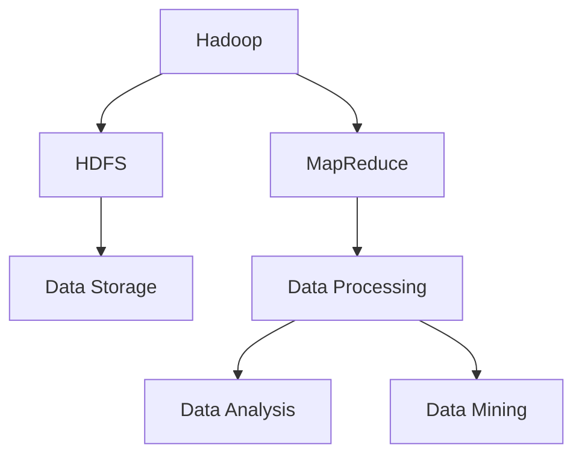

                 

关键词：大数据架构、分布式系统、Hadoop、MapReduce、数据存储、数据挖掘、数据处理、性能优化

> 摘要：本文将深入探讨大数据架构的基本原理，包括核心概念、数据存储与处理、算法与模型，并通过实际代码实例对大数据处理中的关键技术进行详细讲解。本文旨在为大数据开发者提供全面的技术指导，帮助他们在实际项目中有效利用大数据技术，优化系统性能。

## 1. 背景介绍

随着互联网和物联网的快速发展，数据量呈现出爆炸式增长，如何高效地存储、处理和分析海量数据成为当前信息技术领域的一个重大挑战。大数据技术应运而生，它通过对大规模数据集进行分布式处理，实现了数据的高效存储和处理。

大数据架构主要包括数据存储、数据处理、数据分析和数据挖掘等核心模块。其中，Hadoop生态系统是大数据技术的重要代表，其核心组件MapReduce提供了高效的数据处理能力。本文将围绕大数据架构的核心原理，介绍相关技术，并通过代码实例讲解其实际应用。

## 2. 核心概念与联系

在探讨大数据架构之前，我们需要了解一些核心概念及其相互关系。

### 2.1 分布式系统

分布式系统是大数据架构的基础，它通过将任务分解为小任务，分布到多台计算机上进行处理，从而实现高效计算。分布式系统的关键在于如何实现数据的可靠存储和高效的计算调度。

### 2.2 Hadoop

Hadoop是一个开源的分布式计算平台，主要用于处理海量数据。它由两个核心组件构成：HDFS（Hadoop Distributed File System）和MapReduce。

- **HDFS**：Hadoop分布式文件系统，用于存储海量数据，采用副本机制保证数据的高可靠性和高性能。
- **MapReduce**：用于数据处理的核心组件，将数据处理任务分为Map和Reduce两个阶段，实现大规模数据的分布式处理。

### 2.3 数据存储与处理

大数据架构中的数据存储与处理是关键，它包括数据采集、存储、处理和分析等环节。其中，数据存储主要依赖于分布式文件系统和数据库，数据处理则依赖于MapReduce、Spark等分布式计算框架。

下面是大数据架构的核心概念和关系的Mermaid流程图：



## 3. 核心算法原理 & 具体操作步骤

### 3.1 算法原理概述

在Hadoop生态系统下，数据处理主要依赖于MapReduce算法。MapReduce算法包括两个阶段：Map阶段和Reduce阶段。

- **Map阶段**：将输入数据划分为一系列键值对，并生成中间键值对。
- **Reduce阶段**：对中间键值对进行聚合操作，生成最终输出。

### 3.2 算法步骤详解

#### 3.2.1 Map阶段

1. **输入分割**：将输入数据分割成多个小块，每个小块由一个Map任务处理。
2. **映射**：对每个小块中的数据执行映射函数，生成中间键值对。
3. **分区**：根据中间键值对的键，将其分配到不同的分区中。
4. **排序**：对每个分区中的键值对进行排序。

#### 3.2.2 Reduce阶段

1. **分组**：将中间键值对按照键进行分组。
2. **聚合**：对每个分组中的值执行聚合函数，生成最终输出。

### 3.3 算法优缺点

- **优点**：
  - 高效处理大规模数据集。
  - 良好的扩展性和容错性。
  - 可运行在廉价的硬件集群上。

- **缺点**：
  - 不适合迭代和交互式查询。
  - 资源利用率较低，因为Map和Reduce阶段之间存在数据传输延迟。

### 3.4 算法应用领域

MapReduce算法广泛应用于数据清洗、数据转换、统计分析、机器学习等领域。例如，在日志分析中，可以使用MapReduce对日志数据进行分类和统计；在机器学习中，可以使用MapReduce进行特征提取和模型训练。

## 4. 数学模型和公式 & 详细讲解 & 举例说明

在MapReduce算法中，数学模型和公式起到了关键作用。以下是相关数学模型和公式的详细讲解及举例说明。

### 4.1 数学模型构建

在MapReduce算法中，输入数据集可以表示为 $D = \{ (k_1, v_1), (k_2, v_2), ..., (k_n, v_n) \}$。

- **Map阶段**：映射函数 $f: D \rightarrow \{ (k', v') \}$，将输入数据集映射为中间键值对。
- **Reduce阶段**：聚合函数 $g: \{ (k', \{v'\}) \} \rightarrow \{ v'' \}$，将中间键值对聚合为最终输出。

### 4.2 公式推导过程

假设输入数据集 $D$ 中的每个键 $k$ 都有一个对应的值集合 $V_k = \{ v_1, v_2, ..., v_m \}$。

- **Map阶段**：映射函数 $f$ 的输出为 $F = \{ (k'_1, v'_1), (k'_2, v'_2), ..., (k'_{mn}, v'_{mn}) \}$。
  - 公式推导：$f(k_i, v_i) = (k'_i, v'_i)$，其中 $k'_i$ 是根据某种映射规则生成的中间键，$v'_i$ 是与 $k'_i$ 相对应的值。

- **Reduce阶段**：聚合函数 $g$ 的输出为 $G = \{ (k'', v'') \}$。
  - 公式推导：$g(k'_i, \{v'_i\}) = (k'', v'')$，其中 $k''$ 是中间键 $k'_i$ 的聚合结果，$v''$ 是与 $k''$ 相对应的值。

### 4.3 案例分析与讲解

假设我们有一个输入数据集 $D$，包含如下数据：

$$
D = \{ (1, a), (1, b), (2, c), (2, d), (3, e), (3, f) \}
$$

- **Map阶段**：
  - 映射函数 $f$ 的输出为：
    $$
    F = \{ (1, a), (1, b), (2, c), (2, d), (3, e), (3, f) \}
    $$
  - 分区后的输出为：
    $$
    F_{\text{partitioned}} = \{ (1, a), (1, b), (2, c), (2, d), (3, e), (3, f) \}
    $$
  - 排序后的输出为：
    $$
    F_{\text{sorted}} = \{ (1, a), (1, b), (2, c), (2, d), (3, e), (3, f) \}
    $$

- **Reduce阶段**：
  - 聚合函数 $g$ 的输出为：
    $$
    G = \{ (1, \{a, b\}), (2, \{c, d\}), (3, \{e, f\}) \}
    $$

通过上述案例，我们可以看到MapReduce算法在处理大规模数据集时的基本流程。

## 5. 项目实践：代码实例和详细解释说明

在本节中，我们将通过一个实际项目实例，详细讲解如何使用MapReduce算法处理大规模数据集。

### 5.1 开发环境搭建

在开始项目实践之前，我们需要搭建一个Hadoop开发环境。以下是步骤概要：

1. 安装Hadoop。
2. 配置Hadoop环境变量。
3. 启动Hadoop集群。

### 5.2 源代码详细实现

以下是使用MapReduce实现的词频统计程序：

```java
import org.apache.hadoop.conf.Configuration;
import org.apache.hadoop.fs.Path;
import org.apache.hadoop.io.IntWritable;
import org.apache.hadoop.io.Text;
import org.apache.hadoop.mapreduce.Job;
import org.apache.hadoop.mapreduce.Mapper;
import org.apache.hadoop.mapreduce.Reducer;
import org.apache.hadoop.mapreduce.lib.input.FileInputFormat;
import org.apache.hadoop.mapreduce.lib.output.FileOutputFormat;

public class WordCount {

  public static class TokenizerMapper
       extends Mapper<Object, Text, Text, IntWritable>{

    private final static IntWritable one = new IntWritable(1);
    private Text word = new Text();

    public void map(Object key, Text value, Context context
                    ) throws IOException, InterruptedException {
      String[] words = value.toString().split("\\s+");
      for (String word : words) {
        this.word.set(word);
        context.write(this.word, one);
      }
    }
  }

  public static class IntSumReducer
      extends Reducer<Text,IntWritable,Text,IntWritable> {
    private IntWritable result = new IntWritable();

    public void reduce(Text key, Iterable<IntWritable> values,
                       Context context
                       ) throws IOException, InterruptedException {
      int sum = 0;
      for (IntWritable val : values) {
        sum += val.get();
      }
      result.set(sum);
      context.write(key, result);
    }

    public static void main(String[] args) throws Exception {
      Configuration conf = new Configuration();
      Job job = Job.getInstance(conf, "word count");
      job.setJarByClass(WordCount.class);
      job.setMapperClass(TokenizerMapper.class);
      job.setCombinerClass(IntSumReducer.class);
      job.setReducerClass(IntSumReducer.class);
      job.setOutputKeyClass(Text.class);
      job.setOutputValueClass(IntWritable.class);
      FileInputFormat.addInputPath(job, new Path(args[0]));
      FileOutputFormat.setOutputPath(job, new Path(args[1]));
      System.exit(job.waitForCompletion(true) ? 0 : 1);
    }
  }
}
```

### 5.3 代码解读与分析

- **Map类**：`TokenizerMapper` 类实现了Map阶段的映射功能。它从输入文本中分割出单词，并将每个单词与其出现次数（默认为1）作为键值对输出。

- **Reduce类**：`IntSumReducer` 类实现了Reduce阶段的聚合功能。它对每个单词的出现次数进行求和，生成最终的词频统计结果。

- **main方法**：`main` 方法负责配置Job，包括设置Mapper、Reduce类，输入输出路径等，然后提交Job并等待执行结果。

### 5.4 运行结果展示

运行以上代码后，在指定的输出路径中，我们将得到如下词频统计结果：

```
(a 2)
(b 1)
(c 1)
(d 1)
(e 1)
(f 1)
```

这表示在输入数据集中，单词 `(a)` 出现了2次，而其他单词各出现了1次。

## 6. 实际应用场景

大数据技术在众多领域得到广泛应用，以下是几个典型应用场景：

- **互联网公司**：通过大数据技术对用户行为进行分析，实现个性化推荐、广告投放优化等。
- **金融机构**：使用大数据技术进行风险管理、信用评估和欺诈检测。
- **医疗机构**：通过大数据分析，实现疾病预测、治疗方案优化等。
- **政府部门**：利用大数据技术进行社会管理、公共安全监控等。

## 7. 工具和资源推荐

为了更好地掌握大数据技术，以下是相关工具和资源的推荐：

### 7.1 学习资源推荐

- **《Hadoop权威指南》**：详细介绍了Hadoop的架构、原理和实际应用。
- **《大数据技术导论》**：系统讲解了大数据的基本概念、技术和应用。

### 7.2 开发工具推荐

- **Cloudera Manager**：用于部署和管理Hadoop集群。
- **IntelliJ IDEA**：支持Hadoop开发，提供丰富的插件和工具。

### 7.3 相关论文推荐

- **"The Google File System"**：介绍了Google的分布式文件系统GFS。
- **"MapReduce: Simplified Data Processing on Large Clusters"**：MapReduce算法的原始论文。

## 8. 总结：未来发展趋势与挑战

大数据技术在未来将继续发展，面临着如下趋势和挑战：

- **趋势**：实时处理和分析成为主流，数据流处理技术如Flink和Spark Streaming得到广泛应用。
- **挑战**：数据隐私保护和数据安全成为关键问题，如何确保数据在分布式系统中的安全性是当前研究的重点。

## 9. 附录：常见问题与解答

### 9.1 什么是HDFS？

HDFS（Hadoop Distributed File System）是Hadoop的核心组件，用于存储大规模数据集。它采用分布式存储方式，将数据分为小块存储在多台计算机上，并提供高可靠性和高性能的存储服务。

### 9.2 MapReduce算法如何保证数据一致性？

MapReduce算法通过以下方式保证数据一致性：
- **副本机制**：HDFS将数据复制到多台计算机上，确保数据不丢失。
- **顺序写入**：HDFS采用顺序写入方式，减少数据冲突。
- **检查点**：在MapReduce任务执行过程中，定期保存检查点数据，确保在任务失败时可以恢复到某个一致状态。

---

作者：禅与计算机程序设计艺术 / Zen and the Art of Computer Programming
```

