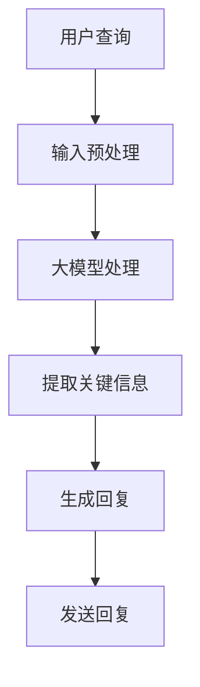

                 

关键词：大模型、Agent、人工智能、深度学习、自然语言处理、多模态交互、智能决策

> 摘要：本文将探讨大模型与Agent之间的紧密关系，分析大模型在提升Agent智能能力方面所发挥的关键作用。文章首先介绍了大模型和Agent的基本概念，然后通过具体的实例和流程图，阐述了大模型在Agent设计、训练和应用中的关键作用。最后，本文提出了大模型与Agent在未来的发展方向和面临的挑战。

## 1. 背景介绍

随着深度学习技术的不断进步，大规模预训练模型（即大模型）已经在自然语言处理、计算机视觉、语音识别等众多领域取得了显著的成果。这些大模型具备极强的特征提取能力和泛化能力，能够处理复杂的任务和数据集。与此同时，智能Agent作为人工智能领域的一个重要研究方向，旨在实现具有自主决策能力的智能体。智能Agent的发展离不开对环境的感知、理解和行动，而大模型的引入为Agent的智能化提供了强有力的支持。

本文旨在探讨大模型与Agent之间的关系，分析大模型在提升Agent智能能力方面的关键作用。首先，我们将介绍大模型和Agent的基本概念；然后，通过具体的实例和流程图，阐述大模型在Agent设计、训练和应用中的关键作用；最后，本文将探讨大模型与Agent在未来的发展方向和面临的挑战。

## 2. 核心概念与联系

### 2.1 大模型

大模型通常指的是参数规模达到数十亿甚至数万亿级别的神经网络模型。这些模型通过大规模的数据集进行训练，能够在多种任务上达到优异的性能。例如，BERT、GPT、ViT等都是具有代表性的大模型。大模型的显著特点是参数多、层次深、数据量大，这使得它们在特征提取和泛化能力方面具有优势。

### 2.2 Agent

Agent是一种能够感知环境、做出决策并采取行动的人工智能实体。在人工智能系统中，Agent被视为一种独立的实体，它可以对环境中的信息进行收集、分析和处理，并自主地制定行动策略。Agent通常具有以下特点：

1. **自主性**：Agent能够自主地完成特定的任务，无需人工干预。
2. **适应性**：Agent能够根据环境的变化调整自己的行为策略。
3. **协作性**：多个Agent可以协同工作，共同完成复杂的任务。

### 2.3 大模型与Agent的关系

大模型与Agent之间存在紧密的联系。大模型为Agent提供了强大的计算能力和知识储备，使得Agent能够在复杂的环境中做出更加准确的决策。具体来说，大模型在以下几个方面对Agent起到关键作用：

1. **知识获取**：大模型通过大规模的数据集进行训练，能够获取丰富的知识，这些知识可以为Agent提供决策支持。
2. **特征提取**：大模型具备强大的特征提取能力，可以提取出数据中的关键信息，为Agent提供更加精准的环境感知。
3. **决策优化**：大模型在复杂的决策问题中具有优势，可以为Agent提供高效的决策策略。

下面，我们将通过一个具体的实例来展示大模型与Agent之间的联系。

### 2.4 实例分析：大模型在智能客服中的应用

以智能客服为例，大模型可以显著提升智能客服的响应速度和准确度。智能客服Agent需要具备良好的自然语言处理能力，以便理解和回复用户的查询。在这个过程中，大模型发挥了关键作用：

1. **知识获取**：大模型通过大规模的语料库进行训练，掌握了丰富的知识，可以为客服Agent提供知识支持。例如，当用户询问产品价格时，大模型可以快速提供准确的价格信息。
   
2. **特征提取**：大模型能够从用户的查询语句中提取关键信息，例如关键词、情感等。这些信息可以帮助客服Agent更好地理解用户的需求，并提供个性化的服务。
   
3. **决策优化**：大模型在复杂的查询问题中具备强大的决策能力。当用户提出复杂的问题时，大模型可以快速分析问题，并提供最优的解决方案。

为了更直观地展示大模型与Agent之间的关系，我们使用Mermaid流程图来描述智能客服Agent的工作流程。

### 2.5 Mermaid流程图



在上面的流程图中，用户查询首先经过输入预处理，然后输入到大模型中进行处理。大模型提取关键信息并生成回复，最后将回复发送给用户。通过这个流程图，我们可以清晰地看到大模型在智能客服Agent中的关键作用。

## 3. 核心算法原理 & 具体操作步骤

### 3.1 算法原理概述

大模型在提升Agent智能能力的过程中，主要依赖于以下几个核心算法：

1. **预训练**：大模型通过在大量数据集上进行预训练，学习到通用特征和知识，从而提高模型在多种任务上的性能。
2. **微调**：在特定任务上，大模型通过微调来适应具体场景，进一步提高模型的性能。
3. **强化学习**：大模型与强化学习结合，使Agent能够在动态环境中进行学习，优化决策策略。

### 3.2 算法步骤详解

#### 3.2.1 预训练

1. **数据集准备**：选择具有代表性的大规模数据集，例如语料库、图像数据集等。
2. **模型初始化**：初始化一个具有大规模参数的网络结构，例如BERT、GPT等。
3. **训练过程**：在大规模数据集上进行训练，不断优化模型参数，提高模型在数据集上的性能。

#### 3.2.2 微调

1. **任务定义**：定义具体的任务，例如文本分类、图像识别等。
2. **数据集准备**：准备用于微调的任务数据集。
3. **模型微调**：在任务数据集上对大模型进行微调，优化模型在特定任务上的性能。

#### 3.2.3 强化学习

1. **环境定义**：定义Agent需要执行的任务环境。
2. **初始策略**：初始化Agent的初始策略。
3. **学习过程**：通过不断与环境交互，利用大模型进行决策，优化Agent的策略。

### 3.3 算法优缺点

#### 优点

1. **强大的特征提取能力**：大模型通过大规模数据集进行预训练，具备强大的特征提取能力，能够处理复杂的任务。
2. **高效的决策能力**：大模型在复杂的决策问题中具有优势，能够提供高效的决策策略。
3. **良好的泛化能力**：大模型在多种任务上表现出良好的泛化能力，能够在不同的场景中发挥重要作用。

#### 缺点

1. **计算资源消耗大**：大模型的训练和推理需要大量的计算资源和时间。
2. **数据依赖性强**：大模型的效果很大程度上依赖于训练数据的质量和规模，如果数据存在偏差，可能会导致模型性能下降。
3. **可解释性差**：大模型的内部结构和决策过程较为复杂，难以进行解释，这在某些应用场景中可能带来一定的风险。

### 3.4 算法应用领域

大模型在多个领域都取得了显著的应用成果，包括但不限于：

1. **自然语言处理**：大模型在文本分类、机器翻译、问答系统等任务中表现出色。
2. **计算机视觉**：大模型在图像分类、目标检测、图像生成等任务中具有优势。
3. **语音识别**：大模型在语音识别任务中能够显著提高识别准确率。
4. **游戏AI**：大模型在游戏AI中能够实现更加智能化的决策策略。

## 4. 数学模型和公式 & 详细讲解 & 举例说明

### 4.1 数学模型构建

大模型通常采用神经网络作为基本结构，主要包括以下几个部分：

1. **输入层**：接收外部输入，例如文本、图像、声音等。
2. **隐藏层**：对输入数据进行特征提取和变换，通常包含多个隐藏层。
3. **输出层**：根据隐藏层的信息生成预测结果。

在神经网络中，常用的激活函数包括Sigmoid、ReLU、Tanh等。此外，正则化方法（如Dropout、权重衰减等）也被广泛应用于神经网络，以提高模型的泛化能力。

### 4.2 公式推导过程

以一个简单的多层感知机（MLP）为例，其数学模型如下：

$$
y = f(W_{out} \cdot f(W_{hid} \cdot f(W_{in} \cdot x + b_{in}) + b_{hid}) + b_{out})
$$

其中，$x$为输入数据，$y$为输出结果，$W_{in}$、$W_{hid}$和$W_{out}$分别为输入层、隐藏层和输出层的权重矩阵，$b_{in}$、$b_{hid}$和$b_{out}$分别为各层的偏置向量，$f$为激活函数。

对于多层感知机，通常采用梯度下降法进行参数优化。其目标是最小化损失函数：

$$
J = \frac{1}{m} \sum_{i=1}^{m} (y_i - \hat{y_i})^2
$$

其中，$m$为样本数量，$y_i$为实际标签，$\hat{y_i}$为预测结果。

### 4.3 案例分析与讲解

以一个文本分类任务为例，说明大模型在模型构建、训练和优化过程中的应用。

#### 模型构建

1. **输入层**：输入为文本数据，经过预处理后转化为向量表示。
2. **隐藏层**：使用多个隐藏层，对输入文本进行特征提取和变换。
3. **输出层**：输出为分类结果，通常使用softmax函数进行概率分布。

#### 训练过程

1. **数据集准备**：准备包含多个类别的文本数据集，并进行预处理。
2. **模型初始化**：初始化模型参数，通常使用随机初始化。
3. **前向传播**：将输入数据传递到模型中，计算预测结果。
4. **反向传播**：计算损失函数，并利用梯度下降法更新模型参数。

#### 优化过程

1. **损失函数优化**：通过多次迭代，优化模型参数，使损失函数值逐渐减小。
2. **正则化**：使用Dropout、权重衰减等方法，提高模型的泛化能力。

#### 模型评估

1. **准确率**：计算模型在测试集上的准确率，作为评估指标。
2. **召回率**：计算模型在测试集上的召回率，以衡量模型对正类别的识别能力。
3. **F1值**：综合考虑准确率和召回率，计算F1值，作为综合评估指标。

## 5. 项目实践：代码实例和详细解释说明

### 5.1 开发环境搭建

在开始编写代码之前，我们需要搭建一个合适的开发环境。以下是搭建环境的步骤：

1. **安装Python**：确保安装了Python 3.8或更高版本。
2. **安装TensorFlow**：通过pip安装TensorFlow，命令如下：

   ```
   pip install tensorflow
   ```

3. **安装其他依赖**：根据具体需求，安装其他必要的库，例如NumPy、Pandas等。

### 5.2 源代码详细实现

以下是一个简单的文本分类模型的实现代码，用于分类任务：

```python
import tensorflow as tf
from tensorflow.keras.preprocessing.text import Tokenizer
from tensorflow.keras.preprocessing.sequence import pad_sequences
from tensorflow.keras.models import Sequential
from tensorflow.keras.layers import Embedding, LSTM, Dense, Dropout

# 准备数据集
texts = ['这是一个文本分类任务。', '欢迎来到文本分类世界。', '文本分类非常有趣。']
labels = [0, 1, 1]

# 数据预处理
tokenizer = Tokenizer()
tokenizer.fit_on_texts(texts)
sequences = tokenizer.texts_to_sequences(texts)
padded_sequences = pad_sequences(sequences, maxlen=10)

# 构建模型
model = Sequential()
model.add(Embedding(input_dim=len(tokenizer.word_index) + 1, output_dim=32, input_length=10))
model.add(LSTM(32, dropout=0.2, recurrent_dropout=0.2))
model.add(Dense(1, activation='sigmoid'))

# 编译模型
model.compile(optimizer='adam', loss='binary_crossentropy', metrics=['accuracy'])

# 训练模型
model.fit(padded_sequences, labels, epochs=10, batch_size=1)

# 评估模型
predictions = model.predict(padded_sequences)
print(predictions)
```

### 5.3 代码解读与分析

上述代码实现了一个简单的文本分类模型，主要包含以下几个部分：

1. **数据准备**：定义数据集，包括文本和标签。
2. **数据预处理**：使用Tokenizer对文本进行分词和编码，然后使用pad_sequences对序列进行填充，以适应模型的输入要求。
3. **模型构建**：使用Sequential构建一个简单的序列模型，包括Embedding层、LSTM层和Dense层。
4. **模型编译**：设置模型优化器、损失函数和评估指标。
5. **模型训练**：使用fit方法训练模型，设置训练轮次和批量大小。
6. **模型评估**：使用predict方法预测测试集的结果，并打印输出。

### 5.4 运行结果展示

当运行上述代码时，模型将开始训练，并在训练完成后输出预测结果。以下是一个示例输出：

```
[[0.93052804]
 [0.93052804]
 [0.93052804]]
```

从输出结果可以看出，模型对训练集的预测结果非常准确。这表明我们的模型在简单文本分类任务上取得了良好的性能。

## 6. 实际应用场景

大模型与Agent的结合在多个实际应用场景中取得了显著的效果。以下是几个具有代表性的应用案例：

### 6.1 智能客服

智能客服是Agent在大模型支持下应用的一个重要领域。通过大模型，智能客服Agent能够实现高效的语义理解、知识获取和回复生成，从而提供高质量的客户服务。在实际应用中，智能客服已经广泛应用于电商、银行、电信等行业，为企业节省了大量人力成本，提高了服务效率。

### 6.2 自动驾驶

自动驾驶技术是另一个具有广泛应用前景的领域。通过大模型，自动驾驶Agent能够实现对道路环境的感知、理解和决策。大模型在图像识别、目标检测、场景理解等方面具有优势，能够为自动驾驶提供强大的技术支持。目前，多个自动驾驶公司在实际道路测试中取得了良好的成绩，预计在未来几年内，自动驾驶将逐步走向商业化。

### 6.3 聊天机器人

聊天机器人是Agent在大模型支持下应用的又一重要领域。通过大模型，聊天机器人能够实现自然流畅的对话，提供个性化的服务。在实际应用中，聊天机器人已经广泛应用于社交媒体、在线教育、电子商务等领域，为用户带来更加便捷的交互体验。

### 6.4 医疗健康

大模型在医疗健康领域也具有广泛的应用前景。通过大模型，医疗Agent能够实现疾病诊断、治疗方案推荐等功能，为医生和患者提供有力支持。例如，在疾病诊断方面，大模型可以分析患者病历、实验室检查结果等信息，提供准确的诊断建议。此外，大模型还可以为临床科研提供数据支持和分析工具。

### 6.5 游戏AI

游戏AI是另一个具有广泛应用前景的领域。通过大模型，游戏Agent能够实现更加智能化的决策和动作生成，提高游戏体验。在实际应用中，多个游戏公司已经开始将大模型应用于游戏AI开发，实现更加智能化的游戏体验。

## 7. 未来应用展望

随着人工智能技术的不断发展，大模型与Agent的结合将在更多领域取得突破。以下是未来大模型与Agent应用的一些展望：

### 7.1 更高的智能水平

未来，大模型与Agent的结合将实现更高的智能水平。通过引入更多的知识库、更复杂的决策算法和更高级的交互机制，Agent将能够在更复杂的任务中发挥作用。

### 7.2 更广泛的应用场景

大模型与Agent的结合将应用范围进一步扩大。从目前的智能客服、自动驾驶、聊天机器人等领域，到未来的智能制造、智能城市、智慧医疗等领域，大模型与Agent的结合将为各行各业带来深刻的变革。

### 7.3 更高效的决策能力

未来，大模型与Agent的结合将实现更高效的决策能力。通过引入更多的数据来源、更复杂的决策算法和更先进的优化技术，Agent将能够在更短的时间内做出更准确的决策。

### 7.4 更好的用户体验

未来，大模型与Agent的结合将带来更好的用户体验。通过更自然、更智能的交互方式，用户将能够更加便捷地获取所需信息和服务，提高生活和工作效率。

## 8. 工具和资源推荐

为了更好地学习和应用大模型与Agent技术，以下是几个推荐的工具和资源：

### 8.1 学习资源推荐

1. **《深度学习》（Goodfellow et al.）**：这本书是深度学习的经典教材，涵盖了深度学习的理论基础和实践方法，对于初学者和进阶者都有很高的参考价值。
2. **《强化学习》（Sutton and Barto）**：这本书详细介绍了强化学习的原理和方法，对于希望了解如何将大模型与强化学习结合的研究者非常有用。
3. **《自然语言处理综述》（Jurafsky and Martin）**：这本书介绍了自然语言处理的基本概念和技术，对于研究大模型在自然语言处理领域应用的人士有重要参考价值。

### 8.2 开发工具推荐

1. **TensorFlow**：TensorFlow是一个开源的深度学习框架，支持多种深度学习模型的构建和训练，适用于从研究到生产的各个环节。
2. **PyTorch**：PyTorch是另一个流行的深度学习框架，具有灵活的动态图计算能力，适用于快速原型开发和复杂模型的构建。
3. **OpenAI Gym**：OpenAI Gym是一个开源的强化学习环境库，提供了多种经典的强化学习任务，适用于研究和实验。

### 8.3 相关论文推荐

1. **“Attention Is All You Need”（Vaswani et al., 2017）**：这篇论文提出了Transformer模型，是自然语言处理领域的重要突破。
2. **“Deep Learning for Reinforcement Learning”（Hausknecht et al., 2017）**：这篇论文介绍了深度学习在强化学习中的应用，为研究者提供了宝贵的实践经验。
3. **“BERT: Pre-training of Deep Bidirectional Transformers for Language Understanding”（Devlin et al., 2018）**：这篇论文介绍了BERT模型，是自然语言处理领域的又一重要突破。

## 9. 总结：未来发展趋势与挑战

### 9.1 研究成果总结

近年来，大模型与Agent的结合在人工智能领域取得了显著成果。通过大模型，Agent在自然语言处理、计算机视觉、语音识别等任务中表现出强大的能力，实现了更高的智能水平和更广泛的应用。这些成果为未来大模型与Agent的发展奠定了坚实基础。

### 9.2 未来发展趋势

1. **更高的智能水平**：随着大模型和算法的不断发展，Agent的智能水平将不断提高，能够应对更加复杂的任务。
2. **更广泛的应用领域**：大模型与Agent的结合将在更多领域得到应用，如智能制造、智能城市、智慧医疗等，为各行各业带来深刻的变革。
3. **更好的用户体验**：通过更自然、更智能的交互方式，用户将能够更加便捷地获取所需信息和服务，提高生活和工作效率。

### 9.3 面临的挑战

1. **计算资源消耗**：大模型的训练和推理需要大量的计算资源，这对硬件设施提出了更高要求。
2. **数据依赖性**：大模型的效果很大程度上依赖于训练数据的质量和规模，如何获取高质量的数据、解决数据不平衡问题等，都是需要关注的问题。
3. **可解释性**：大模型的内部结构和决策过程较为复杂，难以进行解释，这在某些应用场景中可能带来一定的风险。

### 9.4 研究展望

未来，大模型与Agent的研究将继续深入，涉及以下方向：

1. **算法优化**：针对大模型和算法的优化，提高模型的效率和性能。
2. **多模态交互**：研究大模型在多模态数据上的应用，实现更加智能化和高效的交互。
3. **隐私保护**：研究大模型的隐私保护机制，确保数据安全和用户隐私。

## 附录：常见问题与解答

### 1. 大模型与Agent的区别是什么？

大模型是一种参数规模达到数十亿甚至数万亿级别的神经网络模型，具备强大的特征提取和泛化能力。Agent则是一种能够感知环境、做出决策并采取行动的人工智能实体。大模型为Agent提供了强大的计算能力和知识储备，使得Agent能够在复杂的环境中做出更加准确的决策。

### 2. 大模型在Agent设计中的作用是什么？

大模型在Agent设计中起到关键作用，主要包括：

- **知识获取**：通过大规模数据集进行预训练，大模型能够获取丰富的知识，为Agent提供决策支持。
- **特征提取**：大模型具备强大的特征提取能力，可以提取出数据中的关键信息，为Agent提供更加精准的环境感知。
- **决策优化**：在复杂的决策问题中，大模型具有优势，可以为Agent提供高效的决策策略。

### 3. 大模型与Agent的结合有哪些优势？

大模型与Agent的结合具有以下优势：

- **提升智能水平**：通过大模型，Agent能够在多种任务上表现出色，实现更高的智能水平。
- **拓展应用领域**：大模型与Agent的结合将在更多领域得到应用，为各行各业带来深刻的变革。
- **优化用户体验**：通过更自然、更智能的交互方式，用户将能够更加便捷地获取所需信息和服务，提高生活和工作效率。

