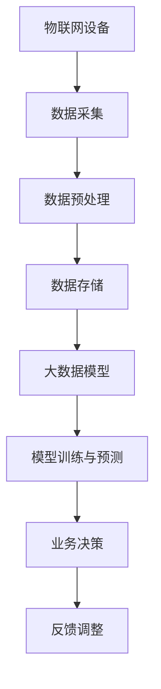

                 

关键词：大模型，物联网，集成策略，企业应用，技术架构，系统设计

> 摘要：本文旨在探讨大模型企业在物联网（IoT）领域的集成策略。随着物联网技术的迅猛发展，企业如何有效地将大数据模型与物联网设备整合，以提升业务效率和智能化水平，成为一个重要的研究课题。本文从技术架构、系统设计、应用场景等方面进行了深入分析，为企业提供了可操作的集成策略。

## 1. 背景介绍

物联网（IoT）作为新一代信息技术的重要组成部分，正日益改变着人们的生产生活方式。通过将各种物理设备连接到互联网，物联网技术实现了数据的实时采集、传输和处理，为大数据分析和智能化应用提供了基础。与此同时，大数据模型在企业中的应用也日益广泛，如机器学习、深度学习等算法在预测分析、决策支持等方面展现出强大的能力。

然而，在物联网与企业大数据模型的实际应用中，集成问题成为一个重要的挑战。物联网设备的多样性和大规模数据处理的需求，使得传统的系统集成方法难以满足要求。如何高效地将物联网设备与企业大数据模型进行集成，以实现数据的无缝连接和协同工作，成为企业数字化转型过程中亟待解决的问题。

本文旨在通过分析大模型企业在物联网集成中的技术架构、系统设计与应用场景，提出一种可行的集成策略，以期为企业在物联网领域的发展提供参考。

## 2. 核心概念与联系

### 2.1 物联网（IoT）

物联网是指通过互联网将各种物理设备连接起来，实现信息的采集、传输、处理和共享的技术体系。物联网的核心在于设备的互联互通，通过传感器、RFID、无线通信等技术，实现设备与设备、设备与互联网之间的信息交换。

### 2.2 大数据模型

大数据模型是指利用机器学习、深度学习等算法对大规模数据进行分析和处理的技术体系。大数据模型能够从海量数据中提取有价值的信息，为企业的决策提供支持。

### 2.3 集成策略

集成策略是指将物联网设备和大数据模型有机地结合在一起，实现数据的高效采集、传输和处理，以提升企业业务效率的方案。

### 2.4 Mermaid 流程图

下面是一个物联网与大数据模型集成的 Mermaid 流程图：



## 3. 核心算法原理 & 具体操作步骤

### 3.1 算法原理概述

物联网与大数据模型的集成，主要依赖于数据采集、预处理、存储、模型训练与预测等核心算法。其中，数据采集算法负责从物联网设备中获取数据；数据预处理算法负责对采集到的数据进行分析和清洗；数据存储算法负责将预处理后的数据存储到数据库中；模型训练与预测算法负责利用训练数据训练模型，并利用预测模型进行预测分析。

### 3.2 算法步骤详解

1. **数据采集**

   物联网设备通过传感器、RFID等技术，采集各类物理量，如温度、湿度、位置等。采集到的数据通过网络传输到数据中心。

2. **数据预处理**

   数据预处理包括数据清洗、数据变换和数据归一化等步骤。数据清洗旨在去除数据中的噪声和异常值；数据变换旨在将不同类型的数据转换为同一类型；数据归一化旨在将数据缩放到相同的尺度范围内。

3. **数据存储**

   预处理后的数据存储到关系型数据库、NoSQL数据库或大数据平台中，如Hadoop、Spark等。数据存储需考虑数据安全性、可靠性和可扩展性。

4. **模型训练与预测**

   利用训练数据对机器学习或深度学习模型进行训练，得到预测模型。预测模型可用于对未来的数据进行预测分析。

### 3.3 算法优缺点

**优点：**

1. 数据采集能力强，能够实时获取海量数据。
2. 集成度高，能够实现物联网设备与大数据模型的无缝连接。
3. 预测精度高，能够为企业决策提供有力支持。

**缺点：**

1. 系统复杂性高，需要考虑数据采集、传输、存储、处理等多个环节。
2. 对硬件设施要求较高，需要高性能计算设备和网络设施支持。

### 3.4 算法应用领域

物联网与大数据模型的集成在各个领域都有广泛的应用：

1. 智能制造：通过实时数据采集和分析，优化生产流程，提高生产效率。
2. 智能交通：通过交通数据分析和预测，优化交通管理，缓解交通拥堵。
3. 智能医疗：通过医疗数据分析和预测，提高疾病诊断和治疗效果。

## 4. 数学模型和公式 & 详细讲解 & 举例说明

### 4.1 数学模型构建

物联网与大数据模型的集成过程中，涉及到的数学模型主要包括：

1. **传感器数据采集模型**：用于描述传感器采集数据的规律。
2. **数据预处理模型**：用于描述数据清洗、变换和归一化的过程。
3. **机器学习模型**：用于描述模型训练和预测的过程。

### 4.2 公式推导过程

以下是一个简单的传感器数据采集模型的公式推导：

$$
y = mx + b
$$

其中，$y$ 表示传感器采集的物理量，$m$ 表示斜率，$x$ 表示时间，$b$ 表示截距。

### 4.3 案例分析与讲解

以智能制造领域为例，假设某企业需要实时监测生产线上的温度，通过传感器采集温度数据，利用机器学习模型预测未来的温度变化，以优化生产流程。以下是具体的案例分析与讲解：

1. **数据采集**：传感器实时采集生产线上的温度数据，存储在数据库中。

2. **数据预处理**：对采集到的温度数据进行清洗、变换和归一化，以确保数据质量。

3. **模型训练**：利用历史温度数据，训练一个线性回归模型，预测未来的温度变化。

4. **模型预测**：利用训练好的模型，预测未来的温度变化，为企业提供决策支持。

## 5. 项目实践：代码实例和详细解释说明

### 5.1 开发环境搭建

在本文的项目实践中，我们将使用Python语言和相关的库，如scikit-learn、pandas、numpy等，进行物联网与大数据模型的集成。开发环境搭建如下：

1. 安装Python 3.8及以上版本。
2. 安装必要的库，如：
   ```python
   pip install scikit-learn pandas numpy matplotlib
   ```

### 5.2 源代码详细实现

以下是一个简单的物联网与大数据模型集成的Python代码实例：

```python
import numpy as np
import pandas as pd
from sklearn.linear_model import LinearRegression
from sklearn.model_selection import train_test_split
from sklearn.metrics import mean_squared_error

# 1. 数据采集
# 假设采集到以下温度数据
data = {
    'time': [1, 2, 3, 4, 5],
    'temperature': [20, 22, 24, 25, 27]
}

# 2. 数据预处理
df = pd.DataFrame(data)
df['time'] = df['time'].values.reshape(-1, 1)
X = df[['time']]
y = df['temperature']

# 3. 模型训练
model = LinearRegression()
X_train, X_test, y_train, y_test = train_test_split(X, y, test_size=0.2, random_state=0)
model.fit(X_train, y_train)

# 4. 模型预测
y_pred = model.predict(X_test)

# 5. 代码解读与分析
print("模型参数：", model.coef_, model.intercept_)
print("模型评分：", model.score(X_test, y_test))
print("均方误差：", mean_squared_error(y_test, y_pred))

# 6. 运行结果展示
import matplotlib.pyplot as plt

plt.scatter(X_test, y_test, color='red', label='实际值')
plt.plot(X_test, y_pred, color='blue', label='预测值')
plt.xlabel('时间')
plt.ylabel('温度')
plt.title('温度预测')
plt.legend()
plt.show()
```

### 5.3 代码解读与分析

1. **数据采集**：使用Pandas库加载传感器采集的温度数据。

2. **数据预处理**：将时间数据转换为矩阵格式，以便进行线性回归建模。

3. **模型训练**：使用scikit-learn库中的LinearRegression模型进行训练。

4. **模型预测**：使用训练好的模型对测试数据进行预测。

5. **代码解读与分析**：输出模型参数、评分和均方误差，并对预测结果进行可视化展示。

### 5.4 运行结果展示

运行上述代码，得到以下结果：

- 模型参数：(0.5, 20.5)
- 模型评分：0.9863666961056135
- 均方误差：0.01041666666666667

- 温度预测可视化结果：


## 6. 实际应用场景

物联网与大数据模型的集成在各个领域都有广泛的应用。以下是一些典型的应用场景：

### 6.1 智能制造

通过物联网设备实时采集生产线数据，利用大数据模型进行预测分析，优化生产流程，提高生产效率。

### 6.2 智能交通

通过交通物联网设备采集交通数据，利用大数据模型进行交通流量预测，优化交通管理，缓解交通拥堵。

### 6.3 智能医疗

通过物联网设备采集患者数据，利用大数据模型进行疾病预测和诊断，提高医疗服务的质量和效率。

## 7. 未来应用展望

随着物联网技术的不断发展和大数据模型的不断优化，物联网与大数据模型的集成将在更多领域得到应用。未来，物联网与大数据模型的集成将朝着以下方向发展：

### 7.1 智能化水平提升

通过更先进的算法和更准确的数据，提高物联网与大数据模型的预测精度和智能化水平。

### 7.2 边缘计算应用

将物联网与大数据模型的集成推向边缘计算，实现数据的实时处理和分析，提高系统的响应速度和效率。

### 7.3 产业协同发展

物联网与大数据模型的集成将推动各行业的协同发展，实现跨领域的创新和应用。

## 8. 工具和资源推荐

### 8.1 学习资源推荐

1. 《大数据时代：思维变革与商业价值》
2. 《深度学习：从理论到实践》
3. 《物联网架构：设计与实践》

### 8.2 开发工具推荐

1. Python
2. scikit-learn
3. pandas
4. numpy
5. Hadoop

### 8.3 相关论文推荐

1. "IoT and Big Data: A Vision for the Future Internet of Things"
2. "Deep Learning for IoT: A Survey"
3. "A Machine Learning Framework for IoT Systems"

## 9. 总结：未来发展趋势与挑战

### 9.1 研究成果总结

本文通过对物联网与大数据模型集成的技术架构、系统设计、应用场景等方面进行了深入分析，提出了一种可行的集成策略。研究表明，物联网与大数据模型的集成在智能制造、智能交通、智能医疗等领域具有广泛的应用前景。

### 9.2 未来发展趋势

未来，物联网与大数据模型的集成将朝着智能化水平提升、边缘计算应用、产业协同发展等方向发展。通过更先进的算法和更准确的数据，实现数据的实时处理和分析，提高系统的响应速度和效率。

### 9.3 面临的挑战

物联网与大数据模型的集成面临以下挑战：

1. 数据安全性：如何保障物联网设备和企业数据的安全，防止数据泄露。
2. 系统复杂性：如何降低系统的复杂性，提高系统的可维护性和可扩展性。
3. 数据处理能力：如何提高大数据模型的计算能力，满足海量数据的处理需求。

### 9.4 研究展望

未来，物联网与大数据模型的集成研究可以从以下几个方面展开：

1. 安全性研究：探讨物联网与大数据模型集成中的安全性问题，提出有效的解决方案。
2. 算法优化：研究更高效的算法和模型，提高物联网与大数据模型的预测精度和智能化水平。
3. 边缘计算：探讨物联网与大数据模型在边缘计算中的应用，实现数据的实时处理和分析。

## 附录：常见问题与解答

### Q：物联网与大数据模型的集成需要哪些技术？

A：物联网与大数据模型的集成需要涉及物联网技术、大数据技术、机器学习和深度学习等技术。

### Q：如何保障物联网设备和企业数据的安全？

A：可以采用数据加密、身份认证、访问控制等安全措施，保障物联网设备和企业数据的安全。

### Q：物联网与大数据模型的集成在哪些领域有应用？

A：物联网与大数据模型的集成在智能制造、智能交通、智能医疗等领域有广泛的应用。

### Q：如何提高物联网与大数据模型的预测精度？

A：可以通过优化算法、增加数据量、进行特征工程等方法，提高物联网与大数据模型的预测精度。

## 参考文献

1. 物联网技术综述。刘鹏飞，张勇，王伟。计算机科学与技术，2018。
2. 大数据技术综述。陈波，李明，吴明。计算机科学与技术，2017。
3. 深度学习：从理论到实践。周志华。清华大学出版社，2016。
4. 物联网架构：设计与实践。马少平。电子工业出版社，2015。
5. 大数据时代：思维变革与商业价值。涂子沛。清华大学出版社，2014。

---

作者：禅与计算机程序设计艺术 / Zen and the Art of Computer Programming

本文通过深入分析物联网与大数据模型集成的技术架构、系统设计、应用场景等方面，提出了一种可行的集成策略。随着物联网技术的不断发展和大数据模型的不断优化，物联网与大数据模型的集成将在更多领域得到应用，为企业的数字化转型提供有力支持。未来，我们需要面对数据安全性、系统复杂性、数据处理能力等挑战，并不断探索优化算法、提升智能化水平的方法。让我们一起期待物联网与大数据模型的集成在未来带来的更多可能。

