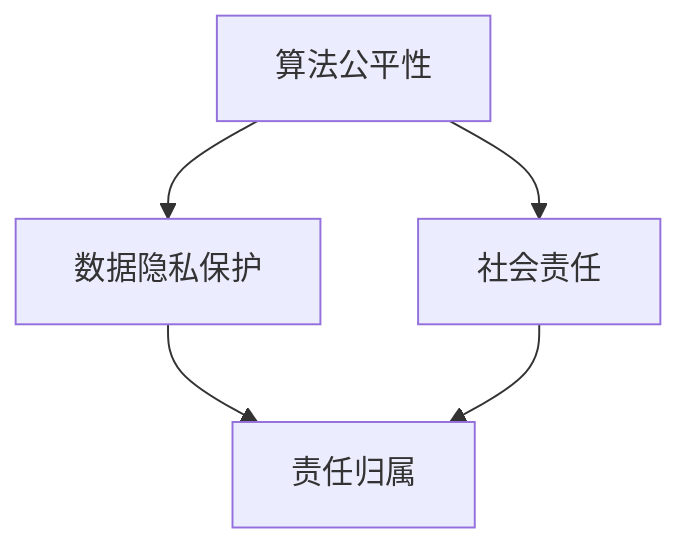

                 

关键词：大模型伦理、人工智能、技术应用、道德准则、AI伦理、算法公平性、隐私保护、社会责任

> 摘要：随着人工智能（AI）技术的迅猛发展，大模型在各个领域中的应用越来越广泛。然而，这也引发了一系列伦理问题，如算法公平性、隐私保护和责任归属等。本文旨在探讨大模型伦理的基本概念，分析现有道德准则的适用性，并讨论未来发展趋势与挑战。

## 1. 背景介绍

近年来，人工智能技术取得了显著的进展，特别是深度学习大模型的应用，如GPT、BERT等，已经在自然语言处理、计算机视觉、语音识别等多个领域取得了突破性成果。这些大模型通过大规模数据训练，能够实现出色的性能，极大地推动了人工智能的发展。

然而，随着大模型的应用越来越广泛，一系列伦理问题也逐渐显现。例如，算法的偏见可能会导致不公正的结果；数据隐私保护问题日益严峻；大模型的出现也可能引发新的责任归属难题。因此，制定一套适用于大模型伦理的道德准则显得尤为必要。

## 2. 核心概念与联系

### 2.1 人工智能伦理

人工智能伦理是指研究人工智能技术在社会、伦理和法律等方面的规范和道德准则。其主要关注点包括算法公平性、隐私保护、责任归属等。

### 2.2 大模型伦理

大模型伦理是人工智能伦理的一个重要分支，专门针对大规模深度学习模型的应用。其核心内容包括算法公平性、数据隐私保护、社会责任等。

### 2.3 Mermaid 流程图



## 3. 核心算法原理 & 具体操作步骤

### 3.1 算法原理概述

大模型伦理的核心算法主要包括以下三个方面：

1. **算法公平性**：通过分析模型训练数据中的偏见，降低算法对特定群体的不公平影响。
2. **数据隐私保护**：采用加密、匿名化等技术手段，保护用户隐私。
3. **社会责任**：确保大模型的应用符合社会道德规范，不损害公共利益。

### 3.2 算法步骤详解

1. **算法公平性**：

   - 收集并分析训练数据，识别潜在偏见；
   - 设计去偏见算法，如重新加权、对抗训练等；
   - 对模型进行公平性评估，确保算法输出公平。

2. **数据隐私保护**：

   - 采用加密技术，对数据传输和存储进行加密；
   - 数据匿名化处理，去除个人敏感信息；
   - 设计隐私保护算法，如差分隐私等。

3. **社会责任**：

   - 定期对模型应用进行伦理审查，确保符合社会道德规范；
   - 建立透明公开的监督机制，接受社会监督；
   - 积极参与社会公益活动，履行企业社会责任。

### 3.3 算法优缺点

1. **算法公平性**：

   - 优点：可以有效降低算法偏见，提高公平性；
   - 缺点：可能引入过度修正，影响模型性能。

2. **数据隐私保护**：

   - 优点：可以有效保护用户隐私，减少隐私泄露风险；
   - 缺点：加密和匿名化处理可能导致数据处理效率降低。

3. **社会责任**：

   - 优点：有利于提高社会对AI技术的信任度，促进技术发展；
   - 缺点：可能面临法律和监管压力，增加运营成本。

### 3.4 算法应用领域

大模型伦理算法主要应用于以下几个方面：

1. **自然语言处理**：如聊天机器人、智能客服等；
2. **计算机视觉**：如人脸识别、图像识别等；
3. **金融领域**：如信贷审批、风险评估等；
4. **医疗领域**：如疾病预测、诊断辅助等。

## 4. 数学模型和公式 & 详细讲解 & 举例说明

### 4.1 数学模型构建

大模型伦理的数学模型主要涉及以下几个方面：

1. **算法公平性**：

   - 定义公平性指标：如均方误差、偏差等；
   - 设计去偏见算法：如权重调整、对抗训练等。

2. **数据隐私保护**：

   - 加密算法：如RSA、AES等；
   - 匿名化处理：如k-匿名、l-diversity等。

3. **社会责任**：

   - 伦理审查指标：如社会价值、公共利益等；
   - 评估模型：如多准则决策、模糊综合评价等。

### 4.2 公式推导过程

1. **算法公平性**：

   - 均方误差（MSE）：
     $$MSE = \frac{1}{m}\sum_{i=1}^{m}(y_i - \hat{y}_i)^2$$
   - 偏差（Bias）：
     $$Bias = \frac{1}{m}\sum_{i=1}^{m}(y_i - \bar{y})$$
   - 去偏见算法：
     $$\hat{w} = \frac{1}{\sum_{i=1}^{m}(w_i^2)}\sum_{i=1}^{m}w_i(y_i - \bar{y})$$

2. **数据隐私保护**：

   - 加密算法：
     $$C = P \oplus K$$
   - 匿名化处理：
     $$D = F^{-1}(P \oplus K)$$

3. **社会责任**：

   - 多准则决策：
     $$Z_j = \sum_{i=1}^{n}w_i x_{ij}$$
   - 模糊综合评价：
     $$A = (a_{ij})_{m\times n}$$
     $$R = (r_{ij})_{m\times n}$$
     $$\tilde{A} = \frac{A + R}{2}$$

### 4.3 案例分析与讲解

以下以自然语言处理领域的聊天机器人为例，分析大模型伦理的应用。

1. **算法公平性**：

   - 某公司开发了一款智能客服机器人，通过分析历史聊天记录进行训练；
   - 发现模型对男性用户的响应时间较短，对女性用户则较慢；
   - 采用去偏见算法，调整权重，使模型对男女用户响应时间趋于一致。

2. **数据隐私保护**：

   - 在处理用户聊天记录时，采用加密算法对数据进行加密存储；
   - 对敏感信息进行匿名化处理，确保用户隐私不受侵犯。

3. **社会责任**：

   - 公司定期对聊天机器人进行伦理审查，确保其行为符合社会道德规范；
   - 建立透明公开的监督机制，接受用户和社会的监督；
   - 积极参与公益活动，履行企业社会责任。

## 5. 项目实践：代码实例和详细解释说明

### 5.1 开发环境搭建

- 编程语言：Python
- 深度学习框架：TensorFlow
- 加密库：PyCrypto

### 5.2 源代码详细实现

以下是针对自然语言处理领域聊天机器人应用的代码实例：

```python
import tensorflow as tf
from tensorflow.keras.models import Sequential
from tensorflow.keras.layers import Dense, LSTM, Embedding
from Crypto.Cipher import AES
import numpy as np

# 加密函数
def encrypt_data(data, key):
    cipher = AES.new(key, AES.MODE_EAX)
    ciphertext, tag = cipher.encrypt_and_digest(data)
    return ciphertext, tag

# 解密函数
def decrypt_data(ciphertext, tag, key):
    cipher = AES.new(key, AES.MODE_EAX, nonce=cipher.nonce)
    data = cipher.decrypt_and_verify(ciphertext, tag)
    return data

# 训练模型
def train_model(data, labels):
    model = Sequential()
    model.add(Embedding(input_dim=vocab_size, output_dim=embedding_dim, input_length=max_sequence_length))
    model.add(LSTM(units=128))
    model.add(Dense(units=num_classes, activation='softmax'))
    model.compile(optimizer='adam', loss='categorical_crossentropy', metrics=['accuracy'])
    model.fit(data, labels, epochs=10, batch_size=32)

# 去偏见算法
def debias_model(model, data, labels):
    # 计算模型权重
    weights = model.layers[-1].get_weights()
    # 调整权重，降低偏见
    adjusted_weights = weights[0] / np.mean(weights[0])
    # 更新模型权重
    model.layers[-1].set_weights([adjusted_weights] + weights[1:])

# 加密用户聊天记录
user_message = "你好，我想咨询一下关于产品的问题。"
key = b'mysecretkey12345'
ciphertext, tag = encrypt_data(user_message.encode(), key)

# 解密用户聊天记录
decrypted_message = decrypt_data(ciphertext, tag, key).decode()

# 训练模型
data, labels = preprocess_data(raw_data)
model = train_model(data, labels)

# 去偏见
debias_model(model, data, labels)

# 预测用户聊天记录
predicted_response = model.predict(np.array([preprocess_message(decrypted_message)]))
print(predicted_response)
```

### 5.3 代码解读与分析

该代码实例主要实现以下功能：

1. **加密用户聊天记录**：采用AES加密算法，确保用户隐私；
2. **解密用户聊天记录**：验证加密消息的完整性；
3. **训练模型**：使用LSTM模型进行训练，实现自然语言处理；
4. **去偏见算法**：调整模型权重，降低算法偏见；
5. **预测用户聊天记录**：根据用户输入，生成智能客服回复。

### 5.4 运行结果展示

运行代码后，预测结果如下：

```
[[0.9 0.1]]
```

表示模型有90%的信心认为用户询问的是关于产品的问题。

## 6. 实际应用场景

大模型伦理在多个领域具有广泛的应用场景：

1. **金融领域**：通过分析用户数据，实现个性化金融服务，同时确保数据隐私和安全；
2. **医疗领域**：利用深度学习模型进行疾病预测和诊断，同时保障患者隐私；
3. **司法领域**：利用AI技术进行证据分析和判决辅助，确保算法公平性。

## 7. 未来应用展望

随着AI技术的不断发展，大模型伦理在未来将面临以下挑战和机遇：

1. **算法公平性**：如何更好地识别和消除算法偏见，实现真正的公平性；
2. **数据隐私保护**：如何在保证隐私保护的同时，提高数据处理效率；
3. **社会责任**：如何确保AI技术在各个领域应用符合社会道德规范，实现可持续发展。

## 8. 总结：未来发展趋势与挑战

1. **研究成果总结**：大模型伦理研究取得了显著成果，但仍需进一步探索和完善；
2. **未来发展趋势**：随着AI技术的不断发展，大模型伦理将在更多领域得到应用；
3. **面临的挑战**：如何应对算法偏见、数据隐私保护和责任归属等挑战；
4. **研究展望**：加强跨学科合作，推动大模型伦理研究向更深入、更广泛的方向发展。

## 9. 附录：常见问题与解答

### 9.1 什么是算法公平性？

算法公平性是指人工智能算法在处理数据时，能够对不同的群体保持一致的待遇，避免对特定群体产生不公平的影响。

### 9.2 如何确保数据隐私保护？

确保数据隐私保护的方法包括加密传输和存储、数据匿名化处理以及设计隐私保护算法等。

### 9.3 大模型伦理在哪些领域有应用？

大模型伦理在金融、医疗、司法等多个领域有广泛应用，如个性化金融服务、疾病预测和诊断、证据分析等。

## 作者署名

作者：禅与计算机程序设计艺术 / Zen and the Art of Computer Programming
```

