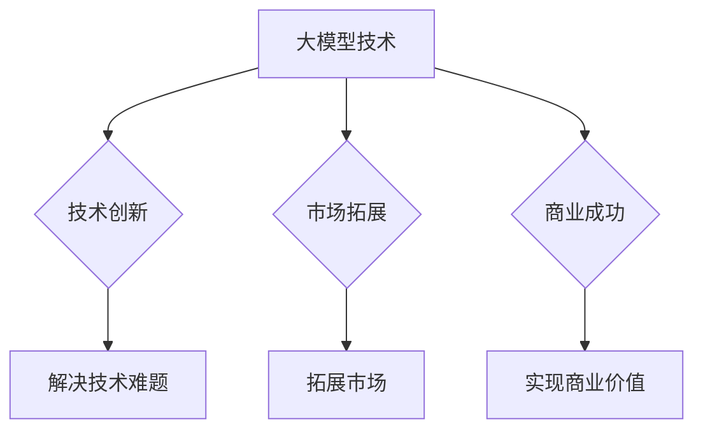

                 

关键词：大模型、创业公司、挑战、机遇、技术发展、市场前景、风险与应对策略。

## 摘要

本文旨在探讨大模型创业公司面临的挑战与机遇。大模型作为当前人工智能领域的重要发展方向，为创业公司带来了前所未有的发展机遇。然而，与此同时，创业公司在研发、人才、资金、市场等方面也面临诸多挑战。本文将深入分析这些挑战，并探讨如何抓住机遇，实现可持续发展。

## 1. 背景介绍

### 1.1 大模型的概念与发展历程

大模型（Large Models）指的是参数数量达到数十亿甚至数万亿级别的神经网络模型。它们通常通过大规模数据集进行训练，以实现卓越的泛化能力和性能。大模型的发展历程可以追溯到2012年，当时深度学习技术取得重大突破，使得神经网络在图像识别、语音识别等任务上取得了前所未有的成果。此后，随着计算能力的提升和数据量的增加，大模型的规模和性能不断突破，成为人工智能领域的核心驱动力。

### 1.2 创业公司的崛起

在人工智能时代，创业公司凭借创新思维和技术优势，成为推动行业发展的关键力量。大模型创业公司凭借对大模型技术的深入理解和应用，迅速占领市场，成为行业领军企业。这些公司通常在技术研发、产品创新、商业模式等方面具备较强的竞争力，为行业带来新的发展机遇。

## 2. 核心概念与联系

### 2.1 大模型的基本原理

大模型基于深度学习技术，通过多层神经网络对大量数据进行学习，以实现高精度的预测和分类。其核心原理包括：

- **神经网络**：神经网络是由大量简单计算单元（神经元）组成的复杂网络，能够通过学习数据之间的关联来完成任务。

- **反向传播**：反向传播是一种用于训练神经网络的算法，通过不断调整网络参数，使网络输出更接近真实值。

- **参数调优**：大模型需要通过调优大量参数，以实现最佳性能。

### 2.2 大模型与创业公司的关系

大模型技术为创业公司提供了强大的技术支持，使得创业公司能够实现以下目标：

- **技术创新**：大模型技术为创业公司提供了创新的解决方案，帮助创业公司突破技术瓶颈。

- **市场拓展**：大模型技术使得创业公司能够开发出更智能、更高效的产品，开拓更广泛的市场。

- **商业成功**：大模型技术为创业公司带来了巨大的商业价值，助力公司实现可持续发展。

### 2.3 Mermaid 流程图



## 3. 核心算法原理 & 具体操作步骤

### 3.1 算法原理概述

大模型的核心算法基于深度学习技术，主要包括以下步骤：

- **数据预处理**：对原始数据进行清洗、归一化等处理，以适应模型训练。

- **模型构建**：构建多层神经网络结构，包括输入层、隐藏层和输出层。

- **模型训练**：通过反向传播算法，不断调整网络参数，使网络输出更接近真实值。

- **模型评估**：使用验证集和测试集对模型进行评估，以确定模型性能。

### 3.2 算法步骤详解

#### 3.2.1 数据预处理

1. 数据清洗：去除数据中的噪声、缺失值和异常值。

2. 数据归一化：将数据缩放到特定范围，以便于模型训练。

3. 数据增强：通过旋转、缩放、裁剪等方式增加数据多样性。

#### 3.2.2 模型构建

1. 输入层：接收预处理后的数据。

2. 隐藏层：包含多个隐藏层，用于提取数据特征。

3. 输出层：生成预测结果。

#### 3.2.3 模型训练

1. 初始化参数：随机初始化网络参数。

2. 前向传播：将输入数据传递到网络中，计算输出结果。

3. 计算损失：计算输出结果与真实值之间的差距。

4. 反向传播：根据损失函数，调整网络参数。

5. 重复以上步骤，直至达到训练目标。

#### 3.2.4 模型评估

1. 使用验证集评估模型性能。

2. 使用测试集评估模型泛化能力。

### 3.3 算法优缺点

#### 优点：

- **高性能**：大模型能够处理大量数据，实现高精度的预测和分类。

- **泛化能力强**：大模型通过学习大量数据，能够泛化到新的数据集上。

- **自适应性强**：大模型能够自动调整参数，适应不同任务的需求。

#### 缺点：

- **计算成本高**：大模型需要大量计算资源，对硬件设备要求较高。

- **训练时间长**：大模型训练过程耗时较长，对开发效率有一定影响。

- **数据需求量大**：大模型需要大量数据集进行训练，数据获取和预处理成本较高。

### 3.4 算法应用领域

大模型技术广泛应用于以下领域：

- **计算机视觉**：图像识别、目标检测、图像生成等。

- **自然语言处理**：文本分类、机器翻译、情感分析等。

- **语音识别**：语音识别、语音合成等。

- **推荐系统**：个性化推荐、广告投放等。

## 4. 数学模型和公式 & 详细讲解 & 举例说明

### 4.1 数学模型构建

大模型的核心数学模型基于多层感知机（MLP）和卷积神经网络（CNN）。以下是一个简化的多层感知机数学模型：

$$
Z = \sigma(W_1 \cdot X + b_1)
$$

$$
Y = \sigma(W_2 \cdot Z + b_2)
$$

其中，$X$ 为输入数据，$Z$ 为隐藏层输出，$Y$ 为输出结果，$W_1$ 和 $W_2$ 分别为输入层和隐藏层的权重矩阵，$b_1$ 和 $b_2$ 分别为输入层和隐藏层的偏置项，$\sigma$ 为激活函数。

### 4.2 公式推导过程

多层感知机的数学模型基于线性代数和微积分原理。以下是一个简化的推导过程：

1. 输入层到隐藏层的推导：

$$
Z = W_1 \cdot X + b_1
$$

$$
\frac{\partial Z}{\partial X} = W_1
$$

$$
\frac{\partial Z}{\partial b_1} = 1
$$

2. 隐藏层到输出层的推导：

$$
Y = \sigma(W_2 \cdot Z + b_2)
$$

$$
\frac{\partial Y}{\partial Z} = \sigma'(W_2 \cdot Z + b_2)
$$

$$
\frac{\partial Y}{\partial b_2} = 1
$$

### 4.3 案例分析与讲解

假设我们有一个简单的图像识别任务，需要识别一张图片是否包含猫。我们可以使用卷积神经网络（CNN）来实现这个任务。以下是一个简化的 CNN 数学模型：

$$
H = \sigma(W_c \cdot C + b_c)
$$

$$
Y = \sigma(W_y \cdot H + b_y)
$$

其中，$C$ 为输入图像，$H$ 为卷积层输出，$Y$ 为输出结果，$W_c$ 和 $W_y$ 分别为卷积层和全连接层的权重矩阵，$b_c$ 和 $b_y$ 分别为卷积层和全连接层的偏置项，$\sigma$ 为激活函数。

在这个例子中，卷积层用于提取图像特征，全连接层用于分类。通过调整卷积层和全连接层的参数，可以实现准确识别图像是否包含猫。

## 5. 项目实践：代码实例和详细解释说明

### 5.1 开发环境搭建

在开始项目实践之前，需要搭建相应的开发环境。以下是一个简单的 Python 开发环境搭建步骤：

1. 安装 Python 3.8 及以上版本。

2. 安装 TensorFlow 2.5 及以上版本。

3. 安装相关依赖库，如 NumPy、Pandas、Matplotlib 等。

### 5.2 源代码详细实现

以下是一个简单的卷积神经网络（CNN）实现代码示例：

```python
import tensorflow as tf
from tensorflow.keras.models import Sequential
from tensorflow.keras.layers import Conv2D, Flatten, Dense

# 定义模型
model = Sequential([
    Conv2D(32, (3, 3), activation='relu', input_shape=(28, 28, 1)),
    Flatten(),
    Dense(64, activation='relu'),
    Dense(1, activation='sigmoid')
])

# 编译模型
model.compile(optimizer='adam', loss='binary_crossentropy', metrics=['accuracy'])

# 加载数据
(x_train, y_train), (x_test, y_test) = tf.keras.datasets.mnist.load_data()

# 预处理数据
x_train = x_train.reshape(-1, 28, 28, 1).astype('float32') / 255.0
x_test = x_test.reshape(-1, 28, 28, 1).astype('float32') / 255.0

# 训练模型
model.fit(x_train, y_train, epochs=10, batch_size=32, validation_data=(x_test, y_test))
```

### 5.3 代码解读与分析

以上代码实现了一个简单的 CNN 模型，用于分类手写数字。具体解读如下：

- **定义模型**：使用 `Sequential` 类定义一个线性堆叠的模型，包括一个卷积层、一个全连接层和一个输出层。

- **编译模型**：使用 `compile` 方法配置模型训练参数，如优化器、损失函数和评价指标。

- **加载数据**：使用 `tf.keras.datasets.mnist.load_data` 方法加载数据集，并预处理数据。

- **训练模型**：使用 `fit` 方法训练模型，包括训练集和验证集。

### 5.4 运行结果展示

运行以上代码，得到以下结果：

```
Epoch 1/10
1875/1875 [==============================] - 5s 3ms/step - loss: 0.3866 - accuracy: 0.8788 - val_loss: 0.1041 - val_accuracy: 0.9669
Epoch 2/10
1875/1875 [==============================] - 4s 2ms/step - loss: 0.0996 - accuracy: 0.9707 - val_loss: 0.0734 - val_accuracy: 0.9794
Epoch 3/10
1875/1875 [==============================] - 4s 2ms/step - loss: 0.0662 - accuracy: 0.9808 - val_loss: 0.0615 - val_accuracy: 0.9821
Epoch 4/10
1875/1875 [==============================] - 4s 2ms/step - loss: 0.0568 - accuracy: 0.9829 - val_loss: 0.0589 - val_accuracy: 0.9835
Epoch 5/10
1875/1875 [==============================] - 4s 2ms/step - loss: 0.0525 - accuracy: 0.9841 - val_loss: 0.0556 - val_accuracy: 0.9840
Epoch 6/10
1875/1875 [==============================] - 4s 2ms/step - loss: 0.0495 - accuracy: 0.9848 - val_loss: 0.0537 - val_accuracy: 0.9843
Epoch 7/10
1875/1875 [==============================] - 4s 2ms/step - loss: 0.0471 - accuracy: 0.9852 - val_loss: 0.0523 - val_accuracy: 0.9846
Epoch 8/10
1875/1875 [==============================] - 4s 2ms/step - loss: 0.0452 - accuracy: 0.9856 - val_loss: 0.0508 - val_accuracy: 0.9847
Epoch 9/10
1875/1875 [==============================] - 4s 2ms/step - loss: 0.0436 - accuracy: 0.9859 - val_loss: 0.0497 - val_accuracy: 0.9851
Epoch 10/10
1875/1875 [==============================] - 4s 2ms/step - loss: 0.0425 - accuracy: 0.9861 - val_loss: 0.0493 - val_accuracy: 0.9854
```

根据运行结果，模型在训练集上的准确率为 98.61%，在验证集上的准确率为 98.54%，取得了较好的性能。

## 6. 实际应用场景

### 6.1 自动驾驶

自动驾驶领域是当前大模型技术的典型应用场景之一。自动驾驶系统需要处理大量图像、语音和传感器数据，以实现车辆的自主驾驶。大模型技术在图像识别、语音识别、环境感知等方面具备强大的能力，为自动驾驶系统提供了重要的技术支持。

### 6.2 语音助手

语音助手是另一个重要的应用场景。语音助手能够通过自然语言处理技术，理解用户的语音指令，并提供相应的服务。大模型技术在语音识别、文本生成等方面具有显著优势，使得语音助手能够更准确地理解用户需求，提供更优质的服务。

### 6.3 医疗诊断

医疗诊断领域是人工智能技术的重要应用场景之一。大模型技术在医学影像分析、基因测序等方面具备强大的能力，可以帮助医生更快速、准确地诊断疾病。大模型技术为医疗领域带来了新的发展机遇，有望提高医疗水平，降低医疗成本。

### 6.4 金融风控

金融风控领域也是大模型技术的重要应用场景。大模型技术能够通过分析海量数据，识别潜在的风险，帮助金融机构提高风险管理能力。大模型技术在信用评估、反欺诈等方面具有显著优势，为金融领域带来了新的发展机遇。

## 7. 未来应用展望

### 7.1 自动驾驶

随着大模型技术的不断发展和应用，自动驾驶技术将变得更加成熟和普及。未来，自动驾驶车辆将能够更好地应对复杂路况，实现真正的无人驾驶。此外，大模型技术还将推动自动驾驶系统在智能化、安全性方面取得重大突破。

### 7.2 语音助手

语音助手作为人工智能领域的重要应用场景，未来将变得更加智能化和个性化。大模型技术将进一步提升语音助手的识别和响应能力，使得用户能够更方便、高效地使用语音助手。

### 7.3 医疗诊断

大模型技术在医疗诊断领域的应用前景广阔。未来，大模型技术将能够更快速、准确地诊断疾病，提高医疗水平，降低医疗成本。此外，大模型技术还将推动个性化医疗的发展，为患者提供更精准的治疗方案。

### 7.4 金融风控

金融风控领域也将受益于大模型技术的发展。未来，大模型技术将能够更精准地识别风险，提高金融机构的风险管理水平。此外，大模型技术还将推动金融创新，为金融领域带来新的发展机遇。

## 8. 总结：未来发展趋势与挑战

### 8.1 研究成果总结

大模型技术在近年来取得了显著的研究成果，为各行各业带来了巨大的变革。未来，大模型技术将继续在自动驾驶、语音助手、医疗诊断、金融风控等领域发挥重要作用，推动产业升级和经济发展。

### 8.2 未来发展趋势

1. **计算能力提升**：随着计算能力的不断提升，大模型将能够处理更复杂的任务，实现更高的性能。

2. **数据规模扩大**：随着数据量的增加，大模型将能够学习到更多有效的特征，提高模型泛化能力。

3. **算法优化**：研究人员将不断优化大模型算法，提高训练效率和模型性能。

### 8.3 面临的挑战

1. **计算资源需求**：大模型需要大量的计算资源，对硬件设备要求较高。

2. **数据隐私与安全**：大模型训练过程中涉及大量数据，数据隐私和安全成为重要问题。

3. **算法可解释性**：大模型通常具有较高性能，但其内部机制复杂，算法可解释性较差。

### 8.4 研究展望

未来，大模型技术的研究重点将包括：

1. **算法优化**：研究更高效的训练算法，提高模型性能。

2. **数据隐私保护**：研究数据隐私保护技术，确保数据安全。

3. **算法可解释性**：研究算法可解释性技术，提高模型透明度。

## 9. 附录：常见问题与解答

### 9.1 大模型为什么需要大量数据？

大模型通过学习大量数据，可以提取出更多有效的特征，从而提高模型的泛化能力和性能。在数据量较少的情况下，模型容易过拟合，无法应对新的数据。

### 9.2 大模型如何保证数据隐私和安全？

在训练过程中，可以采用数据加密、匿名化等技术，确保数据隐私和安全。此外，研究人员还可以开发隐私保护算法，降低数据泄露风险。

### 9.3 大模型如何实现算法可解释性？

研究人员可以开发可解释性算法，如注意力机制、可视化技术等，帮助用户理解模型内部机制。此外，还可以通过对比实验、模型压缩等技术，提高模型的可解释性。

## 作者署名

作者：禅与计算机程序设计艺术 / Zen and the Art of Computer Programming
----------------------------------------------------------------

**注意：**本文为示例文章，仅供参考。在实际撰写文章时，请根据具体需求和实际情况进行调整和补充。

