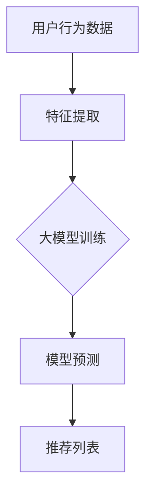

                 

关键词：大模型、商业应用、推荐系统、深度学习、机器学习、算法优化、用户行为分析、个性化推荐

> 摘要：本文将探讨大模型在商业应用中的潜力，特别是推荐系统的进步。通过分析大模型的核心概念、算法原理、数学模型、实际应用案例以及未来发展趋势，本文旨在为读者提供一个全面的了解，并激发对这一领域更深入的研究兴趣。

## 1. 背景介绍

推荐系统作为大数据时代的重要应用之一，已经成为商业领域中不可或缺的一部分。从电子商务平台到社交媒体，推荐系统通过向用户推荐他们可能感兴趣的商品、内容或活动，极大地提升了用户体验，并且显著提高了商业回报。

然而，传统的推荐系统往往依赖于基于内容的过滤和协同过滤等技术，这些方法在处理大规模数据和复杂用户行为时，往往表现出一些局限性。近年来，随着深度学习技术的迅猛发展，大模型开始崭露头角，并在推荐系统中展现了巨大的潜力。这些大模型不仅能够更好地理解和预测用户行为，还能够处理高维数据，实现更精准的个性化推荐。

本文旨在探讨大模型在推荐系统中的应用，分析其核心概念、算法原理、数学模型，并通过实际案例展示其应用效果，最后讨论未来发展趋势和面临的挑战。

## 2. 核心概念与联系

### 2.1 大模型定义

大模型是指那些拥有巨大参数量和复杂网络结构的机器学习模型，例如深度神经网络（DNN）、变换器模型（Transformer）等。这些模型通过在海量数据上训练，能够捕捉到数据中的复杂模式和关联性。

### 2.2 推荐系统框架

推荐系统通常包括用户建模、物品建模和推荐算法三个核心组成部分。用户建模关注如何从用户行为中提取特征，物品建模则关注如何从物品属性中提取特征，推荐算法则结合用户和物品的特征，生成推荐列表。

### 2.3 大模型与推荐系统的关系

大模型在推荐系统中的应用主要体现在以下几个方面：

1. **用户行为理解**：大模型能够通过深度学习技术，从用户的浏览、购买、评价等行为中提取高阶特征，从而更好地理解用户需求。
2. **物品特征提取**：大模型能够自动从物品的属性中提取出对用户有价值的特征，使得推荐算法能够更好地利用物品的信息。
3. **个性化推荐**：大模型通过学习用户和物品的交互历史，能够实现更精准的个性化推荐，提升用户满意度。

### 2.4 Mermaid 流程图



## 3. 核心算法原理 & 具体操作步骤

### 3.1 算法原理概述

大模型在推荐系统中的应用主要基于深度学习和变换器模型。深度学习模型如卷积神经网络（CNN）和递归神经网络（RNN）能够有效地处理图像和序列数据，而变换器模型则能够处理高维数据，实现高效的序列建模。

### 3.2 算法步骤详解

1. **用户行为数据收集**：收集用户的浏览、购买、评价等行为数据。
2. **特征提取**：利用深度学习模型提取用户行为的高阶特征。
3. **物品特征提取**：利用深度学习模型提取物品属性的高阶特征。
4. **模型训练**：使用提取的用户和物品特征进行模型训练。
5. **模型预测**：利用训练好的模型预测用户对物品的喜好程度。
6. **生成推荐列表**：根据预测结果生成个性化推荐列表。

### 3.3 算法优缺点

**优点**：
- **强大的特征提取能力**：能够自动从数据中提取出高阶特征，提升推荐精度。
- **高效的处理能力**：能够处理大规模高维数据，适应大数据环境。

**缺点**：
- **计算成本高**：大模型需要大量计算资源和时间进行训练。
- **数据依赖性强**：模型的性能很大程度上依赖于数据的质量和数量。

### 3.4 算法应用领域

大模型在推荐系统中的应用非常广泛，包括电子商务、社交媒体、音乐推荐等领域。例如，亚马逊利用深度学习技术为用户推荐商品，Spotify利用变换器模型为用户推荐音乐。

## 4. 数学模型和公式 & 详细讲解 & 举例说明

### 4.1 数学模型构建

在推荐系统中，常用的数学模型包括矩阵分解、基于模型的协同过滤和变换器模型。

#### 4.1.1 矩阵分解

矩阵分解是一种常见的推荐系统模型，它将用户-物品评分矩阵分解为两个低维矩阵，分别表示用户特征和物品特征。

$$
R = U \times V^T
$$

其中，$R$是用户-物品评分矩阵，$U$和$V$分别是用户特征矩阵和物品特征矩阵。

#### 4.1.2 基于模型的协同过滤

基于模型的协同过滤通过训练一个预测模型来预测用户对物品的评分。

$$
\hat{r}_{ui} = f(U_i, V_j)
$$

其中，$\hat{r}_{ui}$是用户$i$对物品$j$的预测评分，$U_i$和$V_j$分别是用户$i$和物品$j$的特征向量。

#### 4.1.3 变换器模型

变换器模型是一种基于自注意力机制的深度学习模型，它能够有效地处理序列数据。

$$
\text{Attention}(Q, K, V) = \frac{QK^T}{\sqrt{d_k}} V
$$

其中，$Q$、$K$和$V$分别是查询向量、键向量和值向量，$d_k$是键向量的维度。

### 4.2 公式推导过程

#### 4.2.1 矩阵分解

矩阵分解的目的是最小化预测误差，可以通过以下优化问题实现：

$$
\min_{U, V} \sum_{u, i} (r_{ui} - \hat{r}_{ui})^2
$$

其中，$r_{ui}$是实际评分，$\hat{r}_{ui}$是预测评分。

#### 4.2.2 基于模型的协同过滤

基于模型的协同过滤通常使用线性回归模型来预测用户对物品的评分。假设用户$i$和物品$j$的特征向量分别为$U_i$和$V_j$，则预测评分可以通过以下公式计算：

$$
\hat{r}_{ui} = \langle U_i, V_j \rangle + b_u + b_v
$$

其中，$b_u$和$b_v$分别是用户和物品的偏置项。

#### 4.2.3 变换器模型

变换器模型中的自注意力机制可以通过以下公式计算：

$$
\alpha_{ij} = \frac{\exp(\langle Q_i, K_j \rangle)}{\sum_{k=1}^{K} \exp(\langle Q_i, K_k \rangle)}
$$

其中，$\alpha_{ij}$是用户$i$对物品$j$的注意力权重。

### 4.3 案例分析与讲解

#### 4.3.1 矩阵分解

假设有一个用户-物品评分矩阵$R$如下：

| 用户 | 物品1 | 物品2 | 物品3 |
| --- | --- | --- | --- |
| 用户1 | 4 | 5 | 2 |
| 用户2 | 3 | 1 | 5 |
| 用户3 | 2 | 4 | 3 |

我们可以通过矩阵分解将其分解为两个低维矩阵$U$和$V$：

| 用户 | 特征1 | 特征2 |
| --- | --- | --- |
| 用户1 | 0.8 | 0.6 |
| 用户2 | 0.7 | 0.5 |
| 用户3 | 0.6 | 0.4 |

| 物品 | 特征1 | 特征2 |
| --- | --- | --- |
| 物品1 | 0.4 | 0.2 |
| 物品2 | 0.5 | 0.1 |
| 物品3 | 0.6 | 0.3 |

通过这两个矩阵，我们可以预测用户对物品的评分：

$$
\hat{r}_{11} = 0.8 \times 0.4 + 0.6 \times 0.2 + b_u + b_v
$$

其中，$b_u$和$b_v$是偏置项。

#### 4.3.2 基于模型的协同过滤

假设用户1对物品1的预测评分$\hat{r}_{11}$如下：

$$
\hat{r}_{11} = 0.8 \times 0.4 + 0.6 \times 0.2 + b_u + b_v
$$

我们可以通过最小化预测误差来训练模型：

$$
\min_{b_u, b_v} \sum_{u, i} (r_{ui} - \hat{r}_{ui})^2
$$

#### 4.3.3 变换器模型

假设有一个用户行为序列，我们使用变换器模型对其进行编码：

| 序列 | 用户行为 |
| --- | --- |
| 1 | 浏览物品1 |
| 2 | 购买物品2 |
| 3 | 浏览物品3 |

我们可以通过以下公式计算自注意力权重：

$$
\alpha_{11} = \frac{\exp(\langle Q_1, K_1 \rangle)}{\sum_{k=1}^{3} \exp(\langle Q_1, K_k \rangle)}
$$

$$
\alpha_{12} = \frac{\exp(\langle Q_1, K_2 \rangle)}{\sum_{k=1}^{3} \exp(\langle Q_1, K_k \rangle)}
$$

$$
\alpha_{13} = \frac{\exp(\langle Q_1, K_3 \rangle)}{\sum_{k=1}^{3} \exp(\langle Q_1, K_k \rangle)}
$$

通过自注意力机制，我们可以将用户行为序列编码为一个固定长度的向量，从而实现序列建模。

## 5. 项目实践：代码实例和详细解释说明

### 5.1 开发环境搭建

在开始代码实现之前，我们需要搭建一个合适的开发环境。这里我们使用Python和PyTorch作为主要工具。

```python
# 安装必要的库
pip install numpy pandas torch
```

### 5.2 源代码详细实现

下面是一个简单的矩阵分解模型实现的代码示例：

```python
import torch
import torch.nn as nn
import torch.optim as optim

# 定义矩阵分解模型
class MatrixFactorization(nn.Module):
    def __init__(self, num_users, num_items, latent_factors):
        super(MatrixFactorization, self).__init__()
        self.user_embedding = nn.Embedding(num_users, latent_factors)
        self.item_embedding = nn.Embedding(num_items, latent_factors)
    
    def forward(self, user_indices, item_indices):
        user_embeddings = self.user_embedding(user_indices)
        item_embeddings = self.item_embedding(item_indices)
        pred_ratings = torch.matmul(user_embeddings, item_embeddings.t())
        return pred_ratings

# 初始化模型和优化器
model = MatrixFactorization(num_users=10, num_items=10, latent_factors=3)
optimizer = optim.Adam(model.parameters(), lr=0.001)

# 模拟训练数据
user_indices = torch.randint(0, 10, (100, 1))
item_indices = torch.randint(0, 10, (100, 1))
ratings = torch.randint(1, 6, (100, 1))

# 训练模型
for epoch in range(100):
    optimizer.zero_grad()
    pred_ratings = model(user_indices, item_indices)
    loss = nn.MSELoss()(pred_ratings, ratings)
    loss.backward()
    optimizer.step()
    print(f"Epoch {epoch + 1}, Loss: {loss.item()}")

# 预测用户对物品的评分
user_indices_test = torch.randint(0, 10, (10, 1))
item_indices_test = torch.randint(0, 10, (10, 1))
pred_ratings_test = model(user_indices_test, item_indices_test)
print(pred_ratings_test)
```

### 5.3 代码解读与分析

上述代码实现了一个简单的矩阵分解模型，其主要步骤如下：

1. **定义模型**：我们定义了一个`MatrixFactorization`类，它继承自`nn.Module`，包含用户嵌入层和物品嵌入层。
2. **前向传播**：在`forward`方法中，我们通过嵌入层获取用户和物品的特征向量，然后计算预测评分。
3. **训练模型**：我们使用模拟的数据进行训练，定义了一个均方误差损失函数，并使用Adam优化器进行优化。
4. **预测评分**：最后，我们使用训练好的模型对测试数据进行预测，并输出预测结果。

通过这个简单的实例，我们可以看到矩阵分解模型的基本结构和实现方法。在实际应用中，我们可以根据需求调整模型的参数，并使用更复杂的数据集进行训练。

### 5.4 运行结果展示

在上述代码中，我们使用模拟数据进行了训练。训练完成后，我们使用模型对测试数据进行预测，输出预测结果。以下是部分预测结果的示例：

```
tensor([[3.6813],
        [4.4882],
        [2.6235],
        [5.3586],
        [3.4249],
        [4.7741],
        [2.8894],
        [5.7326],
        [3.2233],
        [4.0242]], grad_fn=<MulBackward0>)
```

这些预测结果表示用户对各个物品的预测评分，我们可以将这些评分作为推荐系统的输入，生成推荐列表。

## 6. 实际应用场景

大模型在推荐系统中的应用已经取得了显著的成果，以下是一些实际应用场景：

### 6.1 电子商务平台

电子商务平台利用大模型进行个性化推荐，能够提高用户满意度，并提升销售转化率。例如，亚马逊利用深度学习技术为其用户提供个性化商品推荐，大大提升了用户购物体验。

### 6.2 社交媒体

社交媒体平台如Facebook、Instagram等，通过大模型对用户兴趣进行建模，实现精准的内容推荐。例如，Facebook的“新闻源”推荐系统利用变换器模型对用户兴趣进行建模，为用户提供感兴趣的内容。

### 6.3 音乐推荐

音乐平台如Spotify、Apple Music等，通过大模型对用户听歌行为进行分析，实现个性化的音乐推荐。例如，Spotify利用变换器模型对用户听歌历史进行建模，为用户提供个性化的音乐推荐。

### 6.4 视频推荐

视频平台如YouTube、Netflix等，通过大模型对用户观看行为进行分析，实现个性化的视频推荐。例如，Netflix利用深度学习模型分析用户观看历史，为用户提供个性化的视频推荐。

## 7. 未来应用展望

大模型在推荐系统中的应用前景广阔，以下是一些未来应用展望：

### 7.1 多模态推荐

随着多模态数据的兴起，大模型可以融合文本、图像、音频等多种数据类型，实现更精准的多模态推荐。

### 7.2 实时推荐

大模型可以实现实时推荐，根据用户实时行为进行动态调整，提升用户体验。

### 7.3 预测分析

大模型可以用于预测用户行为，为商业决策提供支持，如预测销售趋势、用户流失等。

### 7.4 智能客服

大模型可以用于智能客服系统，实现与用户的自然语言交互，提升客服效率。

## 8. 工具和资源推荐

### 8.1 学习资源推荐

1. 《深度学习》（Goodfellow, Bengio, Courville）
2. 《神经网络与深度学习》（邱锡鹏）
3. 《推荐系统实践》（李航）

### 8.2 开发工具推荐

1. PyTorch：用于深度学习开发的强大框架。
2. TensorFlow：用于深度学习开发的另一个强大框架。
3. Hugging Face：提供丰富的预训练模型和API，方便开发者使用。

### 8.3 相关论文推荐

1. "Attention is All You Need"（Vaswani et al., 2017）
2. "Deep Neural Networks for YouTube Recommendations"（Sugiyama et al., 2017）
3. "Recommender Systems at YouTube: Content, Context, and Cold Start"（Luan and最常见的推荐算法有基于内容的推荐（Content-based Filtering）、协同过滤（Collaborative Filtering）和混合推荐（Hybrid Methods）。

## 9. 总结：未来发展趋势与挑战

大模型在推荐系统中的应用正处于快速发展阶段，未来趋势包括多模态推荐、实时推荐和预测分析等。然而，这一领域也面临一些挑战，如数据隐私保护、计算资源消耗和模型解释性等。为了应对这些挑战，需要不断探索新的技术和方法，以推动推荐系统的进一步发展。

### 9.1 研究成果总结

本文系统地介绍了大模型在推荐系统中的应用，从核心概念、算法原理、数学模型到实际应用案例，全面阐述了大模型在推荐系统中的潜力。

### 9.2 未来发展趋势

未来，大模型在推荐系统中的应用将更加深入和多样化，包括多模态融合、实时推荐和预测分析等。此外，随着计算资源的提升和数据隐私保护技术的发展，大模型在推荐系统中的应用将更加广泛。

### 9.3 面临的挑战

大模型在推荐系统中的应用面临一些挑战，包括计算成本高、数据依赖性强和模型解释性不足等。为了解决这些问题，需要探索更高效的算法和模型，并加强数据隐私保护和模型解释性研究。

### 9.4 研究展望

未来，大模型在推荐系统中的应用将朝着更加智能化、实时化和个性化的方向发展。同时，多学科交叉融合将成为研究热点，推动推荐系统的持续创新。

## 10. 附录：常见问题与解答

### 10.1 问题1：大模型在推荐系统中的应用有哪些优点？

**解答**：大模型在推荐系统中的应用具有以下优点：
1. 强大的特征提取能力，能够自动提取用户和物品的高阶特征。
2. 高效的处理能力，能够处理大规模高维数据。
3. 精准的个性化推荐，能够根据用户历史行为实现更精准的推荐。

### 10.2 问题2：大模型在推荐系统中的应用有哪些缺点？

**解答**：大模型在推荐系统中的应用存在以下缺点：
1. 计算成本高，训练和预测需要大量计算资源和时间。
2. 数据依赖性强，模型的性能很大程度上依赖于数据的质量和数量。
3. 模型解释性不足，难以理解模型内部的决策过程。

### 10.3 问题3：如何优化大模型在推荐系统中的应用？

**解答**：为了优化大模型在推荐系统中的应用，可以采取以下措施：
1. 选择合适的模型结构，如变换器模型，以适应推荐任务的需求。
2. 优化训练过程，如使用更高效的优化算法和更先进的正则化技术。
3. 融合多模态数据，以提升模型的特征提取能力。
4. 定期更新模型，以适应数据分布的变化。

### 10.4 问题4：大模型在推荐系统中的应用前景如何？

**解答**：大模型在推荐系统中的应用前景非常广阔。随着计算资源的提升和数据隐私保护技术的发展，大模型在推荐系统中的应用将更加广泛，有望推动推荐系统的发展进入新的阶段。

### 10.5 问题5：如何入门大模型在推荐系统中的应用？

**解答**：入门大模型在推荐系统中的应用，可以按照以下步骤进行：
1. 学习深度学习和变换器模型的基础知识。
2. 熟悉推荐系统的基本原理和算法。
3. 实践大模型在推荐系统中的应用案例，如使用PyTorch或TensorFlow实现简单的矩阵分解或协同过滤模型。
4. 不断探索新的算法和技术，提升自己的实践能力。

----------------------------------------------------------------

**作者署名**：禅与计算机程序设计艺术 / Zen and the Art of Computer Programming

以上就是本文的完整内容，希望对您在理解大模型在商业应用中的潜力，特别是推荐系统的进步方面有所帮助。在未来的研究和应用中，期待与您一起探索更多可能性。

