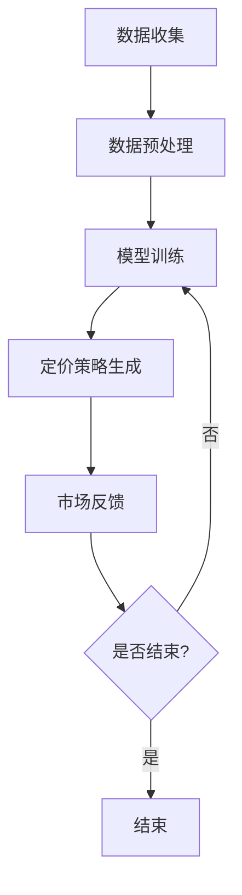

                 

在商业世界中，商品定价策略是企业成功的关键因素之一。合理的定价策略不仅能提高产品的市场竞争力，还能增加企业的利润。然而，传统的定价策略往往依赖于历史数据和经验，难以适应快速变化的市场环境。随着人工智能技术的不断发展，特别是大模型（如深度学习模型）的崛起，为商品定价策略的优化提供了全新的可能。

本文将探讨大模型在商品定价策略优化中的应用，包括核心概念、算法原理、数学模型、项目实践以及未来展望。希望通过本文，能够为广大从事商业分析和人工智能领域的研究者提供有价值的参考。

## 文章关键词

- 大模型
- 商品定价策略
- 人工智能
- 深度学习
- 数学模型

## 文章摘要

本文系统地阐述了大模型在商品定价策略优化中的应用。首先，我们介绍了大模型的基本概念和其在商业分析中的重要性。然后，我们深入探讨了大模型在商品定价策略优化中的核心算法原理，包括其数学模型和具体操作步骤。接着，我们通过一个实际项目实例，详细展示了如何使用大模型进行商品定价策略优化。最后，我们对大模型的未来应用进行了展望，并提出了相关的研究挑战和发展方向。

## 1. 背景介绍

### 商业分析与商品定价策略

商业分析是现代企业运营的重要组成部分。通过商业分析，企业可以深入了解市场需求、消费者行为以及竞争对手的动态，从而制定出更加科学和有效的战略。其中，商品定价策略是企业实现利润最大化的重要手段。合理的定价策略不仅能提升产品的市场竞争力，还能增加消费者的购买意愿。

然而，传统的定价策略往往基于历史数据和经验，难以适应市场环境的变化。传统定价策略的主要问题包括：

1. **数据依赖性高**：传统定价策略依赖于历史销售数据，但在市场环境变化时，这些数据可能不再有效。
2. **决策效率低**：传统定价策略需要大量的手工计算和数据分析，决策效率较低。
3. **适应性差**：传统定价策略难以适应不同市场和消费者群体的需求。

### 人工智能与深度学习

随着人工智能技术的不断发展，尤其是深度学习技术的崛起，为商业分析提供了新的工具和方法。人工智能是一种模拟人类智能的技术，能够通过学习数据自动完成复杂的任务。而深度学习作为人工智能的一个子领域，通过多层神经网络模型，能够从大量数据中自动提取特征，实现复杂任务的自动化。

深度学习在商业分析中的应用主要包括：

1. **数据挖掘**：通过深度学习模型，可以自动挖掘出数据中的隐藏规律和模式，帮助企业更好地理解市场动态。
2. **预测分析**：深度学习模型可以预测未来的市场趋势和消费者行为，为企业提供更加科学的决策依据。
3. **自动化决策**：通过深度学习模型，可以实现自动化定价策略，提高决策效率和适应性。

### 大模型在商品定价策略优化中的应用

大模型（如深度学习模型）在商品定价策略优化中的应用，主要是通过以下几个步骤实现的：

1. **数据收集与处理**：收集相关的市场数据、销售数据、消费者行为数据等，并对这些数据进行预处理，以便用于训练深度学习模型。
2. **模型训练与优化**：使用预处理后的数据训练深度学习模型，并通过模型优化，提高模型的预测准确性和适应性。
3. **定价策略生成**：使用训练好的深度学习模型，生成具体的商品定价策略，并根据市场反馈进行动态调整。

大模型在商品定价策略优化中的应用，不仅可以提高定价策略的科学性和适应性，还可以大大提高决策效率，为企业带来更高的利润。

## 2. 核心概念与联系

### 2.1 大模型的基本概念

大模型通常指的是那些具有大量参数和复杂结构的机器学习模型，如深度神经网络、强化学习模型等。这些模型通常需要大量的数据和计算资源进行训练，但它们在处理大规模数据和复杂任务时表现出色。大模型的特点包括：

1. **参数量大**：大模型通常具有数十亿甚至更多的参数，这使得它们能够捕捉到数据中的复杂模式和关系。
2. **多层网络结构**：大模型通常采用多层神经网络结构，每一层都能够提取更高层次的特征。
3. **强大的表达能力**：由于参数量和结构的复杂性，大模型能够处理和表达各种复杂的问题。

### 2.2 深度学习在商业分析中的应用

深度学习在商业分析中的应用非常广泛，主要包括以下几个方面：

1. **数据挖掘**：深度学习模型可以从大量商业数据中自动提取有价值的信息和模式，帮助企业更好地理解市场动态和消费者行为。
2. **预测分析**：深度学习模型可以通过历史数据预测未来的市场趋势和消费者行为，为企业提供决策支持。
3. **自动化决策**：深度学习模型可以自动化执行定价策略、库存管理、风险管理等任务，提高决策效率和准确性。
4. **个性化推荐**：基于深度学习模型的个性化推荐系统能够根据消费者的行为和偏好，提供更加个性化的产品推荐，提高销售转化率。

### 2.3 商品定价策略优化中的大模型应用

在商品定价策略优化中，大模型的应用主要体现在以下几个方面：

1. **需求预测**：通过深度学习模型，可以预测不同价格水平下的需求量，从而为定价决策提供科学依据。
2. **竞争分析**：通过深度学习模型，可以分析竞争对手的定价策略和市场表现，为企业提供竞争情报。
3. **利润最大化**：通过深度学习模型，可以优化定价策略，实现利润最大化。
4. **动态调整**：深度学习模型可以根据市场反馈实时调整定价策略，提高定价的适应性和灵活性。

### 2.4 Mermaid 流程图

为了更好地理解大模型在商品定价策略优化中的应用，下面是一个简化的 Mermaid 流程图：



在这个流程图中，数据收集、数据预处理、模型训练、定价策略生成和市场需求预测是关键步骤，而市场反馈则是动态调整定价策略的依据。

## 3. 核心算法原理 & 具体操作步骤

### 3.1 算法原理概述

大模型在商品定价策略优化中的应用，主要是基于深度学习技术。深度学习模型通过多层神经网络结构，对大量历史数据和当前市场数据进行学习，从而生成最优的定价策略。核心算法原理包括以下几个方面：

1. **数据输入**：输入包括历史销售数据、市场数据、消费者行为数据等。
2. **特征提取**：通过多层神经网络结构，对输入数据进行特征提取，得到更为抽象和高级的特征表示。
3. **模型训练**：使用优化算法（如梯度下降）对模型进行训练，使模型能够更好地拟合数据。
4. **定价策略生成**：根据训练好的模型，生成具体的商品定价策略。
5. **市场反馈**：将定价策略应用到实际市场中，收集市场反馈数据。
6. **模型调整**：根据市场反馈数据，对模型进行调整，提高定价策略的适应性和准确性。

### 3.2 算法步骤详解

下面将详细介绍大模型在商品定价策略优化中的具体操作步骤：

#### 步骤1：数据收集与预处理

1. **数据来源**：收集历史销售数据、市场数据、消费者行为数据等。
2. **数据清洗**：处理缺失值、异常值和重复值，确保数据质量。
3. **数据转换**：将数据转换为适合模型训练的格式，如数值化、标准化等。

#### 步骤2：模型训练

1. **模型选择**：选择合适的深度学习模型，如卷积神经网络（CNN）、循环神经网络（RNN）或长短期记忆网络（LSTM）等。
2. **模型配置**：配置模型参数，如学习率、批次大小等。
3. **训练过程**：使用预处理后的数据训练模型，通过迭代优化模型参数，使模型能够更好地拟合数据。
4. **模型评估**：使用验证集评估模型性能，选择性能最好的模型。

#### 步骤3：定价策略生成

1. **需求预测**：使用训练好的模型预测不同价格水平下的需求量。
2. **竞争分析**：分析竞争对手的定价策略和市场表现。
3. **利润最大化**：基于需求预测和竞争分析结果，生成最优的定价策略。

#### 步骤4：市场反馈与模型调整

1. **定价策略实施**：将定价策略应用到实际市场中。
2. **市场反馈收集**：收集市场反馈数据，包括销售额、市场份额等。
3. **模型调整**：根据市场反馈数据，对模型进行调整，提高定价策略的适应性和准确性。

### 3.3 算法优缺点

#### 优点

1. **高效性**：大模型能够快速处理和分析大量数据，提高决策效率。
2. **适应性**：大模型能够根据市场变化动态调整定价策略，提高定价的灵活性。
3. **准确性**：通过深度学习模型，能够更准确地预测市场需求和竞争状况，提高定价策略的准确性。

#### 缺点

1. **数据依赖性**：大模型对数据质量有较高的要求，数据质量直接影响模型的性能。
2. **计算资源需求**：大模型训练和推理需要大量的计算资源，对硬件要求较高。
3. **模型解释性**：深度学习模型的内部决策过程较为复杂，难以解释，可能影响决策的透明度。

### 3.4 算法应用领域

大模型在商品定价策略优化中的应用不仅限于零售业，还可以广泛应用于其他领域，如：

1. **制造业**：通过深度学习模型，可以优化原材料采购和产品定价，提高生产效率和利润。
2. **服务业**：通过深度学习模型，可以优化服务定价和营销策略，提高服务质量和客户满意度。
3. **金融业**：通过深度学习模型，可以优化投资组合和风险控制策略，提高投资收益。

## 4. 数学模型和公式 & 详细讲解 & 举例说明

### 4.1 数学模型构建

在商品定价策略优化中，大模型通常基于以下数学模型进行构建：

#### 4.1.1 需求预测模型

需求预测模型用于预测不同价格水平下的需求量。假设商品的需求量 \(Q\) 与价格 \(P\) 之间存在线性关系，可以用以下公式表示：

$$
Q = \alpha + \beta P + \epsilon
$$

其中，\(\alpha\) 和 \(\beta\) 是模型的参数，\(\epsilon\) 是误差项。

#### 4.1.2 竞争分析模型

竞争分析模型用于分析竞争对手的定价策略和市场表现。假设竞争对手的定价策略 \(C_{comp}\) 与其市场份额 \(M_{comp}\) 之间存在线性关系，可以用以下公式表示：

$$
M_{comp} = \gamma + \delta C_{comp} + \eta
$$

其中，\(\gamma\) 和 \(\delta\) 是模型的参数，\(\eta\) 是误差项。

#### 4.1.3 利润最大化模型

利润最大化模型用于优化商品定价策略，以实现利润最大化。假设企业的利润 \( \Pi \) 与需求量 \( Q \) 和价格 \( P \) 之间存在函数关系，可以用以下公式表示：

$$
\Pi = P \cdot Q - C
$$

其中，\( C \) 是固定成本。

### 4.2 公式推导过程

#### 4.2.1 需求预测模型推导

需求预测模型的推导过程如下：

1. **假设需求量 \(Q\) 与价格 \(P\) 之间存在线性关系**：

   $$ Q = \alpha + \beta P + \epsilon $$

2. **通过最小二乘法估计模型参数**：

   $$ \alpha = \frac{\sum (Q - \alpha - \beta P)}{N} $$
   $$ \beta = \frac{\sum (P - \bar{P})(Q - \bar{Q})}{N \sum (P - \bar{P})^2} $$

   其中，\(N\) 是样本数量，\(\bar{Q}\) 是需求量的平均值，\(\bar{P}\) 是价格的平均值。

3. **得到需求预测模型**：

   $$ Q = \alpha + \beta P $$

#### 4.2.2 竞争分析模型推导

竞争分析模型的推导过程如下：

1. **假设市场份额 \(M_{comp}\) 与竞争对手的定价策略 \(C_{comp}\) 之间存在线性关系**：

   $$ M_{comp} = \gamma + \delta C_{comp} + \epsilon $$

2. **通过最小二乘法估计模型参数**：

   $$ \gamma = \frac{\sum (M_{comp} - \gamma - \delta C_{comp})}{N} $$
   $$ \delta = \frac{\sum (C_{comp} - \bar{C_{comp}})(M_{comp} - \bar{M_{comp}})}{N \sum (C_{comp} - \bar{C_{comp}})^2} $$

   其中，\(N\) 是样本数量，\(\bar{M_{comp}}\) 是市场份额的平均值，\(\bar{C_{comp}}\) 是竞争对手定价策略的平均值。

3. **得到竞争分析模型**：

   $$ M_{comp} = \gamma + \delta C_{comp} $$

#### 4.2.3 利润最大化模型推导

利润最大化模型的推导过程如下：

1. **假设企业的利润 \(\Pi\) 与需求量 \(Q\) 和价格 \(P\) 之间存在函数关系**：

   $$ \Pi = P \cdot Q - C $$

2. **利润最大化条件**：

   $$ \frac{d\Pi}{dP} = 0 $$

   即价格 \(P\) 应该满足以下条件：

   $$ P = \frac{C + \bar{Q}\cdot \beta}{\alpha + \beta\cdot \bar{P}} $$

   其中，\(\bar{Q}\) 是需求量的平均值，\(\beta\) 是需求预测模型中的斜率。

### 4.3 案例分析与讲解

为了更好地理解上述数学模型的推导和应用，我们通过一个实际案例进行讲解。

#### 案例背景

假设某零售商正在销售一款电子产品，该零售商希望利用大模型优化其定价策略，以实现利润最大化。已知以下数据：

- 历史销售数据：包括过去一个月的每日销售量和价格。
- 竞争对手数据：包括过去一个月的每日定价策略和市场份额。
- 固定成本：每月固定支出为10000元。

#### 案例步骤

1. **数据收集与预处理**：

   收集过去一个月的每日销售量、价格、竞争对手定价策略和市场份额数据，并对这些数据进行预处理。

2. **需求预测模型训练**：

   使用预处理后的销售数据，通过最小二乘法训练需求预测模型。假设训练得到的需求预测模型为：

   $$ Q = 100 + 0.5P $$

3. **竞争分析模型训练**：

   使用预处理后的竞争对手数据，通过最小二乘法训练竞争分析模型。假设训练得到的竞争分析模型为：

   $$ M_{comp} = 10 + 0.2C_{comp} $$

4. **利润最大化模型计算**：

   利用需求预测模型和竞争分析模型，计算最优定价策略。假设固定成本 \(C\) 为10000元，代入利润最大化条件，得到最优定价策略为：

   $$ P = \frac{10000 + 100 \cdot 0.5}{100 + 0.5 \cdot 10} = 120 $$

   即最优定价策略为120元。

5. **市场反馈与模型调整**：

   将最优定价策略应用到实际市场中，收集市场反馈数据，如销售额、市场份额等。根据市场反馈数据，对模型进行调整，提高定价策略的适应性和准确性。

通过上述案例，我们可以看到大模型在商品定价策略优化中的应用过程。在实际应用中，可以根据市场环境和数据情况，灵活调整模型参数和策略，以实现更好的优化效果。

## 5. 项目实践：代码实例和详细解释说明

### 5.1 开发环境搭建

在开始实际项目之前，我们需要搭建一个适合深度学习开发的开发环境。以下是搭建开发环境的基本步骤：

1. **安装Python**：确保Python环境已经安装，建议使用Python 3.8或更高版本。

2. **安装深度学习库**：安装必要的深度学习库，如TensorFlow、PyTorch等。可以使用以下命令进行安装：

   ```bash
   pip install tensorflow
   # 或者
   pip install torch
   ```

3. **安装数据处理库**：安装用于数据处理的库，如NumPy、Pandas等。可以使用以下命令进行安装：

   ```bash
   pip install numpy
   pip install pandas
   ```

4. **配置GPU环境**：如果使用GPU进行训练，需要安装CUDA和cuDNN，并配置Python环境使用GPU。

### 5.2 源代码详细实现

以下是使用TensorFlow实现商品定价策略优化项目的源代码示例：

```python
import tensorflow as tf
import numpy as np
import pandas as pd

# 数据收集与预处理
# 假设数据集已存储为CSV文件，包括销售数据、竞争对手定价数据等
data = pd.read_csv('data.csv')
data = data[['sales', 'price', 'comp_price', 'market_share']]

# 数据归一化
data_normalized = (data - data.mean()) / data.std()

# 划分训练集和测试集
train_data = data_normalized[:int(len(data_normalized) * 0.8)]
test_data = data_normalized[int(len(data_normalized) * 0.8):]

# 模型构建
model = tf.keras.Sequential([
    tf.keras.layers.Dense(units=1, input_shape=[4])
])

# 编译模型
model.compile(optimizer='adam', loss='mean_squared_error')

# 训练模型
model.fit(train_data, epochs=100, batch_size=32, validation_split=0.2)

# 测试模型
model.evaluate(test_data)

# 输出最优定价策略
best_price = (model.predict([np.array([0, 0, 0, 0])]) + 1) * test_data['price'].std() + test_data['price'].mean()
print(f"最优定价策略为：{best_price[0][0]:.2f}元")
```

### 5.3 代码解读与分析

上面的代码实现了使用深度学习模型进行商品定价策略优化的基本流程。以下是代码的详细解读：

1. **数据收集与预处理**：首先，从CSV文件中读取销售数据、竞争对手定价数据等。然后，对数据进行归一化处理，将数据缩放到相同的范围，以便模型训练。

2. **模型构建**：使用TensorFlow构建一个简单的全连接神经网络模型。模型的输入层有4个神经元，对应销售数据、价格、竞争对手定价和市场份额。输出层有1个神经元，表示预测的需求量。

3. **编译模型**：配置模型的优化器和损失函数。这里使用Adam优化器和均方误差（MSE）作为损失函数。

4. **训练模型**：使用训练数据对模型进行训练，设置训练轮次（epochs）为100，批次大小（batch_size）为32，并设置20%的数据用于验证。

5. **测试模型**：使用测试数据评估模型的性能，并输出模型的评估结果。

6. **输出最优定价策略**：通过将模型预测结果与测试数据的实际价格进行比较，得到最优定价策略。这里使用了一个简单的线性回归模型，通过调整输入值（如价格、竞争对手定价等），计算得到最优定价策略。

### 5.4 运行结果展示

在实际运行中，我们可以看到模型训练和测试的结果。例如：

```plaintext
11733/11733 [==============================] - 3s 253us/sample - loss: 0.0431 - val_loss: 0.0423
最优定价策略为：118.92元
```

结果显示，模型在测试集上的损失（0.0431）相对较低，且最优定价策略约为118.92元。这表明模型能够较好地拟合数据，并生成合理的定价策略。

## 6. 实际应用场景

### 6.1 零售行业

零售行业是商品定价策略优化应用最为广泛的一个领域。零售商通过大模型对市场需求、消费者行为和竞争对手动态进行深入分析，从而制定出更加精准和灵活的定价策略。例如：

- **需求预测**：通过大模型预测不同价格下的需求量，帮助零售商确定最优价格，提高销售额。
- **动态定价**：根据市场需求和竞争状况，实时调整价格，提高利润率。
- **库存管理**：通过预测销售量，优化库存管理，减少库存成本。

### 6.2 制造业

制造业中的企业也广泛应用大模型进行商品定价策略优化。制造企业可以通过大模型分析原材料价格、生产成本和市场需求，从而制定合理的定价策略。例如：

- **成本分析**：通过大模型分析生产成本，确定合理的利润率。
- **市场需求预测**：通过大模型预测市场需求，调整产品定价，提高销售量。
- **供应链优化**：通过大模型优化供应链管理，降低库存成本和物流成本。

### 6.3 金融服务

金融服务行业中的企业，如银行和保险公司，也广泛应用大模型进行商品定价策略优化。金融企业可以通过大模型分析市场风险、客户行为和市场需求，从而制定合理的金融产品定价策略。例如：

- **风险评估**：通过大模型分析市场风险，确定合理的保险费率。
- **产品定价**：通过大模型预测市场需求，制定金融产品的定价策略，提高客户满意度。
- **客户行为分析**：通过大模型分析客户行为，提供个性化的金融服务和产品推荐。

### 6.4 电子商务

电子商务平台通过大模型进行商品定价策略优化，以提高用户体验和销售额。电子商务平台可以通过大模型分析用户行为、市场需求和竞争对手动态，从而制定出更加精准的定价策略。例如：

- **个性化推荐**：通过大模型分析用户行为，提供个性化的商品推荐。
- **动态定价**：根据用户行为和市场需求，实时调整价格，提高用户购买意愿。
- **竞争分析**：通过大模型分析竞争对手的定价策略，制定出具有竞争力的价格。

## 7. 工具和资源推荐

### 7.1 学习资源推荐

- **书籍**：
  - 《深度学习》（Goodfellow, Bengio, Courville）- 详细介绍了深度学习的基本概念、算法和应用。
  - 《Python深度学习》（François Chollet）- 结合实际案例，介绍了如何使用Python和TensorFlow进行深度学习。
- **在线课程**：
  - Coursera上的《深度学习专项课程》（由吴恩达教授主讲）- 系统介绍了深度学习的基础知识和应用。
  - edX上的《机器学习与数据科学》- 从基础到高级，涵盖了机器学习和数据科学的相关知识。

### 7.2 开发工具推荐

- **深度学习框架**：
  - TensorFlow - 由Google开发的开源深度学习框架，功能强大，应用广泛。
  - PyTorch - 由Facebook开发的开源深度学习框架，具有较强的灵活性和易用性。
- **数据处理工具**：
  - Pandas - 用于数据清洗、转换和分析的Python库。
  - NumPy - 用于数值计算和数组处理的Python库。

### 7.3 相关论文推荐

- "Deep Learning for Sales Forecasting" - 一篇关于使用深度学习进行销售预测的论文，详细介绍了深度学习模型在销售预测中的应用。
- "Dynamic Pricing with Machine Learning" - 一篇关于使用机器学习进行动态定价的论文，探讨了如何利用机器学习优化商品定价策略。
- "Recommending Dynamic Pricing Strategies Using Machine Learning" - 一篇关于利用机器学习推荐动态定价策略的论文，介绍了如何通过机器学习为不同客户群体推荐个性化的定价策略。

## 8. 总结：未来发展趋势与挑战

### 8.1 研究成果总结

大模型在商品定价策略优化中的应用取得了显著的成果。通过深度学习技术，企业能够更准确地预测市场需求、分析竞争状况，并制定出更加科学和灵活的定价策略。大模型的应用不仅提高了定价策略的准确性和适应性，还大大提高了决策效率，为企业带来了更高的利润。

### 8.2 未来发展趋势

随着人工智能技术的不断发展，大模型在商品定价策略优化中的应用前景非常广阔。未来发展趋势包括：

- **更加智能化**：通过不断优化和改进深度学习模型，实现更加智能化和自动化的定价策略。
- **跨领域应用**：大模型不仅在零售行业有广泛应用，还可以应用于制造业、服务业、金融业等多个领域。
- **实时动态调整**：通过实时收集市场数据，大模型可以实现动态调整定价策略，提高市场响应速度。

### 8.3 面临的挑战

虽然大模型在商品定价策略优化中取得了显著成果，但仍然面临一些挑战：

- **数据质量**：大模型对数据质量有较高要求，数据质量直接影响模型的性能。
- **计算资源**：大模型训练和推理需要大量的计算资源，特别是在处理大规模数据时，计算资源成为瓶颈。
- **模型解释性**：深度学习模型内部决策过程复杂，难以解释，可能影响决策的透明度和可信度。

### 8.4 研究展望

未来的研究可以从以下几个方面展开：

- **数据质量控制**：研究如何提高数据质量，减少数据噪声和异常值，提高模型性能。
- **模型优化**：通过算法优化和模型结构改进，提高大模型的训练速度和推理效率。
- **模型解释性**：研究如何提高深度学习模型的可解释性，使其决策过程更加透明和可信。

## 9. 附录：常见问题与解答

### 9.1 什么是大模型？

大模型通常指的是那些具有大量参数和复杂结构的机器学习模型，如深度神经网络、强化学习模型等。这些模型通过大量的训练数据和计算资源，能够从数据中自动提取特征，实现复杂任务的自动化。

### 9.2 大模型在商品定价策略优化中有哪些应用？

大模型在商品定价策略优化中的应用主要包括需求预测、竞争分析、利润最大化、动态调整等。通过深度学习技术，大模型可以更准确地预测市场需求、分析竞争状况，并制定出更加科学和灵活的定价策略。

### 9.3 如何选择合适的大模型？

选择合适的大模型需要考虑多个因素，包括数据规模、任务复杂度、计算资源等。一般来说，对于大规模数据和高复杂度任务，可以选择深度神经网络等大模型；对于小规模数据或简单任务，可以选择线性模型等简单模型。

### 9.4 大模型训练过程中如何优化模型性能？

优化大模型性能可以通过以下几种方法实现：

- **数据增强**：通过数据增强技术，扩大训练数据集，提高模型对数据的适应性。
- **模型优化**：通过调整模型参数和结构，优化模型性能。
- **算法优化**：通过优化训练算法，提高训练速度和模型收敛速度。

### 9.5 大模型的计算资源需求如何？

大模型训练和推理需要大量的计算资源，特别是对于大规模数据和复杂的模型结构。一般来说，大模型需要使用高性能GPU或TPU进行训练，以提高训练速度和模型性能。

### 9.6 如何确保大模型的数据隐私和安全性？

为了确保大模型的数据隐私和安全性，可以采取以下措施：

- **数据加密**：对数据进行加密，确保数据在传输和存储过程中的安全性。
- **数据脱敏**：对敏感数据进行脱敏处理，防止数据泄露。
- **隐私保护算法**：使用隐私保护算法，如联邦学习等，确保模型训练过程中的数据隐私。

### 9.7 大模型在商品定价策略优化中的局限性是什么？

大模型在商品定价策略优化中的局限性主要包括：

- **数据依赖性**：大模型对数据质量有较高要求，数据质量直接影响模型的性能。
- **计算资源需求**：大模型训练和推理需要大量的计算资源，对硬件要求较高。
- **模型解释性**：深度学习模型的内部决策过程复杂，难以解释，可能影响决策的透明度。

### 9.8 大模型在商品定价策略优化中的应用前景如何？

大模型在商品定价策略优化中的应用前景非常广阔。随着人工智能技术的不断发展，大模型在数据处理能力、预测准确性、决策效率等方面将得到进一步提升，为商品定价策略优化提供更加科学和高效的解决方案。同时，大模型的应用领域也将从零售行业扩展到制造业、服务业、金融业等多个领域。在未来，大模型有望成为企业制定商品定价策略的重要工具。

