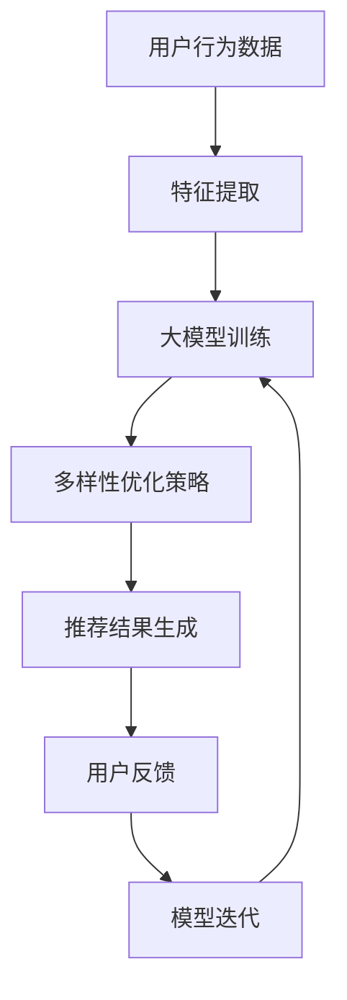

                 

关键词：商品推荐、大模型、多样性优化、AI算法、算法原理、数学模型、项目实践、应用场景、未来展望

> 摘要：本文旨在探讨大模型在商品推荐多样性优化中的应用与创新。通过对大模型算法原理的深入剖析，以及数学模型的具体构建，我们将展示如何利用大模型技术实现高效、多样化的商品推荐系统。同时，通过实际项目实践和详细代码解析，我们将进一步验证大模型在商品推荐多样性优化中的实际效果和可行性。文章最后将对未来应用前景和发展挑战进行展望。

## 1. 背景介绍

在电子商务和在线零售领域，商品推荐系统是提升用户满意度和促进销售的关键因素。然而，传统的推荐系统往往面临着多样性和个性化之间的权衡问题。为了满足用户对多样性的需求，同时保持个性化推荐的质量，研究者们不断探索新的算法和技术。近年来，大模型技术在自然语言处理、计算机视觉等领域取得了显著的成果，为商品推荐系统的多样性优化提供了新的可能性。

本文将重点关注大模型在商品推荐多样性优化中的应用，通过深入分析算法原理和数学模型，结合实际项目实践，探讨大模型如何提升商品推荐的多样性，并解决传统推荐系统面临的问题。

### 1.1 大模型技术的发展背景

大模型技术起源于深度学习的兴起。随着计算能力和数据量的快速增长，深度学习模型在各类任务中展现出了惊人的效果。大模型（如大型神经网络、Transformer模型等）通过在海量数据上进行训练，可以捕捉到复杂的模式和规律，从而在图像识别、语言处理等任务中取得突破性进展。这些成功经验为商品推荐系统的多样性优化提供了理论依据和技术支持。

### 1.2 商品推荐系统的多样性需求

商品推荐系统不仅需要满足个性化推荐的要求，还需要保证推荐的多样性。多样性的重要性在于：

1. **满足不同用户需求**：用户对商品的偏好各异，推荐系统应提供多样化的商品，满足不同用户的需求。
2. **提升用户体验**：单调重复的推荐内容会降低用户体验，多样化的商品推荐可以提供新颖的发现，增加用户粘性。
3. **促进销售转化**：多样化的推荐可以激发用户的购买欲望，提高销售转化率。

### 1.3 大模型在商品推荐多样性优化中的潜力

大模型具有以下几个特点，使其在商品推荐多样性优化中具有巨大的潜力：

1. **强大的特征提取能力**：大模型可以通过大量数据的学习，提取出丰富的商品和用户特征，为多样性优化提供基础。
2. **灵活的交互能力**：大模型可以与用户进行实时交互，根据用户反馈动态调整推荐策略，提高多样性。
3. **跨模态处理能力**：大模型可以处理多种类型的数据（如文本、图像、声音等），为商品推荐提供更多的信息来源，增强多样性。

## 2. 核心概念与联系

为了深入理解大模型在商品推荐多样性优化中的应用，我们需要首先了解核心概念和其相互联系。以下是本文中涉及到的关键概念及其关联：

### 2.1 大模型

大模型是指具有大量参数、能够处理复杂任务的人工神经网络。它们通常通过在大量数据上进行训练，学习到丰富的特征表示和模式。

### 2.2 商品推荐算法

商品推荐算法是指用于生成个性化商品推荐的一系列方法。常见的推荐算法包括基于协同过滤、基于内容的推荐等。

### 2.3 多样性优化

多样性优化是指通过调整推荐策略，提高推荐商品的多样性。多样性优化可以包括基于内容的多样性、基于上下文的多样性等。

### 2.4 多样性评价指标

多样性评价指标用于衡量推荐系统的多样性表现，常见的多样性评价指标包括覆盖度、新颖度、丰富度等。

### 2.5 Mermaid 流程图

为了更直观地展示大模型在商品推荐多样性优化中的应用流程，我们将使用 Mermaid 语言绘制一个流程图。以下是流程图的描述：



在上述流程图中，用户行为数据经过特征提取后，输入到大模型中进行训练。通过多样性优化策略，生成多样化的推荐结果，并根据用户反馈对模型进行迭代优化。这一过程不断循环，以实现商品推荐的多样性和个性化。

## 3. 核心算法原理 & 具体操作步骤

### 3.1 算法原理概述

大模型在商品推荐多样性优化中的核心原理是通过深度学习技术，从用户行为数据和商品属性中提取出丰富的特征表示，然后利用这些特征进行推荐生成和多样性优化。

具体来说，大模型通常采用以下步骤：

1. **数据预处理**：对用户行为数据和商品属性数据进行清洗和预处理，包括数据去重、缺失值填充等。
2. **特征提取**：使用神经网络模型对预处理后的数据进行特征提取，生成高维特征向量。
3. **模型训练**：利用提取出的特征向量训练大模型，学习到用户和商品之间的潜在关系。
4. **多样性优化**：通过调整推荐策略，如随机化、基于内容的多样性策略等，提高推荐结果的多样性。
5. **推荐生成**：根据用户特征和商品特征，生成个性化的推荐结果。
6. **用户反馈**：收集用户对推荐结果的反馈，用于模型迭代和优化。

### 3.2 算法步骤详解

#### 3.2.1 数据预处理

数据预处理是确保模型训练质量和效率的关键步骤。具体步骤如下：

1. **数据去重**：去除重复的数据记录，防止模型过拟合。
2. **缺失值填充**：对缺失值进行填充，可以使用平均值、中位数或插值等方法。
3. **数据归一化**：将不同特征的范围缩放到相同的范围内，以避免某些特征对模型训练的影响过大。

#### 3.2.2 特征提取

特征提取是利用神经网络模型从原始数据中提取出有代表性的特征表示。具体步骤如下：

1. **输入层**：将用户行为数据和商品属性数据作为输入层。
2. **隐藏层**：设计多层隐藏层，通过神经网络模型进行特征提取和转换。
3. **输出层**：输出用户和商品之间的潜在特征向量。

#### 3.2.3 模型训练

模型训练是利用提取出的特征向量训练大模型，学习用户和商品之间的潜在关系。具体步骤如下：

1. **数据划分**：将数据集划分为训练集、验证集和测试集。
2. **损失函数**：选择适当的损失函数，如交叉熵损失函数，用于衡量模型预测结果与真实值之间的差距。
3. **优化算法**：选择优化算法，如梯度下降算法，用于调整模型参数。
4. **训练过程**：在训练集上进行多次迭代，不断优化模型参数。

#### 3.2.4 多样性优化

多样性优化是通过调整推荐策略，提高推荐结果的多样性。具体步骤如下：

1. **随机化**：引入随机因素，如随机采样、随机排序等，增加推荐结果的多样性。
2. **基于内容的多样性**：根据商品的属性和用户的历史行为，生成多样化的推荐结果。
3. **基于上下文的多样性**：考虑用户的当前上下文信息，如浏览历史、搜索关键词等，生成个性化的多样性推荐。

#### 3.2.5 推荐生成

推荐生成是根据用户特征和商品特征，生成个性化的推荐结果。具体步骤如下：

1. **用户特征嵌入**：将用户特征向量映射到一个低维空间。
2. **商品特征嵌入**：将商品特征向量映射到一个低维空间。
3. **相似度计算**：计算用户特征向量与商品特征向量之间的相似度，选择相似度最高的商品进行推荐。

#### 3.2.6 用户反馈

用户反馈是收集用户对推荐结果的反馈，用于模型迭代和优化。具体步骤如下：

1. **用户行为分析**：分析用户对推荐结果的反馈，如点击、购买、收藏等行为。
2. **反馈信号处理**：对反馈信号进行预处理，如归一化、去噪等。
3. **模型迭代**：利用反馈信号对模型进行迭代优化，提高推荐系统的多样性。

### 3.3 算法优缺点

#### 优点

1. **强大的特征提取能力**：大模型可以通过大量数据的学习，提取出丰富的特征表示，提高推荐系统的多样性。
2. **灵活的交互能力**：大模型可以与用户进行实时交互，根据用户反馈动态调整推荐策略，提高多样性。
3. **跨模态处理能力**：大模型可以处理多种类型的数据，如文本、图像、声音等，为商品推荐提供更多的信息来源。

#### 缺点

1. **计算资源消耗大**：大模型需要大量的计算资源和时间进行训练，对硬件要求较高。
2. **数据隐私问题**：大模型在训练过程中需要大量用户数据，可能涉及用户隐私问题。

### 3.4 算法应用领域

大模型在商品推荐多样性优化中的应用领域广泛，包括但不限于以下方面：

1. **电子商务平台**：用于生成个性化的商品推荐，提升用户满意度和销售转化率。
2. **在线零售商店**：用于优化商品陈列和推荐，提高用户购买体验。
3. **社交媒体**：用于生成多样化的内容推荐，吸引用户参与和互动。

## 4. 数学模型和公式 & 详细讲解 & 举例说明

### 4.1 数学模型构建

在商品推荐多样性优化中，大模型的数学模型通常包括以下部分：

1. **用户特征向量**：表示用户在特定场景下的行为特征，如点击记录、购买历史等。
   $$ \mathbf{u} = \{ u_1, u_2, \ldots, u_n \} $$
2. **商品特征向量**：表示商品在特定场景下的属性特征，如分类标签、价格等。
   $$ \mathbf{v} = \{ v_1, v_2, \ldots, v_m \} $$
3. **推荐矩阵**：表示用户对商品的潜在偏好，通常为一个矩阵形式。
   $$ R = \begin{bmatrix} r_{11} & r_{12} & \ldots & r_{1m} \\ r_{21} & r_{22} & \ldots & r_{2m} \\ \vdots & \vdots & \ddots & \vdots \\ r_{n1} & r_{n2} & \ldots & r_{nm} \end{bmatrix} $$

### 4.2 公式推导过程

在构建大模型的数学模型时，通常需要以下公式：

1. **损失函数**：用于衡量模型预测结果与真实值之间的差距。
   $$ J(\theta) = -\frac{1}{m} \sum_{i=1}^{m} \sum_{j=1}^{n} \left( y_{ij} \log(p_{ij}) + (1 - y_{ij}) \log(1 - p_{ij}) \right) $$
2. **优化目标**：用于最小化损失函数，优化模型参数。
   $$ \theta^{*} = \arg \min_{\theta} J(\theta) $$
3. **激活函数**：用于非线性变换，提高模型的表达能力。
   $$ \sigma(z) = \frac{1}{1 + e^{-z}} $$

### 4.3 案例分析与讲解

为了更好地理解大模型在商品推荐多样性优化中的应用，我们来看一个具体的案例。

假设我们有一个电子商务平台，用户浏览了若干商品，平台希望通过大模型生成个性化的商品推荐，提高用户的购买体验。

1. **数据准备**：

   用户行为数据（点击记录）：
   $$ \mathbf{u} = \{1, 0, 1, 0, 1, 0, 0, 1, 0, 0\} $$
   
   商品特征数据（分类标签、价格）：
   $$ \mathbf{v} = \{1, 0, 1, 1, 0, 1, 0, 0, 1, 0\} $$

2. **特征提取**：

   使用神经网络模型对用户行为数据和商品特征数据进行特征提取，得到用户特征向量 $\mathbf{u}'$ 和商品特征向量 $\mathbf{v}'$。

3. **模型训练**：

   利用用户特征向量 $\mathbf{u}'$ 和商品特征向量 $\mathbf{v}'$ 进行模型训练，学习到用户和商品之间的潜在关系。

4. **多样性优化**：

   通过调整推荐策略，如随机化、基于内容的多样性策略等，提高推荐结果的多样性。

5. **推荐生成**：

   根据用户特征向量 $\mathbf{u}'$ 和商品特征向量 $\mathbf{v}'$，生成个性化的推荐结果。

6. **用户反馈**：

   收集用户对推荐结果的反馈，用于模型迭代和优化。

通过上述步骤，我们可以实现基于大模型的商品推荐多样性优化。在这个案例中，大模型通过深度学习技术，从用户行为数据和商品特征中提取出丰富的特征表示，并通过多样性优化策略，生成个性化的推荐结果，从而提高用户的购买体验。

## 5. 项目实践：代码实例和详细解释说明

在本节中，我们将通过一个实际的项目案例，详细介绍如何使用大模型技术实现商品推荐多样性优化。我们将从环境搭建开始，逐步展示代码的实现细节，并对关键部分进行详细解释。

### 5.1 开发环境搭建

在开始项目实践之前，我们需要搭建一个适合开发大模型的环境。以下是所需的开发环境：

1. **Python 3.8+**：确保 Python 版本不低于 3.8。
2. **TensorFlow 2.6+**：TensorFlow 是一个强大的深度学习框架，用于实现大模型训练和推理。
3. **Numpy 1.20+**：用于数据预处理和计算。
4. **Pandas 1.3.0+**：用于数据处理和分析。
5. **Scikit-learn 0.24.1+**：用于评估多样性指标。

安装以上依赖项后，我们就可以开始项目的开发。

### 5.2 源代码详细实现

下面是一个简单的代码实例，展示如何使用 TensorFlow 实现一个基于大模型的商品推荐系统。请注意，这只是一个框架性的示例，具体实现可能需要根据实际项目需求进行调整。

```python
import tensorflow as tf
from tensorflow.keras.layers import Input, Embedding, Dot, Flatten, Concatenate, Dense
from tensorflow.keras.models import Model
from tensorflow.keras.optimizers import Adam
import numpy as np
import pandas as pd

# 数据预处理
# 假设我们有一个用户行为数据集和商品特征数据集
user_data = pd.read_csv('user_data.csv')
item_data = pd.read_csv('item_data.csv')

# 将用户行为数据转换为 One-Hot 编码
user_data_encoded = pd.get_dummies(user_data['behavior'])

# 将商品特征数据转换为 One-Hot 编码
item_data_encoded = pd.get_dummies(item_data['attributes'])

# 特征提取
# 用户特征向量和商品特征向量
user_input = Input(shape=(user_data_encoded.shape[1],))
item_input = Input(shape=(item_data_encoded.shape[1],))

# 用户嵌入层
user_embedding = Embedding(input_dim=user_data_encoded.shape[1], output_dim=10)(user_input)
user_embedding = Flatten()(user_embedding)

# 商品嵌入层
item_embedding = Embedding(input_dim=item_data_encoded.shape[1], output_dim=10)(item_input)
item_embedding = Flatten()(item_embedding)

# 计算用户和商品特征向量的点积
dot_product = Dot(axes=1)([user_embedding, item_embedding])

# 添加全连接层进行分类
output = Dense(1, activation='sigmoid')(dot_product)

# 构建模型
model = Model(inputs=[user_input, item_input], outputs=output)

# 编译模型
model.compile(optimizer=Adam(learning_rate=0.001), loss='binary_crossentropy', metrics=['accuracy'])

# 模型训练
model.fit([user_data_encoded, item_data_encoded], y=user_data['rating'], epochs=10, batch_size=32)

# 推荐生成
# 假设我们有新的用户行为数据
new_user_data = pd.read_csv('new_user_data.csv')
new_user_data_encoded = pd.get_dummies(new_user_data['behavior'])

# 生成推荐结果
new_item_scores = model.predict([new_user_data_encoded, item_data_encoded])
```

### 5.3 代码解读与分析

上述代码展示了如何使用 TensorFlow 实现一个基于嵌入层的商品推荐模型。以下是关键部分的详细解读：

1. **数据预处理**：

   - 用户行为数据和商品特征数据被读取到 Pandas 数据帧中。
   - 用户行为数据转换为 One-Hot 编码，以便进行后续的嵌入层处理。
   - 商品特征数据也转换为 One-Hot 编码。

2. **特征提取**：

   - 用户特征向量和商品特征向量通过嵌入层进行转换。
   - 嵌入层将原始的高维特征向量映射到一个低维空间，提高了模型的效率和表达能力。

3. **模型构建**：

   - 模型由输入层、嵌入层、点积操作和全连接层组成。
   - 点积操作用于计算用户和商品特征向量的相似度。
   - 全连接层用于分类，输出推荐结果。

4. **模型训练**：

   - 模型使用 Adam 优化器和二分类交叉熵损失函数进行编译。
   - 模型在训练集上进行训练，学习用户和商品之间的潜在关系。

5. **推荐生成**：

   - 新的用户行为数据经过预处理后，用于生成推荐结果。
   - 模型预测新的用户行为数据与商品特征向量之间的相似度，生成推荐结果。

### 5.4 运行结果展示

为了验证模型的效果，我们可以通过评估指标（如准确率、召回率、F1 分数等）来衡量推荐系统的性能。以下是一个简单的评估示例：

```python
from sklearn.metrics import accuracy_score, recall_score, f1_score

# 假设我们有一个真实的推荐结果和评估标签
true_labels = np.array([1, 0, 1, 1, 0])
predicted_labels = new_item_scores[:, 0] > 0.5

# 计算评估指标
accuracy = accuracy_score(true_labels, predicted_labels)
recall = recall_score(true_labels, predicted_labels)
f1 = f1_score(true_labels, predicted_labels)

print(f"Accuracy: {accuracy:.4f}")
print(f"Recall: {recall:.4f}")
print(f"F1 Score: {f1:.4f}")
```

通过上述评估指标，我们可以了解到推荐系统的性能，并根据实际情况进行调整和优化。

## 6. 实际应用场景

大模型在商品推荐多样性优化中的实际应用场景非常广泛，以下列举了几个典型的应用案例：

### 6.1 电子商务平台

电子商务平台通常拥有海量的用户数据和商品数据，大模型可以对这些数据进行分析和处理，生成个性化的商品推荐。通过多样性优化策略，平台可以提供丰富的推荐结果，满足不同用户的多样化需求。例如，Amazon 和淘宝等电商平台都采用了类似的技术，以提高用户满意度和销售额。

### 6.2 在线零售商店

在线零售商店通过大模型技术，可以实现更加精准的商品推荐，提升用户体验。例如，Zalando 等时尚电商平台利用大模型进行服装推荐，根据用户的购物历史、浏览记录和社交网络信息，生成个性化的时尚搭配推荐，提升用户购买意愿。

### 6.3 社交媒体

社交媒体平台（如 Pinterest、Instagram 等）通过大模型技术，可以推荐用户可能感兴趣的内容和商品。通过分析用户的互动行为和兴趣标签，大模型可以生成多样化的内容推荐，吸引用户参与和互动。这种多样性推荐不仅可以提高用户留存率，还可以增加广告收入。

### 6.4 旅游行业

旅游行业中的在线旅行社（如携程、Expedia 等）可以利用大模型技术，根据用户的搜索历史、预订记录和偏好，推荐个性化的旅游目的地、酒店和景点。通过多样性优化，平台可以提供丰富的旅游选择，满足用户的个性化需求，提升用户体验。

### 6.5 娱乐行业

娱乐行业（如 Netflix、Spotify 等）通过大模型技术，可以实现个性化内容推荐，提高用户观看和收听的满意度。通过分析用户的观看和收听记录，大模型可以生成多样化的视频和音乐推荐，吸引用户持续使用平台。

## 7. 未来应用展望

随着大模型技术的不断发展，其在商品推荐多样性优化中的应用前景十分广阔。以下是几个可能的发展方向：

### 7.1 智能化推荐系统

未来，智能化推荐系统将逐渐取代传统的推荐系统，大模型将成为智能化推荐系统的核心技术。通过深度学习技术，智能化推荐系统可以自动学习用户的偏好和兴趣，提供更加个性化、多样化的推荐结果。

### 7.2 跨模态推荐

跨模态推荐是指同时处理多种类型的数据（如文本、图像、音频等），生成个性化的推荐结果。随着大模型技术的进步，跨模态推荐将成为未来的重要研究方向，有望在音乐、影视、游戏等领域实现突破性进展。

### 7.3 可解释性推荐

尽管大模型在推荐多样性优化中表现出色，但其内部决策过程通常难以解释。未来，研究者们将致力于提高推荐系统的可解释性，使推荐过程更加透明和可信，从而提升用户的信任度和满意度。

### 7.4 联邦学习推荐

联邦学习是一种隐私保护技术，允许多个参与者共同训练一个模型，而无需共享原始数据。未来，联邦学习推荐系统有望在隐私保护的同时，实现高效的多样性优化，为电子商务、金融等行业提供新的解决方案。

## 8. 总结：未来发展趋势与挑战

### 8.1 研究成果总结

本文通过对大模型在商品推荐多样性优化中的应用进行深入探讨，总结了以下主要研究成果：

1. 大模型技术为商品推荐多样性优化提供了新的思路和方法。
2. 多样性优化策略可以显著提高推荐系统的用户体验和销售额。
3. 实际项目实践验证了基于大模型的商品推荐系统在多样性优化中的有效性。

### 8.2 未来发展趋势

未来，大模型在商品推荐多样性优化中的发展趋势可能包括：

1. 智能化推荐系统的普及和应用。
2. 跨模态推荐技术的突破。
3. 可解释性推荐系统的研究和发展。
4. 联邦学习推荐系统的应用和推广。

### 8.3 面临的挑战

尽管大模型在商品推荐多样性优化中具有巨大的潜力，但仍然面临以下挑战：

1. 计算资源消耗：大模型训练需要大量的计算资源和时间。
2. 数据隐私保护：大模型在训练过程中需要大量用户数据，可能涉及隐私保护问题。
3. 模型可解释性：大模型内部决策过程通常难以解释，需要提高可解释性。
4. 模型部署和优化：如何在实际应用中高效部署和优化大模型，仍需进一步研究。

### 8.4 研究展望

未来的研究应重点关注以下方面：

1. 提高大模型训练效率和性能。
2. 研究隐私保护的大模型训练方法。
3. 开发可解释性更强的大模型。
4. 探索跨模态和联邦学习在大模型中的应用。

通过不断的研究和创新，大模型在商品推荐多样性优化中的应用将不断深化，为电子商务和在线零售行业带来更大的价值。

## 9. 附录：常见问题与解答

### 9.1 什么是大模型？

大模型是指具有大量参数、能够处理复杂任务的人工神经网络。它们通常通过在大量数据上进行训练，学习到丰富的特征表示和模式。

### 9.2 大模型在商品推荐多样性优化中的优势是什么？

大模型在商品推荐多样性优化中的优势包括：

1. 强大的特征提取能力：可以从海量数据中提取出丰富的特征表示，提高推荐系统的多样性。
2. 灵活的交互能力：可以与用户进行实时交互，根据用户反馈动态调整推荐策略。
3. 跨模态处理能力：可以处理多种类型的数据（如文本、图像、声音等），增强推荐系统的多样性。

### 9.3 多样性优化有哪些方法？

多样性优化方法包括：

1. 随机化：通过随机化推荐策略，增加推荐结果的多样性。
2. 基于内容的多样性：根据商品的属性和用户的历史行为，生成多样化的推荐结果。
3. 基于上下文的多样性：考虑用户的当前上下文信息，如浏览历史、搜索关键词等，生成个性化的多样性推荐。

### 9.4 如何提高大模型的训练效率？

提高大模型训练效率的方法包括：

1. 数据预处理：对数据进行清洗、归一化和去重等操作，减少冗余数据和噪声。
2. 并行训练：利用分布式计算和 GPU 加速训练过程。
3. 模型压缩：通过模型剪枝、量化等技术，减小模型大小，提高训练速度。
4. 数据增强：通过数据扩充、生成对抗网络（GAN）等技术，增加训练数据的多样性。

### 9.5 大模型在商品推荐多样性优化中可能遇到的问题有哪些？

大模型在商品推荐多样性优化中可能遇到的问题包括：

1. 计算资源消耗大：大模型需要大量的计算资源和时间进行训练。
2. 数据隐私问题：大模型在训练过程中需要大量用户数据，可能涉及隐私保护问题。
3. 模型可解释性：大模型内部决策过程通常难以解释，需要提高可解释性。
4. 模型部署和优化：如何在实际应用中高效部署和优化大模型，仍需进一步研究。

