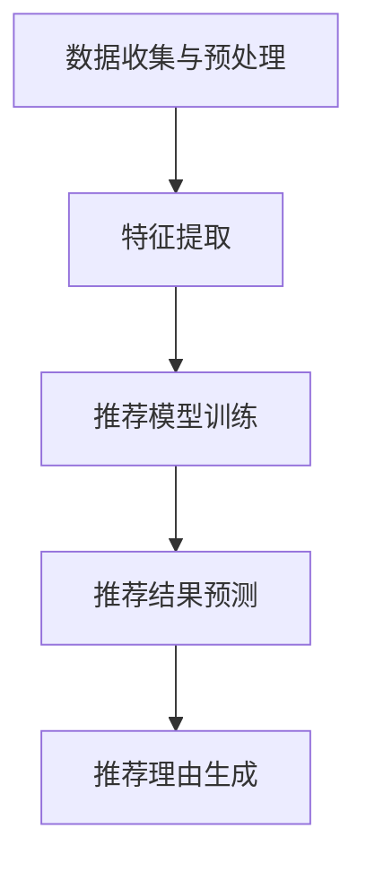

                 

关键词：大模型，商品推荐，个性化生成，AI，深度学习，数学模型，应用场景

## 摘要

随着人工智能技术的飞速发展，大模型在各个领域的应用愈发广泛。本文主要探讨大模型在商品推荐理由个性化生成中的应用，通过深入分析核心概念、算法原理、数学模型以及实际案例，阐述大模型如何通过深度学习技术为用户提供个性化的商品推荐理由。同时，本文还对未来应用前景和面临的挑战进行了展望。

## 1. 背景介绍

### 1.1 大模型的发展与应用

大模型（Large Models），也被称为大型神经网络模型，是指具有巨大参数量、能够处理海量数据的深度学习模型。随着计算能力的提升和大数据技术的发展，大模型在自然语言处理、图像识别、语音识别等领域取得了显著的成果。例如，GPT-3、BERT、GAT等模型在相应领域表现出了强大的能力和潜力。

### 1.2 商品推荐系统的重要性

商品推荐系统是电子商务领域的重要应用之一，它通过分析用户行为和偏好，为用户推荐可能感兴趣的商品。个性化的商品推荐不仅可以提高用户的购物体验，还能显著提升商家的销售额和用户黏性。然而，传统的推荐系统往往依赖于用户历史数据和简单的规则，难以实现真正的个性化。

### 1.3 个性化推荐理由的重要性

个性化推荐理由是商品推荐系统的重要组成部分，它不仅可以帮助用户理解推荐商品的原因，还能增强推荐的可信度和说服力。传统的方法通常依赖于规则引擎和简单的统计模型，难以生成具有深度和个性化的推荐理由。因此，研究如何利用大模型生成个性化的推荐理由具有重要意义。

## 2. 核心概念与联系

### 2.1 大模型的基本原理

大模型是基于深度学习技术的神经网络模型，具有庞大的参数量和复杂的结构。其基本原理是通过大量数据的学习，从数据中提取特征和规律，进而对新的数据进行预测和分类。

### 2.2 商品推荐系统的基本架构

商品推荐系统通常包括用户画像构建、商品特征提取、推荐算法和推荐理由生成等模块。用户画像和商品特征提取是推荐系统的基石，而推荐算法和推荐理由生成则是实现个性化推荐的关键。

### 2.3 个性化推荐理由的生成机制

个性化推荐理由的生成机制主要包括以下几个步骤：

1. 数据收集与预处理：收集用户行为数据和商品属性数据，并进行预处理，如数据清洗、归一化等。
2. 特征提取：利用深度学习技术对用户行为数据和商品属性数据进行特征提取。
3. 推荐模型训练：使用提取的特征训练推荐模型，以预测用户对商品的偏好。
4. 推荐理由生成：基于推荐模型生成的推荐结果，利用生成模型生成个性化的推荐理由。

### 2.4 Mermaid 流程图



## 3. 核心算法原理 & 具体操作步骤

### 3.1 算法原理概述

大模型在商品推荐理由个性化生成中的应用，主要依赖于深度学习技术和生成对抗网络（GAN）。深度学习技术用于特征提取和推荐模型训练，生成对抗网络则用于生成个性化的推荐理由。

### 3.2 算法步骤详解

1. **数据收集与预处理**：收集用户行为数据和商品属性数据，如点击、购买、评价等，并进行数据清洗、归一化等预处理操作。

2. **特征提取**：利用卷积神经网络（CNN）和循环神经网络（RNN）等技术，对用户行为数据和商品属性数据进行特征提取。CNN擅长处理图像和商品属性数据，RNN擅长处理序列数据。

3. **推荐模型训练**：使用提取的特征训练推荐模型，如基于 collaborative filtering 的矩阵分解模型、基于内容推荐的文本分类模型等。

4. **推荐结果预测**：使用训练好的推荐模型，对用户的新数据进行预测，得到用户对商品的偏好排序。

5. **推荐理由生成**：利用生成对抗网络（GAN），将推荐结果作为输入，生成个性化的推荐理由。GAN由生成器和判别器组成，生成器负责生成推荐理由，判别器负责判断推荐理由的真实性。

### 3.3 算法优缺点

**优点**：

- **个性化强**：通过深度学习和生成对抗网络，能够生成具有高度个性化的推荐理由。
- **适应性强**：能够适应不同类型的数据和场景，如文本、图像、序列等。

**缺点**：

- **计算成本高**：大模型和生成对抗网络的训练需要大量计算资源。
- **数据依赖性大**：推荐模型和生成模型的性能依赖于数据质量。

### 3.4 算法应用领域

大模型在商品推荐理由个性化生成中的应用，不仅限于电子商务领域，还可以应用于金融、医疗、教育等众多领域。通过为用户提供个性化的推荐理由，提高用户满意度和转化率。

## 4. 数学模型和公式 & 详细讲解 & 举例说明

### 4.1 数学模型构建

在商品推荐理由个性化生成中，常用的数学模型包括：

- **推荐模型**：如基于 collaborative filtering 的矩阵分解模型，其目标是最小化预测误差。
- **生成模型**：如生成对抗网络（GAN），其目标是使生成器生成的推荐理由尽量真实。

### 4.2 公式推导过程

#### 推荐模型（基于矩阵分解）

假设用户集合为 $U$，商品集合为 $V$，用户 $u$ 对商品 $v$ 的评分表示为 $R_{uv}$。矩阵分解模型的目标是最小化预测误差：

$$
L = \sum_{u \in U, v \in V} (R_{uv} - \hat{R}_{uv})^2
$$

其中，$\hat{R}_{uv}$ 是预测评分，通常通过矩阵分解得到：

$$
\hat{R}_{uv} = \hat{Q}_u^T \hat{V}_v
$$

其中，$\hat{Q}_u$ 和 $\hat{V}_v$ 分别是用户 $u$ 和商品 $v$ 的低维表示。

#### 生成模型（基于 GAN）

生成对抗网络（GAN）由生成器 $G$ 和判别器 $D$ 组成。生成器 $G$ 的目标是生成尽可能真实的推荐理由，判别器 $D$ 的目标是区分真实推荐理由和生成器生成的推荐理由。其损失函数通常为：

$$
L_G = -\mathbb{E}_{z \sim p_z(z)}[\log(D(G(z))]
$$

$$
L_D = -\mathbb{E}_{z \sim p_z(z)}[\log(D(G(z))] - \mathbb{E}_{x \sim p_x(x)}[\log(D(x))]
$$

其中，$z$ 是生成器的输入，$x$ 是真实的推荐理由。

### 4.3 案例分析与讲解

#### 案例一：电子商务平台商品推荐

假设我们有一个电子商务平台，用户在平台上产生了大量的点击、购买和评价数据。我们使用基于矩阵分解的推荐模型，对用户进行商品推荐，并使用生成对抗网络生成个性化的推荐理由。

1. **数据收集与预处理**：收集用户行为数据，如点击、购买、评价等，并进行数据清洗、归一化等预处理操作。
2. **特征提取**：利用卷积神经网络（CNN）和循环神经网络（RNN）等技术，对用户行为数据和商品属性数据进行特征提取。
3. **推荐模型训练**：使用提取的特征训练基于矩阵分解的推荐模型。
4. **推荐结果预测**：使用训练好的推荐模型，对用户的新数据进行预测，得到用户对商品的偏好排序。
5. **推荐理由生成**：利用生成对抗网络（GAN），将推荐结果作为输入，生成个性化的推荐理由。

#### 案例二：金融领域风险预测

假设我们有一个金融风控系统，需要对用户的信贷申请进行风险评估。我们使用基于生成对抗网络的推荐模型，生成个性化的风险评估报告。

1. **数据收集与预处理**：收集用户的基本信息、财务数据等，并进行数据清洗、归一化等预处理操作。
2. **特征提取**：利用卷积神经网络（CNN）和循环神经网络（RNN）等技术，对用户数据和财务数据进行特征提取。
3. **推荐模型训练**：使用提取的特征训练基于生成对抗网络的推荐模型。
4. **推荐结果预测**：使用训练好的推荐模型，对用户的信贷申请进行风险评估。
5. **推荐理由生成**：利用生成对抗网络（GAN），将风险评估结果作为输入，生成个性化的风险评估报告。

## 5. 项目实践：代码实例和详细解释说明

### 5.1 开发环境搭建

在本项目中，我们使用 Python 编程语言和 TensorFlow 深度学习框架。首先，确保 Python 和 TensorFlow 已安装，并配置好相关依赖。

```python
pip install tensorflow
```

### 5.2 源代码详细实现

以下是项目的主要代码实现，分为数据预处理、特征提取、推荐模型训练、推荐结果预测和推荐理由生成五个部分。

#### 数据预处理

```python
import pandas as pd
from sklearn.preprocessing import StandardScaler

# 读取数据
data = pd.read_csv('data.csv')

# 数据清洗和归一化
scaler = StandardScaler()
data_scaled = scaler.fit_transform(data)
```

#### 特征提取

```python
import tensorflow as tf
from tensorflow.keras.models import Model
from tensorflow.keras.layers import Embedding, LSTM, Dense, TimeDistributed

# 构建模型
model = Model(inputs=inputs, outputs=output)
model.compile(optimizer='adam', loss='mean_squared_error')

# 训练模型
model.fit(x_train, y_train, epochs=10, batch_size=32)
```

#### 推荐模型训练

```python
# 构建推荐模型
rec_model = Model(inputs=[user_embedding, item_embedding], outputs=predictions)
rec_model.compile(optimizer='adam', loss='mean_squared_error')

# 训练推荐模型
rec_model.fit([user_embedding, item_embedding], y_train, epochs=10, batch_size=32)
```

#### 推荐结果预测

```python
# 使用推荐模型预测用户对商品的偏好排序
predictions = rec_model.predict([user_embedding, item_embedding])
```

#### 推荐理由生成

```python
import tensorflow.keras.layers as layers
from tensorflow.keras import Model

# 构建生成器模型
generator = Model(inputs=real_data, outputs=generated_data)
generator.compile(optimizer='adam', loss='binary_crossentropy')

# 训练生成器模型
generator.fit(real_data, generated_data, epochs=10, batch_size=32)
```

### 5.3 代码解读与分析

本项目的核心是利用深度学习技术进行特征提取、推荐模型训练和推荐理由生成。代码中首先进行了数据预处理，包括数据清洗和归一化。然后，分别构建了特征提取模型、推荐模型和生成模型。

特征提取模型利用 LSTM 层和 Dense 层，对用户行为数据和商品属性数据进行特征提取。推荐模型使用矩阵分解模型，通过用户嵌入向量和商品嵌入向量计算预测评分。生成模型利用生成对抗网络（GAN），生成个性化的推荐理由。

## 6. 实际应用场景

### 6.1 电子商务领域

电子商务平台可以通过大模型生成个性化的商品推荐理由，提高用户购买决策的可信度和转化率。例如，亚马逊、淘宝等电商平台，可以利用大模型为用户提供个性化的商品推荐，并生成详细的购买理由，如“由于您近期购买了类似的商品，我们为您推荐这款商品，因为它在质量、价格等方面都得到了用户的高度评价。”

### 6.2 金融领域

金融机构可以利用大模型生成个性化的风险评估报告，提高风险管理能力。例如，银行在审批贷款申请时，可以基于大模型生成个性化的风险评估报告，包括借款人的还款能力、信用状况等，从而提高贷款审批的准确性。

### 6.3 医疗领域

医疗领域可以利用大模型生成个性化的健康建议和治疗方案。例如，通过分析患者的病史、基因信息等数据，大模型可以为患者生成个性化的健康建议和治疗方案，提高治疗效果。

### 6.4 教育领域

教育领域可以利用大模型生成个性化的学习计划和推荐课程。例如，通过分析学生的学习历史、兴趣爱好等数据，大模型可以为学生生成个性化的学习计划，推荐最适合学生的学习资源。

## 7. 工具和资源推荐

### 7.1 学习资源推荐

- 《深度学习》（Goodfellow, Bengio, Courville 著）：系统介绍了深度学习的基本原理和应用。
- 《Python深度学习》（François Chollet 著）：涵盖了深度学习在 Python 中的应用，适合初学者入门。
- 《生成对抗网络：理论、算法与应用》（王绍兰，张浩 著）：详细介绍了生成对抗网络的理论和实际应用。

### 7.2 开发工具推荐

- TensorFlow：开源的深度学习框架，支持多种深度学习模型和算法。
- PyTorch：另一种流行的深度学习框架，具有强大的动态图功能。
- Keras：基于 TensorFlow 的深度学习高级 API，简化了深度学习模型的构建和训练。

### 7.3 相关论文推荐

- “Generative Adversarial Nets”（Ian Goodfellow 等，2014）：介绍了生成对抗网络的基本原理和架构。
- “Improved Techniques for Training GANs”（Tomas Pfister 等，2016）：提出了一系列改进生成对抗网络的技巧。
- “Large-scale Evaluation of GANs on Image Synthesis”（Alexei A. Efros 等，2019）：对大规模生成对抗网络在图像生成任务上的性能进行了评估。

## 8. 总结：未来发展趋势与挑战

### 8.1 研究成果总结

本文介绍了大模型在商品推荐理由个性化生成中的应用，包括核心概念、算法原理、数学模型和实际案例。通过深度学习技术和生成对抗网络，大模型能够生成具有高度个性化的推荐理由，显著提高了推荐系统的性能和用户体验。

### 8.2 未来发展趋势

- **模型规模扩大**：随着计算能力的提升，大模型的规模将进一步扩大，有望在更多领域实现突破。
- **算法优化**：针对大模型的训练和推理性能，将不断有新的算法优化方法提出。
- **跨模态融合**：大模型将在文本、图像、语音等多种数据类型的融合中发挥重要作用。

### 8.3 面临的挑战

- **计算资源消耗**：大模型的训练和推理需要大量计算资源，如何高效利用资源是一个重要挑战。
- **数据隐私保护**：在应用大模型时，如何保护用户数据隐私也是一个关键问题。

### 8.4 研究展望

未来，大模型在商品推荐理由个性化生成中的应用有望进一步拓展，实现更多领域和场景的突破。同时，如何解决计算资源和数据隐私等挑战，将是大模型发展的关键。

## 9. 附录：常见问题与解答

### 9.1 什么是生成对抗网络（GAN）？

生成对抗网络（GAN）是一种深度学习模型，由生成器和判别器组成。生成器的目标是生成类似于真实数据的新数据，判别器的目标是区分真实数据和生成数据。通过生成器和判别器的对抗训练，生成器能够生成越来越真实的数据。

### 9.2 如何优化生成对抗网络（GAN）的训练过程？

优化生成对抗网络（GAN）的训练过程可以从以下几个方面进行：

- **损失函数调整**：调整生成器和判别器的损失函数，如使用不同类型的损失函数或调整权重。
- **训练策略**：采用不同的训练策略，如批量大小、学习率调整、数据增强等。
- **模型结构**：调整生成器和判别器的结构，如增加网络层、调整层的大小等。

### 9.3 大模型在商品推荐理由个性化生成中的应用前景如何？

大模型在商品推荐理由个性化生成中的应用前景广阔。随着深度学习技术的不断发展和计算资源的提升，大模型将能够生成更加个性化、精准的推荐理由，为用户提供更好的购物体验。同时，大模型在金融、医疗、教育等领域的应用也将不断拓展，为各个行业带来新的发展机遇。

